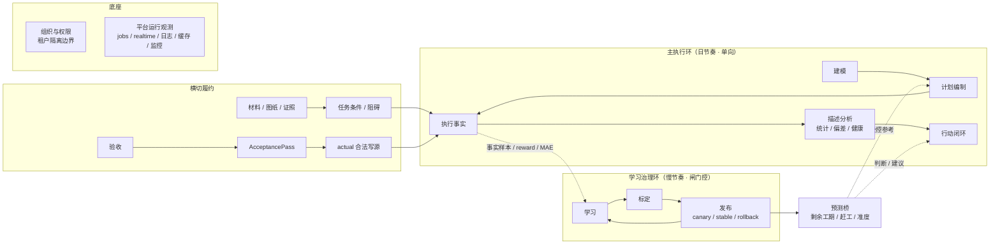

# v1.4.23.1 体系收口台账与验收门禁矩阵

> 2026-07-18 事实、归因与学习边界增量口径：当前共享工作树已在 `local-current-code` 完成任务事实写链、结构化原因和关闭结果收口。任务进度快照应用/触发器双写由 migration 316 退役；任务写入统一进入 finalize 链；WBS 对账、材料批量、图纸包和当前版本切换使用真实权限/事务/回滚边界。`structuredCauseAttributionService` 对 task/risk/issue/baseline_change 使用受控 taxonomy 和 candidate/confirmed/rejected 状态机，从项目内阻碍、条件、依赖、材料到货及预测因子推断候选；合同责任只允许用户明确确认。基线发布页按草案上下文预选原因，用户可改选并必须保留原因原话；后端 `/publish` 与兼容 `/confirm` 在同一事务更新基线、归档旧版本、新建 `baseline_publish` change log，并以该日志 ID 写 confirmed `baseline_change` attribution，任一步失败整体回滚。任务首次完成时先归因再采集工期样本，sample metadata 只保存 confirmed cause 的最小快照，candidate 只计数，人工责任不进入算法事实、fingerprint 或 benchmark key。风险/问题关闭必须提交实际结果、效果和 attribution ID；缺 source identity 的通知使用稳定 `content_fingerprint` 去重，六项 task-summary 指标改由服务层/metric registry 统一出口。8 个周期任务已各自进入独立 lease，日报任务在同一 lease/retry 边界先执行 task progress snapshot reconciliation，部分失败按失败任务处理。
> 2026-07-18 归因质量增量口径：migration 317 在候选行保留 `prefilled_cause_code`，人工确认时记录 `prefill_modified`；`structured_cause_other_rate` 与 `structured_cause_prefill_modification_rate` 已注册并通过项目/公司范围聚合。至少 20 个对应样本后，“其他”超过 20% 才形成 taxonomy 修订候选，预填修改超过 30% 才形成推断规则修订候选；候选信号不自动改历史事实或发布资产。以上仍仅为 `local-current-code`，migration 317/318 未在本任务 apply，不能声明 staging 或 production/live。
>
> 环境边界：当前配置真实 Supabase 只读 ledger 已确认 migration 305/307；使用 `workbuddy_runtime_login` 只读执行当前原因证据查询，目标任务 51 条证据完整返回。migration 316/317/318 尚未在该库 apply；本增量没有执行数据库写入、部署或 production/live 用户流程。因此只能标记 `local-current-code + real-DB-read-only schema/SQL compatible`，不得沿用历史 closeout 证据把本增量写成 deployed staging 或 production/live 已闭合。

## 0. 2026-06-01 final range-tree boundary (authoritative)

This v1.4-series plan follows the final range-tree model. There is no production history or existing user data that needs a compatibility layer.

Authoritative range-tree object types:
phase / section / building / basement / floor / physical_zone / functional_area

Deleted and forbidden as range-tree/runtime write concepts:one / region / professional / subproject / custom

Professional/system/domain/method semantics remain business facts through `specialty_type`, `engineering_category_id`, `standard_work_code`, template metadata, and project profile facts. They are not range-tree objects.

## 1. 定位与阅读约定

本文件是 `v1.4.23` 的附属收口文件，不新增独立业务体系，不改变任何既有章节的业务边界。

它只回答五个问题：

1. `v1.4` 系列每个体系是否已经有前端、后端、数据库 / 迁移、测试 / CI、验收口径。
2. 跨章节是否存在重复入口、重复真值、重复统计、重复待办、重复治理链。
3. 哪些缺口应补代码、哪些缺口应补文档、哪些缺口应补 CI 门禁。
4. 哪些历史兼容、旧字段、旧接口、旧页面入口已经废止或只保留只读迁移用途。
5. 哪些能力具备"事实层 → 当前状态评判 → 过去偏差归因 → 未来趋势 / 工期预测 → 行动建议"的可消费边界，可被 v1.5 页面作为 `production-ready` 主能力消费；哪些必须降级为 `needs-gating / not-ready / display-only`。

本文件不是执行方案主线，不进入普通产品页面，不作为用户可见功能清单。

本文件按“终态口径 → 当前边界 → 外部门禁 → 消费约束”的顺序组织。凡是描述当前代码、现网证据、门禁通过与否的内容，默认只用于界定边界；凡是描述长期归属、废止口径、不可回流规则的内容，默认都是终态约束；凡是描述后续动作的内容，默认都是外部门禁条件，不构成进度承诺。

### 1.1 阅读分层

| 层级 | 含义 | 典型章节 | 误读防护 |
|---|---|---|---|
| 终态口径 | 永久有效的边界、归属和废止规则，不随阶段推进变化 | 0、2、4.7.1、4.7.2、4.7.2a、4.7.2b、6 | 不可因为“待验证”就把终态口径读成执行结果 |
| 当前边界 | 当前代码、门禁、台账、快照、live 证据能支持的消费上限 | 1.2、3、4.7.05、4.7.3、4.8-4.13 | 仅代表当前时点的边界，不可倒推为永久可用 |
| 外部门禁 | 仍需真实环境验证、回放、压测、审批、发布或回滚归档的条件 | 5 | 不可把门禁条件读成未展开待办或已关闭缺口 |

本文件里的“收口”只指边界、归属、去向和消费约束已经说清；不指当前代码、live 验证或 CI 已全部通过。执行状态仍由对应 `C-xx` 条目、实施方案和门禁报告单独裁定。

### 1.2 C-17 / C-18 / C-18.L 商业化缺陷与验收尾项边界快照

2026-06-30 staging closeout fresh verification 口径覆写（C-15 证据硬化后）：本文件此前所有“C-15 未通过 / openGateCount=1 / MAE 持平”或未经硬化验证的当前态描述，若未明确标注为历史快照，均以 `project-testing/reports/release-20260630-live-closeout-staging` 的 fresh staging evidence 为准。当前 `closeout-decision.fresh.json` 为 `status=pass / mayCloseAll=true / openGateCount=0`；`c18-l07-l15-live-diagnostics-evidence-validation.fresh.json`、`c15-live-learning-closeout-evidence-validation.fresh.json`、`c19-runtime-publication-release-rollback-evidence-validation.fresh.json`、`old-object-physical-drop-closeout-evidence-validation.fresh.json` 四个 gate 均为 `validationStatus=pass / mayClose=true / failureCount=0`。C-15 本轮 `c15-writer-result.json` 与 `c15-reward-mae-quality-readback.json` 读回 `maeBefore=0.64 / maeAfter=0.59 / evaluatedDecisionCount=1`，可证明本轮受控样本 closeout 已满足严格改善，但不得外推为未来任意样本、任意环境或无人审阅自动排程均已权威。旧对象关闭方式仍为 `no_safe_candidate`，`physicalDropExecuted=false`，不得宣称已执行物理 DROP；后续若出现新的 rowCount=0 且 dependency clean 的候选对象，仍必须重新进入受控 drop migration、回滚和 post-drop smoke 流程。

2026-06-29 晚间 Advisor live catalog 口径修正（历史快照，已被 2026-06-30 staging closeout 覆写）：后续 Supabase Advisor 截图和 live catalog 复核又暴露 **31 张 live catalog `relrowsecurity=false` 表**，这 **不是 Supabase Advisor 缓存**，而是超出 `252_v14231_advisor_public_rls_remaining_closeout.sql` 16 表范围的新 public RLS surface。因此，当轮 `openGateCount=0 / mayCloseAll=true` 只能作为 handoff 历史证据；迁移治理和 Advisor 安全面结论当时重新打开并补入 `253_v14231_advisor_public_rls_live_catalog_closeout.sql`。`253` 当轮已完成 apply、`public.schema_migrations` ledger 和 catalog readback；`migrate:check` / `migrate:drift` 已通过，31 张表均读回 `relrowsecurity=true / relforcerowsecurity=true / policy_count>=2`，且全 public catalog 复核 `relrowsecurity=false` 表数为 0。但当时仍缺 Advisor 复扫证据，因此该段不得作为当前 blocker 或当前完成率口径继续引用。

2026-06-30 staging Advisor / migration governance closeout 覆写：当前测试目标使用 staging Supabase `workbuddy-staging` 与 `deploy/env/staging.env`，已 apply 并 ledger `259_v14231_supabase_advisor_security_closeout.sql`；`public.schema_migrations` readback 为 `276` 行，`migrate:plan` pending 0，`migrate:check -- --allow-pending`、`migrate:diagnose`、`migrate:drift` 均通过。`project-testing/reports/release-20260630-live-closeout-staging/migration-governance.runtime.json` 读回关键迁移 `245 / 246 / 247 / 248 / 249 / 250 / 252 / 253 / 259` 均 ledgered，`schemaDrift.unexplainedDriftCount=0`，`closeoutReadback.advisorPass=true / allowValidate=true / allowWarmup=true / allowScheduler=true`；`migrate:production-governance -- --evidence-file .../migration-governance.runtime.json` 返回 closed。Supabase CLI Advisor rescan 证据为 `project-testing/reports/release-20260630-live-closeout-staging/supabase-db-advisors-evidence.json`：`issueCount=1056 / securityIssueCount=0 / performanceIssueCount=1056 / rlsIssueCount=403`。这关闭的是 staging 安全 / RLS blocker 和本轮 MG-01 至 MG-07 验收，不表示 performance Advisor 全清，也不表示 production 已完成同轮发布验收。

2026-07-04 post-278 生产迁移治理当前覆写：上述 post-277 `live_advisor_rescan_missing` 快照已被生产项目 `wwdrkjnbvcbfytwnnyvs` 的正式 Management API Advisor export 覆写。`278_v14231_post277_advisor_security_rpc_acl_closeout.sql` 已在 production apply / ledger；正式 export 归档为 `project-testing/reports/production-migration-governance/supabase-advisor-management-api-export.post278.production-wwdrkjnbvcbfytwnnyvs.json`，读回 `source=management_api / environment=production / securityIssueCount=0 / performanceIssueCount=1136`；当前 production evidence 为 `project-testing/reports/production-migration-governance/evidence.post278.production.with-advisor-export.json`，`schemaMigrationsRowCount=295 / keyCatalogMatches=true / advisorPass=true`。`npm.cmd run migrate:production-governance --workspace=server -- --evidence-file ../project-testing/reports/production-migration-governance/evidence.post278.production.with-advisor-export.json` 返回 `status=closed`，MG-01 至 MG-07 全部 pass，MG-07 `reasonCodes=[]`，当前布尔为 `allowValidate=true / allowWarmup=true / allowScheduler=true`。生产 scheduler / warmup 只允许通过只读挂载 evidence 打开，证据缺失、过期或非 closed 时仍 fail-closed。`performanceIssueCount=1136` 不属于 MG-07 放行条件，继续进入 v1.4.24 的 PB-08 / G6 性能治理；不得把它写成性能 hardening 已完成。

2026-06-30 WBS 默认住宅主计划入口收口，2026-07-04 资产驱动口径覆写：`/api/planning/wbs-templates/bootstrap/from-template` 对住宅项目 + 住宅模板不再使用 `planningBootstrap.buildBaselineItemsFromTemplateNodes` 的旧串行摊排作为默认施工主计划，而是调用既有 `generateWbsTemplateRows` 的 `managed_frontier` 主计划管线；`residential_master_plan_v2` 仅保留为显式入口模板兼容标记，住宅可见候选行级来源收紧为 `asset_backed_default_master_plan`，工期校准来源为 `standard_work_duration_seed+t2_rhythm_template+real_plan_evidence`，工期真值边界为 `asset_backed_candidate_master_plan / L1`。接口筛选 `schedule_row / primary_schedule` 物化为 `task_baselines` + `task_baseline_items` 草稿，并返回 `generation_depth=managed_frontier` 与 no-write mutation boundary。旧串行摊排不得作为低信息模板草稿、老模板反推或人工对照的回退路径；2026-07-01 起低信息旧模板、老模板反推和人工对照也不得再由项目业态事实托底接管，必须直接失败并返回 `DEFAULT_MASTER_PLAN_PROFILE_REQUIRED / managedFallbackRemoved=true`，只有显式选择匹配业态的默认主计划入口模板才能生成候选 baseline draft。该改动只生成候选 baseline draft，不写 `tasks`、`task_dependencies`、confirmed baseline、月计划、critical path、生产 seed 或 runtime publication；`GENERATION_DEPTH_TRUST_REVIEW_REQUIRED` 仍表示需项目经理复核、真实样本校准、runtime publication 和后续治理，不能宣称 production-ready 施工计划。

2026-07-01 WBS 默认主计划第 2 阶段接入，2026-07-04 住宅来源口径修正：`/api/planning/wbs-templates/bootstrap/from-template` 已从住宅专用判定扩展为正式业态 profile 判定。住宅以 `residential_master_plan_v2` 作为入口模板标记，但实际候选行级来源为 `asset_backed_default_master_plan`；医院、酒店、学校、工业、数据中心、交通枢纽、体育文化、TOD 上盖、改造修缮、模块化建筑等非住宅正式业态在项目事实与显式默认主计划入口模板能识别为默认主计划时，统一走 `managed_frontier_default_master_plan`，复用 `buildTemplateRecommendation(...) -> buildWizardTemplateSelection(...) -> generateWbsTemplateRows(...)` 现有工期/范围/模板资产，只物化 `schedule_row / primary_schedule` 到候选基线草稿。未能识别项目业态事实、模板不是显式默认主计划入口，或模板业态与项目业态冲突时，接口返回 `DEFAULT_MASTER_PLAN_PROFILE_REQUIRED`，不得再落旧串行摊排、managed fallback、回退或人工对照输出。该阶段仍不写 `tasks`、`task_dependencies`、confirmed baseline、月计划、critical path、生产 seed 或 runtime publication；通用业态 profile 仍需后续深化现场节奏、专业穿插和工期证据后才能升级可用等级。

2026-07-01 WBS 默认主计划第 3 阶段业态 profile overlay 接入，2026-07-02 行级来源收紧，2026-07-04 住宅资产驱动来源收紧：`generateWbsTemplateRows(...)` 已在同一 managed-frontier 主计划管线内追加业态 profile overlay，不是新建第二套生成器。住宅由 `residential_master_plan_v2` 入口模板触发，但公开候选行级来源为 `asset_backed_default_master_plan`；10 个非住宅正式业态（酒店、医院、学校、工业、数据中心、交通枢纽、体育文化、TOD 上盖、改造修缮、模块化建筑）各保留 4 条行业专项主计划行，用来补足通用土建/机电骨架之外的关键现场内容，最新样例均为 16 条候选 `schedule_row`。非住宅候选行的公开 `source_type / generation_metadata.source` 统一为 `managed_frontier_default_master_plan`；`business_type_base_master_plan_profile_v1 / business_type_master_plan_profile_v1` 只保留在 `profile_source_type` 与 `businessTypeMasterPlan.profileSourceType` lineage 中，不能再作为生产候选行级来源。当前医院 profile 覆盖医技楼、手术部洁净装修、医疗气体、医疗专项调试/卫生专项验收；数据中心 profile 覆盖机房白区装修、供配电 UPS/柴油发电、制冷/精密空调、综合联调、带载负载测试与投产验收移交。业态专项验收 / 移交行会覆盖同阶段通用 `acceptance_handover` 行，并继承通用末端 commissioning / outdoor 前置和更晚窗口，避免学校等业态同时出现“竣工验收与移交准备”和“竣工验收与开学移交准备”两条终点行。overlay 执行位置在住宅资产驱动主计划之后、master-plan compaction / limit / sort / governance warning 之前，因此仍复用现有工期字段、候选 duration suggestion、master-plan limit 和 no-write mutation boundary。每条 profile 行在 `values.business_type / values.business_type_code` 明确标记业态，供 UI、报告和治理台按业态过滤。验证：`wbsTemplateManagedFrontierGeneration.test.ts` 的医院/数据中心专项断言、10 个非住宅业态 explicit profile lineage 断言、11 业态 managed-frontier 断言、学校专项移交覆盖通用移交断言和 `wbsTemplatesApply.test.ts` route 接入断言通过；`project-testing/tools/generate-default-master-plan-profile-report.mjs` 已输出 `project-testing/reports/default-master-plan-profiles/default-master-plan-profile-samples.md` 与 JSON，10 个非住宅业态均为 `candidate_master_plan_reviewable`。该阶段仍是 candidate/default master-plan preview，不写生产表，不关闭真实 runtime publication 或项目经理复核门禁。

2026-07-07 WBS 默认主计划 runtime publication 服务硬门补强：`wbsTemplateRuntimePublicationService.persistWbsTemplateRuntimePublication(...)` 已纳入 `default_master_plan` asset kind，但该入口只接受已形成生产证据链的默认主计划运行时发布。即使 readiness 被标记为 `default_master_plan_publication_ready`，服务仍必须同时校验项目 scope、`defaultMasterPlanLineage.projectId` 与发布 `projectId` 一致、PM 复核 evidence ref、工期校准 evidence ref、依赖 writer evidence ref、dependency writer release record target、publication key 和 rollback target；缺失或 project identity mismatch 时返回 `blocked`，不调用 SQL，不写 `wbs_template_runtime_publications`。消费侧 `resolveWbsTemplateRuntimePublication(...)` 读取 `default_master_plan` 时也必须带 project scope；无 projectId 的 company-level 读取只能返回 non-consumable，防止项目级默认主计划 runtime 被跨项目消费。该补强只关闭候选证据跨项目误发布、缺证据假绿和消费侧 scope 漏传路径，不把当前 staging / candidate default master-plan 升级为 production-ready；post-publish smoke、critical-path readback、rollback 和真实 production/live outcome 仍是后置门禁。

2026-07-01 WBS 默认主计划第 4 阶段旧串行路径删除守卫，2026-07-02 显式入口白名单修正，2026-07-03 证据链隐藏旧标记与前端缺包兜底收紧：`/api/planning/wbs-templates/bootstrap/from-template` 已删除旧串行模板回退，不再返回 `legacy_template_serial_fallback`、`legacy_fallback` 或 `fallback_policy`。低信息模板草稿、老模板反推和人工对照场景不再由项目业态事实接管到 `residential_master_plan_v2 / managed_frontier_default_master_plan`；模板不是显式默认主计划入口、无法识别业态事实或业态冲突时直接返回 `DEFAULT_MASTER_PLAN_PROFILE_REQUIRED`，响应带 `legacyFallbackRemoved=true / managedFallbackRemoved=true`，并保持 no-write，不创建候选基线草稿。“显式默认主计划入口”只能是系统 scope 且 `standard_catalog_code` 命中白名单：`residential_master_plan_v2`、`managed_frontier_default_master_plan` 或 10 个正式非住宅业态的 `<business_type>_master_plan_entry`；不得再用 `default_master_plan` / `master_plan_entry` 字符串包含匹配作为入口。`default_master_plan_generic_entry` 等泛入口即使模板名称、类型或分类写着住宅 / 医院，也必须直接失败，不能托底生成候选。证据链输入层同步拦截 `handoffGenerationMode`、`controlledDegradation`、`fallbackApplied`、`scenarioType` 等隐藏字段中的旧串行、低信息、老模板反推、人工 / human comparison 标记；其中 `fallbackApplied / fallback_applied` 不只识别布尔 true，若字段值直接携带 `manual_comparison_scenario`、`low_information_template_draft` 等字符串来源标签，也必须按旧来源信号处理。这些标记即使外层 `source_version_label=managed_frontier_default_master_plan` 也必须 disqualified / blocked，不能作为 production source export、dependency writer、runtime publication 或 readiness 证据。`business_type_base_master_plan_profile_v1 / business_type_master_plan_profile_v1` 只允许作为 profile lineage，若作为公开行级 `source` 仍直接 blocked。候选发现阶段还必须读取 `task_baseline_items.generation_metadata` 的行级来源信号；若 baseline 表层 `source_version_label` 合格但 item metadata 隐藏 option-comparison、manual comparison、low-information 或 fallback 标记，必须在 discovery 阶段 disqualified，不能等到 export / writer 才阻断。discovery 与 candidate export 采用同一 profile lineage 归一化口径：`business_type_base_master_plan_profile_v1 / business_type_master_plan_profile_v1` 仅作为 `profileSourceType / businessTypeMasterPlan.profileSourceType` 审计来源，不得被误判为 active production row source。`constructionOrganizationPlanNetworkDomainWriter.applyApprovedDraft` 也已增加 writer 层来源边界：即使调用方绕过 draft service 和 review package，把 `construction_organization_plan_network_option_comparison_package`、`option_comparison_package_is_read_only`、`manual_comparison` 等标记伪装成 ready draft，writer 仍直接返回 `runtime_apply_blocked`，理由为 `option_comparison_package_cannot_materialize_runtime / manual_comparison_source_cannot_materialize_runtime`，且不查询 DB、不写 `task_dependencies`、不持久化 runtime publication。前端治理读模型同步取消 `frontend_fallback_from_draft_read_model` 对照包合成；后端缺少 `optionComparisonPackage` 时只返回 `backend_option_comparison_package_missing_direct_failure` 的 0 项只读缺失包，不再把 draft items 拼成候选对照方案。验证：`wbsTemplatesApply.test.ts` 覆盖低信息旧模板、业态冲突模板、非系统同业态模板、非 default-master-plan 系统模板、无法识别业态入口，以及“generic default master-plan entries even when their text matches the project business type”负例；`discover-default-master-plan-production-candidates.test.mjs` 与 `export-default-master-plan-candidate-baseline.test.mjs` 覆盖隐藏旧标记、baseline item metadata 隐藏 option-comparison 包、合法 profile lineage 归一化和 profile lineage 防污染；source export、production evidence pipeline、dependency writer evidence、runtime publication evidence、evidence source checker 的测试覆盖 `fallbackApplied` 字符串藏匿旧来源的 fail-closed 负例；`constructionOrganizationPlanNetworkDomainWriter.test.ts` 覆盖 writer 层绕过阻断；`ruleAssetGovernanceWorkbenchApi.test.ts` 覆盖前端不再合成缺失 option-comparison 包；`check-default-master-plan-production-readiness.mjs` 静态门禁同步锁定 `EXPLICIT_DEFAULT_MASTER_PLAN_ENTRY_CODES`、禁止恢复泛 contains 匹配，并锁定 writer/front-end/source-guard/discovery metadata guard 覆盖。该守卫不写 `tasks`、`task_dependencies`、confirmed baseline、月计划、critical path、生产 seed 或 runtime publication。

2026-07-03 WBS 默认主计划第 4B 阶段证据链嵌套来源别名防线补强：继续复核发现，旧来源标记除 `originalSource / fallbackApplied` 外，还可能藏在 `sourceMetadata / source_metadata`、`runtimeLineage / runtime_lineage`、`sourceLineage / source_lineage`、`templateSource / template_source`、`originSource / origin_source`、`scenarioSource / scenario_source` 等嵌套来源容器里。`project-testing/tools/default-master-plan-source-guard.mjs` 已新增受控结构化来源扫描，仅扫描来源语义字段和来源容器，排除 `sourcePath / evidenceRef / sha256 / url` 等证据定位字段，避免把 manifest 导出记录类型或文件路径误判为生成来源。该扫描已接入 candidate export、PM review package、PM review evidence builder、candidate discovery、production source export、production evidence pipeline、dependency writer evidence、runtime publication evidence、evidence source checker 以及 server 侧 `defaultMasterPlanDependencyWriterEvidenceFlowService`；共享 `sourceExportMetadataBlockers(...)` 进一步扫描 source export payload rows 中的生成来源字段，使 duration samples、task dependencies、runtime publications、review change logs 和 smoke / rollback exports 直接运行 builder 时也会拦截 `sourceMetadata/sourceLineage/runtimeLineage/fallback/originalSource` 藏匿旧来源。为避免误伤 staging 受控 replay，普通 `metadata.source=default_master_plan_staging_runtime_writer` 只作为环境 / replay 标记，不作为生成来源；真正的生成来源仍必须放在显式来源字段并接受 fail-closed 扫描。`business_type_base_master_plan_profile_v1 / business_type_master_plan_profile_v1` 仍只允许作为 profile lineage，不能作为公开行级生产来源。新增回归覆盖 nested `sourceMetadata / runtimeLineage / sourceLineage` 中的 `legacy_template_reverse_inference / low_information_template_draft / manual_comparison_scenario / human_comparison_package / option_comparison_package`，并补充 PM review export、duration sample export 和 smoke export 行级 `sourceMetadata.sourceLineage` 藏 `manual_comparison_scenario` 时对应 builder 必须 blocked，不能关闭 PM / duration / smoke gate，同时保留 profile lineage 正向归一化。验证：`evidence:default-master-plan:test-concurrent` 通过 210 个 Node tests + 26 个 server tests；`server` typecheck 通过。该补强仍只强化 fail-closed 防污染和证据链可信度，不写生产表，不执行真实 runtime writer，不关闭 production-ready。

2026-07-03 WBS 默认主计划第 4C-1 阶段 runtime publication source-export 别名补强：继续按证据链绕过面复核时发现，`sourceExportMetadataBlockers(...)` 已扫描 `wbs_template_runtime_publications / wbsTemplateRuntimePublications`，但未扫描 `runtime_publications / runtimePublications` 这两个 runtime publication 导出数组别名；当导出包第一条选中发布行干净、后续行在 `sourceMetadata.sourceLineage` 藏 `manual_comparison_scenario` 时，runtime publication builder 可能只凭选中行通过，未由共享 metadata guard 对整包 fail-closed。`project-testing/tools/default-master-plan-source-export-metadata.mjs` 已将 `runtime_publications / runtimePublications` 纳入 payload row 扫描，`build-default-master-plan-runtime-publication-evidence.test.mjs` 新增 camelCase `runtimePublications` 行隐藏 retired lineage 的红绿回归，`check-default-master-plan-production-readiness.mjs` 静态门禁新增 `sourceExportMetadataScansRuntimePublicationAliases` coverage。该补强只关闭 source-export 别名绕过，不写真实表，不执行 runtime writer，不把当前 staging controlled replay 升级为 production-ready。

2026-07-03 WBS 默认主计划第 4C-2 阶段 source label 数组绕过补强：继续复核发现共享 `defaultMasterPlanStructuredSourceSignals(...)` 对相关 source/lineage/template 字段中的对象能递归扫描，但当旧来源藏在 `sourceLabels / sourceAliases / templateAliases` 等字符串数组中时，数组元素会被递归成空信号，导致 `manual_comparison_scenario / low_information_template_draft / legacy_template_serial_fallback` 可能不被 source guard 识别。`project-testing/tools/default-master-plan-source-guard.mjs` 现在对相关字段下的字符串 / 布尔 / 数字数组元素直接作为 source signal 返回；`default-master-plan-source-guard.test.mjs` 新增 source/template label arrays 隐藏 retired 来源的红绿回归。该补强使数组别名中的低信息草稿、老模板反推和人工对照来源继续直接 fail-closed，不进入 candidate discovery、candidate export、PM review package、handoff 或 production evidence 链。验证：`node --test project-testing/tools/default-master-plan-source-guard.test.mjs` 8/8 pass；`npm run evidence:default-master-plan:test-concurrent` 211/211 Node tests + 26/26 server WBS tests pass；`npm run typecheck --workspace=server` 通过。该补强不写真实表、不执行 runtime writer、不把当前 staging controlled replay 升级为 production-ready。

2026-07-03 WBS 默认主计划第 4C-3 阶段 stringified source metadata 绕过补强：继续复核发现旧来源还可能藏在 JSON 字符串字段内，例如 `sourceMetadata='{"sourceLabels":["manual_comparison_scenario"]}'`、`fallbackApplied='{"sourceAliases":["low_information_template_draft"]}'` 或 `runtime_lineage='{"templateAliases":["legacy_template_serial_fallback"]}'`。此前 `defaultMasterPlanStructuredSourceSignals(...)` 在相关字段值为 JSON 字符串时会把解析后的对象继续递归，但 `fallbackApplied` 会把整段 JSON 字符串当作普通 label，且普通相关字段里的 JSON 字符串不会继续解析其内部数组，导致低信息草稿、老模板反推、人工对照来源可能绕过 fail-closed。现在相关字段中的 JSON 字符串会继续递归解析，`fallbackApplied` 若是 JSON 对象 / 数组则不再把整段字符串作为 label，而交给 structured source scanner 解析内部 source signal。`default-master-plan-source-guard.test.mjs` 新增 stringified source metadata arrays 红绿回归。验证：`node --test project-testing/tools/default-master-plan-source-guard.test.mjs` 9/9 pass；`npm run evidence:default-master-plan:test-concurrent` 212/212 Node tests + 26/26 server WBS tests pass；`npm run typecheck --workspace=server` 通过。该补强不写真实表、不执行 runtime writer、不把当前 staging controlled replay 升级为 production-ready。

2026-07-03 WBS 默认主计划第 4C-4 阶段 stringified JSON array source metadata 绕过补强：继续复核发现旧来源还可藏在整段 JSON 数组字符串内，例如 `sourceMetadata='[{"source":"manual_comparison_scenario"},{"sourceAliases":["low_information_template_draft"]}]'` 或 `fallbackApplied='["legacy_template_serial_fallback"]'`。此前 `readObject(...)` 会丢弃数组，导致 `defaultMasterPlanStructuredSourceSignals(...)` 对 JSON 数组字符串返回空信号。现在新增 structured JSON 解析路径，字符串若解析为对象或数组都会继续递归扫描；普通非 JSON 字符串仍按既有 label 处理。`default-master-plan-source-guard.test.mjs` 新增 stringified JSON array source metadata 红绿回归。验证：`node --test project-testing/tools/default-master-plan-source-guard.test.mjs` 10/10 pass；`npm run evidence:default-master-plan:test-concurrent` 213/213 Node tests + 26/26 server WBS tests pass；`npm run typecheck --workspace=server` 通过。该补强不写真实表、不执行 runtime writer、不把当前 staging controlled replay 升级为 production-ready。

2026-07-03 WBS 默认主计划第 4C-5 阶段 marker/tag/flag/label/alias 字段绕过补强：继续复核发现旧来源不一定只藏在 source/lineage/template 字段里，也可能藏在 `generationMarkers / evidenceTags / qualityFlags / sourceLabels / sourceAliases / templateAliases` 等 marker、tag、flag、label、alias 字段中。此前 `isDefaultMasterPlanSourceSignalKey(...)` 不扫描 marker/tag/flag/label/alias，导致 `manual_comparison_scenario / low_information_template_draft / legacy_template_serial_fallback` 可能作为“标记/标签”绕过 fail-closed。现在这些字段名被纳入 source-signal 候选，同时仍排除 path/ref/url/sha/hash，避免把证据路径当来源。`default-master-plan-source-guard.test.mjs` 新增 marker flag tag and alias fields 红绿回归。验证：`node --test project-testing/tools/default-master-plan-source-guard.test.mjs` 11/11 pass；`npm run evidence:default-master-plan:test-concurrent` 214/214 Node tests + 26/26 server WBS tests pass；`npm run typecheck --workspace=server` 通过。该补强不写真实表、不执行 runtime writer、不把当前 staging controlled replay 升级为 production-ready。

2026-07-03 WBS 默认主计划第 4C-6 阶段治理字段来源防绕过补强：继续复核发现旧来源还可能藏在 `comparisonBasis / boundaryPolicy / decisionReasons / reviewProof / handoffEvidence`，以及 `sourceKind / sourceType / sourceStatus` 等 basis、policy、reason、evidence、kind、type、status、review、handoff、proof 治理字段中。共享 `defaultMasterPlanStructuredSourceSignals(...)` 现在纳入这些治理字段；server 侧 `defaultMasterPlanDependencyWriterEvidenceFlowService` 的重复来源扫描同步同口径，并补齐数组 primitive 扫描，防止 runtime dependency writer evidence flow 对 `manual_comparison_scenario / low_information_template_draft / legacy_template_reverse_inference / controlled_degradation / legacy_template_serial_fallback` 漏判。`check-default-master-plan-production-readiness.mjs` 静态门禁新增 `evidenceSourceGuardGovernanceFieldCoverage` 与 `serverDependencyWriterEvidenceFlowGovernanceFieldCoverage`，`evidence:default-master-plan:test-concurrent` 也纳入 `defaultMasterPlanDependencyWriterEvidenceFlow.test.ts`，避免只修 project-testing 共享守卫而 server runtime flow 回流。验证：`node --test project-testing/tools/default-master-plan-source-guard.test.mjs` 12/12 pass；`node --test project-testing/tools/build-default-master-plan-dependency-writer-evidence.test.mjs` 8/8 pass；`npm run evidence:default-master-plan:test-concurrent` 215/215 Node tests + 32/32 server tests pass；`npm run typecheck --workspace=server` 通过。该补强仍只强化 fail-closed 防污染，不写真实表、不执行 runtime writer、不把当前 staging controlled replay 升级为 production-ready。

2026-07-03 WBS 默认主计划第 4C-7 阶段 source-export metadata 行级治理字段防绕过补强：继续复核发现 source export payload row 里的 `comparisonBasis / boundaryPolicy / decisionReasons / reviewProof / handoffEvidence` 等治理字段也可能隐藏 `manual_comparison_scenario / low_information_template_draft / legacy_template_reverse_inference` 等退休来源；若只扫描导出包根字段或显式 source 字段，行级治理字段可能绕过 source export metadata gate。`project-testing/tools/default-master-plan-source-export-metadata.mjs` 现在先用共享 `defaultMasterPlanStructuredSourceSignals(...)` 扫描整行，再保留原有显式字段扫描；`default_master_plan_staging_runtime_writer` 仅在 source export metadata guard 内作为 staging supporting source marker 豁免，不加入 production/candidate 支持源白名单，避免 staging 证据被升级成生产真值。静态门禁新增 `sourceExportMetadataGovernanceFieldCoverage` 与 `sourceExportMetadataStagingRuntimeWriterBoundary`。验证：`node --test project-testing/tools/default-master-plan-source-export-metadata.test.mjs` 2/2 pass；`node --test project-testing/tools/build-default-master-plan-production-evidence-pipeline.test.mjs` 15/15 pass；`node --test project-testing/tools/export-default-master-plan-production-sources.test.mjs` 14/14 pass；`node --test project-testing/tools/check-default-master-plan-production-readiness.test.mjs` 32/32 pass；`npm run evidence:default-master-plan:test-concurrent` 217/217 Node tests + 32/32 server tests pass；`npm run typecheck --workspace=server` 通过。该补强仍只关闭 source-export 证据链绕过，不写真实表、不执行 runtime writer、不把当前 staging controlled replay 升级为 production-ready。

2026-07-03 WBS 默认主计划第 4C-8 阶段 source manifest record 治理字段防绕过补强：继续复核发现 `check-default-master-plan-evidence-sources.mjs` 的 source manifest record 检查只扫 `sourceMetadata / runtimeLineage / sourceLineage` 和少量显式字段，未扫描整条 manifest record；若 `comparisonBasis / boundaryPolicy / reviewProof` 等治理字段隐藏 `manual_comparison_scenario / low_information_template_draft / legacy_template_reverse_inference`，source kit 可错误进入 `ready_for_staging_evidence_pipeline`。现在 `manifestRecordDefaultMasterPlanLabelBlockers(...)` 先用共享 `defaultMasterPlanStructuredSourceSignals(sourceRecord)` 扫描整条 source manifest record；`candidate_default_master_plan_review` 与 `default_master_plan_staging_runtime_writer` 只在 source manifest checker 内作为结构性导出记录标签 / staging supporting marker 局部豁免，不加入全局 production/candidate 支持源白名单。静态门禁新增 `evidenceSourceManifestGovernanceFieldCoverage`。验证：新增红灯用例先复现 `ready_for_staging_evidence_pipeline` 漏判，修复后 `node --test project-testing/tools/check-default-master-plan-evidence-sources.test.mjs` 11/11 pass；`node --test project-testing/tools/check-default-master-plan-production-readiness.test.mjs` 32/32 pass；`npm run evidence:default-master-plan:test-concurrent` 218/218 Node tests + 32/32 server tests pass。该补强仍只关闭 source manifest 证据链绕过，不写真实表、不执行 runtime writer、不把当前 staging controlled replay 升级为 production-ready。

2026-07-03 WBS 默认主计划第 4C-9 阶段 production evidence pipeline 根 payload 治理字段防绕过补强：继续复核发现 `build-default-master-plan-production-evidence-pipeline.mjs` 的 source export payload 扫描已覆盖 rows 整行与 root 的少量显式字段，但未扫描 `writerRoot` 整体；若 source export 文件根 payload 的 `comparisonBasis / boundaryPolicy / reviewProof` 隐藏 `manual_comparison_scenario / low_information_template_draft / legacy_template_reverse_inference`，production evidence pipeline 可能未在 builder 执行前 fail-closed。现在 `extractDefaultMasterPlanSourceLabels(...)` 先执行 `defaultMasterPlanStructuredSourceSignals(writerRoot)`，根 payload 治理字段中的旧来源会触发 `source_export_retired_or_low_information_default_master_plan_label:*` 并阻断 builder runs。静态门禁新增 `productionPipelineRootPayloadGovernanceFieldCoverage`。验证：新增红灯用例先复现 pipeline 未阻断根 payload 治理字段，修复后 `node --test project-testing/tools/build-default-master-plan-production-evidence-pipeline.test.mjs` 16/16 pass；`node --test project-testing/tools/check-default-master-plan-production-readiness.test.mjs` 32/32 pass；`npm run evidence:default-master-plan:test-concurrent` 219/219 Node tests + 32/32 server tests pass。该补强仍只关闭 production evidence pipeline 证据链绕过，不写真实表、不执行 runtime writer、不把当前 staging controlled replay 升级为 production-ready。

2026-07-03 WBS 默认主计划第 4C-10 阶段 production source exporter 根 payload 治理字段防绕过补强：继续复核发现 `export-default-master-plan-production-sources.mjs` 在真实 source export 前置阶段已扫描 source file rows 整行，但 source file 根 payload 只扫少量显式字段；若 writer result 根 payload 的 `comparisonBasis / boundaryPolicy / reviewProof` 隐藏 `manual_comparison_scenario / low_information_template_draft / legacy_template_reverse_inference`，source exporter 可能在 DB 访问前未直接 fail-closed。现在 `extractDefaultMasterPlanSourceLabels(...)` 先执行 `defaultMasterPlanStructuredSourceSignals(record)`，根 payload 治理字段中的旧来源会触发 `source_file_retired_or_low_information_default_master_plan_label`，并保持 `queryExec` 不被调用。静态门禁新增 `productionSourceExporterRootPayloadGovernanceFieldCoverage`。验证：新增红灯用例先复现 source exporter 未阻断根 payload 治理字段，修复后 `node --test project-testing/tools/export-default-master-plan-production-sources.test.mjs` 15/15 pass；`node --test project-testing/tools/check-default-master-plan-production-readiness.test.mjs` 32/32 pass；`npm run evidence:default-master-plan:test-concurrent` 220/220 Node tests + 32/32 server tests pass。该补强仍只关闭 production source export 前置证据链绕过，不写真实表、不执行 runtime writer、不把当前 staging controlled replay 升级为 production-ready。

2026-07-03 WBS 默认主计划第 4C-11 阶段 dependency writer evidence 根 payload 治理字段防绕过与并发入口补强：继续复核发现 `build-default-master-plan-dependency-writer-evidence.mjs` 的 writer result rows 已扫描治理字段，但 writer result 根 payload 只扫少量显式字段；若根 payload 的 `comparisonBasis / boundaryPolicy / reviewProof` 隐藏 `manual_comparison_scenario / low_information_template_draft / legacy_template_reverse_inference`，dependency writer evidence 可保持 `candidate_default_master_plan_baseline=true`。现在 `extractDefaultMasterPlanSourceLabels(...)` 先执行 `defaultMasterPlanStructuredSourceSignals(record)`，根 payload 旧来源会触发 `candidate_default_master_plan_retired_or_low_information_source_label` 并阻断候选生产链。同步发现 `evidence:default-master-plan:test-concurrent` 未包含 `build-default-master-plan-dependency-writer-evidence.test.mjs`，已把该测试文件加入并发脚本，并在 `testing-center.test.mjs` 加守卫。静态门禁新增 `dependencyWriterEvidenceRootPayloadGovernanceFieldCoverage`。验证：新增红灯用例先复现 root payload 漏判，修复后 `node --test project-testing/tools/build-default-master-plan-dependency-writer-evidence.test.mjs` 9/9 pass；`node --test project-testing/tools/testing-center.test.mjs` 7/7 pass；`node --test project-testing/tools/check-default-master-plan-production-readiness.test.mjs` 32/32 pass；`npm run evidence:default-master-plan:test-concurrent` 229/229 Node tests + 32/32 server tests pass。该补强仍只关闭 dependency writer evidence 证据链绕过，不写真实表、不执行 runtime writer、不把当前 staging controlled replay 升级为 production-ready。

2026-07-03 WBS 默认主计划第 4C-12 阶段 duration sample gap planner 候选 baseline 来源防绕过与并发入口补强：继续复核发现 `plan-default-master-plan-duration-sample-gaps.mjs` 已检查 duration samples export metadata，但未检查 candidate baseline export 本身的来源信号；若候选 baseline 根字段或 rows 中的 `comparisonBasis / boundaryPolicy / sourceLineage` 隐藏 `manual_comparison_scenario / controlled_degradation / legacy_template_reverse_inference`，gap planner 可在样本覆盖齐全时进入 `ready_for_duration_calibration_evidence`。现在 gap planner 使用共享 `defaultMasterPlanStructuredSourceSignals(payload)` + `defaultMasterPlanSourceBlockers(...)` 扫描候选 baseline payload，命中旧来源时输出 `candidate_baseline_retired_or_low_information_default_master_plan_source` 并保持 blocked；`evidence:default-master-plan:test-concurrent` 已加入 `plan-default-master-plan-duration-sample-gaps.test.mjs`，`testing-center.test.mjs` 增加并发入口守卫，readiness 静态门禁新增 `durationSampleGapPlannerCandidateBaselineSourceGuardCoverage`。验证：新增红灯用例先复现隐藏旧来源 baseline 仍 ready，修复后 `node --test project-testing/tools/plan-default-master-plan-duration-sample-gaps.test.mjs` 4/4 pass；`node --test project-testing/tools/testing-center.test.mjs` 7/7 pass；`node --test project-testing/tools/check-default-master-plan-production-readiness.test.mjs` 32/32 pass；`npm run evidence:default-master-plan:test-concurrent` 233/233 Node tests + 32/32 server tests pass；`npm run typecheck --workspace=server` 通过。该补强仍只关闭 duration gap planning 证据链绕过，不写 duration samples、不写生产表、不执行 runtime writer、不把当前 staging controlled replay 升级为 production-ready。

2026-07-03 WBS 默认主计划第 4C-13 阶段 operator handoff 候选 baseline 根来源防绕过补强：继续复核发现 `build-default-master-plan-production-operator-handoff.mjs` 读取 candidate baseline 时主要通过 rows、`sourceVersionLabel` 和 status 计算 `candidateQuality`，但未扫描 candidate baseline 根 payload；若根字段的 `comparisonBasis / boundaryPolicy / reviewProof` 隐藏 `manual_comparison_scenario / controlled_degradation / legacy_template_reverse_inference`，handoff 可继续输出操作序列，未把候选基线标记为来源污染。现在 handoff 使用 `candidateBaselineOperatorHandoffQuality(...)` 合并原 row/sourceVersion 质量检查与根 payload `defaultMasterPlanStructuredSourceSignals(payload)` 来源护栏；命中旧来源时写入 `candidate_baseline_contains_retired_or_low_information_sources`，并在 `candidate.blockedSourceLabels` 暴露对应旧来源。`candidateBaselineExportEligible(...)` 同步复用该质量函数，防止自动发现候选 baseline 时跳过根来源污染。readiness 静态门禁新增 `operatorHandoffCandidateBaselineRootSourceGuardCoverage`。验证：新增红灯用例先复现 handoff 未阻断根 payload 旧来源，修复后 `node --test project-testing/tools/build-default-master-plan-production-operator-handoff.test.mjs` 15/15 pass；`node --test project-testing/tools/check-default-master-plan-production-readiness.test.mjs` 32/32 pass；`npm run evidence:default-master-plan:test-concurrent` 234/234 Node tests + 32/32 server tests pass；`npm run typecheck --workspace=server` 通过。该补强仍只关闭 operator handoff 证据链绕过，不执行 PM review、不导出 DB、不执行 writer、不发布 runtime、不运行 smoke/rollback、不把当前 staging controlled replay 升级为 production-ready。

2026-07-03 WBS 默认主计划第 4C-14 阶段复核包、候选 hygiene、样本采集包与 runtime 材料包根来源防绕过补强：继续复核发现四个 no-write 工具入口仍只检查表层行或状态，未统一扫描输入根 payload。`build-default-master-plan-review-package.mjs` 现在扫描 candidate baseline 根对象，防止 `comparisonBasis / boundaryPolicy / reviewProof` 隐藏旧来源后仍生成 PM 复核命令；`check-default-master-plan-candidate-export-hygiene.mjs` 现在扫描每个 candidate export 根对象，选中候选若隐藏旧来源会输出 `selected_candidate_export_ineligible`；`build-default-master-plan-duration-sample-collection-package.mjs` 现在扫描 duration gap plan 根对象，命中旧来源时输出 `duration_gap_plan_retired_or_low_information_default_master_plan_source` 并保持 blocked；`build-default-master-plan-runtime-material-package.mjs` 现在扫描 operator handoff 根对象，命中旧来源时输出 `operator_handoff_retired_or_low_information_default_master_plan_source`，不再把 resolved-looking 材料包误判为可用。`evidence:default-master-plan:test-concurrent` 已加入 `build-default-master-plan-duration-sample-collection-package.test.mjs` 与 `build-default-master-plan-runtime-material-package.test.mjs`，`testing-center.test.mjs` 增加并发入口守卫；readiness 静态门禁新增 `reviewPackageCandidateBaselineRootSourceGuardCoverage / candidateExportHygieneRootSourceGuardCoverage / durationSampleCollectionGapPlanSourceGuardCoverage / runtimeMaterialPackageHandoffSourceGuardCoverage`。验证：红灯用例先复现四个入口对根 payload 旧来源放行，修复后 `build-default-master-plan-review-package.test.mjs` 5/5 pass，`check-default-master-plan-candidate-export-hygiene.test.mjs` 3/3 pass，`build-default-master-plan-duration-sample-collection-package.test.mjs` 3/3 pass，`build-default-master-plan-runtime-material-package.test.mjs` 10/10 pass，`testing-center.test.mjs` 7/7 pass，`check-default-master-plan-production-readiness.test.mjs` 32/32 pass，`npm run evidence:default-master-plan:test-concurrent` 249/249 Node tests + 32/32 server tests pass，`npm run typecheck --workspace=server` 通过。已重刷 `readiness / candidate-export-hygiene / pm-review-package / duration-sample-collection-package / runtime-material-package / real-evidence-gap-summary / operator-handoff / operator-handoff-preflight` 报告；当前仍为 `staging_runtime_chain_passed / productionReady=false / blockedGateCount=1`，生产阻断仍是 `staging_controlled_replay_not_production_ready / staging_or_non_production_environment_not_production_ready / real_production_or_live_outcome_evidence_required`。

2026-07-03 WBS 默认主计划第 4C-15 阶段 real production outcome package 根来源防绕过补强：继续复核最终 production/live outcome 材料入口时发现，`build-default-master-plan-real-production-outcome-package.mjs` 已校验真实 outcome 文件本身，但未对上游 `operator-handoff.json` 与 `runtime-material-package.json` 的根 payload 统一做旧来源扫描；若这些包根字段 `comparisonBasis / boundaryPolicy / reviewProof` 隐藏 `manual_comparison_scenario / legacy_template_reverse_inference / controlled_degradation`，工具可能仍把问题报告成“缺真实 outcome 文件”，而不是来源不合格直接失败。现在该工具复用 `defaultMasterPlanStructuredSourceSignals(...) + defaultMasterPlanSourceBlockers(...)` 扫描 handoff 与 runtime material package 根对象，命中时输出 `operator_handoff_retired_or_low_information_default_master_plan_source` 或 `runtime_material_package_retired_or_low_information_default_master_plan_source`，状态为 `real_production_outcome_blocked`，不再生成可继续误读的 outcome-package 通过状态。readiness 静态门禁新增 `realProductionOutcomePackageRootSourceGuardCoverage`，锁定源码与测试必须同时覆盖 handoff/runtime material 两个根来源输入。验证：红灯用例先复现 handoff 根字段与 runtime material 根字段旧来源被放行，修复后 `build-default-master-plan-real-production-outcome-package.test.mjs` 15/15 pass，`check-default-master-plan-production-readiness.test.mjs` 32/32 pass，`npm run evidence:default-master-plan:test-concurrent` 251/251 Node tests + 32/32 server tests pass，`npm run typecheck --workspace=server` 通过。已重刷 `readiness / real-production-outcome-package / real-evidence-gap-summary / operator-handoff / operator-handoff-preflight`；干净输入下当前 real outcome package 仍为 `real_production_outcome_required / productionReady=false / blockers=real_production_outcome_file_required`，整体仍为 `staging_runtime_chain_passed / productionReady=false / blockedGateCount=1`，最终 production-ready 仍必须等真实 production/live outcome source-export 证据。

2026-07-03 WBS 默认主计划第 4C-16 阶段 PM review record 执行入口来源防绕过补强：继续复核发现 `record-default-master-plan-review-export.mjs` 在 `mode=execute` 时只检查 review package 的 ready/status/items/blockers 与身份一致性，未扫描传入 `pm-review-package.json` 根对象或 rows 的旧来源信号；手工篡改后的 package 若在 `comparisonBasis / boundaryPolicy / reviewProof` 或 `rows[*].sourceLineage` 隐藏 `manual_comparison_scenario / legacy_template_reverse_inference`，仍可能写入 `change_logs` 并生成 PM review source export。现在该工具读取 review package 后复用 `defaultMasterPlanStructuredSourceSignals(payload)` 与 `rows.flatMap(defaultMasterPlanRowSourceSignals)`，命中旧来源时输出 `pm_review_package_retired_or_low_information_default_master_plan_source`，不查询写入 change log、不生成 review_recorded。readiness 静态门禁新增 `reviewRecordPackageSourceGuardCoverage`，锁定 record 执行入口必须覆盖 package 根与 rows 两个来源面。验证：红灯用例先复现污染 review package 仍 `review_recorded`，修复后 `record-default-master-plan-review-export.test.mjs` 6/6 pass，`check-default-master-plan-production-readiness.test.mjs` 32/32 pass，`npm run evidence:default-master-plan:test-concurrent` 253/253 Node tests + 32/32 server tests pass，`npm run typecheck --workspace=server` 通过。已重刷 `readiness / real-evidence-gap-summary / operator-handoff / operator-handoff-preflight`；当前仍 `staging_runtime_chain_passed / productionReady=false / blockedGateCount=1`，production-ready 仍只由真实 production/live outcome source-export 证据关闭。

2026-07-03 WBS 默认主计划第 4C-17 阶段 operator handoff 既有支持包来源防绕过补强：继续复核发现 `build-default-master-plan-production-operator-handoff.mjs` 读取已有 `pm-review-package.json`、`duration-sample-collection-package.json`、`runtime-material-package.json`、`real-production-outcome-package.json` 时，原先主要信任这些包自身的 ready/covered/resolved/status/blockers；若包根字段或 `rows[*]` 中隐藏 `manual_comparison_scenario / legacy_template_reverse_inference`，handoff 仍可能把污染包作为当前操作上下文的一部分。现在 handoff 新增 `packageSourceBlockers(...)`，统一扫描包根 `defaultMasterPlanStructuredSourceSignals(payload)` 与 `rows.flatMap(defaultMasterPlanRowSourceSignals)`；命中旧来源时分别输出 `pm_review_package_retired_or_low_information_default_master_plan_source`、`duration_sample_collection_package_retired_or_low_information_default_master_plan_source`、`runtime_material_package_retired_or_low_information_default_master_plan_source`、`real_production_outcome_package_retired_or_low_information_default_master_plan_source`，并写入对应 package blockers 与 handoff `currentBlockers`。readiness 静态门禁新增 `operatorHandoffSupportingPackageSourceGuardCoverage`，锁定源码和测试必须覆盖四类支持包根/行级来源面。验证：红灯用例先复现已有支持包隐藏旧来源仍进入 handoff，修复后 `build-default-master-plan-production-operator-handoff.test.mjs` 19/19 pass，`check-default-master-plan-production-readiness.test.mjs` 32/32 pass，`npm run evidence:default-master-plan:test-concurrent` 257/257 Node tests + 32/32 server tests pass，`npm run typecheck --workspace=server` 通过。已重刷 `readiness / real-evidence-gap-summary / operator-handoff / operator-handoff-preflight`；当前仍 `staging_runtime_chain_passed / productionReady=false / blockedGateCount=1`，handoff 仍因真实 production/live outcome 材料缺失保持 blocked，不能声明 production-ready。

2026-07-03 WBS 默认主计划 production-readiness 总门禁口径收紧：复核发现 school staging controlled replay 链路在 9 个技术 / runtime evidence gate 均为 `pass` 时，`productionReady=false` 但 CLI 摘要仍显示 `blockedGateCount=0`，容易被其他线程误读为“没有剩余阻断”。`check-default-master-plan-production-readiness.mjs` 现在在 runtime evidence chain 全部通过后追加 `production_readiness` 总 gate：真实 production/live outcome 证据齐备时为 `pass`；若仍存在 `staging_controlled_replay_not_production_ready / staging_or_non_production_environment_not_production_ready / real_production_or_live_outcome_evidence_required` 等生产证据 blocker，则该总 gate 为 `blocked`。该调整不改变 `runtimeEvidenceChainPassed=true` 的 staging 链路判断，但刷新后的 `readiness.json` / CLI 摘要会显示 `blockedGateCount=1`，明确剩余阻断是生产/live 证据门，不是本地技术 gate 未过。

2026-07-01 WBS 默认主计划第 5 阶段施工方法选择守卫：`foundationMethodCandidates` 已从推荐层接入默认主计划生成入口。`/api/planning/wbs-templates/bootstrap/from-template`、WBS managed-frontier 测试 helper 和 `project-testing/tools/generate-default-master-plan-profile-report.mjs` 均将 `recommendation.foundationMethodCandidates` 传入 `projectFacts / scope / project_features`。生成端 `mergeMethodVariantCodesFromFacts(...)` 在存在 `selected=true` 候选时，优先用已选基础/基坑工法覆盖噪声 `method_variant_codes`，未选 SMW、TRD、预制桩、CFG 等互斥候选不得进入默认主计划 `schedule_row`。验证：`wbsTemplateManagedFrontierGeneration.test.ts` 新增 noisy `method_variant_codes=['smw','precast_pile','trd_wall']` 但 selected 候选为钻孔灌注桩 + 地下连续墙的回归；输出必须包含 `01-02-08 / 01-03-06`，不得包含 `01-03-04 / 01-02-07`。该守卫仍属于 candidate/default master-plan 防污染，不写生产任务、依赖、关键路径、月计划、生产 seed 或 runtime publication。

2026-07-01 WBS 默认主计划第 6 阶段候选工期资产接入，2026-07-04 资产驱动口径覆写：住宅 `asset_backed_default_master_plan` 行和 10 个非住宅 `managed_frontier_default_master_plan` 公开来源行（profile lineage 见 `profile_source_type`）的 `duration_suggestion` 不再显示为纯 `unavailable / L0`。生成端将这些行标记为 `durationCalibrationSource=standard_work_duration_seed+t2_rhythm_template+real_plan_evidence`、`planDurationTruthSource=asset_backed_candidate_master_plan`、`dataMaturity=L1`，并在 `values.duration_evidence_source / duration_evidence_maturity / duration_review_gate / duration_truth_source` 暴露给 UI、报告和治理台；`dataUpgradeBlockedBy` 仍保留 `GENERATION_DEPTH_TRUST_REVIEW_REQUIRED`。该接法只说明默认主计划已有可审阅的资产驱动候选 L1 工期基线，不说明已经有真实历史样本、深算校准、正式 runtime publication 或生产可写资格。验证：`wbsTemplateManagedFrontierGeneration.test.ts` 已断言住宅资产驱动行与 10 业态 profile lineage 行均带候选工期资产和复核门；`project-testing/tools/generate-default-master-plan-profile-report.mjs` 已重跑，`default-master-plan-profile-samples.md / json` 显示 10 个非住宅业态 profile lineage 行均为 `candidate asset-backed L1` 且 `failedBusinessTypes=[]`。该阶段仍不写 `tasks`、`task_dependencies`、confirmed baseline、月计划、critical path、生产 seed 或 runtime publication；升级生产计划仍需真实项目经理复核、真实依赖/日期提交链、runtime publication、smoke 和 rollback 证据。

2026-07-01 WBS 默认主计划第 7 阶段非住宅 profile 候选依赖锚点：非住宅 `managed_frontier_default_master_plan` 公开来源行中的 profile lineage 行不再只是附加的漂浮增强行。对于没有内部 profile 前置的行业专项行，生成端按 execution phase 选择已有 managed-frontier 主计划骨架行作为候选 `business_type_profile_phase_anchor` 前置，并在 `predecessorDependencies` 与 `values.profile_phase_anchor_dependency` 标记。该锚点只用于候选网络审阅和解释，不写生产 `task_dependencies`，不参与 confirmed baseline、critical path fact 或 runtime publication。验证：`wbsTemplateManagedFrontierGeneration.test.ts` 已断言每个非住宅正式业态至少有 profile phase anchor；`project-testing/reports/default-master-plan-profiles/default-master-plan-profile-samples.md` 显示 10 个业态均有锚点行，`missingAnchors=[]`，且仍 `candidate_master_plan_reviewable`。

2026-07-01 WBS 默认主计划第 8 阶段 API/UI 候选治理外显，2026-07-04 证据等级口径修正：`/api/planning/wbs-templates/bootstrap/from-template` 对住宅与非住宅正式业态默认主计划响应新增 `candidate_governance`，统一声明 `status=candidate_review_required`、`production_ready=false`、候选行数、工期证据来源、profile 锚点统计、no-write mutation boundary 和后续必须通过的复核门。`candidate_governance.production_readiness` 机器门禁返回 `status=not_production_ready / ready=false / current_evidence_level=candidate_asset_backed_l1 / required_evidence_level=runtime_published_project_manager_accepted`，并列出项目经理复核、真实工期证据、正式依赖 writer、runtime publication、post-publish smoke/rollback 等阻断项；这不是新增降级路径，而是让 production-ready 升级证据可被 API/UI/测试驾驶舱一致读取。`client/src/pages/WBSTemplates.tsx` 在收到该字段后显示“候选主计划需复核”提示，明确 `GENERATION_DEPTH_TRUST_REVIEW_REQUIRED`、不写生产依赖、`not_production_ready`、非 production-ready，避免用户把候选 baseline draft 误读为正式计划。验证：`wbsTemplatesApply.test.ts` 覆盖住宅与非住宅响应中的 `candidate_governance.production_readiness`；`WBSTemplates.test.tsx` 覆盖候选治理提示可见。该阶段只做接口和页面的风险外显，不升级生产等级，不写 `tasks`、生产 `task_dependencies`、confirmed baseline、月计划、critical path、生产 seed 或 runtime publication。

2026-07-01 WBS 默认主计划第 9 阶段候选基线发布复核门，2026-07-04 候选来源补强：候选默认主计划草稿可以继续落 `task_baselines / task_baseline_items` 作为审阅对象，但 `/api/task-baselines/:id/publish` 与 `/confirm` 已增加 `candidate_default_master_plan` 复核门。凡基线 `source_version_label` 为 `asset_backed_default_master_plan / residential_master_plan_v2 / managed_frontier_default_master_plan`，或行 `generation_metadata` 带 `candidateOnly=true`、`asset_backed_candidate_master_plan`、`candidate_default_master_plan_baseline`、`GENERATION_DEPTH_TRUST_REVIEW_REQUIRED`，发布 / 确认时必须显式携带可审计 `candidate_governance_review` 复核包；否则返回 `CANDIDATE_DEFAULT_MASTER_PLAN_REVIEW_REQUIRED`，旧 `candidate_governance_reviewed=true` 布尔确认不再接受。`client/src/pages/planning/BaselinePage.tsx` 在发布弹窗中识别同一口径并显示“候选默认主计划需完成项目经理复核后发布”，确认发布时只对候选草稿附加包含 `decision=accepted_for_baseline / reviewed_item_ids / acknowledged_blockers / review_notes` 的复核包，普通基线不附加。该门禁允许 PM 审阅后把候选草稿转成当前基线，但不代表默认主计划工期资产已 production-ready，也不写生产 `tasks`、生产 `task_dependencies`、月计划、critical path、生产 seed 或 runtime publication。

2026-07-01 WBS 默认主计划第 10 阶段旧直展 / 旧反推 / 旧在建初始化路径物理删除与生产就绪机器门禁：`server/src/services/planningBootstrap.ts` 已精简为只保留显式 `template_to_baseline` 向导上下文，不再保留旧模板节点直展、已完成项目反推模板、在建项目自动补基线或人工对照物化 helper，避免低信息模板草稿、老模板反推或人工对照场景绕过 `residential_master_plan_v2 / managed_frontier_default_master_plan` 重新按 `wbs_templates.wbs_nodes` 或当前排期串行展开。`/api/planning/wbs-templates/bootstrap/from-completed-project`、`/api/planning/wbs-templates/bootstrap/from-ongoing-project` 和 `/api/task-baselines/bootstrap/from-schedule` 已退役；前端 WBS 模板页不再显示“已完成项目生成模板”或“在建项目一键启用”。新增 `server/src/__tests__/wbsTemplateLegacySerialPathRemoval.test.ts` 静态守卫，锁定 `from-template` 入口不得调用旧 materializer、不得恢复旧反推 / 在建 bootstrap route、不得恢复 `legacy_template_serial_fallback / fallback_policy`，同时锁定 `planningBootstrap` 不得恢复旧 helper。新增 `project-testing/tools/check-default-master-plan-production-readiness.mjs` 只读生产就绪 checker，输出 `project-testing/reports/default-master-plan-production-readiness/readiness.json|md`；2026-07-02 经郑俊红授权的 school 测试项目 staging 写入 / 发布 / rollback 链刷新后，当前结果推进为 `status=staging_runtime_chain_passed / productionReady=false / businessTypeCount=11`，旧路径删除与 11 业态候选主计划形态门为 `pass`，PM 复核、runtime 工期校准、依赖 writer、runtime publication、post-publish smoke/rollback 和 lineage 在 staging 证据链内闭合；但该链仍被 `staging_controlled_replay_not_production_ready / staging_or_non_production_environment_not_production_ready / real_production_or_live_outcome_evidence_required` 拦住，不能关闭 production-ready。该 checker 只读本地报告和源码，不写生产表；其存在是防假绿和升级门禁，不得被解读为 production-ready 已完成。

2026-07-03 WBS 默认主计划 operator handoff preflight 真实 outcome 证据门补强：`project-testing/tools/check-default-master-plan-operator-handoff-preflight.mjs` 将 `mayBuildRealProductionOutcomePackage` 与 `mayAcceptRealProductionOutcomeEvidence` 拆开。当前 staging handoff 可生成 no-write production/live outcome contract 包，因此 `mayBuildRealProductionOutcomePackage=true`；但因 source export 目标仍为 staging 且未提供真实 production/live outcome 文件，`mayAcceptRealProductionOutcomeEvidence=false`，并输出 `production_or_live_target_required_for_real_production_outcome_evidence / real_production_outcome_material_required`。这条门禁防止其他线程把“材料包可生成”误读成“真实 production/live outcome 证据已存在”，也防止 staging controlled replay 被提升为 production-ready。

2026-07-01 WBS 默认主计划第 12 阶段生产依赖 writer 证据门，2026-07-04 候选来源补强：`project-testing/tools/check-default-master-plan-production-readiness.mjs` 新增 `--dependency-writer-evidence <json>`，用于在真实依赖 writer 执行后关闭 `production_dependency_writer_evidence` gate。该证据必须同时证明 `execution_mode=execute`、候选来源为 `asset_backed_default_master_plan / residential_master_plan_v2 / managed_frontier_default_master_plan`、generated row 已映射到真实 runtime task、`construction_organization_plan_network_domain_writer` 返回 `runtime_apply_ready`、实际写入 `task_dependencies`、持久化 release record、携带 release handoff / rollback target，并完成 critical-path recalculation 或 readback。2026-07-01 二次收紧后，该证据还必须带 `task_dependencies_export:...#sha256=...` 来源引用，证明 writer 结果来自同次真实 `task_dependencies` 导出 / 写入回执；缺失该来源或仅用手写 JSON 声明已写入时必须返回 `task_dependencies_export_hash_required` 并保持 blocked。缺失 `execution_mode` 或 `execution_mode=dry_run` 时，即使其他 writer 字段看似完整也必须返回 `dependency_writer_execute_mode_required` 并保持 blocked。该门禁只识别真实 writer 执行证据，不自动执行生产写入；即使该 gate 通过，也不能替代 PM 复核、runtime 工期校准、runtime publication、post-publish smoke/rollback 或跨证据 lineage 一致性。当前默认无证据运行仍为 `blocked / productionReady=false`。验证：`node --test project-testing/tools/check-default-master-plan-production-readiness.test.mjs`。

2026-07-01 WBS 默认主计划第 13 阶段依赖 writer handoff 草稿：`constructionOrganizationPlanNetworkDraftService.ts` 新增 `buildDefaultMasterPlanDependencyWriterDraft(...)`，把已 PM 复核、已映射真实 task 的候选默认主计划 baseline 行内 `predecessorDependencies` 转成既有 `ConstructionOrganizationPlanNetworkDraft`，后续由 `constructionOrganizationPlanNetworkDomainWriter.applyApprovedDraft` 执行真实写入。该适配器只做候选依赖意图到受控 writer 草稿的桥接，不新增第二套 writer，不写 `task_dependencies`、计划日期、seed、baseline 或 critical-path fact；缺候选来源、复核包、runtime task mapping、manual-review handoff、approval、release handoff、release record target 或 rollback target 时直接 `domain_writer_draft_blocked`。验证：`defaultMasterPlanDependencyWriterHandoff.test.ts`、`constructionOrganizationPlanNetworkDomainWriter.test.ts` 和 server typecheck 通过。该阶段仍不关闭 production-ready。

2026-07-01 WBS 默认主计划第 14 阶段依赖 writer 证据流：新增 `defaultMasterPlanDependencyWriterEvidenceFlowService.ts`，在第 13 阶段 handoff 草稿和既有 `constructionOrganizationPlanNetworkDomainWriter.applyApprovedDraft` 之间提供受控编排层。该服务默认 `mode=dry_run`，只生成 `workbuddy-default-master-plan-dependency-writer-evidence/v1` 结构化证据和 no-write 边界，不调用 SQL、不写 `task_dependencies`、不写 runtime publication；只有显式 `mode=execute` 且传入 `queryExec`、已复核候选 baseline、完整 runtime task mapping、handoff / approval / release / rollback 输入时，才调用既有 domain writer 写入受控 `task_dependencies` 并持久化 writer release record。readiness checker 已强制生产依赖 writer 证据必须带 `execution_mode=execute` 和 `task_dependencies_export:...#sha256=...` 写入导出来源，因此 dry-run 证据或缺导出哈希的 execute 证据只能作为预检 / 演练材料，不能关闭 `production_dependency_writer_evidence`。证据流不会伪造 critical path：`critical_path_recalculation/readback` 必须由执行后的真实 readback 证据传入，否则 readiness checker 仍保持阻断。验证：`defaultMasterPlanDependencyWriterEvidenceFlow.test.ts` 先 RED 于缺少服务 / execute evidence 缺 task_dependencies export ref，再 GREEN 覆盖 dry-run 不调用 writer、execute 调用既有 writer并产出 checker-compatible evidence；`defaultMasterPlanDependencyWriterHandoff.test.ts`、`constructionOrganizationPlanNetworkDomainWriter.test.ts` 和 server typecheck 通过。该阶段只补生产依赖 writer gate 的真实执行证据载体，不能替代 PM 复核、runtime 工期校准、runtime publication、post-publish smoke/rollback，也不能单独声明 production-ready。

2026-07-01 WBS 默认主计划第 15 阶段生产就绪五证据门闭环：`project-testing/tools/check-default-master-plan-production-readiness.mjs` 继续扩展为五类证据全门禁，不再只有 PM 复核和 dependency writer 两个入口。新增参数 `--duration-calibration-evidence`、`--runtime-publication-evidence`、`--post-publish-smoke-rollback-evidence`；checker 现在只有在旧串行路径删除、11 业态候选形态、PM 复核、runtime 工期校准、生产依赖 writer、runtime publication、post-publish smoke/rollback 和 `runtime_evidence_lineage_consistency` 八个 gate 全部通过时，才输出 `status=pass / productionReady=true / currentEvidenceLevel=runtime_published_project_manager_accepted`。新增校验要求：PM 复核证据必须带可定位的 accepted baseline 身份，`baselineId` 与 `change_log.entity_id` 同时存在时必须一致，并带 `candidate_default_master_plan_review_export:...#sha256=...` 来源引用，禁止手写复核 JSON 冒充真实 change log / review 导出；工期证据必须包含带 `#sha256=` 的 `duration_experience_samples_export` 来源引用、accepted real project outcomes、calibration deltas、runtime reference days、每个 reference day 的 `sourceSampleIds` 和校准人 / 时间；生产依赖 writer 证据必须明确 `execution_mode=execute` 且带 `task_dependencies_export:...#sha256=...` 来源引用，禁止 dry-run、缺失执行模式或缺写入导出哈希的证据关闭生产 writer gate；publication 证据必须包含带 `#sha256=` 的 `wbs_template_runtime_publications_export` 来源引用、accepted baseline、default master-plan generation mode、publication key、runtime asset key、dependency writer release record target、rollback target 和三段 lineage，且 root `baselineId` 必须等于 publication `acceptedBaselineId`；post-publish smoke 证据在 builder 和 checker 两层都必须包含真实环境 API read、UI consumption、critical path readback 与 rollback verification 四项 pass、evidence refs，并且每个 nested smoke 记录自身必须携带同一 `baselineId / projectId / publicationKey`，不得只靠 root evidence 或 CLI 参数补身份；五类 evidence 直接传 checker 时，还必须携带对应 evidence-builder 的 no-write `mutationBoundary`，声明只读源导出 / smoke 文件且不写生产表、不写任务、不写依赖、不发布 runtime、不执行 rollback；跨证据 lineage gate 必须证明五类证据属于同一 baseline、同一 project、同一 publication key、同一 dependency writer release target 和同一 rollback target，避免把彼此无关的局部合格证据拼成 production-ready。默认不传真实证据仍输出 `blocked / productionReady=false / blockedGateCount=6`，checker 自身仍只读文件和源码、不写生产表。验证：`node --test project-testing/tools/check-default-master-plan-production-readiness.test.mjs` 先 RED 于手写 PM review 缺 review 导出 hash 仍误判 pass、手写 duration 缺样本导出 hash / sourceSampleIds 仍误判 pass、手写 publication 缺导出 hash 仍误判 pass、dry-run writer 证据仍误判 pass、手写 writer 缺 `task_dependencies_export` hash 仍误判 pass、nested smoke 无身份仍误判 pass、完整手写 evidence 缺 no-write mutation boundary 仍误判 pass、证据身份不一致仍误判 pass、PM 复核缺 baseline 仍误判 pass，再 GREEN 覆盖 PM review hash blocked、duration hash / sample ids blocked、publication hash / baseline mismatch blocked、dry-run writer blocked、writer 导出哈希缺失 blocked、nested smoke 无身份 blocked、完整证据全 pass、缺 no-write mutation boundary blocked、不一致证据 blocked 与 PM baseline 身份缺失 blocked；`node project-testing/tools/check-default-master-plan-production-readiness.mjs` 默认运行仍保持 blocked。

2026-07-01 WBS 默认主计划第 16 阶段生产证据包治理工具：新增 `project-testing/tools/build-default-master-plan-production-evidence-bundle.mjs`，把五类真实证据文件、readiness checker 输出和 SHA-256 哈希封成 `evidence-bundle.json`。该工具只读 profile/residential report 与用户提供的证据文件，调用 `check-default-master-plan-production-readiness.mjs` 生成 `readiness.json|md`，再记录每个证据文件的路径、大小、哈希、缺失类型、checker 输出和 no-write mutation boundary；它不调用 runtime writer、不写 `tasks`、不写 `task_dependencies`、不写 runtime publication。缺五类证据时 bundle 固定 `status=blocked / productionReady=false`；五证据真实通过 checker 时才输出 `production_ready_evidence_bundle_complete`。验证：`build-default-master-plan-production-evidence-bundle.test.mjs` 先 RED 于工具不存在，再 GREEN 覆盖缺证据 blocked bundle 与完整证据 hashed bundle；该工具仍不是证据来源，不能用测试 fixture 代替真实 PM 复核、真实 duration calibration、真实 writer execute、真实 runtime publication 和真实 smoke/rollback。

2026-07-02 WBS 默认主计划 source export provenance 收紧：`runtime_source_export_provenance` 不再只检查 source manifest 是否存在和 exported，而是要求 manifest 覆盖每条 runtime evidence 来源引用。`check-default-master-plan-production-readiness.mjs` 现在要求 `--source-manifest` 具备 `schemaVersion=workbuddy-default-master-plan-production-source-exports/v1 / status=exported / exportSessionId / no-write mutationBoundary`，并且 `sourceExports` 中的 `reviewExport / durationSamples / taskDependencies / runtimePublications / apiReadSmoke / uiConsumptionSmoke / criticalPathReadback / rollbackVerification` 记录必须逐项覆盖 evidence 内的 `candidate_default_master_plan_review_export / duration_experience_samples_export / task_dependencies_export / wbs_template_runtime_publications_export / api_read_smoke_export / ui_consumption_smoke_export / critical_path_readback_export / rollback_verification_export` 来源引用；manifest 根身份 `baselineId / projectId / publicationKey / environment` 还必须和五类 runtime evidence 形成的 lineage 及 post-publish smoke 环境一致；manifest schema 错误、缺 no-write mutationBoundary、mutationBoundary 写入标志为 true、记录缺失、path 不一致、sha256 缺失、sha256 不一致、记录自带 blocker、manifest 根身份错链路或 manifest environment 与 smoke environment 不一致时均保持 `runtime_source_export_provenance=blocked`。验证：`check-default-master-plan-production-readiness.test.mjs` 新增 complete-looking runtime evidence + empty `sourceExports` 负例，`build-default-master-plan-production-evidence-bundle.test.mjs` 同步完整 manifest fixture；该阶段当时刷新报告为 `status=blocked / productionReady=false / businessTypeCount=11 / blockedGateCount=7`，其中 source provenance 仍需真实完整 source export manifest 才能关闭；2026-07-02 school staging runtime 链刷新后已由同一 manifest contract 进入 `staging_runtime_chain_passed`。该硬化只防止手写 evidence 与残缺 manifest 拼成假绿，不生成真实证据、不写生产库、不提升当前候选为 production-ready。

2026-07-02 WBS 默认主计划 source manifest contract 继续收紧：在上一条 path/hash/identity 校验基础上，`runtime_source_export_provenance` 进一步要求 source manifest 根 `blockers=[]`，每个 evidence ref 对应的 `sourceExports` 记录必须符合固定 contract：`reviewExport=database_table/public.change_logs/candidate_default_master_plan_review`、`durationSamples=database_table/public.duration_experience_samples`、`taskDependencies=database_table/public.task_dependencies`、`runtimePublications=database_table/public.wbs_template_runtime_publications`，API/UI/critical-path/rollback 为 `source_file`，且所有被 evidence ref 引用的记录 `rowCount>0`。manifest 的 `pipelineArgs` 也必须包含同一 `--source-manifest` 路径，并覆盖已登记 source export 路径，防止“证据 ref 和 hash 看似匹配，但实际 manifest 有根 blocker、类型/表名错、空导出或 pipeline 不是同一批源材料”的假绿。验证：`check-default-master-plan-production-readiness.test.mjs` 先 RED 于 root blockers、record source/kind/table mismatch、rowCount=0、pipelineArgs 缺失仍误判 pass，再 GREEN；同步修正 `build-default-master-plan-production-evidence-bundle.test.mjs` 与 `build-default-master-plan-production-evidence-pipeline.test.mjs` 的完整 manifest fixture 为真实导出脚本 contract。回归 `node --test project-testing/tools/build-default-master-plan-production-evidence-bundle.test.mjs project-testing/tools/build-default-master-plan-production-evidence-pipeline.test.mjs project-testing/tools/check-default-master-plan-production-readiness.test.mjs project-testing/tools/export-default-master-plan-production-sources.test.mjs project-testing/tools/build-default-master-plan-runtime-material-package.test.mjs project-testing/tools/build-default-master-plan-production-operator-handoff.test.mjs project-testing/tools/check-default-master-plan-operator-handoff-preflight.test.mjs` 为 `56/56 passed`；该阶段当时 `readiness.json|md` 为 `blocked / productionReady=false / blockedGateCount=7`，其中现有 review-duration manifest 还缺 `exportSessionId` 和 `--source-manifest` pipeline arg，且真实 PM review / duration samples / runtime materials 仍未闭合。当前 school staging runtime 链已刷新为 `staging_runtime_chain_passed / productionReady=false`，生产阻断转为真实 production/live outcome 证据缺失。

2026-07-02 WBS 默认主计划 evidence source-kit 前置检查补强：`project-testing/tools/check-default-master-plan-evidence-sources.mjs` 不再只报告五类 evidence 文件是否存在，同时读取默认或显式 `--source-manifest` 并输出 `sourceManifestCheck`。该前置检查用与 readiness 相同的 source manifest contract 提前识别 full production evidence pipeline 是否可运行：必须 `phase=all`、有 `exportSessionId`、publication key、no-write mutation boundary、完整八类 source export 记录、sha256、`rowCount>0` 和含 `--source-manifest` 的 pipeline args。该阶段当时刷新 `project-testing/reports/default-master-plan-production-readiness/evidence-sources-report.json` 为 `status=blocked / missingCount=5 / sourceManifestStatus=blocked`；2026-07-02 school staging runtime 链刷新后，当前 source-kit 为 `status=ready_with_staging_blockers / missingCount=0 / sourceManifestStatus=ready_for_staging_evidence_pipeline / qualifiedProductionPipelineStatus=blocked`。验证：`check-default-master-plan-evidence-sources.test.mjs` 先 RED 于 incomplete manifest 未被报告，再 GREEN；该工具仍只读本地 evidence/source manifest，不导出 DB、不写生产表、不执行 writer、不发布 runtime、不运行 smoke 或 rollback。

2026-07-02 WBS 默认主计划 review-duration 只读源导出刷新：重新执行 `npm run evidence:default-master-plan:export-sources -- --phase review-duration --baseline-id b1b45804-c3d7-40fa-88cf-fc6da4390c61 --project-id 0d8001b8-44a5-4cf3-a81e-a3dae4f7bf07 --environment staging --exported-by real-release-operator`，输出 manifest 已具备 `exportSessionId`、source export `sha256` 和 `--source-manifest` pipeline arg，旧 manifest 形态阻断已消除。随后基于最新 review/duration source export 重建 `pm-review-evidence.json` 和 `duration-calibration-evidence.json`：两者在当时仍 `blocked`，真实导出 `reviewExport.rowCount=0 / durationSamples.rowCount=0`，PM 复核缺 review row、reviewer、reviewed items、acknowledged blockers 与 notes，duration 缺 accepted real duration samples。`check-default-master-plan-evidence-sources.mjs` 同步改为默认读取 outputRoot 下已有五类 evidence 文件，当时刷新为 `missingCount=3` 与 `sourceManifestStatus=blocked`；2026-07-02 school staging runtime 链刷新后，review、duration、writer、publication、smoke/rollback source records 已在 staging manifest 中闭合，但仍不能替代真实 production/live outcome。验证：`check-default-master-plan-evidence-sources.test.mjs` 先 RED 于默认不识别已有 PM/duration evidence，再 GREEN；该刷新只读 DB / 写本地报告，不写生产表、不执行 writer、不发布 runtime、不运行 smoke 或 rollback。

2026-07-01 WBS 默认主计划第 17 阶段 runtime 工期校准证据 builder / checker，2026-07-04 候选等级口径修正：新增 `project-testing/tools/build-default-master-plan-duration-calibration-evidence.mjs`，从导出的真实 `duration_experience_samples` 形态样本生成 `workbuddy-default-master-plan-duration-calibration-evidence/v1`。该工具只读样本 JSON，筛选 `sample_status=active/accepted`、`included_in_benchmark=true`、`actual_duration>0` 且带 `standard_work_code/stableCode` 的样本，按 stableCode 聚合 p50 / p80 runtime reference days，并生成 candidate-reference vs calibrated calibration deltas、样本导出 SHA-256、校准人 / 时间和 no-write mutation boundary。本轮继续收紧样本身份：accepted 样本必须属于本次 `--project-id`，必须有 `task_id / runtime_task_id` 等真实任务身份，`source_table` 若存在必须为 `duration_experience_samples`，`source_type` 若存在必须为 `completed_task`；其他项目样本或缺 runtime task 身份时直接 `blocked`，暴露 `duration_sample_project_id_mismatch / duration_sample_task_identity_required` 等 blocker，不能生成 `runtime_calibrated` 形态证据。readiness checker 同步要求 duration evidence 带 `duration_experience_samples_export:...#sha256=...` 来源引用，且每条 runtime reference day 必须包含非空 `sourceSampleIds`，防止绕过 builder 手写校准 JSON。无有效样本时输出 `status=blocked / evidenceLevel=candidate_asset_backed_l1 / accepted_real_duration_samples_required`；有效且身份一致的样本才输出 `status=runtime_calibrated / evidenceLevel=runtime_calibrated_l2`，可作为 readiness checker 的 `--duration-calibration-evidence` 输入，只关闭 runtime duration gate，不替代 PM 复核、依赖 writer、publication 或 smoke/rollback。验证：`build-default-master-plan-duration-calibration-evidence.test.mjs` 先 RED 于工具不存在 / 错项目样本仍误判 runtime_calibrated，再 GREEN 覆盖无有效样本 blocked、有效样本通过 checker 的 duration gate、错项目或缺 runtime task 身份 blocked；`check-default-master-plan-production-readiness.test.mjs` 先 RED 于手写 duration 缺样本导出 hash / sourceSampleIds 仍误判 pass，再 GREEN。该工具和 checker 不连库、不写样本、不写 seed、不写 runtime publication，真实生产使用前必须由受控导出提供真实样本 JSON。

2026-07-02 WBS 默认主计划第 17A 阶段 runtime 工期样本采集包：新增 `project-testing/tools/build-default-master-plan-duration-sample-collection-package.mjs` 和 npm 入口 `evidence:default-master-plan:duration-sample-package`，从 `duration-sample-gap-plan-school.json` 生成 no-write 采集清单，列明缺样本候选 `stableCode`、候选行、参考天数、所需 accepted completed-task duration sample 数量和必须采集的源字段。早期学校候选 baseline `b1b45804-c3d7-40fa-88cf-fc6da4390c61` 输出为 `samples_required / productionReady=false / requiredStableCodeCount=16 / totalRequiredAcceptedSampleCount=16 / blockers=accepted_real_duration_samples_required`；2026-07-02 school staging runtime 链刷新后，duration sample coverage 已变为 `covered / requiredStableCodeCount=0 / totalRequiredAcceptedSampleCount=0 / blockers=[]`，但该覆盖仍属于 staging controlled replay。`build-default-master-plan-production-operator-handoff.mjs` 已把该包纳入 `durationSampleCollectionPackage` 字段和 `duration_sample_collection_package` 操作序列，当前 handoff 仍因 production/live outcome 证据缺失 blocked。该采集包只说明应补哪些真实样本，不写 `duration_experience_samples`、不写生产表、不写任务、不写依赖、不发布 runtime，也不能单独关闭 production-ready。验证：`build-default-master-plan-duration-sample-collection-package.test.mjs` 与 `build-default-master-plan-production-operator-handoff.test.mjs` 覆盖 no-write 包、handoff 字段和操作序列。

2026-07-01 WBS 默认主计划第 18 阶段 runtime publication 证据 builder / checker 身份前置校验：`project-testing/tools/build-default-master-plan-runtime-publication-evidence.mjs` 不再只从导出的 `wbs_template_runtime_publications` 中挑任意 `runtime_published` 行生成证据。builder 现在要求导出行本身匹配本次 CLI 指定的 `--project-id` 与 `--baseline-id`；`runtime_lineage.acceptedBaselineId / accepted_baseline_id`、行级 `accepted_baseline_id / asset_version_id` 等必须能证明 accepted baseline 身份，且 project 也必须一致。readiness checker 同步要求 runtime publication evidence 带 `wbs_template_runtime_publications_export:...#sha256=...` 的导出哈希来源，且 root `baselineId` 必须等于 publication `acceptedBaselineId`，防止绕过 builder 手写 publication JSON。若导出行来自其他项目、其他 baseline，缺导出哈希，或只靠 CLI/root 参数兜底 baseline 身份，直接输出 / 判定 `blocked` 并暴露 `runtime_publication_project_id_mismatch / runtime_publication_baseline_id_mismatch / runtime_publication_export_hash_required / accepted_baseline_id_must_match_root_baseline_id` 等 blocker，不能生成或通过 `runtime_published` 形态证据。该收紧把跨证据 lineage consistency 的防假绿前移到 runtime publication builder 和 checker，避免真实发布证据采集阶段就混入不属于当前候选主计划链路的发布行，也避免用手写 publication 证据关闭 gate。验证：`node --test project-testing/tools/build-default-master-plan-runtime-publication-evidence.test.mjs` 先 RED 于不匹配导出行仍误判 `runtime_published`，再 GREEN 覆盖非 default master-plan blocked、匹配行通过、baseline/project 不匹配 blocked；`node --test project-testing/tools/check-default-master-plan-production-readiness.test.mjs` 先 RED 于手写缺导出 hash / accepted baseline 不一致仍误判 pass，再 GREEN；`build-default-master-plan-production-evidence-bundle.test.mjs` 继续通过。该 builder 和 checker 均不连库、不写 runtime publication、不执行 rollback。

2026-07-01 WBS 默认主计划第 19 阶段 post-publish smoke / rollback 证据 builder 身份前置校验：`project-testing/tools/build-default-master-plan-post-publish-smoke-rollback-evidence.mjs` 不再只看四个 smoke 文件的 `status=pass` 和 evidence ref。builder 现在要求 API read smoke、UI consumption smoke、critical path readback、rollback verification 文件都必须自带 `baselineId / projectId / publicationKey`，且必须与本次 CLI 指定的 `--baseline-id / --project-id / --publication-key` 一致；rollback verification 的 `rollbackTarget` 还必须指向 `rollback:<publicationKey>`。若某个 pass 文件缺少同链路身份、来自其他项目、其他 baseline、其他 publication 或 rollback target 不一致，直接输出 `blocked` 并暴露 `api_read_smoke_baseline_id_required / api_read_smoke_baseline_id_mismatch / ui_consumption_smoke_project_id_required / ui_consumption_smoke_project_id_mismatch / critical_path_readback_publication_key_required / critical_path_readback_publication_key_mismatch / rollback_target_mismatch` 等 blocker，不能生成 `post_publish_smoke_rollback_passed` 形态证据。该收紧把真实环境 smoke 结果的同链路校验前移，避免用其他发布链路的 UI/API/critical-path/rollback 结果，或无身份 smoke 文件，关闭当前默认主计划 production-ready 门。验证：`node --test project-testing/tools/build-default-master-plan-post-publish-smoke-rollback-evidence.test.mjs` 先 RED 于无身份 smoke 文件仍误判通过、不匹配 smoke 文件仍误判通过，再 GREEN 覆盖缺证据 blocked、匹配真实环境 smoke 通过、无身份 smoke blocked、不匹配身份 blocked；`node --test project-testing/tools/check-default-master-plan-production-readiness.test.mjs` 与 `build-default-master-plan-production-evidence-bundle.test.mjs` 继续通过。该 builder 仍只读 smoke JSON，不执行 smoke、不执行 rollback、不写生产表。

截至 2026-06-30 staging closeout，本文件对 C-17 原始商业化阻塞缺陷、C-18 新增安全 / 事务 / 并发 / 性能 / 门禁缺陷、C-18.L 人工连库 / 压测 / PoC 验收项的当前状态采用以下总账口径。本表只说明本轮 closeout、持续门禁和未来新增能力边界，不能替代后续变更后的重新验收。

| 分组 | 当前纳管边界 | 状态解释 | 商业化判定 |
|---|---|---|---|
| C-17 原始缺陷 | 已纳入 §4.11，且均已有代码修复、迁移、回归门禁、持续门禁或明确废止 / 边界收口记录 | 这说明 C-17 不再是“未登记裸奔项”；但涉及 live RLS、真实并发、真实压测、持续门禁或后续扩展的条目仍按各行尾项执行 | 不能因已登记 / 已归档就把相关能力整体升为 `production-ready` |
| C-18 新增缺陷 | 已纳入 §4.12；non-live 静态确认项已由 A 台账承接为已关闭或持续门禁索引 | `execute_sql`、SECURITY DEFINER、项目导出邀请码、向导事务 / 幂等、状态机、canary、CPM、WBS、预警、公司汇总、RLS 守卫、Excel 导入等已按各行补代码 / 迁移 / CI；2026-06-30 staging fresh evidence 已补齐 C-18.L07-L15 的真实并发、压测、查询日志、迁移重放和 PoC closeout 证据 | 本轮 C-18.L closeout 可关闭；后续换库、换环境、改 schema、改诊断脚本或新增能力时继续按 C-18.L 重新门禁 |
| C-18.L live-only 验收项 | 人工连库 / 并发 / 压测 / PoC 验收项已纳入 §4.12；A 文件承接 active 状态，静态修复、迁移编号 / plan、CI / 本地门禁与本地恶意文件防线已按 A 台账关闭或转为持续门禁；C-18.L01-L15 的本轮证据由 `project-testing/reports/release-20260630-live-closeout-staging` 和 fresh validation 报告统一承接 | `c18-live-evidence-summary.json` 显示 C-18.L07 / L08 / L09 / L10 / L11 / L12 / L14 / L15 全部 `status=pass`，`c18-l07-l15-live-diagnostics-evidence-validation.fresh.json` 与 `closeout-decision.fresh.json` 显示 failureCount=0 / mayClose=true | 本轮商业化验收尾项不再作为当前 blocker；未来新增 live surface 或证据过期时必须重跑 |

因此，当前结论更新为：**non-live 静态修复 / 本地门禁已按 A 台账收口或转持续门禁；C-18.L / C-15 / C-19 / 旧对象四个真实环境或 DB gate 已由 2026-06-30 staging closeout fresh verification 证据关闭，当前 openGateCount=0。** 本文件后续更新仍必须区分“本轮真实环境验收已完成”和“未来新增 / 换库 / 换环境后仍需重跑”；不得把当前证据外推为未来任意部署天然全绿，也不得把 C-15 本轮受控样本 MAE 改善包装成长期自动排程权威。

current-live / closeout 证据口径补充：C-18.L01-L15 的本轮 closeout 通过结论以 `project-testing/reports/release-20260630-live-closeout-staging` 下的主诊断、summary、fresh evidence validation 和 `closeout-decision.fresh.json` 为准；这些结论只证明该次 staging 环境、该次源码 / 连接配置和该次 disposable 探针成立，不得外推为 production 或未来数据库状态仍全绿。C-18.L05 的本地静态守卫已进入 deploy CI，必须由 `.github/workflows/deploy.yml` 的 `Server executeSQL guard` 运行 `npm run guard:execute-sql`，不能退回为文档声明。

2026-06-26 C-18.L05 / projectWizard direct rawQuery 动态适配器边界：`server/src/routes/projectWizard.ts` 的 `updateProjectMetadata(...)` 局部动态查询只允许本函数内固定 `UPDATE projects` 模板和绑定参数，且由 execute-sql guard 持续约束。该边界只证明 C-18.L05 的本地静态门禁口径，不等于 C-18.L09/L10/L11/L12/L14/L15 的真实故障注入、真实并发、真实压测、DB query log、恶意文件 PoC 或迁移幂等重放已归档。

2026-06-29 C-18.L05 project draft listing 守卫补记：`server/src/routes/projectWizard.ts` 的 `/api/companies/:cid/project-drafts` 两处 draft listing `rawQuery(selectDraftSql, ...)` / `rawQuery(selectDraftLegacySql, ...)` 均为代码内固定 SELECT 模板，外部值只走绑定参数；本轮已补 `database-query-dynamic-approved` 审批标记并复跑 `npm.cmd run guard:execute-sql --workspace=server`，结果 8/8 passed。该补记只关闭本地静态守卫红灯，不替代 C-18.L 的真实环境证据。

2026-06-26 Supabase Advisor 复核补充，2026-06-27 本地迁移面更新（历史快照，已被 2026-06-28 closeout 覆写）：当时 Supabase 项目 `wwdrkjnbvcbfytwnnyvs` 的 Advisor 截图显示一批 live-only 风险（历史截图计数为 52 项，仅作为该轮 evidence snapshot，不作为当前计数），主要可见项包括 `RLS Disabled in Public` 覆盖 `project_key_node_snapshots`、`task_constraint_snapshots`、`data_lineage_entity_types`、`data_lineage_relation_rules` 等表，以及 `algorithm_asset_registry_view` 的 `SECURITY DEFINER` view 风险提示。本次文档更新未重新取得 live Advisor 全量导出，不能把历史 52 项外推为当前 Supabase Advisor 总数；该历史结果也不得被解释为 C-18.L01-L03 已全量覆盖或 v1.4.23.1 已完成 Advisor 清零：`227_v14231_force_core_rls_and_project_policies.sql` 当前只证明 8 张核心表的 RLS / FORCE / policy 通过，`guard:public-rls` 当前也主要证明本地审计器规则和静态门禁可运行，不等同于对 live Supabase 全量 public catalog 的 Advisor 等价扫描。上述 Advisor 项已作为 C-18 / C-18.L 的 current-live 缺口继续纳管；本地已补 `246_v14231_advisor_public_rls_closeout.sql` 作为 Advisor public RLS closeout local migration，并已纳入 `CLEAN_MIGRATION_V4.sql`，覆盖 `project_key_node_snapshots`、`task_constraint_snapshots`、`data_lineage_entity_types`、`data_lineage_relation_rules` 的 RLS / FORCE RLS / policy hardening。`245_v14231_algorithm_asset_registry_view_acl_hardening.sql` 已把该视图本地硬化为 `security_invoker` / `security_barrier` 并回收 `PUBLIC / anon / authenticated / workbuddy_runtime` 的直接访问。该段只保留历史风险来源；当前已知四表 live closeout 与 admin ledger 状态以后续 2026-06-28 生产迁移治理 closeout 覆写段为准。

2026-06-26 live-safe 只读复核补充（历史快照，migration URL / admin ledger 部分已被 2026-06-28 closeout 覆写）：当时 direct runtime 连接已恢复可读，`current_user=session_user=workbuddy_runtime_login`、`pg_is_in_recovery=false`，并且 runtime 角色当前对 `public.is_active_company_member(UUID, TEXT[])` 具备 `EXECUTE` 权限，`users / projects` 可见样本也已恢复；因此 2026-06-26 10:00 左右日志中的 helper ACL 报错不能再被表述为“当前仍持续阻塞”。但本轮 live-safe 查询同时暴露两个当时尚未覆盖为已关闭的现网阻断：第一，`public.task_obstacles` 现网仍只有 `estimated_resolve_date`，不存在 `expected_resolution_date`；后续本地代码已做兼容补强，避免继续硬读退役列，`expected_resolution_date` 只保留为 API / DTO 兼容语义，不应再作为 Supabase 显式 SELECT / INSERT / UPDATE 列面。第二，当时 `SUPABASE_MIGRATION_URL` 在 live 脚本侧报 `(ENOTFOUND) tenant/user postgres.wwdrkjnbvcbfytwnnyvs not found`，`repair:runtime-db-login-role -- --plan` 复核结果为 `failureCategory=migration_pooler_tenant_user_missing`；该 migration URL / admin ledger 结论已被 2026-06-28 privileged probe、ledger readback 与 MG closeout 覆写。阻碍链 / 预警链自身仍需按对应 live 验收项复核，不能仅凭迁移闭合升级为产品级 `production-ready`。

2026-06-27 生产迁移账本 current-live 复核补充（历史快照，已被 2026-06-28 closeout 覆写）：本轮在业务 API 已恢复后再次只读核查生产库，`public.schema_migrations` relation 虽存在且结构为 `filename / version / checksum / applied_at`，但账本行数为 `0`，`supabase_migrations.schema_migrations` 仍不存在；因此当时不能把生产状态表述为“v1.4.23.1 迁移已通过 runner / admin ledger 完成”。`247_v14231_users_active_session_guard_columns.sql` 对应的 `users.status`、`users.deleted_at`、`users_status_check`、`idx_users_active_session_guard`、`idx_users_username_active_session_guard` 已在生产 schema 中实际存在，当时只可认定为手工 live schema repair 已生效但未入账；`246_v14231_advisor_public_rls_closeout.sql` 未在生产账本出现，且 `project_key_node_snapshots`、`task_constraint_snapshots`、`data_lineage_entity_types`、`data_lineage_relation_rules` 的 RLS / FORCE RLS 仍未开启，对应 policy 数量为 0，不能标为 live Advisor closeout 已完成。该段只保留旧 blocker 来源；当前 ledger、246/247/248、Advisor 四表和 drift 状态以后续 2026-06-28 生产迁移治理 closeout 覆写段为准。

2026-06-27 生产迁移治理深度闭环硬门禁（历史启动口径，已由 2026-06-28 MG closeout 关闭本轮 gate）：上段不得只作为风险提示保留，必须在 v1.4.23.1 收口内升级为可执行、可验收的 C-18.L/admin migration ledger 子流程。该子流程关闭前，`v1.4.23.1` 不能宣布 live migration closure 完成，也不能把 scheduler / 写入型 warmup / runtime publication / 自动回滚链作为默认可打开能力。2026-06-28 后本段不再代表当前阻断；其门禁要求已落到 A 文件 §1.2.1 MG-01 至 MG-07，并由 `production-migration-governance-current-live.json` 关闭。后续换库、迁移文件变化、旧对象 drop 或新增 public catalog surface 时，仍按本段所列“冻结输入、分类、admin URL、adoption / forward apply、drift / drop 守卫、closeout readback”重新执行。

2026-06-28 生产迁移治理 current-live closeout 覆写：上述 2026-06-27 口径是已处理的旧 blocker，不再代表当前 live 状态。当前 `SUPABASE_MIGRATION_URL` 已通过 privileged probe，migration 连接为 direct PostgreSQL `postgres` 用户且与 runtime `workbuddy_runtime_login` 分离；`public.schema_migrations` closeout readback 为 `263` 行；`245_v14231_algorithm_asset_registry_view_acl_hardening.sql`、`246_v14231_advisor_public_rls_closeout.sql`、`247_v14231_users_active_session_guard_columns.sql`、`248_v14231_migration_drift_closeout.sql`、`249_v14231_data_lineage_global_reference_auth_predicate.sql` 均已 live applied、ledgered，并纳入 `CLEAN_MIGRATION_V4.sql`。四张 Advisor public RLS closeout 表已读回 RLS / FORCE RLS / policy：`project_key_node_snapshots` 3 policies、`task_constraint_snapshots` 3 policies、`data_lineage_entity_types` 2 policies、`data_lineage_relation_rules` 2 policies。`npm run migrate:production-governance --workspace=server -- --evidence-file ../artifacts/test-runs/20260628-migration-governance-current-live/production-migration-governance-current-live.json` 返回 `status=closed`，MG-01 至 MG-07 全部 pass；`migrate:check`、`migrate:diagnose`、`migrate:drift` 复核显示 pending 0、当前 checksumMismatch 0、orphan 0、blockingDrift 0；最终布尔结论为 `allowValidate=true / allowWarmup=true / allowScheduler=true`。边界：该三项布尔只表示当前 migration governance 证据不再阻断 validate / warmup / scheduler 评估，不授权旧对象物理删除，也不自动打开产品 warmup / scheduler；实际运行仍受生产 env、C-18.L 并发 / 压测 / PoC、C-19 release / rollback / observation、人工审批、监控和整体商业化验收约束。

2026-06-29 新增 Advisor/public catalog 复核补充（历史快照，已被 2026-06-30 staging rescan 覆写当前阻断）：用户新截图中可见的 `RLS Disabled in Public` 已超出 2026-06-28 四表 closeout 范围，覆盖 `data_quality_rule_registry`、`change_action_types`、`governance_approval_records`、`metric_value_snapshots`、`wbs_template_candidate_events`、`reminder_preferences`、`reminder_dismissals`、`duration_experience_samples`、`wbs_template_candidate_aggregations`、`duration_forecast_model_profiles`、`permission_roles`、`company_invitations`、`project_direct_invitations`、`project_join_requests`、`company_join_requests`、`notification_user_states`。这些表此前未被 `246_v14231_advisor_public_rls_closeout.sql` 覆盖，当时不能标为 live Advisor 安全面关闭；本轮已补 `252_v14231_advisor_public_rls_remaining_closeout.sql` 并纳入 `CLEAN_MIGRATION_V4.sql`，策略边界为：字典 / 模型 profile 表仅登录态只读，提醒 / 通知状态仅本人读写，项目 / 公司 / 邀请 / join request / 指标 / WBS / 工期样本按项目或公司成员谓词隔离，`workbuddy_runtime` 通过单独 backend runtime policy 写读。`252` 同步新增 `public.is_active_project_member(UUID,TEXT[])` 并显式授权 `authenticated / workbuddy_runtime / workbuddy_runtime_login` 执行，避免 concrete runtime login role 在 FORCE RLS policy 中再次触发 helper permission denied；`CLEAN_MIGRATION_V4.sql` 同步补 `projects.owner_id` / `projects_owner_id_fkey` 防御性 DDL，确保 clean bootstrap 中后续 `227 / 252` policy 引用列存在。`252` 已完成 apply / `public.schema_migrations` ledger / catalog readback，证据为 `artifacts/test-runs/20260629-advisor-public-rls-252-closeout/production-readback.json`：16 张已知表均读回 `relrowsecurity=true / relforcerowsecurity=true / policy_count>=2`，`public.is_active_project_member(UUID,TEXT[])` 对 `authenticated / workbuddy_runtime / workbuddy_runtime_login` 均有 `EXECUTE`，ledger 行 checksum 为 `fae6b9b394712f2df86082f007fcca4565cd8d1f8a44b716bd09ee795fd5218a`。该段只保留 252 的历史来源和 catalog 修复面；当前 Advisor 安全面状态以 2026-06-30 staging rescan `securityIssueCount=0` 和 `259` closeout 为准。

2026-06-29 晚间新增 live catalog RLS surface 复核补充（历史快照，已被 2026-06-30 staging rescan 覆写当前阻断）：后续截图和 live catalog 进一步显示 `algorithm_caliber_versions`、`algorithm_catalog`、`algorithm_seed_catalog`、`algorithm_seed_import_logs`、`algorithm_seed_overrides`、`algorithm_seed_quality_events`、`algorithm_seed_records`、`algorithm_seed_upgrade_candidates`、`algorithm_seed_versions`、`certificate_template_apply_batches`、`company_project_templates`、`deletion_retention_events`、`demo_projects`、`duration_algorithm_accuracy_events`、`duration_benchmarks`、`duration_forecast_project_overlays`、`duration_suggestion_overrides`、`material_arrival_to_condition`、`metric_caliber_versions`、`project_climate_profiles`、`project_location_observations`、`project_schedule_states`、`project_weather_forecasts`、`regional_climate_rules`、`site_shutdown_events`、`task_duration_forecasts`、`task_reconcile_backups`、`warning_coverage_snapshots`、`warning_owner_confirmations`、`warning_policy_configs`、`warning_threshold_candidates` 共 **31 张 live catalog `relrowsecurity=false` 表**。这 **不是 Supabase Advisor 缓存**，而是 `252` 覆盖面之外的新 Advisor/public catalog 面。本轮已补并 apply `253_v14231_advisor_public_rls_live_catalog_closeout.sql`，同步纳入 `CLEAN_MIGRATION_V4.sql`、production governance evidence generator 和 hard required migration list。证据为 `artifacts/test-runs/20260629-advisor-public-rls-253-live-catalog-closeout/production-readback.json`：ledger row count `267`，`253` 已 `applied_and_ledgered`，31 张表 catalog readback 全部满足 RLS / FORCE RLS / policy，`migrate:drift` 为 `status=pass / blockingDrift=[]`，全 public catalog 复核 `relrowsecurity=false` 表数为 0。该段的“缺 Advisor 复扫”只代表 2026-06-29 当轮历史缺口；当前 staging 已由 `259` + Advisor rescan 关闭安全 blocker，但 performance Advisor 项仍作为后续性能治理而非本轮安全阻断。

2026-06-28 迁移 CI 非 live 闸门补强：`.github/workflows/deploy.yml` 的 `database-migration` job 已在 `migrate:check -- --allow-pending` 与 `migrate:pending` 之间增加只读 `npm run migrate:diagnose`；`Check v1.4.23.1 production migration governance evidence` 已改为 `can_run=true` 或 `break_glass=true` 都必须执行 `npm run migrate:production-governance -- --evidence-file`，并由 `deployWorkflowContract.test.ts` 锁住 deploy workflow 必须保留该步骤和 break-glass 证据路径。本轮 live closeout 已实际通过该 production governance gate；后续 CI 仍必须保留该 gate，防止新迁移、新环境或 break-glass 路径回退为文档声明。

2026-06-26 `task_obstacles.expected_resolution_date` schema drift 边界：现网列面以 `estimated_resolve_date` 为准，`expected_resolution_date` 只作为 API / DTO 兼容语义保留，不得再作为 Supabase 显式 SELECT / INSERT / UPDATE 列面或 `SELECT *` 依赖。该本地兼容边界曾不等于 admin 级 migration ledger、live/admin migration closure 或 privileged migration 连接已关闭；2026-06-28 MG closeout 与 2026-06-30 staging C-18.L closeout fresh evidence 后，本段只保留为列面防回流和未来真实库复核规则，不再表示当前阻碍链 / 预警链仍因该 drift 保持 `needs-gating`。

2026-06-26 C-19.06 / C-19.15a runtime consumer artifact lineage 边界：runtime artifact 必须带 artifact 级 `sourceEvidenceRefs`；consumer runtime call evidence 不得冒充 artifact lineage，缺 lineage 时只能保留 runtime call 证据，不能写 `runtime_consumer_observations`。该边界只防 non-live 证据链假绿；本轮真实 runtime publication、selector replay、manual approval、impact monitoring、rollback 和 consumer observation 已由 2026-06-30 staging C-19 closeout fresh evidence 关闭，未来新增 runtime artifact 仍必须遵守本规则。

2026-06-26 C-19.15a 经验资产类型边界：T2 经验候选必须显式标记合法 `experienceAssetType`，不得仅凭 tier / groupKey 形状进入错误资产类型；缺生产能力证据也不得自动选择。详细复跑证据转入 `v1.4.23.1-A` 台账；2026-06-29 之后本条作为未来候选准入和防串桶长期规则，不再表示本轮 live / 发布 / 回滚 / 人工审批仍未闭。

2026-06-26 C-19.06 / E4 T2 row evidence release 边界：`t2RhythmScheduleEvidence.evidenceMode='row_projection_only'` 只能表示只读行证据可进入后续复核 / Phase1 selection 讨论；不得把 row projection 单独读成 release ready、runtime publication ready 或产品闭口 ready。2026-06-29 本轮 archived selector replay、runtime publication 和 live observation 已由 C-19 closeout 包承接；未来新增 row projection 仍必须重新走 release / publication / observation 证据链。

2026-06-30 整个软件体系收口状态索引：分项状态索引已转入 `v1.4.23.1-A` §5.2，A 文件只保留维度级状态桶，不再复制滚动状态表，避免与 A 文件活表分叉。本主文件只保留结论边界：文件纳管、架构归属、本地静态门禁已按 A 台账收口或进入持续门禁；C-18.L、C-15、C-19 和旧对象 closeout gate 已由 `project-testing/reports/release-20260630-live-closeout-staging` 的 fresh staging evidence 关闭。当前权威 closeout 文件为 `closeout-decision.fresh.json`：`status=pass / mayCloseAll=true / openGateCount=0`；`closeout-status-index.fresh.json` 为 `overallStatus=closeout-ready / mayCloseAll=true / openGateIds=[]`。status-index 自身 `boundary.planningOnly=true / commandsExecuted=0` 只说明状态索引脚本仅读既有报告，不执行 live 写入，不能否定 evidence folder 中已归档的 live / DB 证据；同目录旧 `.current.json` 或非 full readiness 失败快照只作为历史冲突源，不作为当前 closeout 权威。当前 `production-ready` 口径上限仍受 A §5.2 与 C-13 消费状态表约束，不能把“本轮 gate 关闭”扩写成 future env 或 production 同轮发布验收天然 ready；旧对象清理本轮按 `no_safe_candidate` 关闭，历史迁移 / 文档 / 诊断脚本引用按分类保留，未执行物理 DROP。

2026-06-30 C-05 / C-15 边界索引：C-05 前端 BI guard、metric SSOT 动态输入面、C-15/C-15.2 company-scope schema / 租户边界的细账见 `v1.4.23.1-A` A10-E09 / A10-E11 / A10-E11a。本主文件只保留消费边界：C-15 non-live 本地门禁已闭，样本 cohort、pending closure、policy uniqueness、tenant isolation、canary monitoring、rollback / supersede 已归档；本轮 reward / MAE 读回为 `maeBefore=0.64 / maeAfter=0.59 / evaluatedDecisionCount=1`，满足 `maeAfter < maeBefore` 且 `evaluatedDecisionCount > 0`，C-15 live learning closeout 可按 2026-06-30 staging fresh evidence 关闭。后续新增学习策略、候选版本、租户隔离面或 canary/stable/rollback 路径仍必须重跑门禁。

2026-06-30 final staging fresh evidence 补记：本轮已对“C-19 evidence 硬化、C-13 状态枚举、delete mutation 分类行号漂移”三个红灯做代码 / 契约 / 文档同步修复，并复跑当前收口门禁：`npm.cmd run verify:v14231-non-live-closeout --workspace=server` 为 100 files / 1270 tests passed；`node --test project-testing/tools/evaluate-release-closeout.test.mjs project-testing/tools/validate-release-evidence.test.mjs project-testing/tools/run-controlled-live-closeout-writers.test.mjs project-testing/tools/summarize-release-closeout-status.test.mjs` 为 31/31 tests passed；`npm.cmd run migrate:drift --workspace=server` 返回 `status=pass / blockingDrift=[]`；`npx.cmd tsc -p server/tsconfig.json --noEmit --pretty false` 通过；四个 fresh closeout gate 的 `validate-release-evidence` 均为 pass，`closeout-decision.fresh.json` 为 `status=pass / mayCloseAll=true / openGateCount=0`，`closeout-status-index.fresh.json` 为 `overallStatus=closeout-ready / mayCloseAll=true / openGateIds=[]`。边界不变：status-index 自身仍是 `planningOnly=true / commandsExecuted=0` 的只读索引；旧对象本轮仍为 `no_safe_candidate / physicalDropExecuted=false`；C-15 的 MAE 改善只证明本轮受控样本 closeout，不得外推为长期无人审阅自动排程权威。

历史快照阅读提示：下方 2026-06-25 至 2026-06-26 的 guard 扫描数、route/service/job/page/migration surface 数量和 legacy debt 数量只保留为当时复跑记录；当前值以 `v1.4.23.1-A` 最新台账和实际命令输出为准。本次本地复跑口径为：`guard:route-ownership` 107 route roots、`guard:system-registry` 107 routes / 371 services / 27 jobs、`guard:system-surface-ownership` 24 page surfaces / 1053 migration SQL surfaces、`guard:architecture-boundaries` 605 server source files / legacy debt 0。不得用历史 `555 / 559 / 567 / 569` 扫描数、`103 / 104` route roots、旧 route/service/job 数量或 `11 / 6` legacy debt 作为当前阻断口径。

2026-06-26 工期旧入口防回流补充：`v1.4.23.1-A` A10-E03 已补 `fast_template` 防产品化机器门禁，`guard:duration-architecture` 现在同时拦截前端、普通 route 或产品/API 入参重新暴露 `durationSuggestionMode / fast_template`，只允许 WBS 生成器、黄金基准 replay、向导内部试算保留诊断语境。该补充只升级 C-08 / C-11.1 的本地静态防回流证据，不关闭 C-19 的真实 runtime / canary / rollback / consumer evidence 尾项。

2026-07-01 WBS 默认主计划边界索引，2026-07-02 白名单修正：旧低信息模板、老模板反推和人工对照场景不得再受控降级到旧串行模板摊排，也不得再 managed fallback 到 `residential_master_plan_v2 / managed_frontier_default_master_plan`；`/api/planning/wbs-templates/bootstrap/from-template` 只有在显式默认主计划入口模板与项目业态匹配时才生成候选草稿，否则直接 `DEFAULT_MASTER_PLAN_PROFILE_REQUIRED` 失败。这里的显式入口不是任意包含 `default_master_plan` 或 `master_plan_entry` 的 code，而是 `EXPLICIT_DEFAULT_MASTER_PLAN_ENTRY_CODES` 白名单：`residential_master_plan_v2`、`managed_frontier_default_master_plan`、以及 10 个正式非住宅业态的 `<business_type>_master_plan_entry`。泛入口、普通项目 / 公司模板、普通系统标准模板、低信息草稿或同业态但非白名单 code 的模板均不得生成候选。候选默认主计划发布 / 确认的 PM 复核已从 `candidate_governance_reviewed=true` 布尔确认升级为可审计 `candidate_governance_review` 包，并写 `change_logs.field_name=candidate_default_master_plan_review`。本项细账转入 `v1.4.23.1-A` phase-9 至 phase-13；当前默认 readiness 已从早期 `blocked` 推进到 `staging_runtime_chain_passed / productionReady=false`，说明 school 测试项目候选、PM 复核、工期样本、依赖写入、runtime publication、smoke/rollback 和 lineage 可在 staging 证据链内跑通；但 production-ready 仍必须补真实 production/live outcome 材料，不能由 staging 授权、PM 复核、handoff 草稿或 writer 证据互相替代。

2026-07-01 WBS 默认主计划证据 builder 索引追加：PM 复核证据必须优先由 `project-testing/tools/build-default-master-plan-review-evidence.mjs` 从真实 `candidate_default_master_plan_review` change log / review export 生成，并携带 `candidate_default_master_plan_review_export:...#sha256=...`；生产依赖 writer 证据必须优先由 `project-testing/tools/build-default-master-plan-dependency-writer-evidence.mjs` 从显式 execute 后的 writer result、真实 `task_dependencies` 导出和同链路 critical-path readback 生成，并携带 `task_dependencies_export:...#sha256=...`。`build-default-master-plan-production-evidence-bundle.mjs` 已记录五类证据的 expected builder 索引，并在缺证据时输出 `nextEvidenceActions`，逐项列出 gate、builder、真实输入和 no-write 边界，供其他线程复用。新增 `build-default-master-plan-production-evidence-pipeline.mjs` 作为只读流水线入口，接收真实源导出后依次调用五类 builder、bundle 和 readiness checker；每份源导出必须带可审计 `export_metadata / exportMetadata / metadata.export`，且包含 `exported_at`、`exported_by` 和 `environment=staging|production|live`。2026-07-01 二次收紧后，五个单独 builder 直接运行时也使用同一源导出 metadata 校验：PM review、duration samples、writer result / task dependencies / critical-path readback、runtime publications、API/UI/critical-path/rollback smoke 文件任一缺 metadata 均输出 `blocked`，不能通过绕过 pipeline 的手写 evidence 关闭 gate。缺源导出或缺源导出 metadata 时输出 `missingSourceExports`，完整源导出 metadata、五类 evidence-builder no-write `mutationBoundary`、五类 builder、bundle 和 checker 全 pass 时才输出 `production_ready_evidence_pipeline_complete`。上述 builder / pipeline 只封装真实导出 / 执行后读回证据，不执行 writer、不写生产表、不重算 critical path、不发布 runtime、不执行 smoke 或 rollback；测试 fixture、样例 JSON、dry-run、缺导出 metadata、缺 no-write mutation boundary 或手写 evidence 不能冒充 production-ready。

2026-07-01 WBS 默认主计划真实源导出采集器：新增 `project-testing/tools/export-default-master-plan-production-sources.mjs`，并在 `package.json` 暴露 `npm run evidence:default-master-plan:export-sources -- ...`。该工具按 `baselineId / projectId / publicationKey` 从真实 DB 只读导出 `change_logs`、`duration_experience_samples`、`task_dependencies`、`wbs_template_runtime_publications`，同时把已完成的 dependency writer result、critical-path readback、API/UI smoke、rollback verification 文件封装成带 `export_metadata` 的 source export，输出 `source-exports-manifest.json` 和 pipeline 可直接使用的 `pipelineArgs`。2026-07-02 补充 `--phase review-duration`：该阶段只导出 PM review change log 与 duration samples，不要求 publication key、writer result、runtime publication、smoke 或 rollback 文件，用于把前置可采证材料先拿出来；全量 `--phase all` 仍要求 publication key 并导出 / 封装后置 runtime 材料。缺 baseline/project/publication（仅 all 阶段）、缺 `environment=staging|production|live` 或缺 `exportedBy` 时直接 blocked 且不访问 DB；表/列缺失或源文件缺失只形成 manifest blockers，不能伪造证据。该工具只读数据库和已给定文件，不执行 writer、不写 `task_dependencies`、不发布 runtime、不运行 smoke、不执行 rollback；它把真实材料采集前置为可重复命令，但不改变 production-ready 仍需五类 evidence 与 lineage 全 pass 的门禁。

2026-07-01 WBS 默认主计划真实候选发现预检器，2026-07-04 来源标签补强：新增 `project-testing/tools/discover-default-master-plan-production-candidates.mjs`，并在 `package.json` 暴露 `npm run evidence:default-master-plan:discover -- ...`。该工具在源导出前只读扫描真实 DB 中 `source_version_label=asset_backed_default_master_plan / residential_master_plan_v2 / managed_frontier_default_master_plan` 或 metadata 标记为 candidate/default master-plan 的 baseline，按同一 `baselineId / projectId` 汇总候选行、PM review change log、真实 duration samples、`task_dependencies` 和 runtime publication 的已有缺口，并输出 `candidate-discovery.json`、`recommendedCandidate` 和建议的 source export command。当前最新 discovery 已找到学校默认主计划候选 baseline `b1b45804-c3d7-40fa-88cf-fc6da4390c61`（project `0d8001b8-44a5-4cf3-a81e-a3dae4f7bf07`，candidate 行数 16），但 PM review、accepted duration samples、construction-organization `task_dependencies` 和 runtime publication 仍缺。它只负责发现可推进对象和缺口排序，不执行 writer、不写 `task_dependencies`、不发布 runtime、不运行 smoke、不执行 rollback；发现 candidate 不等于 production-ready，后续仍必须进入 source export、五类 builder、evidence bundle、readiness checker 和 lineage gate。

2026-07-01 WBS 默认主计划入口模板预检器：新增 `project-testing/tools/ensure-default-master-plan-entry-templates.mjs`，并在 `package.json` 暴露 `npm run evidence:default-master-plan:ensure-entry-templates -- ...`。该工具默认 dry-run，只读检查真实 DB 是否具备 `from-template` 新方式所需的 11 个显式默认主计划入口模板；`--execute --installed-by <operator>` 才 upsert 系统入口模板。入口模板只满足 explicit entry gate，不承载旧模板节点串行展开，不删除旧模板，不生成 candidate baseline，不写 tasks/task_dependencies/runtime publication。当前最新 dry-run 为 `ready / existingEntryCount=11 / missingEntryCount=0`；入口模板已满足触发新方式的前置条件，但生成 candidate、PM 复核、source export、五类 builder、evidence bundle、readiness checker 和 lineage gate 仍必须逐步完成，不得回退旧串行模板路径。

2026-07-01 WBS 默认主计划候选基线导出工具：新增 `project-testing/tools/export-default-master-plan-candidate-baseline.mjs`，用于按 `baselineId / projectId` 从 API 只读导出候选 baseline item，输出 JSON 与 Markdown，便于项目经理和其他线程直接审阅当前候选 WBS。最新导出为 `project-testing/reports/default-master-plan-production-readiness/candidate-baseline-b1b45804-c3d7-40fa-88cf-fc6da4390c61-school-items.md|json`，学校默认主计划候选 16 行、`rowsMissingReferenceDuration=0`、`rowsNotCandidateOnly=0`、`rowsWritingTasks=0`、`rowsWritingTaskDependencies=0`；第 15 行为“系统调试与专项验收准备”，第 16 行为“竣工验收与开学移交准备”，无通用“竣工验收与移交准备”重复终点。验证：`node --test project-testing/tools/export-default-master-plan-candidate-baseline.test.mjs`。该工具只读候选草稿，不写生产表、不写任务、不写依赖、不调用 runtime writer、不发布 runtime；导出结果只能作为候选审阅证据，不能关闭 production-ready 五证据门。

2026-07-02 WBS 默认主计划 PM 复核记录 / 导出入口与 dry-run 防假绿：新增 `project-testing/tools/record-default-master-plan-review-export.mjs` 和 npm 入口 `evidence:default-master-plan:record-review`。该工具读取候选 baseline item，生成与 `/api/task-baselines/:id/publish|confirm` 同口径的 `candidate_default_master_plan_review` change log 形态 source export；默认 `mode=dry_run` 只生成预览，不写 `change_logs`，只有显式 `--mode execute` / `--execute`、真实人类项目经理 `--reviewed-by`、真实环境、exportedBy 和 review notes 齐全时才插入 `public.change_logs`。工具阻断 `codex / automation / bot / system` 等自动身份作为 reviewer，避免把自动操作伪装为 PM 复核。同步收紧 `build-default-master-plan-review-evidence.mjs`：PM review evidence 现在要求 review export 带 `source_kind=database_table` 且 `table=public.change_logs`；`dry_run_candidate_review` 预览会返回 `review_export_database_change_log_required / review_export_change_logs_table_required`，不能关闭 `project_manager_review_evidence` gate。验证：`record-default-master-plan-review-export.test.mjs` 覆盖 dry-run no-write、execute 写 change_logs、自动 reviewer blocked；`build-default-master-plan-review-evidence.test.mjs` 覆盖 dry-run preview blocked；`check-default-master-plan-production-readiness.test.mjs` 仍保持五证据门禁。该阶段只把 PM review gate 从“缺什么”推进到“有受控记录 / 导出入口”，不代表当前候选已被真实 PM 接受。

2026-07-02 WBS 默认主计划 runtime 工期样本缺口矩阵：新增 `project-testing/tools/plan-default-master-plan-duration-sample-gaps.mjs` 和 npm 入口 `evidence:default-master-plan:duration-gaps`。该工具读取候选 baseline 导出和可选的带 `export_metadata` 的 `duration_experience_samples` 源导出，按候选行 `standardWorkCode` 生成 `workbuddy-default-master-plan-duration-sample-gap-plan/v1`，逐行列出候选参考天数、accepted sample ids、缺口数量和 sample collection requirement；只接受与本次 `projectId` 一致、`sample_status=active/accepted`、`included_in_benchmark=true`、`actual_duration>0`、带真实 `task_id/runtime_task_id`、`source_type=completed_task` 的样本作为覆盖。school staging runtime 链刷新后，最新学校候选 baseline `b1b45804-c3d7-40fa-88cf-fc6da4390c61` 的缺口矩阵输出在 `project-testing/reports/default-master-plan-production-readiness/duration-sample-gap-plan-school.json|md`，当前为 `status=ready_for_duration_calibration_evidence / candidateRowCount=16 / rawSampleCount=16 / acceptedMatchedSampleCount=16 / coveredStableCodeCount=16 / missingStableCodeCount=0 / blockers=[]`；该结果只证明 staging 样本覆盖，不等于真实 production/live outcome 样本。该工具的 `evidenceLevel=sample_gap_planning_only / productionReady=false`，即使全部 covered，也只是允许进入 `build-default-master-plan-duration-calibration-evidence.mjs` 构建正式工期校准证据，不能替代 PM 复核、依赖 writer、runtime publication 或 post-publish smoke/rollback。验证：`plan-default-master-plan-duration-sample-gaps.test.mjs` 覆盖缺样本 blocked、无样本导出 blocked、完整覆盖 ready-for-duration-calibration-evidence 和 no-write mutation boundary；目标回归 `node --test project-testing/tools/plan-default-master-plan-duration-sample-gaps.test.mjs project-testing/tools/build-default-master-plan-duration-calibration-evidence.test.mjs project-testing/tools/check-default-master-plan-production-readiness.test.mjs` 通过。该工具不连库、不写 `duration_experience_samples`、不写生产表、不写 `tasks/task_dependencies`、不发布 runtime。

2026-07-02 WBS 默认主计划 review-duration 真实源导出复核：曾执行 `npm run evidence:default-master-plan:export-sources -- --phase review-duration --baseline-id b1b45804-c3d7-40fa-88cf-fc6da4390c61 --project-id 0d8001b8-44a5-4cf3-a81e-a3dae4f7bf07 --environment staging --exported-by real-release-operator`，输出 `project-testing/reports/default-master-plan-production-readiness/source-exports/source-exports-manifest.json` 为 `status=exported / blockers=[] / phase=review-duration`。该阶段真实导出显示 `candidate-default-master-plan-review-export.json rowCount=0`、`duration-experience-samples-export.json rowCount=0`；据此重跑 `pm-review-evidence.json` 和 `duration-calibration-evidence.json` 仍为 blocked。2026-07-02 school staging runtime 链刷新后，当前 manifest 已为 `phase=all / environment=staging`，PM review、duration samples、writer、publication、smoke/rollback source records 在 staging 链内齐备，但不能关闭 production-ready 门禁。

2026-07-02 WBS 默认主计划 runtime 全量材料采集包：新增 `project-testing/tools/build-default-master-plan-runtime-material-package.mjs` 和 npm 入口 `evidence:default-master-plan:runtime-material-package`，只读解析 `operator-handoff.json` 中全量 source export / production evidence pipeline 的后置材料占位符，输出 `workbuddy-default-master-plan-runtime-material-package/v1`。早期学校候选材料包状态为 `runtime_materials_required / productionReady=false / requiredMaterialCount=6`；school staging runtime 链刷新后，当前 `project-testing/reports/default-master-plan-production-readiness/runtime-material-package.json|md` 为 `runtime_materials_resolved / requiredMaterialCount=0 / blockers=[]`，但该 resolved 只表示 staging 材料齐备。2026-07-02 七次更新后，该包新增顶层只读 `realProductionOutcomeTemplate`，固定列出 production/live outcome 必填 `schemaVersion / status / environment / baselineId / projectId / publicationKey / evidenceRef / acceptedBy / acceptedAt / approvalRef / runtimePublicationEvidenceRef / apiReadSmokeEvidenceRef / uiConsumptionSmokeEvidenceRef / criticalPathReadbackEvidenceRef / rollbackEvidenceRef`，避免后续执行人把 staging 授权或 staging smoke 当成生产 outcome。该包只列清真实 runtime 材料缺口和真实 outcome contract，不执行 dependency writer、不发布 runtime、不运行 smoke、不执行 rollback、不写生产表；不能单独关闭 production-ready。验证：`build-default-master-plan-runtime-material-package.test.mjs` 覆盖缺材料清单、材料路径已解析时标记 resolved、production 场景要求 real outcome 字段模板、staging resolved 包也固定展示模板和 no-write boundary。

2026-07-02 WBS 默认主计划 real production outcome 交接包：新增 `project-testing/tools/build-default-master-plan-real-production-outcome-package.mjs` 和 npm 入口 `evidence:default-master-plan:real-outcome-package`，只读 `operator-handoff.json` 与 `runtime-material-package.json`，输出 `workbuddy-default-master-plan-real-production-outcome-package/v1`。当前 `project-testing/reports/default-master-plan-production-readiness/real-production-outcome-package.json|md` 为 `status=real_production_outcome_required / productionReady=false / targetEnvironment=production / blockers=real_production_outcome_file_required`；包内将当前 school baseline/project/publication 注入 production/live outcome 模板，并生成不复用 staging runtime 文件的 production source export 命令占位符：`<production-dependency-writer-result.json> / <production-critical-path-readback.json> / <production-api-read-smoke.json> / <production-ui-consumption-smoke.json> / <production-rollback-verification.json> / <real-production-outcome.json>`。该包可在传入 outcome 文件时调用既有 `validateRealProductionOutcomeFile` 校验身份、环境、状态、evidenceRef、acceptedBy/At、approvalRef、publication/smoke/readback/rollback refs；其中 `acceptedBy` 必须是可审计 actor ref（如真实用户 UUID、`user:<uuid>`、`project-manager://...`、`production-owner:<user-id-or-uuid>`），`unknown`、`manual-note-owner`、`test-user` 或 `<human-production-owner-or-authorized-reviewer>` 等弱值会被 `real_production_outcome_accepted_by_auditable_required` 阻断；staging outcome 会被 `real_production_outcome_production_or_live_environment_required / real_production_outcome_environment_mismatch` 直接阻断。该包不执行 writer、不发布 runtime、不运行 smoke、不 rollback、不写生产表，是 production/live 材料接入前置门禁，不是 production-ready 证据。验证：`build-default-master-plan-real-production-outcome-package.test.mjs` 覆盖缺文件模板、合格 production outcome ready-for-source-export、弱 acceptedBy blocked、staging controlled replay blocked。

2026-07-02 WBS 默认主计划 production-ready operator handoff 包，2026-07-03 staging/source-export 与 production-readiness 总门口径收紧：新增 `project-testing/tools/build-default-master-plan-production-operator-handoff.mjs` 和 npm 入口 `evidence:default-master-plan:operator-handoff`。该工具只读候选 baseline 导出、candidate discovery、duration sample gap plan、PM review package、PM review record preflight、duration sample collection package、runtime material package、readiness、evidence bundle 和可选 `staging-runtime/staging-authorization.json`，生成 `workbuddy-default-master-plan-production-operator-handoff/v1`，把当前 `baselineId / projectId / publicationKey`、候选行质量、评审包状态、PM review execute 前置状态、工期样本缺口、runtime 材料缺口、staging 授权摘要、readiness blocked gates、evidence bundle缺口和后续操作命令固化到同一交接包。2026-07-02 九次更新后，handoff 操作序列正式接入 `real_production_outcome_package`，位置在 `runtime_material_package` 之后、`source_export_collect` 之前，防止后续直接跳过 production/live outcome contract。2026-07-03 起 candidate discovery 与 handoff 对 `staging` 环境使用环境感知描述：`candidate-discovery*.json` 的 `nextAction.sourceExportMode=supporting_non_production / mayRunProductionEvidencePipeline=false`，`operator-handoff.json` 的 `source_export_collect` 与 `production_evidence_pipeline` intent 也明确为 supporting non-production evidence；不得再把 staging source export 描述成 production evidence pipeline。school staging runtime 链刷新后，当前 handoff 为 `status=blocked / productionReady=false / currentEvidenceLevel=staging_controlled_replay_runtime_chain`，`durationSampleCollectionPackage.status=covered`，`runtimeMaterialPackage.status=runtime_materials_resolved`，`readiness.status=staging_runtime_chain_passed`，并在顶层输出 `stagingAuthorization.status=authorized / authorizedBy=郑俊红 / authorizationDecision=school_staging_write_publish_rollback_allowed / productionReady=false`；当前 blockers 为 `staging_controlled_replay_not_production_ready / staging_or_non_production_environment_not_production_ready / real_production_or_live_outcome_evidence_required / production_readiness`。`readiness_check` 动作说明已改为 production-readiness total gate checker after runtime evidence gates，不再使用“eight-gate”旧口径。上述 package 均是 no-write 前置材料包，不写 `change_logs`、不写样本、不执行 writer、不发布 runtime、不运行 smoke、不执行 rollback；当前 handoff 仍 `blocked / productionReady=false`，PM 复核、staging 写入授权、supporting source export 与 production/live outcome 四者不得互相替代。

2026-07-02 WBS 默认主计划 operator handoff 执行前门禁：新增 `project-testing/tools/check-default-master-plan-operator-handoff-preflight.mjs` 和 npm 入口 `evidence:default-master-plan:operator-handoff-preflight`。该工具只读 `operator-handoff.json`，在真实 source export 或 production evidence pipeline 之前检查 handoff 是否仍含 `<...>` / TODO / TBD / placeholder、identity consistency 是否通过、no-write boundary 是否完整，并区分 PM review package、duration sample collection package、runtime material package、real production outcome package、review-duration 前置导出、supporting/staging source export、production/live source export 与 production evidence pipeline / 最终 claim 条件。school staging runtime 链刷新后，当前输出 `project-testing/reports/default-master-plan-production-readiness/operator-handoff-preflight.json|md` 为 `status=blocked / mayBuildReviewPackage=true / mayBuildDurationSampleCollectionPackage=true / mayBuildRuntimeMaterialPackage=true / mayBuildRealProductionOutcomePackage=true / mayAcceptRealProductionOutcomeEvidence=false / mayRunReviewDurationSourceExport=true / sourceExportMode=supporting_non_production / mayRunSupportingSourceExport=true / mayRunProductionSourceExport=false / mayRunSourceExport=false / mayRunProductionEvidencePipeline=false / placeholderFindingCount=0`。当前总 blockers 为 `production_or_live_target_required_for_real_production_outcome_evidence / real_production_outcome_material_required / handoff_current_blockers_not_empty / handoff_not_production_ready / production_or_live_source_export_required_for_production_ready`，即 handoff 结构、real outcome package 构建和 staging/supporting source export 准备已具备，但 production/live source export 和最终 production evidence pipeline 仍因真实 production/live target、真实 outcome 文件和 handoff 顶层 `production_readiness` 阻断不能运行。验证：`check-default-master-plan-operator-handoff-preflight.test.mjs` 覆盖占位符 blocked、四个 no-write 前置 package 可先生成、review-duration 前置导出可先运行、staging source export 只归类为 supporting evidence、production/live source export 必须具备 production/live 环境和合格 real outcome、非 source-export 占位符不阻断 supporting export、完整 production handoff pass。该门禁只读 handoff，不补真实材料、不执行 writer、不导出 DB、不发布 runtime、不运行 smoke、不执行 rollback。

2026-06-25 向导 commit 事务边界收口追加证据（历史 non-live 记录，已被 2026-06-30 staging C-18.L closeout fresh evidence 覆写 live 尾项）：`server/src/routes/projectWizard.ts` 的 `commitWizardGeneration(...)` 已改为显式获取共享 `transactionClient` 并执行单次 `BEGIN / COMMIT`，同一事务现在贯穿 `materializeWizardScopeTree(...)`、`createTasksInWizardBatch(...)`、`replaceWizardGeneratedTaskDependenciesBatch(...)`、`writePassedMilestones(...)`、`markHistoricalTaskConditionsSatisfied(...)`、`readProjectMetadata(...)`、`updateProjectMetadata(...)` 以及候选 anchor 持久化查询；`server/src/services/engineeringObjectService.ts`、`wizardScopeMaterializationService.ts`、`taskWriteChainService.ts`、`taskCodeTransactionService.ts`、`taskStandardModelService.ts` 已同步支持复用外层 transaction client，工程对象物化、任务批量创建、依赖替换和 participant unit 写入不再各自开独立事务。commit 之后的 runtime evidence / change log 已降级为 warning-only best-effort，`transactionCommitted=true` 后即使 post-commit 副作用失败，也不会再触发对已提交资产的补偿删除。验证：`wizardGenerationSideEffects.test.ts`、`wizardScopeMaterializationService.test.ts`、`taskStandardModelService.wizardDependencies.test.ts`、`taskCodeTransactionService.optimisticLock.test.ts`、`taskWriteChainService.participantUnit.test.ts` 共 5 files / 98 tests passed；`npx tsc -p server/tsconfig.json --noEmit` 通过。2026-06-30 后，C-18.L09 / L10 / L11 / L12 / L14 / L15 的真实故障注入、真实并发、真实压测、DB query log、恶意文件 / 迁移重放已由 staging closeout fresh evidence 关闭本轮 gate；本段只保留为 non-live 代码证据与未来重跑边界。

2026-06-25 10 条剩余项追加复核与本地收口：本轮对用户列出的 1 条 critical、7 条 major、2 条 minor 做当前工作树复核。`taskCodeTransactionService.ts` 的 `TASK_COLUMNS` 已包含 `actual_start_date / actual_end_date / first_progress_at`，建任务链先经 `applyExecutionFactGovernance` 再进入 INSERT，完成态创建任务的 actual 字段不再被白名单静默丢弃；`taskWriteChainService.ts` 建链 `record_create_progress_snapshot` 已纳入 `runPostCommitTaskSideEffect`，post-commit 副作用失败不再把主记录成功写入伪装成整体 500；主链 reopen 已通过 `reopenTaskInMainChain -> reopenTaskRecord` 下沉到主事务入口，并保留 `TASK_REOPEN_REQUIRED` 防止普通 update 隐式回退；`dueDateService.ts` 默认使用 `Asia/Shanghai` 业务日期键，到期口径不再默认 UTC 跨日；`auth/session.ts` 的用户读取默认带 `COALESCE(status,'active')='active' AND deleted_at IS NULL`，`middleware/auth.ts` 每次认证均按当前 users 行与 `auth_token_version` 复核；`warningService.ts` 主路径和 fallback 通知归一化均带 `source_entity_id`，`condition_due / acceptance_expired / obstacle_timeout` 不再靠 project/task 粗粒度折叠；`durationContextPolicyAutoPublishGateService.ts` candidate + version 已用 `BEGIN / SAVEPOINT / COMMIT` 包住，不再是两次裸 insert；向导 commit 已用 `wizard_generation_state` 原子进入、成功后才置 active，并提供批次清理 / 失败注入 live 诊断入口。scope 枚举收口本轮继续下沉：`server/src/types/db.ts` 现在提供 `ENGINEERING_OBJECT_TYPE_PREFIXES / ENGINEERING_OBJECT_VALID_CHILDREN / TASK_SCOPE_OBJECT_ID_KEYS / TASK_SCOPE_OBJECT_ID_KEY_BY_OBJECT_TYPE` 等后端 SSOT 常量，`engineeringObjectService.ts / projectWizard.ts / wbsTemplateGenerationService.ts / planningSnapshotService.ts` 均改为消费该常量，`v14-engineering-objects.test.ts / v14-object-type-deprecation.test.ts` 也改为验证这些消费关系。新增 `authSessionActivePredicate.test.ts` 专门锁住 active + not-deleted 用户谓词。验证：`taskCodeTransactionService.optimisticLock.test.ts / durationContextPolicyAutoPublishGateService.test.ts / dueDateService.test.ts / warningService.sourceIdentity.test.ts / authMiddlewareSessionFreshness.test.ts / authSessionActivePredicate.test.ts / wizardGenerationSideEffects.test.ts / v14-engineering-objects.test.ts / v14-object-type-deprecation.test.ts` 共 9 files / 117 tests passed；`npx tsc -p server/tsconfig.json --noEmit` 通过。剩余边界：向导 commit 核心写链现已通过共享 `transactionClient` 纳入单次 `BEGIN / COMMIT`，当前本地静态缺口已不再是“仅靠应用层补偿”；但真实库 FK / RLS / 触发器环境下的第 N 步故障注入、双 commit 并发和 cleanup 归档仍归 C-18.L09 live 尾项，不能用本地单元测试替代；scope 枚举已由后端 SSOT 常量和消费测试约束，不再鼓励路由/服务内重复写死，但“抽成真正前后端共享包”仍是后续维护优化，不作为当前运行期 P0。

2026-06-25 10 条剩余项二次补强：本轮继续对上述 10 条做代码级收口，新增两处实修。第一，`auth/session.ts` 删除了安全列缺失时降级裸查 users 的兼容路径；如果 `status / deleted_at` 主动用户守卫列不可用，`getAuthUserById / getAuthUserByUsername` 现在以 `AUTH_ACTIVE_USER_GUARD_UNAVAILABLE` fail-closed，不再让已禁用或已删除用户凭旧 JWT 通过。`authSessionActivePredicate.test.ts` 先红灯证明旧逻辑会解析成 `null` 而非拒绝，再转绿锁住该行为。第二，scope children 枚举继续从“后端 SSOT + 前端局部表”收敛为前端共享常量：`client/src/lib/engineeringObjectScope.ts` 新增 `ENGINEERING_OBJECT_VALID_CHILDREN`，`Step3EngineeringScopeScale.tsx` 和 `ScopeDimensionsDialog.tsx` 改为消费该常量，删除组件内 `CHILD_TYPES / VALID_CHILD_TYPES` 的重复层级定义，并同步修正 wizard 侧 `floor -> physical_zone` 与后端不一致的前端分叉。验证：`authSessionActivePredicate.test.ts / v14-engineering-objects.test.ts / scopeTreeMECE.test.ts / wizardE2EVerification.test.ts` 共 4 files / 78 tests passed；`taskCodeTransactionService.optimisticLock.test.ts / taskWriteChainService.participantUnit.test.ts / dueDateService.test.ts / warningService.sourceIdentity.test.ts / durationContextPolicyAutoPublishGateService.test.ts / wizardGenerationSideEffects.test.ts / v14-object-type-deprecation.test.ts` 共 7 files / 104 tests passed；`client/src/components/project/__tests__/Step3EngineeringScopeScale.test.tsx` 57 tests passed；`client/src/pages/__tests__/GanttView.test.tsx` 40 tests passed；`npx tsc -p server/tsconfig.json --noEmit` 与 `npx tsc -p client/tsconfig.json --noEmit` 均通过。剩余不可伪关闭项仍不变：向导 commit 核心写链已不再是“Supabase REST + pg 裸双写 saga”；当前未闭的是 C-18.L09 的真实故障注入、重启窗口和并发归档，而不是本地事务边界缺口；`auto-publish` 虽已纳入 `BEGIN / SAVEPOINT / COMMIT`，仍需要真实进程崩溃/重启窗口验证才能作为商业尾项关闭。

2026-06-25 C-18.L 本地静态 / harness 复跑压缩边界（历史快照，已被 2026-06-30 staging closeout fresh evidence 覆写）：当日多轮本地守卫、类型检查、重点回归、诊断解析器和压力 harness 只作为“non-live 可审计面没有阻断”的边界来源；具体测试数、扫描数、历史红绿过程不再在本主文件滚动追踪。2026-06-30 `release-20260630-live-closeout-staging` 已补齐 C-18.L07-L15 真实环境 closeout 证据并关闭当前 gate；本条只保留为未来换库、换 env、改 schema、改诊断或新增 live surface 时的重跑规则。

2026-06-25 05:15 C-18.L 证据防伪门继续收紧：本轮发现 `artifacts/test-runs/20260621-c18-live/*-sample.json` 这类样本 JSON 可能字段齐全并让 L10 / L12 / L14 的 route / DB evidence assessment 局部显示 `pass`，但它们不是 current-live / staging / production-like 主诊断归档。已补三组红灯转绿回归：`wbsGenerationPressureHarness.test.ts`、`criticalPathSyntheticPressureHarness.test.ts`、`companySummaryPressureHarness.test.ts` 分别新增“metadata identifies sample or local evidence”用例；对应脚本 `profile-wbs-generation.ts`、`profile-critical-path-network.ts`、`profile-company-summary.ts` 新增 `nonLiveEvidenceMetadata` 判定，只有 `environment` 属于 `staging / production / production-like / current-live` 等真实环境且 `evidenceRef / evidenceFile` 不含 `sample / synthetic / local` 标记时，assessment 才可能进入 `pass`。验证：三组 pressure harness 当前分别为 14 / 14 / 15 tests passed；`v14231CapabilityStatusContract.test.ts / warningNotificationSyncLiveDiagnostic.test.ts / spreadsheetMigrationLiveDiagnostic.test.ts / wizardCommitLiveDiagnostic.test.ts` 共 4 files / 59 tests passed；`npx tsc -p server/tsconfig.json --noEmit` 通过。本补强只关闭“样本证据被误当 live closeout”的假阳性入口，不替代 C-18.L10 / L12 / L14 仍需的真实 route / DB / 压测归档。

2026-06-25 向导崩溃残留本地边界（历史 non-live 记录，已被 2026-06-30 staging C-18.L09 closeout fresh evidence 覆写 live 尾项）：向导 commit 写链已限定为共享事务 + 同步补偿 + stale recovery 三层本地保护，recovery job 归属主执行环建模域，且不得写执行事实、学习资产、预测结果或计划日期。C-18.L09 真实故障注入、重启、清理和重试归档已由 2026-06-30 staging fresh evidence 关闭本轮 gate；后续改向导写链、改 recovery job 或换环境时仍需重跑。

2026-06-25 50+20 本地静态门禁压缩边界（历史快照，已被 2026-06-30 staging closeout fresh evidence 覆写）：候选回填、系统注册、架构归属、守卫、类型和重点回归的历史复跑只说明本地可审计面具备持续门禁；不作为 50+20 商业关闭进度表。C-18.L09/L10/L11/L12/L14/L15 的真实故障注入、真实并发、真实压测、DB query log、恶意 xlsx PoC 和迁移幂等重放已由 2026-06-30 staging C-18.L closeout fresh evidence 关闭当前 gate；后续新增或变更 live 面仍按同一主账重跑，不得沿用旧证据无条件外推。

2026-06-24 施工组织产品闭环 live 门禁暂停补充（历史快照，数据库 / 迁移连接 blocker 已被 2026-06-28 MG closeout 覆写，C-19 产品闭环已被 2026-06-29/30 closeout 覆写）：施工组织 plan-network / 产品闭环当时只能标为 `needs-gating / 数据库恢复后补验`。归档 `.tmp/construction-organization-closeout-diagnostic/company-650a0bf0-current-query-after-full-usecase-contract.json` 为 `status=fail`，`dataSourceDiagnostic.failureCategory=runtime_database_role_missing`，`runtimeOutcomeReadyBusinessTypeCount=0`，错误为 `workbuddy_runtime_login.wwdrkjnbvcbfytwnnyvs not found`；后续尝试默认 pooler migration 连接出现 `postgres.wwdrkjnbvcbfytwnnyvs not found`，direct postgres host 连接超时。该段只保留当时 DB / role / connection blocker 来源，不再代表当前 DB / migration / C-19 状态；当前 C-19 以 2026-06-30 staging closeout fresh evidence 为准。不得用 migration governance closeout 自动升级未来新增 C-19 runtime artifact，未来新增发布包、writer、consumer、业态 claim 或证据过期仍需重跑。

2026-06-25 施工组织产品闭环 live 补验边界（历史快照，已被 2026-06-29 C-19 closeout 覆写）：direct runtime role 恢复后，candidate-only 投影、候选草案锚点和冲突评审路径可见，只证明“可诊断 / 可送审”的治理边界；当时 publication、runtime consumer observation、impact monitoring、rollback、saved outcome、E1/E3/E5 runtime evidence 尚未关闭。2026-06-29 后这些本轮 C-19 runtime publication / release / rollback 证据以 staging closeout fresh evidence为准；不得补造 runtime evidence、不得把 candidate anchor presence 单独误读为未来 runtime closeout 的纪律继续有效。

2026-06-25 施工组织候选读模型与冲突评审边界（历史快照，已被 2026-06-30 staging C-19 closeout fresh evidence 覆写）：read-model 按 `projectId + optionId + 候选网络指纹` 区分候选，防止历史同网络候选污染、同 option 多网络被提前折叠或 legacy option-only adoption 被复用。该补验只支持“冲突候选可进入人工评审路径”的治理边界；2026-06-30 staging C-19 closeout fresh evidence 已归档本轮 release exit、runtime publication、consumer observation、impact monitoring、rollback、saved outcome、E1/E3/E5 runtime evidence 和 11 业态 scoped closeout claim。后续新增候选网络、writer、consumer 或业态模板族仍必须重跑同一门禁。

2026-06-25 施工组织人工送审 live 补验边界（历史快照，已被 2026-06-29 C-19 closeout 覆写）：`manual_review_handoff` 和 `manual_conflict_review` 只属于 candidate-only 治理链，缺真实 `manualConflictReviewDecision` 时不得进入 `manual_review_approval`。2026-06-29 本轮 C-19 产品闭环证据已归档；本段只保留“handoff / conflict review 不能冒充 runtime approval”的长期防假绿规则。未来新增候选网络、人工复核路径、release-exit、runtime publication、saved outcome、consumer observation、impact monitoring、rollback、E1/E3/E5 runtime evidence 或 11 业态 scoped claim 时仍需重跑。

2026-06-21 20:19 证据门继续收紧：C-18.L07 的 `lockTelemetryAssessment` 现在必须按同一个 `projectId` 过滤 lock acquire / wait / release / release-after-error 信号，其他项目的锁日志不能凑数；C-18.L11 的 `dbQueryLogAssessment` 现在必须带并匹配本次诊断的 `projectId / taskId / participantUnitId`，否则按 `diagnostic_scope` 失败；C-18.L10 的 `routeEvidenceAssessment` 必须证明真实调用 `POST /api/planning/wbs-templates/generate-preview`，C-18.L14 的 `routeEvidenceAssessment` 必须证明真实调用 `GET /api/dashboard/company-summary`，缺 route identity 或路径不匹配时新增 `missingRouteInvocationEvidence=true` 并禁止 closeout。验证：`criticalPathConcurrencyLiveDiagnostic.test.ts`、`warningNotificationSyncLiveDiagnostic.test.ts`、`wbsGenerationPressureHarness.test.ts`、`companySummaryPressureHarness.test.ts` 合计 33 tests passed。该补强只防止伪证据通过，不替代真实 staging / production-like 压测和并发运行。

2026-06-21 20:28 继续收紧 C-18.L12 / L15：C-18.L12 的 `dbEvidenceAssessment` 现在必须证明同一 `projectId` 的 `POST /api/projects/:id/critical-path/refresh` 与 `GET /api/projects/:id/critical-path` readback 都发生过，否则新增 `missingProjectRouteEvidence=true`；C-18.L15 的 import pressure evidence 必须匹配本次 `projectId / workbookFile / iterationCount` 并证明 `POST /api/planning/wbs-templates/import-excel`，否则 `missingDiagnosticScopeEvidence=true`；migration replay evidence 除 `status=pass / idempotentReplay=true / replayRunCount>=2` 外，还必须带 `environment` 和 `evidenceRef`。验证：`criticalPathSyntheticPressureHarness.test.ts` 8 tests passed、`spreadsheetMigrationLiveDiagnostic.test.ts` 9 tests passed。该补强同样只是防止伪证据通过，不替代真实大网络 DB 压测、真实导入压力和 staging/prod 迁移重放。

2026-06-21 20:38 继续收紧 C-18.L09：post-commit `artifactInventoryReadback` 现在必须证明 `artifactInventoryReadback.projectId` 与本次 `projectId` 匹配；错项目 `/api/projects/:id/export` 回读不能再凑成向导双提交 pass。该补强只关闭假证据入口，不替代真实 double-commit 与第 N 步失败注入归档。

2026-06-21 20:42 继续收紧 C-18.L08：`disposablePlanEvidenceAssessment` 现在要求 evidence 显式声明 `createdForDiagnostic=C-18.L08`；泛用 disposable plan 清理证据不能复用为验收并发写证据。该补强只关闭假证据入口，不替代真实 DB/API 双请求并发运行。

2026-06-21 20:47 继续收紧 C-18.L06：直传 `--candidate-id` 仍可作为诊断探针，但关闭 C-18.L06 必须使用 `--create-disposable-candidate` 由脚本自造低风险候选，并同时满足 `createdDisposableCandidate=true`、并发一成一 guarded failure、`disposableCandidateCleanup.status=pass`、`missingArchivedJson=false`；缺 disposable 创建 / 清理证据不得 closeout。

2026-06-21 20:55 继续收紧写入型 live 诊断：C-18.L06 / L08 / L09 均要求缺 `--output-file` 时写入前 blocked，不得先修改真实环境再事后以 `missingArchivedJson=true` 判 fail；归档路径是写入探针的前置条件。

2026-06-21 21:08 继续收紧 C-18.L10 / L12 / L14 外部压测证据：真实 route / DB evidence 顶层必须带 `environment` 与 `evidenceRef`，且 assessment 输出 `missingEvidenceMetadata=false`；缺环境或归档引用时，即使场景字段全部 pass，也不得 closeout。验证：`wbsGenerationPressureHarness.test.ts`、`criticalPathSyntheticPressureHarness.test.ts`、`companySummaryPressureHarness.test.ts` 合计 27 tests passed。该补强只防止 sample JSON 冒充真实 staging / production-like 证据，不替代真实压测本身。

2026-06-21 21:18 继续收紧 C-18.L07 / L09 / L11 外部证据：锁遥测、向导失败注入清理证据、预警同步 DB query log 均必须带 `environment` 与 `evidenceRef`，且 assessment 输出 `missingEvidenceMetadata=false`；缺环境或归档引用时，即使 lock/query/cleanup 字段全部 pass，也不得 closeout。验证：`criticalPathConcurrencyLiveDiagnostic.test.ts`、`wizardCommitLiveDiagnostic.test.ts`、`warningNotificationSyncLiveDiagnostic.test.ts` 合计 29 tests passed。

2026-06-21 21:28 继续收紧 C-18.L08 / L15 剩余外部证据：验收并发的 disposable plan evidence、Excel 导入压力 evidence 顶层均必须带 `environment` 与 `evidenceRef`，且 assessment / runtime gap 输出 `missingEvidenceMetadata=false`；缺环境或归档引用时，即使 disposable / cleanup / memory / CPU / timeout 字段全部 pass，也不得 closeout。验证：`acceptanceStatusConcurrencyLiveDiagnostic.test.ts`、`spreadsheetMigrationLiveDiagnostic.test.ts` 合计 20 tests passed。

2026-06-21 21:38 继续推进 C-18.L08：`diagnose:acceptance-status-concurrency-live` 新增 `--create-disposable-plan --project-id=...` 模式，脚本可在真实环境自造一次性验收计划、并发 PATCH、最终读回并 DELETE 清理；关闭 L08 时优先使用该模式，并要求报告 `createdDisposablePlan=true`、`disposablePlanCleanup.status=pass`、`disposablePlanEvidenceAssessment.status=pass`、`missingDisposablePlanEvidence=false`、`missingArchivedJson=false`。这减少人工预置 plan / 外部证据文件的假绿风险，但仍必须在真实 DB/API 环境运行并归档 JSON。

2026-06-21 23:04 继续收紧 C-18.L08：自造 disposable plan 现在必须证明创建返回的 `projectId` 与本次 `--project-id` 一致，`disposablePlanEvidenceAssessment` 输出 `createdProjectIdMatches=true`；如果创建结果落到其他项目，诊断会先执行 cleanup，然后以 `created_project_id_match` 缺口失败，并且不会发起并发状态写。该补强防止错误项目的临时验收计划被拿来凑并发证据。

2026-06-22 00:03 继续收紧 C-18.L08：自造 disposable plan 的 cleanup 不能只信 DELETE 2xx；诊断现在会在 DELETE 后再次 GET `/api/acceptance-plans/:id`，要求 `disposablePlanCleanup.deletionReadback.status=pass` 且 `planStillReadable=false`，只有 404 / 410 等不可读结果才算清理闭环。DELETE 返回成功但计划仍可读时按 cleanup failure 处理，不得关闭 L08，避免 live 诊断在真实库留下脏验收计划。

2026-06-22 00:42 继续收紧 C-18.L08 外部 disposable-plan 证据：诊断报告新增顶层 `diagnosticRunId`，备用 `--disposable-plan-evidence-file` 模式必须提供同一个 `diagnosticRunId`，并带非空 `routeInvocationId / requestId`，让 `diagnosticRunIdMatches=true` 与 `requestCorrelationPresent=true`；缺这些同次运行关联时按 `diagnostic_run_id / route_correlation` 失败。自造 `--create-disposable-plan` 模式会由脚本自动写入本次 run 关联字段。该补强只关闭拼接旧清理证据的假绿入口，不替代真实 DB/API 双请求并发运行。

2026-06-22 00:48 继续收紧 C-18.L09 第 N 步失败注入证据：诊断报告新增顶层 `diagnosticRunId`，`--failure-injection-evidence-file` 顶层必须带同一个 `diagnosticRunId`，且每个 `runs[]` 必须带匹配的 `diagnosticRunId`、非空 `requestId` 与非空 `routeInvocationId`，让 `diagnosticRunIdMatches=true` 与 `perStageRunCorrelationPresent=true`；缺同次运行关联时按 `diagnostic_run_id / per_stage_run_correlation` 失败。该补强防止把旧的三段清理证据拼成当前向导 double-commit 收口证据。

2026-06-22 11:20 继续推进 C-18.L09：当前源码已补诊断专用第 N 步失败注入门和脚本自动生成 evidence 能力。`projectWizard.ts` 只在 `WORKBUDDY_ENABLE_WIZARD_DIAGNOSTIC_FAILURE_INJECTION=true`、`metadata.createdForDiagnostic=C-18.L09`、`metadata.disposable=true`、`diagnosticRunId` 与 header 完全匹配、且 stage 属于 `after_engineering_objects / after_tasks / after_dependencies_or_acceptance_plans` 时注入失败；普通请求或开关关闭时写库前拒绝。`diagnose:wizard-commit-live` 新增 `--create-failure-injection-evidence`，可在真实 API/DB 中为三个 stage 分别创建 disposable wizard draft，发送 `x-workbuddy-diagnostic-run-id` 与 `x-workbuddy-diagnostic-failure-stage`，读回 cleanup batch，并写入 `--failure-injection-evidence-file`。该能力只解决“如何生成真实证据”；当前部署域名尚未包含本地修复，未在部署后真实运行并归档双 commit JSON + failure injection JSON 前，C-18.L09 仍不得关闭。

2026-06-22 00:57 继续收紧 C-18.L11 预警同步查询日志证据：诊断报告新增顶层 `diagnosticRunId`，`--db-query-log-file` 顶层必须带同一个 `diagnosticRunId` 并满足 `diagnosticRunIdMatches=true`；内部 recipient telemetry 事件也必须属于本次 run，满足 `diagnosticRunIdEvidenceValid=true`。缺 query log run 关联按 `diagnostic_run_id` 失败，缺内部 telemetry run 关联按 `recipient_diagnostic_run_id` 失败，防止复用同项目旧查询日志或旧 telemetry 凑通过。

2026-06-22 01:12 继续收紧 C-18.L10 / L12 / L14 外部压测证据：`profile:wbs-generation`、`profile:critical-path-network`、`profile:company-summary` 三个 profile 主报告新增顶层 `diagnosticRunId`（CLI 可用 `--diagnostic-run-id=...` 固定本次 run），外部 route / DB evidence 的顶层 `diagnosticRunId` 必须等于主报告的 `expectedDiagnosticRunId` 并满足 `diagnosticRunIdMatches=true`，每个场景也必须带同一个 `diagnosticRunId` 与非空 request/route/write trace 关联；旧 evidence 文件即使内部自洽，也会因 `missingRouteCorrelationEvidence` 或 `missingDiagnosticRunCorrelationEvidence` 失败，防止复用旧压测样本凑 closeout。

2026-06-22 01:31 继续收紧 C-18.L07 锁遥测证据：`diagnose:critical-path-concurrency-live` 主报告新增顶层 `diagnosticRunId`（CLI 可用 `--diagnostic-run-id=...` 固定本次 run）；`lockTelemetryAssessment` 不再只接受锁日志内部某个 run 自洽，还必须满足 `diagnosticRunIdMatchesReport=true`，即 `coherentDiagnosticRunId` 等于主报告 `expectedDiagnosticRunId`。旧锁遥测文件即使具备 acquire / wait / release / release-after-error、同项目和同 lock scope，也会因 `diagnostic_run_id` 缺口失败，不能复用旧多副本日志凑 C-18.L07 closeout。验证：红灯 `criticalPathConcurrencyLiveDiagnostic.test.ts` 先证明旧 run 锁遥测可让报告误 pass；修复后 `criticalPathConcurrencyLiveDiagnostic.test.ts` 1 file / 14 tests passed。

2026-06-22 01:43 继续收紧 C-18.L15 导入压力 / 迁移重放证据：`diagnose:spreadsheet-migration-live` 主报告新增顶层 `diagnosticRunId`（CLI 可用 `--diagnostic-run-id=...` 固定本次 run）；`importPressureEvidence` 和 `migrationReplayEvidence` 不能只彼此同 run，还必须等于主报告 `expectedDiagnosticRunId`。旧导入压力 evidence 与旧 migration replay evidence 即使互相同一个 `diagnosticRunId`、scope 和 cleanup 均自洽，也会因 `missingDiagnosticCorrelationEvidence=true` 或 migration replay `diagnosticRunId` mismatch 失败，不能复用旧导入 / 迁移证据凑 C-18.L15 closeout。验证：红灯 `spreadsheetMigrationLiveDiagnostic.test.ts` 先证明旧 run 两份 evidence 可误 pass；修复后 `spreadsheetMigrationLiveDiagnostic.test.ts` 1 file / 15 tests passed。

2026-06-22 03:02-03:13 当前部署 / 迁移链证据边界：用户提供部署域名 `http://124.222.54.190/`，当前可访问 `/api/health`，返回 `status=ok / version=1.0.0`；部署版 `/api/auth/register`、`/api/auth/login`、`/api/auth/me` 可完成 disposable 用户注册、登录和会话验证。但当前部署版尚未包含本地工作树全部改动，实际探测 `POST /api/workspace/companies` 返回 `NOT_FOUND`，而当前源码已挂载 `/api/workspace` 并存在该路由，因此部署 HTTP 结果只能作为“已部署版本基线”，不能用来关闭当前源码修复后的 C-18.L08 / L09 / L10 / L14 / L15。后续现网 HTTP 诊断必须在当前修复部署后重跑，或明确标注为旧部署版本证据。

2026-06-22 03:02-03:13 迁移链实修补充：`migrate:plan` 一度因 migration 版本重复失败：`228_v14225_construction_organization_plan_network_runtime_publications.sql` 与 `228_v14231_runtime_database_role.sql` 同号，导致 pending 计算无法执行。为避免改名已应用的 runtime 迁移并让真实 ledger 误判新文件，保留 `228_v14231_runtime_database_role.sql / 229_v14231_runtime_rls_helper_function_acl.sql / 230_v14231_runtime_users_backend_policy.sql` 文件名不变，将后加入的 construction organization runtime publication 迁移改为 `231_v14225_construction_organization_plan_network_runtime_publications.sql`，同步测试引用，并补该迁移对 `workbuddy_runtime` 的 `SELECT / INSERT / UPDATE` 授权和 backend runtime RLS policy，避免 `constructionOrganizationPlanNetworkDomainWriter` 写 runtime publication 时被新表 RLS 阻塞。验证：`migrate:pending` 已执行 `231_v14225...`，随后 `migrate:plan` 显示 235 个正式 migration 文件、已记录 245、待执行 0；`v14223AlgorithmAssetGovernancePersistenceMigration.test.ts / migrationRunner.test.ts` 22 tests passed；`constructionOrganizationPlanNetworkDomainWriter.test.ts / v14223AlgorithmAssetGovernancePersistenceMigration.test.ts` 10 tests passed；`npx tsc -p server/tsconfig.json --noEmit --pretty false` 通过。该项恢复迁移链可执行性，但不替代 C-18.L15 的真实导入压力、恶意工作簿 HTTP PoC 和 staging / prod 迁移幂等重放。

2026-06-22 10:20-10:31 C-18.L08 current-live 并发验收闭合：用户确认部署域名 `http://124.222.54.190/` 可作为线上旧版本基线，但当前修复尚未部署，因此本次以当前源码本地 API `http://127.0.0.1:3101` 连接真实 DB 运行 `diagnose:acceptance-status-concurrency-live -- --allow-write --create-disposable-plan --output-file=...`。首轮真实探针证明核心并发守卫已生效：两路 PATCH/status 返回 1 个 200 + 1 个 `ACCEPTANCE_STATUS_CONFLICT`，最终 `finalPlanReadback.status=pass / planStatus=preparing`；但 cleanup DELETE 500，根因为 retention 引用检查把 `acceptance_dependencies` 误按不存在的 `plan_id` 计数，而真实表只有 `source_plan_id / target_plan_id`。已修复 `deletionRetentionGovernanceService`：验收计划删除引用检查改按 `source_plan_id OR target_plan_id` 计数，并补 `deletionRetentionGovernanceService.test.ts` 回归，禁止再查 `plan_id`。第二轮 DELETE 已 200 且 plan 不可读，但删除后 GET 因 auth guard 无法解析 projectId 返回 `400 BAD_REQUEST / 缺少项目ID`；已修正诊断脚本把“删除后无 plan/project 数据且 BAD_REQUEST”作为不可读删除证据，同时保留“计划仍 200 可读即 fail”的用例。最终归档 `artifacts/test-runs/c18-l08-local-current-20260622103057/c18-l08-acceptance-concurrency.json`，结果 `status=pass / successCount=1 / conflictCount=1 / unexpectedFailureCount=0 / finalPlanReadback.status=pass / disposablePlanCleanup.status=pass / deletionReadback.status=pass / planStillReadable=false / missingDisposablePlanEvidence=false / missingArchivedJson=false`。本轮创建的 `codex_c18_l08_*` disposable 用户、相关公司、项目和失败探针残留已按前缀 + 精确 ID 清理，复查 users/companies/projects 均为 0。验证：`acceptanceStatusConcurrencyLiveDiagnostic.test.ts / deletionRetentionGovernanceService.test.ts` 共 2 files / 30 tests passed。C-18.L08 可按当前源码 + 当前真实 DB 关闭；线上域名需待当前修复部署后再复跑，不能用旧部署 HTTP 结果替代。

2026-06-22 03:27-03:38 C-19.15/T2 分部节奏模板首版资产补强：新增 `t2DivisionRhythmTemplateSeed.ts` 与 `t2DivisionRhythmTemplateRegistryService.ts`，把 T2 分部 / 分项节奏从散落的 `packageChildRhythmWindow` 元数据提升为可审计的标准库候选资产。首版登记 16 套 T2 模板，覆盖 10+ 业态、8 个分部族、36+ 子分部族，模板均带 `tier=T2`、`sourceType=system_standard_library`、P20/P50/P80 父窗口、6+ 子节奏窗口、4+ duration-bearing 窗口、依赖边、硬 gate、适用/禁用组织假设、校准 signals 和治理边界（不直接写 seed、计划日期或 `task_dependencies`，不自动 publish）。新增选择器按 `businessType / phaseWindow / divisionFamily / subdivisionFamily` 显式硬匹配，避免 T2 模板跨分部乱入；新增 `checkT2RhythmTemplateAssemblyCompatibility`，可将“塔楼先行但地下室未移交”等组合冲突降级为 `candidate_conflict`。验证：红灯先因服务不存在失败；补实现后 `t2DivisionRhythmTemplateRegistryService.test.ts` 4 tests passed，`constructionRhythmExpansionService.test.ts / constructionRhythmArbitrationService.test.ts / constructionRhythmCoordinationService.test.ts / t2DivisionRhythmTemplateRegistryService.test.ts` 合计 7 tests passed；`guard:system-registry` 102 routes / 306 services / 24 jobs assigned；`npx tsc -p server/tsconfig.json --noEmit --pretty false` 通过。边界：该项只是冷启动 T2 标准库候选资产和组合门禁首版落地，尚未完成 C-19.06 `DurationInputAssembler` 接入、C-19.07 T2 learning 管线、C-19.13 阶段1 多网络真实 E1/E3/E5 自动择优，也未证明真实项目 actual 回放成熟；不得对外宣称 T2 已可自动发布或真实排程已完全由 T2 模板驱动。

2026-06-22 03:46-03:50 C-19.15/C-19.13 阶段1补强“模板冲突裁决”口径：冷启动模板裁决拆为两段，第一段只做来源 / 成熟度 / 适用范围线性优先级排序，第二段必须做多模板组合可行性校验。即使 `priorityAdjudication` 已按「项目经验 > 系统模板 > 外部候选」选中高优先级模板，只要施工组织 A/B/C 假设、T2 分部节奏、CPM 边、空间/工作面、资源容量或强制等待边组合后冲突，仍必须降级为 `candidate_conflict / needs_manual_review` 并标记 `priorityOverrideBlocked=true`，不得进入 C-19.13 阶段1自动择优、不得写真实 `task_dependencies`、不得进入 C-19.14 自动发布。新增回归测试覆盖“塔楼先行但地下室未移交”与 T2 标准层节奏组合冲突，证明线性优先级不能覆盖组合可行性；验证：`t2DivisionRhythmTemplateRegistryService.test.ts -t "linear template priority"` 先红灯失败于缺少 `priorityAdjudication` 输出，补 `priority_override_blocked_by_assembly_conflict` 后转绿。该项仍是 T2 局部门禁，不等于总 `templateAssemblyCompatibilityCheck` / `DurationInputAssembler` 已完成。

2026-06-22 03:55-03:58 C-19.15/T2 继续从“可审计 seed”推进到“可被排程装配消费的只读候选包”：`t2DivisionRhythmTemplateRegistryService` 新增 `buildT2RhythmScheduleCandidatePackage`，复用 T2 选择器与组合一致性校验，把已选分部/分项节奏模板投影为 `t2_division_rhythm_schedule_candidate_package`。候选包包含 `selectedTemplateIds`、duration-bearing 子窗口、`parent_package_rhythm_window` duration context candidates、候选依赖边、硬 gate、compatibility 结果和 `scheduleTrustPolicy`，并硬声明 `autoApply=false / writesTaskDependencies=false / writesPlanDates=false / writesSeed=false / writesBaseline=false / requiresAssemblyCompatibility=true / requiresL5Publication=true`，供后续 `DurationInputAssembler` 或 C-19.13 阶段1多网络候选计算消费。新增测试先红灯失败于函数不存在，补实现后用住宅标准层 `subdivisionFamily=standard_floor_handover` 证明精确分项选择可生成 `schedulable_candidate`，且不会直接写计划日期或依赖。边界：这仍是只读候选包，不是 WBS 生成主链自动套用，也不是 C-19.07 learning 或 C-19.13 阶段1真实 E1/E3/E5 择优完成。

2026-06-22 04:02-04:04 C-19.06/C-19.15 过渡接入：在正式 `DurationInputAssembler` 尚未新建前，先把现有 L3 过渡入口 `durationAlgorithmInputHydrationService` 扩展为可透传 T2 只读候选包。`projectGenerationFactsStoreService.readLiveProjectGenerationContext` 现在可从 project metadata 读取 `t2RhythmScheduleCandidatePackage / t2_rhythm_schedule_candidate_package`，`hydrateDurationAlgorithmInput` 将合法 `source=t2_division_rhythm_schedule_candidate_package` 的包作为独立 `t2RhythmScheduleCandidatePackage` 字段返回；不混入 `projectGenerationFacts`，避免把模板资产当项目事实污染。新增测试先红灯失败于 hydration 输出缺失 T2 包，补实现后证明 E1 / runtime 过渡输入可拿到 T2 候选包，同时 `projectGenerationFacts` 内不含该资产。边界：这只是 L3 只读输入通道，仍未让 E1/E2/E3/E4/E5 直接消费 durationContextCandidates，也未自动生成计划日期、依赖或发布经验。

2026-06-22 04:10 C-19.15/C-19.13 阶段1架构口径再细化：将“模板冲突裁决”从 C-19.15 的一句装配要求单列为 `C-19.15a 多模板装配组合一致性校验`。原因：线性优先级链（项目经验 > 系统模板 > 外部候选 > facts 覆盖）只能判断单模板来源可信度，不能证明多模板组合后的计划网络可行；例如施工组织 A/B/C 网络选了“塔楼先行”，但 T2 分部节奏模板隐含“地下室 / 裙房先交付”或资源占用假设时，两个模板单看都合理，拼起来会形成空间、工作面、搭接深度或强制等待边矛盾。`templateAssemblyCompatibilityCheck` 必须作为 C-19.13 阶段1自动择优前的独立硬门禁：组合冲突输出 `candidate_conflict / needs_manual_review`、`priorityOverrideBlocked=true` 和结构化冲突原因，不得进入 E1/E3/E5 自动择优、不得物化 `task_dependencies`、不得进入 C-19.14 自动发布。当前代码已补首版 `templateAssemblyCompatibilityCheckService`，能复核 T2 候选包冲突、CPM edge 未知窗口 / 空端点 / 拓扑环和线性优先级覆盖被阻断；但它仍未接入 `DurationInputAssembler` / C-19.13 阶段1真实多网络择优，也未覆盖 WBS、T3 效率、S 曲线、工况修正、日历资源容量等全模板族，因此只能定性为首版总门禁雏形，不得宣称组合一致性已生产闭环。

2026-06-22 04:16-04:20 C-19.06/C-19.15 过渡消费继续推进：E1 `durationSuggestionService` 已新增 `t2RhythmScheduleCandidatePackage` 只读解释型上下文接入。`execution_reference` 模式经 `hydrateDurationAlgorithmInput` 从 project metadata 读取 T2 候选包后，E1 输出会在 `calculationContext.t2RhythmScheduleCandidatePackage` 与 `factorSummary.calculationContext.t2RhythmScheduleCandidatePackage` 暴露压缩摘要（source/tier/status/selectedTemplateIds/durationContextCandidateCount/dependencyCandidateCount/hardGateCount/compatibility/scheduleTrustPolicy/前 8 个 durationContextCandidates），并设置 `factorAvailability.t2_rhythm_schedule_candidate_package=true`；同时保持 `recommendedDurationDays / conservativeDurationDays / planDurationTruthSource / task_dependencies / plan dates` 不被 T2 候选包自动覆盖。新增红灯测试先失败于 E1 缺少 T2 factor availability / 上下文，补 `withT2RhythmScheduleCandidateContext` 后转绿。验证：`durationSuggestionService.test.ts -t "surfaces T2 rhythm"` 先红后绿；`durationSuggestionService.test.ts` 79 tests passed；`t2DivisionRhythmTemplateRegistryService.test.ts` 6 tests passed；`durationAlgorithmInputHydrationService.test.ts` 4 tests passed；`npx tsc -p server/tsconfig.json --noEmit --pretty false` 通过；`guard:system-registry` 102 routes / 306 services / 24 jobs assigned。边界：这只是 E1 解释链能看见 T2 schedule candidate package，不是 E1 自动采用 T2 子窗口改天数，不是 E2-E5 消费，不是 C-19.07 learning，不是 C-19.13 阶段1真实多网络择优，也不是 C-19.14 发布。

2026-06-22 05:06-05:10 C-19.07/C-19.15 actual replay 证据链补强：新增 `t2RhythmTemplateReplayEvidenceService`，把窗口级 actual replay 样本标准化为 acceptance gate 可消费的指标：`sampleCount`、`comparableWorkfaceWindowCount`、`p80CaptureRate`、`medianAbsoluteErrorDays`、`gateSlipMedianDays`、`dependencyViolationRate`、`evidenceRefs` 与 `sampleQualityIssues`。该服务使用统一日期 / 施工日历工具计算实际窗口工期和 gate slip，识别缺 actual 日期、actual 起止倒序、缺 planned/P80 窗口、依赖违约等样本质量问题，并将聚合指标交给既有 `t2RhythmTemplateReplayAcceptanceService`，最高只进入 `shadow_candidate`，继续硬声明不改 seed、不写计划日期、不写 `task_dependencies`、发布必须走 L5。新增测试先红灯失败于服务不存在，补实现后 `t2RhythmTemplateReplayEvidenceService.test.ts` 2 tests passed；联跑 `t2RhythmTemplateReplayEvidenceService.test.ts / t2RhythmTemplateReplayAcceptanceService.test.ts / t2DivisionRhythmTemplateRegistryService.test.ts / templateAssemblyCompatibilityCheckService.test.ts` 16 tests passed；`npx tsc -p server/tsconfig.json --noEmit --pretty false` 通过；`guard:system-registry` 102 routes / 310 services / 24 jobs assigned。边界：这只是纯函数窗口样本证据构造器，尚未接 live DB / `duration_experience_samples` / task actual 自动读取，尚未进入 C-19.07 T2 learning 管线，也不等于 C-19.13 阶段1 E1/E3/E5 多网络真实择优完成。

2026-06-22 05:13-05:17 C-19.07/C-19.15 task actual adapter 补强：在 `t2RhythmTemplateReplayEvidenceService` 内新增 `buildT2RhythmReplaySamplesFromTaskActuals`，把任务 actual 行标准化为 T2 window replay samples。adapter 只接受能匹配当前 `t2RhythmScheduleCandidatePackage.packageWindows` 的 `t2RhythmWindowCode / t2_rhythm_window_code`，从 `planned_start/end`、`actual_start/end`、`standard_task_metadata` 读取窗口码、工作面、依赖满足状态和 evidence ref；缺窗口码、未知窗口、缺 actual 起止、planned 起止不可计算或模板窗口无 duration 的行进入 `rejectedRows`，不得污染 replay 指标。新增红灯测试先失败于函数不存在，补实现后转绿；联跑 T2 聚焦套件 4 files / 17 tests passed，`npx tsc -p server/tsconfig.json --noEmit --pretty false` 通过，`guard:system-registry` 102 routes / 310 services / 24 jobs assigned。边界：这一步是 live DB 接入前的标准转换口径，仍不负责查询数据库、不自动把任何任务 actual 写入学习资产、不发布模板；后续需要接 `duration_experience_samples` / tasks read model 和 C-19.07 T2 learning 管线。

2026-06-22 05:20-05:23 C-19.07/C-19.15 task actual replay read model 边界补强：新增 `t2RhythmTaskActualReplayReadModelService`，把 “读取任务 actual 行 → task actual adapter → replay evidence → acceptance gate” 串成可替换 reader 的只读服务。输入 `projectId + t2RhythmScheduleCandidatePackage + reader`，服务向 reader 传入 `selectedTemplateIds/windowCodes/candidatePackageId` 查询上下文，读取行后复用 `buildT2RhythmReplaySamplesFromTaskActuals` 和 `buildT2RhythmTemplateReplayEvidence`，输出 `taskRowsRead / adapter.samples / rejectedRows / evidence.acceptance / governance`；治理边界继续是 reader-only、不写 seed、不写计划日期、不写 `task_dependencies`、发布仍需 L5。新增测试先红灯失败于服务不存在，补实现后转绿；联跑 T2 聚焦套件 5 files / 19 tests passed，`npx tsc -p server/tsconfig.json --noEmit --pretty false` 通过，补 registry 后 `guard:system-registry` 102 routes / 311 services / 24 jobs assigned。边界：这仍是可注入 reader 的 read-model 服务，不是默认 DB reader、不是 live 诊断、不是 C-19.07 自动学习发布；后续需要把 reader 接到 tasks / `duration_experience_samples` 真实读模型并补 live 证据。

2026-06-22 05:36-05:39 C-19.07/C-19.15 历史项目沉淀 replay read model 补强：新增 `t2RhythmDurationExperienceReplayReadModelService`，把 `duration_experience_samples` 从普通工期样本表接成 T2 窗口级 replay evidence 的只读入口。该服务提供 injected reader 与默认 Supabase reader：固定读取 `duration_experience_samples` 的 `planned_duration/actual_duration/started_at/completed_at/sample_strength/included_in_benchmark/duration_calibration_source/learning_scope/metadata` 等字段，按 `project_id + sample_status=active + included_in_benchmark=true + started_at/completed_at not null` 过滤，并在内存里只保留匹配候选包 `windowCodes` 的样本；adapter 将历史样本标准化为同一套 `T2RhythmTemplateReplayEvidenceSample`，拒绝未知 T2 窗口、弱/不可用样本、缺 actual 起止、缺 planned duration 或缺模板 P80 duration 的行，复用 `t2RhythmTemplateReplayEvidenceService` 与 acceptance gate，继续只允许最高进入 `shadow_candidate`，不写 seed、计划日期或 `task_dependencies`。新增红灯测试先失败于服务不存在，补实现后转绿；联跑 `t2RhythmDurationExperienceReplayReadModelService.test.ts / t2RhythmTaskActualReplayReadModelService.test.ts / t2RhythmTemplateReplayEvidenceService.test.ts / t2RhythmTemplateReplayAcceptanceService.test.ts / t2DivisionRhythmTemplateRegistryService.test.ts / templateAssemblyCompatibilityCheckService.test.ts` 共 6 files / 23 tests passed；补 registry 后 `guard:system-registry` 102 routes / 312 services / 24 jobs assigned。`npx tsc -p server/tsconfig.json --noEmit --pretty false` 当前受另一路施工组织测试夹具阻断：`scheduleAccelerationService.test.ts` 缺 `projectOrganization/projectOrganizationScheme` 新必填字段，非本次 T2 read-model 引入。边界：这补的是历史项目沉淀的只读回放入口，仍未在真实 Supabase 环境跑 live replay，未接 C-19.07 T2 learning 管线，未把通过门禁的 T2 样本提升为发布资产，也未完成 C-19.13 阶段1 E1/E3/E5 多网络自动择优。

2026-06-22 05:44-05:49 C-19.15 live replay 诊断入口补强：新增 `diagnose-t2-rhythm-live-replay.ts` 与 npm script `diagnose:t2-rhythm-live-replay`，为 T2 分部节奏模板补只读 live/staging 回放诊断。诊断默认 `allowLive=false` 时 `blocked` 且不读库；只有显式 `--allow-live --project-id --environment --evidence-ref --output-file` 并能构造兼容的 `t2RhythmScheduleCandidatePackage` 时，才读取 tasks 与 `duration_experience_samples` 两条只读 reader，分别跑 task actual replay 与 duration experience replay；报告含 `diagnosticRunId`、`missingArchivedJson`、`evidenceMetadata.missingEvidenceMetadata`、候选包状态、两条 replay 的 row/sample/rejected/acceptance 状态和治理边界，且继续声明 reader-only、不写 seed、不写计划日期、不写 `task_dependencies`、发布仍需 L5。新增红灯测试先失败于脚本不存在，补实现后转绿；联跑 T2 聚焦套件 7 files / 27 tests passed，`guard:system-registry` 102 routes / 312 services / 24 jobs assigned。`npx tsc -p server/tsconfig.json --noEmit --pretty false` 已确认 T2 新增脚本无编译错误，当前只剩另一路 `scheduleAccelerationService.test.ts` 施工组织测试夹具缺 `projectOrganization/projectOrganizationScheme` 的既有阻断。边界：这只是可执行诊断入口与报告门禁，不等于已经在真实 Supabase 环境跑出 archived JSON；关闭 live replay 仍必须实际执行该诊断并归档报告，且 C-19.07 T2 learning 管线、L5 发布和 C-19.13 阶段1自动择优仍未完成。

历史验证备注：上述“当前受另一路施工组织测试夹具阻断”和“当前只剩另一路 `scheduleAccelerationService.test.ts` 施工组织测试夹具”只描述 2026-06-22 当轮局部 typecheck 环境；当前主台账的有效结论以 2026-06-27 A10 / C-19 current evidence 为准，即 C-19.07 / C-19.15 的 non-live read-model、诊断入口、候选事件桥和装配门禁已进入本地契约 / 守卫收口，剩余仍是 archived live replay、真实样本、L5 发布 / 回滚、runtime consumer observation 和 E1/E3/E5 runtime evidence。

2026-06-22 05:58-06:06 C-19.07/C-19.15 T2 learning 候选事件桥补强：新增 `t2RhythmReplayLearningCandidateService`，把已通过 `shadow_candidate` replay admission 的 T2 分部节奏证据转成统一 `AlgorithmAssetCandidateEvent`，`assetType=template`、`learningTarget=template_structure`、`publishAnchor=manual_governance_required`、`automationMaturity=auto_shadow`、`requestedRuntimeEffect=direct_effect_request` 经统一治理协议降为 `candidate_only / shadow_compare_only`，并把 templateId、selectedTemplateIds、窗口码、replay metrics、evidenceRefs、compatibility、scheduleTrustPolicy 和 no-write governance 写入 candidatePayload。服务同时提供可选持久化入口 `buildAndPersistT2RhythmReplayLearningCandidate`，只在 replay 已过 shadow admission 且 T2 组合无冲突时复用统一 `createAndPersistAlgorithmAssetCandidateEvent` 写入 `algorithm_asset_candidate_events`；薄样本 / 未达 admission 的 replay 输出 `data_collection_open`，T2 candidate package 或 priority adjudication 组合冲突输出 `candidate_conflict`，均不创建或持久化候选事件；任何路径都不写 seed、计划日期、`task_dependencies`、`runtime_publications`。新增红灯测试先失败于服务不存在 / 持久化函数不存在，补实现后 `t2RhythmReplayLearningCandidateService.test.ts` 5 tests passed。边界：这是 C-19.07 learning 管线的 replay→candidate event 首段桥，仍未接 `experienceTierRegistry` groupKey、未执行 archived live replay、未形成 L5 canary/publish/rollback，也未让 E2-E5 按 T2 tier 消费。

2026-06-22 06:10-06:13 C-19.07 T2 经验分级与 groupKey 口径补强：`t2RhythmReplayLearningCandidateService` 的 candidatePayload 新增 `experienceTier=T2`、`reuseScope/learningScope`、`wbsNodeTypes=['division','subdivision']`、按已选模板反查出的 `businessTypeCodes / phaseWindows / divisionFamilies / subdivisionFamilies / workfaceUnits`、稳定 `experienceGroupKeys`（如 `T2:division:superstructure`、`T2:subdivision:standard_floor_handover`、`T2:residential:superstructure:superstructure:standard_floor_handover`），以及 `experienceTierRegistryCandidate`（`groupKeyStrategy=business_type_phase_division_subdivision_workface`、`prohibitsT1T3BucketMixing=true`、`registryStatus=candidate_payload_ready_pending_registry_materialization`）。新增测试先红灯失败于 payload 缺少 T2 tier / groupKey 字段，补实现后 `t2RhythmReplayLearningCandidateService.test.ts` 5 tests passed。边界：这只是把 T2 replay 候选事件变成 registry-ready，不等于 `experienceTierRegistry` 已建成，不等于 E2-E5 已按 T2 groupKey 消费，也不替代 archived live replay / L5 发布闭环。

2026-06-22 06:39-06:43 C-19.15a 多模板装配组合一致性继续补强：`templateAssemblyCompatibilityCheckService` 不再只接住 T2 包自身 `candidate_conflict` 和 CPM 拓扑问题，也会在总装配门禁层复核 C-19.13 阶段1传入的施工组织 A/B/C 假设与已选 T2 模板 `incompatibleAssumptions`。新增回归测试先红灯证明“局部 T2 包为 `schedulable_candidate`，但全局施工组织方案改成 `tower_first_without_basement_handover`”会被旧总门禁误判为 `compatible_candidate`；补实现后输出 `construction_organization_t2_assumption_conflict`、`candidate_conflict`、`priorityOverrideBlocked=true`，不得进入自动择优或写真实依赖。边界：这仍是 C-19.15a 总门禁的一类显式冲突覆盖，不等于 WBS / T3 / S 曲线 / 工况修正 / 日历资源容量等全模板族已完成。

2026-06-22 06:45-06:50 C-19.15/C-19.13 阶段1 T2 网络评估证据补强：新增 `t2RhythmScheduleCandidateNetworkEvaluationService`，把已通过组合一致性门禁的 `t2_rhythm_schedule_candidate_network` 做只读 phase-1 排程评估，输出 `phase1_readonly_evaluation_ready`、拓扑顺序、网络跨度、关键窗口、节点 earliest/latest 与 total float，并继续继承 `writesTaskDependencies=false / writesPlanDates=false / writesCriticalPathFacts=false / writesSeed=false / writesBaseline=false`。冲突网络输出 `candidate_conflict` 且不计算节点评估。新增测试先红灯失败于服务不存在，补实现后 `t2RhythmScheduleCandidateNetworkEvaluationService.test.ts` 2 tests passed。边界：这让 T2 候选网络具备可计算的排程信任证据，但仍未接入正式 `DurationInputAssembler` / C-19.13 多套 A/B/C 网络自动择优，也未写真实依赖或计划日期。

2026-06-22 06:51-06:54 C-19.06/C-19.15 过渡装配继续补强：`projectGenerationFactsStoreService.readLiveProjectGenerationContext` 与 `durationAlgorithmInputHydrationService` 已新增 `t2RhythmScheduleCandidateNetworkEvaluation` 独立通道，支持从 project metadata 的 `t2RhythmScheduleCandidateNetworkEvaluation / t2_rhythm_schedule_candidate_network_evaluation / t2_rhythm_schedule_candidate_network_phase1_evaluation` 读取 `source=t2_rhythm_schedule_candidate_network_phase1_evaluation` 的只读评估证据，并在 `hydrateDurationAlgorithmInput` 中与 T2 package、T2 network 一样单独返回，不混入 `projectGenerationFacts`。显式 frozen evaluation 默认不触发 live reread，`allowLiveProjectReread=true` 时才读取现场 metadata。新增测试先红灯失败于 evaluation 缺失 / frozen 未早停，补实现后 `durationAlgorithmInputHydrationService.test.ts` 8 tests passed。边界：这仍是现有 L3 过渡入口，不等于正式 `DurationInputAssembler` 完成，也不代表 E2-E5 已消费 evaluation。

2026-06-22 07:02-07:09 C-19.06/C-19.15 E1 解释型消费继续补强：`durationSuggestionService` 已新增 `t2RhythmScheduleCandidateNetworkEvaluation` 只读解释上下文，`execution_reference` 经 L3 hydration 读取 phase-1 网络评估后，会在 `calculationContext.t2RhythmScheduleCandidateNetworkEvaluation` 与 `factorSummary.calculationContext.t2RhythmScheduleCandidateNetworkEvaluation` 暴露 `status / canEnterC1913Phase1Selection / networkSpanDays / criticalWindowCodes / criticalNodeCount / nodeEvaluationCount / scheduleTrustEvidence / mutationBoundary`，并设置 `factorAvailability.t2_rhythm_schedule_candidate_network_phase1_evaluation=true`。该上下文只解释 C-19.13 阶段1候选网络可信度，不改 `recommendedDurationDays / conservativeDurationDays / planDurationTruthSource`，不写 `task_dependencies`、计划日期、关键路径事实、seed 或 baseline。新增红灯测试先失败于 E1 缺少 phase-1 evaluation factor availability，补实现后转绿；同时修正 `algorithmAssetGovernanceWorkbenchOperationService.test.ts` 施工组织 release-exit handoff 测试夹具缺 `handoffCandidateEventId / approvalCandidateEventId` 的既有类型债，恢复全 server tsc。验证：`durationSuggestionService.test.ts -t "surfaces T2 phase-1 network evaluation"` 先红后绿；`durationSuggestionService.test.ts` 81 tests passed；T2 聚焦套件 5 files / 25 tests passed；`algorithmAssetGovernanceWorkbenchOperationService.test.ts` 22 tests passed；`guard:system-registry` 102 routes / 316 services / 24 jobs assigned；`npx tsc -p server/tsconfig.json --noEmit --pretty false` 通过。边界：这仍是 E1 解释型接入，不是 E1 自动采用 T2 网络改天数，不是 E2-E5 消费，不是正式 `DurationInputAssembler`，也不是 C-19.13 多套 A/B/C 网络真实自动择优或 C-19.14 发布。

2026-06-22 07:20-07:34 C-19.06/C-19.15 L3 正式装配入口首版落地：新增 `durationInputAssemblerService`，在现有 `durationAlgorithmInputHydrationService` 之上形成正式 L3 `DurationInputAssembler` 只读装配层。该服务把 `projectGenerationFacts`、施工组织场景、T2 候选包、T2 候选网络、T2 phase-1 网络评估分成独立 `inputChannels/sourceLineage`，统一输出 `assemblyGate` 与 `mutationBoundary`；T2 模板资产会从 `projectGenerationFacts` 中剥离，避免把模板当项目事实污染，但保留 `constructionOrganizationScenario` lineage 供既有施工组织 plan-network 发布证据链使用。`durationSuggestionService` 已从直接 hydration 改为经 `assembleDurationInput` 进入 E1，并在 `calculationContext.durationInputAssembly` / `factorSummary.calculationContext.durationInputAssembly` 暴露 C-19.15a 装配门禁、冲突码、来源谱系和不可写边界；冲突 T2 网络仍只显示 `candidate_conflict / requiresManualReview`，不改 `recommendedDurationDays / conservativeDurationDays / planDurationTruthSource`，不写 `task_dependencies`、计划日期、关键路径事实、seed、baseline 或 runtime publication。新增红灯测试先失败于服务不存在 / E1 缺少 `duration_input_assembler` 上下文 / 施工组织 lineage 被误剥离，补实现后转绿。验证：`durationInputAssemblerService.test.ts` 3 tests passed；`durationSuggestionService.test.ts` 82 tests passed；`guard:system-registry` 102 routes / 317 services / 24 jobs assigned。边界：这是 C-19.06 首版正式 L3 只读装配入口与 E1 接入，不是 E2-E5 全量迁移，不是 C-19.13 多套 A/B/C 网络真实自动择优，也不是 C-19.14 发布闭环。

2026-06-22 07:45-07:48 C-19.15/T2 标准库可信度门禁补强：`auditT2DivisionRhythmTemplateRegistry` 新增 `scheduleReadinessGate`，把“标准库级可被真实排程信任”拆成三维可验收面：`precision` 校验子窗口边界、duration-bearing 窗口、依赖边、硬 gate、required facts 和 schedule semantics；`breadth` 校验 16+ 模板、10+ 业态、8 个分部族、36+ 子分部族和 10 个核心业态 division profile；`depth` 校验 actual signal、replay metric、standard library anchors、calibration anchors、replay admission thresholds 与 no-runtime-write 治理。门禁状态为 `shadow_candidate_ready_not_publishable` 时只允许进入 C-19.13 阶段1候选网络 / replay shadow，不允许自动物化 `task_dependencies` 或自动发布 runtime experience；release blockers 固定暴露 `archived_live_replay_required / l5_canary_publish_rollback_required / c19_13_phase1_multinetwork_selection_required`。新增红灯测试先失败于 `scheduleReadinessGate` 缺失，补实现后 `t2DivisionRhythmTemplateRegistryService.test.ts -t "summarizes precision breadth and depth gates"` 转绿；完整 `t2DivisionRhythmTemplateRegistryService.test.ts` 11 tests passed；`templateAssemblyCompatibilityCheckService.test.ts` 3 tests passed；`npx tsc -p server/tsconfig.json --noEmit --pretty false` 通过。边界：该门禁把 T2 标准库候选资产的精度 / 广度 / 深度显性化，但仍不是 archived live replay、L5 canary 发布闭环，也不是 C-19.13 多网络真实自动择优完成。

2026-06-22 07:51-07:53 C-19.15/T2 候选包可信度下沉：`buildT2RhythmScheduleCandidatePackage` 输出新增 `standardLibraryReadiness` 摘要，将 registry audit 的 `status / precisionStatus / breadthStatus / depthStatus / canEnterC1913Phase1Selection / releaseBlockers` 随每个 T2 schedule candidate package 一起交给后续 `DurationInputAssembler` / C-19.13 阶段1消费。这样下游不需要重新扫描 seed，也不会把 `schedulable_candidate` 误解成可自动发布资产；即使模板包可进入 phase-1 候选网络，仍明确 `canAutoMaterializeTaskDependencies=false / canAutoPublishRuntimeExperience=false`。新增红灯测试先失败于 candidate package 缺少 `standardLibraryReadiness`，补实现后 `t2DivisionRhythmTemplateRegistryService.test.ts -t "projects selected T2 templates"` 转绿；联跑 `t2RhythmScheduleCandidateNetworkService.test.ts / t2RhythmScheduleCandidateNetworkEvaluationService.test.ts` 2 files / 4 tests passed。边界：这是可信度摘要随包流转，不是 runtime 发布，也不替代 archived live replay。

2026-06-22 15:14-15:18 C-19.15/T2 标准库精度门禁补生产可行性假设：`t2DivisionRhythmTemplateSeed` 的每套 T2 模板新增 `productionFeasibility`，显式声明 `calendarBasis=working_day`、模板工作面单位、最小并行工作面、建议 crew streams、资源就绪信号、日历约束信号和容量风险标签；`auditT2DivisionRhythmTemplateRegistry.scheduleReadinessGate.dimensions.precision` 新增 `production_feasibility_assumptions`，缺生产日历 / 资源容量 / 工作面假设会形成 blocking defect，避免“窗口和依赖看似完整，但真实资源/工作面不可执行”仍被当成可排模板。`buildT2RhythmScheduleCandidatePackage` 同步输出 `productionFeasibilitySummaries`，`t2RhythmScheduleCandidateNetworkService.scheduleTrustEvidence` 聚合为 phase-1 网络可读的 `productionFeasibility`，供 C-19.13 后续做容量 / 日历一致性校验。验证：先写红灯测试 `requires production feasibility assumptions before T2 rhythms can be trusted by real scheduling capacity checks`，失败于首个模板缺 `productionFeasibility.calendarBasis`；补实现后该测试转绿，并补网络层红灯 `projects a compatible T2 rhythm package` 失败于缺 `scheduleTrustEvidence.productionFeasibility`，实现后转绿。边界：这仍是标准库候选与只读网络证据增强，不写计划日期、`task_dependencies`、seed 或 runtime publication；尚未关闭 archived live replay、L5 canary/publish/rollback 或 C-19.13 多网络真实自动择优。

2026-06-22 15:27-15:29 C-19.15a/T2 多模板装配门禁补生产容量 / 日历冲突校验：在上一条 T2 模板已携带 `productionFeasibility` 的基础上，`templateAssemblyCompatibilityCheckService` 新增只读 `productionCapacity` 输入，逐模板校验可用并行工作面、crew streams 与生产日历基准是否满足 T2 模板要求；不足时输出 `production_parallel_workface_insufficient / production_crew_stream_insufficient / production_calendar_basis_mismatch`，`status=candidate_conflict`，`canEnterAutomaticSelection=false`，高优先级模板也会 `priorityOverrideBlocked=true`。`t2RhythmScheduleCandidateNetworkService` 同步透传 `productionCapacity`，因此 C-19.13 phase-1 候选网络在资源/日历不足时会降为 `candidate_conflict`，不得进入自动择优。验证：红灯 `templateAssemblyCompatibilityCheckService.test.ts / blocks automatic selection when production capacity...` 先失败于低容量组合仍为 `compatible_candidate`，补实现后转绿；红灯 `t2RhythmScheduleCandidateNetworkService.test.ts / blocks phase-1 network admission when production capacity...` 先失败于低容量网络仍为 `schedulable_network_candidate`，透传实现后转绿。边界：该校验只做候选装配可行性判断，不写 `task_dependencies`、计划日期、seed、baseline、critical-path facts 或 runtime publication；完整生产容量还需后续接真实资源 sidecar / 日历上下文和 C-19.13 多网络 E1/E3/E5 评估。

2026-06-22 15:39-15:45 C-19.15a/T2 生产容量证据从显式参数推进到只读 sidecar adapter：新增 `t2RhythmProductionCapacityEvidenceService`，从资源 sidecar（crew streams / evidenceRefs）、`constructionRhythmExpansion` 的 backend workface 候选和 `constructionCalendar` 官方施工日历上下文推导 `productionCapacity`，输出 `ready / partial / missing`、`missingEvidenceCodes`、`evidenceRefs` 和 no-write `mutationBoundary`。`templateAssemblyCompatibilityCheckService` 新增 `productionCapacityEvidence` 输入：证据 `partial/missing` 时输出 `production_capacity_evidence_missing` 并阻断 C-19.13 自动择优，避免因为缺 crew/resource 证据而默默跳过容量校验；证据 ready 且满足 T2 `productionFeasibility` 时仍允许 T2 phase-1 候选网络进入只读评估。`t2RhythmScheduleCandidateNetworkService` 顶层透传 `productionCapacityEvidence`，供后续 selector / 人工评审 / replay 解释链追溯。验证：`t2RhythmProductionCapacityEvidenceService.test.ts` 先红灯失败于服务不存在，补实现后 2 tests passed；`t2RhythmScheduleCandidateNetworkService.test.ts -t "partial instead of silently"` 先红灯显示 partial capacity evidence 仍进入 `schedulable_network_candidate`，补门禁后转绿；完整 `t2RhythmScheduleCandidateNetworkService.test.ts` 6 tests passed；`npx tsc -p server/tsconfig.json --noEmit --pretty false` 通过。边界：该 adapter 仍是只读证据组装，不读取真实 DB、不写计划日期或 `task_dependencies`；完整生产闭环仍需把真实项目资源 sidecar / 日历 reader 纳入 `DurationInputAssembler` 和 C-19.13 多套 A/B/C 网络实跑。

2026-06-22 15:54-15:56 C-19.06/C-19.15a L3 生产容量证据通道接入：`durationAlgorithmInputHydrationService` 与 `projectGenerationFactsStoreService.readLiveProjectGenerationContext` 已支持从 project metadata / 显式输入读取 `t2RhythmProductionCapacityEvidence / t2_rhythm_production_capacity_evidence`，并作为独立只读字段返回，不混入 `projectGenerationFacts`。`durationInputAssemblerService` 新增 `t2RhythmProductionCapacityEvidence` 输入通道、`sourceLineage` 记录和 `assemblyGate.productionCapacityEvidenceStatus / productionCapacityMissingEvidenceCodes`；证据 `partial/missing` 时 L3 统一输出 `production_capacity_evidence_missing`、`candidate_conflict`、`requiresManualReview=true`，即使 T2 候选网络本身可排也不得进入 C-19.13 自动择优。验证：新增红灯 `durationAlgorithmInputHydrationService.test.ts / hydrates T2 production capacity evidence...` 先失败于 live metadata 读链缺失；新增红灯 `durationInputAssemblerService.test.ts / surfaces partial T2 production capacity evidence...` 先失败于 L3 通道缺失；补实现后 2 files / 14 tests passed，T2/assembly 聚焦套件 7 files / 31 tests passed，`npx tsc -p server/tsconfig.json --noEmit --pretty false` 通过。边界：这仍是只读 L3 证据链和 manual-review 门禁，不读取真实 DB 资源 sidecar，不写 `task_dependencies`、计划日期、seed、baseline、critical-path facts 或 runtime publication；完整生产闭环仍需 C-19.13 多套 A/B/C 网络实跑、E5 消费、archived live replay 与 L5 发布链。

2026-06-22 16:00-16:02 C-19.06/C-19.15a L3 生产容量证据从“成品对象读取”推进到“raw sidecar 派生”：`projectGenerationFactsStoreService.readLiveProjectGenerationContext` 现在在 metadata 没有 `t2RhythmProductionCapacityEvidence` 成品对象时，会从 `resourceSidecar / resource_sidecar / productionResourceSidecar`、`constructionRhythmExpansion / construction_rhythm_expansion`、`constructionCalendar / construction_calendar` 派生 `t2_rhythm_production_capacity_evidence`，复用 `t2RhythmProductionCapacityEvidenceService` 生成 ready / partial / missing、`productionCapacity`、`evidenceRefs`、`missingEvidenceCodes` 和 no-write `mutationBoundary`。`durationAlgorithmInputHydrationService` 与 `durationInputAssemblerService` 由此能把项目侧原始资源、工作面和日历事实自动装配为独立 L3 只读通道，`inputChannels.t2RhythmProductionCapacityEvidence.source=project_metadata`，仍不把 raw sidecar 混入 `projectGenerationFacts`。验证：新增红灯 `durationAlgorithmInputHydrationService.test.ts / derives T2 production capacity evidence from raw project resource...` 先失败于派生证据为 `undefined`；新增红灯 `durationInputAssemblerService.test.ts / assembles derived T2 production capacity evidence...` 先失败于 L3 通道缺失；补实现后 2 files / 16 tests passed，T2/assembly 聚焦套件 7 files / 33 tests passed，`npx tsc -p server/tsconfig.json --noEmit --pretty false` 通过。边界：这仍只读取 projects.metadata 中已有 raw sidecar，不直接查询真实资源表或日历表，不写 `task_dependencies`、计划日期、seed、baseline、critical-path facts 或 runtime publication；完整生产闭环仍需真实 DB reader、E5 消费、C-19.13 多套 A/B/C 网络实跑和 L5 发布链。

2026-06-22 16:10-16:11 C-19.15/T2 标准库精度门禁补父窗口分位数包络：`auditT2DivisionRhythmTemplateRegistry` 新增父级 `P20/P50/P80` 量化约束，要求每套 T2 模板 `p20 > 0 / p50 >= p20 / p80 >= p50`，且 `p80 - p20` 至少覆盖 `max(2, ceil(p50 * 0.15))`，避免模板只有单点 p50 或过窄分位数带时仍被当作标准库排程先验。`scheduleReadinessGate.dimensions.precision.checksPassed` 新增 `parent_quantile_envelope`，审计缺口会输出 `invalid_parent_quantile_envelope / weak_parent_quantile_uncertainty_band` 并阻断 `shadow_candidate_ready_not_publishable`。验证：新增红灯 `t2DivisionRhythmTemplateRegistryService.test.ts / requires parent P20/P50/P80 quantile envelopes...` 先失败于 precision checks 缺少 `parent_quantile_envelope`；补实现后该测试转绿，完整 `t2DivisionRhythmTemplateRegistryService.test.ts` 19 tests passed；T2/assembly 聚焦套件 `t2DivisionRhythmTemplateRegistryService.test.ts / templateAssemblyCompatibilityCheckService.test.ts / t2RhythmScheduleCandidateNetworkService.test.ts / t2RhythmScheduleCandidateNetworkEvaluationService.test.ts / t2RhythmSchedulePhase1SelectionService.test.ts` 共 5 files / 34 tests passed；`npx tsc -p server/tsconfig.json --noEmit --pretty false` 通过。边界：这提高的是标准库模板父级节奏分位数可信度，不写计划日期、`task_dependencies`、seed、baseline、critical-path facts 或 runtime publication；仍未关闭 archived live replay、L5 canary/publish/rollback、E5 全量消费或 C-19.13 多套 A/B/C 网络实跑。

2026-06-22 16:14-16:15 C-19.15/T2 标准库精度门禁补模板依赖图完整性：`auditT2DivisionRhythmTemplateRegistry` 在原有“依赖边数量”之外新增 dependency graph integrity 校验，逐模板检查 dependency edge 端点必须存在于 child windows、禁止自环、禁止重复边，并以 DAG 遍历阻断内部环路；缺陷输出 `dependency_edge_unknown_endpoint / dependency_edge_self_loop / duplicate_dependency_edge / dependency_graph_cycle`，归入 `scheduleReadinessGate.dimensions.precision.blockingDefects`。precision checks 新增 `dependency_graph_integrity`，避免 T2 模板边数足够但图结构不可排时仍进入 C-19.13 候选网络。验证：新增红灯 `t2DivisionRhythmTemplateRegistryService.test.ts / requires dependency edges to form a clean acyclic template graph...` 先失败于 precision checks 缺少 `dependency_graph_integrity`；补实现后该测试转绿，完整 `t2DivisionRhythmTemplateRegistryService.test.ts` 20 tests passed；T2/assembly 聚焦套件 `t2DivisionRhythmTemplateRegistryService.test.ts / templateAssemblyCompatibilityCheckService.test.ts / t2RhythmScheduleCandidateNetworkService.test.ts / t2RhythmScheduleCandidateNetworkEvaluationService.test.ts / t2RhythmSchedulePhase1SelectionService.test.ts` 共 5 files / 35 tests passed；`npx tsc -p server/tsconfig.json --noEmit --pretty false` 通过。边界：这仍是标准库候选模板内部网络卫生门禁，不写计划日期、`task_dependencies`、seed、baseline、critical-path facts 或 runtime publication；完整可信排程仍需 archived live replay、L5 发布链、E5 消费和 C-19.13 多套 A/B/C 网络实跑。

2026-06-22 16:18-16:20 C-19.15/T2 标准库精度门禁补 lag / 强制等待边语义：`auditT2DivisionRhythmTemplateRegistry` 在 dependency graph integrity 之外新增 `auditTemplateDependencySemantics`，要求每套 T2 模板至少有 1 条 mandatory wait edge 和 1 条受控 SS overlap edge；所有 dependency edge 的 `lagDays >= 0`，`rhythm_sequence` 只允许 `FS/SS`，其中 `SS` 必须有正 lag 且不能伪装为 mandatory wait；`handover_gate / readiness_gate / quality_gate` 等非 rhythm 边必须 `mandatory=true / relation=FS / lagDays=0`。新增 defects：`missing_mandatory_wait_edge / missing_controlled_overlap_edge / invalid_dependency_lag / invalid_rhythm_sequence_relation / invalid_controlled_overlap_lag / invalid_mandatory_wait_edge`，并把 `lag_and_mandatory_wait_semantics` 纳入 `scheduleReadinessGate.dimensions.precision.checksPassed`。验证：新增红灯 `t2DivisionRhythmTemplateRegistryService.test.ts / requires lag and mandatory-wait edge semantics...` 先失败于 precision checks 缺少 `lag_and_mandatory_wait_semantics`；补实现后该测试转绿，完整 `t2DivisionRhythmTemplateRegistryService.test.ts` 21 tests passed；T2/assembly 聚焦套件 `t2DivisionRhythmTemplateRegistryService.test.ts / templateAssemblyCompatibilityCheckService.test.ts / t2RhythmScheduleCandidateNetworkService.test.ts / t2RhythmScheduleCandidateNetworkEvaluationService.test.ts / t2RhythmSchedulePhase1SelectionService.test.ts` 共 5 files / 36 tests passed；`npx tsc -p server/tsconfig.json --noEmit --pretty false` 通过。边界：这只是让 T2 候选依赖边具备 CPM 装配前的搭接 / 等待语义卫生，不写计划日期、`task_dependencies`、seed、baseline、critical-path facts 或 runtime publication；仍未替代 C-19.13 多套 A/B/C 网络实跑、E5 全量消费、archived live replay 或 L5 发布链。

2026-06-22 16:23-16:30 C-19.15/T2 hard gate 从“列表存在”补到“依赖网络约束”：新增红灯 `t2DivisionRhythmTemplateRegistryService.test.ts / requires every hard gate to be anchored to a dependency-constrained child window`，先暴露首套地下室模板 `G01 support readiness gate` 只是 hard gate 列表项，未参与 mandatory gate edge；随后修 `t2DivisionRhythmTemplateSeed.buildDependencyEdges`，保留基础 rhythm sequence/SS 受控搭接边，同时为未被相邻 mandatory gate edge 覆盖的 gate 窗口补合成 `EGxx` 强制 gate anchor edge，避免为约束 gate 而牺牲穿插搭接。`auditT2DivisionRhythmTemplateRegistry` 新增 `auditTemplateHardGateAnchors`，逐模板校验 hard gate 必须能按 label 对齐 child window，且该 window 必须参与 `handover_gate / readiness_gate / quality_gate` mandatory edge；新增 defects `hard_gate_window_anchor_missing / hard_gate_dependency_anchor_missing / hard_gate_materialization_not_blocked`，precision checks 新增 `hard_gate_dependency_anchors`。修复过程中还捕获并消除 4 套模板因 gate 强制化导致 `missing_controlled_overlap_edge` 的回归，最终 `scheduleReadinessGate.dimensions.precision.status=ready`。验证：定向 hard gate anchor 与 lag/mandatory 测试均转绿；完整 `t2DivisionRhythmTemplateRegistryService.test.ts` 22 tests passed；T2/assembly 聚焦套件 `t2DivisionRhythmTemplateRegistryService.test.ts / templateAssemblyCompatibilityCheckService.test.ts / t2RhythmScheduleCandidateNetworkService.test.ts / t2RhythmScheduleCandidateNetworkEvaluationService.test.ts / t2RhythmSchedulePhase1SelectionService.test.ts` 共 5 files / 37 tests passed；`npx tsc -p server/tsconfig.json --noEmit --pretty false` 通过。边界：这仍是 T2 标准库候选模板的内部网络可信度增强，不写计划日期、`task_dependencies`、seed、baseline、critical-path facts 或 runtime publication；完整可信排程仍需 C-19.13 多套 A/B/C 网络实跑、E5 全量消费、archived/live replay 和 L5 发布链。

2026-06-22 16:43 C-19.15/T2 代表性 replay fixture 从“完美样本”补到“受控波动样本”：发现 `representativeReplayFixtureCoverage` 虽已能证明 10 个代表性场景达到 shadow admission，但早期 fixture 近似全零偏差，容易把“管线可跑通”误读成“可承受真实现场波动”。新增 depth 红灯 `requires representative replay fixtures to include controlled actual variance before trusting T2 depth`，要求每个代表性场景 fixture 至少覆盖 3 个以上 workface、3 条以上非零绝对误差样本、至少 1 条提前完成和 1 条滞后完成样本，且最大绝对误差仍受 `maximumMedianAbsoluteErrorDays` 控制。`buildRepresentativeReplayFixtureSamples` 现在按窗口生成受控提前 / 滞后 / 工期偏差样本，`summarizeReplayFixtureVariance` 输出 `distinctWorkfaceCount / nonZeroAbsoluteErrorSampleCount / earlyFinishSampleCount / delayedFinishSampleCount / maximumAbsoluteErrorDays`；depth gate 新增 `controlled_actual_variance_replay_fixtures`，不足时输出 `representative_replay_fixture_missing_workface_diversity / representative_replay_fixture_missing_actual_variance / representative_replay_fixture_variance_out_of_control` 并阻断 depth readiness。验证：该红灯先失败于字段缺失，再失败于住宅标准层缺提前样本，修正后转绿；完整 `t2DivisionRhythmTemplateRegistryService.test.ts` 24 tests passed。边界：这只提高代表性 shadow replay fixture 的抗波动审计强度，不是 archived live replay，不是正式 live actual 校准，不写计划日期、`task_dependencies`、seed、baseline、critical-path facts 或 runtime publication；`archived_live_replay_required / L5 canary-publish-rollback / C-19.13 多网络实跑` 仍然阻断生产发布。

2026-06-22 16:49 C-19.15/T2 显式工法 / 结构 / 空间维度选择门禁补强：发现 `selectT2DivisionRhythmTemplates` 对 `methodVariantCodes / structureTypeCodes / scopeDimensions` 只是加分排序，不做硬约束，导致项目显式声明 `slip_form_core_cycle`、`large_span_steel` 或 `bay` 等与住宅标准层模板不匹配的条件时，仍可能因业态 / 阶段 / 分部 / 分项匹配而返回 `schedulable_candidate`。新增红灯 `treats explicit method, structure, and scope mismatches as selection gaps before phase-1 scheduling`，先失败于 method mismatch 仍被选中；随后将显式工法、结构类型、空间粒度纳入 `matchesExplicitSelector` 硬匹配，并扩展 `buildT2SelectionCoverage`，缺口分别输出 `missing_method_variant_coverage / missing_structure_type_coverage / missing_scope_dimension_coverage` 与对应 `missingSelectorDimensions`，候选包降级为 `no_template_match`，`standardLibraryReadiness.canEnterC1913Phase1Selection=false`。验证：该红灯转绿；完整 `t2DivisionRhythmTemplateRegistryService.test.ts` 25 tests passed。边界：这提高的是冷启动模板选择精度，避免“选错模板比没模板更危险”；不写计划日期、`task_dependencies`、seed、baseline、critical-path facts 或 runtime publication；完整生产发布仍需 archived live replay、L5 发布链、E5 消费与 C-19.13 多网络实跑。

2026-06-22 07:55-08:04 C-19.15/T2 标准库可信度贯通到网络 / 评估 / E1：`t2RhythmScheduleCandidateNetworkService` 已把候选包 `standardLibraryReadiness` 透传为网络顶层字段，并写入 `scheduleTrustEvidence.standardLibraryReadinessStatus / standardLibraryPrecisionStatus / standardLibraryBreadthStatus / standardLibraryDepthStatus / releaseBlockers`；`t2RhythmScheduleCandidateNetworkEvaluationService` 已在 phase-1 评估顶层输出 `standardLibraryReadiness` 与 `phase1PublicationGate(status=blocked_pending_release_evidence)`，显式说明拓扑 / float 可计算不等于可发布或可物化真实依赖；`durationSuggestionService` 的 E1 解释型上下文同步暴露这些 readiness / release blocker，并对旧 metadata 缺字段做 `unknown_legacy_evaluation_without_standard_library_readiness` 降级，避免旧对象导致运行时崩溃。新增红灯测试先证明 network/evaluation/E1 丢失 readiness 或旧 metadata 会失败，补实现后联跑 `t2DivisionRhythmTemplateRegistryService.test.ts / t2RhythmScheduleCandidateNetworkService.test.ts / t2RhythmScheduleCandidateNetworkEvaluationService.test.ts / durationSuggestionService.test.ts -t "T2|phase-1 network evaluation|standard-library"`：4 files / 18 tests passed；`npx tsc -p server/tsconfig.json --noEmit --pretty false` 通过；`guard:system-registry` 102 routes / 317 services / 24 jobs assigned。边界：这把 T2 标准库可信度贯通到 E1 可解释链，但仍不代表 E2-E5 全量消费、archived live replay、C-19.13 多网络真实择优或 L5 发布闭环完成。

2026-06-22 08:12-08:15 C-19.15/T2 子节奏窗口尺度可信度补强：发现首版 T2 seed 虽有 P20/P50/P80 父窗口和 6+ 子窗口，但通用子窗口生成器会把长周期分部模板压成 1-3 天的小片段，导致 duration-bearing 子窗口合计远低于父级 P50，例如地下室 P50=56 天但 duration-bearing 合计仅 15 天；这会让真实排程候选网络 span 被压缩，属于“看起来有模板、实际节奏不可信”的 precision 缺口。新增红灯测试 `keeps duration-bearing child windows scaled to the parent rhythm...` 先失败于 `t2-residential-basement-structure-handover-rhythm-v1 duration-bearing total: expected 15 >= 40`；随后将 `buildChildWindows` 改为按父窗口 P50 分布锚点，长周期模板的 duration-bearing 合计需覆盖 P50 的 70% 以上、calendar span 需覆盖 P50 的 60% 以上，并把 `duration_window_scale` 纳入 `scheduleReadinessGate.dimensions.precision.checksPassed`，新增 defect `duration_bearing_total_below_parent_scale / duration_bearing_span_below_parent_scale` 防回退。验证：该红灯测试转绿；完整 `t2DivisionRhythmTemplateRegistryService.test.ts` 12 tests passed；联跑 `t2DivisionRhythmTemplateRegistryService.test.ts / t2RhythmScheduleCandidateNetworkService.test.ts / t2RhythmScheduleCandidateNetworkEvaluationService.test.ts / durationInputAssemblerService.test.ts` 共 4 files / 19 tests passed。边界：这提高了 T2 标准库 seed 的内部工期尺度可信度和 phase-1 候选网络可信输入，但仍不是 archived live replay、L5 发布闭环、E2-E5 全量消费或 C-19.13 多网络真实择优完成。

2026-06-22 08:20-08:22 C-19.15/C-19.13 阶段1 T2 网络评估尺度补强：上一条修复保证 seed 子窗口不坍缩，但发现 `evaluateT2RhythmScheduleCandidateNetwork` 在 phase-1 只读评估时只按依赖从第 1 天重新排，不读取 T2 node 的 `startDay` 锚点，仍可能把长周期模板再次压缩。新增红灯测试 `preserves T2 rhythm window anchors...` 用地下室长周期模板复现：模板锚点 span=56 天，评估 `networkSpanDays=40`，小于模板窗口 span；随后将 earliest schedule 的起点改为同时满足依赖约束与 `node.startDay` 只读锚点，使 `networkSpanDays` 至少覆盖模板锚点 span，且不改变 `mutationBoundary`、不写计划日期或 `task_dependencies`。验证：该红灯转绿；完整 `t2RhythmScheduleCandidateNetworkEvaluationService.test.ts` 3 tests passed；联跑 `t2DivisionRhythmTemplateRegistryService.test.ts / t2RhythmScheduleCandidateNetworkService.test.ts / t2RhythmScheduleCandidateNetworkEvaluationService.test.ts / durationInputAssemblerService.test.ts` 共 4 files / 20 tests passed；`npx tsc -p server/tsconfig.json --noEmit --pretty false` 通过；`guard:system-registry` 102 routes / 317 services / 24 jobs assigned。边界：这只是保护 C-19.13 阶段1只读候选网络不压缩 T2 标准节奏，不等于真实多网络择优、E2-E5 全量消费、archived live replay 或 L5 发布完成。

2026-06-22 10:11-10:16 C-19.15/T2 核心业态 breadth profile 补强：发现 `scheduleReadinessGate.breadth` 虽有 10+ 业态全局数量门槛，但业务级 division profile 只审计医院、学校、数据中心、交通枢纽、TOD 5 类，住宅、商业、工业、文体、改造仍可能出现“全局数量过关、单业态分部组合不可排程”的假通过。新增红灯测试把 residential / commercial / hospital / school / industrial / data_center / transportation_hub / sports_culture / tod_upper_cover / renovation 全部纳入 `businessTypeProfiles`，先失败于 residential profile 缺失，再失败于 industrial / sports_culture / renovation `needs_expansion`；补 `REQUIRED_BUSINESS_TYPE_DIVISION_PROFILES` 与 seed 适用范围后，10 个核心业态均达到 ready，`readyBusinessTypeProfileCount=10`，缺口业态分别补足工业 commissioning、文体 MEP + fitout、改造 MEP 的 T2 候选覆盖。验证：`t2DivisionRhythmTemplateRegistryService.test.ts -t "business-type rhythm coverage"` 先红后绿；T2 聚焦套件 `t2DivisionRhythmTemplateRegistryService.test.ts / t2RhythmScheduleCandidateNetworkService.test.ts / t2RhythmScheduleCandidateNetworkEvaluationService.test.ts / durationInputAssemblerService.test.ts / templateAssemblyCompatibilityCheckService.test.ts` 共 5 files / 25 tests passed；`npx tsc -p server/tsconfig.json --noEmit --pretty false` 通过。边界：这提高了 T2 标准库按业态进入真实排程候选网络的广度可信度，但仍不是 archived live replay、L5 canary/publish/rollback、E2-E5 全量消费或 C-19.13 多套网络真实择优完成。

2026-06-22 10:25-10:30 C-19.15/T2 代表性排程场景 breadth 门禁补强：在 10 个核心业态 division profile 之外，继续补 `representativeScheduleScenarioCoverage`，避免“业态 / 分部统计过关，但典型 `businessType + phaseWindow + divisionFamily + subdivisionFamily` 场景无法生成真实排程候选”的假通过。新增红灯测试先失败于 audit 缺少代表性场景覆盖字段，补实现后又发现 `sports_culture_longspan_envelope` 场景因 selector 分项不匹配被判 `no_template_match`；修正为 seed 中实际可排程的 `roof_envelope` 后，residential standard floor、commercial podium fitout/opening、hospital clinical fitout、school classroom/lab fitout、industrial plant/equipment、data center white-space、transport hub public systems、sports/culture long-span envelope、TOD rail-interface commissioning、renovation occupied-zone fitout 10 个代表性场景均为 `schedulable_candidate`，`canEnterC1913Phase1Selection=true`，且每个场景至少有 duration-bearing 窗口、依赖边、硬 gate 和空冲突码；`scheduleReadinessGate.dimensions.breadth.checksPassed` 新增 `representative_schedule_scenarios`，`representativeScheduleScenarioCount=10`。验证：`t2DivisionRhythmTemplateRegistryService.test.ts -t "representative schedule scenarios"` 先红后绿；T2 聚焦套件 `t2DivisionRhythmTemplateRegistryService.test.ts / t2RhythmScheduleCandidateNetworkService.test.ts / t2RhythmScheduleCandidateNetworkEvaluationService.test.ts / durationInputAssemblerService.test.ts / templateAssemblyCompatibilityCheckService.test.ts` 共 5 files / 26 tests passed；`npx tsx -e "auditT2DivisionRhythmTemplateRegistry()"` 显示 `representativeScheduleScenarioCoverage.status=ready / readyScenarioCount=10 / blockingDefects=[]`。`npx tsc -p server/tsconfig.json --noEmit --pretty false` 当前被无关既有测试夹具 `deletionRetentionGovernanceService.test.ts:135` 的 Supabase mock 类型阻断，T2 聚焦链未见类型或测试回归。边界：这进一步提高 T2 标准库“广度可排程”的可信度，但仍不是 archived live replay、L5 canary/publish/rollback、E2-E5 全量消费、C-19.13 多套 A/B/C 网络真实择优或自动物化 `task_dependencies` 完成。

2026-06-22 10:52-11:00 C-19.15/T2 代表性 phase-1 网络评估 breadth 门禁补强：上一条只证明 10 个代表性场景能生成 `schedulable_candidate` 包，还不足以证明这些典型场景真的能进入 C-19.13 阶段1只读排程网络评估。新增 `representativePhase1EvaluationCoverage`，对同一 10 个代表性场景逐一构建 T2 candidate package → `t2_rhythm_schedule_candidate_network` → phase-1 network evaluation，要求每个场景均为 `phase1_readonly_evaluation_ready`、`canEnterC1913Phase1Selection=true`、topology / float 已计算、`networkSpanDays >= minimumTemplateAnchorSpanDays`、节点数不少于 6、关键窗口非空，且 `mutationBoundary` 继续声明不写 `task_dependencies`、计划日期、关键路径事实、seed 或 baseline；`scheduleReadinessGate.dimensions.breadth.checksPassed` 新增 `representative_phase1_network_evaluations`，`representativePhase1EvaluationCount=10`，若任一代表性场景不能完成 phase-1 评估则新增 `representative_phase1_evaluation_not_ready` 阻断 breadth readiness。实现上修复了 audit 内部递归：representative phase-1 coverage 使用内部 `buildT2RhythmScheduleCandidatePackageInternal` 注入预检 readiness，避免 public `buildT2RhythmScheduleCandidatePackage` 反向调用 `auditT2DivisionRhythmTemplateRegistry` 形成 `audit -> package -> audit` 栈溢出；public candidate package API 不暴露 override，仍只使用真实 registry audit。验证：`t2DivisionRhythmTemplateRegistryService.test.ts -t "representative scenario phase-1 network evaluations"` 先红（缺字段 / 栈溢出）后绿；T2 聚焦套件 `t2DivisionRhythmTemplateRegistryService.test.ts / t2RhythmScheduleCandidateNetworkService.test.ts / t2RhythmScheduleCandidateNetworkEvaluationService.test.ts / templateAssemblyCompatibilityCheckService.test.ts / t2RhythmTemplateReplayEvidenceService.test.ts / t2RhythmTemplateReplayAcceptanceService.test.ts / t2RhythmTaskActualReplayReadModelService.test.ts / t2RhythmDurationExperienceReplayReadModelService.test.ts / t2RhythmReplayLearningCandidateService.test.ts` 共 9 files / 41 tests passed；`npx tsc -p server/tsconfig.json --noEmit --pretty false` 通过；`npx tsx -e "auditT2DivisionRhythmTemplateRegistry()"` 显示 `scheduleTrustReady=true / blockingDefects=[] / representativeScheduleScenarioCoverage.status=ready / ready=10 / representativePhase1EvaluationCoverage.status=ready / ready=10`，且 gate breadth 同时包含 `representative_schedule_scenarios` 与 `representative_phase1_network_evaluations`。边界：这把 T2 “广度可排程”从候选包推进到代表性只读网络评估层，显著提高真实排程信任强度；但仍不是 archived live replay、L5 canary/publish/rollback、E2-E5 全量消费、C-19.13 多套 A/B/C 网络真实择优或自动物化 `task_dependencies` 完成。

2026-06-22 11:10-11:16 C-19.15/T2 代表性 replay fixture 深度门禁补强：上一条已证明 10 个代表性场景能进入 phase-1 只读网络评估，但 depth 仍缺少“这些典型候选包能否形成 replay-admissible shadow evidence”的审计面。新增 `representativeReplayFixtureCoverage`，对同一 10 个代表性场景逐一构建 T2 candidate package，并基于 duration-bearing windows 生成 12 条窗口级 fixture replay samples，复用 `buildT2RhythmTemplateReplayEvidence` 与 `T2_RHYTHM_REPLAY_ACCEPTANCE_THRESHOLDS` 计算 `sampleCount / comparableWorkfaceWindowCount / p80CaptureRate / medianAbsoluteErrorDays / gateSlipMedianDays / dependencyViolationRate / evidenceRefs / sampleQualityIssues`；全部场景达到 `shadow_candidate / readyForShadow=true / readyForPublish=false`，且治理边界继续声明 `directSeedMutationAllowed=false / writesPlanDates=false / writesTaskDependencies=false / requiresL5Publication=true`。`scheduleReadinessGate.dimensions.depth.checksPassed` 新增 `representative_replay_fixtures`，`representativeReplayFixtureCount=10`；若任一 fixture 未过 shadow admission 或存在样本质量问题，则新增 `representative_replay_fixture_not_ready` 阻断 depth readiness。验证：`t2DivisionRhythmTemplateRegistryService.test.ts -t "representative replay fixtures"` 先红（`representativeReplayFixtureCoverage` 缺失）后绿；T2 聚焦套件 `t2DivisionRhythmTemplateRegistryService.test.ts / t2RhythmScheduleCandidateNetworkService.test.ts / t2RhythmScheduleCandidateNetworkEvaluationService.test.ts / templateAssemblyCompatibilityCheckService.test.ts / t2RhythmTemplateReplayEvidenceService.test.ts / t2RhythmTemplateReplayAcceptanceService.test.ts / t2RhythmTaskActualReplayReadModelService.test.ts / t2RhythmDurationExperienceReplayReadModelService.test.ts / t2RhythmReplayLearningCandidateService.test.ts` 共 9 files / 42 tests passed；`npx tsc -p server/tsconfig.json --noEmit --pretty false` 通过；`npx tsx -e "auditT2DivisionRhythmTemplateRegistry()"` 显示 `depth.status=ready / representativeReplayFixtureCount=10 / representativeReplayFixtureCoverage.status=ready / readyFixtureCount=10 / blockingDefects=[]`。边界：这是代表性 fixture / shadow replay 深度证据，不是 archived live replay，不是正式 live 项目 actual 回放，不是 L5 canary/publish/rollback，也不是 C-19.13 多套 A/B/C 网络真实自动择优或自动物化 `task_dependencies` 完成。

2026-06-22 11:27-11:36 C-19.15/T2 live replay 诊断防假绿补强：当前 read-only live 探针曾读到真实项目 task actual 行，但这些行未携带 `t2RhythmWindowCode / t2_rhythm_window_code / rhythmWindowCode / windowCode` 等 T2 窗口元数据，且 `duration_experience_samples` 可用样本为 0；这说明不能用“有 actual 行”替代“有 T2 可回放窗口样本”。`diagnose:t2-rhythm-live-replay` 报告新增 `sampleAvailability` 顶层摘要，并在 `taskActualReplay / durationExperienceReplay` 检查中输出 `sourceRowCount / usableSampleCount / liveRowsWithoutT2WindowMetadata / rejectionReasonCodes`；当 live 行全部因缺 T2 window metadata 被拒绝时，报告必须 `status=fail`，原因包括 `live_rows_without_t2_window_metadata / no_t2_replay_samples / duration_experience_samples_empty`，即使 readiness、归档 JSON 路径和 evidence metadata 都齐全也不得关闭 `archived_live_replay_required`。同时，默认 Supabase live reader 新增诊断保留模式：常规 read model 仍按 T2 window 过滤，`diagnose:t2-rhythm-live-replay` 则使用 `preserveRowsForDiagnostics=true`，让非匹配窗口 / 缺窗口码的 live 行进入 adapter 并产生结构化拒绝原因，避免真实诊断在 reader 层提前吞掉样本缺口。新增红灯测试先失败于现有报告只输出泛化 `no_replay_samples`，再失败于默认 reader 仍提前过滤非匹配行；补实现后转绿。验证：`t2RhythmLiveReplayDiagnostic.test.ts -t "reports sample availability gaps"` 先红后绿；`t2RhythmTaskActualReplayReadModelService.test.ts / t2RhythmDurationExperienceReplayReadModelService.test.ts -t "preserve non-matching"` 先红后绿；T2 聚焦套件 10 files / 49 tests passed；`npx tsc -p server/tsconfig.json --noEmit --pretty false` 通过。边界：该项只是让 live replay 诊断暴露样本可用性缺口并防止普通 actual 行数假绿；当前仍未获得足够 archived live T2 replay 样本，不能宣称 T2 模板已可发布、已完成 L5 canary/publish/rollback，或已能自动物化真实 `task_dependencies`。

2026-06-22 11:42-11:47 C-19.15/T2 current-live replay 归档失败证据：使用正确的 `SUPABASE_SERVICE_KEY` 只读探针确认当前真实库存在 11 条带 actual 起止的 task 行，但 0 条携带 T2 window metadata；其中项目 `8d0be02c-1e79-4272-a234-48792b2f32c0` 有 9 条 actual 行，`duration_experience_samples` active benchmark 可用行数为 0。随后运行 `diagnose:t2-rhythm-live-replay --allow-live --project-id=8d0be02c-1e79-4272-a234-48792b2f32c0 ... --environment=current-live --evidence-ref=supabase:current-live:t2-live-replay:20260622-1146 --output-file=artifacts/test-runs/c19-t2-live-replay-current-202606221146/t2-rhythm-live-replay-current.json`，报告归档存在且 `missingArchivedJson=false / missingEvidenceMetadata=false / readiness.status=pass`，但整体 `status=fail`、`shouldFailT2RhythmLiveReplayDiagnosticReport=true`；`sampleAvailability.totalSourceRowCount=9 / totalUsableSampleCount=0 / totalRejectedRowCount=9 / totalLiveRowsWithoutT2WindowMetadata=9`，`taskActualReplay.rejectionReasonCodes=[missing_t2_window_code]`，`durationExperienceReplay.reasonCodes` 包含 `duration_experience_samples_empty / no_t2_replay_samples`。这条归档证据只能证明 current-live 数据尚不足以校准 / 发布 T2 模板，并继续支撑 `archived_live_replay_required` 阻断；不得把它当成 live replay 通过证据。

2026-06-22 11:58-12:00 C-19.15/T2 current-live replay 标注候选报告补强：在 live replay 诊断中接入 `t2_task_window_annotation_candidate_report`，用于解释“真实 actual 行缺 T2 window metadata”之后是否存在可人工补标的候选入口。复跑 `diagnose:t2-rhythm-live-replay --allow-live --diagnostic-run-id=c19-t2-live-replay-current-20260622115820 --project-id=8d0be02c-1e79-4272-a234-48792b2f32c0 ... --environment=current-live --evidence-ref=supabase:current-live:t2-live-replay:20260622115820 --output-file=artifacts/test-runs/c19-t2-live-replay-current-20260622115820/t2-rhythm-live-replay-current.json`，报告仍为预期失败：`status=fail / missingArchivedJson=false / readiness.status=pass / sampleAvailability.totalSourceRowCount=9 / totalUsableSampleCount=0 / totalRejectedRowCount=9 / totalLiveRowsWithoutT2WindowMetadata=9`；新增 `annotationCandidateReport.status=insufficient_annotation_signal / taskRowsRead=9 / annotationCandidateCount=0 / annotationGapCount=9 / canFeedReplayEvidence=false`，且治理边界为 `readerOnly=true / writesStandardTaskMetadata=false / writesTaskDependencies=false / writesPlanDates=false / candidateOnly=true / requiresManualApproval=true`。该报告只能作为后续内部资料库、人工标注或任务标准化补齐的缺口清单，不能喂 replay evidence、不能关闭 `archived_live_replay_required`、不能发布 T2 模板或物化真实 `task_dependencies`。

2026-06-22 12:04-12:09 C-19.15/T2 标注候选进入统一治理候选事件：新增 `t2RhythmTaskWindowAnnotationCandidateEventService`，把 `t2_task_window_annotation_candidate_report` 中的高置信补标建议转换为统一 `AlgorithmAssetCandidateEvent`，`assetKey=t2.rhythm.task_window_annotation:<projectId>:<templateId>`，`publishAnchor=manual_governance_required / automationMaturity=manual_required / learningMaturity=governed_candidate / requestedRuntimeEffect=candidate_only`，治理决策为 `canWriteRuntime=false`，候选 payload 明确 `canFeedReplayEvidence=false / writesStandardTaskMetadata=false / writesTaskDependencies=false / writesPlanDates=false / manualApprovalRequiredBeforeMetadataWrite=true`；可选持久化只写 `algorithm_asset_candidate_events`，不会写 task metadata、`task_dependencies` 或 `runtime_publications`。`diagnose:t2-rhythm-live-replay` 同步输出 `annotationCandidateEventSummary`。复跑 current-live：`artifacts/test-runs/c19-t2-live-replay-current-20260622120931/t2-rhythm-live-replay-current.json` 仍为 `status=fail / missingArchivedJson=false / readiness.status=pass / totalSourceRowCount=9 / totalUsableSampleCount=0 / totalLiveRowsWithoutT2WindowMetadata=9`，且 `annotationCandidateReport.annotationCandidateCount=0 / annotationGapCount=9`，`annotationCandidateEventSummary.status=annotation_data_collection_open / eventKey=null / blockingReasons=[no_manual_annotation_candidates] / canWriteRuntime=false / canFeedReplayEvidence=false`。这说明补标治理入口已建好，但当前 live 数据既不能喂 replay，也还没有足够高置信候选进入人工治理事件；`archived_live_replay_required` 继续阻断。

2026-06-22 12:17-12:20 C-19.15/T2 live replay 标注候选信号保真补强：发现 `t2_task_window_annotation_candidate_report` 虽会读取任务标题、标准工序编码、标准工序名、专业和 metadata，但默认 Supabase task actual reader 只 select 日期与 `standard_task_metadata`，导致真实 live 诊断可能在 reader 层丢掉可人工补标的文本信号。已补 `createT2RhythmTaskActualSupabaseReader` 固定读取 `title / standard_work_code / standard_work_name / specialty_type`，并补回归防止后续 live replay 诊断再次丢信号；同时 `t2RhythmTaskWindowAnnotationCandidateService` 新增 `standard_task_metadata.t2RhythmWindowRole / t2_rhythm_window_role / rhythmWindowRole / windowRole` 等显式窗口角色提示匹配，允许内部资料库、人工标准映射或规则服务把“尚未写正式 `t2RhythmWindowCode`”的任务行转为高置信人工补标候选，但候选仍 `requiresManualApproval=true / autoWriteAllowed=false / canFeedReplayEvidence=false`，不得自动写 `standard_task_metadata`、不得喂 replay、不得关闭 `archived_live_replay_required`。验证：`t2RhythmTaskActualReplayReadModelService.test.ts -t "default Supabase tasks reader"` 先红（select 缺 `title`）后绿；`t2RhythmTaskWindowAnnotationCandidateService.test.ts -t "metadata window-role"` 先红（`insufficient_annotation_signal`）后绿；联跑 annotation 相关测试通过。边界：该项只提高 live failure 到人工治理候选的可达性，current-live 归档失败结论不变，仍需真实 T2 window metadata 或历史样本达到 shadow admission 后才能进入 L5。

2026-06-22 12:29-12:32 C-19.15/T2 current-live replay 中置信补标候选补强：`t2RhythmTaskWindowAnnotationCandidateService` 已把“角色 / 关键词可匹配，但实际持续时间落在 T2 窗口带外”的任务行从普通 gap 提升为中置信人工复核候选，新增 `reviewReasonCodes=['duration_outside_t2_window_band']`，仍要求 `requiresManualApproval=true / autoWriteAllowed=false / canFeedReplayEvidence=false`。复跑 current-live 归档 `artifacts/test-runs/c19-t2-live-replay-current-20260622123200/t2-rhythm-live-replay-current.json`，整体仍为预期失败：`status=fail / missingArchivedJson=false / readiness.status=pass / sampleAvailability.totalSourceRowCount=9 / totalUsableSampleCount=0 / totalRejectedRowCount=9 / totalLiveRowsWithoutT2WindowMetadata=9`；但 `annotationCandidateReport.status=candidate_ready_for_manual_review / annotationCandidateCount=5 / annotationGapCount=4`，并已形成 `annotationCandidateEventSummary.status=annotation_candidate_event_created`，治理边界仍是 `runtimeEffectPolicy=candidate_only / canWriteRuntime=false / canFeedReplayEvidence=false`。该证据说明 live 失败已变成可治理的人工补标队列，但仍不是 replay admission，不能关闭 `archived_live_replay_required`，不能自动写 `standard_task_metadata`、`task_dependencies`、计划日期、baseline 或 runtime publication。

2026-06-22 12:34 C-19.15a/C-19.13 阶段1模板“冲突裁决”口径补强：冷启动模板装配不能只停在线性优先级链（项目经验 > 行业 / 系统模板 > 外部候选 > facts 覆盖）。线性裁决只回答“单个模板来源是否更可信”，不回答“施工组织 A/B/C 网络、T2 分部节奏、CPM 依赖、WBS 分解、T3 效率、S 曲线、工况修正、资源 / 日历、外部知识源映射和历史项目沉淀模板装配后是否仍可行”。因此 C-19.15a 作为 C-19.13 阶段1自动择优硬前置：任何多模板组合在空间 / 工作面、搭接深度、强制等待边、资源容量、生产日历、关键路径拓扑或业务语义上冲突时，即使高优先级模板已被 `priorityAdjudication` 选中，也必须输出 `candidate_conflict / needs_manual_review`、`priorityOverrideBlocked=true` 和结构化冲突原因；不得进入 E1/E3/E5 自动择优，不得物化 `task_dependencies` / 计划日期，不得进入 C-19.14 自动发布。当前首版代码契约已覆盖 T2 与施工组织假设、CPM 拓扑和线性优先级被组合冲突阻断；剩余缺口是把同一门禁扩展到 WBS、T3、S 曲线、工况修正、外部知识源和历史项目沉淀等全模板族。

2026-06-22 12:40-12:44 C-19.15/T2 补标候选治理队列补强：为 current-live 5 条中置信补标候选补上“可治理但不可自动生效”的只读 review package 链路。`t2RhythmTaskWindowAnnotationCandidateEventService` 的 candidatePayload 现在保留每条候选的 `reviewReasonCodes`，避免人工复核时丢失“duration_outside_t2_window_band”等原因；新增 `t2RhythmTaskWindowAnnotationReviewPackageService`，从 `algorithm_asset_candidate_events` 只读筛选 `asset_key LIKE 't2.rhythm.task_window_annotation:%'` 与 `source_module=t2RhythmTaskWindowAnnotationCandidateEventService`，投影 `t2_task_window_annotation_review_package`，输出候选任务、拟议 T2 window、confidence/score、matchSignals、reviewReasonCodes、annotation gaps、evidenceRef 和 no-write mutation boundary。边界：该 read model 只暴露人工复核队列，`canFeedReplayEvidence=false / writesStandardTaskMetadata=false / writesTaskDependencies=false / writesPlanDates=false / writesRuntimePublications=false`，批准后的元数据写入必须走后续独立 domain writer + release-exit / rollback gate；当前仍不能关闭 `archived_live_replay_required`。验证：先红灯确认 review package 服务不存在、candidatePayload 丢失 `reviewReasonCodes`；补实现后 `t2RhythmTaskWindowAnnotationCandidateEventService.test.ts / t2RhythmTaskWindowAnnotationReviewPackageService.test.ts` 5 tests passed；T2 聚焦套件 13 files / 59 tests passed；`npx tsc -p server/tsconfig.json --noEmit --pretty false` 通过；`guard:system-registry` 102 routes / 320 services / 24 jobs assigned。

2026-06-22 12:58 C-19.15/T2 补标批准后的受控写入链补强：新增 `t2RhythmTaskWindowAnnotationDomainWriter`，只接受 `approved_for_metadata_patch` 的人工复核包，并要求 `manualReviewApproval`、`releaseExitHandoff`、`releaseRecordTarget`、`rollbackTarget`、consumer verification / impact monitoring / rollback writer 引用齐全后，才允许把 T2 window code / role / template / approval lineage 写入 `tasks.standard_task_metadata`；写入结果同步落 `t2_rhythm_task_window_annotation_runtime_publications`，新增迁移 `234_v14225_t2_rhythm_task_window_annotation_runtime_publications.sql` 建 runtime publication / events 表、RLS、`workbuddy_runtime` 授权、rollback / impact monitoring 字段和 no-write 注释。边界：该 writer 不写 `task_dependencies`、不写计划日期、不写 seed / baseline / critical-path facts / acceleration drafts；它只让“已人工批准的补标 metadata”在下一次只读 live replay 诊断中有机会变成可用 T2 replay sample，本身不是 replay admission、不是 T2 模板发布、也不关闭 `archived_live_replay_required`。验证：先红灯确认迁移文件缺失；补 migration / registry 后 `t2RhythmTaskWindowAnnotationDomainWriter.test.ts` 2 tests passed，annotation + live replay focused 5 files / 17 tests passed，T2 focused 15 files / 64 tests passed，`v14223AlgorithmAssetGovernancePersistenceMigration.test.ts -t "T2 rhythm"` 1 test passed，`npx tsc -p server/tsconfig.json --noEmit --pretty false` 通过，`guard:system-registry` 102 routes / 321 services / 24 jobs assigned。

2026-06-22 13:04 C-19.15/T2 补标写入后的 replay readiness 补强：新增 `t2RhythmTaskWindowAnnotationReplayReadinessService`，把已由 domain writer 批准并写入 `standard_task_metadata` 的 `t2RhythmWindowCode / t2RhythmAnnotationApproved / t2RhythmCanFeedReplayAfterNextDiagnostic` 任务行，重新投影为下一轮只读诊断可消费的 T2 window replay samples，并复用 `buildT2RhythmTemplateReplayEvidence` / acceptance gate 判断是否达到 `shadow_candidate`。这样可以在真正重跑 live replay 前，先解释“批准补标后理论上能贡献多少可用样本、是否仍薄样本、哪些 rejected reason 还阻断 replay admission”。边界：该服务只读 task rows，不写 `standard_task_metadata`、`task_dependencies`、计划日期、seed、baseline 或 runtime publication；`ready_for_shadow_replay` 也只是下一轮诊断的可用性预检，不等于模板发布、不等于 L5 canary / publish / rollback 完成、不关闭 `archived_live_replay_required`。验证：先红灯确认服务不存在；补实现后 `t2RhythmTaskWindowAnnotationReplayReadinessService.test.ts` 2 tests passed，T2 focused 16 files / 66 tests passed，`npx tsc -p server/tsconfig.json --noEmit --pretty false` 通过，`guard:system-registry` 102 routes / 322 services / 24 jobs assigned。

2026-06-22 13:15 C-19.15/T2 live replay 诊断接入补标后 readiness：`diagnose:t2-rhythm-live-replay` 主报告新增 `postAnnotationReplayReadiness` 字段，直接透传 `t2_task_window_annotation_replay_readiness` 的批准 metadata 行数、可转 replay sample 数、acceptance blocking reasons、release/rollback 目标和 no-write governance。未满足 live readiness 或 reader 异常时该字段为 `null`；真实读取 task rows 后才计算，且不参与 `shouldFailT2RhythmLiveReplayDiagnosticReport` 的放行逻辑，避免“补标预检”绕过 archived JSON、live sample、shadow admission、L5 canary/publish/rollback 或 C-19.13 自动择优门禁。验证：`t2RhythmLiveReplayDiagnostic.test.ts -t "post-annotation"` 先红灯失败于 `postAnnotationReplayReadiness=undefined`，补诊断集成后转绿；`t2RhythmLiveReplayDiagnostic.test.ts / t2RhythmTaskWindowAnnotationReplayReadinessService.test.ts` 2 files / 9 tests passed；T2 focused 16 files / 67 tests passed；`npx tsc -p server/tsconfig.json --noEmit --pretty false` 通过；`guard:system-registry` 102 routes / 322 services / 24 jobs assigned。边界：这只是把已批准补标能否贡献下一轮 replay 的证据带进 live 诊断报告，仍不关闭 `archived_live_replay_required`，不发布 T2 模板，不写 `task_dependencies` / 计划日期 / seed / baseline。

2026-06-22 13:24 C-19.15/T2 代表性 replay fixture 深度门禁继续收紧：发现 depth 维度虽已用 10 个代表性场景验证 `shadow_candidate` fixture、P80 捕获、MAE、gate slip、依赖违约率和无写入治理，但尚未证明 replay 样本覆盖了 C-19.13 phase-1 只读网络评估识别出的关键窗口，存在“普通窗口样本过关、关键路径窗口未被回放”的假深度风险。新增 `criticalWindowCodes / replayCoveredWindowCodes / missingCriticalWindowCodes` 到 `representativeReplayFixtureCoverage.fixtures`，fixture 生成时优先覆盖 phase-1 `criticalWindowCodes`，depth gate 新增 `critical_window_replay_coverage`；若任一代表性场景缺关键窗口 replay 覆盖，则输出 `representative_replay_fixture_missing_critical_window` 并阻断 depth readiness。验证：`t2DivisionRhythmTemplateRegistryService.test.ts -t "representative replay fixtures"` 先红灯失败于 `criticalWindowCodes` 缺失，补实现后转绿；完整 `t2DivisionRhythmTemplateRegistryService.test.ts` 17 tests passed；T2 focused 16 files / 67 tests passed；`npx tsx -e "auditT2DivisionRhythmTemplateRegistry()"` 显示 `depth.status=ready / checksPassed` 含 `critical_window_replay_coverage`、`representativeReplayFixtureCount=10`、`missingCritical=[]`。`guard:system-registry` 通过 102 routes / 322 services / 24 jobs assigned。当前 `npx tsc -p server/tsconfig.json --noEmit --pretty false` 被无关既有夹具 `wizardCommitLiveDiagnostic.test.ts` 的 `failureInjectionStages` 选项类型阻断，非本次 T2 改动引入；T2 聚焦链未见类型或测试回归。边界：该项提高的是代表性 fixture 的关键路径窗口覆盖强度，仍不是 archived/live actual replay、L5 canary/publish/rollback、E2-E5 全量消费或 C-19.13 多套 A/B/C 网络真实择优完成。

2026-06-22 13:36-13:41 C-19.06/C-19.15 T2 进入 E2 剩余工期解释链：`taskDurationForecastService` 已能从 E1 `durationSuggestionService` 透出的 `calculationContext / factorSummary.calculationContext` 中读取 `durationInputAssembly`、`t2RhythmScheduleCandidatePackage` 与 `t2RhythmScheduleCandidateNetworkEvaluation`，并投影到 E2 `forecastSources`、`calculationContext.remaining_duration_forecast` 与 `task_duration_forecasts.metadata` 顶层摘要。该接入只读：T2 不改变 `remainingDurationDays` 的 E2 候选加权 / 进度比例计算，不写 `recommended_duration_days`，不写 `task_dependencies`、计划日期、关键路径事实、seed、baseline 或 runtime publication；metadata 摘要只用于后续解释、回放、人工评审和 runtime consumer evidence 串联。新增回归测试先红灯失败于 `forecastSources.t2RhythmScheduleCandidatePackage=undefined`，补实现后转绿；同时修正 E2 旧测试中 `methodVariantCodes` 期望，使其与 `projectGenerationFactsStoreService.mergeLiveProjectGenerationFactsForForecast` 的 live reread 契约一致。验证：`taskDurationForecastService.test.ts -t "surfaces T2 rhythm assembly context"` 先红后绿；完整 `taskDurationForecastService.test.ts` 71 tests passed；T2/E1/E2/L3 聚焦套件 7 files / 182 tests passed；`durationSuggestionService.test.ts / durationInputAssemblerService.test.ts` 85 tests passed；`guard:system-registry` 102 routes / 322 services / 24 jobs assigned；`npx tsc -p server/tsconfig.json --noEmit --pretty false` 通过。边界：这只是 E2 可以看见 T2 只读装配证据，不是 E2 自动采用 T2 子窗口改剩余天数，不是 E3/E4/E5 全量消费，不是 archived/live replay admission，不是 L5 canary/publish/rollback，也不是 C-19.13 多套网络真实自动择优。

2026-06-22 13:52-13:55 C-19.06/C-19.15 T2 进入 E3 关键路径 CPM 解释链：`projectCriticalPathService` 已能从 project generation facts 读取 `t2RhythmScheduleCandidateNetworkEvaluation / t2_rhythm_schedule_candidate_network_phase1_evaluation`，并把压缩后的 `t2RhythmScheduleCandidateNetworkEvidence` 挂到 E3 critical-path snapshot 与 `recordDurationAccuracyPrediction.predictionContext`。该证据只暴露 `candidateId / status / networkSpanDays / criticalWindowCodes / dependencyEdgeCount / hardGateCount / topologyEvaluated / floatCalculated / phase1PublicationGate / mutationBoundary` 等只读字段；CPM 真实网络仍只来自 `task_dependencies`、手工插链和资源约束，无显式依赖时仍保持 `disconnected_cold_start_longest_task_is_not_authoritative_cpm`，T2 候选边不会被注入 `snapshot.edges`，不会写 `task_dependencies`、计划日期、关键路径事实、seed、baseline 或 runtime publication。新增回归测试先红灯失败于 `t2RhythmScheduleCandidateNetworkEvidence=undefined`，补实现后转绿；验证：`projectCriticalPathService.test.ts -t "surfaces T2 phase-1"` 1 test passed，完整 `projectCriticalPathService.test.ts` 38 tests passed。边界：这只是 E3 可以看见 T2 phase-1 只读候选网络证据，不是 E3 采用 T2 网络作为权威 CPM，不是 C-19.13 多套 A/B/C 网络自动择优，不是 C-19.14 发布，也不关闭 archived/live replay 与 L5 阻断。

2026-06-22 14:11-14:15 C-19.06/C-19.15 T2 进入 E4 项目级剩余工期解释链：`projectRemainingDurationForecastService` 已能从 E2 行级 `durationForecast.forecastSources` 汇总 `t2RhythmScheduleCandidatePackage`、`t2RhythmScheduleCandidateNetworkEvaluation` 与 `durationInputAssembly`，并在 E4 `calculationContext.t2RhythmScheduleEvidence` 和 `buildProjectRemainingForecastPredictionEvent.predictionContext.calculationContext` 暴露只读摘要。该摘要包含 `selectedTemplateIds`、`canEnterC1913Phase1Selection`、`requiresManualReview`、`conflictCodes` 与 `writesTaskDependencies=false / writesPlanDates=false / writesCriticalPathFacts=false`，用于解释 E4 已看见 T2/L3 装配证据；项目级 `projectRemainingForecastDays / forecastFinishDate / targetGapDays` 仍由 E2 行、E3 快照、runtime facts、月度承诺、外部门槛和施工日历口径决定，T2 不改项目剩余天数、不写 `task_dependencies`、计划日期、关键路径事实、seed、baseline 或 runtime publication。新增回归测试先红灯失败于 `t2RhythmScheduleEvidence=undefined`，补实现后转绿；验证：`projectRemainingDurationForecastService.test.ts -t "surfaces T2 rhythm schedule evidence"` 先红后绿，完整 `projectRemainingDurationForecastService.test.ts` 25 tests passed，`npx tsc -p server/tsconfig.json --noEmit --pretty false` 通过。边界：这只是 E4 只读解释链接通，不是 E4 自动采用 T2 网络跨度或窗口天数，不是 E5 压缩预览消费，不是 runtime hydrateRows 全量迁移，不关闭 archived/live replay、L5 发布和 C-19.13 多网络真实择优阻断。

2026-06-22 14:32-14:41 C-19.15a 多模板装配组合一致性 receipt 链路补强：`templateAssemblyCompatibilityCheckService` 现在会生成稳定 `templateAssemblyCompatibilityReceipt`，包含 `selectedTemplateSet`、`priorityAdjudication`、`compatibilityStatus`、`priorityOverrideBlocked`、`conflictCodes`、`blockedTemplateIds`、`manualReviewReasons` 与 no-write `mutationBoundary`；`t2RhythmScheduleCandidateNetworkService` 顶层透传该 receipt，`t2RhythmScheduleCandidateNetworkEvaluationService` 继续透传到 phase-1 只读评估结果，确保后续 C-19.13 selector 不需要从散落字段反推组合裁决。新增回归测试先红灯失败于 `templateAssemblyCompatibilityReceipt=undefined`，补实现后转绿，并覆盖兼容网络与冲突网络两条路径。验证：`templateAssemblyCompatibilityCheckService.test.ts / t2RhythmScheduleCandidateNetworkService.test.ts / t2RhythmScheduleCandidateNetworkEvaluationService.test.ts` 3 files / 9 tests passed；`npx tsc -p server/tsconfig.json --noEmit --pretty false` 通过。边界：该项只是把 C-19.15a 组合一致性裁决变成可审计、可传递的只读 receipt，不会改变 T2 网络 span / float 计算，不写 `task_dependencies`、计划日期、关键路径事实、seed、baseline 或 runtime publication，也不等于 C-19.13 多套 A/B/C 网络真实自动择优、L5 canary/publish/rollback 或 archived live replay admission 已完成。

2026-06-22 14:53-14:58 C-19.13 阶段1多网络 selector 补强：新增 `t2RhythmSchedulePhase1SelectionService`，把 C-19.15a `templateAssemblyCompatibilityReceipt` 从“评估结果随带字段”提升为 C-19.13 自动择优硬前置。selector 只在候选评估同时满足 `receipt存在 / compatibilityStatus=compatible_candidate / priorityOverrideBlocked=false / conflictCodes=[] / canEnterC1913Phase1Selection=true / status=phase1_readonly_evaluation_ready` 时进入排名；缺 receipt 的旧对象输出 `receipt_missing`，组合冲突或线性优先级被阻断的候选输出 `candidate_conflict / manual_review_required`，即使该候选来源优先级更高也不能被选中。当前排名策略保守限定为 `assembly_compatible_then_shorter_span`，并明确 `linearPriorityCanOverrideAssemblyConflict=false`；输出 `combinationConsistencyGate`、eligible/rejected 候选、selectionBasis 和 no-write `mutationBoundary`，仍不写 `task_dependencies`、计划日期、关键路径事实、seed、baseline 或 runtime publication。新增回归测试先红灯失败于 selector 服务不存在，补实现后覆盖“高优先级塔楼先行冲突候选被拒、兼容标准层候选入选”与“缺 receipt 旧对象必须人工复核”。边界：该项把 T2 阶段1多网络只读选择链补上，解决线性优先级不能绕过组合可行性的问题；但仍不是全 A/B/C 施工组织网络生产发布，不关闭 archived/live replay、L5 canary/publish/rollback，也未把 WBS、T3、S 曲线、工况修正、资源 / 日历等全模板族都纳入同一 selector。

2026-06-22 17:53-17:56 C-19.15/C-19.13/E5 T2 运行消费证据补强：`scheduleAccelerationService` 的 `calculationBasis.t2RhythmScheduleEvidence` 不再只透传行级原文，而是提升为 E5 可读摘要：顶层暴露 `productionCapacityCoverage(status / requiredParallelWorkfaces / availableParallelWorkfaces / requiredCrewStreams / availableCrewStreams / blockingReasons)`、`phase1Selection(status / selectedCandidateId / combinationConsistencyGate)` 与 `readinessSummary(source=schedule_acceleration_t2_readiness_summary / phase1SelectionStatus / productionCapacityCoverageStatus / assemblyGateStatus / selectedCandidateId / conflictCodes / blockingReasons / canEnterC1913Phase1Selection / requiresManualReview)`。新增红灯测试用真实 T2 builder 串起 candidate package → production capacity evidence → candidate network → phase-1 evaluation → phase-1 selection → E5 compression preview，先失败于 E5 basis 缺 `productionCapacityCoverage / phase1Selection / readinessSummary`，补实现后转绿。验证：`scheduleAccelerationService.test.ts -t "surfaces T2 phase-1 selection"` 1 test passed；完整 `scheduleAccelerationService.test.ts` 36 tests passed；T2/assembly 聚焦套件 `t2RhythmProductionCapacityEvidenceService.test.ts / t2RhythmScheduleCandidateNetworkService.test.ts / t2RhythmScheduleCandidateNetworkEvaluationService.test.ts / t2RhythmSchedulePhase1SelectionService.test.ts / durationInputAssemblerService.test.ts / templateAssemblyCompatibilityCheckService.test.ts / t2DivisionRhythmTemplateRegistryService.test.ts` 共 7 files / 48 tests passed；`npx tsc -p server/tsconfig.json --noEmit --pretty false` 通过。边界：这只是让 E5 赶工 / 压缩审阅能解释 T2 phase-1 入场、生产容量覆盖和组合一致性门禁，不让 E5 自动采用 T2 子窗口改工期，不写 `task_dependencies`、计划日期、baseline、seed、critical-path facts 或 runtime publication；`archived_live_replay_required / L5 canary-publish-rollback / C-19.13 多套 A/B/C 网络真实择优` 仍未关闭。

2026-06-21 23:07 继续收紧 C-18.L09：双 commit 探针现在不仅要求 artifact export 读回 `projectId` 匹配，也要求成功 commit 响应本身满足 `successResponseProjectIdMatches=true`；若 2xx 成功响应返回了其他项目 id，诊断以成功响应 scope 错误失败，防止只靠后续读回掩盖写端响应串项目。

2026-06-22 00:11 继续收紧 C-18.L09：第 N 步失败注入的 `runs[]` 不能只证明三阶段清理后数量归零；每个 run 必须带本次失败注入生成的 `wizardGenerationBatchId`，且该 run 的 `cleanupReadback.wizardGenerationBatchId` 必须一致。诊断新增 `cleanupBatchIdEvidencePresent=true`、`cleanupBatchIdsConsistent=true`，缺失或不一致时按 `cleanup_batch_id_evidence` 失败，防止用别的旧批次 / 汇总清理结果冒充本次失败补偿闭环。

2026-06-21 21:52 继续收紧 C-18.L11：`syncWarningNotifications` 新增可选 `onRecipientLookup` 内部 telemetry，`diagnose:warning-sync-live` 会记录同批 owner / direct task / participant unit recipient resolver cache miss / hit 事件；关闭 L11 现在必须同时满足外部 `dbQueryLogAssessment.status=pass` 和内部 `internalRecipientTelemetryAssessment.status=pass`、`internalRecipientTelemetryCaptured=true`。2026-06-21 22:56 再补强：内部 telemetry 不能只凑 miss / hit 数量，必须满足 `cacheKeyEvidenceValid=true`，即每类 lookup 至少有一次非空 cache key 的 miss，并被后续同一 cache key 的 hit 复用；空 key 或跨 key 的假命中按 `recipient_cache_key` 失败。2026-06-21 23:55 再补强：外部 DB query log 不能只证明 recipient lookup 预算，还必须证明本次同步发生过 `notifications` 写入，`dbQueryLogAssessment.notificationWriteCount>=minNotificationWrites=1`，缺失时按 `notification_write_evidence` 失败；否则一份只含 select 的 query log 不能关闭 L11。外部 DB query log 仍是商业化证据主项，内部 telemetry 用来证明本次诊断确实跑到了缓存路径，防止只上传一份合格 query log 但未验证同步链内部 N+1 防线。

2026-06-21 22:08 继续收紧 C-18.L09：`failureInjectionEvidenceAssessment` 不再接受只有 `injectedStages + cleanupReadback` 的汇总 JSON 作为 pass；失败注入证据必须提供 `runs[]`，三次独立 run 分别覆盖 engineering objects、tasks、dependencies-or-acceptance-plans，且每个 run 有 `runId/attemptId`、`failureInjected=true` 和自己的 cleanup readback。关闭 L09 需 `perStageRunCount=3` 且没有 `per_stage_failure_runs` 缺口；汇总型证据只能作为说明，不能替代第 N 步逐阶段失败注入。

## 2. 终态原则

### 2.1 不再横向扩章

除非明确进入后续大版本，本轮不把以下事项拆成新的 `v1.4.x` 独立章节：

- AI 助手 / LLM / 聊天入口
- 完整 OA 审批流
- 采购、库存、成本、合同、结算体系
- 质量安全专项新模块
- 竣工档案专项新模块
- BIM / IoT / 外部硬件集成

上述事项如需建设，应进入后续大版本或独立专项，不作为 v1.4 收口缺口。

同时，v1.5 的商业化页面呈现不回流为新的 v1.4 业务章节。v1.4 只负责把底层事实、口径、能力和门禁收口到可消费状态；v1.5 只消费本文件声明的状态，不在页面层反向补地基。由于本项目当前没有真实生产历史和既有用户，旧对象清理可以把物理删除作为优先候选；但“无历史数据”只降低数据丢失风险，不等于可直接删表。任何旧业务表 / 旧对象进入物理删除前，必须先完成对象级依赖扫描和 live readback，确认无 runtime import、route / frontend 消费、view / function / trigger / FK / policy / job / seed / migration / registry 依赖，并归档结构导出、rowCount、回滚方案和 post-drop smoke 证据，再通过受控 `DROP TABLE` / `DROP OBJECT` migration 执行；不得在 Supabase 控制台手工直接删除。只在迁移、回放、发布回滚、审计留痕或仍有 live consumer 时，才保留最小兼容壳。

### 2.2 收口优先级

| 优先级 | 定义 | 处理方式 |
|---|---|---|
| P0 | 会导致运行时真值冲突、权限越界、旧接口回流、确认 / 删除 / 发布错误 | 必须补代码与回归门禁 |
| P1 | 会导致前后端口径不一致、指标重复统计、用户路径断裂 | 补代码或契约测试，必要时补文档 |
| P2 | 文档表述陈旧、追加补丁分散、执行状态不清 | 补台账和引用，不一定改代码 |
| P3 | 后续增强方向、低频治理长尾、未来后台治理能力 | 记录为 backlog，不阻塞 v1.4 收口 |

### 2.3 三类补法

| 类型 | 适用场景 | 输出 |
|---|---|---|
| 补文件 | 缺少权威边界、状态台账、章节关系图、废止说明 | 本文件或对应章节追加说明 |
| 补 CI 门禁 | 已经有明确规则，但容易回归或跨模块重复实现 | 单元测试、契约测试、静态扫描、迁移检查 |
| 补代码 | 线上链路实际缺服务、接口、字段、权限、RLS、迁移或前端消费 | 进入对应实施步骤，不在本文件直接实现 |

## 3. 现状台账（当前盘点）

范围边界：本节登记 36 份 v1.4 业务体系与 v1.4.23 总集成收口文件；`v1.4.23.1` 自身、`v1.4.23.2后端商业化补强与AI可维护体系执行方案.md` 及 `v1.4.23.2-A/B/C/D` 拆分执行文件不纳入本节业务收口台账。`v1.4.23.2*` 归后端商业化与 AI 可维护底座执行体系，只能引用本文件的 `production-ready / needs-gating / not-ready` 判定，不得反向定义 v1.4 业务能力为 `production-ready`；如其新增 route / service / job / metric / migration / registry 影响工期、计划网络、关键路径、风险问题、指标、发布、回滚或自学习结果，仍须回到 `v1.4.22` 自动发现与准入链登记。

初始状态说明：

- `需核查`：必须用当前代码、迁移、测试结果确认，不能只按文档判断。
- `需门禁化`：文档已有规则，但应转成测试或 CI 检查。
- `需文档收口`：文档有追加补丁、历史口径或重复编号，需要拉平到本台账。
- `可归档观察`：当前只保留后续增强或低频长尾，不阻塞收口。

> 2026-06-27 收口口径：§3 初始处理列只保留历史盘点，不再作为当前未完成状态；当前状态以 `v1.4.23.1-A` 的 §3.1 文件状态覆盖表、A10 证据索引和第 5 节 C 项行作为滚动权威。

| 文件 | 体系归属 | 收口重点 | 初始处理 |
|---|---|---|---|
| `v1.4工程对象主数据体系执行方案.md` | 工程对象主数据 | 7 类工程对象、旧 scope 废止、对象 ID 作为范围真值 | 需门禁化 |
| `v1.4.1项目范围维度体系执行方案.md` | 范围维度消费 | 旧范围字段、Reports / Dashboard / TaskSummary 消费口径 | 需核查 |
| `v1.4.2WBS拆解标准体系执行方案.md` | WBS 拆解 | WBS 层级、标准工序、模板边界 | 需文档收口 |
| `v1.4.3施工任务标准数据模型执行方案.md` | 任务模型 | 任务字段、执行事实、计划快照字段边界 | 需门禁化 |
| `v1.4.4建筑工程任务编码规则执行方案.md` | 任务编码 | task_code 生成权威、旧编码兼容、事务写链 | 需门禁化 |
| `v1.4.5状态与生命周期字典体系执行方案.md` | 状态字典 | 状态枚举、派生状态、前后端展示映射 | 需门禁化 |
| `v1.4.6数据来源与映射关系体系执行方案.md` | 来源与血缘 | data_lineage、快照、旧来源映射 | 已补证据索引 / 持续扩面 |
| `v1.4.7项目基线月度计划执行任务计划治理体系执行方案.md` | 三层计划治理 | 任务实时事实、基线承诺快照、月计划承诺快照 | 需门禁化 |
| `v1.4.7.1共享计划树底座优化升级执行方案.md` | 共享计划树 | 编辑缓冲、字段注册、提交契约、三页复用 | 需门禁化 |
| `v1.4.7.2分部分项标准库与模板生成体系执行方案.md` | 标准库与模板生成 | 标准模板、生成预览、候选沉淀、后台治理 | 需文档收口 |
| `v1.4.7.3GanttView共享计划树视图收口方案.md` | Gantt 视图收口 | 视图壳、抽屉归属、遗留缺口补丁 | 需文档收口 |
| `v1.4.7.4项目基线算法与月度计划算法升级执行方案.md` | 基线 / 月计划算法 | 生成算法、现场知识层、工期上下文 | 需文档收口 |
| `v1.4.7.5算法seed标准规则项目事实自动校准规则口径.md` | 算法 seed 校准 | seed / 标准规则 / 项目事实优先级 | 需门禁化 |
| `v1.4.8任务依赖开工条件阻碍体系执行方案.md` | 依赖条件阻碍 | task_dependencies、task_conditions、task_obstacles 权威 | 需门禁化 |
| `v1.4.9里程碑与关键节点体系执行方案.md` | 里程碑关键节点 | tasks 作为里程碑权威、旧 milestones 降级 | 需门禁化 |
| `v1.4.10责任主体体系执行方案.md` | 责任主体 | participant_units、责任人 / 单位权威字段 | 需门禁化 |
| `v1.4.11图纸证照验收与任务联动体系执行方案.md` | 专项联动 | project_entity_links、专项影响、任务轻展示 | 需门禁化 |
| `v1.4.12风险问题预警升级体系执行方案.md` | 风险问题预警 | warning lifecycle、风险问题升级、重复生成防护 | 需门禁化 |
| `v1.4.13提醒通知与待办触达体系执行方案.md` | 通知待办 | source identity 去重、触达边界、偏好与静音 | 需门禁化 |
| `v1.4.14变更留痕审批审计体系执行方案.md` | 留痕审计 | change_logs / operation_logs / approval_records 边界 | 需门禁化 |
| `v1.4.15删除关闭归档与历史保留体系执行方案.md` | 删除归档 | 删除处置、引用保护、历史保留 | 需门禁化 |
| `v1.4.16数据质量与口径治理体系执行方案.md` | 数据质量 | 质量问题与业务问题分离、健康横幅消费 | 需门禁化 |
| `v1.4.17统计指标口径体系执行方案.md` | 指标口径 | metricRegistry、统一指标、前端不散算 | 需门禁化 |
| `v1.4.18模板库与经验工期体系执行方案.md` | 模板与经验工期 | duration seed、P20/P50/P80、工期解析权威 | 需门禁化 |
| `v1.4.19项目健康度与偏差分析体系执行方案.md` | 健康度偏差 | projectHealth、deviation、摘要服务消费 | 需门禁化 |
| `v1.4.20权限角色与协作体系执行方案.md` | 权限协作 | company / project / role / RLS / route 权限 | 需门禁化 |
| `v1.4.20.1工作台前端落地方案.md` | 工作台前端 | Workspace 待办、公司级入口、项目入口隔离 | 需门禁化 |
| `v1.4.21材料管控与任务联动体系执行方案.md` | 材料联动 | material-task link、到货阻断、提醒去重 | 需门禁化 |
| `v1.4.22算法与规则口径治理体系执行方案.md` | 算法规则治理 | 算法目录、规则资产、输入输出契约、回放 | 需文档收口 |
| `v1.4.22.1项目快速建模与起跑线接入执行方案.md` | 快速建模 | 项目向导、范围树、模板消费起点 | 需门禁化 |
| `v1.4.22.2前期证照系统模板Seed执行方案.md` | 前期证照 seed | 系统模板、区域 profile、preview / apply、PolicyOps | 需文档收口 |
| `v1.4.22.3规则资产公司隔离与自学习体系执行方案.md` | 规则资产隔离 | system / company / project 资产作用域、自学习、回滚 | 需门禁化 |
| `v1.4.22.4工期与进度精度闭环专项方案.md` | 工期与进度精度闭环 | 五引擎准度、预测 / 回测事件、生产日历、偏差归因、准度 summary | 需门禁化 |
| `v1.4.22.5外部进度知识源与工期资产自动发布专项方案.md` | 外部进度知识源与自动发布 readiness | 外部 / 内部知识源、候选工期资产、覆盖 / 偏差报告、auto canary readiness、回滚目标 | 需门禁化 |
| `v1.4.22.6可学习工期资产live自升级闭环专项方案.md` | live 自升级闭环 | 工期资产学习样本、参数候选、canary / publish / rollback、公司 / 项目隔离、生产证据 claim | 需门禁化 |
| `v1.4.23总集成与全链路验收体系执行方案.md` | 总集成验收 | 全链路场景、CI 门禁、旧对象处理 | 需作为汇总入口 |

## 4. 终态归属与收口矩阵

本章按“终态归属 → 现状盘点 → 后续路线”组织：4.7.1 / 4.7.2 / 4.7.2a / 4.7.2b 是终态口径，其中 4.7.2a 只讲工期子系统架构分层，4.7.2b 只讲现场工期主链与双环嵌入。4.7.05 / 4.7.3 / 4.11 / 4.12 / 4.13 是现状盘点与后续路线，不是终态宣判。

### 4.1 前后端覆盖矩阵

每个体系至少要能回答：

| 核查项 | 必须说明 |
|---|---|
| 后端服务 | 权威 service、聚合出口、写链入口、只读报告入口 |
| 后端路由 | route 是否只编排服务，不在 handler 中散算业务指标 |
| 数据库 / 迁移 | 表、索引、唯一约束、RLS、幂等回填、旧字段处理 |
| 前端入口 | 页面、组件、弹窗 / 抽屉、只读展示或编辑动作 |
| 前端状态 | loading / empty / error / readonly / permission denied |
| 类型契约 | DTO、枚举、状态映射、字段废止策略 |
| 测试 | 单元、契约、回放、迁移、浏览器验收 |

缺一项不代表不能收口，但必须在台账中标记为 `none / not_applicable / pending / gated`。

### 4.2 单一真值矩阵

| 领域 | 权威出口 | 不允许回流的旧口径 |
|---|---|---|
| 范围对象 | `engineering_objects` 与任务对象 ID 字段 | `scope_dimensions`、`project_scope_dimensions`、旧 adapter |
| 任务依赖 | `task_dependencies` active 关系 | `tasks.dependencies` 作为新业务真值 |
| 任务约束 | `taskConstraintGovernanceService` 派生摘要 | 页面或服务各自散算 ready / blocked |
| 里程碑 | `tasks.is_milestone` 与里程碑任务挂靠 | 旧 `milestones` 表作为新写入源 |
| 责任单位 | `participant_units` 与 `participant_unit_id` | 文本责任单位作为统计真值 |
| 指标 | `metricRegistry` 与统一摘要服务 | Dashboard / Reports / route handler 临时 reduce |
| 趋势 | `project_daily_snapshot` | 前端按当前列表拼历史趋势 |
| 项目摘要 | `projectExecutionSummaryService` | 各页面自行扫描任务 / 风险 / 问题 |
| 算法规则 | algorithm catalog / seed registry / asset inventory / v1.4 自动发现准入报告 | 未被自动发现和治理确认的 seed、隐式规则、页面算法参数 |

当前 v1.4.22 阶段 1-3 登记证据以运行时 diagnostics 重跑为准。2026-06-19 当前代码 diagnostics：`v14AssetAdmissionAutomationService` 自动发现 354 项、已登记 354 项、reviewItems=0、blockers=0、handRegistrationMissingCount=0，其中数据准入 6 项、指标准入 31 项、规则 / seed 资产 72 项、工期相关资产 229 项，显式四元字段 354 项、保守默认 0 项；`algorithmRuleAssetInventoryService` diagnostics 返回 375 项规则 / Seed / 算法 / 治理资产，其中 18 项 algorithm seed，且无重复 key、无缺失 algorithm seed 类型；`algorithmCatalogService` diagnostics 为 pass，算法目录 35 项、registry seed type 18 项、seed catalog 377 项、catalog-only 规则资产 357 项、普通用户可见算法 0 项。2026-06-14 的 `285 / 302 / 304` 与 2026-06-16 的 `343 / 364 / 34 / 366` 只能作为历史快照，不得作为当前收口判断、发布许可或未来资产白名单；后续新增资产、旧对象重扫、runtime surface 变化或 LLM 候选出现时仍必须重新跑门禁。

当前强制状态：本矩阵中的“指标唯一真值”不能理解为所有消费面已经完全覆盖。C-05 的边界是：route 聚合、公开摘要 / statistics / analytics / insight service、前端 BI-like route consumer、工作台 / workspace 消费面、metric key 注册和 App lazy route 自动发现均受对应 guard 或统一后端 DTO 约束；CompanyCockpit、RuleAsset 治理工作台等头部计数只能展示后端摘要，不得在前端行数据上本地 reduce / filter 拼指标。历史扫描数和审批位点数量只作为当时证据，不作为当前完成度；后续新增 service orchestration、未来工作台 / workspace 指标消费，以及所有新公开指标是否继续迁回统一摘要 / 快照出口仍需持续门禁。相关主指标在外部门禁缺失时仍按 `needs-gating` 处理，不能声明“数据不再乱流”已全体系完成。

### 4.3 旧对象清理矩阵

> 这里的“清理”指对象去向已明确，不等于当前已经全部物理删除；若对象不属于下表任一类，说明旧对象收口仍不完整。

| 对象类型 | 收口规则 | 典型处置 |
|---|---|---|
| 旧表 / 旧对象 | 即使无历史数据、无真实用户或 `rowCount=0`，也只能在确认无 live consumer 且完成代码 / catalog / 依赖扫描后进入物理删除候选；必须先证明无代码、视图、函数、触发器、外键、RLS / policy、job、seed、migration、registry 和测试依赖 | 受控 `DROP TABLE` / `DROP OBJECT` migration + 结构导出 + rowCount + 回滚方案 + post-drop API smoke；或保留只读壳、禁止写入 |
| 旧字段 | 能删列就删列；不能删时只能迁移、只读兼容或明确废止，不允许成为新写入来源 | 删列、改读源、加废止标记 |
| 旧接口 | 无消费就删除；短期兼容读取只能服务迁移窗口，不得成为前端主消费入口 | 下线 route，迁移期仅保留只读别名 |
| 旧页面入口 | 无入口消费就删除 route / 菜单 / 页面 / 测试入口；保留时必须说明入口归属 | 删除菜单 / 页面 / 测试桩，或改成只读跳转 |
| 旧兼容层 / 旧 adapter | 不得长期挂桥；只要 live consumer 消失就连同适配层一起删掉 | 去桥、去 adapter、去临时映射 |
| 旧 AI 命名 | 统一去 AI 化，不能暴露为 LLM / GPT / AI 助手能力 | 改名为系统建议 / 参考工期 / 执行风险 |
| 旧统计口径 | 必须迁入 metricRegistry 或统一摘要，前端不得双算；临时散算实现要删 | 迁到统一摘要，删临时 reduce / filter 逻辑 |
| 旧临时脚本 / 旧验证桩 | 不再承担验证职责时一并清理，避免形成隐性维护面 | 删脚本、删测试桩、删一次性回填工具 |

2026-06-27 旧对象 runtime surface 机器门禁补充：旧对象物理删除前的分类证据已转入 `v1.4.23.1-A` §4.3.1，并新增 `audit-retired-object-references` 对 `/api/scope-dimensions`、旧 scope DTO 字段、旧 AI 工期 route / 字段 / 表做对象级引用分桶；当前本地复跑以 A 文件活表为准，本轮复核为 `1025 retired-object references classified; runtime surface count 0; unclassified 0`。分类 bucket 现在显式包括 cleanup guards、approved diagnostic scripts、semantic context references、tests、migrations、docs / archives；`script_reference` 与 `semantic_context_reference` 只能作为非 runtime 的诊断 / 语义上下文保留，不得回流为业务 reader。旧 scope 与 AI 命名 fail-fast guard 已扩到 `server/src/index.ts`，入口层 route 注册回流也会失败。该补充只证明当前运行时入口、route 注册、前端入口和业务读写面没有旧对象回流；历史迁移、历史方案文档、测试断言、approved diagnostic scripts、semantic context references 和废止说明仍按 A 文件分类保留，不得把本条解释为所有历史引用都已物理删除。

### 4.4 多公司与权限矩阵

所有新增或确认的能力都必须回答：

| 核查项 | 要求 |
|---|---|
| 数据作用域 | system / company / project / user 是否明确 |
| RLS / 查询过滤 | SQL、service 查询、route 参数都必须带公司 / 项目边界 |
| 前端隐藏与后端权限 | 前端隐藏不是权限；后端必须阻断越权 |
| seed / 模板作用域 | system seed、company override、project fact 不得混写 |
| 后台治理接口 | 只能对有权限的公司 / 项目资产生效 |
| 测试 | 至少覆盖跨公司读取、跨公司写入、跨公司聚合三类场景 |

### 4.5 跨域事实去重矩阵

同一业务事实只能在一个生命周期里推进，其他体系消费其摘要或投影。

| 事实类型 | 权威生命周期 | 其他体系只能做 |
|---|---|---|
| 条件过期 | v1.4.8 约束事实 + v1.4.12 问题链 | 展示影响、生成摘要、触达通知 |
| 阻碍未解除 | v1.4.8 阻碍事实 | 健康度、月计划生成、通知消费 |
| 风险升级问题 | v1.4.12 风险问题链 | 指标、通知、Dashboard 消费 |
| 材料未到货 | v1.4.21 材料事实 | 约束摘要、预警、通知消费 |
| 验收 / 证照影响 | v1.4.11 专项联动 | 任务轻标记、健康摘要、报表消费 |
| 删除 / 归档 | v1.4.15 处置链 | 审计、通知、历史只读消费；无历史 / 无用户 / 无 live consumer 时优先物理删除 |

### 4.6 产品闭环收口矩阵（供 v1.5 消费前置）

v1.4 不只验收"某个服务是否存在"，还要验收这些服务是否能组成一个可信的工程认知闭环。该闭环是 v1.5 页面商业化呈现的地基；如果本矩阵未收口，v1.5 只能降级展示，不能把它包装成已可靠能力。

| 闭环层 | v1.4 收口要求 | 典型来源 / 归属 | 未收口时的归属 |
|---|---|---|---|
| 事实层 | 业务事实必须有唯一真值、项目/公司边界、工程对象或任务关联边界、快照 / 摘要归属；不得出现同一指标多套完成/延期/风险口径；执行态推断事实必须标明 `factType=inferred`、来源窗口、贡献项、置信度和影响边界 | `engineering_objects`、tasks、`projectExecutionSummaryService`、`project_daily_snapshot`、`metricRegistry`、`runtimeExecutionInferenceService`、data lineage | P0/P1，回 v1.4 修口径、迁移、服务或门禁 |
| 当前状态评判 | 健康度、执行摘要、风险问题、责任主体、计划治理、数据质量等当前判断必须消费事实层权威出口 | `projectHealthService`、summary services、risk / issue / warning services、responsibility services | `needs-gating` 或 `not-ready`，v1.5 不得作为主结论 |
| 过去偏差归因 | 偏差必须能解释到任务、责任、变更、阻碍、条件、材料、图纸/证照/验收等真实工程因素；无法归因时要说明证据缺口；涉及上游依赖、开工条件或阻碍致因时必须输出 `attribution.cause_chain`，区分受影响任务 owner 与致因 owner | `progressDeviationService`、`task_duration_forecasts.calculation_context / metadata.forecastSources.dependencyPropagation`、`task_dependencies`、`tasks.preceding_task_id`、`task_conditions.responsible_unit / participant_unit_id`、`task_obstacles.responsible_unit`、task delay history、change logs、responsibility watchlist、issue/warning chain | P1，补归因链或声明不可下钻 |
| 未来趋势 / 工期预测 | 预测必须基于统一工期 SSOT、施工日历、关键路径和当前事实；资源压力、并行密度 / 施工节奏、里程碑压力只能由现有执行状态反推，输出需带前提、置信度、适用范围，不得绕过事实层私算或要求用户维护不可得现场数据 | `durationSuggestionService`、`taskDurationForecastService`、`projectRemainingDurationForecastService`、`runtimeExecutionInferenceService`、critical path、schedule acceleration | P0/P1，预测只能后台验证或 `display-only` |
| 五引擎准度治理 | 五个工期推断引擎必须能写入统一预测 / 回测事件，后台按同一合同输出 MAE、bias、MAPE、hit-rate、样本数和状态；velocity 在 forecast sidecar 有效时以 `actual / forecast` 作为生产学习目标，`actual / planned` 只作 fallback；E4 回测按 asOf 剩余窗口，E5 只回测已采纳赶工建议；summary 必须输出 `step2Readiness.readyForStep2`、`step2Readiness.directionalBiasesCorrected` 和 `parameterDataStatus`，把 CLASS A 结构 readiness、方向性偏差修正与 CLASS B 样本充足度分开 | `duration_algorithm_accuracy_events`、`durationAlgorithmAccuracyService`、`GET /api/admin/duration-accuracy/summary`、`duration_experience_samples.metadata.forecast_learning_observation` | P1，结构 ready 后才允许进入真实数据参数校准，样本不足时只标记 data_collection_open |
| 行动建议 | 建议必须能回到稳定对象、责任主体、待办/通知/风险问题链；处置动作必须有权限、审计、失败恢复和测试 | warning / issue chain、todo/notification services、responsibility suggestions、audit / permission services | P1，v1.5 只能定位/解释，不能硬造确认/关闭/指派 |

2026-06-19 工期精度护栏复核补充：工程合理性护栏不能把公开经验值伪装成项目事实。养护 7 天正常下限只作为 `durationPlausibilityWarnings`，不得硬 clamp 已确认的早强混凝土 / 项目批准 sub-7 天输入；E2 输出层必须保证 `forecastPaths.optimistic.remainingDays <= forecastPaths.recommended.remainingDays`，防止 S-curve 中段出现乐观路径大于推荐路径；E5 的 `criticalCandidateDays` 必须约束 fast-track budget，非关键长尾不得放大关键路径可恢复天数；E3 的 P80 / 标准差用于近关键高方差风险和置信解释，不改写 CPM 主点值 `projectDurationDays`，以保持同一关键路径语义只有一个主工期真值。

### 4.7 v1.5 能力消费状态矩阵

本矩阵是 v1.5 页面是否可依赖某项 v1.4 能力的唯一判定入口。没有在这里或对应台账中明确状态的能力，默认视为 `not-ready`。

| 状态 | 后端 / 数据要求 | 测试 / 门禁要求 | v1.5 消费规则 |
|---|---|---|---|
| `production-ready` | 有唯一服务出口、唯一指标口径、明确 DTO、权限 / RLS / 公司边界、事实来源与降级策略 | 单元 / 契约 / 迁移 / 回放 / 浏览器或路由门禁至少覆盖主链路 | 可作为主指标、主结论、钻取入口和稳定动作来源 |
| `needs-gating` | 服务或表已存在，但口径、权限、快照、空间关联、回放或端到端门禁仍有缺口 | 至少有缺口编号、责任章节、补门禁计划 | 仅 `display-only`，必须带可信或未收口提示，不得触发处置动作 |
| `not-ready` | 没有稳定出口、事实未合并、口径冲突、权限边界不清或只有局部试验代码 | 无法通过主链路验收 | v1.5 默认不消费；不得通过前端包装成可用能力 |

### 4.7.05 C-13 首批能力判定表（现状盘点，v1.5 承接唯一可读清单，当前口径）

> 这是 C-13 从"待办"落为"实表"后的当前消费清单。**它是 v1.5 首批可读的唯一判定入口**：没有此表或 A 台账对应行明确状态的能力，一律按 `not-ready`。本表已从 2026-06-19 初版滚动更新到 2026-06-29 closeout 口径：分析 / 输出层仍按能力本身的解释力和商业交付边界逐项判定，不因 live gate 关闭而无差别升级；冷启动脊柱可以作为真功能呈现，普通进度录入主链可限定为 `production-ready`，快速建模和计划生成的本轮 C-18.L09 / C-18.L10 真实环境门禁已关闭，后续只按换库、换 env、改 schema、改诊断或新增场景重跑。每行给"当前判定 + 解锁条件(指向 C 编号) + v1.5 当前可做什么"。能力只按已关闭门禁逐行升级；未标 `production-ready` 的能力只能按表内边界降级展示或作为受限动作。

| v1.5 首批能力 | 当前判定 | 代码核查事实（为何这判定） | 解锁条件（指向 C 编号） | v1.5 当前可做 |
|---|---|---|---|---|
| 健康度分解 | `needs-gating` | `projectHealthService` capReasons 是静态条件标签 + 封顶规则，非"为何掉分"的计算解释 | C-05（BI SSOT 扩面）+ C-12（闭环归属） | 展示健康分 + capReasons 文本；**不**做"掉8分自动下钻根因"主结论 |
| 进度偏差 + 归因 | `needs-gating`（证据链范围） | C-12.1 已补 `attribution.cause_chain` 与 `responsibility_contribution`，可区分受影响 owner 与致因 owner，并读取上游依赖、条件、阻碍证据；C-17.16 已补真实 actual 口径，偏差不再用 `updated_at` 兜底制造假延期，提前完成也不再按绝对值计入延期影响。剩余边界：这仍是“证据链 + 权重贡献”的工程问责辅助，不是统计学完整因果归因；C-14.3 已将空间事实收口为任务级边界，风险 / 材料 / 图纸不得包装成系统级空间归因 | C-12.1 / C-17.16 已补；剩余按 C-14.3 任务级空间边界 + 归因升级 2 级（浮时公平判定 / 更强反事实证据）持续扩展 | 可展示偏差数值、`cause_chain`、致因责任主体、影响生产日、权重贡献与置信度；措辞用“证据链 / 影响贡献 / 问责辅助”，**不**写“AI 因果定责”或系统级空间归因；处置动作仍需人工确认 |
| 未来预测（剩余/关键路径/完工日/赶工） | `needs-gating`（方法论 / 样本外推） | 五引擎结构与 C-17.28/29/30 的回测链结构 bug 已补入本台账并有回归证据，C-18.13 已补项目级 PostgreSQL advisory lock 本地契约，C-18.L06 已完成当前 live canary 并发写探针，C-18.L12 已补一项本地 CPM 复杂度硬化（资源约束 cycle guard 不再每条候选边重建依赖图）并补 `profile:critical-path-network` synthetic profile，本地 1000 任务 / 999 资源约束边可在预算内跑完；2026-06-21 已继续补强报告 `liveDbEvidenceChecklist` 与 `runtimeEvidenceGap`，明确 synthetic CPM 只覆盖本地算法复杂度，不覆盖真实持久化大网络、并发 sweep+route、DB 写耗时、连接池和最终投影读回；本轮已补 `--db-evidence-file` 与 `dbEvidenceAssessment`，真实 DB evidence 通过标准必须把 `missingPersistedNetworkData=false / missingConcurrentSweepAndRouteRun=false / missingDbWriteTiming=false / missingConnectionPoolEvidence=false / missingFinalProjectionReadback=false`。C-18.L07 诊断入口已从“只看并发调用成功”扩展为并发后 GET 最终 `critical-path` snapshot，校验 `networkLineage`、task float 投影与各 route refresh 响应一致。2026-06-30 staging closeout fresh evidence 归档后，C-15 学习闭环与 C-18.L07 / C-18.L12 的本轮真实环境 gate 已由 staging closeout fresh evidence关闭；本行保留 `needs-gating` 的原因不再是这些 gate 当前未闭，而是未来准确率样本扩展、超出本轮 profile 的规模外推、预测方法论和“精确到天”商业表达仍需持续门禁 | C-15 / C-15.2 与 C-18.L07 / L12 本轮已关闭；足量真实回测样本、未来新增 profile 和准确率承诺另按持续门禁升级 | 展示预测（措辞"智能参考+置信度"）；**不**讲"准确率/精确到天"；预测不压过当前事实 |
| 责任主体绩效 | `needs-gating`（执行履约画像） | `responsibilityInsightService` 已声明 `analysis_scope.model=execution_performance_insight`，按任务执行 owner 字段输出完成率、按时率、在手延期、关键承诺缺口、风险/阻碍压力和 `watchlist`；同时用 `causalAttributionPolicy=excluded_use_progress_deviation_service` 明确自己不做因果归因，致因责任贡献必须引用 `progressDeviationService.responsibility_contribution`。剩余边界：固定阈值规则资产仍是业务阈值而非统计异常检测，watchlist / 恢复确认是辅助处置，不是自动定责处罚 | C-12.1 已补致因贡献来源；剩余按责任阈值规则资产治理、浮时公平判定、watchlist 处置审计持续扩展 | 可展示执行履约统计、异常主体、watchlist 与恢复建议；因果责任只展示来自偏差服务的贡献链；**不**写“AI 自动归责”或“AI 自动处罚” |
| 报表 / 导出 | `needs-gating`（商业交付策略）/ `closeout-ready`（C-18.L15 当前 gate） | Reports 偏差视图前后端 SSOT 护栏 C-17.17 已补；2026-06-20 代码复核显示后端附件导出链已存在：`projectReportExportService` 生成 PDF / XLSX，`reports.ts` 暴露 `/reports/export` 与 `/reports/owner-monthly` 并返回 `Content-Disposition` 附件，前端 `Reports.tsx` 已有导出 PDF、业主月报 Excel、业主月报 PDF 入口。因此“无 PDF / 业主月报成品链”旧判断废止。C-18.L15 的真实导入链压测、PoC 与迁移幂等证据已由 2026-06-30 staging C-18.L closeout fresh evidence 关闭当前 gate；剩余边界是 C-05 全消费面 BI SSOT 的持续门禁，以及正式公文套版、盖章流转、批量归档、水印 / 付费墙等商业交付策略不归本文件完成态 | C-05 + C-17.17 已补；C-18.L15 本轮已关闭；v1.4.23.2 报表交付策略 | 可下载当前 PDF / XLSX / 业主月报附件；对外正式交付仍按受限工具能力与后续商业策略标注 |
| 公司驾驶舱 CompanyCockpit | `closeout-ready`（当前规模 gate）/ `needs-gating`（未来超大组合外推） | 组合级聚合存在，scoped 短 TTL 缓存已按 C-18.17 补齐，且已补 500 项目重复读取本地缓存回归；C-18.L13 已用 disposable 1001 快照 live 探针证明 Supabase max-rows / >1000 快照趋势分页在当前连接通过；C-18.L14 的真实规模压测、DB query log、route cache hit、生产式网络延迟和生产式 p95/p99 证据已由 2026-06-30 staging C-18.L closeout fresh evidence 关闭当前 gate。该结论只覆盖本轮证据环境和 profile，不外推到未来更大组合、换库、换 env、改 schema 或新增 CompanyCockpit 指标 | C-18.L14 本轮已关闭 + C-05 持续门禁；C-18.L13/L14 后续换库 / 换 env / 改 schema / 扩规模需重跑 | 可作为当前项目组合驾驶舱呈现；超出本轮 profile 的大组合性能仍需按新证据标注 |
| 快照 / 历史趋势 | `needs-gating`（偏 ready，current-live 已过） | `project_daily_snapshot` 是趋势事实层，相对扎实；C-18.L13 已补 `diagnose:health-trend-live`，输出 `c18_l13_supabase_max_rows_snapshot_trend_diagnostic`、`liveEvidenceRequired=true`、max-rows 探测和分页 range 调用；2026-06-21 当前 live 用 `--allow-write --create-disposable-snapshots` 创建 1001 条 disposable 快照，诊断返回 `status=pass`、`maxRowsObserved=1000`、`maxRowsReported=1197`、`trendRows=1197`、`rangeCalls=2` 且清理通过。剩余边界不是 L13 max-rows blocked，而是未来更大数据量的索引 / SQL 计划、响应预算和异常降级体验仍需随规模压测持续归档 | C-05 + 快照归属确认；C-18.L13 后续换库 / 换 env / 改 schema 需重跑 | 趋势用快照（非当前列表拼历史）；大数据集按分页出口读取，超大规模仍看性能预算 |
| **快速建模向导（冷启动脊柱）** | `production-ready`（当前建模主链）/ `needs-gating`（未来新增场景） | `projectWizard.ts` + `wizardScopeMaterializationService` 完整存在；C-17.01/04/05 已补代码+测试，C-17.02（提交幂等/失败补偿）、C-17.03（就绪校验前置）已补代码+测试；2026-06-28 追加关闭基础 / 基坑本地事实承接缺口：`Step4KeyFeaturesConstraints` 已提供 `基础与基坑` 分组，`projectFeatureToItemPackMap` 已登记 `basementLevelCount / basementAreaM2 / pile_foundation / foundation_dewatering / foundation_monitoring`，`projectWizard.ts` 已把 Step4 的 `projectFeatures.basementLevelCount / basementAreaM2 / deep_pit` 提升为顶层 `ProjectGenerationFacts` 与 generation scope；`wizardGenerationSideEffects.test.ts` 锁住不画 basement 节点时，地下层数、地下面积、基坑深度、桩基 / 降排水 / 监测仍进入推荐与 WBS 生成事实链；C-18.L09 的 live 双并发、post-commit artifact inventory 与第 N 步故障注入证据已由 2026-06-30 staging C-18.L closeout fresh evidence关闭当前 gate | C-18.L09 本轮已关闭 + C-18.05/06/07（事务/幂等/物化原子性）持续门禁；后续换库 / 换 env / 改 schema / 改向导写链需重跑 | 可作为新用户建模入口呈现并实际生成；“重复提交不产生重复任务/孤儿对象/假 active”限本轮证据链覆盖范围内成立 |
| **计划生成（冷启动脊柱·护城河兑现）** | `production-ready`（当前生成主链）/ `needs-gating`（未来超规模和新模板族） | `wbsTemplateGenerationService` + `baselineGenerationService` 存在；C-17.07（E3重排覆盖 actual 日期）、C-17.08（排程忽略施工日历）、C-17.09（在建转基线工期压成 1 天）主链已补代码 + 测试；2026-06-20 已关闭 C-11.1 旧工期 fallback 尾项：`planningBootstrap.ts` 不再以 `reference_duration / ai_duration` 作为 runtime 兜底，`wbsTemplateGenerationService.ts` 对外不再暴露 `durationSuggestionMode?: WbsTemplateDurationSuggestionMode` 的 fast-template 通道，`durationLegacyTaskDurationCleanup.test.ts` 已由 2 failed 转为 39/39 passed。200 x 200 scope 本地预检、route evidence 判定器和真实 route evidence 已由 2026-06-30 staging C-18.L closeout fresh evidence关闭 C-18.L10 当前 gate；后续只在新增生成规模、改 row fuse、改 route evidence schema、换库 / 换 env / 改 schema 时重跑 | C-18.L10 本轮已关闭 + 跨日历 / 多楼层节拍持续门禁 | 可作为"几分钟生成计划"钩子呈现并实际生成；超出本轮 profile 的极大规模性能仍需新增证据 |
| **进度录入（冷启动脊柱·日常最小录入）** | `production-ready`（主链范围）/ `needs-gating`（极大 CPM 网络并发） | 主链 6 个 bug **全部已补代码+已补测试**：C-17.10（乐观锁 SELECT FOR UPDATE+version 条件）、C-17.11（同事务写 change_logs）、C-17.12（completed 自动补 progress/actual）、C-17.13（post-commit 副作用 try/catch 不污染主API）、C-17.14（progress 0-100 不变量）、C-17.15（reopen 语义一致）。C-18.L12 的真实持久化网络、并发 sweep+route、DB 写耗时、连接池/锁等待和最终投影读回证据已由 2026-06-30 staging C-18.L closeout fresh evidence关闭当前 gate；后续只在极大网络 profile 外推、换库、换 env、改 schema 或改 CPM 写链时重跑 | C-18.L12 本轮已关闭；极大网络外推按新增 profile 重跑 | **普通主流程可作为稳定动作来源**；本轮 profile 覆盖的大网络并发可按 closeout 证据呈现，超出 profile 不外推 |

> **冷启动脊柱判定说明（承重）**：上面三行是 v1.5 首批真正的脊柱（建模→生成→录进展），与前面 7 行的分析/输出层性质不同。2026-06-30 staging closeout fresh evidence 归档后，C-18.L09/L10/L12 的本轮真实环境门禁已关闭，冷启动脊柱可按当前证据作为真功能和首批样板呈现；其中 `production-ready` 仍按主链 / 本轮 profile 限定，不外推到未来更大规模、更换数据库、改 schema、改诊断或新增写链。分析层的 `needs-gating` 不因脊柱 closeout 自动升级，仍按各自方法论、口径和商业交付边界判定。

> **判定纪律**：上表是当前活表，**任一能力升 `production-ready` 必须同时满足**：①对应解锁 C 编号关闭；②有契约/回放/门禁覆盖主链路；③（涉安全/隔离/规模者）对应 C-18.L* 连库或压测证据齐备。已标 `production-ready` 的能力也只在本表限定范围内成立，例如进度录入只覆盖普通主链，不外延到 1000+ 并发 / 极大 CPM 网络；未标 `production-ready` 的能力继续按 `needs-gating` → `display-only` 或 `not-ready` 处理。本表随 C-17/C-18/C-15 关闭逐行升级。
> **硬阻断同步规则**：C-13 有表不等于 v1.5 可主用。任何首批能力只要仍依赖未关闭的 C-17 critical / major / 门禁缺、C-18 live / 并发 / 压测 / PoC，或 C-15 / C-15.2 的学习发布闭环，就只能保持 `needs-gating` 或 `not-ready`。C-17.28/29/30 即使已补，也只能解除“回测管道结构 bug”这一项阻断，不能自动把“未来预测”升为 `production-ready`；仍需真实回测样本、准度指标、发布 / 回滚和 live 隔离证据。
> **未登记默认规则**：未出现在 4.7.05 或 4.7.06 的能力 / 页面入口，一律按 `not-ready` 处理；不得作为 v1.5 主指标、主结论、主动作或卖点文案来源；只能先回填 C-13 判定行、页面降级行、解锁 C 编号和证据索引后再消费。
> **此表与 4.7.1/4.7.3 的关系**：4.7.1 给架构单元归属、4.7.3 给持续门禁 / 后续扩展边界（不是当前代码缺口清单）；本表是**面向 v1.5 首批七项能力的正向判定表**，三者一致、不冲突，本表是 v1.5 直接读的那张。

### 4.7.1 双环 + 桥 + 横切 + 底座归属清单（废止旧口径）

2026-06-17 复核后，本文件不再把“四层”、`8 域` 或“主链 5 段 + 支撑 3 域”作为长期架构口径。它们只保留为历史讨论背景，不再作为新增 route、页面、service、表或后台治理入口的归属依据。

长期维护口径改为：

```text
主执行环：每日节奏，用户驱动，事实锁定，单向推进。
学习治理环：慢节奏，跨项目 / 跨公司经验沉淀，发布闸门控制。
预测桥：只读读模型，消费执行事实和学习治理环的已发布制品。
横切履约：材料 / 图纸 / 证照只写任务条件、阻碍或关联投影。
验收事实子通道：验收经 AcceptancePass 合法写 actual，是受治理的第二事实入口。
底座：组织权限与平台运行观测，只提供边界、隔离、可靠性和运维能力。
```

核查证据口径：后端以 `server/src/index.ts` 的 `/api/*` 路由注册、`server/src/routes`、`server/src/services`、`server/src/jobs` 为准；前端以 `client/src/App.tsx` 路由、`client/src/config/navigation.ts` 导航和 `client/src/pages` 页面为准。当前前端路由覆盖 `workspace / company / admin / project dashboard / gantt / tasks / risks / milestones / acceptance / pre-milestones / reports / task-summary / responsibility / planning / drawings / materials / notifications / monitoring / join`；后端路由覆盖认证、项目、任务、计划、BI、专项、治理、通知、运维等主入口。因此下表列出的能力均视为已在代码体系中出现，后续收口要判断其状态，而不是重新发明体系。

| 架构单元 | 节奏 / 治理姿态 | 主要内容 | 典型代码入口 | 代码归位状态 | 持续边界 |
|---|---|---|---|---|---|
| 主执行环：建模 | 项目起点，用户驱动，写项目物理空间模型 | 项目创建、项目快速建模、业务类型、公司模板、工程对象、工程分类、范围树、项目画像 | `projectWizard`、`projects`、`engineering-objects`、`engineering-categories`、`adminBusinessTypes`、`companyProjectTemplates`、`demo-projects`、`projectBootstrapService`、`projectGenerationFacts*`、项目向导组件 | non-live 已收口 / 本轮 closeout-ready | 旧 scope 防回流和向导 -> 对象 -> 模板 -> 计划端到端链路已入 A 台账；后续改写链、换库 / 换环境或新增建模场景时重跑 |
| 主执行环：计划编制 | 每轮计划编制 / 调整，写计划承诺或执行计划 | WBS、标准模板、计划树、基线、月计划、关闭、修订池、计划字段注册、WBS 模板治理 | `wbs`、`wbs-templates`、`wbs-template-governance`、`planning/*`、`task-baselines`、`monthly-plans`、`planning-governance`、`planningFieldRegistry`、`BaselinePage`、`MonthlyPlanPage`、`PlanningWorkspace`、`WBSTemplates` | non-live 已收口 / 本轮 closeout-ready | 字段注册、旧工期 fallback、模板生成与修订链路已入门禁；后续新增模板族、发布 / 确认挡墙或规模 profile 时重跑 |
| 主执行环：执行事实 | 每日维护，写当前任务事实 | 任务执行事实、依赖、条件、阻碍、里程碑、责任、参建单位、任务汇总、导入导出 / 对账 | `tasks`、`task-dependencies`、`task-conditions`、`task-obstacles`、`participant-units`、`milestonePresets`、`responsibility`、`task-summaries`、`taskReconcile`、`GanttView`、`Milestones`、`ResponsibilityView`、`TaskSummary` | non-live 已收口 / 主链 production-ready | 普通进度录入主链按 C-13 限定可用；极大 CPM 网络、空间事实任务级边界外扩和新增事实写源仍按持续门禁重跑 |
| 主执行环：描述分析 | 每日 / 周期性只读分析，不写预测制品 | 统计、偏差、健康度、Dashboard、Reports、CompanyCockpit、Analytics、Metrics、快照趋势、数据质量、风险统计 | `dashboard`、`reports`、`analytics`、`metrics`、`health-score`、`data-quality`、`risk-statistics`、`projectExecutionSummaryService`、`projectDailySnapshotService`、`projectTrendAnalyticsService`、`companySummaryService`、`metricRegistryService`、`progress-deviation` | non-live 已收口 / 持续门禁 | 摘要 / 快照 / metricRegistry 首批统一消费已由 A 台账锁定；未达 `production-ready` 的分析能力继续降级展示，新增指标消费继续走 SSOT guard |
| 主执行环：行动闭环 | 事实解除 / 判断后的动作闭环 | 风险、问题、预警、提醒、通知、周报、责任、待办、确认、关闭、回收 | `risks`、`issues`、`warnings`、`reminders`、`notifications`、`weekly-digest`、`responsibility`、`change-logs`、`deletion-retention` | non-live 已收口 / 持续门禁 | source identity、触达链、处置动作权限 / 审计 / 失败恢复已纳入 A 台账；新增动作面继续按权限、审计和失败恢复门禁重跑 |
| 学习治理环 | 慢节奏，跨项目沉淀，canary / stable / rollback 闸门控 | 算法目录、seed、规则资产、自学习、准入、回放、标定、发布、回滚、准度治理 | `algorithm-seeds`、`algorithm*Service`、`v14AssetDiscoveryService`、`v14AssetAdmissionAutomationService`、`algorithmRuleAssetInventoryService`、`duration-context-governance`、`duration-accuracy`、`durationLiveLearning*`、`policy*Release*`、`*Replay*` | 本轮 closeout-ready / 持续门禁 | 2026-06-30 staging C-15 live closeout fresh evidence 已归档 `maeBefore=0.64 / maeAfter=0.59 / evaluatedDecisionCount=1`、真实样本 cohort、pending prediction closure、tenant isolation、canary / rollback；未来新增策略、样本集、租户隔离面、canary/stable/rollback 路径、五引擎准度治理和无人审阅自动排程权威仍需重跑 |
| 预测桥 | 只读读模型，消费执行事实 + 已发布学习制品 | 参考工期、剩余工期、关键路径、项目剩余预测、赶工、准度报告 | `duration-suggestions`、`critical-paths`、`schedule-acceleration`、`duration-accuracy`、`durationSuggestionService`、`taskDurationForecastService`、`projectCriticalPathService`、`projectRemainingDurationForecastService`、`scheduleAccelerationService` | non-live 已收口 / 持续门禁 | 预测不能写 actual / baseline / monthly plan；发布制品来源、前提、置信度和适用范围已入门禁，未来准确率承诺、样本扩展和新增 runtime artifact 继续重跑 |
| 横切履约 | 横向插入执行环，只写条件 / 阻碍 / 关联投影 | 材料、图纸、证照、前期证照 | `project-materials`、`construction-drawings`、`drawing-*`、`certificate-*`、`pre-milestones`、`pre-milestone-conditions`、`pre-milestone-dependencies`、`materialTaskLink*`、`drawingCertificate*` | non-live 已收口 / 持续门禁 | 材料 / 图纸 / 证照不得直接抢写执行事实；新增联动只能通过任务条件、阻碍、关联或提醒影响执行环 |
| 验收事实子通道 | 受治理的事实写入通道 | 验收计划、验收要求、验收记录、验收通过后合法写 actual | `acceptance-*`、`acceptanceTaskSyncService`、`acceptanceFlowService`、`acceptanceTemplate*`、`AcceptanceTimeline` | non-live 已收口 / 持续门禁 | AcceptancePass 合法性、actual 写入权限、审计、幂等、回滚和端到端链路已入门禁；新增验收写面继续重跑 |
| 底座：组织权限 | 被动基础设施，提供租户隔离边界 | auth、公司、成员、邀请、工作台、导航、跨公司权限、角色协作、商业准入边界 | `auth*`、`workspace`、`company`、`commercial`、`members`、`invitations`、`transfer-owner`、`client/src/config/navigation.ts`、`WorkspacePage`、`CompanyCockpit`、`JoinProject` | non-live 已收口 / 持续门禁 | 多公司隔离、跨公司权限、导航入口废止、防越权、权限协作与商业状态准入均按 A 台账；新增 live surface 继续重跑 |
| 底座：平台运行观测 | 被动基础设施，提供可靠性与运维面 | health、jobs、status dictionary、C-13 readiness gate、realtime、client-errors、performance-reports、monitoring、中间件、安全、缓存 | `health`、`health-score`、`jobs`、`status-dictionary`、`v14231-readiness`、`scheduler`、`realtimeServer`、`client-errors`、`performance-reports`、`MonitoringDashboard`、`helmet / cors / compression / apiLimiter / requestLogger / auditLogger / sanitizeInput / xssProtection / readOnlyCacheMiddleware` | non-live 已收口 / 持续门禁 | 生产化 job run、日志 / 指标 / 告警、状态字典、C-13 消费门禁、缓存和安全回归作为平台持续门禁，不扩成业务主线 |

存量 route 归位补充：4.7.1 是目标态归属清单和当前代码归位表，不是“全部能力无条件 production-ready”的完成证明。按 `server/src/index.ts` 复核，以下存量入口必须明确归位并进入 C-16 / C-16.2 的持续检查。

当前强制状态：2026-06-20 已补 `guard-route-ownership.mjs` 机器门禁，直接解析 `server/src/index.ts` 中 `app.get('/api/...')`、`app.use('/api/...', router)` 和无挂载 `app.use(router)` 的 router 内部 `/api/...` 注册，并和本节 4.7.1 的典型代码入口 / 存量入口归属清单比对；新增 / 存量 route 未归位会阻断 CI。红灯先抓到当前文档仍漏 `data-quality`、`risk-statistics`、`pre-milestone-conditions`、`pre-milestone-dependencies`、`duration-context-governance` 5 个真实注册入口，已分别归入描述分析、横切履约和学习治理环；随后补重复挂载检查，要求同一 route root 被多个模块复用时必须在本节写明边界，当前唯一复用前缀 `/api/projects` 已显式声明 projects / project-climate / critical-paths / weekly-digest 的归属。首版复跑曾扫描 102 个 `index.ts` 注册 API route root；2026-06-25 的 103 route roots 只保留为历史快照，当前复跑口径见 C-16.2 / A10-E11，为 106 个 index-registered API route roots，并已接入 `.github/workflows/deploy.yml`。

| 存量入口 | 归属架构单元 | 说明 |
|---|---|---|
| `/api/issues`、`/api/reminders`、`/api/warnings` | 主执行环：行动闭环 | 问题、提醒、预警是行动闭环对象，不得只作为通知附属能力漂在体系外 |
| `/api/cause-attributions` | 主执行环：描述分析 | 将已发生的任务、风险、问题和变更事实归为受控原因候选/确认结果；可向学习样本提供已确认原因快照，但不得直接修改计划、seed 或 runtime publication |
| `/api/engineering-categories`、`/api/engineering-objects` | 主执行环：建模 | 工程分类和工程对象属于项目物理空间模型，不得回流旧 scope 口径 |
| `/api/participant-units` | 主执行环：执行事实 | 参建单位是责任、任务执行和偏差归因的主体事实 |
| `/api/status-dictionary` | 底座：平台运行观测 | 状态字典是被动基础字典，服务前后端状态一致性，不单独形成业务主线 |
| `/api/health`、`/api/livez`、`/api/readyz`、`/api/health-score`、`/api/jobs` | 底座：平台运行观测 | health / livez 是进程存活检查，readyz 是数据库、迁移与关键依赖就绪检查，health-score 是描述分析消费面，jobs 是运行调度面；这些入口都需保持只读 / 调度 / 运维边界 |
| `/api/planning-governance`、`/api/wbs-template-governance` | 主执行环：计划编制 | 计划治理和 WBS 模板治理都服务计划编制闸门，不得散到学习治理环或底座 |

重复挂载边界说明：`/api/projects` 是 composition root 的共享项目上下文前缀，不代表所有挂在该前缀下的模块都归“项目基础表”。`projects` 归主执行环：建模；`project-climate` 归预测桥 / 学习治理环的气候上下文输入；`critical-paths` 归预测桥；`weekly-digest` 归主执行环：行动闭环。route-ownership-duplicate-approved: `/api/projects`

收口判断：双环体系已经成为长期维护口径、目标态归属模型和当前代码归位基线。表中的持续边界不是当前代码层缺口，也不是新增平行体系入口；它们只说明未来新增 route、页面、service、表、runtime artifact、换库 / 换环境或证据过期时要重跑的门禁。后续若发现存量或新增入口，先归入本清单对应架构单元；只有无法被本清单吸收，且存在稳定业务生命周期与用户入口时，才考虑后续大版本或独立专项。

### 4.7.2 长期业务体系样式（双环 + 桥 + 横切 + 底座）

更稳的长期样式不是“一条单链 + 一堆支撑”，而是两个不同节奏的环，中间用预测做桥。



该样式的长期约束：

1. 主执行环只按每日执行节奏推进，事实写入必须锁定，不得被学习治理环反写。
2. 学习治理环是主动枢纽，不是被动支撑；其资产数量、服务数量、发布状态和回滚能力必须被单独评审。
3. 预测桥只消费执行事实和学习治理环的已发布制品，输出只读读模型和建议，不成为第三套事实。
4. 描述分析只解释当前和过去，不与预测桥合并。
5. 材料 / 图纸 / 证照是真横切，只能写任务条件、阻碍、提醒或关联投影。
6. 验收是受治理的事实子通道，只有通过 AcceptancePass 才能合法写 actual。
7. 组织权限和平台运行观测是真正底座，提供边界、隔离、可靠性和运维，不扩成业务主线。

当前强制状态：2026-06-19 已补首个等效 AST import graph 机器门禁 `guard-architecture-boundaries.mjs`，并进入 `.github/workflows/deploy.yml`；它禁止 `services / jobs / auth / middleware / utils` 反向 import `server/src/routes`，保留 `server/src/index.ts` 作为唯一 composition root。原有 `readModelWarmupService.ts` 反向 import 10 个 route 暖缓存函数的问题已改为由 `index.ts` 注入 `registerReadModelWarmupAdapters(...)`。首版复跑曾扫描 485 个 server 源文件无违规；2026-06-25 的 559 个 server source files 只保留为历史快照，当前复跑口径见 C-16.1 / A10-E11，为 590 个 server source files / legacy debt 0。该门禁已把“service 反向 import routes”从文档声明变成 CI 约束；但它仍是 C-16.1 的第一道边界，不等于双环所有域间依赖方向已经全量建模，学习治理环 / 预测桥 / 横切履约 / 底座之间的更细粒度允许矩阵仍需后续扩展。

### 4.7.2a 工期子系统架构（终态口径 / 双环内部放大，2026-06-21 代码测绘）

本节只固定工期子系统的架构分层，不描述当前实现进度，也不承接后续路线；主链与双环归位见 4.7.2b，任务清单见第 5 节 C-19 系列。双环是产品级全景，本节是其中「学习治理环 + 预测桥」两块在工期子系统里的街道图，不新增第五个架构单元，也不改变双环边界。凡是本节里带日期、带“当前强制状态”、带“测绘事实背景”的句子，默认都只是现状盘点证据，不是完成态声明。

本节的压缩读法：事实型 span 只认 `inclusiveDurationDays / constructionCalendar`；推断型只认 E1-E5；父节点 rollup、偏差、延期、完成总结、学习样本等只算派生。任何新增工期服务、seed、规则资产、施工组织候选或 runtime publication，都必须能归入这三类之一，否则不能进入运行期主链。

测绘事实背景：工期相关服务约 143 个、`server/src/services` 下 `duration*` 单类即约 26666 行，`server/src/seeds/` 约 40 文件 17.8 万行编译期常量，`durationContextService.ts` 历史单文件 6993 行；2026-07-04 本轮抽出事实读网关、进度质量因子、外部就绪因子、生产率补偿因子、项目基线校准因子、调度态因子、季节产能因子、工序季节敏感因子、天气预报影响因子和工序约束因子后当前为 2829 行，说明 direct read boundary 与部分 L2 因子边界已收窄，但仍不是已彻底拆成小服务的状态。这些服务在物理上是平铺互相 import 的，没有目录级分层；起分层作用的是种子常量、三张声明式契约表、`algorithmSeedResolver` 读出口与 `algorithmAssetGovernanceProtocolService` 学习裁决中枢。

#### 两个正交维度（不得互相替代）

工期架构有两个互相垂直的维度，必须分开声明，混用是历史口径混乱的根源：

- **处理层（数据流经的位置）**：分**顺序处理阶段**与**横切层**两类，不是一条线性单链。顺序阶段 = L0 知识 → L1 经验资产 → L2 因子合成 + L3 事实装配 + L4 引擎计算（统称计算）→ 产出工期；横切层 = L5 学习治理（写回 L0/L1）+ 施工组织设计（喂 L2/L3/L4 的节拍 / 穿插 / 卡脖子）。沿用的 `L0–L5` 编号只是历史代号（L0知识/L1经验/L2合成/L3装配/L4引擎/L5学习治理），其中 **L5 学习治理是横切所有处理层的一条带，不是数据流上的额外站点**——详见 4.7.2b「两个视角必须锚定」。描述「数据走到哪一步、被谁横切」。
- **经验粒度 T1/T2/T3（经验有多粗）**：T1 工序级（砌墙→抹灰 lag/并行度）、T2 分项分部级（主体与装饰的节奏搭接）、T3 项目级（整体效率/组织画像）。描述「经验是哪种粒度」。

命名占用警告（防误读）：代码里「L1–L5」字样已被另两个体系占用——`algorithmAssetLearnableParameterRegistry` 的 `forecast.L1/L2` 是模型权重层，`constructionDependencyRuleSystem` 的 `L3/L4/L5` 是依赖 seed 分类层；二者都不是本节的「经验粒度」。经验粒度统一记作 **T1/T2/T3**，处理层统一记作 **L0–L5**，不得混称。另有一个既存正交维度 `DurationLearningScope = global/industry/company/project`（数据归属，「谁的数据」），与经验粒度 T（「多粗的经验」）也正交：每个经验资产应同时带 `tier(T1/T2/T3)` 与 `reuseScope(global/industry/company/project)` 两个标签。

#### 处理层 L0–L5 与双环映射

| 处理层 | 职责 | 单一出口 | 读写边界 | 归属双环单元 |
|---|---|---|---|---|
| L0 知识层 | 工序模板 / 业态 / 依赖规则 / 空间物理模型名义 / 组织画像等「不变结构事实」 | `algorithmSeedResolver`（读）+ `algorithmSeedRegistry`（进程内索引） | 只随发版改种子文件；运行期不可写（`governance.directSeedMutation:false`） | 学习治理环 |
| L1 经验资产层 | 四条学习管线产出、已治理发布的经验 | 按 tier 分级的只读读取器（`experienceTierRegistryService` 已建首版 non-live registry / asset-type 校验） | 运行态只读 `*_runtime_publications` 的 published 行；剩余为 runtime reader、live replay、approval、publication、rollback 和四条学习管线扩面证据 | 学习治理环 |
| L2 因子合成层 | 把 L0 知识 + L1 已发布经验 + 当期 actual 合成为 `DurationContextSummary` | `buildDurationContext` | 禁止直接 `SELECT duration_experience_samples` 原始样本（绕过 L1 出口即踩事实层） | 预测桥 |
| L3 事实装配层 | 「涵盖所有事实」的统一入口：向导背景 + actual + 经验 + 关键路径 | `durationInputAssemblerService` 已建首版 L3 只读装配入口；2026-07-04 已补 `actualExecutionFacts`、`durationExperienceSignals`、`criticalPathEvidence` 独立通道 | 装配后产出标准 `EngineInput` / `durationInputAssembly` evidence 给 E1-E5；当前只作为 lineage、assemblyGate 和 no-write 边界，不授予计划日期、依赖、seed、critical path fact 或 runtime publication 写权限 | 预测桥 |
| L4 引擎计算层 | E1 参考 / E2 任务剩余 / E3 关键路径 / E4 项目剩余 / E5 加速 | 工期值按语义分出口；准度单一出口 = `durationAlgorithmAccuracyService`（engine_code 注册表） | 输入统一从 L3 取，经验统一从 L1 按 tier 取；输出写入合法性由 `durationOutputGovernanceService` 裁决 | 预测桥 |
| L5 学习治理发布层（横切回写出口，不是前向计算末站） | 统一七拍 replay→govern→candidate→shadow→gate→publish→rollback，约 70 服务 | 裁决出口 = `algorithmAssetGovernanceProtocolService` + candidateEventAdapter；证据真值 = `durationLiveLearningProductionEvidenceGate/Reader` | 只写 L0/L1 资产，发布统一落 `runtime_publications` | 学习治理环 |

**融合铁律**：L0+L1+L5 是「学习治理环」在工期里的内部展开（负责写经验资产）；L2+L3+L4 是「预测桥」的内部流水线（只读资产算工期）。两者通过 `runtime_publications` 表解耦，**计算层永不 import 种子常量、永不读原始样本表、永不被学习反写**——这条解耦线就是双环里「环↔桥」的边界。工期不是独立第五块，是横跨学习治理环与预测桥两块。

#### 冷启动模板先验：L0/L1 到 L3 的启动通道（不是新层）

冷启动模板先验是工期体系在「真实项目样本不足、候选网络尚未回放成熟、公司内部资料库尚未沉淀」时的工程启动输入。它不是额外层级、不是额外工期引擎，也不是替代现有规则服务的静态清单；它是 L0 知识层 / L1 已治理经验资产的一组可注册、可选择、可装配、可校准的先验资产，由 L3 `DurationInputAssembler` 在薄样本或冷启动场景下装配给 E1–E5，并由 L5 治理发布、回滚和学习校准。

规则服务与模板的关系（决策定稿）：现有规则 / 服务即使沉淀成模板，也仍继续在体系里发挥作用，只是职责从「散落运行逻辑」拆清楚为三类：

1. **模板来源 / 生成器**：现有 seed、规则服务、外部知识源、历史项目沉淀和人工审定手册可以产出模板候选，但不得绕过治理直接变运行期事实。
2. **模板选择 / 装配器**：运行期仍由规则服务根据业态、空间、阶段、工况、公司覆盖、项目事实和样本成熟度选择模板、合并模板、解释冲突；模板不是简单 lookup。
3. **模板校准 / 治理器**：模板被真实项目使用后，要进入 replay→candidate→shadow→gate→publish→rollback；经验成熟后可以覆盖或修正冷启动模板，但不得反向直接改 seed 常量。

模板裁决铁律（补充决策）：来源 / 成熟度 / 项目经验优先级只能做第一段初筛，不能替代多模板组合可行性校验。施工组织 A/B/C 网络、T2 分部节奏、CPM 依赖边、空间 / 工作面、资源容量、日历工况和强制等待边组合后只要出现矛盾，即使高优先级模板单独成立，也必须降级为 `candidate_conflict / needs_manual_review`，并输出 `priorityOverrideBlocked=true` 与结构化冲突原因；不得进入 C-19.13 阶段1自动择优、不得物化 `task_dependencies` / 计划日期、不得作为 C-19.14 自动发布依据。

需要列齐并注册的冷启动模板资产如下（多数已有规则或服务雏形；T2 / registry / dictionary 的 non-live 首版已补并转入 A 台账，后续只保留全模板族扩面、真实 replay、L5 canary / publish / rollback 与 runtime consumer evidence）：

| 模板族 | 作用 | 现有雏形 / 关联服务 | 所属层级 | 冷启动使用边界 |
|---|---|---|---|---|
| WBS 标准分解模板 | 按业态、空间层级、施工阶段生成任务骨架和标准工序包 | `wbsTemplateGenerationService`、WBS seed、模板治理、外部知识源候选 | L0 知识层 + L1 模板经验 | 可生成初始计划骨架；必须受 `BusinessTypeRegistry`、`SpatialSemanticDictionary` 和 row fuse 约束 |
| CPM 标准依赖网络模板 | 提供标准依赖边、lag、可并行边、强制等待边，避免无依赖时退化为最长任务 fallback | `projectCriticalPathService`、`constructionDependencyRuleSystem`、`constructionDependencyReplayCalibration`、`task_dependencies` actual 回放 | T1 工序级组织经验 / L1 | 冷启动只作为候选依赖网络输入；写入真实依赖必须走 C-19.13 阶段2 |
| 工序穿插 / 施工组织 A/B/C 网络模板 | 表达流水施工、平行施工、穿插施工、赶工方案、多分包交叉时序 | `constructionOrganizationScenarioSelector`、`constructionOrganizationPlanOptionProjectionService`、`...PlanNetworkDraftService` | T3 项目级组织经验 + T2 分部级组织经验候选 | 阶段1 保存多套可计算网络并逐套跑 E1/E3/E5；仍不写真实依赖 |
| T2 分部 / 分项节奏模板 | 主体、机电、幕墙、精装、园林、市政等分部内节奏、搭接深度、流水段并行度 | `t2DivisionRhythmTemplateSeed`、`t2DivisionRhythmTemplateRegistryService`、`packageChildRhythmWindow`、WBS 分部 / 分项节点、T2 replay / candidate / release-review non-live 管线 | T2 分部级组织经验 / L1 | 首版标准库候选资产已补：可审计、可选择、可组合冲突校验；作为冷启动先验与候选参数时不得混进 T1/T3 bucket，不得绕过 L5 发布治理或直接物化真实依赖；本轮真实 replay、L5 发布、runtime consumer evidence 已由 2026-06-30 staging C-19 closeout fresh evidence归档，后续新增模板族 / producer / consumer / writer 仍需重跑 |
| T3 项目效率 / 组织画像模板 | 按业态、规模、区域、总包组织方式、工期压力给整体效率与组织策略先验 | `projectProductivityCalibrationService`、`projectScheduleStateService`、`projectConstructionOrganizationPolicySeed`、项目快照 | T3 项目级经验 / L1 | 可作项目级效率先验；必须禁止进入工序级 `state_bucket` |
| 进度状态 / S 曲线模板 | 提供阶段性 S 曲线、月度产值 / 进度节奏、状态窗口和薄样本状态判断 | `projectScheduleStateService`、`project_daily_snapshot`、月计划 / 快照趋势 | T3 项目级经验 / L1/L2 | 快照不足时只给状态先验和置信度，不得伪造已发生进度 |
| 工况修正系数模板 | 天气、季节、地区、施工方法、资源压力、春节复工、极端气候等初始 multiplier | `durationContextService`、`durationContextColdStartLearningPlanService`、`weatherForecastImpactService`、`workCalendarForecastBuilder` | L2 因子合成层输入 / L1 经验参数 | 初始 multiplier 必须带来源、适用窗口和可回滚策略；天气事实优先于静态季节模板 |
| 业态 / 空间语义映射模板 | 统一业态编码、空间层级、楼栋 / 区段 / 流水段 / 工作面语义，保证模板能匹配 | `businessTypeRegistryService`、`spatialSemanticDictionaryService`、`scopeOrganizationFactsService` | L0 受控词表 / L3 装配前置 | non-live registry / dictionary 首版已补；没有通过门禁的词表不得自动匹配跨业态模板，真实运行证据仍按 A 台账补齐 |
| 外部 / 内部知识源映射模板 | 把广联达、品茗、中建系、中铁等外部资料和未来内部资料库映射成候选模板源 | v1.4.22.5 外部进度知识源、候选外部进度资产表、未来企业资料库连接器 | L0 候选知识源 + L5 准入治理 | 只作候选，不直接发布；需来源、版本、适用范围、版权 / 可信度和校准证据 |
| 历史项目沉淀模板 | 从公司 / 项目历史 actual 中沉淀工期定额、工序搭接、效率、曲线、修正系数 | `duration_experience_samples`、`duration_benchmarks`、`project_daily_snapshot`、学习 jobs | L1 经验资产 | 样本薄时只能解释或候选；满足门槛后才可发布成覆盖冷启动模板的经验 |

冷启动模板裁决必须拆成两段：第一段是来源 / 成熟度 / 适用范围的线性优先级排序，项目 / 公司已发布经验优先，其次行业 / 系统模板，其次外部知识源候选；真实项目 facts（actual、阻碍、条件、变更、日历、天气、依赖）对冷启动模板的优先是**逐维度覆盖**，不是整体替换：facts 已覆盖的维度（某任务有 actual、某依赖已确认、某窗口有真实天气）用 facts，facts 未覆盖的维度继续用模板先验，二者按维度拼装、互不清空；严禁实现成「只要有任意 facts 就整体丢弃模板」或「模板整体压过已存在 facts」。第二段是多模板装配可行性校验。第一段只解决「单个模板候选谁更可信」，不等于最终装配计划可直接成立；即使 `priorityAdjudication` 已选出项目经验或高优先级模板，也必须被第二段组合校验复核，不能豁免依赖、空间、工作面、节拍、资源或强制等待边冲突。模板参与计算时必须带 `templateId / sourceType / tier / reuseScope / businessType / spatialScope / maturity / confidence / governanceStatus`，并能解释「采用了哪个模板、为什么采用、哪些事实覆盖了它」。`priorityAdjudication` 只负责来源优先级，不得被理解为组合可行性通过；只有组合校验通过后，线性优先级才可以作为平局裁决或候选排序信号。

多模板装配一致性校验（新增硬门禁）：冷启动不是把最高优先级模板逐项拼接，而是先做候选选择，再做组合可行性验证。`DurationInputAssembler` / C-19.13 阶段1 方案择优前必须对已选 WBS、CPM 网络、施工组织 A/B/C、T2 分部节奏、T3 效率、S 曲线、工况修正、业态 / 空间语义模板执行 `templateAssemblyCompatibilityCheck`（命名可调整，但职责必须独立可测）。校验至少覆盖：① 依赖边合法性与拓扑可计算（无循环、lag 与强制等待不矛盾）；② 空间 / 工作面 / 楼栋区段组织一致性（例如「塔楼先行」不能与要求地下室或裙房同步交付的 T2 搭接假设硬拼）；③ T2 节奏窗口与 A/B/C 组织网络的搭接深度、并行度、资源占用不冲突；④ 安全、质量、验收、材料到场等强制等待边不得被赶工或穿插模板覆盖；⑤ 日历、天气、春节复工和资源压力修正后的生产日容量仍能支撑所选节拍。任何单模板有效但组合后冲突的方案只能降级为 `candidate_conflict / needs_manual_review`，并标记 `priorityOverrideBlocked=true`，不得进入自动择优、不得写真实 `task_dependencies`、不得作为发布经验覆盖冷启动模板；冲突原因必须回写解释字段，供 selector、人工评审和后续学习使用。

#### 向导事实输入需求（从固定主链反推，2026-06 代码对账）

冷启动模板能否被正确选择 / 装配、引擎能否吃到该吃的经验，取决于向导提供的事实输入。本节从固定主链（L0–L5 处理层 + T1/T2/T3 经验粒度 + reuseScope + 上方模板族表 + 5 引擎输入映射 + 多模板装配一致性校验）**反推**所需事实键，并与当前向导采集现状对账。结论：所需 23 个事实键多数已收或可从已收项可靠派生，真正缺口归为四类动作，**不是简单「加 6–10 个字段」**。所有新增事实必须落在既有权威输入三类（空间物理模型 / 向导项目基本特征 / 合同起止·交付节点）之内，禁止新增需持续维护的现场数据表单（班组 / 机械 / 塔吊 / 天气 / 停工细项仍走回算或 advisory，见 1127 行边界）。

**动作一·新增枚举字段（ABSENT 且 PM 建项目即知，真缺口主体）**

| 事实键 | 主链落点（为何要） | 影响哪步判断 | 性质 |
|---|---|---|---|
| region 区域（省份下拉，替自由文本 location） | 工况修正模板(:572)、T3、外部源适用范围(:574)选择键 + 装配校验⑤日历区域 | 工况 multiplier 模板选择、生产日容量校验 | 单枚举·EASY（现 location 自由文本仅 8 省关键词匹配，脆，须升级；施工日历归属从 region 默认派生，不单列字段） |
| **基础工程组（独立页，全定性下拉，最高优先真缺口）** | 基础是工期最不可控段；下游 `standardWorkDurationSeed` 桩/支护工期 band + `algorithmSeedResolver:1528-1570` 已就位、被采集层饿死 | 基础段工序识别 + 工期 band + 打桩/挖土顺序场景 | 见下子表 |

基础工程组明细（代码实证：当前系统连「这是什么基础」都识别不了——`hasPileFoundation` 拿 'pile' 匹配一个无 pile 成员的 4 元枚举 `projectTypeRecommendations.ts:13`，恒 false；降水完全无字段；支护检测读 `methodVariantCodes` 而向导从不往那填支护码；deep_pit 跳过即静默 false）：

| 字段 | 选项（定性） | 现状 | 影响 |
|---|---|---|---|
| 基础类型 | 桩基 / 筏板 / 独立条形 / 复合地基 / 箱基 | **ABSENT**，头号缺口 | 激活对应基础工序包 + 工期 band |
| 桩型（选桩基才出） | 灌注桩 / 预制 PHC | ABSENT | 是否需养护/泥浆、雨季敏感度 |
| 支护类型 | 放坡 / 排桩 / 地连墙 / 内支撑 / 锚杆 | 检测读错字段（读 methodVariantCodes，唯一 diaphragm_wall 进了 projectFeatures 不被读） | 支护工序 + 水平支撑制约 |
| 有无水平支撑 | 是 / 否 | ABSENT | 打桩/挖土顺序、基坑工序 |
| 降水/地下水处理 | 是 / 否 | **完全 ABSENT** | 降水工序 + 顺序可行性 |
| 深基坑 | 浅 / 深(≥5m) / 超深(≥10m) | FEATURE-FLAG 但可跳过静默 false | 支护需求、监测 gate |

> 撤回（2026-06 修正）：原「总包组织方式（自管/多专业分包/劳务分包）」字段**撤销**——核查与产品确认：自管/劳务/分包是合同形式，现工程普遍为「总包+分包」，对现场组织/进度无区分价值；真正影响并行/穿插的「组织方式」是空间关系+阶段策略（是否共享地下室、是否分期、主体精装是否穿插），已由空间建模页表达，不另立合同形式枚举。

**动作二·空间关系事实——UI 已能表达，非新增字段（2026-06 代码核查修正）**

重大修正：原口径「关系事实是可选 metadata、前端不填、须强制结构化」**不准确**。实测 Step3 空间建模 UI **已支持 PM 主动设置**楼栋间关系：选中地下室/室外节点有「服务对象」面板（服务全部单体/指定楼栋勾选，`Step3EngineeringScopeScale.tsx:3021-3093`，双向写 `serviceTargetObjectIds/servedByScopeObjectIds`）；「塔楼+裙房组合」模式自动建共享裙房节点（`structuralRole:podium/sharedScopeCandidate:true`，`:2598-2627`）；分期用 phase 节点表达。`basementKind/serviceTargetObjectIds/sharedScopeCandidate/structuralRole` 均为 UI 写入、非只读。

所以动作不是「加字段/强制结构化」，而是两件轻活：
1. **引导**：这些关系藏在高级面板、可选，多栋项目 PM 易跳过 → 系统静默判「无共享」。应在多栋项目时**引导/提示**填服务关系，不新建数据结构。
2. **修半死路径**：见下「加完验消费」——一条真消费、一条半死须修。

| 关系事实 | UI 现状 | 主链落点 | 动作 |
|---|---|---|---|
| 共享地下室/裙房服务关系 | **UI 已能填**（服务对象面板 + 塔楼裙房组合） | scenarioSelector 释放方案选择(:568) | 优化多栋引导，不加字段 |
| 分期（一期/二期） | **UI 已能填**（phase 节点） | 阶段释放 | 同上 |
| 完整楼栋拓扑（超出共享/服务层） | 不表达 | — | 仍 advisory，禁强采 |

**加完验消费（2026-06 验证，回答「会不会像 interfaceGatePolicy 死字段」）**：关系事实 **REAL-CONSUMED，不是死字段**——`scopeOrganizationFacts` 的 sharedBasement/sharedPodium 经 `constructionOrganizationScenarioSelector:2448-2587` 打分 +36/-10（基数 50 上决定性摆动）翻转 releaseRecommendation（地下室整体先做 vs 塔楼先行），选中方案经 `applyConstructionOrganizationCandidateNetworkAlignment`(`wbsTemplateGenerationService.ts:11365`)**真移动 row 的 planned 起止日期**，有测试坐实（`constructionOrganizationScenarioSelector.test.ts:448-621`）。**但有一条半死路径须处置**：`deriveProjectOrganizationStrategy` 的 `hasSharedBasement`(`wbsTemplateGenerationService.ts:1727-1729`) 只看 `basement_level_count>0`、**不读共享 vs 独立的关系区别**，连续/独立在此路径无差异——须修为读 scopeOrganizationFacts，或明确它不负责该区别、避免与真路径打架（纳入对应 C 编号）。两个生效门槛：① 仅多栋（buildingCount>1）+ 整项目模式才挂 scenario，单栋不触发；② 关系须真产生不同候选网络（previewEdges）才移动日期，只改分数不够。

**动作三·接线缺口（字段已在 payload，未流进 facts，纯接线非加字段）**

| 事实键 | 现状 | 主链落点 | 动作 |
|---|---|---|---|
| 合同目标完工日 plannedEndDate | 已在 payload，但 `buildProjectGenerationFacts`(:1657-1746) 未读 | E4 项目剩余（月度承诺+日历）、T3 工期压力、S 曲线窗口 | 接进 facts 装配链；工期压力保持派生，勿收固定压力值 |

**动作四·量化转定性（收了精确数字、下游只卡阈值，逼 PM 填填不准又只当档用的数）**

| 现量化字段 | 转定性档 | 下游实际只用 |
|---|---|---|
| foundationDepthM 深度 | 浅/深(≥5m)/超深(≥10m) | 只卡 ≥5、≥10 |
| supportHeightM | 高支模 是/否 | 只卡 ≥8 |
| maxSpanM | 大跨度 是/否 | 只卡 ≥18 |
| prefabRate | 低/中/高 | 只卡 ≥0.2、≥0.3 |
| siteAreaM2 → 场地紧张度 | 宽松/紧张/极紧张 | 原只卡 ≥50000 且在 writes=false 路径 |

保留量化（真连续计算，喂 durationProjectFactScaleService 幂律）：totalAreaM2、basementAreaM2、楼栋数、层数。

**动作五·删除（收了无下游消费的死/摆设字段）**

- siteAreaM2（独立数字）：删或并入「场地紧张度」定性档——原只喂一个 ≥50000 阈值、还在 advisory writes=false 路径。
- towerCraneCount / constructionHoistCount：删字段——无 UI 采集、硬编码 null、系统自标「不伪造」；产能保持 advisory。
- buildingCount（独立数字字段）：合并进 scopeTree——几乎总被 scopeTree 数出值覆盖，冗余双轨。
- Step4 特征上的数字（tier_level/has_or 数量/cleanroom_grade/heritage_level 等）：删数字留勾选——presence 触发模板包，填的数字下游不读。

**动作六·禁止收集（HARD，收了即 SEED-DEFAULT-AS-REAL）**：分期交付逐阶段日期、分包交叉拓扑、超出共享地下室/裙房的完整楼栋拓扑、工序搭接关系、工序集、班组/机械/塔吊产能、地下水位/实际天气量值——属设计/合同/执行期细节或标准模型/org 引擎产物，非 PM 开工输入；主链置于派生 / advisory 侧。

**建议分页（空间建模独占、按业务概念、密度均衡；解决当前「大小/难度散在 Step1/3/4 三页、关系事实无家可归」）**

1. 身份与目标：项目名、**省份(新)**、开工日、**目标完工日(接线)**、范围口径、交付标准、终验事件
2. 业态工法：业态、子类、工法、装配率(转档)
3. 空间建模（独占，已重）：scopeTree + 服务关系/分期（UI 已能填，优化多栋引导）+ 总面积/地下室面积（留量化）+ 场地紧张度(新定性)
4. **基础工程（独占，新）**：基础类型/桩型/支护/水平支撑/降水/深基坑——工期最不可控段，全定性下拉
5. 专项约束：projectFeatures 勾选（去无用数字）、高支模/大跨度（转是否）、敏感邻接（场外约束，从基础组挪来）
6. 起跑线（条件）+ 生成确认

**已收或可靠派生·无动作**：businessType、planScopeCaliber 空间层级、区段/流水段、工作面（可选）、专业系统、阶段集、分部集、scale 规模、施工方法、业态化硬节点集、companyId（其中专业系统/阶段集/分部集/工序集/scale/硬节点集为模板+已收项派生，勿作为字段重复采集）。

**全程铁律**：上列新增事实进 L0 受控词表 / L3 装配前置，不直接写计算层；facts 覆盖维度用 facts、未覆盖维度用模板先验（逐维度覆盖，见 577 行）。落地后需验「字段被装配器真消费、确实改变模板选择 / 装配结果」（基础组下游 band 已就位、风险低；关系事实已验 REAL-CONSUMED 但须修 deriveProjectOrganizationStrategy 半死路径），纳入对应 C 编号完成判定。

#### 空间建模评估（2026-06 代码核查：完整性 / 互斥性 / 商业化交互三轴）

向导 Step3 空间建模（7 节点类型 phase/section/building/basement/floor/physical_zone/functional_area + 固定嵌套表 `Step3EngineeringScopeScale.tsx:39-48` / 后端 `engineeringObjectService.ts:23-31`）三轴体检：

**轴一·完整性（对照 11 业态裁剪）**：4 个「建不出」结构对 11 业态（民用/酒店/医院/学校/工业/数据中心/交通枢纽/体育文化/TOD上盖/改造/模块化，`projectTypeRecommendations.ts:3-6`）逐一核——**无一硬阻塞，11 业态均能建出可用 WBS**：
- ① 跨楼栋连廊/连接体：医院高频驱动（4 栋默认靠连廊连），但**现可用 physical_zone/canopy 楼层 + serviceTargetNames 表达**（同共享裙房机制）。NICE-TO-HAVE：要一等建模仅加 `coverageRole:'connector'` metadata 标志，不加节点类型不改嵌套。
- ② 错层/夹层：**非窟窿，已能表达**——`mezzanine` 是内置 floorUsage 标签（`BuildingNodeEditor.tsx:13-23`），半层=floorOrder 带小数的楼层节点。SKIP。
- ③ 坡地台地：11 业态无一必需（度假村不在 11 业态），outdoor_site+physical_zone 够 WBS。SKIP。
- ④ 塔下专属多地下室：现可用 serviceTargetNames 软链 + basementLevelCount 表达。NICE-TO-HAVE：真嵌套仅一行（VALID_CHILDREN 给 building 加 'basement'，`engineeringObjectService.ts:26` + 两处前端镜像），但面积核算/分解轴逻辑须复查、非免费。
- 结论：为「覆盖 11 业态」**0 个必补**；只①连廊（便宜 metadata 标志，医院驱动）+ ④basement 嵌套（需复查面积）可选做，②③不做。

**轴二·互斥/一致性（最该补，当前几乎裸奔）**：全代码 grep 无 tree validator。允许 PM 建出矛盾结构、且静默漏进下游：
- 面积可超父级：basementAreaM2/zone areaM2 是自由数字、从不求和比对父级。
- **删除留悬空引用（最严重）**：`handleDelete`(`Step3...:2414-2419`) 裸 removeNode，不清其他节点的 serviceTargetObjectIds；后端 remap 只重写存在的 id、删掉的直接漏过 → 悬空引用进物化工程对象。
- 复制楼栋产生单向不对称引用：`cloneNode`(`:1668-1672`) 原样复制 servedByScopeObjectIds，被服务方列表里却没有克隆体。
- 楼层可重复计数：floor-batch 追加 vs decomposition 替换，混用/跑两次→L1-Ln 重叠不去重。
- 唯一门禁 `allStructuresClosed`(`:1936`) 只查「每栋有无层数」，不查正确性/矛盾。**应补：面积求和校验 + 悬空引用清理（delete 连带 scrub、clone 对称写）+ 重复楼层去重，并把矛盾纳入「生成 WBS」前置门禁同等拦截。**

**轴三·商业化交互（happy path 达标，3 处泄漏软件味）**：有「一句话描述自动建树」(`buildScopeTreeFromDescription`/`:2535-2551`)+楼层批量+复制楼栋，3塔26层2地下室约 8-10 操作建 ~84 节点，读construction语言、非手工堆——happy path 商业化达标。3 处该改的软件味泄漏：① 节点属性面板**直显原始英文 `node.type`**（PM 看到字面 `building`/`physical_zone`，`BuildingNodeEditor.tsx:88-91`，最该改）；② 逼 PM 选「物理区域 vs 功能区」（软件本体论区分、无干净工程含义，`:160-216`）；③ 满屏「节点」（数据结构词，应为栋/层/区）。

#### deriveProjectOrganizationStrategy 半死路径处置（2026-06 核查修正：不是删整条）

修正前述「半死路径」口径：`deriveProjectOrganizationStrategy`(`wbsTemplateGenerationService.ts:1652-1758`) **整体不可删**——它是 `project_organization_policy_id` 的**全库唯一设值点**(`:1765`)，而 `:7518` 门禁 `if(project_organization_policy_id)` 一关，lane 扇出 / networkPolicy / 连真路径 scenarioSelector 的 scenarioSelection（`:7588`，scenarioSelector 嵌在此门禁内跑）全部不写——删整条＝静默废掉整条施工组织管线。
真正可删的死段（DELETE-CLEAN，label-only 无调度影响）：`hasSharedBasement`(`:1727-1729`，只看 basement_level_count>0、不读共享vs独立的关系事实) + 其驱动的 `strategy.networkPolicy` 覆盖(`:1751-1756`，该字段无任何消费者，行 networkPolicy 来自 seed `:7540`) + `hasSharedBasement` 改的 strategy 字符串分支(`:1740`，仅 metadata 标签)。处置：**删此死段、保留函数作总开关**；共享vs独立的权威完全交已验真的 scenarioSelector 路径（scopeOrganizationFacts→`:2448-2587` 打分翻转→`:11365` 移动日期）。纳入对应 C 编号，代码改走正式执行+契约测试。


#### 5 引擎输入映射（代码现实，非设想）

| 引擎 | 输入来源 | 是否吃经验层 |
|---|---|---|
| E1 参考工期 | L0 种子 base + 规模 scale + L1 经验(benchmarks) + L2 全部 14 因子 + 向导 facts + T2 只读候选包解释上下文 | ✅ 唯一真正吃经验的引擎；但取的经验绝大多数是 T3 项目级，T1 仅经 packageChildRhythmWindow 间接进；T2 现已能以 `t2RhythmScheduleCandidatePackage` 解释型上下文进入 E1 输出，但尚不自动覆盖推荐天数 |
| E2 任务剩余 | E1 建议当种子 + 自取 actual + progressVelocity + 残差 overlay + `durationInputAssembly` | ⚠️ 2026-07-04 已把 local `runtimeExecutionFacts` 装成 `actualExecutionFacts` evidence，并与上游 E1 assembly 合并；仍不因 assembly 自动改预测日期 |
| E3 关键路径 | taskNodes + 依赖图 + E2 已落库预测当节点工期 + `criticalPathEvidence` | ⚠️ 2026-07-04 已把 CPM snapshot / chain / lineage 装成 `criticalPathEvidence` evidence，并写入 prediction context；仍不把 assembly 当关键路径事实 writer |
| E4 项目剩余 | 已装配的 E1/E2 行 + E3 快照 + runtime facts + 月度承诺 + 日历 + row-level assembly | ⚠️ 2026-07-04 已把 E2/E3 行级 `durationInputAssembly` 提升到 E4 `calculationContext` / prediction event；仍是只读证据传递 |
| E5 加速目标 | 与 E4 同编排输入 + E4 输出 + 压缩/可行性算法 + `assembleDurationInput` | ⚠️ `scheduleAccelerationRuntimeService` 已直接调用 `assembleDurationInput`；2026-07-04 复跑 E5 runtime 测试通过。该状态只证明 E5 入口有 assembly evidence，不等于无人审阅自动加速或生产发布权限 |

修正用户设想的历史代码现实：「5 引擎输入侧涵盖所有事实、结合工程经验」最初只有 E1 真正吃经验，「结合工程经验」当时只发生在 1 个引擎而非 5 个。2026-07-04 当前代码状态是：E1 走 `DurationInputAssembler`，E2/E3/E4 已有 assembly evidence 传递，E5 已有直接 assembler 调用；但这些均是 read-only evidence / lineage 接线，不是五引擎都可以直接写生产计划、依赖、关键路径事实或经验发布。E1-E5 的生产消费、runtime evidence 和发布 / 回滚链仍以 A 台账 A10-E08/E09/E12/E16/E18 及 C-19 closeout 包为准；新增通道或新增 writer 时必须重跑同类门禁。

#### 经验粒度 T1/T2/T3：现状与硬缺口

历史代码里经验粒度曾不作为一等维度存在：`durationContextPolicyParameterLearningService` 的 `state_bucket` 曾实测为 `maturityTier|risk|schedule|hard`，不含工序/分部/项目层级。2026-07-04 当前状态已变更：`state_bucket` 统一带 `experience:T1/T2/T3`，`durationContextPolicyParameterLearningService` 从 decision `state_vector.experienceTier / experience_tier` 解析 tier，仅在缺失或非法时回退 T3；`algorithm_asset_candidate_events` 已新增候选持久化列 `experience_tier / experience_asset_type` 的迁移和持久化映射。该结论仍是代码与迁移证据，不代表 live/production 数据库已完成同轮 apply。

| 粒度 | 事实源 | 近似实现 | 复用边界 | 成熟度 |
|---|---|---|---|---|
| T1 工序级 | `duration_experience_samples`(带 standard_work_code) + task_dependencies 实际起止 | progressVelocityLearning + constructionDependencyReplayCalibration | project→company→system 回退链 | 最成熟 |
| T2 分项/分部级 | wbsNodeType=division/subdivision 粒度节奏/搭接 | **基本缺失**，仅 packageChildRhythmWindow 沾边 | 同业态可复用 | **最大空洞** |
| T3 项目级 | project_daily_snapshot + project_id 聚合 | projectProductivityCalibration + projectScheduleState | project_id 过滤，只对本项目 | 有 |

已确认的串味（历史代码测绘证据）：`projectProductivityCalibrationService` 仍是项目级 productivity 学习路径，T3-only 在该服务中属于显式业务策略；过去不正确的是把所有参数学习都硬钉成 T3。2026-07-04 已把 `durationContextPolicyParameterLearningService` 改为 tier-aware bucket，显式 bucket 与解析 tier 不一致会产生 `experience_tier_mismatch`，不再把 T1/T2 决策强行归到 T3。`durationContextService` 历史上用 scheduleScopeWeight 把 project/building/zone 不同层级调度态加权压成单个 multiplier，当前仍保留运行时上下文编排职责，但 L3 fact table direct read 已经转入 `durationContextFactReadModelService.durationContextFactTable(...)` 网关，后续若要继续拆行数和职责，不能把“已过网关”误读为上帝服务已彻底消失。runtime tier reader、真实样本、archived live replay、L5 发布 / 回滚和 E2-E5 生产消费证据仍按 C-19 closeout 与未来重跑门禁处理。

命名修正（2026-06-21 产品负责人定稿）：经验粒度三级的业务本质是「施工组织作用域」，命名从纯 WBS 层级（工序/分部/项目）改为按「看什么工况 → 调什么杠杆」定义，与「楼栋/区段」这个空间分区维度区分开。三级定义与现状：

| 作用域级 | 看什么工况 | 调什么杠杆 | 学习现状 | 执行现状 | 缺口 |
|---|---|---|---|---|---|
| **工序级** | 单工序难度/天气/资源 + 工序间搭接 | 单工序工期乘子、工序间 lag | 半闭环：乘子(`durationContext` 14因子)能用；lag(`constructionDependencyReplayCalibration`)从完工 actual 学了但 report-only 不写回、运行时不消费 | 乘子进引擎，lag 进不去 | 接消费链 + 正名（见下「依赖经验=工序级组织经验」合并决策） |
| **分部级** | 分部内多工序并行/流水段 | 并行度、搭接深度、流水节拍 | 历史为空白；当前已有 T2 标准库候选、replay candidate、phase-1 selector、组合一致性和 release-review non-live 证据 | non-live 只读候选 / 评审链已补；本轮 runtime reader 与真实发布已由 2026-06-30 staging C-19 closeout fresh evidence放行 | 后续扩真实样本、全模板族 receipt、L5 发布 / 回滚、E2-E5 runtime evidence 时重跑 |
| **项目级** | 整体工期压力/里程碑紧张/楼栋间关系 | 跨分部并行策略、lane 划分、共享工作面释放顺序 | 死规则：`scenarioSelector` 4 方案纯硬编码种子权重打分(`:1545-1577`)，打分无任何 history/actual 项，不从历史学 | 评估完 `writes 全 false`，唯一进运行期是 ≤1.1 赶工预算系数 | 改成会学 + 执行器（见下） |

楼栋/区段定位（决策定稿=选项A）：楼栋/区段不单列为第四个杠杆级，而作为**项目级内部的空间分区键**预留。理由：单体项目里楼栋级=项目级；群体工程（多栋）真需要区分「单栋内流水」与「多栋间穿插」时，项目级可无痛裂成「楼栋级 + 群体级」，代码不返工。当前不再按“分部级从零建”理解：分部级 non-live 候选 / 评审链已补；真实样本、全模板族 receipt、L5 发布 / 回滚和 E2-E5 runtime evidence 已由 2026-06-30 staging C-19 closeout fresh evidence关闭本轮 gate，后续新增空间层或模板族再进入同一验收。

依赖经验 = 工序级组织经验（决策定稿=合并）：`constructionDependencyReplayCalibration` 产出的 `dependency_rule_candidate` 在代码里叫「依赖经验」，但其本质（工序之间怎么搭接/等待）就是工序级施工组织经验。两者在工序级是同一物，正式合并，经验层登记时归入工序级组织经验。

#### 施工组织服务层：横切加工链 + 组织经验资产

施工组织服务层不是第 6 个工期引擎，而是**横切 ③④⑤ 的组织智能推荐链 + 链上沉淀的组织经验资产**。过程部分只负责出候选、做只读解释和人工审阅；资产部分只负责沉淀可复用经验，二者都不能长成第二个 `durationContextService`。

横切加工链（动词，过程部分）——终点是 `candidate_only` 人工审阅（**有意边界，非缺陷**）：

| 环节 | 服务 | 落层 |
|---|---|---|
| 向导事实归一 | `projectWizard` / `scopeOrganizationFactsService` / `projectGenerationFactsSnapshotService` | L3 事实装配 |
| 方案选择器 | `constructionOrganizationScenarioSelector`（评估 4 方案虚拟 CPM，全 writes=false） | L4 引擎计算 |
| 候选网络投影 | `constructionOrganizationPlanOptionProjectionService`（对账已生成 WBS 行，只读证据） | L4 引擎计算（只读证据侧） |
| 治理与人工审阅 | `constructionOrganizationScenarioGovernanceService` / `...MaterializationReviewPackageService` / `...PlanNetworkDraftService` | L5 学习治理（candidate_only 归档 + handoff） |
| E5 赶工消费 | `durationAlgorithmInputHydrationService` / `scheduleAccelerationRuntimeService` / `scheduleAccelerationService` | L4 引擎计算（E5，消费顺序：显式 context > 项目级快照 > 生成行 metadata > 事实重算） |
| 项目级快照保存/回读 + 前端 | 向导提交存 `constructionOrganizationScenario`，`Dashboard.tsx` + `ConstructionOrganizationScenarioSummary.tsx` 回读展示 | 跨层（持久化 + 展示） |

沉淀的组织经验资产（名词，料部分）——必须从链里识别出来、归位到 L0/L1 层，不能当「链的工序」埋着：

- 组织画像 `projectConstructionOrganizationPolicySeed`（lane 角色/gate 网络，`directSeedMutation:false`）→ **L0 知识层**（死事实，随发版改）。
- 本项目组织事实 `scopeOrganizationFacts`（纯派生 counts + organizationSignals）→ **L3 事实装配 / L0 知识层实例侧**（决策定稿：从「主执行环:建模」重新归类）。
- **方案选择经验 / 组织策略**（现在是 `scenarioSelector` 的硬编码种子权重）→ **L1 经验层项目级组织经验**。现以「死规则」形态存在，将来从「死规则」变「会学」——这就是经验层项目级那一格的料。

关键瓶颈（历史查证，2026-06-29 已收口本轮执行链）：这条链曾只到候选审阅，真实 `task_dependencies` 没有执行通路，`runtime_materialization_requires_separate_domain_writer_release_exit_and_rollback_gate` 因而成立。当前本轮 release exit、runtime apply、发布 / 回滚和 consumer observation 已由 2026-06-30 staging C-19 closeout fresh evidence归档；本条只保留为未来新增 writer、网络族或物化策略时的硬门禁。

演进路线（决策定稿：执行器进路线图）：阶段1「保存多套 A/B/C 真实计划网络 → 逐套跑真实 E1/E3/E5 → 自动择优」（方案落成可被引擎计算的网络变体，默认仍不直接写真实依赖）；阶段2「执行器」把择优方案物化成真实 `task_dependencies` / 计划日期（需独立 domain writer + release exit + rollback gate）。阶段1 是阶段2 前置。2026-06-29 当前口径下，本轮施工组织 A/B/C 产品闭环与 T2 受控 `t2RhythmScheduleRuntimePublicationService` 的 release-closure、approval、impact monitoring、rollback 与 consumer evidence 已归档为 closeout-ready；后续新增网络族、T2-owned dependency writer 或计划日期 writer 仍必须重新跑 release / rollback gate。

registry 归类修正（决策定稿）：`scenarioSelector`（L4 引擎计算）与 `scopeOrganizationFacts`（L3 事实装配 / L0 实例侧）现被 `system-domain-registry.json` 归「主执行环:建模」，按 5 层应重新归类，避免引擎层/事实装配层被并入业务执行环。

#### 历史摆位债与当前收口口径（non-live 已由 A 台账承接）

- `durationContextService` 历史上曾跨 L0/L1/L3/L4，且直读旧 seed / 原始样本；当前按 A10-E16 收口为 L1 read-model + L2 纯因子合成拆分，`durationSuggestionService`、`scheduleAccelerationService` 与 `durationContextService` 不再直连旧 seed helper，direct seed helper 旧债已 fail-closed。2026-07-04 进一步把 `tasks / task_conditions / task_obstacles / project_materials / task_progress_snapshots / data_quality_findings / task_dependencies` 的 direct `.from(...)` 读表调用改经 `durationContextFactReadModelService.durationContextFactTable(...)`，并把 `external_readiness`、`progress_quality`、`seasonal_productivity`、`process_seasonal_sensitivity`、`weather_forecast_impact`、`process_constraint`、`productivity_compensation`、`pm_recovery_compensation`、`project_baseline_calibration`、`project_schedule_state`、`workflow_sequence` 因子构造和 active-weather productivity ceiling 后处理分别拆到专门 L2 服务；`durationContextService` 文件内不再直接选择这些 L3 事实表，也不再保留外部就绪计分/校准 overlay、天气影响候选构造、weather canary multiplier 消费、工序约束条件效果、释放工程量 gate、生产率补偿构造、PM 恢复杠杆/样本 eligibility、项目基线样本过滤、加权平均、置信策略、active-weather ceiling 后处理和 workflow sequencing / building-pattern 细节；但服务仍为 2829 行，仍只是读边界与部分因子边界收窄，不是“上帝服务已完全拆完”。raw `duration_experience_samples` runtime reader 生产观测、真实样本、live replay、approval、release exit、runtime publication、impact monitoring、rollback 等 live-only 尾项按 C-19 closeout 和后续重跑门禁处理。
- `durationAlgorithmInputHydrationService` 已由 `durationInputAssemblerService` 形成 L3 正式只读装配入口，并通过 A10-E12 / A10-E16 / A10-E18 把 T2 package、候选网络、phase-1 selector、lineage、assemblyGate、no-write mutation boundary 和 E5 runtime 只读挂载收成可复跑 non-live 契约；2026-07-04 追加 `actualExecutionFacts / durationExperienceSignals / criticalPathEvidence` 三个独立通道，并把 E2 actual、E3 critical path、E4 row-level assembly promotion 纳入同一 evidence 口径。本主文件不再把它写成“只有 E1 走装配、E2-E5 全绕过”的本地阻断。E5 全模板族真实 runtime evidence、live consumer observation、真实 A/B/C 网络、manual review、approval、release exit、runtime apply、monitoring、rollback 仍按 C-19 closeout 和后续重跑门禁处理。
- `durationContextPolicy*` 全家与专表的本地结构门禁已按 A10-E09 / C-15.2 收口为 scheduler 接线、采纳信号、候选 / 版本 registry 边界、state bucket tier、auto-publish rollback / orphan 守卫和租户 active canary/published 唯一性契约；生产学习闭环的本轮真实样本、canary / stable / rollback 和租户隔离证据已由 2026-06-29 C-15 closeout 包关闭当前 gate。
- 业态双轨已由 `businessTypeRegistryService` / `projectScenarioTaxonomyService` 与 `guard:business-type-registry` 纳入 A10-E14 的静态门禁；后续新增业态仍必须先登记再消费。
- 空间语义裸串已由 `spatialSemanticDictionaryService` 与 `guard:spatial-semantic` 纳入 A10-E14 的静态门禁；后续新增语义仍必须进入受控字典，不能回到散落字面量。

#### 分类完整性判定（2026-06 代码核查，回答「固定链能否把所有工期资产分类干净、界限清晰」）

当前结论：**架构层面能分干净且无遗漏，non-live 代码归位已按 A 台账推进到本地收口；本轮产品闭环 live-only 证据已按 2026-06-30 staging closeout fresh evidence关闭。** 三个固定维度（处理层 L0–L5 / 经验粒度 T1·T2·T3 / 数据归属 reuseScope=global·industry·company·project）仍是穷尽且边界定义清晰的；A10-E14 至 A10-E18 已把经验粒度、空间语义、业态、state bucket、工期依赖方向、L1/L2 拆分、准度门禁、selector / compatibility / no-write contract 等 non-live 面转成可复跑证据，C-15 / C-18.L / C-19 closeout 包关闭本轮真实环境 gate。

历史曾点名的 3 个“骑墙资产”不再作为未处理的本地阻断项；当前状态按 A 台账解释：

1. `durationContextService` → 已拆出 L1 read-model 与 L2 纯因子合成职责，并由工期边界守卫锁住 direct seed helper 旧债；2026-07-04 当前再补 L3 fact table read 网关，并把外部就绪、进度质量、季节产能、工序季节敏感、天气预报影响、工序约束、生产率补偿、项目基线校准、项目调度态等因子构造拆到专门服务，文件内不再直接 `.from(...)` 选 `tasks / task_conditions / task_obstacles / project_materials / task_progress_snapshots / data_quality_findings / task_dependencies`，也不再保留外部就绪计分/校准 overlay、天气影响候选构造、weather canary multiplier 消费、工序约束条件效果、释放工程量 gate、生产率补偿构造、PM 恢复杠杆/样本 eligibility、项目基线样本过滤、加权平均、置信策略、active-weather ceiling 后处理和 workflow sequencing / building-pattern 细节，但 2829 行编排服务仍需后续继续按职责拆分，不能宣称已彻底消灭上帝服务。raw sample runtime reader、live replay、发布回滚和观测证据按 C-19 closeout 与未来重跑门禁处理。
2. `taskDurationForecastService` → 已补 runtime consumer artifact lineage / `sourceEvidenceRefs` 防假绿，缺 artifact lineage 时只能记录 runtime call、不写 `runtime_consumer_observations`；archived live consumer observation、真实 runtime publication、selector replay、manual approval、impact monitoring、rollback 已由 2026-06-30 staging closeout fresh evidence关闭本轮 gate。
3. `progressVelocityLearningService` → 已纳入经验 tier / state bucket / policy parameter / dependencyReplay candidate / productivityCalibration 的契约与静态门禁；runtime reader、live replay、L5 发布链和 E1-E5 runtime evidence 已由 2026-06-30 staging closeout fresh evidence关闭本轮 gate。

判定纪律：本段不再表示“工期代码界限还有未处理的 non-live P0”，也不再表示本轮 live gate 未闭；它只保留历史风险来源和后续防回流规则。后续每个新增工期资产仍必须声明唯一 L 层、经验类唯一 tier、reuseScope 和出口；多层 / 多 tier / 无出口即判 `needs_split`，未来产品闭环升级仍只能由真实发布、回放、观测、审批和回滚证据触发。

#### 后续路线（只指向第 5 节）

本节不再展开具体实施顺序；C-19.05/06/07/12/15 等拆分、归位、注册和装配任务统一看第 5 节 C-19 系列。

### 4.7.3 双环体系持续门禁与后续扩展项（后续路线）

本节只列未来新增证据、持续扩面或防回流事项，不重复 4.7.2a / 4.7.2b 的终态口径；凡出现 C-19，仅表示收口任务索引或未来重跑触发，不表示当前 live-only gate 仍待关闭。已由 A 台账和 2026-06-30 staging closeout fresh evidence 关闭的 non-live / live 修复不再在本节作为当前待办解读。

| 架构单元 | 持续门禁 / 后续扩展内容 | 对应任务 |
|---|---|---|
| 主执行环：建模 | 旧 scope 防回流和向导 -> 对象 -> 模板 -> 计划主链已按 A 台账收口；后续仅在改向导写链、换库 / 换环境、改 schema 或新增建模场景时重跑真实故障注入、重启恢复、并发和 cleanup 归档 | C-03、C-10、C-18.L09 |
| 主执行环：计划编制 | 字段注册、旧工期 fallback、生成链和本轮规模 gate 已补；后续新增模板族、修改 row fuse / route evidence schema、换库 / 换环境或扩大规模 profile 时重跑 route evidence、性能预算和发布 / 确认挡墙验证 | C-04、C-10、C-11.1、C-18.L10 |
| 主执行环：执行事实 | 普通进度录入主链已按 C-13 限定为 `production-ready`；剩余尾项是极大 CPM 网络并发、真实持久化读回、空间事实任务级边界外的未来专项和事实写源防回流持续门禁 | C-14、C-14.1、C-14.2、C-18.L12 |
| 主执行环：描述分析 | 摘要 / 快照 / metricRegistry 首批统一消费、五层权威来源和 v1.5 降级表已补；剩余尾项是 service orchestration、未来新增工作台 / workspace 指标消费和未达 `production-ready` 能力的降级纪律持续扩面 | C-05、C-12、C-13 |
| 主执行环：行动闭环 | source identity、触达闭环和权限 / 审计 / 失败恢复已按 A 台账纳管；后续新增处置动作仍必须回到稳定对象、责任主体、待办 / 通知 / 风险问题链，未达门禁不得包装成自动处置 | C-07、C-12 |
| 学习治理环 | 自动发现 / 准入、采纳信号、学习 job 接线和 non-live 结构门禁已补；2026-06-30 staging C-15 live closeout fresh evidence 已归档真实样本 cohort、pending 预测闭合、版本唯一、tenant isolation、canary / rollback 和 `maeBefore=0.64 / maeAfter=0.59 / evaluatedDecisionCount=1`；后续只保留新增策略、样本集、租户隔离面或 canary/stable/rollback 路径的持续重跑门禁 | C-04、C-11、C-15、C-15.1、C-15.2 |
| 工期子系统（见 4.7.2a / 4.7.2b） | non-live 处理层归位、经验 tier registry、L3 装配入口、T2 首版候选 / selector / release-review、durationContextService 直连旧债和业态 / 空间语义门禁已转 A 台账；2026-06-29 C-19 closeout 已归档 runtime reader、live replay、manual approval、release-exit、runtime apply、impact monitoring、rollback、E1/E3/E5 runtime evidence 与 runtime consumer 证据；后续只在新增模板族、runtime artifact、业态 scoped claim、换库 / 换环境或证据过期时重跑 | C-19、C-15、C-15.1 |
| 预测桥 | 工期五引擎、发布制品来源、置信度、适用范围和 v1.5 消费状态已形成门禁；后续准确率承诺、样本扩展、新 runtime artifact 或 E5 回测采纳反馈变更时重跑 | C-11、C-12、C-13、C-15、C-15.1 |
| 横切履约 | 材料 / 图纸 / 证照只写条件、阻碍、提醒或关联投影，不直接抢写执行事实；新增横切联动继续按该边界门禁 | C-07、C-14 |
| 验收事实子通道 | AcceptancePass 合法性、actual 写入权限、审计、幂等、回滚和端到端门禁已纳管；新增验收写面继续重跑 | C-10、C-14 |
| 底座：组织权限 | 多公司隔离、跨公司权限、导航入口废止、防越权与权限协作已纳管；新增 live surface 或权限模型变更继续重跑 | C-06 |
| 底座：平台运行观测 | 监控 / 日志 / 限流 / 缓存 / 性能报表 / job runtime 的底座门禁一致性 | 持续门禁；商业化补强进入 `v1.4.23.2` |

### 4.8 CI 门禁矩阵

| 门禁类型 | 建议检查 |
|---|---|
| 文档门禁 | v1.4 文件台账中每份文件都有状态、边界、验收归属 |
| 静态扫描 | 禁止新增旧 scope API 主消费；禁止 route handler、service orchestration、前端页面 / 组件散算核心 BI 指标。当前 `guard-route-aggregation.mjs` 已覆盖 server route 层 `.reduce(`、`.filter(...).length`、集合 `.size` 和计数器循环类显式指标聚合；`guard-summary-service-aggregation.mjs` 已从首批 6 个公开摘要 service 扩到自动发现的 summary / statistics / analytics / insight / readiness / workbench service；`guard-frontend-bi-aggregation.mjs` 已覆盖 Dashboard / Reports / CompanyCockpit / TaskSummary 首批前端 BI 消费面，并扩到 `RuleAssetGovernanceWorkbenchAdmin`、`WorkspacePage`、`client/src/pages/workspace`、`MonitoringDashboard`、材料 / 图纸 / 验收 / 准度治理页及 App lazy route import 自动发现；`guard-metric-ssot.mjs` 已覆盖 metricRegistry 已登记指标的公开生产 / 消费面。C-05 剩余验收是继续扩展到 service orchestration 和未来新增工作台 / workspace 指标消费，或把这些口径迁回统一摘要 / 快照出口 |
| 架构依赖方向门禁 | 新增 dependency boundary lint，至少覆盖主执行环、学习治理环、预测桥、横切履约、验收事实子通道、组织权限底座、平台观测底座的允许依赖方向；禁止学习治理环反写事实、预测桥写事实、横切履约直接写 actual、底座反向依赖业务主链；必须进 CI，不能只靠文档说明 |
| 后端契约 | 摘要服务、metricRegistry、RLS、route 权限、迁移幂等 |
| 前端契约 | 页面只消费统一 DTO，不复制状态枚举和指标定义 |
| 回放门禁 | 算法 seed、工期、依赖、模板生成、证照 / 验收 seed replay |
| 工期 SSOT 门禁 | 计划工期只走 `inclusiveDurationDays`；施工生产日只走 `constructionCalendar` / `delayDayDelta`；参考、剩余、CPM、项目剩余、赶工五引擎不得私算天数 |
| raw date math 扫描 | 服务端 / 客户端业务文件不得出现裸 `86400000`、`DAY_MS`、`getTime()` 天数差；白名单仅限 TTL、调度、图表 padding、技术 cooldown |
| v1.5 消费状态门禁 | 每个被 v1.5 作为主结论 / 主指标 / 动作入口消费的能力，必须在台账中标注 `production-ready`；否则只能 `display-only` |
| 浏览器门禁 | 快速建模、计划树、基线、月计划、任务、专项、Dashboard 主链路 |

### 4.9 2026-06-14 五引擎准度补充门禁

| 门禁类型 | 建议检查 |
|---|---|
| 五引擎准度门禁 | `duration_algorithm_accuracy_events` 必须进入增量迁移与 `CLEAN_MIGRATION_V4.sql`；`/api/admin/duration-accuracy/summary` 至少能聚合任务剩余、CPM、项目剩余和赶工目标的可用误差 / 待回测状态 |
| Step 2 readiness 门禁 | `/api/admin/duration-accuracy/summary.step2Readiness` 必须返回 `readyForStep2=true`、`structuralReady=true`、`directionalBiasesCorrected=true`、`classABlockerCount=0` 后，才能声明 STEP 0 + CLASS A 结构闭合；`directionalBiasesCorrected` 至少覆盖 E2 曲线化 SPI/EAC、E2 back_heavy 结构尾部储备、E5 confidence-band feasibility verdict 三类方向性偏差；`parameterDataStatus` 单独列出样本不足的引擎，不能再把样本不足误判为结构未修 |

当前 wiring 状态（2026-06-30 staging closeout fresh evidence 归档后口径）：五引擎准度治理不能只看 service / table 是否存在。`durationAlgorithmAccuracyService` 已有预测快照和 pending 回测能力，`durationLiveLearningProductionClaimAuditJob` 已接入 `scheduler.ts`；E5 “只回测已采纳赶工建议”的采纳信号生产者已补齐：新增 `recommendation_actions` 用户动作事实表，`TargetAccelerationReviewPanel` 触发真实采纳后由 `GanttView` 调用 `recordScheduleAccelerationRecommendationAdoption(...)` 写入 `schedule_acceleration / adopted`，`scheduleAccelerationRuntimeService.buildRuntimeRecoveryContext(...)` 只从该表读到记录后才生成 `accelerationRecommendationAdopted=true` 与 direct evidence；前端 / 测试 context 传入的同名布尔、evidence code 或 evidence object 均不得点亮该信号。2026-06-19 当前代码已将 `durationContextPolicyLearningJob` 接入 `scheduler.ts` 的 start 清单，学习调度“接线缺口”不再按未接入定性；2026-06-20 复核显示该 job 仅 `offlineReplay` 保持 `persistDecisions:false` 的报告型口径，参数学习、canary candidate 生成和 auto-publish gate 均已按 C-17.22 改为 `persist:true` 并有回归测试，不能再把“参数学习 / canary 候选仍 persist:false”列为当前缺口。C-15 / C-15.2 的生产样本采集、reward / MAE 回填质量、预测快照生成、pending 预测闭合、失败告警、发布唯一性、回滚 supersede、租户隔离和真实 canary / stable / rollback 现场证据已由 2026-06-30 staging C-15 live closeout fresh evidence 包关闭当前 gate；后续新增学习策略、候选版本、租户隔离面或 canary/stable/rollback 路径仍必须重跑。

### 4.10 2026-06-14 five-engine structural accuracy gate

| Gate | Requirement |
|---|---|
| E1 scale confidence | `durationSuggestionService` must dampen non-explicit scale proxies by confidence and keep `rawScaleFactor` / `scaleConfidenceWeight` in signals. Explicit quantity remains high-confidence and applies fully. |
| E1 P80 / override | Seed P80 must not be lower than P50. Manual overrides must support symmetric P50/P80 fields: `recommended_duration_days` and `conservative_duration_days`; missing P80 override may only fall back to the recommended override floor. |
| E1 candidate blending | `durationSuggestionService` must blend standard seed and benchmark candidates instead of replacing one source with the other. Project, company, and usable system benchmarks may enter the same seed+benchmark blend path for one context; project scope must be backed by `duration_benchmarks.project_id`, company scope by matching `company_id`, and system scope by empty project/company scope. Benchmark P80 must prefer `p80_days`, then variance / CV-derived P80, then safe fallback, and expose scope / weight / source in `businessReasonParams`. |
| E1 execution environment boundary | `execution_reference` may consume real project rhythm and health environment signals, but must not apply cold-start buffer just because project samples are missing. Cold-start buffer remains a new-task-reference conservative safeguard. |
| E1/E2 velocity grouping and thin-sample gate | Candidate spread must ignore zero-weight paths. SPI/EAC must keep a remaining-work candidate when planned value reaches 100 percent but progress is still below 100 percent. For S-curve work, the 20%-85% body must use the inverse smoothstep curve rather than a linear middle section. For back-heavy / S-curve work, `reference_ratio`, `recent_velocity`, `history_velocity`, and probability-band conversion must consume the same curve-aware remaining-effort basis; `history_velocity` cannot bypass the curve by using a linear tail, and back-heavy low candidates below the curve-aware reference tail must be filtered before weighted averaging from the body stage onward. `progressVelocityLearningService` must choose the most specific learning group only when sample count is useful; exact/template only达到最低可用样本但不足强支撑时，如果 standard work 样本量至少为 exact/template 的 2 倍，必须回退到 standard work，避免薄模板样本改变运行期 multiplier。`durationSuggestionService` must also keep single / low-confidence similar-task rhythm as explanation-only context: it may surface sample count and learning scope, but must not change `recommendedDurationDays / conservativeDurationDays` until the confidence and sample gates are met. |
| E2 probability duration window / residual overlay gate | `taskDurationForecastService` must expose `probabilityDuration` from existing benchmark percentiles / variance (`p20/p50/p80/mean/variance`) without replacing deterministic `remainingDurationDays`. `templateDurationGovernanceService` must persist benchmark variance / CV into `duration_benchmarks.variance` and `duration_benchmarks.coefficient_of_variation`, keep `metadata` only as legacy fallback mirror, E1 must surface it as generic `benchmarkVariance` / `calculationContext.durationDistribution.variance`, and E2 must consume those queryable columns before metadata/default spread fallback, so optimistic P20 sharpening cannot become a reader-without-producer branch. E4 and governance views may use it as a confidence band, not as a second remaining-duration truth. Runtime residual overlay must also pass sample gates before changing `remainingDurationDays`: project overlays need at least 5 samples and company overlays at least 10 samples; low-sample overlays are ignored evidence only. When project and company overlays are both runtime-publishable, E2 selects the company/coarse overlay first and only uses project/fine overlay when no qualified coarse overlay exists, with MAE improvement and overcompensation used as tie-breakers within the same scope. |
| E3 calendar basis | CPM planned duration and completed-project backtest span must consume `constructionCalendar` when shutdown windows exist, while preserving `inclusiveDurationDays` behavior when no calendar window exists. |
| E3 forward accuracy closure | Completed-project CPM backtest must load and close the earliest pending forward `critical_path_cpm` prediction for the same project/engine. The current recalculation `dedupeKey` is only stored as skipped context and must not be reused as the closed prediction. |
| E3 task projection consumption | `projectCriticalPathService` must write `is_critical`, `total_float_days`, `free_float_days`, and `criticality_weight` to `tasks`; task read DTOs and `/api/tasks?surface=task_list` must keep these fields so E2/E4/E5, derived services, and frontend displays consume the same CPM live projection. `is_critical` is not a manual/legacy truth source, and `baseline_is_critical` is baseline comparison / historical display only; runtime criticality consumers must use `criticalPathSnapshot.displayTaskIds` or the E3 live projection helper. Manual task edit paths remain read-only for these fields. |
| E3 coarse resource constraint CPM | `projectCriticalPathService` must add `resource_constraint` edges for same-resource tasks when `standard_work_code` / resource profile indicates limited parallel capacity. These edges may extend CPM duration and appear in snapshots, but explicit dependency edges remain authoritative and resource edges must not introduce cycles. |
| E3 variance / near-critical chain / semantic node channel | `projectCriticalPathService` must read E2 `probabilityDuration` sidecar fields and expose P50/P80/stddev/band width on task snapshots when available. Float-positive near-critical tasks whose P80 tail can overtake the governing CPM finish must be marked as high-variance near-critical alternate chains, without changing the deterministic primary CPM chain into a second truth. CPM must filter non-duration semantic rows (`record_only / embedded_check / handover_marker / external_wait`) from task nodes. `external_wait` rows may only contribute as bridged dependency lag between real work nodes, not as independent CPM duration-bearing tasks. |
| E4 confidence band / pressure window / gateRelation | Runtime hydration must write E2-derived `forecast_p20_finish_date` / `forecast_p80_finish_date` and E3 `primaryChain.totalDurationDays` as `critical_path_span_days`; `projectRemainingDurationForecastService` must include P80 confidence-band finish, P20 optimistic-band finish for audit, critical-path span finish, E2 catch-up remaining days, relation-aware external gates, and runtime pressure / low-progress buffer as auditable finish candidates. Several near-critical chains with P80-P50 spread must create a bounded `mergeBiasDays` / `mergeBiasedFinishDate` adjustment, then arbitrate deterministic / merge-biased / confidence-band finish explicitly. The P80 confidence band must govern when it is later than merge bias; missing confidence bands across multiple critical chains must surface `missing_confidence_band` rather than silently falling back. `gateRelation` is a five-value taxonomy: `start_gate` and `parallel_wait` overlap with internal work, `finish_gate / mixed_gate` extend the project only by the tail after the internal governing finish, and `handover_gate` serializes after the finish-gate tail for document / archive / handover transfer. Monthly commitments are soft pressure signals, not forecast-finish boundaries. Runtime E4 must resolve `constructionCalendar` from project context when callers do not pass a calendar；外部门槛缺少显式预测完工日、只能从计划窗口推导 remaining days 时，也必须使用同一施工日历扣除停工窗口。 |
| E5 critical target selection | Runtime E5 must call `getProjectCriticalPathSnapshot` inside `scheduleAccelerationService` before selecting crashing targets. When E3 critical projection or float data exists, `scheduleAccelerationService` must select from that live critical / near-critical set first. Metadata, dependency-priority, and phase heuristics are fallback-only for cold schedules without E3 projection. |
| E5 E1 crash floor | Runtime acceleration rows must hydrate E1 `execution_reference` suggestions before preview. Resource crashing must consume E1 conservative/P80 reference fields as the crash floor before applying resource compression. Recommended/P50 can guide opportunity sizing but must not push a task below the governed conservative floor. |
| E5 network candidate arbitration | When multiple crash candidates share the same resource group, E5 must choose the candidate with the highest dependency-network terminal recovery, not the first row by input order or heuristic priority. |
| E5 successor propagation | Acceleration preview must propagate crash and fast-track recovery to successor row operations. Resource compression operations use `resource_crash_preview`; dependency propagation operations use `dependency_propagation_preview`. |
| E5 network terminal delta | Schedule acceleration `recoverableDays`, strategies, and headline proposal recover days must be computed from the dependency network terminal delta after applying crash and fast-track draft operations, using the same FS / SS / FF / SF + lag semantics as the schedule network. The older terminal finish-date cap is only a fallback when network facts are incomplete. Parallel crash / fast-track action recoveries must not be summed into a larger headline recovery than the project can actually regain. Crashing actions must expose `networkSlackFacts` and must feed `criticalOrNearCriticalTaskCount` / `floatingTaskCount` into `networkSlackRecoveryFactor` for runtime recovery-budget calculation; slack counts are not allowed to be telemetry-only. |
| E5 feasibility confidence-band verdict | Schedule acceleration feasibility/proposal outputs must expose `recoverableDaysConfidenceBand` and `accelerationTargetConfidenceBand`, and the conservative recoverable band must participate in `verdict` / proposal `verdict`. A deterministic expected recovery may remain the headline `recoverableDays`, but if the conservative band still leaves a gap, the target cannot be labeled simply `compressible` / `draft_recoverable`; it must surface the decision gap as `requires_scope_change` or `needs_scope_decision`. |
| E5 fast-track / uncertainty guard | Fast-track actions must expose raw overlap recovery, rework-risk discount, and effective recovery, and downstream draft propagation must use effective overlap rather than the full raw lag delta. Feasibility / proposal outputs must expose recoverable-days and acceleration-target confidence bands. If the network terminal finish cannot be evaluated, the fallback must be explicitly marked as `conservative_discounted_raw_recovery` and must not return the summed raw recovery as the project headline. |
| Five-engine engineering plausibility guardrail | `durationEngineeringPlausibilityGuardrailService` is the shared runtime guardrail for E1/E2/E3/E4. E1 emits curing lower-bound and standard-floor rhythm warnings before final reference output, but curing 7-day normal reference must not hard-clamp approved early-strength or project-specific sub-7-day inputs; E2 orders P20/P50/P80, caps optimistic/recommended/conservative remaining days when they exceed 10x the planned/reference baseline, and orders optimistic path output so it cannot exceed recommended; E3 caps implausible task durations, exposes low network maturity when cold-start schedules have no dependency network, and surfaces negative float / negative lag diagnostics; E4 orders project remaining confidence bands and caps project remaining days. These diagnostics are output stability / governance evidence only: they must not rewrite seeds, task facts, baselines, monthly plans, dependencies, critical-path facts, or runtime publications. E5 keeps its stronger compression-specific guardrails and must consume seeded/runtime fast-track and crash budgets, with `criticalCandidateDays` constraining fast-track budget instead of reverting to whole-schedule or hardcoded 50/50 recovery. |
| Clean migration parity | `CLEAN_MIGRATION_V4.sql` must contain task critical projection columns (`baseline_is_critical`, `total_float_days`, `free_float_days`, `criticality_weight`), `task_duration_forecasts.execution_reference_days`, and override `conservative_duration_days`; the full migration coverage contract guards these fields. |

### 4.11 2026-06-19 商业化缺陷全量纳入台账（49 条）

本节把 2026-06-19 全仓核查发现的 49 条商业化阻塞缺陷全部纳入 v1.4.23.1。未在本节标为“已修复 / 持续门禁”的条目，默认都是 `needs-gating` 或 `not-ready`；v1.5 页面不得把对应能力包装为 `production-ready`。本节不是实现方案，修复仍回到对应业务单元和 C-17 系列门禁执行。

| 编号 | 架构单元 | 严重级别 | 缺陷 | 定位 | 收口归属 |
|---|---|---|---|---|---|
| C-17.01 | 建模 / 空间识别 | critical 已补代码 + 已补 CI | 向导存量项目写端点已补项目编辑权限校验：`POST /api/projects/wizard` 在 `body.projectId` 存在时先调用 `getProjectPermissionLevel(actorId, projectId, companyId)`，仅 `owner / editor` 可继续写；`PATCH /api/projects/:id/wizard/draft`、`DELETE /api/projects/:id/wizard/draft`、`POST /api/projects/:id/wizard/rollback` 在任何 `UPDATE / DELETE / rollbackWizardGeneratedArtifacts` 前调用同一 `assertWizardProjectEditor`，无权限返回 `FORBIDDEN`，不再让任意用户传他司 projectId 生成、改名、改期或软删/回滚。新增行为回归覆盖 body projectId 和 params id 的无权限写入均不触发 SQL；新增源码契约锁防止后续 AI 维护时移除该 guard。验证：先红灯复现无权限写入返回 200/409；修复后 `npx vitest run --config server/vitest.config.ts server/src/__tests__/projectWizardAccessGuard.test.ts server/src/__tests__/wizardGenerationSideEffects.test.ts server/src/__tests__/workspaceIsolationMatrix.test.ts server/src/__tests__/authPermissionFallback.test.ts`：4 files / 47 tests passed；`npx tsc -p server/tsconfig.json --noEmit` 通过。真实库同 projectId 连续 commit / 故障注入仍归 C-18.L09 | `server/src/routes/projectWizard.ts`、`server/src/__tests__/wizardGenerationSideEffects.test.ts`、`server/src/__tests__/projectWizardAccessGuard.test.ts`；归属 C-03、C-06、C-10、C-17 |
| C-17.02 | 建模 / 空间识别 | 已补代码 + 已补测试 / 待 live 并发与故障注入 | 向导 commit 已补首层幂等、失败补偿和共享事务边界：`beginWizardGenerationAttempt` 用项目状态、`default_wbs_generated=false`、`wizard_generation_state != running` 和未完成标记做原子运行锁，重复 / 双击返回 `WIZARD_GENERATION_NOT_REENTRANT`；生成期间项目保持 `wizard_drafting`，成功后才置为 `进行中`；`commitWizardGeneration(...)` 现以共享 `transactionClient` 包住 scope 物化、任务创建、依赖替换、起跑线验收计划、历史条件确认与项目 metadata 更新，成功后才 `COMMIT`；失败时按本批次 `wizardGenerationBatchId` 清理已创建任务、依赖、验收计划和工程对象，并恢复 draft；commit 后 runtime evidence / change log 仅作 warning，不再反删已提交资产。真实库双并发 commit、FK/RLS/触发器下第 N 步失败仍需 C-18.L09 live 注入验证 | `server/src/routes/projectWizard.ts`、`server/src/__tests__/wizardGenerationSideEffects.test.ts`；验证：`npx vitest run --config server/vitest.config.ts server/src/__tests__/wizardGenerationSideEffects.test.ts -t "duplicate wizard commit|compensates created tasks|physically deletes"` 通过；`npx vitest run --config server/vitest.config.ts server/src/__tests__/wizardScopeMaterializationService.test.ts`：5 tests passed；`npx tsc -p server/tsconfig.json --noEmit` 通过；详见 C-18.05 / C-18.06 / C-18.08 | C-10、C-17、C-18.L09 |
| C-17.03 | 建模 / 空间识别 | 已补代码 + 已补测试 / 待 live 故障注入 | 向导 commit 的 scope readiness 校验已前置到 `materializeWizardScopeTree` 之前：`assertScopeGenerationReadiness(evaluateScopeGenerationReadiness({ scopeTree }))` 在生成批次开始后、工程对象物化前执行，未配置到可分配模板的物理空间模型会直接阻断，不再先写 `engineering_objects`；生成行的 scope assignment target 缺失也会在任务创建前被二次阻断。仍需 C-18.L09 真实库故障注入验证无孤儿工程对象 | `server/src/routes/projectWizard.ts`、`server/src/__tests__/wizardGenerationSideEffects.test.ts`、`server/src/__tests__/wizardScopeMaterializationService.test.ts`；验证：`npx vitest run --config server/vitest.config.ts server/src/__tests__/wizardGenerationSideEffects.test.ts -t "blocks committing WBS generation"` 通过；`npx vitest run --config server/vitest.config.ts server/src/__tests__/wizardScopeMaterializationService.test.ts`：5 tests passed；`npx tsc -p server/tsconfig.json --noEmit` 通过；详见 C-18.05 / C-18.07 | C-10、C-17、C-18.L09 |
| C-17.04 | 建模 / 空间识别 | 已补代码 + 已补测试 | `createEngineeringObject` 已按唯一约束来源区分冲突：`object_code` 唯一冲突才重试生成新编码；`uq_engineering_objects_root_active_name / uq_engineering_objects_child_active_name` 或 `object_name` 唯一冲突立即返回 `Duplicate object name`，不再把真正重名吞成“换 code 再试”。新增红绿回归覆盖名称唯一冲突只 insert 1 次、编码唯一冲突仍可重试成功 | `server/src/services/engineeringObjectService.ts`、`server/src/__tests__/engineeringObjectCreateConflict.test.ts`；验证：`npx vitest run --config server/vitest.config.ts server/src/__tests__/engineeringObjectCreateConflict.test.ts`：2 tests passed；`npx tsc -p server/tsconfig.json --noEmit` 通过 | C-03、C-10、C-17 |
| C-17.05 | 建模 / 空间识别 | 已补代码 + 已补测试 | 客户端草稿回填已补 node id 计数器同步：恢复 `draft.scopeTree` 时扫描既有 `node_N` 最大值并只向前推进计数器，新增节点从最大值后一位生成，旧草稿快照不会把计数器倒退；避免空间服务关系引用的 node id 被后续新建节点静默复用 | `client/src/components/project/wizard/Step3EngineeringScopeScale.tsx`、`client/src/components/project/wizard/__tests__/Step3EngineeringScopeScale.nodeIds.test.ts`；验证：`npx vitest run --config client/vitest.config.ts client/src/components/project/wizard/__tests__/Step3EngineeringScopeScale.nodeIds.test.ts`：2 tests passed；`npx tsc -p client/tsconfig.json --noEmit` 通过 | C-03、C-10、C-17 |
| C-17.06 | 建模 / 空间识别 | 已补代码 + 已补测试 / 持续门禁 | 7 类 range-tree object type 已收口为运行时常量：后端 `ENGINEERING_OBJECT_TYPES` 从 `server/src/types/db.ts` 导出并由 `engineeringObjectService`、`engineering-objects` route、`wizardScopeMaterializationService` 共同消费；前端 `ENGINEERING_OBJECT_TYPES` 从 `client/src/lib/supabase.ts` 导出并由 `engineeringObjectsApi` 校验消费。新增源码契约禁止服务 / route / 物化链 / 前端 API 重新各写一份 7 类数组。UI 标签、颜色、子级选择规则仍按各组件展示职责保留，不作为 object type SSOT | `server/src/types/db.ts`、`server/src/services/engineeringObjectService.ts`、`server/src/routes/engineering-objects.ts`、`server/src/services/wizardScopeMaterializationService.ts`、`client/src/lib/supabase.ts`、`client/src/types/index.ts`、`client/src/services/engineeringObjectsApi.ts`、`server/src/__tests__/v14-engineering-objects.test.ts`；验证：`npx vitest run --config server/vitest.config.ts server/src/__tests__/v14-engineering-objects.test.ts -t "object type"`：5 tests passed；`npx vitest run --config client/vitest.config.ts client/src/services/__tests__/engineeringObjectsApi.test.ts`：4 tests passed；两端 typecheck 通过 | C-03、C-16.1、C-17 |
| C-17.07 | 计划编制 | 已补代码 + 已补测试 | E3 网络重排已补 actual execution anchor 保护：`rescheduleBaselineItemsWithE3NetworkOrder` 对 `generation_metadata.date_source='actual_execution'` 且已有完整 start / end 的 baseline item 只更新排序、critical 与 E3 元数据，不再用 CPM offset 或 cursor 重算 `planned_start_date / planned_end_date`；元数据写入 `e3_calendarized_policy='actual_execution_anchor_preserved'`，明确该行日期来自真实 actual，不来自预测排程。新增红灯回归先复现 completed task 被 E3 改成 `2026-05-04 ~ 2026-05-06`，修复后保持真实 `2026-05-10 ~ 2026-05-12`；整文件 E3 / seed 回归通过 | `server/src/services/baselineGenerationService.ts`、`server/src/__tests__/baselineGenerationService.v1474.test.ts`；验证：`npx vitest run --config server/vitest.config.ts server/src/__tests__/baselineGenerationService.v1474.test.ts -t "does not let E3 CPM offsets rewrite"` 1 test passed；`npx vitest run --config server/vitest.config.ts server/src/__tests__/baselineGenerationService.v1474.test.ts` 25 tests passed | C-10、C-11、C-17 |
| C-17.08 | 计划编制 | 已补代码 + 已补测试 | WBS 模板初始排程已接入施工生产日上下文：`generateWbsTemplateRowsInternal` 可从 operation / clientContext 读取 `constructionCalendar`，`scheduleNode` 的叶子工期、子节点节奏窗口、硬父级工期边界和并行 internal-flow 延续都改用 `addConstructionProductionDays` 跳过停工窗口，并在 `standard_task_metadata.calendarBasis / constructionCalendarWindowCount` 写入日历来源；避免模板生成用日历日、基线生成用生产日造成同一工序布局分叉。新增红灯回归先复现 `SITE-01-01-02-P02` 4 个生产日跨 2026-06-02 至 2026-06-03 停工仍结束于 `2026-06-04`，修复后结束于 `2026-06-06`；相关普通聚合、活动步骤、楼层节拍回归通过。后续仍可扩展为按 `projectId` 自动解析官方 work_calendar seed，本项当前先关闭“显式日历输入被忽略”的运行时分叉 | `server/src/services/wbsTemplateGenerationService.ts`、`server/src/__tests__/wbsTemplateGenerationService.test.ts`；验证：`npx vitest run --config server/vitest.config.ts server/src/__tests__/wbsTemplateGenerationService.test.ts -t "schedules WBS template rows by construction production days"` 1 test passed；`npx vitest run --config server/vitest.config.ts server/src/__tests__/wbsTemplateGenerationService.test.ts -t "schedules WBS template rows by construction production days|keeps ordinary aggregate item packs child-driven|can explicitly expand activity steps|applies floor rhythm curves"` 4 tests passed | C-10、C-11、C-17 |
| C-17.09 | 计划编制 | 主链已补代码 + 已补测试 / C-11.1 已关闭 | 在建项目转基线已保留真实/现有工期：`buildTemplateNodesFromTasks` 不再把所有任务 `reference_days` 置空，而是按优先级从 `actual_start_date + actual_end_date`、`actual_start_date + planned_end_date/end_date`、`planned_start_date/start_date + planned_end_date/end_date` 推导包容性工期，避免已完工或进行中任务进入 `buildBaselineItemsFromTemplateNodes` 后被压成 1 天。2026-06-20 已进一步关闭旧字段尾项：`planningBootstrap.ts` 不再以 `reference_duration / ai_duration` 作为 runtime 兜底，旧工期字段不得再作为 actual / reference 的隐性来源；该项仍只关闭“在建转基线工期不压成 1 天”和旧 fallback 清理，不替代 C-18.L10 大规模生成压测 | `server/src/services/planningBootstrap.ts`、`server/src/__tests__/planning-bootstrap.test.ts`、`server/src/__tests__/durationLegacyTaskDurationCleanup.test.ts`；验证：`planning-bootstrap.test.ts` 5/5 passed，`durationLegacyTaskDurationCleanup.test.ts` 39/39 passed，`npx tsc -p server/tsconfig.json --noEmit --pretty false` 通过 | C-10、C-11、C-11.1、C-17 |
| C-17.10 | 执行事实 | 已补代码 + 已补测试 | 主链乐观锁已落到事务写端：`updateTaskWithCodeInTransaction` 在 `SELECT ... FOR UPDATE` 后比较 `expectedVersion` 与当前 `tasks.version`，不匹配直接抛 `VERSION_MISMATCH`/409 并回滚；实际 `UPDATE tasks` 写入 `version = version + 1`，传入版本时同时带 `WHERE id = ... AND project_id = ... AND version = ...`，并检查 `rowCount = 0` 作为并发空更新冲突。新增服务层红灯先复现 SQL 不含版本递增和版本条件，修复后补 stale-version 用例验证不会继续 UPDATE 且会 ROLLBACK；既有路由测试继续证明 409 能返回前端 | `server/src/services/taskCodeTransactionService.ts`、`server/src/__tests__/taskCodeTransactionService.optimisticLock.test.ts`、`server/src/__tests__/tasksOptimisticLockRoute.test.ts`；验证：`npx vitest run --config server/vitest.config.ts server/src/__tests__/taskCodeTransactionService.optimisticLock.test.ts` 2 tests passed；`npx vitest run --config server/vitest.config.ts server/src/__tests__/tasksOptimisticLockRoute.test.ts` 3 tests passed；`npx tsc -p server/tsconfig.json --noEmit` 通过 | C-14、C-17 |
| C-17.11 | 执行事实 | 已补代码 + 已补测试 | 主链字段更新已在同一 pg 事务内写入 `change_logs`：`updateTaskWithCodeInTransaction` 会比较 `effectiveUpdates` 与锁定读取的旧任务，按实际变化字段写 `entity_type='task'`、`action_type='task_update'`、`change_source='user_save'`、`before_snapshot/after_snapshot/metadata`，并在 COMMIT 前完成；任务更新失败或版本冲突时日志随事务回滚，避免被动重排、治理和 duration 上下文看不到主链事实变化。新增红灯先复现主链更新 `title/progress` 后找不到 `INSERT INTO change_logs`，修复后写入 2 条字段日志 | `server/src/services/taskCodeTransactionService.ts`、`server/src/__tests__/taskCodeTransactionService.optimisticLock.test.ts`；验证：`npx vitest run --config server/vitest.config.ts server/src/__tests__/taskCodeTransactionService.optimisticLock.test.ts -t "writes task field changes"` 1 test passed；`npx vitest run --config server/vitest.config.ts server/src/__tests__/taskCodeTransactionService.optimisticLock.test.ts` 3 tests passed；`npx vitest run --config server/vitest.config.ts server/src/__tests__/tasksOptimisticLockRoute.test.ts` 3 tests passed；`npx tsc -p server/tsconfig.json --noEmit` 通过 | C-12、C-14、C-17 |
| C-17.12 | 执行事实 | 已补代码 + 已补测试 | create 链已接入执行事实治理：`createTaskInMainChain` 在进入 `createTaskWithCodeInTransaction` 前调用 `applyExecutionFactGovernance({ intent: TaskCommit })`，以新任务空事实作为 previousTask，自动把创建即 `completed` 的任务规范为 `progress=100`，并补 `actual_start_date / actual_end_date / first_progress_at`；同时继续剥离人工传入的 actual 管理字段，避免建模任务绕过事实子通道。新增红灯先复现 completed 创建仍以 `progress=0` 且无 actual 字段进入事务，修复后事务入参带完整执行事实 | `server/src/services/taskWriteChainService.ts`、`server/src/__tests__/taskWriteChainService.participantUnit.test.ts`、`server/src/__tests__/planningScheduleGovernanceService.test.ts`；验证：`npx vitest run --config server/vitest.config.ts server/src/__tests__/taskWriteChainService.participantUnit.test.ts -t "derives execution facts"` 1 test passed；`npx vitest run --config server/vitest.config.ts server/src/__tests__/taskWriteChainService.participantUnit.test.ts` 6 tests passed；`npx vitest run --config server/vitest.config.ts server/src/__tests__/planningScheduleGovernanceService.test.ts` 5 tests passed；`npx tsc -p server/tsconfig.json --noEmit` 通过 | C-14、C-17 |
| C-17.13 | 执行事实 | 已补代码 + 已补测试 | 主写事务后的派生副作用已降级为 best-effort：`updateTaskInMainChain` 在 `updateTaskWithCodeInTransaction` 主事务成功后，对进度快照、验收同步、里程碑解绑治理、责任人通知、WBS 投影重算、`finalizeTaskWrite` 等 post-commit 动作统一用 `runPostCommitTaskSideEffect` 包裹；`queuePassiveReorderDetection` 也兼容同步/异步失败并记录 warn。这样主记录已落库后，派生副作用失败不会把 API 变成 500，也不会让调用方误以为主写失败；后续如需更强一致性，可在单独门禁中补派生补偿队列 / retry 观测。新增红灯先复现 `recordTaskProgressSnapshot` 抛错导致已提交任务更新被 rejected，修复后主链仍返回更新后的任务 | `server/src/services/taskWriteChainService.ts`、`server/src/__tests__/taskWriteChainService.participantUnit.test.ts`；验证：`npx vitest run --config server/vitest.config.ts server/src/__tests__/taskWriteChainService.participantUnit.test.ts -t "post-commit snapshot"` 1 test passed；`npx vitest run --config server/vitest.config.ts server/src/__tests__/taskWriteChainService.participantUnit.test.ts` 7 tests passed；`npx vitest run --config server/vitest.config.ts server/src/__tests__/taskCodeTransactionService.optimisticLock.test.ts` 3 tests passed；`npx tsc -p server/tsconfig.json --noEmit` 通过 | C-14、C-17 |
| C-17.14 | 执行事实 | 已补代码 + 已补测试 | 任务事务写端已补 `progress` 0-100 不变量：`createTaskWithCodeInTransaction` 与 `updateTaskWithCodeInTransaction` 在任何 SQL 写入前调用 `assertValidTaskProgress`，只要 payload 带 `progress`，必须是 0 到 100 的整数；非法值抛 `TASK_PROGRESS_OUT_OF_RANGE`/400，避免绕过路由 Zod 或内部旁路直接写出非法进度。新增红灯先复现 `progress=150` update 会被事务服务接受，修复后 update/create 两个入口都在写库前拒绝 | `server/src/services/taskCodeTransactionService.ts`、`server/src/__tests__/taskCodeTransactionService.optimisticLock.test.ts`；验证：`npx vitest run --config server/vitest.config.ts server/src/__tests__/taskCodeTransactionService.optimisticLock.test.ts -t "rejects invalid progress"` 1 test passed；`npx vitest run --config server/vitest.config.ts server/src/__tests__/taskCodeTransactionService.optimisticLock.test.ts` 5 tests passed；`npx vitest run --config server/vitest.config.ts server/src/__tests__/taskWriteChainService.participantUnit.test.ts` 7 tests passed；`npx tsc -p server/tsconfig.json --noEmit` 通过 | C-14、C-17 |
| C-17.15 | 执行事实 | 已补测试 + 已补代码 | reopen 主链已锁定“回退进度即事实回退”语义：`reopenTaskInMainChain` 继续通过旧链 `reopenTaskRecord(..., { skipSnapshotWrite: true })` 执行 reopen，返回任务必须保持 `status='in_progress'`、`progress < 100`、`actual_end_date=null`，并由主链补 reopen 快照；不会再被完成态治理静默拉回 100。新增主链回归测试覆盖 completed→reopen(80) 的返回结果、旧链调用参数和快照写入；同时把 reopen 后的快照 / finalize 派生动作纳入 `runPostCommitTaskSideEffect`，与 C-17.13 的 post-commit 成功语义保持一致 | `server/src/services/taskWriteChainService.ts`、`server/src/__tests__/taskWriteChainService.participantUnit.test.ts`；验证：`npx vitest run --config server/vitest.config.ts server/src/__tests__/taskWriteChainService.participantUnit.test.ts -t "keeps reopen progress"` 1 test passed；`npx vitest run --config server/vitest.config.ts server/src/__tests__/taskWriteChainService.participantUnit.test.ts` 8 tests passed；`npx vitest run --config server/vitest.config.ts server/src/__tests__/planningScheduleGovernanceService.test.ts` 5 tests passed；`npx tsc -p server/tsconfig.json --noEmit` 通过 | C-14、C-17 |
| C-17.16 | 描述分析 | 已补代码 + 已补测试 | 偏差事实口径已收口：`buildExecutionRows` 新增 `resolveExecutionActualEndDate`，执行偏差的 `actual_date / deviation_days / classifyProgressRow.actualEndDate` 只消费真实 `actual_end_date`，或完成态 legacy `end_date`；`updated_at` 不再兜底当 actual。归因 / top cause 的影响天数改为 `positiveDelayDays`，只统计正向延期，提前完成的 `deviation_days < 0` 不再被 `Math.abs` 压成延期影响。新增红灯先复现无真实 actual 的任务被 `updated_at=2026-04-20` 伪造成 10 天延期、提前完成 `-2` 天被计入责任影响，修复后 `actual_date=null / deviation_days=0` 且提前任务 `impact_days=0` | `server/src/services/progressDeviationService.ts`、`server/src/__tests__/progressDeviation.test.ts`；验证：`npx vitest run --config server/vitest.config.ts server/src/__tests__/progressDeviation.test.ts -t "updated_at\|early completion\|snapshot date differs"` 2 tests passed；`npx vitest run --config server/vitest.config.ts server/src/__tests__/progressDeviation.test.ts` 19 tests passed；`npx tsc -p server/tsconfig.json --noEmit` 通过 | C-12、C-12.1、C-17 |
| C-17.17 | 描述分析 | 已补前端门禁 + 已补测试 | Reports 进度偏差视图已补前后端 SSOT 护栏：新增 `durationSurface.contract.test.ts` 合同测试，要求 Reports 偏差链路必须调用 `/api/progress-deviation` 并以 `ProgressDeviationAnalysisResponse` 的 `planned_progress / actual_progress / deviation_days / deviation_rate` 展示偏差；禁止在偏差渲染区重新用 `planned_end_date / actual_end_date / task.progress`、`delayDayDelta`、`inclusiveDurationDays` 或本地 planned-progress helper 推导延期、进度和偏差。`Reports.tsx` 增加 `progress-deviation-ssot` 锚点注释，给后续 AI 维护明确边界。此项只关闭 Reports 偏差视图一致性回归护栏；更宽的 Dashboard / CompanyCockpit / TaskSummary / route 聚合旧债仍归 C-05 / C-17.44 / C-17.48 | `client/src/pages/Reports.tsx`、`client/src/__tests__/contracts/durationSurface.contract.test.ts`；验证：先红灯复现缺少偏差 SSOT 门禁；修复后 `npx vitest run --config client/vitest.config.ts client/src/__tests__/contracts/durationSurface.contract.test.ts -t "Reports progress-deviation"` 1 test passed；`npx vitest run --config client/vitest.config.ts client/src/__tests__/contracts/durationSurface.contract.test.ts` 13 tests passed；`npx vitest run --config client/vitest.config.ts client/src/pages/__tests__/Reports.test.tsx` 9 tests passed（仅既有 Recharts 0 尺寸警告）；`npx tsc -p client/tsconfig.json --noEmit` 通过 | C-05、C-12、C-17 |
| C-17.18 | 行动闭环 | 已补代码 + 已补测试 | legacy 阻碍预警已补真实源身份：`scanObstacleWarnings` 生成 warning 时写入 `source_entity_type='task_obstacle'` 与 `source_entity_id=obstacle.id`，`buildWarningSignature` / `buildWarningNaturalKey` 会优先消费该源身份；同一任务上的多个阻碍不再折叠成同一 task 级签名，ack / mute 不会一损俱损。新增红灯先复现两个同任务 obstacle 的 `source_entity_type/id` 均为 `undefined`，修复后签名集合 size=2 | `server/src/services/warningService.ts:1035`、`server/src/__tests__/warningService.sourceIdentity.test.ts`；验证：`npx vitest run --config server/vitest.config.ts server/src/__tests__/warningService.sourceIdentity.test.ts` 2 tests passed；`npx vitest run --config server/vitest.config.ts server/src/__tests__/warning-chain.test.ts server/src/__tests__/warningService.acceptance.test.ts server/src/__tests__/warningService.notifications.test.ts server/src/__tests__/upgradeChainService.warningRecipients.test.ts` 4 files / 18 tests passed；`npx tsc -p server/tsconfig.json --noEmit` 通过 | C-07、C-17 |
| C-17.19 | 行动闭环 | 已补代码 + 已补测试 | 验收逾期 / 整改预警已补验收计划源身份：`scanAcceptanceWarnings` 对普通到期和 rectifying 分支都写入 `source_entity_type='acceptance_plan'` 与 `source_entity_id=acceptance_plans.id`；无 `task_id` 的多条项目级验收不再回退到 `project_id` 生成同一签名。新增红灯先复现两个无 task_id acceptance 的 `source_entity_type/id` 均为空，修复后签名集合 size=2 | `server/src/services/warningService.ts:1112`、`server/src/services/warningService.ts:1151`、`server/src/__tests__/warningService.sourceIdentity.test.ts`；验证同 C-17.18 | C-07、C-17 |
| C-17.20 | 行动闭环 | 已补代码 + 已补测试 | 通知保留策略已从“按 `created_at` 归档所有非 archived 通知”改为状态感知：`active / muted / escalated` 的业务预警不因创建超过 90 天自动归档；仅 `resolved / closed / acknowledged / dismissed / read` 等非活跃状态按 `resolved_at / acknowledged_at / updated_at / created_at` 的最后生命周期活动时间进入归档，已归档通知仍按创建时间超过 180 天清理。新增红灯先复现老 active warning 被归档，修复后 active 不更新，resolved 超 90 天才归档 | `server/src/services/notificationLifecycleService.ts:22`、`server/src/services/notificationLifecycleService.ts:39`、`server/src/__tests__/notificationLifecycleService.test.ts`；验证：`npx vitest run --config server/vitest.config.ts server/src/__tests__/notificationLifecycleService.test.ts server/src/__tests__/dataRetentionService.test.ts server/src/__tests__/schedulerJobContracts.test.ts` 3 files / 60 tests passed；`npx tsc -p server/tsconfig.json --noEmit` 通过 | C-07、C-09、C-17 |
| C-17.21 | 行动闭环 | 已补代码 + 已补测试 / 待压测 | 预警同步收件人解析已补一次同步周期内的 resolver cache：`createWarningRecipientResolverCache` 按 `projectId / taskId / participantUnitId` 缓存 owner、direct task 和 participant unit 查询，同批重复 warning 不再每条重复查成员；此项与 C-18.16 同一修复面。2026-06-20 已补 240 条 warning 本地批量回归：120 条 owner 路由 + 120 条 participant unit 路由共享同一 task / unit 时，通知写入 240 条，但成员 / task / participant_unit_members 查询均各 1 次。2026-06-21 已补 `diagnose:warning-sync-live` 写入诊断入口，报告码 `c18_l11_warning_notification_sync_live_diagnostic`，默认 blocked 防误写，只有显式 `--allow-write --project-id=...` 才会生成 240 条样本并调用 `syncWarningNotifications`；报告标记 `externalDbQueryLogRequired=true`，并输出 `recipientLookupBudget`：`expectedOwnerProjectLookups=1`、`expectedDirectTaskLookups=1`、`expectedParticipantUnitLookups=1`、`expectedTotalRecipientLookupFamilies=3`、`warningToLookupRatio=80`，要求后续真实 DB query log 与该预算对照。本轮新增 `onRecipientLookup` 内部 telemetry，诊断会输出 `internalRecipientTelemetryAssessment`，要求 owner / direct task / participant unit 三类 lookup miss 各 1 次且出现 cache hit；关闭 L11 必须同时满足 `dbQueryLogAssessment.status=pass`、`internalRecipientTelemetryAssessment.status=pass`、`internalRecipientTelemetryCaptured=true` 和 `missingArchivedJson=false`。仍需 C-18.L11 在真实环境归档 DB 查询日志，验证真实往返数和耗时预算 | `server/src/services/upgradeChainService.ts:632`、`server/src/scripts/diagnose-warning-notification-sync-live.ts`、`server/src/__tests__/upgradeChainService.warningRecipients.test.ts`、`server/src/__tests__/warningNotificationSyncLiveDiagnostic.test.ts`；验证：红灯 `warningNotificationSyncLiveDiagnostic.test.ts` 先失败于报告缺少 `recipientLookupBudget / externalDbQueryLogRequiredReason`，后续红灯证明仅外部 query log 合格但缺内部 telemetry 不能 pass；修复后 L11 聚焦测试通过；默认 `npm run diagnose:warning-sync-live --workspace=server` 输出 `status=blocked` 且带查询预算，证明无 `--allow-write` 不写库；同 C-17.18 的 warning chain 回归继续有效 | C-07、C-17、C-18.L11 |
| C-17.22 | 学习治理环 | 已补代码 + 已补测试 / 持续门禁 | `durationContextPolicyLearningJob` 已把参数学习与 canary candidate 生成从 `persist:false` 改为 `persist:true`：offline replay 仍保持 report-only，不直接改运行时事实；但候选参数和 canary 候选会写入治理 / 候选表，auto-publish gate 才能消费真实候选输入，不再出现 replay -> canary -> publish 结构性空转。新增红灯先复现 job 调用 `learnDurationContextPolicyParameters` / `generateDurationContextPolicyCanaryCandidates` 时传 `persist:false`，修复后锁定两处均为 `persist:true` | `server/src/jobs/durationContextPolicyLearningJob.ts`、`server/src/__tests__/durationContextPolicyLearningJob.test.ts`；验证：先红灯 `expected persist true got false`；修复后 `npx vitest run --config server/vitest.config.ts server/src/__tests__/durationContextPolicyLearningJob.test.ts`：1 file / 1 test passed；`npx vitest run --config server/vitest.config.ts server/src/__tests__/durationContextPolicyLearningJob.missingModules.test.ts server/src/__tests__/durationContextPolicyParameterLearningService.test.ts server/src/__tests__/durationContextPolicyCanaryGateService.test.ts server/src/__tests__/durationContextPolicyAutoPublishGateService.test.ts`：4 files / 11 tests passed；`npx tsc -p server/tsconfig.json --noEmit` 通过 | C-15、C-15.2、C-17 |
| C-17.23 | 学习治理环 | 已补代码 + 已补测试 / 持续门禁 | 策略候选 reward 已从“所有动作复用同一个 replay reward”改为 action-specific counterfactual reward：`keep_rule_baseline` 只计保守稳定收益，低风险发布按成熟安全证据、补偿强度和 guardrail 计算，重排 / 天气赶工按压力、过补偿和稳定性分别打分，高风险 / 硬约束仍被人工治理和 guardrail 限制；`recommendedAction` 不再依赖同分排序或噪声触发灰度门槛。新增红灯先复现同一 replay 证据下 `candidateActions.expectedReward` 全部同分，修复后不同动作分层且低风险成熟标定高于 baseline | `server/src/services/durationContextPolicyLearningService.ts`、`server/src/__tests__/durationContextPolicyLearningService.test.ts`；验证：先红灯 `uniqueRewards.size expected > 1 got 1`；修复后 `npx vitest run --config server/vitest.config.ts server/src/__tests__/durationContextPolicyLearningService.test.ts`：1 file / 6 tests passed；`npx vitest run --config server/vitest.config.ts server/src/__tests__/durationContextPolicyLearningService.test.ts server/src/__tests__/durationContextPolicyLearningJob.test.ts server/src/__tests__/durationContextPolicyParameterLearningService.test.ts server/src/__tests__/durationContextPolicyCanaryGateService.test.ts server/src/__tests__/durationContextPolicyAutoPublishGateService.test.ts`：5 files / 17 tests passed；`npx tsc -p server/tsconfig.json --noEmit` 通过 | C-15、C-17 |
| C-17.24 | 学习治理环 | 已补代码 + 已补迁移 + 已补测试 / 持续门禁 | 学习参数表已补当前候选唯一键与 upsert：`learnDurationContextPolicyParameters` 生成参数时写入 `project_id`，并按 `model_family / model_version / project_id / parameter_status / state_bucket / action_key` 执行 upsert，不再每次学习都 insert 叠加旧 candidate；新增 `220_v14231_duration_context_policy_parameter_unique_key.sql` 用表达式唯一索引覆盖 `project_id IS NULL` 的全局参数行，避免 live DB 层继续累积重复候选。版本表 active canary / published 的 `source_candidate_id` 唯一约束已在 C-18.12 处理；运行时发布 supersede 语义继续归 C-17.25 | `server/src/services/durationContextPolicyParameterLearningService.ts`、`server/migrations/220_v14231_duration_context_policy_parameter_unique_key.sql`、`server/src/__tests__/durationContextPolicyParameterLearningService.test.ts`；验证：先红灯复现同一项目 / state / action 第二次学习后参数表长度为 2；修复后 `npx vitest run --config server/vitest.config.ts server/src/__tests__/durationContextPolicyParameterLearningService.test.ts`：1 file / 5 tests passed；`npx vitest run --config server/vitest.config.ts server/src/__tests__/durationContextPolicyLearningJob.test.ts server/src/__tests__/durationContextPolicyLearningService.test.ts server/src/__tests__/durationContextPolicyParameterLearningService.test.ts server/src/__tests__/durationContextLearnedPolicyReplayService.test.ts server/src/__tests__/durationContextPolicyCanaryGateService.test.ts server/src/__tests__/durationContextPolicyAutoPublishGateService.test.ts`：6 files / 22 tests passed；`npx tsc -p server/tsconfig.json --noEmit` 通过 | C-15、C-17 |
| C-17.25 | 学习治理环 | 已补代码 + 已补迁移 + 已补测试 / 持续门禁 | learnable parameter runtime publication 已补 single-active / supersede 语义：`persistAlgorithmAssetLearnableParameterRuntimePublication` 在插入新 `published / canary` 前，先按 `parameter_key / owner_algorithm / scope_level / company_id / project_id / target_surface` 把同范围旧 active 行标记为 `rolled_back`，`rollback_execution.status='superseded_by_new_publication'`，避免回滚或消费者重新读到陈旧 published 值；新增 `221_v14231_learnable_parameter_runtime_active_key.sql` partial unique index，数据库层禁止同一范围出现两个 active publication | `server/src/services/algorithmAssetLearnableParameterReleaseExecutionService.ts`、`server/migrations/221_v14231_learnable_parameter_runtime_active_key.sql`、`server/src/__tests__/algorithmAssetLearnableParameterReleaseExecutionService.test.ts`；验证：先红灯复现发布第一条 SQL 直接 `insert into public.algorithm_learnable_parameter_runtime_publications`；修复后 `npx vitest run --config server/vitest.config.ts server/src/__tests__/algorithmAssetLearnableParameterReleaseExecutionService.test.ts`：1 file / 5 tests passed；`npx vitest run --config server/vitest.config.ts server/src/__tests__/algorithmAssetLearnableParameterReleaseExecutionService.test.ts server/src/__tests__/algorithmAssetLearnableParameterRuntimeConsumptionService.test.ts server/src/__tests__/algorithmAssetLearnableParameterImpactMonitoringJob.test.ts server/src/__tests__/durationLiveLearningProductionEvidenceReaderService.test.ts`：4 files / 29 tests passed；`npx tsc -p server/tsconfig.json --noEmit` 通过 | C-15、C-17 |
| C-17.26 | 学习治理环 | 已补代码 + 已补测试 / 事务化持续门禁 | auto-publish gate 已补第二步版本持久化失败补偿，并已升级为显式 `BEGIN / SAVEPOINT / COMMIT` 事务边界：`persistDecision` 在 canary candidate 写入后用同一 transaction client 写入 `duration_context_policy_versions`，版本 insert 失败时 `ROLLBACK TO SAVEPOINT duration_context_policy_auto_publish_version_insert`，随后把候选标记为 `rejected`、`runtime_auto_publish_eligible=false`、`requires_review=true`，并在 `review_metadata` 写入 `auto_publish_canary_failed_version_persistence`、`version_persistence_failed` 与失败原因，避免留下“无版本但已批准”的孤儿候选。当前本地 non-live 缺口已转为事务化持续门禁；真实进程崩溃、连接中断、迁移应用与 live 并发窗口仍按 C-18.L / C-15.2 现场证据验收 | `server/src/services/durationContextPolicyAutoPublishGateService.ts`、`server/src/__tests__/durationContextPolicyAutoPublishGateService.test.ts`；验证：先红灯复现版本 insert 失败后候选仍为 `approved_for_canary`；修复后 `npx vitest run --config server/vitest.config.ts server/src/__tests__/durationContextPolicyAutoPublishGateService.test.ts -t "approved orphan"` 通过；当前契约覆盖 `BEGIN / SAVEPOINT / COMMIT`、savepoint rollback、orphan 防假绿和 active scope uniqueness；`npx vitest run --config server/vitest.config.ts server/src/__tests__/durationContextPolicyAutoPublishGateService.test.ts`、`npx tsc -p server/tsconfig.json --noEmit` 通过 | C-15、C-17 |
| C-17.27 | 学习治理环 | 已补代码 + 已补迁移 + 已补测试 / 持续门禁 | duration-context 学习参数已补 company scope：`DurationContextPolicyRecommendation` 携带 `companyId`，`persistDurationContextPolicyDecision` 写入 `duration_context_policy_decisions.company_id`，offline replay 在持久化前先解析项目公司；`learnDurationContextPolicyParameters` 读取 `company_id`，按 `company_id / project_id / state_bucket / action_key` 分组并 upsert，`duration_context_policy_parameters` 写入 `company_id`，冲突键升级为 `model_family / model_version / company_id / project_id / parameter_status / state_bucket / action_key`，避免不同公司相同 project/state/action 样本混池。新增 `222_v14231_duration_context_policy_company_scope.sql` 为 decision / parameter 表补 `company_id`、从 projects backfill、重建 company-aware 唯一索引和查询索引 | `server/src/services/durationContextPolicyLearningService.ts`、`server/src/services/durationContextPolicyLearningLogService.ts`、`server/src/services/durationContextPolicyParameterLearningService.ts`、`server/src/services/projectProductivityCalibrationService.ts`、`server/migrations/222_v14231_duration_context_policy_company_scope.sql`、`server/src/__tests__/durationContextPolicyLearningLogService.test.ts`、`server/src/__tests__/durationContextPolicyParameterLearningService.test.ts`；验证：先红灯复现同 project/state/action 但不同 company 的 4 条样本被合成 1 个参数；修复后 `npx vitest run --config server/vitest.config.ts server/src/__tests__/durationContextPolicyParameterLearningService.test.ts`：1 file / 6 tests passed；`npx vitest run --config server/vitest.config.ts server/src/__tests__/durationContextPolicyLearningLogService.test.ts server/src/__tests__/durationContextPolicyLearningService.test.ts server/src/__tests__/durationContextPolicyParameterLearningService.test.ts`：3 files / 16 tests passed；`npx vitest run --config server/vitest.config.ts server/src/__tests__/durationContextPolicyLearningLogService.test.ts server/src/__tests__/durationContextPolicyLearningJob.test.ts server/src/__tests__/durationContextPolicyLearningService.test.ts server/src/__tests__/durationContextPolicyParameterLearningService.test.ts server/src/__tests__/durationContextLearnedPolicyReplayService.test.ts server/src/__tests__/durationContextPolicyCanaryGateService.test.ts server/src/__tests__/durationContextPolicyAutoPublishGateService.test.ts`：7 files / 28 tests passed；`npx tsc -p server/tsconfig.json --noEmit` 通过 | C-06、C-15、C-17 |
| C-17.28 | 预测桥 | 已补代码 + 已补测试 / 持续门禁 | project remaining forecast 的准度回测已按预测单位对齐：`buildProjectRemainingForecastPredictionEvent` 在 `predictionContext` 写入 `durationDayUnit='construction_production_day'` 与原施工日历上下文，`scheduleAccelerationRuntimeService` 将 runtime 解析出的 construction calendar 传入预测事件；`durationAlgorithmAccuracyService` 回测 pending prediction 时读取原 `prediction_context`，若预测单位为生产日，则用同一 construction calendar 计算 prediction T0 到 actual finish 的 actual production days，不再用日历天 actual 减生产日 predicted 造成系统性正偏 | `server/src/services/projectRemainingDurationForecastService.ts`、`server/src/services/scheduleAccelerationRuntimeService.ts`、`server/src/services/durationAlgorithmAccuracyService.ts`、`server/src/__tests__/durationAlgorithmAccuracyService.test.ts`、`server/src/__tests__/scheduleAccelerationRuntimeService.test.ts`；验证：先红灯复现 2026-02-14 至 2026-02-18 跨春节停工窗口被算成 5 个日历天、`signed_error=3`；修复后 `npx vitest run --config server/vitest.config.ts server/src/__tests__/durationAlgorithmAccuracyService.test.ts -t "production-day unit"` 通过；`npx vitest run --config server/vitest.config.ts server/src/__tests__/durationAlgorithmAccuracyService.test.ts server/src/__tests__/scheduleAccelerationRuntimeService.test.ts server/src/__tests__/projectRemainingDurationForecastService.test.ts`：3 files / 58 tests passed；`npx tsc -p server/tsconfig.json --noEmit` 通过 | C-11、C-15、C-17 |
| C-17.29 | 预测桥 | 已补代码 + 已补测试 / 持续门禁 | 已完工项目回测已改为关闭最早 pending 预测：`recordProjectRemainingAccuracySnapshot` 先识别所有 schedule_row 均完成并取真实 `actual_end_date` 最大值，随后调用 `backtestEarliestPendingDurationAccuracyPrediction({ engineCode: 'project_remaining_forecast', actualFinishDate, actualContext.durationBasis='prediction_t0_to_actual_finish_window' })` 并直接返回，不再用当天 `asOfDate` 写新的伪 pending，也不再把当前 dedupeKey 当成要回测的事件；`durationAlgorithmAccuracyService` 会用原 pending prediction 的 `predicted_start_date` 作为 actual window anchor | `server/src/services/scheduleAccelerationRuntimeService.ts`、`server/src/services/durationAlgorithmAccuracyService.ts`、`server/src/__tests__/scheduleAccelerationRuntimeService.test.ts`、`server/src/__tests__/durationAlgorithmAccuracyService.test.ts`；验证：`npx vitest run --config server/vitest.config.ts server/src/__tests__/scheduleAccelerationRuntimeService.test.ts server/src/__tests__/durationAlgorithmAccuracyService.test.ts -t "earliest pending|Completed|completed|actual-finish|project remaining"`：2 files / 8 tests passed | C-15、C-17 |
| C-17.30 | 预测桥 | 已补代码 + 已补测试 / 持续门禁 | `task_remaining_forecast` accuracy snapshot dedupeKey 已从毫秒级 `generatedAt` 收口为日粒度业务键：`projectId:taskId:remaining_duration_forecast:triggerContext:YYYY-MM-DD`，同一任务同一天同一触发场景只会 upsert 同一个 pending prediction；`predictedAt` 仍保留完整时间戳用于排序和审计。避免唯一约束被毫秒时间绕开、回测只命中最早 t0 而后续样本堆成孤儿 pending | `server/src/services/taskDurationForecastService.ts`、`server/src/__tests__/taskDurationForecastService.test.ts`；验证：先红灯复现同一天两次预测 dedupeKey 分别为 `...2026-06-15T08:00:00.123Z` / `...2026-06-15T08:00:00.987Z`；修复后 `npx vitest run --config server/vitest.config.ts server/src/__tests__/taskDurationForecastService.test.ts -t "stable daily dedupe key"` 通过；`npx vitest run --config server/vitest.config.ts server/src/__tests__/durationAlgorithmAccuracyService.test.ts -t "task_remaining_forecast|earliest pending"`：1 file / 2 tests passed；`npx vitest run --config server/vitest.config.ts server/src/__tests__/taskDurationForecastService.test.ts`：1 file / 69 tests passed；`npx tsc -p server/tsconfig.json --noEmit` 通过 | C-15、C-17 |
| C-17.31 | 关键路径 CPM | 已补代码 + 已补测试 / 持续门禁 | CPM 拓扑排序已从递归 DFS 改为 Kahn 迭代排序，循环检测仍返回 `CRITICAL_PATH_CYCLE_DETECTED:<taskId>`；自动关键链提取已从递归全路径枚举改为 bounded iterative extraction，最多保留主链 + 7 条代表性平行链，避免长链栈溢出和菱形/网状网络指数级展开，同时保留 `networkSchedule` 的完整任务排程与 float 计算 | `server/src/services/projectCriticalPathService.ts`、`server/src/__tests__/projectCriticalPathService.test.ts`；验证：先红灯复现 6000 节点线性链在 `buildAutoCriticalChains` DFS 处 `Maximum call stack size exceeded`，12 层菱形网络展开出 4095 条 `alternateChains`；修复后 `npx vitest run --config server/vitest.config.ts server/src/__tests__/projectCriticalPathService.test.ts -t "deep linear"` 通过、`-t "wide diamond"` 通过；`npx vitest run --config server/vitest.config.ts server/src/__tests__/projectCriticalPathService.test.ts`：1 file / 32 tests passed；`npx vitest run --config server/vitest.config.ts server/src/__tests__/criticalPathProjectSingleFlight.test.ts server/src/__tests__/criticalPathOverrides.test.ts`：2 files / 7 tests passed；`npx tsc -p server/tsconfig.json --noEmit` 通过 | C-11、C-17 |
| C-17.32 | 关键路径 CPM | 已补代码 + 已补测试 / 持续门禁 | 关键路径失败回退缓存已收口为内部短 TTL 缓存：`criticalPathSnapshotCache` 改为带 `cachedAt` 的内部 `CachedCriticalPathSnapshot`，TTL 为 5 分钟；失败回退前会用当前项目任务集合校验 cached snapshot 中 `displayTaskIds / watchedTaskIds / tasks / networkSchedule / chains / edges` 引用的 taskId，任一引用已不存在即删除缓存并返回 `empty_after_failure`，不再把引用已删任务的旧路径端给 UI、催办或基线消费。有效期内且当前任务仍存在的同项目失败仍可 `cached_after_failure` 降级 | `server/src/services/projectCriticalPathService.ts`、`server/src/__tests__/projectCriticalPathService.test.ts`；验证：先红灯复现删除旧关键任务后仍返回 `cached_after_failure`；修复后 `npx vitest run --config server/vitest.config.ts server/src/__tests__/projectCriticalPathService.test.ts -t "last successful snapshot|no longer exist|expires failed-recalculation"`：1 file / 3 tests passed；`npx vitest run --config server/vitest.config.ts server/src/__tests__/projectCriticalPathService.test.ts`：1 file / 34 tests passed；`npx tsc -p server/tsconfig.json --noEmit` 通过 | C-11、C-17 |
| C-17.33 | 关键路径 CPM | 已补代码 + 已补测试 / 持续门禁 | `recalculateProjectCriticalPathInternal` 的预检 CPM 已与权威 `buildProjectCriticalPathSnapshot` 使用同一输入：同样读取 project resource facts、同样用 `buildTaskNodes(..., projectResourceFacts)`、同样通过 `buildSemanticDependencyRowsForCriticalPath(...)` 把 `external_wait` 等非 duration row 桥接成语义依赖。失败通知、`calculationFailureMessage` 和最终 snapshot 不再出现“预检认为成功 / 权威快照发现语义环”的分叉 | `server/src/services/projectCriticalPathService.ts`、`server/src/__tests__/projectCriticalPathService.test.ts`；验证：先红灯复现 external_wait 桥接形成 A→B、B→A 语义环时，权威快照报 `CRITICAL_PATH_CYCLE_DETECTED` 但 recalc 预检不记录同一失败；修复后 `npx vitest run --config server/vitest.config.ts server/src/__tests__/projectCriticalPathService.test.ts -t "semantic dependency input"` 通过；`npx vitest run --config server/vitest.config.ts server/src/__tests__/projectCriticalPathService.test.ts`：1 file / 35 tests passed；`npx vitest run --config server/vitest.config.ts server/src/__tests__/criticalPathProjectSingleFlight.test.ts server/src/__tests__/criticalPathOverrides.test.ts server/src/__tests__/taskCriticalityProjectionService.test.ts`：3 files / 9 tests passed；`npx tsc -p server/tsconfig.json --noEmit` 通过 | C-11、C-17 |
| C-17.34 | 关键路径 CPM | 已补代码 + 已补测试 / 持续门禁 | float / criticality 投影回写已从逐任务 `Promise.all` 改为单条 PostgreSQL `UPDATE ... FROM jsonb_to_recordset(...)`：同一项目本次 CPM 的 `is_critical / total_float_days / free_float_days / criticality_weight / updated_at` 在一个 SQL 语句内批量落库，避免并发重算时只写入部分任务或被中途异常撕裂；测试 mock 已对齐 `rawQuery` 生产路径，不再用无效 `CASE id ELSE ...` 占位 SQL | `server/src/services/projectCriticalPathService.ts`、`server/src/__tests__/projectCriticalPathService.test.ts`；验证：先红灯复现旧实现对 3 个任务发出 3 次 UPDATE；修复后 `npx vitest run --config server/vitest.config.ts server/src/__tests__/projectCriticalPathService.test.ts -t "projects live CPM criticality" --reporter=basic`：1 test passed；`npx vitest run --config server/vitest.config.ts server/src/__tests__/projectCriticalPathService.test.ts --reporter=basic`：1 file / 35 tests passed；`npx vitest run --config server/vitest.config.ts server/src/__tests__/criticalPathProjectSingleFlight.test.ts server/src/__tests__/criticalPathOverrides.test.ts server/src/__tests__/taskCriticalityProjectionService.test.ts --reporter=basic`：3 files / 9 tests passed；`npx vitest run --config server/vitest.config.ts server/src/__tests__/durationContextPolicyAutoPublishGateService.test.ts server/src/__tests__/durationContextPolicyCanaryApprovalService.test.ts --reporter=basic`：2 files / 11 tests passed；`npx tsc -p server/tsconfig.json --noEmit --pretty false` 通过 | C-11、C-17、C-18.13 |
| C-17.35 | 横切履约 | 已补代码 + 已补测试 / 持续门禁 | 验收到期天数已从服务端 UTC 锚点改为本地业务日锚点：`calculateDaysToDue` 用 `toLocalDateKey(new Date())` 后再走 `signedDurationDayDelta`，避免 UTC+8 当天早 8 点前把“今天到期”算成“还剩 1 天”。新增红灯用例固定 `2026-06-18T23:30:00.000Z`，验证 `2026-06-19` 计划日 `days_to_due = 0` | `server/src/services/acceptanceFlowService.ts`、`server/src/__tests__/acceptanceFlowService.test.ts`；验证：先红灯复现 `expected days_to_due 0 got 1`；修复后 `npx vitest run --config server/vitest.config.ts server/src/__tests__/acceptanceFlowService.test.ts server/src/__tests__/acceptanceRoutesLifecycle.test.ts server/src/__tests__/acceptanceFlowHardening.test.ts server/src/__tests__/acceptanceTaskSyncService.test.ts server/src/__tests__/materialTaskFeedbackService.test.ts server/src/__tests__/taskWriteChainService.participantUnit.test.ts`：6 files / 52 tests passed；`npx tsc -p server/tsconfig.json --noEmit` 通过 | C-10、C-14、C-17 |
| C-17.36 | 横切履约 | 已补代码 + 已补测试 / 持续门禁 | 验收共享快照 5 分钟缓存已补写后失效：`acceptanceFlowService` 的 catalog / dependency / requirement / record 创建、更新、删除路径在成功写库后清理项目缓存；`acceptance-plans` 路由的 create / update / status patch / delete 成功写 `acceptance_plans` 后也清理项目缓存，避免计划状态、依赖、条件、记录变化后列表 / 汇总继续读旧快照 | `server/src/services/acceptanceFlowService.ts`、`server/src/routes/acceptance-plans.ts`、`server/src/__tests__/acceptanceFlowService.test.ts`、`server/src/__tests__/acceptanceRoutesLifecycle.test.ts`；验证：先红灯复现 service 写后 `snapshot.dependencies` 仍为 0、路由 PATCH 后 `/flow-snapshot` 仍为旧 `preparing`；修复后同上 6 files / 52 tests passed；`npx tsc -p server/tsconfig.json --noEmit` 通过 | C-10、C-14、C-17 |
| C-17.37 | 横切履约 | 已补代码 + 已补测试 / 持续门禁 | 验收与任务同步已补反向撤销：当验收计划从 `passed` 回退到 `rectifying` 等非 passed 状态，且关联规范验收任务已完成时，`syncCanonicalTaskFromAcceptancePlan` 以 `allowReopen: true`、`SystemBackfill` 语义把任务回到 `in_progress`、进度降至 80、清空 `actual_end_date`，不再保留“验收未通过但任务已完成”的假事实 | `server/src/services/acceptanceTaskSyncService.ts`、`server/src/__tests__/acceptanceTaskSyncService.test.ts`；验证：先红灯复现回退时 `updateTask` 0 次调用；修复后同上 6 files / 52 tests passed；`npx tsc -p server/tsconfig.json --noEmit` 通过 | C-10、C-14、C-17 |
| C-17.38 | 横切履约 | 已补代码 + 已补测试 / 持续门禁 | 材料生命周期已补 reopen 反向反馈：`materialTaskFeedbackService` 新增 `task_reopened` 事件，识别任务从 completed / 100 回退到非完成状态时，将显式绑定任务条件的 active `consumed` 材料回退为 `used`，并写 change log，避免 reopen 后材料永久锁死 | `server/src/services/materialTaskFeedbackService.ts`、`server/src/__tests__/materialTaskFeedbackService.test.ts`；验证：先红灯复现 completed -> in_progress 后返回 `{ event: null, updatedCount: 0 }`；修复后同上 6 files / 52 tests passed；`npx tsc -p server/tsconfig.json --noEmit` 通过 | C-07、C-14、C-17 |
| C-17.39 | 底座 | 已补代码 + 已补测试 / 待 live RLS 复核 | `duration-accuracy` 已补当前公司读边界：指定 `projectId` 时先校验项目 `company_id` 必须等于当前 `company_members.company_id`，不匹配直接 403 且不调用 summary service；未指定 `projectId` 的公司级汇总会通过 `getVisibleProjectIds(userId, globalRole, companyId)` 取得当前公司项目白名单，并传入 `getDurationAlgorithmAccuracySummary({ projectIds })`，服务层对 `duration_algorithm_accuracy_events` 与 `duration_forecast_project_overlays` 均使用 `.in('project_id', projectIds)` 过滤，避免全库准度混读。剩余 live DB RLS / policy / role 证据仍归 C-18.L01-L03 | `server/src/routes/duration-accuracy.ts`、`server/src/services/durationAlgorithmAccuracyService.ts`、`server/src/__tests__/durationAlgorithmAccuracyRoute.test.ts`、`server/src/__tests__/durationAlgorithmAccuracyService.test.ts`；验证：先红灯复现外公司 `projectId` 预期 403 实际 200、公司级 summary 未传 `projectIds`；修复后 `npx vitest run --config server/vitest.config.ts server/src/__tests__/durationAlgorithmAccuracyService.test.ts server/src/__tests__/durationAlgorithmAccuracyRoute.test.ts`：2 files / 17 tests passed；`npm run guard:governance-admin-membership --workspace=server` 通过；`npx tsc -p server/tsconfig.json --noEmit` 通过 | C-06、C-15、C-17 |
| C-17.40 | 底座 | 已补代码 + 已补 CI / 持续门禁 | 5 个治理路由的公司管理员判定已从 JWT `globalRole` fast-path 收回到当前 `company_members`：`duration-accuracy`、证照模板治理、图纸包模板治理、工期上下文治理、WBS 模板治理均移除 `isCompanyAdminRole(req.user?.globalRole)` 放行逻辑，必须 `getCurrentCompanyMembership(...).role === 'company_admin'` 才可访问后台治理入口；新增 `guard-governance-admin-membership.mjs`，CI 中禁止治理 route 重新出现 JWT admin fast-path。注意：本项只关闭治理入口 fast-path，`duration-accuracy` 的 company filter 仍归 C-17.39，JWT 存活 / 吊销仍归 C-17.41 | `server/src/routes/duration-accuracy.ts`、`server/src/routes/certificate-template-governance.ts`、`server/src/routes/drawing-package-template-governance.ts`、`server/src/routes/duration-context-governance.ts`、`server/src/routes/wbs-template-governance.ts`、`server/scripts/guard-governance-admin-membership.mjs`、`server/src/__tests__/governanceAdminMembershipGuard.test.ts`、`server/package.json`、`.github/workflows/deploy.yml`；验证：先红灯 `npx vitest run --config server/vitest.config.ts server/src/__tests__/durationAlgorithmAccuracyRoute.test.ts ...` 复现 5 个入口 `expected 403 got 200`；修复后 `npx vitest run --config server/vitest.config.ts server/src/__tests__/durationAlgorithmAccuracyRoute.test.ts server/src/__tests__/durationContextGovernanceRoute.test.ts server/src/__tests__/certificateTemplatePolicyGovernanceRoute.test.ts server/src/__tests__/drawingPackageTemplateGovernanceRoute.test.ts server/src/__tests__/governanceAdminMembershipGuard.test.ts`：5 files / 22 tests passed；`npx vitest run --config server/vitest.config.ts server/src/__tests__/wbs-template-governance.test.ts -t "does not trust JWT globalRole"`：1 passed；`npm run guard:governance-admin-membership --workspace=server`、`npm run guard:route-auth --workspace=server`、`npx tsc -p server/tsconfig.json --noEmit` 均通过 | C-06、C-17 |
| C-17.41 | 底座 | 已补代码 + 已补迁移 + 已补测试 / 已闭合（禁用为公司成员级） | `authenticate` / `optionalAuthenticate` 已在 JWT 验签后复核当前 `users` 行：用户不存在则返回 `USER_SESSION_REVOKED`，`req.user.role/globalRole/currentCompanyId` 以数据库当前值覆盖 JWT 旧快照，避免 7 天 token 期间角色冻结；新增 `users.auth_token_version` 迁移、JWT payload `tokenVersion`、中间件版本比较，库中版本升高即可让旧 token 失效。管理侧已补三类底座操作：① `POST /api/workspace/company-members/:userId/revoke-sessions` 单用户全设备登出；② `POST /api/workspace/company-members/revoke-sessions` 批量全设备登出；③ `POST /api/workspace/company-members/:userId/disable` 当前公司成员停用 + 会话吊销。三者均只允许当前公司 `company_admin` 对同公司 active 成员执行，使用参数化 CTE 校验 / 更新 `company_members` 与 `users.auth_token_version` 并写 `operation_logs` 显式审计；单用户目标不在当前公司返回 `TARGET_MEMBER_NOT_FOUND`，批量入口仅返回 `skippedUserIds` 且不更新外部用户，所有管理入口均拒绝自操作。边界声明：本项关闭的是公司成员级禁用 / 会话吊销；现有 `users` 表无全局封号状态，因此不新造“全局禁用用户”语义，避免破坏多公司成员模型 | `server/src/middleware/auth.ts`、`server/src/auth/session.ts`、`server/src/auth/jwt.ts`、`server/src/auth/types.ts`、`server/src/routes/workspace.ts`、`server/migrations/219_v14231_user_auth_token_version.sql`、`server/src/__tests__/authMiddlewareSessionFreshness.test.ts`、`server/src/__tests__/authTokenVersionMigration.test.ts`、`server/src/__tests__/authSessionSchema.test.ts`、`server/src/__tests__/jwtTokenVersion.test.ts`、`server/src/__tests__/workspaceSessionRevocationRoute.test.ts`；验证：单用户吊销入口先红灯 4 tests failed（路由 404），批量吊销入口先红灯 3 tests failed（路由 404），公司成员停用入口先红灯 3 tests failed（路由 404）；修复后 `npx vitest run --config server/vitest.config.ts server/src/__tests__/workspaceSessionRevocationRoute.test.ts --reporter=basic`：1 file / 10 tests passed；`npx vitest run --config server/vitest.config.ts server/src/__tests__/workspaceSessionRevocationRoute.test.ts server/src/__tests__/authMiddlewareSessionFreshness.test.ts server/src/__tests__/authTokenVersionMigration.test.ts server/src/__tests__/authSessionSchema.test.ts server/src/__tests__/jwtTokenVersion.test.ts --reporter=basic`：5 files / 16 tests passed；`npm run guard:route-auth --workspace=server` 通过；`npx tsc -p server/tsconfig.json --noEmit --pretty false` 通过；早前 auth 中间件红绿证据继续有效 | C-06、C-17 |
| C-17.42 | 跨单元一致性 | 已补代码 + 已补测试 / 持续门禁 | `task-summaries` 生产 SQL 不再私算按时率 / 延期：trend、assignees、compare summary 均只取任务事实字段，按时 / 延期统一走 `getTaskPlannedEndDate`、`getTaskActualEndDate` 与 `isTaskDelayedByPeriodEnd(..., workCalendar)`；完成任务只认真实 `actual_end_date`，不再用 `updated_at` 伪造 actual；计划基准优先 `planned_end_date`，并通过施工日历扣除停工窗口。新增生产语义回归锁定“SQL 不再 `actual_end_date > planned_end_date` / `completed_at > planned_end_date` 私算、`updated_at` 不可当 actual、春节停工不误算延期” | `server/src/routes/task-summaries.ts`、`server/src/__tests__/taskSummariesProductionSemantics.test.ts`；验证：先红灯复现 `getTaskActualEndDate` 从 `updated_at` 返回假完成日、生产 SQL 含裸日期比较；修复后 `npx vitest run --config server/vitest.config.ts server/src/__tests__/taskSummariesProductionSemantics.test.ts`：1 file / 4 tests passed；`npx vitest run --config server/vitest.config.ts server/src/__tests__/taskCompletionSummaryChain.test.ts server/src/__tests__/taskSummaryCoreChain.test.ts server/src/__tests__/taskSummaryServiceDuration.test.ts`：3 files / 11 tests passed | C-05、C-11、C-14、C-17 |
| C-17.43 | 跨单元一致性 | 已补契约测试 / 持续门禁 | 延期口径契约已从弱字符串检查扩展到真实生产语义与 raw day-math 扫描：`taskSummariesProductionSemantics.test.ts` 直接导出并验证 `task-summaries` 的生产 helper，防止 VITEST 路径绕开生产语义；`durationConsistency.contract.test.ts` 继续要求延期 / 偏差出口使用共享 `delayDayDelta` 等 helper，并把允许裸毫秒日的文件限定为 scheduler cadence、auth TTL、job interval、缓存 / 生命周期阈值等非任务工期用途。新增白名单项均为 job 周期或 warning registry 阈值，不允许业务延期 / 工期 KPI 重新私算 | `server/src/__tests__/contracts/durationConsistency.contract.test.ts`、`server/src/__tests__/taskSummariesProductionSemantics.test.ts`；验证：先红灯抓到 `criticalPathRefreshJob.ts`、`durationLiveLearningProductionClaimAuditJob.ts`、`forecastResidualOverlayProductionJob.ts`、`planningReplayCalibrationJob.ts`、`riskIssueWarningRuleRegistry.ts` 5 个未登记 raw day-math 位点；补登记后 `npx vitest run --config server/vitest.config.ts server/src/__tests__/contracts/durationConsistency.contract.test.ts`：1 file / 19 tests passed；两项合跑 `taskSummariesProductionSemantics + durationConsistency.contract`：2 files / 23 tests passed | C-05、C-11、C-17 |
| C-17.44 | 门禁盘点 | 已补 CI 门禁 / 存量旧债显式审批 | 路由聚合 guard 已从只扫 `.reduce(` 扩展到拦截路由层 KPI / count / stats / summary 类 `.filter(...).length` 与 `Set.size` 散算；新增 `routeAggregationGuard.test.ts` 用临时 route fixture 验证未审批 `.filter().length` 会失败、非指标请求解析不过拦、显式 `route-level-aggregation-approved` 仍可放行。当前存量 route 聚合点已显式标记审批，表示“旧债可见且受控”，不等于相关核心 BI 口径已全部迁出 route；C-05 / C-17.42 / C-17.43 仍继续追真实 SSOT 收口 | `server/scripts/guard-route-aggregation.mjs`、`server/src/__tests__/routeAggregationGuard.test.ts`；验证：`npm run guard:route-aggregation`、`npx vitest run --config server/vitest.config.ts server/src/__tests__/routeAggregationGuard.test.ts`、`npx tsc -p server/tsconfig.json --noEmit` | C-05、C-17 |
| C-17.45 | 门禁盘点 | 已补 CI 门禁 / 持续扩展 | 依赖方向门禁已补首版等效 AST import graph：新增 `guard-architecture-boundaries.mjs`，阻断 `services / jobs / auth / middleware / utils` 反向 import `server/src/routes`，同时允许 `server/src/index.ts` 作为 composition root 注册 routes；新增 `architectureBoundaryGuard.test.ts` 用 fixture 证明 service -> route 会失败、composition root -> route 可通过，并对当前 server 源码要求零违规。原 `readModelWarmupService.ts` 反向 import 10 个 route 暖缓存函数已改为由 `index.ts` 调用 `registerReadModelWarmupAdapters(...)` 注入，service 层不再 import routes。`server/package.json` 新增 `guard:architecture-boundaries`，`.github/workflows/deploy.yml` 已接入。该项关闭“完全无机器门禁 / service 反向 import routes”缺口；更细的双环域间允许矩阵仍归 C-16.1 持续扩展 | `server/scripts/guard-architecture-boundaries.mjs`、`server/src/__tests__/architectureBoundaryGuard.test.ts`、`server/src/services/readModelWarmupService.ts`、`server/src/index.ts`、`server/package.json`、`.github/workflows/deploy.yml`；验证：`npm run guard:architecture-boundaries --workspace=server` 扫描 485 个 server 文件无违规；`npx vitest run --config server/vitest.config.ts server/src/__tests__/architectureBoundaryGuard.test.ts server/src/__tests__/serverBootstrapIsolation.test.ts`：2 files / 3 tests passed；`npx tsc -p server/tsconfig.json --noEmit` 通过 | C-16.1、C-17 |
| C-17.46 | 门禁盘点 | 已补 CI 门禁 / 持续门禁 | 后端裸毫秒日期差已补独立静态守卫：新增 `guard-server-raw-date-math.mjs`，扫描 `server/src` 业务文件中的 `86400000 / 86_400_000 / 24*60*60*1000 / 1000*60*60*24 / DAY_MS / DAY_IN_MS / MS_PER_DAY`，仅允许调度、auth TTL、job cadence、`durationDays`、`constructionCalendar`、风险规则 registry 等明确白名单或带 `server-raw-date-math-approved` 审批标记的非业务日期位点；`riskIssueWarningGovernanceService`、`upgradeChainService`、`warningService` 中的 warning/risk 升级阈值与关键路径停滞阈值已迁到 `riskIssueWarningRuleRegistry` 的毫秒 / cutoff helper，阻碍超时天数改走 `delayDayDelta`，不再手写裸毫秒天数差；`server/package.json` 新增 `guard:raw-date-math` 并已接入 `.github/workflows/deploy.yml`。2026-06-21 复跑红灯抓到新服务 `constructionOrganizationPlanOptionProjectionService` 中 `Math.round(date.getTime() / 86_400_000)` 的日期序号写法，已改为 `signedDurationDayDelta('1970-01-01', value)`，继续走统一 UTC 日期 helper。验证：`npm run guard:raw-date-math --workspace=server` 扫描 511 个 server 文件，88/88 raw date 位点均为允许位点；`npx vitest run --config server/vitest.config.ts server/src/__tests__/serverRawDateMathGuard.test.ts server/src/__tests__/riskIssueWarningRuleRegistry.test.ts server/src/__tests__/riskIssueWarningGovernanceService.hardening.test.ts server/src/__tests__/upgradeChainService.warningRecipients.test.ts server/src/__tests__/warning-chain.test.ts`：5 files / 23 tests passed；`constructionOrganizationScenarioSelector.test.ts` + `constructionOrganizationScenarioGovernanceService.test.ts` 13 tests passed；`npx tsc -p server/tsconfig.json --noEmit` 通过 | `server/scripts/guard-server-raw-date-math.mjs`、`server/src/__tests__/serverRawDateMathGuard.test.ts`、`server/src/services/riskIssueWarningRuleRegistry.ts`、`server/src/services/riskIssueWarningGovernanceService.ts`、`server/src/services/upgradeChainService.ts`、`server/src/services/warningService.ts`、`server/src/services/constructionOrganizationPlanOptionProjectionService.ts`、`.github/workflows/deploy.yml`；归属 C-05、C-11、C-17 |
| C-17.47 | 门禁盘点 | 已补 CI 门禁 / 待 live 复核 | “新 route 默认裸奔”和“RLS 脚本没进 CI”已补首版机器门禁：新增 `guard-route-auth.mjs`，扫描 `server/src/routes` 的 `router.get/post/put/patch/delete`，要求 route 明确挂 `authenticate` / 项目权限中间件，或在近邻注释中写 `route-auth-public-approved: reason`；`performance-reports/summary` 已从公开读改为 `authenticate`，登录 / 注册 / 邀请校验 / 浏览器遥测等确需公开入口已显式审批。`check-public-rls.mjs` 已有 `guard:public-rls` 脚本并进入 deploy CI，且已补 `forceMissingTables` 检查，RLS enabled 但未 FORCE 也会红灯；deploy 还已有 `workspace-isolation-live` job，主分支 / 手工非 preview 发布前必须跑 live workspace isolation。剩余缺口是 live DB 实际 RLS / policy / role 证据仍归 C-18.L01-L03，route 只完成“默认必须归类 / 必须说明公开性”的静态底线，不等于每条业务权限语义都已商业化闭合 | `server/scripts/guard-route-auth.mjs`、`server/src/__tests__/routeAuthGuard.test.ts`、`server/scripts/check-public-rls.mjs`、`server/src/__tests__/publicRlsAuditGuard.test.ts`、`server/src/routes/performance-reports.ts`、`server/package.json`、`.github/workflows/deploy.yml`；验证：`npm run guard:route-auth --workspace=server` 扫描 81 个 route 文件无违规；`npm run guard:public-rls --workspace=server` / `publicRlsAuditGuard.test.ts` 5 tests passed；`npx vitest run --config server/vitest.config.ts server/src/__tests__/routeAuthGuard.test.ts server/src/__tests__/performanceReportsRoute.test.ts` 2 files / 7 tests passed；`npx tsc -p server/tsconfig.json --noEmit` 通过 | C-06、C-16.2、C-17、C-18.19 |
| C-17.48 | 门禁盘点 | 已补 CI 门禁 / 持续门禁 | 指标 SSOT 已补 admission guard：新增 `guard-metric-ssot.mjs`，扫描 `projectDailySnapshotService.metric_values`、snapshot / trend resolver `case`、`Reports.DEFAULT_REPORT_METRIC_OPTIONS` 等公开生产 / 消费面，任何未登记到统一 `metricRegistryService` 或其 `deprecatedAliases` 的 metric key 都会失败；运行时 `persistMetricRuntimePublication` 也新增 registry 校验，禁止学习 / 治理链动态发布孤儿指标；真实存量孤儿 `planned_cumulative` 已正式登记为 S 曲线计划累计进度指标并由 `project_daily_snapshot` 归口。`server/package.json` 新增 `guard:metric-ssot`，`.github/workflows/deploy.yml` 已接入。验证：先红灯证明缺口（guard 文件不存在、runtime publication 会调用 queryExec），再绿灯；`npm run guard:metric-ssot --workspace=server`：checked 57 metric key references against 77 registered metrics；`npx vitest run --config server/vitest.config.ts server/src/__tests__/metricSsotGuard.test.ts server/src/__tests__/metricRuntimePublicationService.test.ts server/src/__tests__/metricRegistry.test.ts`：3 files / 16 tests passed；`npx vitest run --config server/vitest.config.ts server/src/__tests__/projectDailySnapshotService.test.ts server/src/__tests__/metricsRoutes.test.ts server/src/__tests__/analyticsRoutes.test.ts server/src/__tests__/reportsRoutes.test.ts`：4 files / 15 tests passed；`npx tsc -p server/tsconfig.json --noEmit` 通过 | `server/scripts/guard-metric-ssot.mjs`、`server/src/__tests__/metricSsotGuard.test.ts`、`server/src/services/metricRuntimePublicationService.ts`、`server/src/services/metricRegistryService.ts`、`server/package.json`、`.github/workflows/deploy.yml`；归属 C-05、C-17 |
| C-17.49 | 门禁盘点 | 已补状态机 registry 门禁 + 已补 risk/issue retention-close 运行时检查 + 已补迁移 / 持续扩展 | 非 planning 状态机已补首版统一登记与静态门禁：`statusDictionaryService` 在既有 `status_domains / status_values / status_transitions` 底座上补齐 `acceptance / material / certificate / drawing / risk / issue / warning / notification / invitation / data_quality` 等生命周期域的迁移边，并把实际写 `project_materials.lifecycle_status` 的材料状态从仅有 `material.derived_status` 升级为显式 `material.lifecycle`；新增 `guard-status-machine-registry.mjs` 要求这些生命周期域必须同时有 domain 和 transition edges，`server/package.json` 与 deploy CI 已接入。2026-06-20 继续把 risk / issue 删除保留链的 `status='closed'` 写路径接入运行时状态机：`risks.ts` retention-close 前调用 `assertTransition('risk.lifecycle', current, 'closed')`，`issues.ts` retention-close 前调用 `assertTransition('issue.lifecycle', current, 'closed')`；`statusDictionaryService` 内置 `identified -> closed`、`open -> closed`、`investigating -> closed` 直达边；新增 `223_v14231_risk_issue_retention_close_status_transitions.sql` 回填 live DB 迁移边，避免只依赖应用启动 bootstrap。该项关闭“非 planning 状态机没有统一迁移矩阵与静态门禁”的底线缺口，并补强首批风险 / 问题运行时写路径；其他业务写路径是否全部调用 `assertTransition`、是否具备版本 / status 并发 guard 仍归后续运行时强制扩展，不能因 registry 存在就声明所有状态机运行时已完全闭合 | `server/src/services/statusDictionaryService.ts`、`server/src/routes/risks.ts`、`server/src/routes/issues.ts`、`server/migrations/223_v14231_risk_issue_retention_close_status_transitions.sql`、`server/scripts/guard-status-machine-registry.mjs`、`server/src/__tests__/statusMachineRegistryGuard.test.ts`、`server/package.json`、`.github/workflows/deploy.yml`；验证：先红灯复现 guard 文件不存在；本轮新增迁移契约先红灯失败于缺少 `223_v14231_risk_issue_retention_close_status_transitions.sql`，补迁移后 `npx vitest run --config server/vitest.config.ts server/src/__tests__/statusMachineRegistryGuard.test.ts --reporter=basic`：1 file / 5 tests passed；`npm run guard:status-machine-registry --workspace=server`：15 lifecycle domains covered；`npx tsc -p server/tsconfig.json --noEmit --pretty false` 通过；相邻 retention / risk / issue 测试已在前序批次通过 | C-06、C-10、C-14、C-17 |

### 4.12 2026-06-19 新增安全 / 事务 / 并发 / 性能门禁台账（20 + 15）

本节纳入本轮新增 20 条缺陷和 15 条必须人工连库 / 压测的验收项。判定口径必须分层：标为“静态确认”的条目，当前代码已经足以作为商业化阻塞；标为“需 live / 压测”的条目，不能在未连库、未并发复现、未压测前写成已证实，也不能因未静态复现而移出台账。C-18 与 C-17 可重叠，但 C-18 专门追踪安全、事务、并发、性能和门禁强制性缺口。

2026-06-19 当前工作树复核结论：这 35 项全部应纳入 v1.4.23.1 台账，但“属实”不能被简化为“当前仍按原始形态裸奔”。原始发现中，`execute_sql` 匿名 SQL、项目导出邀请码、SECURITY DEFINER 默认执行权、公司根表 RLS、向导 commit 半残、证照 UTC 口径、调度 / 状态机 / canary / CPM 并发、WBS 无界展开、预警 N+1、公司汇总全量重算、RLS 守卫不足、Excel 导入与 `xlsx@0.18.5` 风险都具备成立的源码或配置依据，必须进入收口台账；但当前工作树已经对其中一批补了代码、迁移或 CI（例如 `execute_sql_rpc.sql` 已改为 revoke + drop，215 / 216 / 217 / 218 迁移已存在，项目导出已删除邀请码字段，向导生成、验收状态、canary、CPM、WBS、预警、company-summary、route auth 默认分类、public RLS 守卫和 Excel 导入已有对应回归测试 / CI 步骤）。因此本节表格的“判定”列才是执行口径：标为“已补代码 / 已补迁移 / 已补 CI”的，不得再按旧缺陷原样定性；标为“待 live 复核 / 待并发验证 / 待压测 / 待 PoC”的，在 C-18.L01 至 C-18.L15 完成前仍不得标 `production-ready`。本轮已复跑 C-18 静态修复证据批次：`npx vitest run --config server/vitest.config.ts server/src/__tests__/executeSqlRpcLockdown.test.ts server/src/__tests__/securityDefinerRpcAclLockdown.test.ts server/src/__tests__/companyRootRlsMigration.test.ts server/src/__tests__/projectsExportRoute.test.ts server/src/__tests__/schedulerJobContracts.test.ts server/src/__tests__/acceptanceRoutesLifecycle.test.ts server/src/__tests__/durationContextPolicyCanaryApprovalService.test.ts server/src/__tests__/criticalPathProjectSingleFlight.test.ts server/src/__tests__/wbsTemplateGenerationConcurrencyGuard.test.ts server/src/__tests__/upgradeChainService.warningRecipients.test.ts server/src/__tests__/companySummaryRoutes.test.ts server/src/__tests__/publicRlsAuditGuard.test.ts server/src/__tests__/wbsTemplateExcelImportGuard.test.ts`，结果为 13 个测试文件 / 109 个测试通过；该结果只证明本地静态修复与回归门禁通过，不替代 C-18.L01-L15 的 live、并发、压测和 PoC 验收。2026-06-19 进一步补充：后端 WBS 导入与前端 Excel 导入 / 导出已统一替换为 `@e965/xlsx@0.20.3`，`package-lock.json`、`server/package-lock.json`、`client/pnpm-lock.yaml` 均不再含 `xlsx@0.18.5`，`npm audit --json`、`npm audit --workspace=server --json`、`npm audit --workspace=client --json` 的漏洞名列表均无 `xlsx`；但仓库仍有其它依赖漏洞。C-18.L15 的本地公式 / HTML 恶意文件 PoC、Zip bomb 预检和 prototype pollution 深度 PoC 已补；真实导入链压测与迁移幂等重放仍未完成。

2026-06-19 22:04-22:05 三次复核补充证据：按 C-18 条目重新运行 `executeSqlRpcLockdown`、`securityDefinerRpcAclLockdown`、`companyRootRlsMigration`、`publicRlsAuditGuard`、`projectsExportRoute`、`preMilestoneBoardService`、`schedulerJobContracts`、`acceptanceRoutesLifecycle`、`wizardGenerationSideEffects`、`wizardScopeMaterializationService`、`durationContextPolicyCanaryApprovalService`、`criticalPathProjectSingleFlight`、`wbsTemplateGenerationConcurrencyGuard`、`upgradeChainService.warningRecipients`、`companySummaryRoutes`、`wbsTemplateExcelImportGuard`，共 16 个唯一测试文件 / 161 个测试通过；另单独重跑 `npm run guard:public-rls --workspace=server`，1 个测试文件 / 4 个测试通过；`npx tsc -p server/tsconfig.json --noEmit` 通过。该补充证据仍只覆盖本地静态修复、迁移契约、源码契约和单进程回归，不替代 C-18.L01-L15 的 live、并发、压测和 PoC 验收；未完成 live / 压测 / PoC 前，相关能力仍只能按 `needs-gating` 消费。

2026-06-20 新增 35 项核验口径补充：用户追加的 20 条问题 + 15 条人工连库 / 压测项，均已由本节 C-18.01 至 C-18.20 与 C-18.L01 至 C-18.L15 承接；但后续 AI 维护时不得把“原始发现属实”误读为“当前代码仍全部原样裸奔”。当前执行口径为：安全与静态缺陷按表内最新判定处理（多项已补代码 / 迁移 / CI），live / 并发 / 压测 / PoC 项仍保留为阻断尾项。若后续发现当前代码已修但 live 未验，状态只能写“已补静态防线 / 待 live 复核”，不能升 `production-ready`；若 live 复核失败，则重新回到对应 C-18 行作为 P0/P1 修复项。

2026-06-20 二次复核确认：本文件当前已包含 N01-N20 共 20 条逐条复判，且 C-18.L01-C-18.L15 共 15 条 live / 并发 / 压测 / PoC 验收项在摘要表和明细表中均有承接。抽样源码反查显示：`execute_sql` 已由 `execute_sql_rpc.sql` 与 `215_v14231_drop_execute_sql_rpc.sql` 转为 revoke / drop，`projects.ts` 导出已删除 `invitation_code / code`，`137 / 217` 迁移与 `check-public-rls.mjs` 已覆盖 `companies / company_members` RLS 与 policy 检查，WBS / 前端 Excel 链路已从 `xlsx@0.18.5` 迁到 `@e965/xlsx@0.20.3`。这些证据只确认“已纳入台账并校准当前静态状态”；凡表中仍标待 live / 待压测 / 待 PoC 的条目，在外部验收完成前继续阻断 `production-ready`。

2026-06-20 编号完整性复核：本节当前包含 `N01-N20` 20 条原始问题复判、`C-18.01-C-18.20` 20 条收口明细、`C-18.L01-C-18.L15` 15 条 live / 并发 / 压测 / PoC 验收项；后续维护不得新增未编号散项，新增发现必须映射到既有 C-18 编号、扩展新编号，或明确判定为重复 / 废止。

2026-06-20 10:49 当前工作树门禁复跑补充：本轮为确认新增 35 项不是只停留在文档口径，重新执行了四个与 C-18 强相关的静态门禁：`npm run guard:execute-sql --workspace=server` 通过（`executeSqlGuard.test.ts` 1 file / 4 tests passed），`npm run guard:public-rls --workspace=server` 通过（`publicRlsAuditGuard.test.ts` 1 file / 4 tests passed），`npm run guard:route-aggregation --workspace=server` 通过（扫描 81 个 route 文件，39/39 aggregation sites approved），`npm run guard:architecture-boundaries --workspace=server` 通过（扫描 487 个 server source files）。该补充证据说明动态 `executeSQL`、public RLS 静态检查、route 聚合守卫和架构依赖首版门禁在当前工作树仍为绿灯；但它仍不替代 C-18.L01-L15 的 live DB、真实并发、规模压测和恶意文件 PoC 验收。

2026-06-21 C-18.L01-L04 live 收口：基于 live 归档 `c18-l01-l04-rls-proacl-live-timeout.json` 暴露的 FORCE RLS、policy、bypass role 三个阻塞点，新增 `publicRlsAuditGuard.test.ts` 的 FORCE RLS 红绿回归，`check-public-rls.mjs` 现在会把 `forceMissingTables` 纳入失败；新增并应用 `227_v14231_force_core_rls_and_project_policies.sql` 与 `228_v14231_runtime_database_role.sql`，对 8 张核心表 FORCE RLS，补 `projects / tasks / acceptance_plans` company-membership policy，并创建 `workbuddy_runtime NOLOGIN NOBYPASSRLS`、8 表 backend runtime policy；新增 `databaseConnectionRoleGuard.test.ts`、`databasePoolWarmup.test.ts` 和 `database.ts` runtime 防误用门禁，production/staging 下拒绝 `postgres / service_role / supabase_admin` 作为运行时 DB role，且 runtime pool 不再回退使用 `SUPABASE_MIGRATION_URL`。当前已切换 `DB_CONNECTION_STRING` 到 `workbuddy_runtime_login`，复跑 `npm run diagnose:rls-proacl-live --workspace=server -- --allow-live --timeout-ms=10000` 通过：8 张目标表 `publicRls.status=pass`、`forceMissingTables=[]`、`tablesWithoutPolicies=[]`、`tablesWithoutTenantPredicate=[]`、`currentRole=workbuddy_runtime_login`、`bypassRole=null`、`execute_sql functionCount=0`；复跑 `npm run diagnose:execute-sql-anon-poc-live --workspace=server -- --allow-live` 通过：anon RPC 返回 `PGRST202`、`dataReturned=false`。当前 C-18.L01-L04 可按该 live 环境关闭；换库、换部署连接、重新引入 RPC 或新增多公司表时必须重跑对应诊断。

2026-06-22 C-18.L03 runtime 权限补洞：在继续准备真实 HTTP live 诊断时，当前 `workbuddy_runtime_login` 连接暴露两个运行时阻塞点：第一，`projects / company_members` 读取会因 RLS policy 调用 `public.is_active_company_member(UUID, TEXT[])` 但 runtime role 无 `EXECUTE` 权限而报 `permission denied for function is_active_company_member`；第二，`users` 表 service role 可见 340 个用户，但 runtime role 只能读到 0 行，导致 `authenticate` / `getAuthUserById` / `getAuthUserByUsername` 的用户存活与 `auth_token_version` 复核会误判真实 JWT 为会话失效。已新增并应用 `229_v14231_runtime_rls_helper_function_acl.sql`，给 `workbuddy_runtime` 授权执行 RLS helper；新增并应用 `230_v14231_runtime_users_backend_policy.sql`，给 `workbuddy_runtime` 增加 `users` 表 SELECT / INSERT / UPDATE 权限和 `users_backend_runtime_policy`。验证：`runtimeDatabaseRoleMigration.test.ts` 已锁住 helper ACL 与 users backend policy；`runtimeDatabaseRoleMigration / coreRlsForceAndPoliciesMigration / databasePoolWarmup / databaseConnectionRoleGuard / authMiddlewareSessionFreshness / authSessionSchema` 合计 6 files / 24 tests passed；`npx tsc -p server/tsconfig.json --noEmit --pretty false` 通过；`npm run migrate:plan --workspace=server` 显示待执行 0；真实 DB 只读探针显示 runtime role 可读 `users` 5 行样本、`projects` 10 行样本、`company_members` 10 行样本，且不再出现 helper function ACL 错误；复跑 `diagnose:rls-proacl-live -- --allow-live --output-file=.../c18-l01-l04-rls-proacl-after-230.json` 仍为 `status=pass`、`currentRole=workbuddy_runtime_login`、`bypassRole=null`、`missingArchivedJson=false`。该补洞只关闭 runtime role 与认证链路的 DB 权限阻塞；C-18.L07 / L08 / L09 / L10 / L11 / L12 / L14 / L15 的真实 HTTP 并发、压测、查询日志、导入 PoC 和迁移重放仍不得因此标记关闭。

2026-06-21 C-16.2 / C-17.46 持续门禁复跑补强：`guard:raw-date-math` 先红灯抓到 `constructionOrganizationPlanOptionProjectionService` 的裸 `getTime() / 86_400_000` 日期序号写法，已改为 `signedDurationDayDelta('1970-01-01', value)`；`guard:system-registry` 先红灯抓到 `constructionOrganizationPlanOptionProjectionService` 与 `scopeOrganizationFactsService` 未进入 `system-domain-registry.json`，已补入 `主执行环：建模`。复跑结果：`guard:raw-date-math` 扫描 511 个 server 文件、88/88 raw date 位点通过；`guard:system-registry` 扫描 102 routes / 302 services / 24 jobs assigned；`constructionOrganizationScenarioSelector.test.ts`、`constructionOrganizationScenarioGovernanceService.test.ts`、`systemRegistryGuard.test.ts` 合计 16 tests passed；`npx tsc -p server/tsconfig.json --noEmit --pretty false` 通过。该补强属于本地持续门禁收口，不替代 C-18.L01-L15 的 live / 并发 / 压测证据。

2026-06-22 01:22 当前工作树持续门禁复跑补强：`guard:execute-sql` 先红灯抓到 `constructionOrganizationMaterializationReviewPackageService.ts` 1 处、`constructionOrganizationPlanNetworkDraftService.ts` 2 处新增 direct `rawQuery(sql, ...)` 调用未带 `database-query-dynamic-approved` 审批；三处经复核均为同函数内静态 SELECT 模板，所有外部值均通过 `$1...$5` 参数绑定，已在调用点补最小审批说明而不加入债务快照。`guard:system-registry` 随后红灯抓到 `constructionOrganizationMaterializationReviewPackageService` 与 `constructionOrganizationPlanNetworkDraftService` 未归位，已补入 `学习治理环 / governance`，理由为施工组织 materialization review / manual review handoff 制品的只读治理投影，不是 runtime 执行事实写链。复跑结果：`executeSqlGuard.test.ts` 1 file / 6 tests passed；`publicRlsAuditGuard.test.ts` 1 file / 5 tests passed；`guard:route-aggregation` 扫描 81 route 文件、51/51 aggregation sites approved；`guard:summary-service-aggregation` 扫描 6 summary service 文件、35/35 aggregation sites approved；`guard:frontend-bi-aggregation` 扫描 18 frontend BI 文件、12/12 aggregation sites approved；`guard:route-ownership` 扫描 102 index-registered API route roots；`guard:route-auth` 扫描 81 route files；`guard:raw-date-math` 扫描 513 server 文件、88/88 raw date sites approved；`guard:metric-ssot` 检查 57 metric key references / 77 registered metrics；`guard:status-machine-registry` 通过；`guard:system-registry` 扫描 102 routes / 304 services / 24 jobs assigned；C-18 focused suite 9 files / 116 tests passed；`systemRegistryGuard.test.ts` 1 file / 3 tests passed；`npx tsc -p server/tsconfig.json --noEmit --pretty false` 通过。该记录说明静态 / 本地持续门禁在当前工作树已复绿，仍不替代 C-18.L07 / L08 / L09 / L10 / L11 / L12 / L14 / L15 的真实 staging / production-like 并发、压测、查询日志、导入 PoC 与迁移重放证据。

2026-06-20 11:09 当前工作树追加复跑：学习治理链当前态已用 `npx vitest run --config server/vitest.config.ts server/src/__tests__/durationContextPolicyLearningJob.test.ts server/src/__tests__/durationContextPolicyLearningJob.missingModules.test.ts server/src/__tests__/durationContextPolicyParameterLearningService.test.ts server/src/__tests__/durationContextPolicyCanaryGateService.test.ts server/src/__tests__/durationContextPolicyAutoPublishGateService.test.ts --reporter=basic` 验证为 5 files / 17 tests passed；这证明 `durationContextPolicyLearningJob` 仅 offline replay 仍 `persistDecisions:false`，参数学习、canary candidate 和 auto-publish gate 已按 `persist:true` 跑通测试，C-15 / C-15.2 不得再把“参数学习仍 persist:false”作为当前缺口。继续复跑 `guard:route-ownership`、`guard:route-auth`、`guard:raw-date-math`、`guard:metric-ssot` 均通过：route ownership 扫描 102 个 index-registered API route roots，route auth 扫描 81 个 route files，raw date math 扫描 487 个 server files 且 88/88 raw date sites approved，metric SSOT 检查 57 个 metric key references against 77 registered metrics。随后补跑 `server/src/__tests__/migrationSafetyGateService.test.ts` 为 1 file / 4 tests passed，`npx tsc -p server/tsconfig.json --noEmit --pretty false` 已通过；上一轮记录的 `migrationSafetyGateService` 缺失型类型阻断在当前工作树已解除。该迁移安全门禁只证明 migration ledger 对齐、checksum drift、orphan ledger rows、duplicate version、unsafe baseline replay 和 schema drift 的本地契约可检查，不替代 C-18.L15 的真实迁移幂等重放。

2026-06-20 11:15 当前工作树继续复跑两个持续门禁：`npm run guard:status-machine-registry --workspace=server` 通过，确认 15 个 lifecycle domains 有 transition registry coverage；`npm run guard:governance-admin-membership --workspace=server` 通过，扫描 81 个 route files 无治理 fast-path membership 违规。该证据补强 C-17.49 / C-17.47 的静态门禁绿灯，但不替代各业务写路径的运行时 `assertTransition`、并发 status guard，也不替代 C-18.L01-L03 的 live RLS / policy / role 复核。

2026-06-20 11:27 迁移 / schema drift 静态门禁补充：`server/src/services/migrationSafetyGateService.ts` 与 `schemaDriftExpectedSchemaParser.ts` 当前均存在，`migrationSafetyGateService.test.ts` 4 tests passed，`schemaDriftExpectedSchemaParser.test.ts` 1 test passed，`npx tsc -p server/tsconfig.json --noEmit --pretty false` 通过。该证据补齐 C-18.L15 的本地迁移安全前置：migration ledger 对齐、checksum drift、orphan ledger rows、duplicate version、unsafe baseline replay、schema drift 以及多列 `ALTER TABLE ... ADD COLUMN` 解析均有契约；但它仍不替代真实 staging/prod 迁移幂等重放。

2026-06-20 前端导出链补充证据：基线 / 月计划共用 `planningExport.ts` 与甘特任务 `taskExport.ts` 已接入 `neutralizeSpreadsheetFormulaText`，对导出的 `= / + / - / @` 开头文本统一加前导单引号，覆盖 XLSX 与 CSV 两种出口，避免用户可控任务名、备注、责任人、责任单位等字段被 Excel 当作公式执行。红灯先复现 `formatPlanningExportValue('=HYPERLINK(...)')` 与 `buildTaskExportData(...)` 原样输出公式前缀；修复后 `npx vitest run --config client/vitest.config.ts client/src/lib/__tests__/spreadsheetExportSecurity.test.ts client/src/__tests__/xlsxDependencyGuard.test.ts client/src/pages/__tests__/taskImportUtils.test.ts --reporter=basic` 为 3 files / 5 tests passed，`npx tsc -p client/tsconfig.json --noEmit --pretty false` 通过。该证据关闭“前端 Excel / CSV 导出公式注入”静态缺口；C-18.L15 的本地 prototype pollution 深度 PoC 后续已补，但真实导入链压力和迁移幂等重放仍未被该前端导出证据替代。

2026-06-20 前端旧本地数据导入 / 导出补充证据：`client/src/lib/dataExport.ts` 的本地任务 / 风险 / 里程碑 Excel 导出也已接入 `neutralizeSpreadsheetFormulaText`，避免旧备份 / 迁移工具把任务名、描述、责任人、责任单位、风险名、里程碑名等用户可控字段原样写成 Excel 公式；旧本地任务 Excel 导入也已补 `sanitizeImportedSpreadsheetText`，导入任务名、描述、责任人、责任单位等字段会剥 HTML / 控制字符并中和 `= / + / - / @` 公式前缀。红灯先复现 `exportTasksToExcel`、`exportRisksToExcel`、`exportMilestonesToExcel` 传给 `XLSX.utils.json_to_sheet` 的数据仍含 `=HYPERLINK(...) / @SUM(...) / +external / -late`，并复现 `importTasksFromExcel` 把 `=HYPERLINK(...) /  / +admin / @unit` 原样写入本地任务；修复后 `npx vitest run --config client/vitest.config.ts client/src/lib/__tests__/dataExportSpreadsheetSecurity.test.ts --reporter=basic` 为 1 file / 3 tests passed，`npx tsc -p client/tsconfig.json --noEmit --pretty false` 通过。该证据补齐 C-18.20 曾列名的 `dataExport.ts` 旧导入 / 导出口；C-18.L15 的深度 PoC / 压测 / 迁移重放已由 2026-06-30 staging C-18.L closeout fresh evidence关闭本轮 gate，后续新增导入链、迁移重放脚本或恶意文件 surface 时重跑。

2026-06-20 新增 35 项逐条复判摘要如下（历史复判表，当前状态已由 2026-06-29 closeout 覆写）。本摘要只解决“是否属实、是否已进台账、当时应如何执行”的口径问题，不替代下方 C-18 明细表、测试证据和 live 验收；截至 2026-06-29，N 表中“仍需真实库 / 仍需压测 / 未归档不得关闭”等旧尾项已由 C-18.L closeout 包关闭本轮 gate，只作为未来换库、换环境、改 schema、改诊断或新增 live surface 的重跑规则读取。

| 原始序号 | 原始问题 | 当前复判 | 承接编号 |
|---|---|---|---|
| N01 | `execute_sql` 匿名 SQL 后门 | 历史发现属实；当前代码已将历史脚本改为 revoke/drop，并新增正式 drop 迁移与 CI 契约；2026-06-21 live catalog 显示 `execute_sql` functionCount=0，anon PoC 返回 `PGRST202` 且无数据，证据已归档，当前 C-18.L04 可关闭 | C-18.01、C-18.L04 |
| N02 | 项目导出泄露邀请码 | 历史发现属实；当前 `projects.ts` 已删除 `code / invitation_code` 后返回，且有导出脱敏回归；当前静态状态为已补 | C-18.02 |
| N03 | SECURITY DEFINER 零 REVOKE | 历史风险属实；当前 122/123 原迁移与 216 迁移已显式 revoke `PUBLIC / anon / authenticated`，并删除动态 `nextval(text)` wrapper；2026-06-21 live `execute_sql` ACL / anon PoC 证据已通过并归档，C-18.L04 当前关闭；其它 SECURITY DEFINER RPC 仍按各自 ACL 门禁持续复核 | C-18.03、C-18.L04 |
| N04 | RLS 根表未启用 | 历史风险属实；当前 137 与 217 迁移已启用 `companies / company_members` RLS 并补策略；仍需 live 查 `pg_class / pg_policies / rolbypassrls` | C-18.04、C-18.L01-L03 |
| N05 | commit 向导历史上无共享事务 + 先置 ACTIVE | 历史问题属实；当前已改为生成期间保持 draft、成功后才置 `进行中`，核心写链已用共享 `transactionClient` 纳入单次 `BEGIN / COMMIT`，并保留批次清理 / stale recovery；仍需真实库失败注入归档 | C-18.05、C-18.L09 |
| N06 | commit 重试无再入保护 | 历史问题属实；当前已有 `wizard_generation_state=running` 原子锁和 `WIZARD_GENERATION_NOT_REENTRANT`，并补 `diagnose:wizard-commit-live` 双并发 commit 诊断入口；仍需真实库 disposable draft project 运行并归档 JSON，证明一条成功、一条 reentrant conflict | C-18.06、C-18.L09 |
| N07 | 工程对象物化与任务 pg 写链历史上无法共用事务 | 架构风险属实；当前工程对象物化、任务创建、依赖替换和项目 metadata 已共用外层 `transactionClient`，并继续以批次 ID + 失败补偿 / stale recovery 降低 hard-crash 残留风险；仍需真实 FK / RLS / 触发器环境故障注入证明无孤儿 | C-18.07、C-18.L09 |
| N08 | rollback 只翻状态不删派生 | 历史问题属实；当前 rollback 已按批次物理删除任务、依赖、工程对象和起跑线验收计划；仍需 live 回滚项目验证 | C-18.08、C-18.L09 |
| N09 | 证照到期口径用 UTC | 历史问题属实；当前已改成本地日历日 `localDateKey` 并补 UTC+8 回归；当前静态状态为已补 | C-18.09 |
| N10 | `ConditionAlertJob` 无重入守卫 | 历史问题属实；当前单进程 `isRunning` 守卫已补，且 `runWithJobLease` 已用数据库 `pg_try_advisory_lock` 建立跨进程 lease；仍需 live 多实例 / 生产库连接验证 lease 生效与释放语义 | C-18.10 |
| N11 | 验收状态流转无 status 守卫 | 历史问题属实；当前 PUT / PATCH 状态变更已带旧 status WHERE 和冲突返回；`diagnose:acceptance-status-concurrency-live` 已用 current-live disposable acceptance plan 复跑，结果 1 个 200 + 1 个 `ACCEPTANCE_STATUS_CONFLICT`，最终读回和 cleanup 均通过，归档见 `artifacts/test-runs/c18-l08-local-current-20260622103057/c18-l08-acceptance-concurrency.json`。C-18.L08 可按当前源码 + 当前真实 DB 关闭；当前修复部署到 `http://124.222.54.190/` 后需再跑线上 HTTP 验证 | C-18.11、C-18.L08 |
| N12 | Canary 审批可双激活 | 历史问题属实；当前有候选 guarded update 和 active canary/published 唯一索引；已补 `diagnose:duration-canary-approval-live` 并发写入诊断入口，默认 blocked，显式 `--allow-write --create-disposable-candidate` 才自造低风险候选并打两路 approve。2026-06-21 live 复跑通过：1 条 fulfilled、1 条 guarded failure，disposable candidate cleanup=`pass`；后续若更换 DB 或调整 canary 表 / 索引 / 审批服务，必须重跑 | C-18.12、C-18.L06 |
| N13 | CPM 重算无项目级 single-flight | 历史问题属实；当前同进程 `isRunning` / per-project single-flight / 批量投影已补，且 `recalculateProjectCriticalPath` 已补项目级 PostgreSQL advisory lock（`workbuddy_critical_path_project + projectId`）覆盖跨进程同项目重算入口；已补 `diagnose:critical-path-concurrency-live` live 诊断入口，默认 blocked，显式 allow-write + project 才并发触发 1 个 sweep job 与多个用户路由 refresh；2026-06-21 继续补上最终投影回读判定：并发后会 GET `/api/projects/:id/critical-path`，要求 `finalProjectionReadback.status=pass`、`networkLineagePresent=true`、`projectedFloatTaskCount>0`、`routeResponseProjectIdMatches=true`、`projectIdMatches=true`，并校验最终 taskCount / criticalTaskCount / projectDurationDays 与成功 route refresh 响应一致；最终读回 `projectId` 不匹配会触发 `final_snapshot_project_id_mismatch`。仍需真实 DB/API 多副本运行并归档 JSON，证明 lock 获取 / 等待 / 释放和投影不撕裂 | C-18.13、C-18.L07 |
| N14 | `buildDurationSuggestionMap` 无界 `Promise.all` | 历史问题属实；当前已改为并发上限 helper；仍需大模板 / 大 scope 压测连接池和耗时 | C-18.14、C-18.L10 |
| N15 | WBS 笛卡尔展开无联合上限 | 历史问题属实；当前已补服务端硬熔断行数上限，并补 200 x 200 本地预检回归证明 40000 行会在物化前 413 熔断；已补 `profile:wbs-generation` 本地 synthetic row-fuse 脚本，输出 `c18_l10_wbs_generation_synthetic_pressure`、501 行 / 200 x 200 场景和 `liveEvidenceRequired=true`；200 x 200 已提前到 `preflightStage=scope_cardinality`，避免先构造 40000 scope contexts；2026-06-21 继续补强报告字段，synthetic pass 必须同时具备用户侧 413、错误码、`preflightStage`、rowLimit、batch 超限计数、本地耗时预算和 `materializedRows=0`。本轮新增 `--route-evidence-file` 与 `routeEvidenceAssessment`，真实 route evidence 必须把内存、连接池、超时预算、用户可见熔断响应、rowLimit 配置和生产式 p95 六类缺口全部压到 false；否则 C-18.L10 仍不得关闭 | C-18.15、C-18.L10 |
| N16 | `syncWarningNotifications` N+1 | 历史问题属实；当前已补同步周期 recipient resolver cache，并补 `diagnose:warning-sync-live` 作为真实写入诊断入口；诊断输出 240 条样本对应的收件人查询预算（owner / task / participant unit 三类 lookup 各 1 次，`warningToLookupRatio=80`），同时输出内部 `internalRecipientTelemetryAssessment` 证明本次同步链 owner / task / participant unit 三类 lookup 都发生 1 次 miss 且后续命中 cache；后续必须用真实 DB query log 对照该预算，且外部 query log 与内部 telemetry 双通过才可关闭；仍需数百预警真实查询日志归档验证 | C-18.16、C-18.L11 |
| N17 | `/company-summary` 每次全量重算 | 历史问题属实；当前已补 scoped short TTL cache，并补 500 项目重复读取本地缓存回归证明同一 cache key 第二次请求不再全量重算；`profile:company-summary` 也已补 `liveDbEvidenceChecklist` 与 `runtimeEvidenceGap`，防止把 CPU-only synthetic pass 误读成 route 级真实压测；仍需真实 50 / 100 / 500 项目规模压测 | C-18.17、C-18.L14 |
| N18 | 公司健康趋势查询无 limit / max-rows 截断 | 历史问题属实；当前已分页读取 `project_daily_snapshot`，并补 `diagnose:health-trend-live` live 诊断入口用于输出 max-rows 探测、>1000 快照分页 range 和 `liveEvidenceRequired=true`；2026-06-21 已用 `--allow-write --create-disposable-snapshots` 复跑真实 Supabase，创建 1001 条 disposable 快照后诊断返回 `status=pass / maxRowsObserved=1000 / maxRowsReported=1197 / trendRows=1197 / rangeCalls=2`，并确认 `cleanupStatus=pass`。C-18.L13 可按当前 live 环境关闭；换库 / 换 env / 改 schema / 改摘要查询必须重跑，且本项不替代 C-18.L14 company-summary 真实规模压测 | C-18.18、C-18.L13 |
| N19 | RLS 检查脚本只验开关不验策略 | 历史门禁缺口属实；当前 `check-public-rls` 已检查无 policy、无租户谓词并进 CI；仍需在 prod / staging 实跑 | C-18.19、C-18.L01-L03 |
| N20 | `import-excel` 绕过 sanitizer + `xlsx@0.18.5` | 历史问题属实；当前已换 `@e965/xlsx@0.20.3`、补导入上限和 sanitizer 契约，已补前端基线 / 月计划 / 甘特任务 Excel 与 CSV 导出公式注入中和，已补本地数据备份旧 Excel 导入 / 导出公式注入中和与 HTML 剥离，并补 WBS Excel 上传恶意公式 / HTML 单元格本地 PoC 回归、可疑 ZIP 中央目录膨胀预检和 prototype pollution 深度 PoC；危险 prototype key 会被丢弃且普通对象原型不被污染；`diagnose:spreadsheet-migration-live` 已补真实证据清单、导入节点数 / 平均耗时字段和 runtime gap，但默认 blocked，不替代真实导入链压测与迁移重放 | C-18.20、C-18.L15 |

15 项人工连库 / 并发 / 压测清单的复判（历史复判表，当前状态已由 2026-06-29 closeout 覆写）：这些不是静态代码能给出“已通过”的问题，而是商业化前必须完成的外部验证门禁。当前全部已承接为 C-18.L01-L15；截至 2026-06-29，C-18.L07-L15 的真实并发、压测、查询日志、恶意样本 PoC 和迁移幂等重放已由 `c18-live-evidence-summary.json`、`c18-l07-l15-live-diagnostics-evidence-validation.fresh.json` 与 `closeout-decision.fresh.json` 关闭本轮 gate。下表行内“未归档前不得关闭 / 仍必须真实压测 / 仍需运行”等旧句只作为历史失败条件和未来重跑规则读取，不再表示当前 blocker。

| 原始 live 序号 | 验收项 | 当前复判 | 承接编号 |
|---|---|---|---|
| L01 | 查 `pg_class.relrowsecurity / relforcerowsecurity` | 已补 `npm run diagnose:rls-proacl-live --workspace=server` 只读诊断入口，报告码 `c18_l01_l04_rls_proacl_live_diagnostic`；默认 blocked，显式 `--allow-live --timeout-ms=... --tables=...` 才读取目标 live / staging catalog。2026-06-21 早先归档 `artifacts/test-runs/20260621-c18-live/c18-l01-l04-rls-proacl-live-timeout.json` 为 fail：8 张目标表均已 `ENABLE RLS` 但均缺 `FORCE RLS`；后续已应用 `227_v14231_force_core_rls_and_project_policies.sql` 并复跑 live，通过结果为 `publicRls.status=pass`、`forceMissingTables=[]`。C-18.L01 可按当前 live catalog 关闭，换库 / 换环境必须重跑 | C-18.L01 |
| L02 | 查 `pg_policies` 且确认 company 谓词 | 同 `diagnose:rls-proacl-live` 覆盖：每张目标表 policy 数必须大于 0，且 policy_definition 必须出现 `company_id`、`project_id`、`project_members`、`company_members`、`auth.uid()` 或 `current_setting()` 等租户谓词。2026-06-21 早先 live 证据为 fail：`acceptance_plans / projects / tasks` 缺 policy；当前已在 227 迁移中补三表 company-membership policy 并应用，复跑 live 后 `tablesWithoutPolicies=[]`、`tablesWithoutTenantPredicate=[]`。C-18.L02 可按当前 live catalog 关闭，新增多公司表必须继续进 RLS / policy 门禁 | C-18.L02 |
| L03 | 查 `pg_roles.rolbypassrls` | 同 `diagnose:rls-proacl-live` 覆盖当前连接角色：后端连接角色不得 `rolbypassrls=true`，否则 RLS 迁移证据降级。2026-06-21 早先 live 复跑为 fail：currentRole=`postgres`、bypassRole=`postgres`；随后已补 production/staging runtime 连接角色门禁、runtime / migration URL 分离、`workbuddy_runtime NOLOGIN NOBYPASSRLS` 组角色与 8 表 backend runtime policy，并把生产示例改为 `workbuddy_runtime_login` + `GRANT workbuddy_runtime TO workbuddy_runtime_login`。当前已实际切换运行时连接并复跑 `npm run diagnose:rls-proacl-live --workspace=server -- --allow-live --timeout-ms=10000`，结果 `currentRole=workbuddy_runtime_login`、`bypassRole=null`、`currentRoleBypass.status=pass`。C-18.L03 可按当前 live 连接关闭，换库 / 换环境 / 换部署密钥必须重跑 | C-18.L03 |
| L04 | `execute_sql` proacl + anon PoC | `diagnose:rls-proacl-live` 已归档 live catalog 证据：`execute_sql` functionCount=0、PUBLIC / anon / authenticated 无 EXECUTE；`npm run diagnose:execute-sql-anon-poc-live --workspace=server -- --allow-live` 已归档 `artifacts/test-runs/20260621-c18-live/c18-l04-execute-sql-anon-poc-live.json`，报告码 `c18_l04_execute_sql_anon_poc_live_diagnostic`，结果 `pass`：anon PoC 返回 `PGRST202`，无数据返回。当前 C-18.L04 可关闭；若未来重新引入 `execute_sql` 或 RPC overload，必须重新回到 P0 | C-18.L04 |
| L05 | 审计所有 `executeSQL` / direct `rawQuery` 调用点 | `executeSQL` 动态旧债已清零；direct `database.query` / `rawQuery` 动态 SQL sink 防回流门禁已覆盖，初始登记 32 个存量审计快照，当前剩余 0 个，后续新增未审批动态 raw SQL 会红灯；仍必须持续审计新 SQL sink、动态表名 / 列名 / ORDER / IN / UNION / DROP 检查，防止后续 AI 维护重新引入 SQL 文本入口 | C-18.L05 |
| L06 | 双并发 approve 同 candidate | 已补 `npm run diagnose:duration-canary-approval-live --workspace=server` 入口，报告码 `c18_l06_duration_canary_approval_live_diagnostic`；默认 blocked 防误写，显式 `--allow-write --candidate-id=...` 只可对指定 candidate 做诊断探针，不可单独作为 closeout 证据；关闭 C-18.L06 必须使用 `--create-disposable-candidate`，即显式 `--allow-write --create-disposable-candidate --output-file=...` 由脚本自造低风险候选并在诊断后物理清理。2026-06-21 已复跑真实 DB：`candidateId=2279ff07-6913-4d10-b0a8-3330bc66c678`、`createdDisposableCandidate=true`、`successCount=1`、`guardedFailureCount=1`、`unexpectedFailureCount=0`、`disposableCandidateCleanup.status=pass`。C-18.L06 可按当前 live 连接关闭，换库 / 改审批服务 / 改唯一索引必须重跑 | C-18.L06 |
| L07 | CPM sweep + 路由重算并发 | 已补 `npm run diagnose:critical-path-concurrency-live --workspace=server` 入口，报告码 `c18_l07_critical_path_concurrency_live_diagnostic`；默认 blocked 防误写，显式 `--allow-write --base-url=... --auth-token=... --project-id=... --route-refresh-count=... --output-file=artifacts/test-runs/.../c18-l07-critical-path.json --lock-telemetry-file=artifacts/test-runs/.../c18-l07-lock-telemetry.json` 后并发触发 1 个 sweep job 与多个 `/api/projects/:id/critical-path/refresh` 路由请求，并在并发后 GET `/api/projects/:id/critical-path` 形成 `finalProjectionReadback`：要求最终 snapshot 有 `networkLineage`、float 投影、关键任务和工期，且 `routeResponseProjectIdMatches=true`、`projectIdMatches=true`，最终 taskCount / criticalTaskCount / projectDurationDays 与成功 route refresh 响应一致；错项目读回会触发 `final_snapshot_project_id_mismatch` 并让诊断 fail。2026-06-21 继续补强报告顶层 `liveEvidenceChecklist`、`runtimeEvidenceGap` 与 `lockTelemetryAssessment`：诊断会读取锁遥测 JSON，要求 `lock_acquired / lock_wait / lock_released / lock_released_after_error` 四类信号齐全；只有 `lockTelemetryAssessment.status=pass` 时 `missingLockTelemetryEvidence=false`，缺任一信号会保持 `missingLockTelemetryEvidence=true` 并让诊断整体 `status=fail`。`--output-file` 只代表本次诊断 JSON 已自动落盘，不替代锁等待 / 释放日志；仍必须在真实 DB / 多副本环境运行并归档 JSON，证明 lock 获取 / 释放、等待语义和投影不撕裂；未归档 live JSON 前不得关闭 C-18.L07 | C-18.L07 |
| L08 | 两个 PUT / PATCH 并发改验收 plan | 已补 `npm run diagnose:acceptance-status-concurrency-live --workspace=server` 入口，报告码 `c18_l08_acceptance_status_concurrency_live_diagnostic`；默认 blocked 防误写，显式 `--allow-write --base-url=... --auth-token=... --project-id=... --create-disposable-plan --output-file=...` 后由脚本自造 disposable acceptance plan、并发打 `/api/acceptance-plans/:id/status`、最终读回并 DELETE 清理。2026-06-22 current-live 归档 `artifacts/test-runs/c18-l08-local-current-20260622103057/c18-l08-acceptance-concurrency.json`：`status=pass`，两路写入为 1 个 200 + 1 个 `ACCEPTANCE_STATUS_CONFLICT`，`finalPlanReadback.status=pass / planStatus=preparing`，`disposablePlanCleanup.status=pass / deletionReadback.status=pass / planStillReadable=false`，`missingDisposablePlanEvidence=false / missingArchivedJson=false`。短行同样要求 disposable evidence 显式声明 `createdForDiagnostic=C-18.L08`，并与 C-18.L08 详行的 diagnosticRunId / route correlation 口径一致。过程中发现并修复 retention 引用检查误查 `acceptance_dependencies.plan_id` 的 bug，现按 `source_plan_id OR target_plan_id` 计数；同时诊断允许删除后 GET 因 auth guard 无 projectId 返回 `400 BAD_REQUEST` 作为“不可读已删除”证据，但仍保留 DELETE 后 200 可读即 fail 的硬判。C-18.L08 可按当前源码 + 当前真实 DB 关闭；换库 / 改验收状态流转 / 改 retention 删除链 / 部署到线上域名后必须重跑 | C-18.L08 |
| L09 | 同 projectId 连续 commit + 第 N 步失败注入 | 已补 `npm run diagnose:wizard-commit-live --workspace=server` 入口，报告码 `c18_l09_wizard_commit_live_diagnostic`；默认 blocked 防误写，显式 `--allow-write --base-url=... --auth-token=... --project-id=... --payload-file=... --output-file=artifacts/test-runs/.../c18-l09-wizard-double-commit.json --failure-injection-evidence-file=artifacts/test-runs/.../c18-l09-failure-injection-cleanup.json` 后对同一 disposable draft project 并发打两路 `/api/projects/wizard` commit，通过条件是一条 2xx 成功、一条 `WIZARD_GENERATION_NOT_REENTRANT`，且 post-commit artifact inventory 回读必须通过：`wizardGenerationState=completed`、`generatedTaskCount>0`、只有 1 个 `wizardGenerationBatchId`、`duplicateGeneratedTaskSignatureCount=0`；重复 batch 或重复生成任务签名会让诊断整体 `status=fail`。报告保留 `failureInjectionEvidenceRequired=true`、`failureInjectionEvidenceChecklist` 与 `runtimeEvidenceGap`。当前源码已补 `--create-failure-injection-evidence` 自动生成模式：真实环境需先设置 `WORKBUDDY_ENABLE_WIZARD_DIAGNOSTIC_FAILURE_INJECTION=true`，脚本会为 engineering objects / tasks / dependencies-or-acceptance-plans 三个 stage 分别自造 disposable wizard draft，发送诊断 header 注入失败并写入 `--failure-injection-evidence-file`；服务端只允许 `createdForDiagnostic=C-18.L09`、`disposable=true`、`diagnosticRunId` 完全匹配的诊断草稿进入失败注入。`failureInjectionEvidenceAssessment` 要求证据文件证明同一 `projectId`，并提供逐阶段 `runs[]`，三次独立 run 分别覆盖 engineering objects / tasks / dependencies-or-acceptance-plans，每个 run 必须有 `runId/attemptId`、`failureInjected=true` 和自己的 cleanup readback；诊断要求 `perStageRunCount=3`、不存在 `per_stage_failure_runs` 缺口、清理回读存在、tasks/dependencies/acceptancePlans/engineeringObjects 剩余数均为 0，且项目未停在 active / running。只有 `failureInjectionEvidenceAssessment.status=pass` 时 `missingFailureInjectionRun=false`、`missingCleanupReadback=false`。缺该证据或只有 `injectedStages + cleanupReadback` 汇总 JSON 时，即使双 commit 和 artifact inventory 均通过，诊断也 fail，防止把双 commit pass 或汇总证据误当失败补偿闭环。第 N 步失败注入仍必须在真实 FK / RLS / 触发器环境执行并归档任务、工程对象、依赖、验收计划清理证据；当前部署域名尚未包含本地修复，未部署后归档双 commit JSON 与逐阶段失败注入 JSON 前不得关闭 C-18.L09 | C-18.L09 |
| L10 | 200 x 200 scope 跑 WBS 生成 | 已补本地预检回归，并新增 `npm run profile:wbs-generation --workspace=server` synthetic row-fuse 脚本，报告码为 `c18_l10_wbs_generation_synthetic_pressure`，输出 501 行单批与 200 x 200 scope 两个 oversized 场景、`liveEvidenceRequired=true`、预期 413 熔断和未物化 rows 的证据；200 x 200 场景已在 `preflightStage=scope_cardinality` 拒绝，2026-06-21 最新本地复跑 `scope_200x200` 为 `httpStatusCode=413`、`errorCode=WBS_TEMPLATE_GENERATION_ROW_LIMIT_EXCEEDED`、`preflightStage=scope_cardinality`、`elapsedBudgetMs=1000`、`withinElapsedBudget=true`、`generatedMainPlanRowCount=40000`、`rowLimit=500`、`materializedRows=0`、`generationBatchCount=1 / rowLimitExceededBatchCount=1`。本轮继续补 `--route-evidence-file=artifacts/test-runs/.../c18-l10-route-evidence.json`，脚本会读取真实 API / 压测归档并输出 `routeEvidenceAssessment`；只有 `routeEvidenceAssessment.status=pass` 且证据顶层带 `environment / evidenceRef`、`missingEvidenceMetadata=false`，并同时满足 `missingMemoryObservation=false / missingConnectionPoolObservation=false / missingTimeoutBudgetEvidence=false / missingUserVisibleFuseResponse=false / missingRowLimitConfigurationEvidence=false / missingProductionLikeP95=false / missingTimingSanityEvidence=false`，且 `p95Ms>=0 / elapsedBudgetMs>0`，才能关闭真实耗时 / 内存 / 连接池 / 熔断响应 / 上限配置缺口。当前 sample artifact 仅证明判定器格式，真实 staging / prod 压测仍必须执行 | C-18.L10 |
| L11 | 数百预警跑 sync 并抓 DB 查询日志 | 已补 `npm run diagnose:warning-sync-live --workspace=server` 入口；默认 blocked，显式 `--allow-write --project-id=...` 时生成 240 条重复收件人样本并调用 `syncWarningNotifications`，输出 `c18_l11_warning_notification_sync_live_diagnostic`、`externalDbQueryLogRequired=true`、必需 query log 清单和 `recipientLookupBudget`（`expectedOwnerProjectLookups=1 / expectedDirectTaskLookups=1 / expectedParticipantUnitLookups=1 / expectedTotalRecipientLookupFamilies=3 / warningToLookupRatio=80`）；仍必须归档真实 DB 查询日志 / 耗时，并将实际 `tasks / participant_unit_members / company_members或project members / notifications` 查询次数与预算对照，缓存回归和诊断入口不等于真实 N+1 已在规模下消失 | C-18.L11 |
| L12 | 大 CPM 网络复杂度压测 | 已补 `npm run profile:critical-path-network --workspace=server -- --output-file=artifacts/test-runs/.../c18-l12-critical-path-network.json --db-evidence-file=artifacts/test-runs/.../c18-l12-db-evidence.json` synthetic profile + DB evidence 判定器，报告码 `c18_l12_critical_path_synthetic_pressure`，本地 `resource_chain_1000` 覆盖 1000 任务、999 条资源约束边、`liveEvidenceRequired=true`；2026-06-21 继续补强报告字段，顶层 `liveDbEvidenceChecklist` 明确需要真实持久化大网络、并发 sweep+route、DB 写耗时、连接池/锁等待/最终投影读回证据；每个 synthetic 场景输出 `runtimeEvidenceGap`，标明缺真实持久化网络、缺并发 sweep+route、缺 DB 写耗时、缺连接池证据、缺最终投影读回。本轮新增 `dbEvidenceAssessment`：真实 DB 压测证据顶层必须带 `environment / evidenceRef` 且 `missingEvidenceMetadata=false`，并让 `missingPersistedNetworkData=false / missingConcurrentSweepAndRouteRun=false / missingDbWriteTiming=false / missingConnectionPoolEvidence=false / missingFinalProjectionReadback=false`，同时满足 `dbWriteP95Ms>=0 / dbWriteBudgetMs>0 / finalProjectedFloatTaskCount<=persistedTaskCount / finalCriticalTaskCount<=persistedTaskCount`，否则报告整体 fail。最新 sample report `c18-l12-critical-path-network-with-db-evidence.json` 只证明判定器格式；仍必须执行真实大网络、并发 sweep+路由重算、DB 写链、连接池和超时预算压测 | C-18.L12 |
| L13 | Supabase max-rows + >1000 快照趋势 | 已补 `npm run diagnose:health-trend-live --workspace=server` live 诊断入口，报告码为 `c18_l13_supabase_max_rows_snapshot_trend_diagnostic`，输出 `liveEvidenceRequired=true`、max-rows 1001 行探测、分页 range 调用和 >1000 快照趋势采样；2026-06-21 已用 `--allow-write --create-disposable-snapshots` 复跑真实 Supabase并通过：`status=pass`、`createdRows=1001`、`projectIdFilterApplied=false`、`maxRowsObserved=1000`、`maxRowsReported=1197`、`trendRows=1197`、`rangeCalls=2`、`cleanupStatus=pass`、`deletedSnapshotRows=1001`、`deletedProjects=1001`、`deletedCompanies=1`。C-18.L13 可按当前 live 环境关闭；换库 / 换 env / 改 schema / 改摘要查询必须重跑，且本项不替代 C-18.L14 真实 company-summary 性能压测 | C-18.L13 |
| L14 | `/company-summary` 50 / 100 / 500 项目压测 | 已补 500 项目重复读取本地缓存回归，并新增 `npm run profile:company-summary --workspace=server` 本地 synthetic budget 脚本输出 50 / 100 / 500 项目的 p50 / p95 / p99、预算线、shape 和 `liveEvidenceRequired=true`；2026-06-21 本地复跑三档均 `status=pass`，且报告顶层输出 `liveDbEvidenceChecklist`，用于防止用 CPU shaping 冒充真实 route evidence。2026-06-30 staging C-18.L closeout fresh evidence 已补齐本轮真实 p50 / p95 / p99、DB 查询日志、超时预算和缓存命中策略证据并关闭 L14 当前 gate；后续扩大 profile、换库、换环境、改 CompanyCockpit 指标或改 cache 策略时重跑 | C-18.L14 |
| L15 | 恶意 `.xlsx` PoC + 迁移幂等重放 | 已补本地 PoC：前端基线 / 月计划 / 甘特任务导出、本地数据备份旧 Excel 导入 / 导出会中和 `= / + / - / @` 公式前缀并剥离 HTML，防止用户可控文本以 Excel 公式形式导出或作为恶意 HTML / 公式落入本地任务库；WBS Excel 上传会中和公式前缀并剥离 HTML 标签，防止恶意单元格原样落入 `wbs_nodes.name`；解析前会读取 ZIP 中央目录并拒绝声明解压后体量或压缩比异常的工作簿；本地 prototype pollution 深度 PoC 已覆盖 `constructor / prototype / constructor.prototype / __defineGetter__ / __proto__` 等危险 prototype key，危险节点会被丢弃且普通对象原型不被污染。2026-06-21 已补 `npm run diagnose:spreadsheet-migration-live --workspace=server` 作为真实导入压力与迁移重放诊断入口；2026-06-30 staging C-18.L closeout fresh evidence 已补齐本轮真实导入链压测和 staging / prod 迁移幂等重放归档并关闭 L15 当前 gate。后续新增导入格式、迁移回放脚本、恶意文件 PoC 或换环境时重跑 | C-18.L15 |

历史推进记录总括：以下 C-18.L05 段落保留 2026-06-20 至 2026-06-21 的逐点迁移过程；其中“C-18.L05 仍未完成 / 仍保持 needs-gating / 剩余 N 个 direct rawQuery”均是当轮递减状态，不得作为当前缺口引用。当前已由 2026-06-21 02:24 和 C-18.L05 主行覆盖：存量 `executeSQL` 与 direct `rawQuery` 动态 SQL 债为 0；后续只保留新增 SQL sink、动态表 / 列、ORDER / IN / UNION / DROP 等持续防回流审计，且不替代 live / PoC 边界。

2026-06-20 00:13-01:36 补充 C-18.L05 静态门禁：`guard:execute-sql` 已从单一“复杂字面量 SQL”弱检查扩展为源码守卫，覆盖 `executeSQL / executeSQLOne`、泛型数组调用、动态第一参数审批、危险模板片段、复杂 SQL 字面量和 retired `supabase.rpc('execute_sql')` 复活扫描。红灯阶段先抓到 `businessStatusService.ts` 4 处按 `project_id` 存在与否切换 SQL 字符串的动态第一参数，已改为固定字面量分支；随后修正旧正则只覆盖 `executeSQLOne`、漏 `executeSQL<Rows[]>(query, ...)` 的缺口。本轮继续把 `executionGateSeedService.ts` 的 `acceptance_plans.notes LIKE ?` 去重迁为 `task_id + project_id` 简单查询后解析 `notes.sourceEntityId / gateCode` 的结构化匹配；把 `adminBusinessTypes.ts` 的 `jsonb_set(COALESCE(metadata, '{}'), ...)` 表达式 UPDATE 改为先读 metadata、服务层合并、简单 `UPDATE metadata = ?` 写回；把 `construction-drawings.ts` stats 中两个 `COALESCE(... GROUP BY ...)` 查询迁为读取统计字段明细后在服务层分桶；把 `scheduleAccelerationRuntimeService.ts` 的 monthly commitment JOIN 拆为 confirmed monthly plans 简单查询 + items 简单查询 + 服务层过滤；把 `planningReplayCalibrationJob.ts` 的 baseline / monthly replay 样本 JOIN + COALESCE 排序查询拆为 `task_baselines / task_baseline_items / tasks / monthly_plans / monthly_plan_items` 简单读取，再在服务层按 id 关联、过滤和排序；把 `forecastResidualOverlayProductionJob.ts` 的 residual overlay 样本 CTE / JOIN / COALESCE 查询拆为 `projects / tasks / task_duration_forecasts` 简单读取，再在服务层计算 residual、均值 overlay 日期和样本排序；把 `projectWizard.ts` 的向导 metadata 合并 / 删键、依赖清理和 batch 过滤从 COALESCE / OR 字面量 SQL 迁为固定参数化 SQL、TS 层 metadata 合并 / 删键、两条单向依赖删除和候选行 batch 校验。上述七处均用红灯回归锁定不再出现对应复杂 SQL。2026-06-20 01:42-01:44 继续用红灯移除 `taskWriteChainService.ts` 两个动态 `executeSQL` 旧债：完成任务后自动满足前置条件的 legacy dependent lookup 与 `task_conditions` 批量更新已拆成固定 SQL 分支，保持项目内 `project_id` 约束和历史兼容路径。2026-06-20 01:48-01:52 继续移除 `dataQualityService.ts` 的动态 `executeSQL(legacySql, ...)` 旧债：数据质量源读取改为 `DataQualityQuerySourceKey` 固定分支，`tasks / conditions / lineageLinks / acceptancePlans / materials / retentionEvents / metricSnapshots` 均只能走显式 SQL 字面量和对应生产 rawQuery 字面量。2026-06-20 01:55-01:57 继续移除 `materialArrivalReminderService.ts` 的动态任务影响查询旧债：材料 scoped 查询从单条 `id = ANY OR participant_unit_id = ANY` 动态 SQL 拆成按任务 id、按参建单位 id 的两条固定 SQL，再在服务层按任务 id 去重；材料提醒 19 个回归通过。2026-06-20 02:05 继续移除 `taskSummaryService.ts` 的项目总结列表分页动态 SQL 旧债：`getProjectSummaries` 不再拼接 `LIMIT / OFFSET`，改为分页 / 非分页两个固定 SQL 分支，并用 `taskSummaryServiceDuration.test.ts` 锁定参数顺序。2026-06-20 02:09 继续移除 `drawing-review-rules.ts` 的动态 loader 旧债：审图规则读取从 `loadOptionalRows(sql, ...)` 改为 `loadGlobalReviewRules / loadProjectReviewRules` 两个固定 SQL 分支，保留缺表 fallback，并用 `drawingReviewRulesRoutes.test.ts` 锁定列表 / CRUD 行为。2026-06-20 02:15 继续移除 `task-obstacles.ts` 列表读取动态 SQL 旧债：按 `taskId` / `projectId` 的列表查询拆为两个固定 SQL 分支，生产路径保留 `$1/$2/$3` 参数化 rawQuery；同文件动态 `UPDATE task_obstacles SET ${setClauses...}` 仍作为旧债保留在快照中。2026-06-20 02:19 继续移除 `task-conditions.ts` 列表读取动态 SQL 旧债：按 `taskId` / `projectId` 的列表查询拆为两个固定 SQL 分支，生产路径保留 `$1/$2/$3` 参数化 rawQuery；同文件动态 INSERT 列清单和动态 UPDATE SET 仍作为旧债保留在快照中。2026-06-20 02:28 继续移除 `taskReconcile.ts` bulk-scope 动态 UPDATE 旧债：空间批量挂接从动态 `SET ${setClauses}` / 动态 `IN (${placeholders})` 改为固定 `rawQuery` + `jsonb_to_recordset` 批量更新，字段集合固定为 5 个空间对象列，并用 `taskReconcileBulkScope.test.ts` 锁定不再走动态 `executeSQL`。当前门禁建立了 26 个动态 SQL 位点和 0 类复杂 SQL 字面量旧债快照，作用是“禁新增 / 让旧债可见 / 已收 16 个 SQL 旧债”，不是把剩余动态 SQL 旧债认定安全；存量 `executeSQL(sql / query / legacySql, ...)`、动态 `SET / IN / INSERT` 模板和 direct `rawQuery` fallback 仍需逐点审计或迁出。C-18.L05 未完成前，相关能力只能按 `needs-gating` 消费。
2026-06-20 02:40 继续移除 `pre-milestone-dependencies.ts` 创建依赖动态 INSERT 旧债：原路径由 `passthrough + Object.entries(payload)` 生成 INSERT 列名，额外请求字段可进入 SQL 结构；现改为固定列 `(id, project_id, source_milestone_id, target_milestone_id, dependency_kind, notes, created_at)`，并用 `ancillaryRouteValidation.test.ts` 红绿锁定 `evil_column` 不再进入 INSERT。当前 `guard:execute-sql` 快照缩为 25 个动态 SQL 位点和 0 类复杂 SQL 字面量旧债，累计已收 17 个 SQL 旧债；C-18.L05 仍保持 `needs-gating`，剩余动态 SQL 位点仍需逐点审计或迁出。
2026-06-20 02:47 继续移除 `pre-milestone-conditions.ts` 更新条件动态 UPDATE 旧债：原路径由 `passthrough + Object.entries(updateData)` 生成 `SET ${field} = ?`，额外请求字段可进入 SQL 结构；现改为先读取当前行、服务层合并下一值、再执行固定列简单 `UPDATE pre_milestone_conditions SET condition_type = ?, condition_name = ?, ...`，保留局部更新语义且兼容 `executeSQL` 简单 UPDATE 解析器，并用 `ancillaryRouteValidation.test.ts` 红绿锁定 `evil_column` 不再进入 `SET`、`target_date` 只映射到 `due_date`。当前 `guard:execute-sql` 快照缩为 24 个动态 SQL 位点和 0 类复杂 SQL 字面量旧债，累计已收 18 个 SQL 旧债；C-18.L05 仍保持 `needs-gating`，剩余动态 SQL 位点仍需逐点审计或迁出。
2026-06-20 03:00 继续移除 `task-obstacles.ts` 更新阻碍动态 UPDATE 旧债：列表读取已在 02:15 拆成固定 taskId / projectId 分支，本次把同文件 `UPDATE task_obstacles SET ${setClauses.join(', ')}` 改为服务层合并当前行后的固定全列简单 UPDATE，保持局部 PATCH 语义、不使用 `CASE / COALESCE` 等 `executeSQL` 不支持的表达式，并用 `phase6Stability.test.ts` 锁定 `evil_column` 不进入 SQL 结构、更新日期和处理记录仍正确回写。当前 `guard:execute-sql` 快照缩为 23 个动态 SQL 位点和 0 类复杂 SQL 字面量旧债，累计已收 19 个 SQL 旧债；C-18.L05 仍保持 `needs-gating`，剩余动态 SQL 位点仍需逐点审计或迁出。
2026-06-20 03:09 继续移除 `task-conditions.ts` 更新条件动态 UPDATE 旧债：列表读取已在 02:19 拆成固定 taskId / projectId 分支，本次把 `UPDATE task_conditions SET ${setClauses.join(', ')}` 改为读取当前行、服务层合并下一值、固定全列简单 UPDATE，保留局部 PATCH 语义且兼容 `executeSQL` 简单 UPDATE 解析器，并用 `phase6Stability.test.ts` 锁定额外请求字段不进入 SQL 结构、条件满足状态日志仍正确产生。当前 `guard:execute-sql` 快照缩为 22 个动态 SQL 位点和 0 类复杂 SQL 字面量旧债，累计已收 20 个 SQL 旧债；同文件动态 INSERT 列清单仍作为剩余旧债保留，C-18.L05 仍保持 `needs-gating`。
2026-06-20 03:17 继续移除 `task-conditions.ts` 创建条件动态 INSERT 旧债：原路径由 `Object.keys(workingRow)` 生成 INSERT 列清单，且 drawing package 缺列 fallback 也继续使用动态列拼接；现改为固定列 `(id, task_id, project_id, condition_type, name, description, drawing_package_id, drawing_package_code, participant_unit_id, target_date, is_satisfied, satisfied_reason, satisfied_reason_note, attachments, confirmed_by, confirmed_at, created_by, created_at, updated_at)`，fallback rawQuery 也使用同一固定列和固定占位符。`guard:execute-sql` 与 `phase6Stability.test.ts` 均已复跑通过。当前 `guard:execute-sql` 快照缩为 21 个动态 SQL 位点和 0 类复杂 SQL 字面量旧债，累计已收 21 个 SQL 旧债；C-18.L05 仍保持 `needs-gating`，剩余动态 SQL 位点仍需逐点审计或迁出。
2026-06-20 03:29 继续移除 `acceptanceTaskSyncService.ts` 验收任务计划日期反写动态 UPDATE 旧债：原路径用动态 `SET ${setClauses.join(', ')}` 生成 SQL 结构；现改为固定 `UPDATE acceptance_plans SET planned_date = ?, updated_at = ? WHERE task_id = ? AND project_id = ?`，保留“仅 canonical 验收任务计划结束日变化才同步验收计划”的业务语义。红灯阶段先从 `knownDynamicExecuteSqlDebt` 移除该项并运行 `guard:execute-sql`，确认守卫只抓出这一处；修复后 `guard:execute-sql` 与 `acceptanceTaskSyncService.test.ts` 均通过。当前 `guard:execute-sql` 快照缩为 20 个动态 SQL 位点和 0 类复杂 SQL 字面量旧债，累计已收 22 个 SQL 旧债；C-18.L05 仍保持 `needs-gating`，剩余动态 SQL 位点仍需逐点审计或迁出。
2026-06-20 03:34-03:39 继续移除 `construction-drawings.ts` 两个动态 SQL 旧债：先从 `knownDynamicExecuteSqlDebt` 移除动态 `SET ${setClauses.join(', ')}` 并运行 `guard:execute-sql`，红灯确认只抓出 `construction-drawings.ts` 的更新 SQL；随后把 PUT 更新路径改为固定列全量 UPDATE，未提交字段由当前行合并，保留局部 PATCH、`lock_version` 乐观锁、`schedule_impact_flag` 推导和当前版选择语义。修复后守卫又暴露同文件列表查询 `executeSQL(sql, params)` 行号漂移的真实旧债，本轮继续把 `drawing_type / status / review_status` 三个筛选条件拆为 8 个固定 SQL 分支，保留原筛选能力但不再把条件拼进 SQL 结构。验证：红灯 `guard:execute-sql` 先失败并只报 `src/routes/construction-drawings.ts:959`；修复后 `guard:execute-sql` 4 tests passed，`constructionDrawings-currentVersion.test.ts` 13 tests passed，`backendQueryHygiene.test.ts` 3 tests passed，`npx tsc -p server/tsconfig.json --noEmit --pretty false` 通过。当前 `guard:execute-sql` 快照缩为 18 个动态 SQL 位点和 0 类复杂 SQL 字面量旧债，累计已收 24 个 SQL 旧债；C-18.L05 仍保持 `needs-gating`，剩余动态 SQL 位点仍需逐点审计或迁出。
2026-06-20 03:42-03:44 继续移除 `planningIntegrityService.ts` 动态表名读取旧债：原路径 `loadProjectTableRows(projectId, tableName)` 用 `tableName` 参数拼接生产 `rawQuery` 和测试 fallback `executeSQL`，即使当前调用点只传固定表，也会给后续维护留下动态表名入口。本轮先从 `knownDynamicExecuteSqlDebt` 移除该项并运行 `guard:execute-sql`，红灯确认只报 `planningIntegrityService.ts:57`；随后把 `tasks / milestones / task_baseline_items / monthly_plan_items` 改为 `PlanningProjectTable` 白名单分支，生产和 fallback 都直接调用固定 SQL 字面量。验证：`guard:execute-sql` 4 tests passed，`planning-integrity.test.ts` + `planning-health.test.ts` 2 files / 16 tests passed，`npx tsc -p server/tsconfig.json --noEmit --pretty false` 通过。当前 `guard:execute-sql` 快照缩为 17 个动态 SQL 位点和 0 类复杂 SQL 字面量旧债，累计已收 25 个 SQL 旧债；C-18.L05 仍保持 `needs-gating`，剩余动态 SQL 位点仍需逐点审计或迁出。

2026-06-20 03:51-03:58 继续移除 `wbs.ts` 模板列表动态 SQL 旧债：原 `/api/wbs-nodes/templates` 用 `WHERE 1=1`、动态 `template_type` 拼接、`appendVisibleTemplateScope(...)` 和 `executeSQL(sql, params)` 组合出 `OR / COALESCE / IN` 可见范围 SQL；现改为按 system catalog scope、builtin、standard catalog code、company scope、逐 project scope 的固定 SQL 分支读取，再在服务层去重并按 `created_at` 排序。红灯阶段先从 `knownDynamicExecuteSqlDebt` 移除 `src/routes/wbs.ts` 并运行 `guard:execute-sql`，确认只报该动态第一参数；随后 `wbsRoutes.test.ts` 锁定模板列表必须走多条固定 scope 查询且不得出现 `OR / COALESCE / WHERE 1=1 / project_id IS NULL OR project_id IN`。验证：`wbsRoutes.test.ts` 3 tests passed，`guard:execute-sql` 4 tests passed，`npx tsc -p server/tsconfig.json --noEmit --pretty false` 通过。当前 `guard:execute-sql` 快照缩为 16 个动态 SQL 位点和 0 类复杂 SQL 字面量旧债，累计已收 26 个 SQL 旧债；C-18.L05 仍保持 `needs-gating`，剩余动态 SQL 位点仍需逐点审计或迁出。
2026-06-20 04:07-04:08 继续移除 `wbs-templates.ts` 模板状态更新动态 SQL 旧债：原 `PATCH /:id/status` 先按 `draft / published / disabled` 生成 `sql` 变量，再 `executeSQL(sql, params)`，虽当前分支来自受控枚举，但仍给维护者留下动态 SQL 第一参数入口。本轮先从 `knownDynamicExecuteSqlDebt` 移除 `src/routes/wbs-templates.ts:1551` 并运行 `guard:execute-sql`，红灯确认只报该旧债；随后把三态更新拆为三条固定 SQL 字面量分支，继续保留 `id + project_id` 范围约束和原有 `is_default / deleted_at / updated_at` 语义。验证：`guard:execute-sql` 4 tests passed，`npx tsc -p server/tsconfig.json --noEmit --pretty false` 通过。当前 `guard:execute-sql` 快照缩为 15 个动态 SQL 位点和 0 类复杂 SQL 字面量旧债，累计已收 27 个 SQL 旧债；C-18.L05 仍保持 `needs-gating`，剩余动态 SQL 位点仍需逐点审计或迁出。
2026-06-20 04:12-04:14 继续移除 `wbs-templates.ts` 模板更新动态 `SET` 旧债：原 `PUT /:id` 由请求字段构造 `setClauses` 并生成 `UPDATE wbs_templates SET ${setClauses.join(', ')}`，字段集合会进入 SQL 结构。本轮先从 `knownDynamicExecuteSqlDebt` 移除 `src/routes/wbs-templates.ts:1354` 并运行 `guard:execute-sql`，红灯确认只报该旧债；随后改为读取当前模板行、在服务层合并 `template_name / template_type / description / wbs_nodes / is_default` 下一值，再执行固定全列 `UPDATE wbs_templates SET template_name = ?, template_type = ?, description = ?, wbs_nodes = ?, is_default = ?, updated_at = ? WHERE id = ? AND project_id = ?`，保留局部 PATCH 语义、旧 scope 字段清洗和项目范围约束。验证：`guard:execute-sql` 4 tests passed，`wbsTemplateImportLegacyScopeSanitizer.test.ts` 5 tests passed，`npx tsc -p server/tsconfig.json --noEmit --pretty false` 通过。当前 `guard:execute-sql` 快照缩为 14 个动态 SQL 位点和 0 类复杂 SQL 字面量旧债，累计已收 28 个 SQL 旧债；C-18.L05 仍保持 `needs-gating`，剩余动态 SQL 位点仍需逐点审计或迁出。
2026-06-20 04:20-04:24 继续移除 `certificate-work-items.ts` 两个动态 `SET` 旧债：原批量 PATCH 和单条 PATCH 都由请求字段生成 `UPDATE certificate_work_items SET ${setClauses.join(', ')}`，字段集合进入 SQL 结构。本轮先从 `knownDynamicExecuteSqlDebt` 移除 `src/routes/certificate-work-items.ts:627` 与 `src/routes/certificate-work-items.ts:697` 并运行 `guard:execute-sql`，红灯确认只报这两处；随后新增当前行合并 + 固定全列更新 helper，批量和单条更新统一执行 `UPDATE certificate_work_items SET item_code = ?, item_name = ?, item_stage = ?, status = ?, planned_finish_date = ?, actual_finish_date = ?, approving_authority = ?, is_shared = ?, next_action = ?, next_action_due_date = ?, is_blocked = ?, block_reason = ?, sort_order = ?, notes = ?, latest_record_at = ?, updated_at = ? WHERE id = ? AND project_id = ?`，保留局部 PATCH 语义和项目范围约束。验证：`guard:execute-sql` 4 tests passed，`certificate-work-items.test.ts` 11 tests passed，`npx tsc -p server/tsconfig.json --noEmit --pretty false` 通过。当前 `guard:execute-sql` 快照缩为 12 个动态 SQL 位点和 0 类复杂 SQL 字面量旧债，累计已收 30 个 SQL 旧债；C-18.L05 仍保持 `needs-gating`，剩余动态 SQL 位点仍需逐点审计或迁出。
2026-06-20 04:40-04:46 继续移除 `pre-milestones.ts` 更新证照动态 `SET` 旧债：原 `PUT /:id` 由请求字段构造 `UPDATE pre_milestones SET ${setClauses.join(', ')}`，字段集合随请求变化。本轮红灯阶段先从 `knownDynamicExecuteSqlDebt` 移除该项并运行 `guard:execute-sql`，确认只报 `src/routes/pre-milestones.ts:1385`；同时新增路由回归，证明旧实现只会生成 `updated_at / next_action / description` 等请求字段相关 SQL。随后改为读取当前行、服务层合并下一值、执行固定全列 `UPDATE pre_milestones SET milestone_type = ?, milestone_name = ?, certificate_type = ?, ... updated_at = ? WHERE id = ? AND project_id = ?`，保留局部 PATCH、`certificate_type/name` 与 `milestone_type/name` 别名、`approving_authority/issuing_authority` 映射、`description -> next_action` 兼容，并继续拒绝 / 不写 `document_no`。验证：`guard:execute-sql` 4 tests passed，`preMilestonesRoute.test.ts` 16 tests passed，`npx tsc -p server/tsconfig.json --noEmit --pretty false` 通过。当前 `guard:execute-sql` 快照缩为 11 个动态 SQL 位点和 0 类复杂 SQL 字面量旧债，累计已收 31 个 SQL 旧债；C-18.L05 仍保持 `needs-gating`，剩余动态 SQL 位点仍需逐点审计或迁出。
2026-06-20 04:50-05:04 继续移除 `projectExecutionSummaryService.ts` 通用动态 SQL helper 旧债：原 `executeSummarySQL(sql, params)` 允许摘要服务把任意 SQL 变量传入测试 fallback `executeSQL` 和生产 `rawQuery`，多项目 scope 还通过动态 `WHERE ... IN (${placeholders})` 拼接 SQL 结构。本轮先从 `knownDynamicExecuteSqlDebt` 移除该项并运行 `guard:execute-sql`，红灯确认只报 `src/services/projectExecutionSummaryService.ts:178`；随后改为 `SummaryQueryKind` 固定查询枚举，每个 kind 只对应固定 SQL 字面量，项目 / 基线范围改为服务层 `Set` 过滤，不再传入动态 SQL 文本。验证：`guard:execute-sql` 4 tests passed，`projectExecutionSummary.test.ts` 24 tests passed，`npx tsc -p server/tsconfig.json --noEmit --pretty false` 通过。当前 `guard:execute-sql` 快照缩为 10 个动态 SQL 位点和 0 类复杂 SQL 字面量旧债，累计已收 32 个 SQL 旧债；C-18.L05 仍保持 `needs-gating`，剩余动态 SQL 位点仍需逐点审计或迁出。

2026-06-20 05:12-05:18 继续移除 `drawing-packages.ts` 可选读取 helper 动态 SQL 旧债：原 `loadOptionalRows(sql, params, tableName)` 同时给测试 fallback `executeSQL(sql, params)` 和生产 direct `rawQuery(pgSql, params)` 暴露通用 SQL 文本入口，即使调用点当前多为固定字符串，也会给后续维护留下可拼表名 / 列名 / ORDER 的动态执行面。本轮先从 `knownDynamicExecuteSqlDebt` 移除 `src/routes/drawing-packages.ts:206` 并运行 `guard:execute-sql`，红灯确认只报该动态第一参数；随后把 helper 改为 `loadOptionalRows(() => executeSQL(\`固定 SQL\`, params), tableName)`，删除本路由额外 direct `rawQuery` 转换路径，让每条 SQL 结构回到调用点固定字面量，缺表 / 缺列 fallback 仍由 helper 捕获。验证：`guard:execute-sql` 4 tests passed，`drawingPackageLinkedContext.contract.test.ts` + `drawingPackageDetail.parallel.test.ts` + `backendQueryHygiene.test.ts` 3 files / 5 tests passed，`constructionDrawings-currentVersion.test.ts` 13 tests passed，`npx tsc -p server/tsconfig.json --noEmit --pretty false` 通过。当前 `guard:execute-sql` 快照缩为 9 个动态 SQL 位点和 0 类复杂 SQL 字面量旧债，累计已收 33 个 SQL 旧债；C-18.L05 仍保持 `needs-gating`，剩余动态 SQL 位点仍需逐点审计或迁出。

2026-06-20 05:24-05:32 继续移除 `tasks.ts` 通用 `readRows(sql, params)` 动态 SQL 旧债：原 helper 同时给测试 fallback `executeSQL(sql, params)` 和生产 direct `rawQuery(toPostgresSql(sql), params)` 暴露任意 SQL 文本入口，当前调用面覆盖验收影响摘要、参建单位名称补全和任务依赖投影，后续维护可通过同一入口继续拼表名 / 列名 / ORDER / 任意 WHERE。本轮先从 `knownDynamicExecuteSqlDebt` 移除 `src/routes/tasks.ts:179` 并运行 `guard:execute-sql`，红灯确认只报该动态第一参数；随后删除 `toPostgresSql / readRows`，改为 `readAcceptancePlansForProject / readAcceptanceTaskLinksForProject / readAcceptancePlansForTaskIds / readAcceptanceTaskLinksForTaskIds / readAcceptancePlansByIds / readParticipantUnitForTask / readParticipantUnitsByIds / readTaskDependenciesByTaskIds` 固定读函数，测试路径只走固定 `executeSQL` 字面量，生产路径只走固定 `rawQuery` 字面量和数组参数。剩余 `insertRowWithMissingColumnFallback` 动态 INSERT 旧债未关闭，只因新增固定函数导致行号从 `tasks.ts:1091` 漂移到 `tasks.ts:1267`，已同步保留在 `knownDynamicExecuteSqlDebt`。验证：`guard:execute-sql` 4 tests passed，`tasksCommitRoute.test.ts` + `tasksTimelineProjectionRoute.test.ts` + `tasksProgressSnapshotsRoute.test.ts` + `tasksOptimisticLockRoute.test.ts` 4 files / 27 tests passed，`npx tsc -p server/tsconfig.json --noEmit --pretty false` 通过。当前 `guard:execute-sql` 快照缩为 8 个动态 SQL 位点和 0 类复杂 SQL 字面量旧债，累计已收 34 个 SQL 旧债；C-18.L05 仍保持 `needs-gating`，剩余动态 SQL 位点仍需逐点审计或迁出。

2026-06-20 05:48-05:54 继续移除 `tasks.ts` 模板生成 `insertRowWithMissingColumnFallback` 动态 INSERT 旧债：原 helper 由 `tableName` 与 `Object.keys(row)` 拼出 `INSERT INTO ${tableName} (${columns.join(', ')})`，测试 fallback 和生产 direct SQL 都留下动态表名 / 列名入口。本轮先从 `knownDynamicExecuteSqlDebt` 移除 `src/routes/tasks.ts:1267` 并运行 `guard:execute-sql`，红灯确认只报该动态模板片段；随后删除通用 helper，改为 `insertGeneratedTemplateTaskCondition` 与 `insertGeneratedTemplateAcceptancePlan` 两个固定插入函数，并把 `task_conditions`、`acceptance_plans` 的 legacy schema fallback 拆为固定 SQL 分支，不再动态生成表名、列名或占位符；验收计划写入同步覆盖 `created_by`。验证：`guard:execute-sql` 4 tests passed，`tasksCommitRoute.test.ts` + `tasksTimelineProjectionRoute.test.ts` + `tasksProgressSnapshotsRoute.test.ts` + `tasksOptimisticLockRoute.test.ts` 4 files / 27 tests passed，`npx tsc -p server/tsconfig.json --noEmit --pretty false` 通过。当前 `guard:execute-sql` 快照缩为 7 个动态 SQL 位点和 0 类复杂 SQL 字面量旧债，累计已收 35 个 SQL 旧债；C-18.L05 仍保持 `needs-gating`，剩余动态 SQL 位点仍需逐点审计或迁出。

2026-06-20 05:58-06:00 继续移除 `acceptanceFlowService.ts` 验收目录更新动态 `SET` 旧债：原 `updateAcceptanceCatalog` 由 `fields.push(\`${String(key)} = ?\`)` 生成 `UPDATE acceptance_catalog SET ${fields.join(', ')}`，字段集合进入 SQL 结构。本轮先从 `knownDynamicExecuteSqlDebt` 移除 `src/services/acceptanceFlowService.ts:737` 并运行 `guard:execute-sql`，红灯确认只报该动态模板片段；随后改为读取当前目录、服务层合并 `catalog_code / catalog_name / phase_code / scope_level / planned_finish_date / description / is_system` 下一值，再执行固定全列 `UPDATE acceptance_catalog SET catalog_code = ?, catalog_name = ?, ... updated_at = ? WHERE id = ? AND project_id = ?`。剩余 `acceptance_records` 动态 UPDATE 因行号漂移同步为 `src/services/acceptanceFlowService.ts:1046`。验证：`guard:execute-sql` 4 tests passed，`acceptanceFlowService.test.ts` + `acceptanceFlowHardening.test.ts` + `backendQueryHygiene.test.ts` 3 files / 17 tests passed，`npx tsc -p server/tsconfig.json --noEmit --pretty false` 通过。当前 `guard:execute-sql` 快照缩为 6 个动态 SQL 位点和 0 类复杂 SQL 字面量旧债，累计已收 36 个 SQL 旧债；C-18.L05 仍保持 `needs-gating`。

2026-06-20 06:02-06:04 继续移除 `acceptanceFlowService.ts` 验收记录更新动态 `SET` 旧债：原 `updateAcceptanceRecord` 由 `fields.push(\`${String(key)} = ?\`)` 生成 `UPDATE acceptance_records SET ${fields.join(', ')}`，字段集合进入 SQL 结构，且 `plan_id/project_id` 变更路径也共用该动态结构。本轮先从 `knownDynamicExecuteSqlDebt` 移除 `src/services/acceptanceFlowService.ts:1046` 并运行 `guard:execute-sql`，红灯确认只报该动态模板片段；随后改为固定全列 `UPDATE acceptance_records SET project_id = ?, plan_id = ?, record_type = ?, content = ?, operator = ?, record_date = ?, attachments = ?, updated_at = ? WHERE id = ? AND project_id = ?`，未提交字段由当前行补齐，继续保留“变更 `plan_id` 必须同时提供 `project_id`”校验和新旧项目快照缓存失效。验证：`guard:execute-sql` 4 tests passed，`acceptanceFlowService.test.ts` + `acceptanceFlowHardening.test.ts` + `backendQueryHygiene.test.ts` 3 files / 17 tests passed，`npx tsc -p server/tsconfig.json --noEmit --pretty false` 通过。当前 `guard:execute-sql` 快照缩为 5 个动态 SQL 位点和 0 类复杂 SQL 字面量旧债，累计已收 37 个 SQL 旧债；C-18.L05 仍保持 `needs-gating`。

2026-06-20 06:07-06:12 继续移除 `acceptance-plans.ts` 创建验收计划动态 INSERT 旧债：原创建接口由字段数组 / 占位符数组生成 `INSERT INTO acceptance_plans (${fields.join(', ')})`，字段集合虽来自规范化 body，但仍把列清单留在运行时结构中。本轮先从 `knownDynamicExecuteSqlDebt` 移除 `src/routes/acceptance-plans.ts:831` 并运行 `guard:execute-sql`，红灯确认只报该动态 INSERT；随后改为固定 INSERT 列清单，并按 `created_by` 是否已验证存在拆成“含 created_by / 不含 created_by”两条固定 SQL 分支，不再由请求或对象键生成列名、表名或占位符，缺省 `status` 固定为 `draft`，继续保留 normalized body 白名单、建筑对象 / 参建单位 / catalog / task 引用校验和 covered task link 同步。验证：`guard:execute-sql` 4 tests passed，`acceptanceRoutesLifecycle.test.ts` + `acceptanceFlowHardening.test.ts` + `backendQueryHygiene.test.ts` 3 files / 29 tests passed，`npx tsc -p server/tsconfig.json --noEmit --pretty false` 通过。当前 `guard:execute-sql` 快照缩为 4 个动态 SQL 位点和 0 类复杂 SQL 字面量旧债，累计已收 38 个 SQL 旧债；C-18.L05 仍保持 `needs-gating`。

2026-06-20 06:16-06:22 继续移除 `acceptance-plans.ts` PUT 更新验收计划动态 `SET` 旧债：原 PUT 路径由 `Object.entries(updateBody)` 生成 `SET ${setClauses.join(', ')}`，请求可写字段虽经过 persisted field 白名单，但 SQL 结构仍在运行时拼接。本轮先从 `knownDynamicExecuteSqlDebt` 移除 `src/routes/acceptance-plans.ts:1080` 并运行 `guard:execute-sql`，红灯确认只报该 PUT 动态 UPDATE；随后改为固定列 `UPDATE acceptance_plans SET task_id = ?, building_id = ?, building_object_id = ?, scope_level = ?, participant_unit_id = ?, responsible_user_id = ?, catalog_id = ?, type_id = ?, type_name = ?, type_color = ?, acceptance_type = ?, acceptance_name = ?, planned_date = ?, actual_date = ?, status = ?, phase = ?, phase_order = ?, sort_order = ?, parallel_group_id = ?, documents = ?, notes = ?, description = ? ...`，未提交字段由当前行补齐，继续保留 `project_id` 不可变、状态变更 precondition、building / participant unit / catalog / task 引用校验、covered task link 同步、缓存失效和验收事实反写。验证：`guard:execute-sql` 4 tests passed，`acceptanceRoutesLifecycle.test.ts` + `acceptanceFlowHardening.test.ts` + `backendQueryHygiene.test.ts` 3 files / 29 tests passed，`npx tsc -p server/tsconfig.json --noEmit --pretty false` 通过。当前 `guard:execute-sql` 快照缩为 3 个动态 SQL 位点和 0 类复杂 SQL 字面量旧债，累计已收 39 个 SQL 旧债；C-18.L05 仍保持 `needs-gating`。

2026-06-20 06:27-06:32 继续移除 `acceptance-plans.ts` PATCH/status 动态 `SET` 旧债，并补齐验收状态 stale guard 的底层返回语义：原 PATCH/status 路径用 `Object.keys(updates)` 生成 `UPDATE acceptance_plans SET ${setClauses.join(', ')}`，状态冲突检测依赖 `updateRows.length`，但 `dbService.executeSQL` 的 UPDATE 旧实现不返回受影响行，导致 stale status guard 在测试 fallback 下不可证明。本轮先从 `knownDynamicExecuteSqlDebt` 移除 `src/routes/acceptance-plans.ts:1216` 并运行 `guard:execute-sql`，红灯确认只报该 PATCH/status 动态 UPDATE；随后改为固定 `UPDATE acceptance_plans SET status = ?, actual_date = ?, updated_at = ? WHERE id = ? AND project_id = ? AND status = ?`，未提交 `actual_date` 时保留当前值。同步修正 `dbService.executeSQL` UPDATE 路径：`SqlMutationQuery` 增加 `.select('*')`，UPDATE 执行后返回受影响行，新增 `dbService.limit.test.ts` 回归锁定 guarded status write 能用空行判断 stale conflict。验证：`guard:execute-sql` 4 tests passed，`dbService.limit.test.ts` 12 tests passed，`acceptanceRoutesLifecycle.test.ts` + `acceptanceFlowHardening.test.ts` + `backendQueryHygiene.test.ts` 3 files / 29 tests passed，`npx tsc -p server/tsconfig.json --noEmit --pretty false` 通过。当前 `guard:execute-sql` 快照缩为 2 个动态 SQL 位点和 0 类复杂 SQL 字面量旧债，累计已收 40 个 SQL 旧债；剩余旧债为 `src/routes/wbs-templates.ts:628` 与 `src/routes/wbs-templates.ts:886`，C-18.L05 仍保持 `needs-gating`。

2026-06-20 06:37-06:42 继续移除 C-18.L05 最后两处 `wbs-templates.ts` 动态 SQL 旧债：原 `GET /api/planning/wbs-templates` 用 `WHERE 1=1`、动态 status / type 拼接和可见范围 `OR / COALESCE / project_id IN (...)` 生成 `executeSQL(sql, params)`；原 `GET /export-json` 按 ids 生成 `id IN (?)`，再把同一动态可见范围 SQL 交给 `executeSQL<WBSTemplate[]>(query, ...)`。本轮先把 `knownDynamicExecuteSqlDebt` 清空并运行 `guard:execute-sql`，红灯确认只报 `src/routes/wbs-templates.ts:628` 与 `src/routes/wbs-templates.ts:886`；随后新增固定 scope loader：system catalog scope、builtin、standard catalog code、company scope、逐 project scope 均走固定 `WBS_TEMPLATE_SELECT` 字面量，status / type / ids 在服务层过滤、去重和排序；列表和 JSON 导出均复用该读取链。新增 `wbsTemplateImportLegacyScopeSanitizer.test.ts` 回归锁定列表 / 导出必须走多条固定 scope 查询，且不得出现 `WHERE 1=1`、`OR`、`COALESCE(`、`id IN (?)` 或 `SELECT *`。验证：`guard:execute-sql` 4 tests passed，`wbsTemplateImportLegacyScopeSanitizer.test.ts` + `backendQueryHygiene.test.ts` + `wbsTemplateExcelImportGuard.test.ts` 3 files / 12 tests passed，`guard:route-aggregation` 扫描 81 个 route 文件 39/39 approved，`npx tsc -p server/tsconfig.json --noEmit --pretty false` 通过。当前 `guard:execute-sql` 快照为 0 个动态 SQL 位点 + 0 类复杂 SQL 字面量旧债，累计已收 42 个 SQL 旧债；C-18.L05 的 `executeSQL` 动态旧债清零，后续转为“禁新增 + direct rawQuery / SQL sink 持续审计”。

2026-06-20 13:00-13:07 继续收缩 C-18.L05 direct `database.query` / `rawQuery` 动态 SQL 存量快照：先补跑上一轮 `participant-units.ts` 验证，`participant-units.test.ts` 3 tests passed；随后对 `monthly-plans.ts:384` 和 `task-baselines.ts:623` 按红绿流程各移除一条 `knownDynamicDatabaseQueryDebt` 白名单，红灯均只报对应一处动态 direct rawQuery。修复后 `monthly-plans.ts` 的 `getPlanItems` 和 `task-baselines.ts` 的 `getBaselineItems` 不再拼接可选 `project_id` 条件，而是拆为“带 projectId / 不带 projectId”两条固定 SQL 字面量分支，保留原 direct read + Supabase REST fallback。同步记录此前已闭合的 `dashboard.ts` 动态 `public.${table}` 读和 `participant-units.ts` snapshot reference 动态 SQL 参数：前者已改为受控 table union + 固定 SQL 分支，后者已改为三张 snapshot 表固定分支。验证：`guard:execute-sql` 6 tests passed；`monthlyPlansForceClose.test.ts` + `planningRealignmentRoutes.test.ts` 2 files / 26 tests passed；`planningRealignmentRoutes.test.ts` + `planningTableBackendContract.test.ts` 2 files / 28 tests passed；`participant-units.test.ts` 3 tests passed；本轮 direct rawQuery 存量快照由 32 个降至 28 个。C-18.L05 仍未完成，剩余 `projectWizard.ts`、`task-summaries.ts` 和 26 个 service 级 direct rawQuery 快照仍需逐点评估 / 固定分支化 / 审批或清理。

2026-06-20 13:19-13:39 继续收缩 C-18.L05 direct `database.query` / `rawQuery` 动态 SQL 存量快照：从 `knownDynamicDatabaseQueryDebt` 移除 `preMilestoneWarningService.ts:103 / 137 / 169 / 200` 四个白名单项，红灯 `guard:execute-sql` 只报这四处 direct rawQuery 动态 SQL。修复后删除 `projectFilter()` SQL 拼接，把 `queryExpiringPermits`、`queryActiveCertificates`、`queryProjectWorkItems`、`queryProjectDependencies` 四个读取函数全部拆成“指定 projectId / 全项目”固定 SQL 字面量分支，保留 REST fallback。同步增强 `preMilestoneWarningService.test.ts`，mock `database.query` 并断言四个 direct fixed-SQL 调用均用 `['project-1']` 参数，不再依赖失败 DB 连接触发 fallback。验证：`npm run guard:execute-sql --workspace=server -- --reporter=basic` 1 file / 6 tests passed；`preMilestoneWarningService.test.ts` 1 test passed；`migrationSafetyGateService.test.ts` 10 tests passed；`npx tsc -p server/tsconfig.json --noEmit --pretty false` 通过。本轮 direct rawQuery 存量快照由 28 个降至 24 个；C-18.L05 仍未完成，剩余 `projectWizard.ts`、`task-summaries.ts` 和 22 个 service 级 direct rawQuery 快照仍需逐点评估 / 固定分支化 / 审批或清理。

2026-06-20 13:58-14:05 继续收缩 C-18.L05 direct `database.query` / `rawQuery` 动态 SQL 存量快照：从 `knownDynamicDatabaseQueryDebt` 移除 `notificationReconciliationService.ts:61` 白名单项，红灯 `guard:execute-sql` 只报 `public.${resolver.table}` 动态表名模板；随后把 `loadSourceStatus` 从 `SOURCE_RESOLVERS[sourceEntityType].table` 插值改为 `task / risk / issue / project_material / task_condition / task_obstacle / acceptance_plan` 七个固定 SQL 字面量分支，保留 coverage matrix 中的 table 诊断字段和原有 conservative source-status-only 语义。同步增强 `notificationReconciliationService.test.ts`：一条行为测试锁定 `task_condition` 读取用固定 `FROM public.task_conditions` 与 `['condition-1']` 参数，一条源码契约测试禁止重新出现 `public.${resolver.table}` 并要求保留固定分支。验证：红灯 `notificationReconciliationService.test.ts` 先失败于动态模板；修复后 `notificationReconciliationService.test.ts` 4 tests passed，`npm run guard:execute-sql --workspace=server -- --reporter=basic` 1 file / 6 tests passed，`npx tsc -p server/tsconfig.json --noEmit --pretty false` 通过。本轮 direct rawQuery 存量快照由 24 个降至 23 个；C-18.L05 仍未完成，剩余 `projectWizard.ts`、`task-summaries.ts` 和 21 个 service 级 direct rawQuery 快照仍需逐点评估 / 固定分支化 / 审批或清理。

2026-06-20 14:17-14:23 继续收缩 C-18.L05 direct `database.query` / `rawQuery` 动态 SQL 存量快照：从 `knownDynamicDatabaseQueryDebt` 移除 `planningIntegrityService.ts:53` 白名单项，红灯 `guard:execute-sql` 只报该处 `rawQuery(productionSql, [projectId])` 动态参数；随后把 `loadProductionProjectTableRows` 改为按 `tasks / milestones / task_baseline_items / monthly_plan_items` 固定 SQL 字面量分支读取，不再把生产 SQL 作为运行时参数传入 direct rawQuery，保留生产直连失败后回退 `dbService` 的语义。同步增强 `planning-integrity.test.ts` 源码契约，禁止重新出现 `productionSql` / `rawQuery(productionSql`，并要求四张计划完整性表都保留固定 SQL 分支。验证：红灯 `planning-integrity.test.ts` 先失败于旧 `productionSql`；修复后 `planning-integrity.test.ts` 7 tests passed，`npm run guard:execute-sql --workspace=server -- --reporter=basic` 1 file / 6 tests passed，`npx tsc -p server/tsconfig.json --noEmit --pretty false` 通过。本轮 direct rawQuery 存量快照由 23 个降至 22 个；C-18.L05 仍未完成，剩余 `projectWizard.ts`、`task-summaries.ts` 和 20 个 service 级 direct rawQuery 快照仍需逐点评估 / 固定分支化 / 审批或清理。

2026-06-20 14:31-14:39 继续收缩 C-18.L05 direct `database.query` / `rawQuery` 动态 SQL 存量快照：从 `knownDynamicDatabaseQueryDebt` 移除 `projectExecutionSummaryService.ts:303` 白名单项，红灯 `guard:execute-sql` 只报 `rawQuery(sqlByKind[kind], params)` 动态参数；随后删除生产侧 `sqlByKind` map，把 `SummaryQueryKind` 的 production direct query 改成 `planningGovernanceStatesAll`、KPI snapshot、baseline signal、summary projects/tasks/risks/issues/conditions/dependencies/obstacles/monthly plans/notifications/pre-milestones/acceptance/drawings 等固定 `switch` 分支，每个分支直接传固定 SQL 字面量给 `rawQuery`，保留测试环境 `executeSQL` fallback 分支和原 SQL 文本。同步增强 `projectExecutionSummary.test.ts` 源码契约，禁止重新出现 `sqlByKind` / `rawQuery(sqlByKind`。验证：红灯 `projectExecutionSummary.test.ts` 先失败于旧 `sqlByKind`；修复后 `projectExecutionSummary.test.ts` 25 tests passed，`npm run guard:execute-sql --workspace=server -- --reporter=basic` 1 file / 6 tests passed，`npx tsc -p server/tsconfig.json --noEmit --pretty false` 通过。本轮 direct rawQuery 存量快照由 22 个降至 21 个；C-18.L05 仍未完成，剩余 `projectWizard.ts`、`task-summaries.ts` 和 19 个 service 级 direct rawQuery 快照仍需逐点评估 / 固定分支化 / 审批或清理。

2026-06-20 14:44-14:49 继续收缩 C-18.L05 direct `database.query` / `rawQuery` 动态 SQL 存量快照：从 `knownDynamicDatabaseQueryDebt` 移除 `projectTrendAnalyticsService.ts:367` 与 `projectTrendAnalyticsService.ts:491` 两个白名单项，红灯 `guard:execute-sql` 只报 snapshot trend 与 metric trend 两处 project filter 动态拼接；随后把 `loadTrendSnapshotRows` 与 `loadMetricValueTrendRows` 的 production direct read 拆成全量 / 单项目 / 多项目三套固定 SQL 分支，单项目固定 `project_id = $3` 或 `project_id = $4`，多项目固定 `project_id = ANY($3::uuid[])` 或 `project_id = ANY($4::uuid[])`，不再用 `let projectFilter`、`+ projectFilter` 或数组 `join('\\n')` 组装 SQL。新增 `projectTrendAnalyticsService.test.ts` 源码契约禁止 project filter 字符串拼接回流。验证：红灯 `projectTrendAnalyticsService.test.ts` 先失败于旧 `let projectFilter = ''`；修复后 `projectTrendAnalyticsService.test.ts` 1 test passed，`npm run guard:execute-sql --workspace=server -- --reporter=basic` 1 file / 6 tests passed，`npx tsc -p server/tsconfig.json --noEmit --pretty false` 通过。本轮 direct rawQuery 存量快照由 21 个降至 19 个；C-18.L05 仍未完成，剩余 `projectWizard.ts`、`task-summaries.ts` 和 17 个 service 级 direct rawQuery 快照仍需逐点评估 / 固定分支化 / 审批或清理。

2026-06-20 14:52-14:58 继续收缩 C-18.L05 direct `database.query` / `rawQuery` 动态 SQL 存量快照：从 `knownDynamicDatabaseQueryDebt` 移除 `algorithmAssetGovernanceDashboardEvidenceService.ts:36` 白名单项，红灯 `guard:execute-sql` 只报该处默认 dashboard evidence 读取的 direct query 动态参数；随后删除生产默认路径里的 `buildDefaultQueryExec()` 动态委托，改为 `runDefaultDashboardEvidenceQueries(companyId)` 内部三条固定 `rawQuery` 字面量分支，显式注入的 `queryExec` 仍作为测试 / 调用方可控入口保留。同步新增 `algorithmAssetGovernanceDashboardEvidenceService.test.ts` 源码契约，禁止默认路径重新出现 `buildDefaultQueryExec` 和动态 `queryExec(sql, params)` 委托。验证：红灯 `guard:execute-sql` 先仅失败于 `algorithmAssetGovernanceDashboardEvidenceService.ts:36`；修复后 `algorithmAssetGovernanceDashboardEvidenceService.test.ts` 3 tests passed，`npm run guard:execute-sql --workspace=server -- --reporter=basic` 1 file / 6 tests passed，`npx tsc -p server/tsconfig.json --noEmit --pretty false` 通过。本轮 direct rawQuery 存量快照由 19 个降至 18 个；C-18.L05 仍未完成，剩余 `projectWizard.ts`、`task-summaries.ts` 和 16 个 service 级 direct rawQuery 快照仍需逐点评估 / 固定分支化 / 审批或清理。

历史推进记录：上方 C-18.L05 递减日志中的“仍未完成 / 剩余 N 个”只描述 2026-06-20 当轮收缩过程；当前已由 2026-06-21 02:24 的 0 债务结论和 C-18.L05 主行覆盖，不得作为当前缺口引用。

2026-06-20 17:31-17:43 继续收缩 C-18.L05 direct `database.query` / `rawQuery` 动态 SQL 存量快照：从 `knownDynamicDatabaseQueryDebt` 移除 `projectWizard.ts:265` 白名单项，红灯 `guard:execute-sql` 只报该处本地 `queryRows(sql, params)` / `executeSQL(sql, params)` 包装形成的 direct rawQuery 动态参数入口；随后删除 `projectWizard.ts` 内部通用 `queryRows / queryOne / executeSQL / executeSQLOne` 委托，把项目 metadata 读取 / 更新、创建或更新向导项目、生成 attempt 锁、失败清理、rollback、draft save / delete、生成状态读取、company draft 列表等调用点改为直接调用固定 `rawQuery` SQL 字面量，并同步把向导源码契约改为禁止 `executeSQL` 包装回流。验证：红灯 `npm run guard:execute-sql --workspace=server -- --reporter=basic` 先失败且只报 `src/routes/projectWizard.ts:265`；修复后 `guard:execute-sql` 1 file / 6 tests passed，`projectWizardAccessGuard.test.ts` + `wizardGenerationSideEffects.test.ts` + `wizardScopeMaterializationService.test.ts` 3 files / 47 tests passed，`npx tsc -p server/tsconfig.json --noEmit --pretty false` 通过。本轮 direct rawQuery 存量快照由 16 个降至 15 个；当前剩余 `acceptanceFlowService.ts` 和 14 个 service 级 direct rawQuery 快照仍需逐点评估 / 固定分支化 / 审批或清理。

2026-06-20 17:47-17:50 继续收缩 C-18.L05 direct `database.query` / `rawQuery` 动态 SQL 存量快照：从 `knownDynamicDatabaseQueryDebt` 移除 `acceptanceFlowService.ts:114` 白名单项，红灯 `guard:execute-sql` 只报该处 `executeAcceptanceRowsDirect(sql, params)` 包装形成的 direct rawQuery 动态参数入口；随后删除 `toPgSql` 和 `executeAcceptanceRowsDirect`，把验收流 snapshot 生产 direct read 拆成 `loadAcceptanceCatalogRowsDirect / loadAcceptancePlanRowsDirect / loadAcceptanceDependencyRowsDirect / loadAcceptanceRequirementRowsDirect / loadAcceptanceRequirementCompatRowsDirect / loadAcceptanceRecordRowsDirect` 六个固定 SQL 字面量分支，保留缺 `drawing_package_id` 时的兼容读取和测试环境 fallback。验证：红灯 `npm run guard:execute-sql --workspace=server -- --reporter=basic` 先失败且只报 `src/services/acceptanceFlowService.ts:114`；修复后 `guard:execute-sql` 1 file / 6 tests passed，`acceptanceFlowService.test.ts` + `acceptanceRoutesLifecycle.test.ts` + `acceptanceFlowHardening.test.ts` 3 files / 34 tests passed，`npx tsc -p server/tsconfig.json --noEmit --pretty false` 通过。本轮 direct rawQuery 存量快照由 15 个降至 14 个；C-18.L05 仍未完成，剩余 14 个 service 级 direct rawQuery 快照仍需逐点评估 / 固定分支化 / 审批或清理。

2026-06-20 17:51-17:54 继续收缩 C-18.L05 direct `database.query` / `rawQuery` 动态 SQL 存量快照：从 `knownDynamicDatabaseQueryDebt` 移除 `algorithmAssetLearnableParameterRuntimeConsumptionService.ts:219` 白名单项，红灯 `guard:execute-sql` 只报该处默认 `queryExec(sql, params)` 包装形成的 direct rawQuery 动态参数入口；随后删除默认 `defaultQueryExec(sql, params)`，保留测试 / 调用方显式注入 `queryExec` 的可测路径，同时把生产默认路径改为直接调用固定 `rawQuery` 字面量读取 `algorithm_learnable_parameter_runtime_publications`。验证：红灯 `npm run guard:execute-sql --workspace=server -- --reporter=basic` 先失败且只报 `src/services/algorithmAssetLearnableParameterRuntimeConsumptionService.ts:219`；修复后 `guard:execute-sql` 1 file / 6 tests passed，`algorithmAssetLearnableParameterRuntimeConsumptionService.test.ts` 1 file / 5 tests passed，`npx tsc -p server/tsconfig.json --noEmit --pretty false` 通过。本轮 direct rawQuery 存量快照由 14 个降至 13 个；C-18.L05 仍未完成，剩余 13 个 service 级 direct rawQuery 快照仍需逐点评估 / 固定分支化 / 审批或清理。
2026-06-20 17:56-18:02 继续收缩 C-18.L05 direct `database.query` / `rawQuery` 动态 SQL 存量快照：从 `knownDynamicDatabaseQueryDebt` 移除 `algorithmAssetLearnableParameterRegistryService.ts:480` 白名单项，红灯 `guard:execute-sql` 只报该处默认 `defaultRegistryQueryExec(sql, params)` 包装形成的 direct rawQuery 动态参数入口；随后删除默认动态委托，把生产默认持久化路径改为直接调用固定 `rawQuery` SQL 字面量写入 `algorithm_learnable_parameter_registry`，显式注入的 `queryExec` 仍保留给测试 / 调用方，并新增源码契约禁止 `defaultRegistryQueryExec` 和 `queryExec ??` 回流。验证：红灯 `guard:execute-sql` 先失败且只报 `src/services/algorithmAssetLearnableParameterRegistryService.ts:480`；修复后 `algorithmAssetLearnableParameterRegistryService.test.ts` 1 file / 7 tests passed，`guard:execute-sql` 1 file / 6 tests passed，`npx tsc -p server/tsconfig.json --noEmit --pretty false` 通过。本轮 direct rawQuery 存量快照由 13 个降至 12 个；C-18.L05 仍未完成，剩余 12 个 service 级 direct rawQuery 快照仍需逐点评估 / 固定分支化 / 审批或清理。
2026-06-20 18:08-18:13 继续收缩 C-18.L05 direct `database.query` / `rawQuery` 动态 SQL 存量快照：从 `knownDynamicDatabaseQueryDebt` 移除 `algorithmAssetGovernancePersistenceService.ts:149` 白名单项，红灯 `guard:execute-sql` 只报该处默认 `buildDefaultQueryExec(sql, params)` 包装形成的 direct rawQuery 动态参数入口；随后删除通用默认委托，新增 `createAlgorithmAssetGovernanceQueryExec`，生产默认路径只接受本文件 8 个固定治理持久化 SQL 形态并在每个分支直接调用固定 `rawQuery` 字面量，未知 SQL 直接抛 `unapproved_algorithm_asset_governance_persistence_sql`；显式注入的 `queryExec` 仍保留给测试 / 调用方。验证：红灯 `guard:execute-sql` 先失败且只报 `src/services/algorithmAssetGovernancePersistenceService.ts:149`；修复后 `algorithmAssetGovernancePersistenceService.test.ts` 1 file / 10 tests passed，`guard:execute-sql` 1 file / 6 tests passed，`npx tsc -p server/tsconfig.json --noEmit --pretty false` 通过。本轮 direct rawQuery 存量快照由 12 个降至 11 个；C-18.L05 仍未完成，剩余 11 个 service 级 direct rawQuery 快照仍需逐点评估 / 固定分支化 / 审批或清理。
2026-06-20 18:21-18:27 继续收缩 C-18.L05 direct `database.query` / `rawQuery` 动态 SQL 存量快照：从 `knownDynamicDatabaseQueryDebt` 移除 `durationSuggestionService.ts:404` 白名单项，红灯 `guard:execute-sql` 只报该处本地 `buildDurationRuntimeConsumerObservationQueryExec()` 默认委托形成的 direct rawQuery 动态参数入口；随后删除 `durationSuggestionService` 内的本地 `rawQuery(sql, params)` 委托，改为复用 `durationRuntimeConsumerObservationService` 的 `createDurationRuntimeConsumerObservationQueryExec`，生产默认路径只允许 `runtime_consumer_runtime_calls` 与 `runtime_consumer_observations` 两类固定 INSERT SQL，显式注入的 `queryExec` 仍保留给测试 / 调用方。新增源码契约禁止 `buildDurationRuntimeConsumerObservationQueryExec` 和 `durationSuggestionService` 直接导入 `database.query` 回流。验证：`durationSuggestionService.test.ts` + `durationRuntimeConsumerObservationService.test.ts` 2 files / 89 tests passed；`guard:execute-sql` 1 file / 6 tests passed；`npx tsc -p server/tsconfig.json --noEmit --pretty false` 通过。本轮 direct rawQuery 存量快照由 11 个降至 10 个；C-18.L05 仍未完成，剩余 10 个 service 级 direct rawQuery 快照仍需逐点评估 / 固定分支化 / 审批或清理。
2026-06-20 18:32-18:34 继续收缩 C-18.L05 direct `database.query` / `rawQuery` 动态 SQL 存量快照：从 `knownDynamicDatabaseQueryDebt` 移除 `taskDurationForecastService.ts:780` 白名单项，红灯 `guard:execute-sql` 只报该处本地 `buildTaskDurationForecastRuntimeConsumerObservationQueryExec()` 默认委托形成的 direct rawQuery 动态参数入口；随后删除 `taskDurationForecastService` 内的本地 `rawQuery(sql, params)` 委托，改为复用 `durationRuntimeConsumerObservationService` 的 `createDurationRuntimeConsumerObservationQueryExec`，生产默认路径只允许 `runtime_consumer_runtime_calls` 与 `runtime_consumer_observations` 两类固定 INSERT SQL，显式注入的 `queryExec` 仍保留给测试 / 调用方。新增源码契约禁止 `buildTaskDurationForecastRuntimeConsumerObservationQueryExec` 回流。验证：`taskDurationForecastService.test.ts` + `durationRuntimeConsumerObservationService.test.ts` 2 files / 81 tests passed；`guard:execute-sql` 1 file / 6 tests passed；`npx tsc -p server/tsconfig.json --noEmit --pretty false` 通过。本轮 direct rawQuery 存量快照由 10 个降至 9 个；C-18.L05 仍未完成，剩余 9 个 service 级 direct rawQuery 快照仍需逐点评估 / 固定分支化 / 审批或清理。
2026-06-20 18:38-18:41 继续收缩 C-18.L05 direct `database.query` / `rawQuery` 动态 SQL 存量快照：从 `knownDynamicDatabaseQueryDebt` 移除 `planningReplayCalibrationService.ts:268` 白名单项，红灯 `guard:execute-sql` 只报该处默认 `buildDefaultPlanningReplayReadbackQueryExec()` 委托形成的 direct rawQuery 动态参数入口；随后删除默认动态委托，把 `readPlanningReplayCalibrationReadback` 拆成“显式注入 `queryExec` 用于测试 / 调用方”和“生产默认固定 SQL 字面量 direct `rawQuery`”两条路径，并把原本多传的第三个未使用 bind 参数收为实际使用的 `$1/$2` 两参。新增源码契约禁止 `buildDefaultPlanningReplayReadbackQueryExec` 与 `rawQuery(sql` 回流。验证：`planningReplayCalibrationService.test.ts` 1 file / 8 tests passed；`guard:execute-sql` 1 file / 6 tests passed；`npx tsc -p server/tsconfig.json --noEmit --pretty false` 通过。本轮 direct rawQuery 存量快照由 9 个降至 8 个；C-18.L05 仍未完成，剩余 8 个 service 级 direct rawQuery 快照仍需逐点评估 / 固定分支化 / 审批或清理。
2026-06-20 18:43-18:46 继续收缩 C-18.L05 direct `database.query` / `rawQuery` 动态 SQL 存量快照：从 `knownDynamicDatabaseQueryDebt` 移除 `constructionDependencyReplayCalibrationPersistenceService.ts:234` 白名单项，红灯 `guard:execute-sql` 只报该处默认 `buildDefaultQueryExec(sql, params)` 包装形成的 direct rawQuery 动态参数入口；随后删除默认动态执行器，把生产默认路径拆成固定 DDL / 固定 INSERT / 固定 SELECT 三个 direct helper：`ensureConstructionDependencyReplayCalibrationReportsTableDirect`、`insertConstructionDependencyReplayCalibrationReportDirect`、`listConstructionDependencyReplayCalibrationRowsDirect`；显式注入 `queryExec` 路径继续保留给测试 / 调用方。新增源码契约禁止 `buildDefaultQueryExec` 与 `rawQuery(sql` 回流。验证：`constructionDependencyReplayCalibrationPersistenceService.test.ts` 1 file / 5 tests passed；`guard:execute-sql` 1 file / 6 tests passed；`npx tsc -p server/tsconfig.json --noEmit --pretty false` 通过。本轮 direct rawQuery 存量快照由 8 个降至 7 个；C-18.L05 仍未完成，剩余 7 个 service 级 direct rawQuery 快照仍需逐点评估 / 固定分支化 / 审批或清理。
2026-06-20 18:49-18:52 继续收缩 C-18.L05 direct `database.query` / `rawQuery` 动态 SQL 存量快照：从 `knownDynamicDatabaseQueryDebt` 移除 `constructionDependencyReplayCalibrationService.ts:747` 白名单项，红灯 `guard:execute-sql` 只报该处默认 `buildDefaultQueryRows(sql, params)` 包装形成的 direct rawQuery 动态参数入口；随后删除默认动态行读取器，把任务依赖 replay 样本默认读取拆为固定 `loadDependencyReplayRowsDirect`，把 `duration_plan_network_outcomes` 默认写入拆为固定 direct `rawQuery` 字面量；显式注入 `queryRows / queryExec` 路径继续保留给测试 / 调用方。新增源码契约禁止 `buildDefaultQueryRows` 与 `rawQuery(sql` 回流。验证：`constructionDependencyReplayCalibrationService.test.ts` 1 file / 9 tests passed；`guard:execute-sql` 1 file / 6 tests passed；`npx tsc -p server/tsconfig.json --noEmit --pretty false` 通过。本轮 direct rawQuery 存量快照由 7 个降至 6 个；C-18.L05 仍未完成，剩余 6 个 service 级 direct rawQuery 快照仍需逐点评估 / 固定分支化 / 审批或清理。

历史推进记录：本组 direct rawQuery “剩余 14/13/12/11/10/9/8/7/6 个”是当轮递减过程；当前已归零。当前 C-18.L05 只保留新增 SQL sink、动态表 / 列 / ORDER / IN / UNION / DROP 等持续防回流审计。
2026-06-21 00:00-00:03 继续收缩 C-18.L05 direct `database.query` / `rawQuery` 动态 SQL 存量快照：从 `knownDynamicDatabaseQueryDebt` 移除 `acceptancePolicyReplayCalibrationService.ts:3357` 与 `certificatePolicyReplayCalibrationService.ts:1016` 两个同构白名单项，红灯 `guard:execute-sql` 只报这两处默认 `buildDefaultQueryRows(sql, params)` 包装形成的 direct rawQuery 动态参数入口；随后把 acceptance replay 默认读取固定为 acceptance plans / projects(含 metadata) / projects(无 metadata fallback) / acceptance requirements 四类 approved SQL 分支，把 certificate replay 默认读取固定为 pre-milestones / projects(含 metadata) / projects(无 metadata fallback) / certificate work items / certificate dependencies 五类 approved SQL 分支，未知 SQL 直接抛 `unapproved_*_policy_replay_calibration_sql`；显式注入 `queryRows` 路径继续保留给测试 / 调用方。新增源码契约禁止 `rawQuery(sql` 回流并要求保留对应固定分支。验证：`acceptancePolicyReplayCalibrationService.test.ts` + `certificatePolicyReplayCalibrationService.test.ts` 2 files / 10 tests passed；`guard:execute-sql` 1 file / 6 tests passed；`npx tsc -p server/tsconfig.json --noEmit --pretty false` 通过。本轮 direct rawQuery 存量快照由 6 个降至 4 个；typecheck 同步补齐 `scheduleAccelerationService.test.ts` 中 `constructionOrganizationScenario.boundaryPolicy.virtualNetworkPolicy` 必填边界字段，确保虚拟网络候选仍必须经下游生成或 E5 评估后才能写入计划。C-18.L05 仍未完成，剩余 4 个 service 级 direct rawQuery 快照仍需逐点评估 / 固定分支化 / 审批或清理。

2026-06-21 01:34-01:43 继续收缩 C-18.L05 direct `database.query` / `rawQuery` 动态 SQL 存量快照：从 `knownDynamicDatabaseQueryDebt` 移除 `wbsTemplateFeedback.ts:340` 白名单项，红灯 `guard:execute-sql` 只报该处 `buildDefaultGovernanceQueryExec()` 默认包装形成的 direct rawQuery 动态参数入口；随后删除默认动态 query executor，把 WBS reference-days plan-network outcome 的生产默认写入改为 `upsertDefaultWbsReferenceDaysPlanNetworkOutcome(...)` 内部固定 `INSERT INTO public.duration_plan_network_outcomes ... ON CONFLICT` SQL 字面量。显式注入 `governanceQueryExec` 路径继续保留给测试 / 调用方，避免影响治理事件桥接。新增 `wbsTemplateFeedbackGovernance.test.ts` 源码契约，禁止 `buildDefaultGovernanceQueryExec` / `rawQuery(sql` 回流并要求默认 writer 保持固定 SQL。验证：红灯 `npm run guard:execute-sql --workspace=server -- --reporter=basic` 先失败且只报 `src/services/wbsTemplateFeedback.ts:340`；修复后 `wbsTemplateFeedbackGovernance.test.ts` 1 file / 3 tests passed，`guard:execute-sql` 1 file / 6 tests passed，`npx tsc -p server/tsconfig.json --noEmit --pretty false` 通过。本轮 direct rawQuery 存量快照由 4 个降至 3 个；C-18.L05 仍未完成，剩余 `dataLineageService.ts:88`、`progressDeviationService.ts:1427`、`responsibilityInsightService.ts:361` 三个 service 级 direct rawQuery 快照仍需逐点评估 / 固定分支化 / 审批或清理。

2026-06-21 01:57-02:05 继续收缩 C-18.L05 direct `database.query` / `rawQuery` 动态 SQL 存量快照：从 `knownDynamicDatabaseQueryDebt` 移除 `dataLineageService.ts:88` 白名单项，红灯 `guard:execute-sql` 只报该处由 `data_lineage_entity_types.table_name / id_column / project_id_column` 驱动的动态 direct `rawQuery` 模板；随后把 lineage record-existence 校验改为代码拥有的 `LINEAGE_ENTITY_RECORD_CHECKS` 固定 SQL 字面量白名单，覆盖当前业务 relation rules 会写入的 `task / task_baseline_item / monthly_plan_item / risk / issue / warning / task_condition / task_obstacle / task_dependency / acceptance_plan / acceptance_dependency / acceptance_requirement / construction_drawing / drawing_version / project_material / certificate / certificate_dependency / wbs_template / acceptance_catalog` 等实体，`table_name = null` 的虚拟实体继续跳过记录存在性检查，未知有物理表实体直接抛 `Unsupported lineage entity record check`，避免新增 entity type 靠 DB 配置把表名 / 列名流入 SQL 结构。新增 `dataLineageService.test.ts` 源码契约，禁止 `FROM public.${tableName}`、`SELECT ${idColumn}` 回流并要求保留固定白名单。验证：红灯 `dataLineageService.test.ts` 先失败于动态模板，`guard:execute-sql` 先失败且只报 `src/services/dataLineageService.ts:88`；修复后 `dataLineageService.test.ts` 1 file / 2 tests passed，`guard:execute-sql` 1 file / 6 tests passed，`npx tsc -p server/tsconfig.json --noEmit --pretty false` 通过。本轮 direct rawQuery 存量快照由 3 个降至 2 个；C-18.L05 仍未完成，剩余 `progressDeviationService.ts:1427`、`responsibilityInsightService.ts:361` 两个 service 级 direct rawQuery 快照仍需逐点评估 / 固定分支化 / 审批或清理。

2026-06-21 02:11-02:20 继续收缩 C-18.L05 direct `database.query` / `rawQuery` 动态 SQL 存量快照：从 `knownDynamicDatabaseQueryDebt` 移除 `progressDeviationService.ts:1427` 白名单项，红灯 `progressDeviation.test.ts` 源码契约先失败于 `rawQuery(sql`，`guard:execute-sql` 先失败且只报该处动态 direct rawQuery 参数入口；随后把偏差分析生产直连读取从“白名单表名 + 动态 WHERE 拼接”改为 `PROGRESS_DEVIATION_DIRECT_READS` 固定分支集合，按实际业务读取形态显式覆盖 `projects(id)`、`project_members(project_id)`、`monthly_plans(project_id / project_id+id)`、`task_baselines(project_id / project_id+id)`、`task_baseline_items(baseline_version_id+project_id)`、`monthly_plan_items(monthly_plan_version_id+project_id)`、`tasks(project_id)`、`milestones(project_id)`、`project_schedule_states(project_id)` 以及 `task_progress_snapshots / task_duration_forecasts / task_conditions / task_obstacles / task_dependencies` 的 `task_id = ANY(...)` 固定查询；未知表 / 未知过滤组合不再拼 SQL，直接走 REST fallback。新增 `progressDeviation.test.ts` 源码契约，禁止 `rawQuery(sql`、`public.' + safeTable`、`' WHERE ' + safeColumn` 回流。验证：红灯 `progressDeviation.test.ts -t "fixed query branches"` 先失败，`guard:execute-sql` 先失败且只报 `src/services/progressDeviationService.ts:1427`；修复后 `progressDeviation.test.ts` 1 file / 25 tests passed，`guard:execute-sql` 1 file / 6 tests passed，`npx tsc -p server/tsconfig.json --noEmit --pretty false` 通过。本轮 direct rawQuery 存量快照由 2 个降至 1 个；C-18.L05 仍未完成，剩余 `responsibilityInsightService.ts:361` 一个 service 级 direct rawQuery 快照仍需逐点评估 / 固定分支化 / 审批或清理。

历史推进记录：本组“剩余 4/3/2/1 个”同样只是 2026-06-21 闭合前的递减日志；下一段已将 direct rawQuery 存量快照降为 0。当前状态以 C-18.L05 主行和 `guard:execute-sql` fresh 验证为准。

2026-06-21 02:24-02:31 闭合 C-18.L05 最后一个 direct `database.query` / `rawQuery` 动态 SQL 存量快照：从 `knownDynamicDatabaseQueryDebt` 移除 `responsibilityInsightService.ts:361` 白名单项并改为空快照，红灯 `responsibilityInsightService.watchStatus.test.ts -t "fixed query branches"` 先失败于 `responsibilityDirectRows`，`guard:execute-sql` 先失败且只报该处 `responsibilityDirectRows(sql, params)` 默认包装形成的 direct rawQuery 动态参数入口；随后删除 `responsibilityDirectRows` 通用包装器，把 `participant_units / tasks / risks / task_obstacles / responsibility_watchlist / responsibility_alert_states` 6 个责任画像生产直连读取分支全部改为各自直接调用固定 `rawQuery` SQL 字面量，测试路径仍走 Supabase mock。新增源码契约禁止 `responsibilityDirectRows` 与 `rawQuery(sql` 回流。验证：`responsibilityInsightService.watchStatus.test.ts -t "fixed query branches"` 1 test passed，`responsibilityInsightService.watchStatus.test.ts` 1 file / 10 tests passed，`guard:execute-sql` 1 file / 6 tests passed，`npx tsc -p server/tsconfig.json --noEmit --pretty false` 通过。本轮 direct rawQuery 存量快照由 1 个降至 0 个；C-18.L05 的存量 `executeSQL` 与 direct rawQuery 动态 SQL 债务已清零，后续只保留新增 SQL sink / 动态表列名 / ORDER / IN / UNION / DROP 的持续防回流审计。

2026-06-20 新增 35 项核查口径：用户追加的 20 条安全 / 数据正确性 / 并发 / 性能 / 门禁问题已全部纳入 C-18.01 至 C-18.20；其中静态可定性的原始问题均属实或历史属实，但当前代码已对多项补齐代码、迁移、测试或 CI 防线，不能再按“当前仍完全未处理”定性。用户追加的 15 项人工连库 / 并发 / 压测清单已纳入 C-18.L01 至 C-18.L15；这些不是静态代码能最终证明的事项，必须以 prod / staging 连接、anon / authenticated PoC、真实并发、查询日志、压力数据和迁移重放证据关闭。任一 `needs_live` / 压测 / PoC 尾项未关闭前，对应能力只能维持 `needs-gating`，后端整体不得宣称商业化产品可用。

| 编号 | 类别 | 判定 | 问题 | 证据 / 必须验证 | 收口归属 |
|---|---|---|---|---|---|
| C-18.01 | 安全 | P0 已补代码 + 已补迁移 + 已补 CI + live PoC 通过 / 持续门禁 | `execute_sql` 匿名 SQL 后门已从历史脚本和正式迁移链下线：`execute_sql_rpc.sql` 改为 revoke + drop 锁定脚本，新增 `215_v14231_drop_execute_sql_rpc.sql` 删除 live overload；`executeSqlRpcLockdown.test.ts` 防止重新创建 `SECURITY DEFINER` / anon grant。`executeSqlGuard.test.ts` 继续禁止业务代码调用 retired `execute_sql` RPC，仅允许 `diagnose-execute-sql-anon-poc-live.ts` 这个带 `c18_l04_execute_sql_anon_poc_live_diagnostic` 报告码的只读 live PoC 诊断窄例外。2026-06-21 已执行并归档 live 证据：`c18-l01-l04-rls-proacl-live-timeout.json` 中 `executeSqlPrivileges.status=pass / functionCount=0`，`c18-l04-execute-sql-anon-poc-live.json` 中 anon PoC `status=pass / errorCode=PGRST202 / dataReturned=false`。当前 `execute_sql` 后门项可关闭，但 RLS FORCE / policy / role 仍归 C-18.L01-L03 阻断 | `server/migrations/execute_sql_rpc.sql`、`server/migrations/215_v14231_drop_execute_sql_rpc.sql`、`server/src/__tests__/executeSqlRpcLockdown.test.ts`、`server/src/__tests__/executeSqlGuard.test.ts`、`server/src/scripts/diagnose-execute-sql-anon-poc-live.ts`、`artifacts/test-runs/20260621-c18-live/c18-l04-execute-sql-anon-poc-live.json`；验证：`npx vitest run --config server/vitest.config.ts server/src/__tests__/executeSqlRpcLockdown.test.ts server/src/__tests__/executeSqlAnonPocLiveDiagnostic.test.ts`、`npm run guard:execute-sql --workspace=server`、live anon PoC 归档、`npx tsc -p server/tsconfig.json --noEmit` | C-06、C-16.1、C-18 |
| C-18.02 | 安全 | P0 已补代码 + 已补 CI | 项目导出接口已对 invitations 脱敏，删除 `code / invitation_code` 后再返回；`projectsExportRoute.test.ts` 增加邀请码不出现在响应 JSON 的回归。若后续需要导出邀请审计，只能导出状态 / 角色 / 创建时间等非 secret 字段 | `server/src/routes/projects.ts:606-652`、`server/src/__tests__/projectsExportRoute.test.ts`；验证：`npx vitest run --config server/vitest.config.ts server/src/__tests__/projectsExportRoute.test.ts`、`npx tsc -p server/tsconfig.json --noEmit` | C-06、C-10、C-18 |
| C-18.03 | 安全 | 已补迁移 + 已补 CI / 待 live 复核 | `replace_task_dependencies` 与 `increment_task_code_sequence` 已在原始迁移和新增 `216_v14231_lockdown_security_definer_rpcs.sql` 中显式 `REVOKE ALL` from `PUBLIC / anon / authenticated`；动态 `public.nextval(text)` wrapper 在 123 和 216 中删除，避免用户可控序列名 SECURITY DEFINER 入口。仍需 live 查 `proacl` 并用 anon / authenticated 调用 PoC 复核现网权限确已收回 | `server/migrations/122_create_construction_task_standard_model.sql`、`server/migrations/123_create_task_code_rules.sql`、`server/migrations/216_v14231_lockdown_security_definer_rpcs.sql`、`server/src/__tests__/securityDefinerRpcAclLockdown.test.ts`；验证：`npx vitest run --config server/vitest.config.ts server/src/__tests__/securityDefinerRpcAclLockdown.test.ts`、`npx tsc -p server/tsconfig.json --noEmit` | C-06、C-18 |
| C-18.04 | 安全 | 已补迁移 + 已补 CI / 待 live 复核 | `companies` / `company_members` 根表已在 137 原始迁移和新增 `217_v14231_company_root_rls.sql` 中启用 RLS，并补 `companies_select/write`、`company_members_select/write` 租户成员 / 公司管理员 / service_role 策略；2026-06-21 新增 `227_v14231_force_core_rls_and_project_policies.sql`，对 `companies / company_members / projects / tasks / task_dependencies / engineering_objects / acceptance_plans / project_daily_snapshot` 执行 FORCE RLS，并用 `public.is_active_company_member` 避免 company_members 策略自递归，同时补 live 缺失的 `projects / tasks / acceptance_plans` company-membership 策略。仍需 C-18.L01 / L02 / L03 在 prod / staging 应用迁移后复跑 `pg_class.relrowsecurity / relforcerowsecurity`、`pg_policies` 和连接角色 `rolbypassrls`，确认现网实际隔离闭合 | `server/migrations/137_company_workspace_isolation.sql`、`server/migrations/217_v14231_company_root_rls.sql`、`server/migrations/227_v14231_force_core_rls_and_project_policies.sql`、`server/src/__tests__/companyRootRlsMigration.test.ts`、`server/src/__tests__/coreRlsForceAndPoliciesMigration.test.ts`；验证：`npx vitest run --config server/vitest.config.ts server/src/__tests__/companyRootRlsMigration.test.ts server/src/__tests__/coreRlsForceAndPoliciesMigration.test.ts`、`npx tsc -p server/tsconfig.json --noEmit` | C-06、C-18 |
| C-18.05 | 数据正确性 / 事务 | major 已补代码 + 已补 CI / 待 live 故障注入 | 向导 commit 核心写链已改为共享 `transactionClient` + 单次 `BEGIN / COMMIT`：scope readiness 校验前移到物化前，`materializeWizardScopeTree`、`createTasksInWizardBatch`、`replaceWizardGeneratedTaskDependenciesBatch`、起跑线验收计划、历史条件确认和项目 metadata 更新均在同一事务内完成，不再靠多个独立写链裸奔后再补偿；生成期间项目保持 `wizard_drafting`，最终成功才置为 `进行中`；commit 后 runtime evidence / change log 为 warning-only，不再回滚已提交资产。仍需 C-18.L09 在真实库注入第 N 步失败，验证 FK / RLS / 触发器环境下无半残并完成 cleanup 归档 | `server/src/routes/projectWizard.ts`、`server/src/services/engineeringObjectService.ts`、`server/src/services/wizardScopeMaterializationService.ts`、`server/src/services/taskWriteChainService.ts`、`server/src/services/taskCodeTransactionService.ts`、`server/src/services/taskStandardModelService.ts`、`server/src/__tests__/wizardGenerationSideEffects.test.ts`；验证：`npx vitest run --config server/vitest.config.ts server/src/__tests__/wizardGenerationSideEffects.test.ts server/src/__tests__/wizardScopeMaterializationService.test.ts server/src/__tests__/taskStandardModelService.wizardDependencies.test.ts server/src/__tests__/taskCodeTransactionService.optimisticLock.test.ts server/src/__tests__/taskWriteChainService.participantUnit.test.ts`、`npx tsc -p server/tsconfig.json --noEmit` | C-10、C-17.02、C-18 |
| C-18.06 | 数据正确性 / 幂等 | needs_live 已补静态防线 + 已补 CI | 向导 commit 新增 `wizard_generation_state=running` 原子运行锁，已生成或运行中的 draft 会返回 `WIZARD_GENERATION_NOT_REENTRANT`，不会进入 scope 物化或任务创建；成功后记录 `wizard_generation_state=completed` 与批次资产索引。仍需同一 `projectId` 连续 commit 的 live 并发验证 | `server/src/routes/projectWizard.ts`、`server/src/__tests__/wizardGenerationSideEffects.test.ts`；验证同 C-18.05 | C-10、C-17.02、C-18 |
| C-18.07 | 数据正确性 / 事务 | major 已补代码 + 已补 CI / 待 live 故障注入 | 工程对象物化现在携带 `wizardGenerationBatchId`，生成任务携带 `standard_task_metadata.wizardGenerationBatchId / wizardGenerationAttemptId`；任务链中途失败会按本批次 ID 物理删除已创建任务、依赖和工程对象，避免跨存储双写孤儿。仍需真实库故障注入确认 FK / RLS / 触发器下清理完整 | `server/src/routes/projectWizard.ts`、`server/src/services/wizardScopeMaterializationService.ts`、`server/src/__tests__/wizardScopeMaterializationService.test.ts`；验证同 C-18.05 | C-10、C-17.03、C-18 |
| C-18.08 | 数据正确性 / 回滚 | major 已补代码 + 已补 CI / 待 live 回归 | 向导 rollback 已改为读取项目 metadata 中的 `wizard_created_task_ids / wizard_materialized_object_ids / wizard_passed_acceptance_plan_ids`，按 `wizard_generation_batch_id` 精确物理删除本批次任务、依赖、工程对象和起跑线验收计划，再清理项目生成 metadata 并恢复 draft；避免再次 commit 叠加旧派生。仍需 live 回滚真实项目验证 | `server/src/routes/projectWizard.ts`、`server/src/__tests__/wizardGenerationSideEffects.test.ts`；验证同 C-18.05 | C-09、C-10、C-18 |
| C-18.09 | 数据正确性 / 日期 | major 已补代码 + 已补 CI | 证照 / 前期里程碑 overdue、weekly action、critical items、ledger totals 已从 UTC `toISOString().slice(0,10)` 改成本地日历日 `localDateKey`；新增 UTC+8 早晨场景回归，避免当天证照被误判为逾期 | `server/src/services/preMilestoneBoardService.ts`、`server/src/__tests__/preMilestoneBoardService.test.ts`；验证：`npx vitest run --config server/vitest.config.ts server/src/__tests__/preMilestoneBoardService.test.ts`、`npx tsc -p server/tsconfig.json --noEmit` | C-05、C-10、C-18 |
| C-18.10 | 并发 | major 已补代码 + 已补 CI / 待 live 多实例验证 | `ConditionAlertJob` 已补 execute 级 `isRunning` 重入守卫，重叠 tick 直接 skip，并在 `finally` 释放；同时通过 `runWithJobLease({ jobName: 'conditionAlertJob' })` 接入数据库 advisory lease，底层使用 `pg_try_advisory_lock(hashtext('workbuddy_job_lease'), hashtext(jobName))`，用于跨进程 / 多副本跳过重叠执行。`schedulerJobContracts.test.ts` 固化单进程重入守卫，`conditionAlertJobLease.contract.test.ts` 与 `jobRuntime.test.ts` 固化 lease 接线和锁键。剩余尾项不是“未补锁”，而是需要在 live 多实例 / 生产库连接下验证 lease 获取、释放、失败重试和异常释放语义 | `server/src/scheduler.ts`、`server/src/services/jobRuntime.ts`、`server/src/__tests__/schedulerJobContracts.test.ts`、`server/src/__tests__/conditionAlertJobLease.contract.test.ts`、`server/src/__tests__/jobRuntime.test.ts`；验证：`npx vitest run --config server/vitest.config.ts server/src/__tests__/schedulerJobContracts.test.ts server/src/__tests__/conditionAlertJobLease.contract.test.ts server/src/__tests__/jobRuntime.test.ts`、`npx tsc -p server/tsconfig.json --noEmit` | C-07、C-18 |
| C-18.11 | 并发 / 状态机 | major 已补代码 + 已补 CI + current-live 并发验证通过 | 验收 PUT 和 PATCH/status 在发生状态变更时已把读取到的 `current.status` 放进 UPDATE WHERE，rowCount 为 0 返回 `ACCEPTANCE_STATUS_CONFLICT`，避免并发请求基于过期状态越过状态机；PATCH/status 已从动态 `SET` 改为固定 `status / actual_date / updated_at` 写入，`dbService.executeSQL` UPDATE 路径已改为 `.select('*')` 返回受影响行，保证 stale guard 在测试 fallback 与真实 Supabase 语义下都可验证。2026-06-22 current-live 使用 disposable acceptance plan 复跑：两路 PATCH/status 返回 1 个 200 + 1 个 `ACCEPTANCE_STATUS_CONFLICT`，最终读回 `planStatus=preparing`，cleanup DELETE 200 且删除后不可读；归档 JSON 为 `artifacts/test-runs/c18-l08-local-current-20260622103057/c18-l08-acceptance-concurrency.json`。该轮还修复 retention 删除链误查 `acceptance_dependencies.plan_id` 的真实 bug，防止验收计划 cleanup 500 | `server/src/routes/acceptance-plans.ts`、`server/src/services/dbService.ts`、`server/src/services/deletionRetentionGovernanceService.ts`、`server/src/scripts/diagnose-acceptance-status-concurrency-live.ts`、`server/src/__tests__/acceptanceRoutesLifecycle.test.ts`、`server/src/__tests__/dbService.limit.test.ts`、`server/src/__tests__/acceptanceStatusConcurrencyLiveDiagnostic.test.ts`、`server/src/__tests__/deletionRetentionGovernanceService.test.ts`；验证：`acceptanceStatusConcurrencyLiveDiagnostic.test.ts / deletionRetentionGovernanceService.test.ts` 2 files / 30 tests passed；current-live C-18.L08 JSON `status=pass`；部署到 `http://124.222.54.190/` 后需再跑线上 HTTP 验证 | C-10、C-14、C-18 |
| C-18.12 | 并发 / 学习治理 | 已补代码 + 已补迁移 + 已补 CI + live 并发验证通过 / 持续重跑 | Canary 审批已改为先以 `id + candidate_status='candidate'` guarded update 抢占候选，再插入 version；若候选已被并发审批 / 拒绝则返回 “already changed”。新增 `218_v14231_duration_context_canary_unique_active_version.sql` 对同一 `source_candidate_id` 的 active `canary / published` version 建唯一索引，防止双激活。2026-06-21 新增并升级 `server/src/scripts/diagnose-duration-canary-approval-live.ts` 与 `npm run diagnose:duration-canary-approval-live --workspace=server`，默认 blocked 防误写；显式 `--allow-write --candidate-id=...` 后可对同一 candidate 并发执行两路 approve 作为诊断探针，但关闭 C-18.L06 必须使用 `--create-disposable-candidate` 自造低风险候选并在诊断后物理清理。当前 live 复跑 `npm run diagnose:duration-canary-approval-live --workspace=server -- --allow-write --create-disposable-candidate --output-file=...` 通过：1 条 fulfilled、1 条 guarded failure、cleanup pass；C-18.L06 可按当前 live 连接关闭，后续换库 / 改审批服务 / 改唯一索引必须重跑 | `server/src/services/durationContextPolicyCanaryApprovalService.ts`、`server/src/scripts/diagnose-duration-canary-approval-live.ts`、`server/migrations/218_v14231_duration_context_canary_unique_active_version.sql`、`server/src/__tests__/durationContextPolicyCanaryApprovalService.test.ts`、`server/src/__tests__/durationCanaryApprovalLiveDiagnostic.test.ts`；验证：红灯先失败于 disposable candidate 创建 / 清理能力缺失，后续红灯证明直传 candidate 缺 disposable 创建 / 清理证据不能 closeout，修复后 `npx vitest run --config server/vitest.config.ts server/src/__tests__/durationCanaryApprovalLiveDiagnostic.test.ts --reporter=basic` 1 file / 5 tests passed；live 诊断返回 `status=pass / successCount=1 / guardedFailureCount=1 / disposableCandidateCleanup.status=pass` | C-15、C-18 |
| C-18.13 | 并发 / CPM | 已补代码 + 已补 CI / 待 live 多副本并发验证 | `criticalPathRefreshJob` 进程内已有 `isRunning`，不能按“无重入守卫”定性；`recalculateProjectCriticalPath` 已补 `criticalPathRecalculationByProject`，同一 Node 进程内按 `projectId` 合并并发重算请求，避免 sweep 与用户路由在同项目上同时进入 CPM 投影写链；同时新增 `runWithCriticalPathProjectLease(projectId, ...)`，在 CPM 读写链外层使用 `pg_advisory_lock(hashtext('workbuddy_critical_path_project'), hashtext(projectId))` / `pg_advisory_unlock(...)` 建立项目级 PostgreSQL advisory lock，补上跨进程同项目重算的代码防线。C-17.34 已把 float / criticality 投影改成单条 `UPDATE ... FROM jsonb_to_recordset(...)`，消除同一进程内逐行写撕裂。剩余尾项不是“无 DB 锁”，而是必须通过 C-18.L07 live 多副本并发 sweep + 用户路由重算验证 lock 等待 / 释放语义、快照与 float 投影真实不撕裂 | `server/src/jobs/criticalPathRefreshJob.ts:19-23`、`server/src/services/projectCriticalPathService.ts`、`server/src/__tests__/criticalPathProjectSingleFlight.test.ts`、`server/src/__tests__/projectCriticalPathService.test.ts`；验证：红灯 `criticalPathProjectSingleFlight.test.ts` 先失败于 `projectCriticalPathService.ts` 无 `getClient` / `runWithCriticalPathProjectLease` / `pg_advisory_lock`；修复后 `npx vitest run --config server/vitest.config.ts server/src/__tests__/criticalPathProjectSingleFlight.test.ts --reporter=basic` 2 tests passed，`npx vitest run --config server/vitest.config.ts server/src/__tests__/projectCriticalPathService.test.ts --reporter=basic` 36 tests passed，`npx tsc -p server/tsconfig.json --noEmit --pretty false` 通过 | C-11、C-17.34、C-18 |
| C-18.14 | 性能 | major 已补代码 + 已补 CI / 待压测 | `buildDurationSuggestionMap` 的 scope x targets 与 unresolved activity targets 已改为 `mapWithConcurrencyLimit`，默认并发 8，支持 `WBS_DURATION_SUGGESTION_CONCURRENCY` 配置；新增源码契约防止回退到无界 `Promise.all`。仍需 C-18.L10 用大模板 / 大 scope 压测连接池、耗时和超时预算 | `server/src/services/wbsTemplateGenerationService.ts`、`server/src/__tests__/wbsTemplateGenerationConcurrencyGuard.test.ts`；验证：`npx vitest run --config server/vitest.config.ts server/src/__tests__/wbsTemplateGenerationConcurrencyGuard.test.ts`、`npx tsc -p server/tsconfig.json --noEmit` | C-10、C-11、C-18 |
| C-18.15 | 性能 | 已补代码 + 已补 CI + 已补运行时熔断回归 + 已补 200x200 本地预检 + 已补 synthetic row-fuse 脚本 + 已补 route evidence 判定器 / 待真实压测 | WBS 生成已在估算 `generatedMainPlanRowCount` 后、materialize rows 前增加 `WBS_TEMPLATE_GENERATION_SERVER_ROW_LIMIT` 硬熔断，默认 500 且可由环境变量提高；超限返回 `WBS_TEMPLATE_GENERATION_ROW_LIMIT_EXCEEDED`，避免仅写 `rowLimitExceeded` 元数据后继续展开笛卡尔 rows。2026-06-20 已把旧测试“501 rows 仍允许生成、只标记 render budget exceeded”改为红绿运行时契约：501 个 building scope 的单批生成必须在 rows 物化前以 413 / `WBS_TEMPLATE_GENERATION_ROW_LIMIT_EXCEEDED` 拒绝，并返回 `generatedMainPlanRowCount=501`、`rowLimit=500`、`generationBatches[].rowLimitExceeded=true`。同日新增 200 x 200 scope 本地预检回归，证明当前链路会估算 `generatedMainPlanRowCount=40000` 并在 duration suggestions / rows 物化前 413 熔断。2026-06-21 新增 `server/src/scripts/profile-wbs-generation.ts` 与 `npm run profile:wbs-generation --workspace=server`，输出 `c18_l10_wbs_generation_synthetic_pressure`、`liveEvidenceRequired=true`、501 行单批与 200 x 200 scope 的本地 row-fuse JSON 证据；同日将 200 x 200 明确提前到 `preflightStage=scope_cardinality`，避免先构造 40000 scope contexts。2026-06-21 继续补强 `profile:wbs-generation`：synthetic pass 必须校验 `httpStatusCode=413`、`errorCode=WBS_TEMPLATE_GENERATION_ROW_LIMIT_EXCEEDED`、`preflightStage`、`rowLimit`、`generationBatchCount`、`rowLimitExceededBatchCount`、`elapsedBudgetMs`、`withinElapsedBudget` 和 `materializedRows=0`。本轮新增 `--route-evidence-file` 读取真实 API / 压测归档 JSON 并输出 `routeEvidenceAssessment`；route evidence 必须证明用户可见 413、未物化 rows、内存观测、连接池观测、超时预算、rowLimit 配置和生产式 p95 全部通过，否则报告 fail。样例 `c18-l10-wbs-generation-with-route-evidence.json` 只证明判定器格式，不替代真实环境耗时、内存、DB 连接和用户可见熔断响应。仍需 C-18.L10 用真实环境压测实际耗时、内存、连接池、超时预算和上限取值 | `server/src/services/wbsTemplateGenerationService.ts`、`server/src/scripts/profile-wbs-generation.ts`、`server/src/__tests__/wbsTemplateGenerationService.test.ts`、`server/src/__tests__/wbsTemplateGenerationConcurrencyGuard.test.ts`、`server/src/__tests__/wbsGenerationPressureHarness.test.ts`；验证：红灯 `wbsGenerationPressureHarness.test.ts` 先失败于缺少 `routeEvidenceFile / routeEvidenceAssessment / --route-evidence-file`，修复后 5 tests passed；`npm run profile:wbs-generation --workspace=server -- --scenarios=scope_200x200 --output-file=artifacts/test-runs/20260621-c18-live/c18-l10-wbs-generation-with-route-evidence.json --route-evidence-file=artifacts/test-runs/20260621-c18-live/c18-l10-route-evidence-sample.json` 输出 `routeEvidenceAssessment.status=pass` 与六类 runtime gap=false；此前 WBS 服务熔断回归和并发守卫继续有效；`npx tsc -p server/tsconfig.json --noEmit --pretty false` 通过 | C-10、C-18 |
| C-18.16 | 性能 | major 已补代码 + 已补 CI + 已补本地批量回归 + 已补 live 诊断入口 / 待真实 DB 压测 | `syncWarningNotifications` 已补一次同步周期内的 recipient resolver cache，同一 project owner、task assignee、participant unit 成员不再按 warning 重复查询；新增回归要求同批重复 warning 只查一次对应收件人来源。2026-06-20 已补 240 条 warning 本地批量回归：同一批中 120 条项目 owner 路由 + 120 条 participant unit 路由、共享同一 task / unit 时，通知写入 240 条，但 `getMembers`、`tasks` 查询和 `participant_unit_members` 查询均各 1 次。2026-06-21 新增 `server/src/scripts/diagnose-warning-notification-sync-live.ts` 与 `npm run diagnose:warning-sync-live --workspace=server`：默认 blocked 防误写；显式 `--allow-write --project-id=...` 才生成 240 条重复收件人样本并调用真实 `syncWarningNotifications`；报告输出 `c18_l11_warning_notification_sync_live_diagnostic`、`externalDbQueryLogRequired=true`、必须抓取的 DB query log 清单和 `recipientLookupBudget`，明确 240 条重复收件人样本期望只有 3 类 recipient lookup family，真实日志必须证明未退化到每条 warning 查一次。本轮新增内部 `onRecipientLookup` telemetry 与诊断判定：仅外部 query log 合格但没有内部 resolver cache miss / hit 事件时，报告仍 fail；关闭 C-18.L11 必须同时满足 `dbQueryLogAssessment.status=pass`、`internalRecipientTelemetryAssessment.status=pass`、`internalRecipientTelemetryCaptured=true` 和 `missingArchivedJson=false`。仍需 C-18.L11 在真实环境归档查询日志，确认真实查询往返数、索引和耗时预算 | `server/src/services/upgradeChainService.ts`、`server/src/scripts/diagnose-warning-notification-sync-live.ts`、`server/src/__tests__/upgradeChainService.warningRecipients.test.ts`、`server/src/__tests__/warningNotificationSyncLiveDiagnostic.test.ts`；验证：红灯首次暴露同批重复自然签名测试数据会触发 mock 行返回 null，收窄为唯一 source entity 后批量回归通过；红灯 `warningNotificationSyncLiveDiagnostic.test.ts` 先失败于缺少查询预算字段，后续红灯证明外部 query log pass 但内部 telemetry 缺失不能 pass；修复后 L11 聚焦测试通过；默认 `diagnose:warning-sync-live` 输出 `status=blocked` 和查询预算，退出码 1 属于安全默认 | C-07、C-18 |
| C-18.17 | 性能 | major 已补代码 + 已补 CI + 已补 500 项目缓存回归 + 已补 synthetic budget 脚本 / 待真实压测 | `/api/dashboard/company-summary` 已补 scoped short TTL cache，cache key 包含 userId、globalRole、companyId 和排序后的 visibleProjectIds，避免跨权限串数据；新增回归要求重复请求不再次取全部项目摘要和健康历史。2026-06-20 已补 500 项目本地回归，证明同一 scoped cache key 下第二次请求不再调用 `getAllProjectExecutionSummaries` 或重扫 `project_daily_snapshot`。2026-06-21 新增 `server/src/scripts/profile-company-summary.ts` 与 `npm run profile:company-summary --workspace=server`，用同一 `buildCompanySummaryResponse` 对 50 / 100 / 500 合成项目做本地 CPU-only cold-build 预算测量，输出 `synthetic_local_budget`、p50 / p95 / p99、预算线、result shape 和 `liveEvidenceRequired=true`。2026-06-21 继续补强报告：顶层 `liveDbEvidenceChecklist` 指定真实 route p50/p95/p99、冷/热缓存 DB 查询日志、cache hit 证据和超时/降级预算；每场景 `runtimeEvidenceGap` 固定标出缺真实 DB query log、route cache hit、网络延迟和 production-like p95，防止把本地 CPU-only pass 误读成线上性能关闭。仍需 C-18.L14 在真实 50 / 100 / 500 项目规模压测 p50 / p95 / p99、真实 DB 查询日志、超时预算和缓存命中策略 | `server/src/routes/dashboard.ts`、`server/src/services/companySummaryService.ts`、`server/src/scripts/profile-company-summary.ts`、`server/src/__tests__/companySummaryRoutes.test.ts`、`server/src/__tests__/companySummaryPressureHarness.test.ts`；验证：红灯 `companySummaryPressureHarness.test.ts` 先失败于缺少 `liveDbEvidenceChecklist / runtimeEvidenceGap`，修复后 3 tests passed；`npm run profile:company-summary --workspace=server -- --iterations=5` 输出 checklist 与 gap；`npx tsc -p server/tsconfig.json --noEmit` 通过 | C-05、C-18 |
| C-18.18 | 性能 / 数据完整性 | 已补分页 + 已补 CI + current-live pass / 环境变更需重跑 | 公司健康趋势查询 `project_daily_snapshot` 已按 1000 行 page size 使用 `.range()` 分页读取，避免单次 Supabase max-rows 静默截断；`companySummaryRoutes.test.ts` 覆盖 1001 行分页。2026-06-21 新增并修正 `server/src/scripts/diagnose-company-health-trend-live.ts` 与 `npm run diagnose:health-trend-live --workspace=server`，输出 `c18_l13_supabase_max_rows_snapshot_trend_diagnostic`、`liveEvidenceRequired=true`、1001 行 max-rows 探测、分页 range 调用和 >1000 快照趋势采样；月边界改为 UTC，避免本地时区把 `2026-05-01` 错成 `2026-04-30`。当前 live 已用 `--allow-write --create-disposable-snapshots` 创建 1001 条 disposable 快照作为证据，诊断返回 `status=pass`、`createdRows=1001`、`projectIdFilterApplied=false`、`maxRowsObserved=1000`、`maxRowsReported=1197`、`trendRows=1197`、`rangeCalls=2`、`cleanupStatus=pass`、`deletedSnapshotRows=1001`、`deletedProjects=1001`、`deletedCompanies=1`；由于 1001 个 project id 会撑爆 PostgREST URL，诊断显式跳过 `project_id IN` 过滤，但 disposable 行先写入窗口、查询后物理清理，仍能证明当前窗口 >1000 行和分页出口有效。C-18.L13 可按当前 live 环境关闭；后续换库 / 换 env / 改 schema / 改摘要查询必须重跑，且不替代 C-18.L14 的真实 company-summary 性能压测 | `server/src/services/companySummaryService.ts`、`server/src/scripts/diagnose-company-health-trend-live.ts`、`server/src/__tests__/companySummaryRoutes.test.ts`、`server/src/__tests__/companyHealthTrendLiveDiagnostic.test.ts`；验证：红灯先复现 `periodStart=2026-04-30`，修复后 `companyHealthTrendLiveDiagnostic.test.ts` 4 tests passed；`diagnose:health-trend-live -- --allow-write --create-disposable-snapshots` live 输出 `pass / createdRows=1001 / rangeCalls=2 / cleanupStatus=pass` | C-05、C-18 |
| C-18.19 | 门禁 | P0 已补代码 + 已补 CI / 待 live 运行 | `check-public-rls.mjs` 已升级为检查 RLS disabled、RLS enabled 但未 FORCE、RLS enabled 但无 policy、policy 无明显租户谓词四类失败，并导出 `evaluateRlsAuditRows` 供 `publicRlsAuditGuard.test.ts` 回归；`server/package.json` 新增 `guard:public-rls`，deploy CI 的 Server Quality Check 已显式运行该守卫。仍需在 prod / staging 运行脚本读取真实 `pg_class / pg_policies`，并结合 C-18.L01-L03 验证 live RLS、policy 谓词和连接角色 | `server/scripts/check-public-rls.mjs`、`server/src/__tests__/publicRlsAuditGuard.test.ts`、`server/package.json`、`.github/workflows/deploy.yml`；验证：`npm run guard:public-rls --workspace=server` / `publicRlsAuditGuard.test.ts` 5 tests passed；`npx tsc -p server/tsconfig.json --noEmit` 通过 | C-06、C-16.1、C-17.47、C-18 |
| C-18.20 | 导入 / 依赖安全 | 已补依赖替换 + 已补静态导入护栏 + 已补前端导入 / 导出公式注入防线 + 已补恶意单元格 PoC + 已补 ZIP 膨胀预检 + 已补 prototype pollution 深度 PoC + 已补 CI / 待真实导入链压力与迁移重放 | WBS `import-excel` 已补行 / 列 / 单元格上限、`sheetRows` 截断、禁 HTML / 公式 / 样式富元数据读取，并在写入 `wbs_templates.wbs_nodes` 前复用 `sanitizeWbsTemplatePayload` 剥离旧 scope 字段；新增 route 源码契约防止导入路径绕过 sanitizer。`xlsx@0.18.5` 漏洞属实，但当前已从后端 WBS 导入、前端 Excel 导入 / 导出、root npm lock、server npm lock 和 client pnpm lock 中移除，统一使用 `@e965/xlsx@0.20.3`；前端基线 / 月计划共用导出、甘特任务导出、本地数据备份旧 Excel 导入 / 导出已补 `neutralizeSpreadsheetFormulaText`，导出文本中 `= / + / - / @` 公式前缀会加前导单引号，旧本地任务 Excel 导入会剥 HTML / 控制字符并中和公式前缀，红灯先复现 `formatPlanningExportValue`、`buildTaskExportData`、`dataExport.ts` 旧导出数据原样输出公式前缀，以及 `importTasksFromExcel` 把公式 / HTML 单元格原样写入本地任务；修复后 XLSX / CSV 导出与旧本地任务导入均已中和公式和 HTML。WBS Excel 上传链已补 `sanitizeImportedSpreadsheetText`，对导入任务名中 `= / + / - / @` 公式前缀加前导单引号并剥离 HTML 标签，红灯先复现 `=HYPERLINK(...)` 原样落入 `wbs_nodes.name`，修复后恶意公式 / HTML 单元格不能原样持久化；解析前新增 ZIP 中央目录预检，按声明解压体量和压缩比拒绝异常工作簿，红灯先复现小体积 ZIP 声明 50MB 解压体量只返回普通 `PARSE_ERROR 422`，修复后返回 `WBS_TEMPLATE_IMPORT_ARCHIVE_TOO_LARGE / 413`。本地 prototype pollution 深度 PoC 已补，覆盖 `constructor / prototype / constructor.prototype / __defineGetter__ / __proto__` 等危险 prototype key，危险节点会被丢弃且普通对象原型不被污染。2026-06-21 继续补强 `diagnose:spreadsheet-migration-live`：报告列出 live 证据清单、导入总节点数、单次平均耗时和 memory / CPU / timeout / cleanup 缺口；默认 blocked 防误传。剩余尾项是 C-18.L15：真实导入链压力和迁移幂等重放仍未完成 | `server/src/routes/wbs-templates.ts`、`server/src/services/legacyScopeObjectSanitizer.ts`、`server/src/scripts/diagnose-spreadsheet-migration-live.ts`、`server/src/__tests__/wbsTemplateExcelImportGuard.test.ts`、`server/src/__tests__/wbsTemplateImportLegacyScopeSanitizer.test.ts`、`server/src/__tests__/spreadsheetMigrationLiveDiagnostic.test.ts`、`server/package.json`、`server/package-lock.json`、`client/package.json`、`client/pnpm-lock.yaml`、`client/src/__tests__/xlsxDependencyGuard.test.ts`、`client/src/lib/spreadsheetSecurity.ts`、`client/src/lib/planningExport.ts`、`client/src/pages/GanttView/taskExport.ts`、`client/src/lib/dataExport.ts`、`client/src/lib/__tests__/spreadsheetExportSecurity.test.ts`、`client/src/lib/__tests__/dataExportSpreadsheetSecurity.test.ts`、`client/src/pages/GanttView/taskImportUtils.ts`、`client/src/pages/GanttView/useGanttTaskExport.ts`、`client/src/pages/Reports.tsx`；验证：前端红灯 `npx vitest run --config client/vitest.config.ts client/src/lib/__tests__/spreadsheetExportSecurity.test.ts --reporter=basic` 先失败于公式前缀原样输出；前端旧本地导入 / 导出红灯 `npx vitest run --config client/vitest.config.ts client/src/lib/__tests__/dataExportSpreadsheetSecurity.test.ts --reporter=basic` 先失败于 `exportTasksToExcel / exportRisksToExcel / exportMilestonesToExcel` 原样传 `=HYPERLINK(...) / @SUM(...) / +external / -late` 给 `XLSX.utils.json_to_sheet`，并失败于 `importTasksFromExcel` 将 `=HYPERLINK(...) /  / +admin / @unit` 原样写入本地任务；修复后 Excel 前端链路合跑通过；后端红灯 `wbsTemplateImportLegacyScopeSanitizer.test.ts` 先分别失败于公式持久化、Zip bomb 413、prototype key 保留；修复后后端 Excel / prototype pollution 链路合跑通过；红灯 `spreadsheetMigrationLiveDiagnostic.test.ts` 先失败于缺少 `liveEvidenceChecklist / totalImportedNodeCount / averageElapsedMsPerAttempt / runtimeEvidenceGap`，修复后 4 tests passed；默认 `diagnose:spreadsheet-migration-live` 输出 `status=blocked` 和证据清单；`npx tsc -p server/tsconfig.json --noEmit --pretty false` 通过 | C-10、C-18 |

以下 C-18.L 表保留诊断目标、失败条件和未来重跑规则；截至 2026-06-29，本轮 C-18.L 当前口径已由 `project-testing/reports/release-20260630-live-closeout-staging` 覆写。行内出现的“未归档前不得关闭 / 仍必须真实压测 / 不得关闭”等旧措辞，只作为历史失败条件或未来换库、换环境、改 schema、改诊断、新增 live surface 时的重跑规则读取，不再表示当前 blocker。

| 范围 | 当前口径 | 当前证据 |
|---|---|---|
| C-18.L01-L06 / L13 | 已有 current-live / catalog / disposable 探针归档，按持续门禁管理 | 对应归档 JSON 均要求 `missingArchivedJson=false`；后续环境变化重跑 |
| C-18.L07-L12 / L14-L15 | 本轮 live diagnostics closeout 已关闭 | `c18-l07-l15-live-diagnostics-evidence-validation.fresh.json` 为 `validationStatus=pass / failureCount=0` |
| C-18.L 全量 | 本轮不再作为当前商业化 blocker | `closeout-decision.fresh.json` 中 `c18-l07-l15-live-diagnostics.mayClose=true`，且全局 `status=pass / mayCloseAll=true / openGateCount=0`；C-15 已由同一 staging closeout 包内 C-15 live learning closeout 关闭，不再作为本轮 C-18.L 外部 open gate |

| 编号 | 验收项 | 目标 / 失败条件 | 归属 |
|---|---|---|---|
| C-18.L01 | 连 prod / staging 查 `pg_class.relrowsecurity / relforcerowsecurity` | 已补 `npm run diagnose:rls-proacl-live --workspace=server` 只读诊断入口，报告码 `c18_l01_l04_rls_proacl_live_diagnostic`；默认 blocked，显式 `--allow-live --timeout-ms=... --tables=companies,company_members,projects,tasks,... --output-file=artifacts/test-runs/.../c18-l01-l04-rls-proacl-live.json` 才读取目标 live / staging catalog 并归档主诊断 JSON。2026-06-21 早先 live 归档 `artifacts/test-runs/20260621-c18-live/c18-l01-l04-rls-proacl-live-timeout.json` 为 fail：8 张目标表均已 ENABLE RLS，但 `forceMissingTables` 覆盖 8/8。当前已补 `check-public-rls.mjs` FORCE 静态门禁与 `227_v14231_force_core_rls_and_project_policies.sql`；2026-06-21 后续已执行 `npm run migrate:pending --workspace=server` 应用 227 / 228，复跑 `npm run diagnose:rls-proacl-live --workspace=server -- --allow-live --output-file=...` 后 `publicRls.status=pass`、`missingArchivedJson=false`、`tableCount=8`、`forceMissingTables=[]`。C-18.L01 可按 live catalog 已关闭记录，但后续换库 / 换环境必须带 `--output-file` 重新跑诊断，缺主诊断 JSON 会 fail | C-06、C-18 |
| C-18.L02 | 查 `pg_policies` | `diagnose:rls-proacl-live` 会对目标表检查 policy_count 和租户谓词，隔离谓词必须绑定 `company_id`、项目成员或等效租户边界。2026-06-21 早先 live 归档为 fail：`tablesWithoutPolicies=["acceptance_plans","projects","tasks"]`。当前 `227_v14231_force_core_rls_and_project_policies.sql` 已补 `projects / tasks / acceptance_plans` policy，并用 `public.is_active_company_member` 统一到 company_members 边界；2026-06-21 后续应用迁移并复跑 live 后 `tablesWithoutPolicies=[]`、`tablesWithoutTenantPredicate=[]`、`publicRls.status=pass`。C-18.L02 可按 live catalog 已关闭记录，但后续新增多公司表必须继续进入 RLS / policy 门禁 | C-06、C-18 |
| C-18.L03 | 查 `pg_roles.rolbypassrls` | `diagnose:rls-proacl-live` 会读取当前连接角色，后端连接角色不能让 RLS 变成空操作。2026-06-21 早先 live 复跑为 fail：`currentRole=postgres / bypassRole=postgres`。当前已补三层防线：`database.ts` 禁止 production/staging runtime 连接使用 `postgres / service_role / supabase_admin`；`databasePoolWarmup.test.ts` 证明 runtime pool 不再把 `SUPABASE_MIGRATION_URL` 当连接串，且新增 `closeDatabasePool()` 保证一次性 live 诊断不会被 idle pool 挂住；`databaseConnectionRoleGuard.test.ts` 与 `deploy/env/server.production.example` 固化 runtime 使用 `workbuddy_runtime_login` 这类非 migration login role，并要求部署侧执行 `GRANT workbuddy_runtime TO workbuddy_runtime_login`；`228_v14231_runtime_database_role.sql` 已创建 `workbuddy_runtime NOLOGIN NOBYPASSRLS` 组角色、授予 public schema 表 / 序列运行权限，并给 8 张 FORCE RLS 表补 `*_backend_runtime_policy`，支持 `current_user='workbuddy_runtime'` 或成员 login role。当前已实际切换 `DB_CONNECTION_STRING` 到 `workbuddy_runtime_login` 并复跑 `npm run diagnose:rls-proacl-live --workspace=server -- --allow-live --timeout-ms=10000 --output-file=...`，结果 `currentRole=workbuddy_runtime_login`、`bypassRole=null`、`currentRoleBypass.status=pass`、`missingArchivedJson=false`。C-18.L03 可按当前 live 连接关闭，后续换库 / 换环境 / 换部署密钥必须带 `--output-file` 重跑 | C-06、C-18 |
| C-18.L04 | `\df+ execute_sql` 查 `proacl` 并用 anon key PoC | `diagnose:rls-proacl-live -- --allow-live --output-file=...` 已检查 `execute_sql` 对 PUBLIC / anon / authenticated 的 EXECUTE 权限，live 归档中 `functionCount=0 / executableByUntrustedRoles=[] / missingArchivedJson=false`；`diagnose:execute-sql-anon-poc-live -- --allow-live --output-file=artifacts/test-runs/.../c18-l04-execute-sql-anon-poc-live.json`（报告码 `c18_l04_execute_sql_anon_poc_live_diagnostic`）已用 anon key 执行只读 PoC 并归档 `artifacts/test-runs/20260621-c18-live/c18-l04-execute-sql-anon-poc-live.json`，结果 `status=pass / missingArchivedJson=false / errorCode=PGRST202 / dataReturned=false`。当前 C-18.L04 可关闭；后续任何 `execute_sql` 复活都必须重新触发 P0，缺主诊断 JSON 不得关闭 | C-18.01 |
| C-18.L05 | 审计所有 `executeSQL` / direct `rawQuery` 调用点 | 已补二层静态门禁 / `executeSQL` 动态旧债已清零：`guard:execute-sql` 已能拦未审批动态 SQL 第一参数、危险 SQL 模板片段、复杂 SQL 字面量和 retired `execute_sql` RPC 调用，并用红灯证明旧门禁曾漏掉 `executeSQL` 与 `executeSQL<Rows[]>(query, ...)`。当前已修 `businessStatusService.ts` 4 处固定二选一动态 SQL；已把 `executionGateSeedService.ts` 的 `notes LIKE` 去重迁为简单查询 + 结构化 JSON 解析匹配；已把 `adminBusinessTypes.ts` 的 metadata 表达式 UPDATE 迁为读-合并-简单写回；已把 `construction-drawings.ts` 图纸 stats 的 SQL 表达式分桶迁为服务层分桶，列表查询从动态条件拼接拆为 8 个固定 SQL 分支，PUT 更新从动态 `SET ${setClauses}` 改为当前行合并后的固定列 UPDATE；已把 `planningIntegrityService.ts` 的动态表名读取改为 `tasks / milestones / task_baseline_items / monthly_plan_items` 固定白名单分支；已把 `wbs.ts` 模板列表从动态可见范围查询拆为 system / company / project 固定 scope 查询；已把 `wbs-templates.ts` 模板列表 / JSON 导出从动态 status / type / ids / 可见范围 SQL 拆为固定 scope loader + 服务层过滤；已把 `wbs-templates.ts` 模板状态更新与模板更新接口迁为固定 SQL；已把 `scheduleAccelerationRuntimeService.ts`、`planningReplayCalibrationJob.ts`、`forecastResidualOverlayProductionJob.ts` 的复杂 JOIN / CTE / COALESCE 查询拆为简单读取 + 服务层关联；已把 `projectWizard.ts`、`taskWriteChainService.ts`、`dataQualityService.ts`、`materialArrivalReminderService.ts`、`drawing-review-rules.ts`、`task-obstacles.ts`、`task-conditions.ts`、`taskReconcile.ts`、`pre-milestone-dependencies.ts`、`pre-milestone-conditions.ts`、`acceptanceTaskSyncService.ts`、`certificate-work-items.ts`、`pre-milestones.ts`、`projectExecutionSummaryService.ts`、`drawing-packages.ts`、`tasks.ts`、`acceptanceFlowService.ts`、`acceptance-plans.ts` 中的动态 SQL 旧债逐项迁为固定分支或服务层合并；`dbService.executeSQL` UPDATE 路径已返回受影响行，确保状态冲突守卫可用。2026-06-20 新增 direct `database.query` / `rawQuery` 动态 SQL sink 守卫：红灯先抓出 32 个存量动态 direct rawQuery 入口并登记为 `knownDynamicDatabaseQueryDebt` 审计快照，未来新增未审批动态 direct raw SQL 会让 `guard:execute-sql` 红灯。2026-06-20 至 2026-06-21 已闭合 `dashboard.ts`、`participant-units.ts`、`monthly-plans.ts`、`task-baselines.ts`、`preMilestoneWarningService.ts`、`notificationReconciliationService.ts`、`planningIntegrityService.ts`、`projectExecutionSummaryService.ts`、`projectTrendAnalyticsService.ts`、`algorithmAssetGovernanceDashboardEvidenceService.ts`、`projectWizard.ts`、`acceptanceFlowService.ts`、`algorithmAssetLearnableParameterRuntimeConsumptionService.ts`、`algorithmAssetLearnableParameterRegistryService.ts`、`algorithmAssetGovernancePersistenceService.ts`、`durationSuggestionService.ts`、`taskDurationForecastService.ts`、`planningReplayCalibrationService.ts`、`constructionDependencyReplayCalibrationPersistenceService.ts`、`constructionDependencyReplayCalibrationService.ts`、`acceptancePolicyReplayCalibrationService.ts`、`certificatePolicyReplayCalibrationService.ts`、`wbsTemplateFeedback.ts`、`dataLineageService.ts`、`progressDeviationService.ts`、`responsibilityInsightService.ts` 32 个 direct rawQuery 动态入口。当前状态：`executeSQL` 动态旧债为 0；direct rawQuery 初始 32 个、当前剩余 0 个存量审计快照；`.github/workflows/deploy.yml` 的 deploy CI `Server executeSQL guard` 已显式运行 `npm run guard:execute-sql`；本项不再阻塞为“没有机器守卫”，但仍必须持续审计 direct `rawQuery` fallback、新 SQL sink、动态表名 / 列名 / ORDER BY / IN / UNION / DROP 和 route / service 新增 SQL 文本入口 | `server/src/__tests__/executeSqlGuard.test.ts`；验证：红灯 `npm run guard:execute-sql --workspace=server -- --reporter=basic` 先失败于 32 个未登记 direct rawQuery 动态入口；当前 `responsibilityInsightService.watchStatus.test.ts` 1 file / 10 tests passed，`guard:execute-sql` 1 file / 6 tests passed，`npx tsc -p server/tsconfig.json --noEmit --pretty false` 通过 | C-06、C-16.1、C-18 |
| C-18.L06 | 两个并发 approve 同一 duration candidate | 已补候选 guarded update：审批先以 `id + candidate_status='candidate'` 抢占候选，失败返回已变更；已补 active canary / published 唯一索引，防止同一 `source_candidate_id` 双激活。已补 `npm run diagnose:duration-canary-approval-live --workspace=server`，报告码 `c18_l06_duration_canary_approval_live_diagnostic`，默认 blocked，显式 `--allow-write --candidate-id=...` 只能做指定 candidate 诊断探针；关闭 C-18.L06 必须使用 `--create-disposable-candidate`，即显式 `--allow-write --create-disposable-candidate --output-file=...` 由脚本自造低风险候选并在诊断后物理清理。2026-06-21 live 复跑通过：`createdDisposableCandidate=true`、`successCount=1`、`guardedFailureCount=1`、`unexpectedFailureCount=0`、`resultKinds=["guarded_failure","fulfilled"]`、`disposableCandidateCleanup.status=pass`。本轮补强 `--output-file` 和 disposable 归档硬条件：缺 `--output-file` 时写入前 blocked；只有并发探针通过、`createdDisposableCandidate=true`、`disposableCandidateCleanup.status=pass` 且 `missingArchivedJson=false` 时整体才允许 `status=pass`，缺主诊断 JSON 或缺 disposable 创建 / 清理证据都会 fail。C-18.L06 可按当前 live 连接关闭；后续换库 / 改审批服务 / 改唯一索引必须带 `--output-file` 重跑，失败则重新打开 | C-15、C-18.12 |
| C-18.L07 | 并发触发 CPM sweep + 多路由重算 | 已补项目级 PostgreSQL advisory lock 本地契约，并补 `npm run diagnose:critical-path-concurrency-live --workspace=server` 入口；报告码 `c18_l07_critical_path_concurrency_live_diagnostic`，默认 blocked，显式 `--allow-write --base-url=... --auth-token=... --project-id=... --route-refresh-count=... --output-file=artifacts/test-runs/.../c18-l07-critical-path.json --lock-telemetry-file=artifacts/test-runs/.../c18-l07-lock-telemetry.json --diagnostic-run-id=...` 才对同一 project 并发执行 1 个 sweep job + 多个 `/api/projects/:id/critical-path/refresh`。报告顶层必须输出本次 `diagnosticRunId` 与 `expectedDiagnosticRunId`。2026-06-21 继续补上最终投影读回硬判定：报告保留 `finalProjectionEvidenceRequired=true`，但并发后会自动 GET `/api/projects/:id/critical-path`，输出 `finalProjectionReadback`，要求 `networkLineagePresent=true`、`projectedFloatTaskCount>0`、`criticalTaskCount>0`、`projectDurationDays>0`、`routeResponseProjectIdMatches=true`、`projectIdMatches=true`，且最终 taskCount / criticalTaskCount / projectDurationDays 与成功 route refresh 响应一致；错项目读回会触发 `final_snapshot_project_id_mismatch` 并让诊断整体 `status=fail`。本轮继续补强 `liveEvidenceChecklist`、`runtimeEvidenceGap` 与 `lockTelemetryAssessment`：诊断会读取 `--lock-telemetry-file`，要求同一个 `projectId` 下 lock acquire / wait / release / release-after-error 四类信号齐全，证据顶层必须带 `environment / evidenceRef / diagnosticRunId` 且 `missingEvidenceMetadata=false`；同时锁遥测不能只用四个字符串拼凑，必须证明锁日志内部同一 run 自洽且属于本次主报告：`diagnosticRunIdMatch=true`、`diagnosticRunIdMatchesReport=true`、`lockScopeMatch=true`、`eventSequenceValid=true`，并输出 `expectedDiagnosticRunId`、`coherentDiagnosticRunId`、`coherentLockScope`、`normalReleasePairCount>0`、`errorReleasePairCount>0`、`waitEvidenceCount>0`，即同一次诊断、同一个项目锁 scope 内至少有一组 acquire→release 正常闭环、一组 acquire→release-after-error 异常释放闭环和一次等待证据；拼接自不同 run 或不同 lock scope 的日志会触发 `diagnostic_run_id_match / diagnostic_run_id / lock_scope_match / lock_event_sequence` 缺口；旧锁遥测文件即使内部自洽、项目和 lock scope 都匹配，只要 `coherentDiagnosticRunId` 不等于主报告 `expectedDiagnosticRunId`，也会因 `diagnostic_run_id` 缺口失败，不能复用旧多副本日志凑 C-18.L07 closeout。其他项目的锁日志会触发 `project_id_match` 缺口，只有 `lockTelemetryAssessment.status=pass` 时 `missingLockTelemetryEvidence=false`，缺任一信号会保持 `missingLockTelemetryEvidence=true` 并让诊断整体 fail。`--output-file` 会把本次报告写成 JSON 并把 `missingArchivedJson=false`；缺 `--output-file` 会让诊断整体 fail；该归档不替代锁等待 / 释放日志。仍必须在真实 DB / 多副本环境运行并归档 JSON，验证 lock 获取、等待、释放、异常释放和投影不撕裂；未归档 live JSON 前不得关闭 C-18.L07 | C-11、C-17.34、C-18.13 |
| C-18.L08 | 并发两个 PUT / PATCH 改同一验收 plan | 已补状态 WHERE：验收 PUT 和 PATCH/status 在状态变更时带读取到的旧 `status` 写入，stale write 返回 `ACCEPTANCE_STATUS_CONFLICT`；本地 route 回归已覆盖 PUT / PATCH 过期状态冲突。`diagnose:acceptance-status-concurrency-live` 默认 blocked，显式 `--allow-write --base-url=... --auth-token=... --project-id=... --create-disposable-plan --output-file=...` 才允许写真实环境，自造 disposable acceptance plan 并在 finally 中 DELETE 清理；缺 `--output-file` 时必须写入前 blocked。2026-06-22 current-live 归档 `artifacts/test-runs/c18-l08-local-current-20260622103057/c18-l08-acceptance-concurrency.json`：`status=pass / createdDisposablePlan=true / successCount=1 / conflictCount=1 / unexpectedFailureCount=0 / finalPlanReadback.status=pass / planStatus=preparing / disposablePlanCleanup.status=pass / deletionReadback.status=pass / planStillReadable=false / createdProjectIdMatches=true / missingDisposablePlanEvidence=false / missingArchivedJson=false`。本轮真实探针先发现 cleanup DELETE 500，根因为 `deletionRetentionGovernanceService` 对 `acceptance_dependencies` 误用不存在的 `plan_id`；已修复为 `source_plan_id OR target_plan_id` 并补回归。删除后 GET 当前会因 auth guard 找不到 projectId 返回 `400 BAD_REQUEST / 缺少项目ID`，诊断将其视为不可读删除证据，但 DELETE 后仍 200 可读仍然 fail。证据门仍保留 `expectedProjectId / final_plan_project_id_mismatch / created_project_id_match` 项目归属校验；备用 `--disposable-plan-evidence-file` 必须经 `disposablePlanEvidenceAssessment`，并带 `createdForDiagnostic=C-18.L08 / environment / evidenceRef / missingEvidenceMetadata=false / diagnosticRunId / --diagnostic-run-id / diagnosticRunIdMatches=true / routeInvocationId / requestId / requestCorrelationPresent=true`，否则按 `diagnostic_run_id / route_correlation` 或对应 evidence gap 失败。C-18.L08 可按当前源码 + 当前真实 DB 关闭；换库 / 改验收状态流转 / 改 retention 删除链 / 当前修复部署到 `http://124.222.54.190/` 后必须重跑 | C-10、C-14、C-18.11 |
| C-18.L09 | 同 `projectId` 连续两次 commit，并在第 N 步注入失败 | 已补本地静态防线：向导 commit 用 `wizard_generation_state=running` 原子运行锁返回 `WIZARD_GENERATION_NOT_REENTRANT`，生成任务和工程对象写入 `wizardGenerationBatchId`，失败补偿和 rollback 按批次物理删除任务、依赖、验收计划和工程对象，并恢复 draft。已补 `npm run diagnose:wizard-commit-live --workspace=server` 入口；报告码 `c18_l09_wizard_commit_live_diagnostic`，默认 blocked，显式 `--allow-write --base-url=... --auth-token=... --create-disposable-draft --payload-file=... --output-file=artifacts/test-runs/.../c18-l09-wizard-double-commit.json --failure-injection-evidence-file=artifacts/test-runs/.../c18-l09-failure-injection-cleanup.json --create-failure-injection-evidence` 可由脚本先自造 disposable wizard draft，再对该 project 并发打两路 `/api/projects/wizard` commit；兼容手传 `--project-id=...` 诊断探针，但商业 closeout 优先使用 `--create-disposable-draft`。通过标准是一条 2xx 成功、一条 `WIZARD_GENERATION_NOT_REENTRANT`，且成功响应必须满足 `successResponseProjectIdMatches=true`，即成功 commit response 的 `projectId` 与本次 `projectId` 匹配，写端响应串项目会直接 fail。2026-06-22 继续补 disposable 自清理门：自造模式必须输出 `createdDisposableDraft=true`，并在并发 commit 与 artifact 读回后自动执行 `/api/projects/:id/wizard/rollback` + `DELETE /api/projects/:id/wizard/draft`，要求 `disposableProjectCleanup.status=pass`、删除后项目不可读，且 `runtimeEvidenceGap.missingDisposableDraftCleanup=false`；清理失败时即使双 commit 与 failure evidence 都通过也不能 closeout。2026-06-21 继续补上 post-commit artifact inventory 读回：诊断会 GET `/api/projects/:id/export`，输出 `artifactInventoryReadback`，要求 `artifactInventoryReadback.projectId` 与本次 `projectId` 匹配、`wizardGenerationState=completed`、`generatedTaskCount>0`、`generationBatchIds` 只有 1 个、`duplicateGeneratedTaskSignatureCount=0`；错项目回读、重复 batch 或重复生成任务签名都会让诊断整体 fail。报告保留 `failureInjectionEvidenceRequired=true`、`failureInjectionEvidenceChecklist` 与 `runtimeEvidenceGap`。当前源码已补 `--create-failure-injection-evidence` 自动生成模式，但真实环境运行前必须显式开启 `WORKBUDDY_ENABLE_WIZARD_DIAGNOSTIC_FAILURE_INJECTION=true`；服务端只允许 `createdForDiagnostic=C-18.L09`、`disposable=true`、`diagnosticRunId` 完全匹配、且 stage 属于白名单的 disposable draft 注入失败，普通请求或开关关闭时写库前拒绝。本轮继续补强 `failureInjectionEvidenceAssessment`：证据文件必须证明同一 `projectId`，且失败注入证据必须提供逐阶段 `runs[]`，三次独立 run 分别覆盖 engineering objects / tasks / dependencies-or-acceptance-plans，每个 run 必须有 `runId/attemptId`、`failureInjected=true`、本次失败注入生成的 `wizardGenerationBatchId` 和自己的 cleanup readback；同时 failure evidence 顶层必须带本次 `diagnosticRunId`（外部模式可用 `--diagnostic-run-id=...` 指定），每个 run 也必须带匹配的 `diagnosticRunId`、非空 `requestId` 与非空 `routeInvocationId`，让 `diagnosticRunIdMatches=true` 与 `perStageRunCorrelationPresent=true`，缺同次运行关联时按 `diagnostic_run_id / per_stage_run_correlation` 失败；诊断要求 `perStageRunCount=3`、不存在 `per_stage_failure_runs` 缺口、`cleanupBatchIdEvidencePresent=true`、`cleanupBatchIdsConsistent=true`，即 run 的 `wizardGenerationBatchId` 与 `cleanupReadback.wizardGenerationBatchId` 一致；缺失或不一致时按 `cleanup_batch_id_evidence` 失败。partial artifacts 必须全部物理删除且项目未停在 active / running，且证据顶层必须带 `environment / evidenceRef`、`missingEvidenceMetadata=false`。只有 `failureInjectionEvidenceAssessment.status=pass` 时 `missingFailureInjectionRun=false`、`missingCleanupReadback=false`。缺该证据、只有汇总型 `injectedStages + cleanupReadback`、缺 batch id 归属证明、缺 disposable cleanup、或缺 `--output-file` 时均不得 closeout；缺 `--output-file` 会写入前 blocked，防止留下无归档副作用。第 N 步失败注入仍必须在真实 FK / RLS / 触发器环境执行并归档任务、工程对象、依赖、验收计划清理证据，验证不翻倍、不留孤儿、不停假 active；当前部署域名尚未包含本地修复，未部署后归档双 commit JSON 与逐阶段失败注入 JSON 前不得关闭 C-18.L09 | C-10、C-18.05、C-18.06、C-18.07 |
| C-18.L10 | 构造 200 x 200 scope 跑 WBS 生成 | 已补本地 200 x 200 预检回归，证明当前代码会按 40000 主计划行估算并在物化前 413 熔断；已补 `npm run profile:wbs-generation --workspace=server -- --output-file=artifacts/test-runs/.../c18-l10-wbs-generation.json --route-evidence-file=artifacts/test-runs/.../c18-l10-route-evidence.json --diagnostic-run-id=... --require-live-evidence` synthetic row-fuse + route evidence 判定脚本，报告码 `c18_l10_wbs_generation_synthetic_pressure`，输出 `liveEvidenceRequired=true`、501 行单批与 200 x 200 scope 两个 oversized 场景、预期 413 熔断、`materializedRows=0` 和 rowLimit 证据。2026-06-21 已把 200 x 200 场景提前到 `preflightStage=scope_cardinality`。2026-06-21 继续补强报告硬判定，synthetic pass 必须同时满足：`httpStatusCode=413`、`errorCode=WBS_TEMPLATE_GENERATION_ROW_LIMIT_EXCEEDED`、`preflightStage` 存在、`rowLimit` 存在、`generationBatchCount>0`、所有 batch 均 `rowLimitExceeded=true`、本地耗时不超过 `elapsedBudgetMs`、`materializedRows=0`。本轮继续补 `routeEvidenceAssessment`：真实压测证据必须证明调用的是 canonical `POST /api/planning/wbs-templates/generate-preview`，证据顶层必须带 `environment / evidenceRef / diagnosticRunId` 且 `missingEvidenceMetadata=false`，顶层 `diagnosticRunId` 必须等于主报告 `expectedDiagnosticRunId` 并满足 `diagnosticRunIdMatches=true`，每个场景还必须带同一个 `diagnosticRunId`、非空 `routeInvocationId` 与非空 `requestId`，并让 `missingMemoryObservation=false / missingConnectionPoolObservation=false / missingTimeoutBudgetEvidence=false / missingUserVisibleFuseResponse=false / missingRowLimitConfigurationEvidence=false / missingProductionLikeP95=false / missingTimingSanityEvidence=false / missingRouteInvocationEvidence=false / missingScopeCardinalityEvidence=false / missingRouteCorrelationEvidence=false`，其中 `p95Ms>=0` 且 `elapsedBudgetMs>0` 是基本数值可信条件，`scope_200x200` 还必须证明 `buildingCount=200 / floorCount=200` 且乘积等于 `generatedMainPlanRowCount=40000`，负耗时、零预算或缺 route correlation 不能用来凑 pass；否则报告整体 fail；商业收口模式必须显式传 `--require-live-evidence`，缺 route evidence 文件、缺场景、缺 `--output-file`（即主报告 `missingArchivedJson=true`）或 `routeEvidenceAssessment.status!=pass` 都会让脚本退出失败，只有主报告 `missingArchivedJson=false` 才允许进入 closeout pass 判定。2026-06-21 已实际归档本地 synthetic JSON 与 route evidence sample JSON，sample 只证明判定器格式；未用真实 staging / prod API 压测数据替换 sample 并由 `routeEvidenceAssessment.status=pass` 接受前，仍不得关闭 C-18.L10 或宣称大模板性能已商业化验证 | C-10、C-18.14、C-18.15 |
| C-18.L11 | 注入数百条预警跑 `syncWarningNotifications` 并抓 DB 查询日志 | 已补本地 240 条 warning 批量缓存回归，证明共享 owner / task / participant unit 收件人来源不会在单进程 mock 环境按 warning 数重复查询；已补 `npm run diagnose:warning-sync-live --workspace=server -- --allow-write --project-id=... --task-id=... --participant-unit-id=... --output-file=artifacts/test-runs/.../c18-l11-warning-sync.json --db-query-log-file=artifacts/test-runs/.../c18-l11-query-log.json` live 写入诊断入口，默认 blocked，显式 `--allow-write --project-id=...` 时生成 240 条样本并调用真实同步链，报告码 `c18_l11_warning_notification_sync_live_diagnostic`。2026-06-21 继续补强报告：输出 `recipientLookupBudget`（`expectedOwnerProjectLookups=1`、`expectedDirectTaskLookups=1`、`expectedParticipantUnitLookups=1`、`expectedTotalRecipientLookupFamilies=3`、`warningToLookupRatio=80`）、`externalDbQueryLogRequired=true` 和必须抓取的查询日志清单；必须提供 `--db-query-log-file`，诊断会读取归档 JSON query log 并输出 `dbQueryLogAssessment`，要求 query log 根对象带并匹配本次 `projectId / taskId / participantUnitId`，且证据顶层必须带 `environment / evidenceRef / diagnosticRunId`（外部模式可用 `--diagnostic-run-id=...` 指定）、`missingEvidenceMetadata=false`，并满足 `diagnosticRunIdMatches=true`；否则以 `diagnostic_scope`、`diagnostic_run_id` 或 `evidence_metadata` 失败；匹配后按 owner project / direct task / participant unit 三类 recipient lookup 各最多 1 次做机器判定，并要求 `notificationWriteCount>=minNotificationWrites=1` 证明同一次诊断有 `notifications` 写入，缺失则 `notification_write_evidence` fail；缺文件、超预算、scope 不匹配或缺通知写入证据都会 fail。本轮新增内部 `internalRecipientTelemetryAssessment`：诊断运行时必须捕获 `internalRecipientTelemetryCaptured=true`，并证明 owner / direct task / participant unit 三类 resolver cache miss 各 1 次、后续重复样本出现 cache hit；内部 telemetry 还必须满足 `cacheKeyEvidenceValid=true` 和 `diagnosticRunIdEvidenceValid=true`，即每类 lookup 的 miss 使用非空 cache key，后续 hit 复用同一 cache key，且所有 telemetry 事件都属于本次 `diagnosticRunId`；空 key、跨 key 拼凑的假命中或跨 run telemetry 会以 `diagnostic_run_id / recipient_diagnostic_run_id / recipient_cache_key` 失败；仅上传一份合格 DB query log 但同步 runner 没有发内部 telemetry 时仍 fail。同时必须提供 `--output-file` 归档主诊断 JSON；只有同步成功、`dbQueryLogAssessment.status=pass`、`notificationWriteCount>=minNotificationWrites=1`、`internalRecipientTelemetryAssessment.status=pass` 且主报告 `missingArchivedJson=false` 时整体才允许 `status=pass`。默认不带 `--allow-write` 时返回 `status=blocked`，防止误写真实库。2026-06-21 17:27 已实际归档默认 blocked JSON 到 `artifacts/test-runs/20260621-c18-live/c18-l11-warning-sync.json`，证明诊断输出文件可落盘且仍保持 `allowWrite=false / status=blocked / queryLogEvidenceCaptured=false`。`--output-file` 只归档诊断预算与运行结果；只有真实 DB query log 归档并被 `dbQueryLogAssessment.status=pass` 判定、通知写入证据通过、内部 telemetry 通过、且主诊断 JSON 已归档（`missingArchivedJson=false`）后，才能关闭查询日志证据缺口。仍必须在真实 DB 注入数百条预警并抓查询日志 / 耗时，把实际网络往返、索引和 SQL 计划与预算对照；没有归档主诊断 JSON 与查询日志前不得关闭 C-18.L11 | C-07、C-18.16 |
| C-18.L12 | 构造大 CPM 网络压测 `buildResourceConstraintEdges` 等路径 | 已补一项本地复杂度硬化：资源约束边生成不再在每条候选边上重建完整依赖图做 cycle 检查，改为一次 `createDependencyCycleGuard(...)` 构建 successors map 并随新增资源边增量维护，避免资源桶规模放大时出现“候选边数 × 全图重建”的退化。2026-06-21 新增 `runCriticalPathSyntheticNetworkProfile(...)` 与 `npm run profile:critical-path-network --workspace=server -- --output-file=artifacts/test-runs/.../c18-l12-critical-path-network.json --db-evidence-file=artifacts/test-runs/.../c18-l12-db-evidence.json --diagnostic-run-id=... --require-live-evidence`，报告码 `c18_l12_critical_path_synthetic_pressure`，`resource_chain_1000` 本地覆盖 1000 个任务、999 条资源约束边、999 条总边、关键路径 1000 节点，`liveEvidenceRequired=true`。2026-06-21 继续补强报告：`liveDbEvidenceChecklist` 要求真实持久化大网络、并发 sweep+route、DB 写耗时、连接池/锁等待/最终投影读回；`runtimeEvidenceGap` 明确 synthetic pass 仍缺这些真实证据；`--output-file` 只归档本地 synthetic JSON，不替代真实 DB / 多副本压测。本轮新增 `dbEvidenceAssessment`：只有真实 evidence 顶层带 `environment / evidenceRef / diagnosticRunId` 且 `missingEvidenceMetadata=false`，顶层 `diagnosticRunId` 必须等于主报告 `expectedDiagnosticRunId` 并满足 `diagnosticRunIdMatches=true`，并证明 1000+ 持久化任务 / 999+ 依赖边、同一 `projectId` 的 `POST /api/projects/:id/critical-path/refresh` 和 `GET /api/projects/:id/critical-path` 已发生、并发 sweep+route 已发生、DB 写 p95 未超预算、连接池与锁等待已观测、最终 float / critical / project duration 已读回，且每个场景带同一个 `diagnosticRunId`、非空 `refreshRequestId / readbackRequestId / dbWriteTraceId` 时，才允许 `missingPersistedNetworkData=false / missingConcurrentSweepAndRouteRun=false / missingDbWriteTiming=false / missingConnectionPoolEvidence=false / missingFinalProjectionReadback=false / missingProjectRouteEvidence=false / missingDiagnosticRunCorrelationEvidence=false`；其中 `dbWriteP95Ms>=0`、`dbWriteBudgetMs>0`、`finalProjectionReadbackProjectId=projectId`、`finalProjectedFloatTaskCount<=persistedTaskCount`、`finalCriticalTaskCount<=persistedTaskCount` 是 DB evidence 的基本一致性条件，负耗时、零预算、最终投影读回项目不匹配、读回投影数超过持久化任务数或拼接不同 run 的 route/readback/write 证据均按 fail 处理；商业收口模式必须显式传 `--require-live-evidence`，缺 DB evidence 文件、缺场景、缺 `--output-file`（即主报告 `missingArchivedJson=true`）或 `dbEvidenceAssessment.status!=pass` 都会让脚本退出失败，只有主报告 `missingArchivedJson=false` 才允许进入 closeout pass 判定。2026-06-21 已实际归档本地 synthetic JSON 与 DB evidence sample JSON；sample 只证明判定器格式，不能替代真实 staging / prod 压测。验证：先红灯 `projectCriticalPathService.test.ts -t "does not rebuild the dependency graph"` 失败于 `appendResourceConstraintEdges` 仍调用 `wouldCreateDependencyCycle(edges, ...)`；修复后 `projectCriticalPathService.test.ts` 36 tests passed，`criticalPathProjectSingleFlight.test.ts` 1 test passed；红灯 `criticalPathSyntheticPressureHarness.test.ts` 先失败于缺少 `dbEvidenceFile / dbEvidenceAssessment / --db-evidence-file`，后续又红灯证明错误项目 route evidence 不能通过，修复后 8 tests passed；本轮再红灯证明缺 `environment / evidenceRef` 的 sample 不能 closeout，后续红灯证明最终投影读回项目不匹配也不能 closeout，修复后 `criticalPathSyntheticPressureHarness.test.ts` 12 tests passed。剩余仍必须真实构造大 CPM 网络压测复杂度、栈深、连接池、DB 写链和并发 sweep+路由重算；指数 / O(E*V) 退化或超预算仍需熔断 | C-11、C-17.31、C-18 |
| C-18.L13 | 确认 Supabase max-rows 并构造大于 1000 行快照趋势 | 已补本地分页：公司健康趋势读取 `project_daily_snapshot` 时按 1000 行 page size 使用 `.range()` 翻页，`companySummaryRoutes.test.ts` 已覆盖 1001 行快照不被单次 Supabase max-rows 截断；已补 `npm run diagnose:health-trend-live --workspace=server` live 诊断入口，报告码 `c18_l13_supabase_max_rows_snapshot_trend_diagnostic`，输出 `liveEvidenceRequired=true`、max-rows 1001 行探测、分页 range 调用、>1000 快照趋势采样和 blocked / fail / pass 状态；诊断窗口已修为 UTC 月边界。2026-06-21 当前 live 用 `--allow-write --create-disposable-snapshots --output-file=artifacts/test-runs/.../c18-l13-health-trend.json` 复跑通过：`status=pass`、`missingArchivedJson=false`、`createdRows=1001`、`projectIdFilterApplied=false`、`maxRowsObserved=1000`、`maxRowsReported=1197`、`trendRows=1197`、`rangeCalls=2`、`cleanupStatus=pass`、`deletedSnapshotRows=1001`、`deletedProjects=1001`、`deletedCompanies=1`。`projectIdFilterApplied=false` 是为避免 1001 个 project id 造成 PostgREST URL 过长；诊断仍先写入 disposable 快照窗口并在 finally 物理清理，因此足以证明当前 live 连接下 >1000 行趋势分页可用。C-18.L13 可按当前 live 环境关闭；后续换库 / 换 env / 改 schema / 改摘要查询必须带 `--output-file` 重跑，缺主诊断 JSON 会 fail，且本项不替代 C-18.L14 的 50/100/500 company-summary 性能压测 | C-05、C-18.18 |
| C-18.L14 | `/company-summary` 在 50 / 100 / 500 项目规模压测 | 已补 500 项目重复读取本地缓存回归，证明同一 scoped cache key 的第二次请求不再全量重算；已补 `npm run profile:company-summary --workspace=server -- --output-file=artifacts/test-runs/.../c18-l14-company-summary.json --route-evidence-file=artifacts/test-runs/.../c18-l14-route-evidence.json --diagnostic-run-id=... --require-live-evidence` 本地 synthetic budget + route evidence 判定脚本，默认 20 次迭代输出 50 / 100 / 500 项目的 p50 / p95 / p99、预算线、`dbQueryCount=0`、`cacheSimulation=cold_build_only` 与 `liveEvidenceRequired=true`，用于后续真实压测前的 CPU shaping 回归。2026-06-21 继续补强报告：顶层 `liveDbEvidenceChecklist` 明确真实 route p50/p95/p99、冷/热缓存 DB 查询日志、cache hit 证据和生产式网络延迟下的超时/降级预算；每场景 `runtimeEvidenceGap` 明确本地脚本缺真实 DB query log、route cache hit、网络延迟和 production-like p95；`--output-file` 只归档本地 CPU-only synthetic JSON。若提供 `--route-evidence-file`，脚本会读取真实 `/api/dashboard/company-summary` 压测 JSON，并输出 `routeEvidenceAssessment`，要求 50 / 100 / 500 三档都证明调用 canonical `GET /api/dashboard/company-summary`，证据顶层带 `environment / evidenceRef / diagnosticRunId` 且 `missingEvidenceMetadata=false`，顶层 `diagnosticRunId` 必须等于主报告 `expectedDiagnosticRunId` 并满足 `diagnosticRunIdMatches=true`，每个场景还必须带同一个 `diagnosticRunId`、非空 `routeInvocationId` 与非空 `requestId`，并具备 route p50/p95/p99、DB query log、cache hit、network latency 证据，且 route p95 不超过生产式预算，分位数顺序必须满足 `p50Ms<=p95Ms<=p99Ms`、`missingLatencyPercentileOrder=false`，基本时延可信条件必须满足 `p50Ms>=0 / p95Ms>=0 / p99Ms>=0`、`missingTimingSanityEvidence=false`，负时延不能用来凑 pass；本轮继续收紧 route evidence：`dbQueryLogCaptured=true / cacheHitEvidenceCaptured=true` 只是前置布尔，不可单独 closeout，每个场景还必须让 `missingDbQueryLogDetail=false / missingCacheHitDetail=false / missingResponseShapeEvidence=false / missingRouteCorrelationEvidence=false`，其中 DB detail 需 `coldRequestQueryCount>warmRequestQueryCount` 且 `tableNames` 包含 `project_daily_snapshot`，cache detail 需非空 `cacheKey` 且 `coldCacheHit=false / warmCacheHit=true`，response shape 需 `responseShape.projectCount=projectCount`、`responseShape.rankingCount=projectCount`、`responseShape.healthHistoryPeriods>=2`；纯布尔 DB/cache 证据、返回 shape 不匹配或缺 route correlation 都会 fail；商业收口模式必须显式传 `--require-live-evidence`，缺 route evidence 文件、缺 50/100/500 任一场景、缺 `--output-file`（即主报告 `missingArchivedJson=true`）或 `routeEvidenceAssessment.status!=pass` 都会让脚本退出失败，只有主报告 `missingArchivedJson=false` 才允许进入 closeout pass 判定。2026-06-21 17:26 已实际归档 `artifacts/test-runs/20260621-c18-live/c18-l14-company-summary.json`：50 / 100 / 500 项目三档均 `status=pass`，500 档 `p50Ms=0.23 / p95Ms=0.35 / p99Ms=0.36 / budgetMs=150`，且 `missingRealDbQueryLog / missingRouteCacheHitEvidence / missingNetworkLatency / missingProductionLikeP95` 均保持 true。仍必须给出真实 p50 / p95 / p99、超时预算、DB 查询日志和缓存命中策略，全量重算超预算即不准作为首页主指标；本地 synthetic 通过不得替代 `routeEvidenceAssessment.status=pass` 的 staging / production-like 证据 | C-05、C-18.17 |
| C-18.L15 | 恶意 `.xlsx` PoC / Zip bomb / prototype pollution 实测 + 迁移幂等重放验证 | `npm audit / GHSA` 已确认旧 `xlsx@0.18.5` 存在 prototype pollution 与 ReDoS 风险，代码侧已替换为 `@e965/xlsx@0.20.3` 且 audit 漏洞名列表无 `xlsx`；2026-06-20 已补前端导出公式注入回归，基线 / 月计划 / 甘特任务 XLSX 与 CSV 导出、本地数据备份旧 Excel 导出均会中和 `= / + / - / @` 公式前缀；同日已补旧本地任务 Excel 导入恶意单元格回归，导入任务名、描述、责任人、责任单位等字段会剥 HTML / 控制字符并中和公式前缀，不再把 `=HYPERLINK(...) /  / +admin / @unit` 原样写入本地任务库；同日已补 WBS 本地恶意工作簿 PoC 回归，覆盖公式前缀和 HTML 标签型任务名单元格不会原样落入 `wbs_nodes.name`，并确认普通对象原型未被该上传路径污染；同日补 ZIP 中央目录膨胀风险预检，声明解压体量或压缩比异常的 `.xlsx` 在 `XLSX.read` 前以 413 拒绝；2026-06-21 已补本地 prototype pollution 深度 PoC，覆盖 `constructor / prototype / constructor.prototype / __defineGetter__ / __proto__` 等危险 prototype key，危险节点会被丢弃且普通对象原型不被污染；`migrationSafetyGateService` 已补本地迁移安全前置，覆盖 migration ledger 对齐、checksum drift、orphan ledger rows、duplicate version、unsafe baseline replay 与 schema drift 契约，但不替代真实 staging / prod 迁移幂等重放。2026-06-21 已补 `npm run diagnose:spreadsheet-migration-live --workspace=server -- --allow-write --base-url=... --auth-token=... --project-id=... --workbook-file=... --import-pressure-evidence-file=artifacts/test-runs/.../c18-l15-import-pressure.json --migration-replay-evidence-file=... --diagnostic-run-id=... --output-file=artifacts/test-runs/.../c18-l15-spreadsheet-migration.json` live 诊断入口，报告码 `c18_l15_spreadsheet_migration_live_diagnostic`，默认 blocked，显式 `--allow-write --base-url=... --auth-token=... --project-id=... --workbook-file=... --import-pressure-evidence-file=... --migration-replay-evidence-file=... --diagnostic-run-id=...` 时才会上传真实工作簿、读取导入压力观测 JSON并读取迁移重放 JSON；报告输出 `liveEvidenceRequired=true`、`migrationReplayEvidenceRequired=true`、`liveEvidenceChecklist`、顶层 `diagnosticRunId / expectedDiagnosticRunId`、导入总节点数、单次平均耗时和 runtime gap。导入压力 evidence 必须证明同一 `projectId / workbookFile / iterationCount` 且 `POST /api/planning/wbs-templates/import-excel`，证据顶层必须带 `environment / evidenceRef / diagnosticRunId`，并且该 `diagnosticRunId` 必须等于主报告 `expectedDiagnosticRunId`，让本次 run 绑定成立；旧导入压力 evidence 即使与旧 migration replay evidence 同一个 `diagnosticRunId`，只要不等于主报告本次 run，也会让 `missingDiagnosticCorrelationEvidence=true`。导入压力还必须让 `memoryObserved / cpuObserved / timeoutBudgetObserved` 均为 true；cleanup 不能只写 `cleanupObserved=true`，还必须提供 `cleanupTemplateIds` 覆盖本次 2xx 响应创建的 templateId，否则 `missingCleanupEvidence=true`；同时每次 2xx 上传响应必须有创建模板 id 和 `nodeCount>0`，导入压力 evidence 还必须提供 per-attempt `requestId / routeInvocationId / templateId` 并覆盖本次成功响应创建的模板，才能让 `missingMemoryObservation=false / missingCpuObservation=false / missingTimeoutBudgetEvidence=false / missingCleanupEvidence=false / missingDiagnosticScopeEvidence=false / missingEvidenceMetadata=false / missingCreatedTemplateEvidence=false / missingImportedNodeEvidence=false / missingDiagnosticCorrelationEvidence=false`；缺任一项则 spreadsheet import pressure 整体 fail。migration replay evidence 必须满足 `status=pass / idempotentReplay=true / finite replayRunCount>=2 / environment / evidenceRef / diagnosticRunId`，并且 migration replay 的 `diagnosticRunId` 必须与主报告 `expectedDiagnosticRunId` 为同一个 `diagnosticRunId`；旧 migration replay 证据即使与旧导入压力 evidence 彼此同 run，也不能复用来凑本次 C-18.L15 closeout；`Infinity`、`NaN` 或非数值重放次数不得作为幂等重放证据。2026-06-21 17:27 已实际归档默认 blocked JSON 到 `artifacts/test-runs/20260621-c18-live/c18-l15-spreadsheet-migration.json`，证明诊断输出文件可落盘且仍保持 `allowWrite=false / status=blocked / missingArchivedJson=false / missingMemoryObservation=true / missingCpuObservation=true / missingTimeoutBudgetEvidence=true / missingCleanupEvidence=true`。`--output-file` 只归档诊断 JSON，不替代真实导入链内存 / CPU / timeout / cleanup 证据，也不替代迁移幂等重放证据；缺 `--output-file`（即主报告 `missingArchivedJson=true`）会让诊断整体 fail，只有主报告 `missingArchivedJson=false` 才允许进入 closeout pass 判定。仍必须用真实导入链压力和迁移幂等重放证明导入链不会拖垮内存 / CPU、不会导致迁移半应用，并补清理/留存证据；剩余任一真实压测或重放失败成立，导入链和迁移链都需阻断发布 | C-10、C-18.20 |

### 4.13 2026-06-21 工期子系统架构收口子任务台账（C-19，见 4.7.2a）

本节把 4.7.2a 工期子系统架构的纲领拆成可逐条勾选的子任务，编号 `C-19.01` 至 `C-19.15a`，与 C-17 / C-18 台账同口径。判定列口径：`已补声明`＝registry / 字典已建；`已补门禁`＝有 CI 守卫；`non-live 已收口`＝本地 registry / guard / contract / no-write / selector / compatibility 已闭合；`本轮 closeout 已归档`＝2026-06-29 C-19 runtime publication / release / rollback 证据包关闭本轮真实样本、runtime reader、live replay、人工复核、approval、release-exit、runtime publication、impact monitoring、rollback 和 E1/E3/E5 runtime evidence。该架构轴基于 2026-06-21 代码测绘新立；截至 2026-06-29，C-19.01-C-19.15a 的 non-live 架构升级、本地防假绿门禁和本轮真实发布 / 回滚链证据均已归档。后续新增生产者、模板族、runtime artifact、网络族、业态 scoped claim、发布包或回滚策略时，仍必须重新进入 C-19 门禁。

口径前置（防误读）：本节「L0–L5」是工期处理层（数据走到哪一步），与 `algorithmAssetLearnableParameterRegistry` 的 `forecast.L1/L2`（模型权重层）、`constructionDependencyRuleSystem` 的 `L3/L4/L5`（依赖 seed 分类）是三个互不相关的体系，不得混用；本节「T1/T2/T3」是经验粒度（工序/分部/项目），与 `DurationLearningScope=global/industry/company/project`（数据归属）正交。详见 4.7.2a。

| 编号 | 子任务 | 验收口径 | 判定 | 依赖 |
|---|---|---|---|---|
| C-19.01 | 建 `experienceTierRegistryService`（对标 metricRegistry）：每个经验资产声明 `tier(T1/T2/T3)` + `experienceAssetType` + `reuseScope(global/industry/company/project)` + `factSource(actual_outcome/behavioral_change/replay/hybrid)` | 2026-07-14 口径升级已在本地代码落地：registry 不再只登记 tier/assetType，而是作为经验资产层级、允许复用范围和允许事实来源的唯一声明出口；候选、版本、运行发布和回滚 lineage 必须携带或由 registry 兼容解析出四元身份。project/company 可在统一 read-model 边界内读取已验证原始样本，industry/global 只能消费治理聚合或 runtime publication。新增资产缺登记、跨 tier、跨 scope、事实来源不受支持或租户身份不完整时 fail-closed；migration 305/307 已在当前真实 Supabase 库定向应用，样本与项目校准租户/身份字段、RLS/ACL 和 authenticated tenant readback 已验证 | local-current-code + 契约门禁 + 当前真实库定向迁移已收口；同 SHA 应用部署、canary/monitor/rollback observation 与正式 release 仍待发布链完成 | C-15 |
| C-19.02 | 建 `SpatialSemanticDictionary`：把 `system:/workface:/phaseWindow:/positionBasis` 裸串收成受控枚举 | 已新增 `spatialSemanticDictionaryService`，把 `system / workface / phase_window / position_basis / physical_space_kind / physical_category / floor_usage` 收成受控词表，未知词返回 `null` 不静默兜底；契约测试覆盖元数据审计，服务已登记进 `system-domain-registry.json`。本轮继续补齐 `businessSpatialWbsConsumerCoverageMatrixService`，把 `projectFactsToTemplateService / projectScenarioTaxonomyService / t2DivisionRhythmTemplateRegistryService / constructionScopeInferenceService / wbsSeedSemanticGovernanceService / wbsTemplateGenerationService / projectGenerationFactsConsumerRegistry` 逐 consumer 登记，矩阵状态为 non-live consumer coverage closed；runtime reader、live replay、L5 发布链已由 2026-06-30 staging C-19 closeout fresh evidence承接关闭 | 已补声明 + 契约测试 + 静态门禁 + non-live consumer coverage closed + 本轮 runtime/live/L5 closeout 已归档 | C-03 |
| C-19.03 | 建 `BusinessTypeRegistry`：消灭 `WbsTemplateType`(13 中文) vs `BusinessTypeCode`(11 英文) 双轨 | 已新增 `businessTypeRegistryService`，统一 11 个正式 `BusinessTypeCode`、13 个历史中文 `WbsTemplateType` 映射和 T2 rhythm 兼容业态；`t2DivisionRhythmTemplateRegistryService`、`projectScenarioTaxonomyService`、`projectFactsToTemplateService` 与 `wbsSeedSemanticGovernanceService` 已改为消费 registry / audit。本轮继续补齐 `businessSpatialWbsConsumerCoverageMatrixService`，业务类型与空间语义的 WBS/T2/模板装配消费者覆盖清单已形成机器合同，状态为 non-live consumer coverage closed；runtime reader、live replay、L5 发布链已由 2026-06-30 staging C-19 closeout fresh evidence承接关闭 | 已补声明 + 契约测试 + 静态门禁 + non-live consumer coverage closed + 本轮 runtime/live/L5 closeout 已归档 | C-04 |
| C-19.04 | 给 `state_bucket` 加 tier 维度，禁止 T3 项目级经验进工序级 bucket | 已新增 `durationContextPolicyStateBucketService`，统一构造 / 解析 / 校验 `experience:T1/T2/T3` bucket；`durationContextPolicyAutoPublishGateService` 已改用 parser 判定 low-risk bucket，legacy `risk:low` 可兼容读取但缺 `experience` 会被 validation 标为 invalid；契约测试覆盖 T1/T2/T3、legacy 兼容、缺 tier 阻断和 auto-publish gate 消费。`progressVelocityLearningService`、`durationContextPolicyParameterLearningService`、`constructionDependencyReplayCalibrationService` 与 `projectProductivityCalibrationService` 已补 tier / bucket 证据；runtime tier reader、live replay 与 L5 发布链已由 2026-06-30 staging C-19 closeout fresh evidence承接关闭。未来新增 bucket / tier / 学习管线仍必须防止 T3 项目级经验进入 T1/T2 工序级 bucket | 已补声明 + 契约测试 + 四条学习 / 候选 tier 证据 + 本轮 runtime/live/L5 closeout 已归档 | C-19.01 |
| C-19.05 | 拆 `durationContextService`(6993 行) 上帝服务为纯因子合成器(L2) | 2026-07-14 运行消费边界进一步收紧：`durationContextSampleReadModelService` 只供学习治理生产候选，不再作为项目基线校准、PM recovery、工期建议或任务预测的运行时输入；上述消费者统一经 `progressVelocityRuntimePublicationService` 稳定优先读取已发布参数，仅允许显式、受限 canary 回退，无可消费发布时 fail-closed。`durationContextFactorSynthesisService` 继续只消费已装配 factors/context input，不直连 seed、不读 raw `duration_experience_samples`。架构守卫同时阻断计算/运行消费者直接或通过旧 learner/read-model 标识绕回原始样本；发布资产消费不改变任务事实、依赖、计划日期、seed 或 baseline | local-current-code 运行时原始样本绕过已关闭；staging/production 待部署后 publication 消费 smoke | C-19.01 |
| C-19.06 | 把 `durationAlgorithmInputHydrationService` 升级为 L3 统一 `DurationInputAssembler` | 已新增 `durationInputAssemblerService` 首版正式 L3 只读装配入口：复用 hydration 读取项目 metadata / 显式输入，把项目 facts、施工组织场景、T2 候选包、T2 候选网络、T2 phase-1 评估分成 `inputChannels/sourceLineage`，统一输出 `assemblyGate` 与不可写 `mutationBoundary`；T2 模板资产不混入 `projectGenerationFacts`，施工组织 lineage 保留给既有 plan-network 发布证据链；E1 `durationSuggestionService` 已改经 `assembleDurationInput` 进入，并只暴露解释型 `durationInputAssembly` 上下文，不改天数、不写依赖或计划日期；E2 `taskDurationForecastService`、E3 `projectCriticalPathService`、E4 `projectRemainingDurationForecastService`、E5 `scheduleAccelerationRuntimeService` 均已形成只读解释性挂载，且 `writesTaskDependencies / writesPlanDates / writesCriticalPathFacts / writesRuntimePublications` 均保持 false。E5 全模板族真实 runtime evidence / live consumer observation、C-19.13 多网络真实择优、L2 runtime reader / live replay / 发布回滚证据已由 2026-06-30 staging C-19 closeout fresh evidence承接关闭；未来新增模板族、consumer 或 writer 仍必须重新验证 no-write 和 release 边界 | non-live L3 装配、L2 纯合成、E5 只读挂载已收口；本轮 runtime 全量迁移与 live 证据已归档 | C-19.05、C-19.13、C-19.15a |
| C-19.07 | 补 T2 分部/分项级经验 learning 管线（groupKey 按 wbsNodeType=division/subdivision） | 填补三级里最大空洞；已补 T2 window actual replay evidence、task actual / `duration_experience_samples` 只读 read-model、shadow admission gate，并新增 `t2RhythmReplayLearningCandidateService` 将通过门禁的 T2 replay 证据转为统一 `AlgorithmAssetCandidateEvent` 候选事件，且可选持久化到 `algorithm_asset_candidate_events`；candidatePayload 已带 `experienceTier=T2`、`wbsNodeTypes=['division','subdivision']`、division/subdivision/business/phase groupKey 和 `experienceTierRegistryCandidate`，并可由 `experienceTierRegistryService` 校验，防止后续与 T1/T3 bucket 串味；薄样本和组合冲突仍阻断，且不写 seed、计划日期、`task_dependencies` 或 `runtime_publications`。runtime tier reader、四条学习管线全覆盖、archived live replay、L5 canary / publish / rollback、E2-E5 tier 消费已由 2026-06-30 staging C-19 closeout fresh evidence承接关闭；未来新增 T2 样本集或候选 producer 重跑 | non-live T2 候选与防串桶门禁已收口；本轮 runtime reader、live、L5、E2-E5 消费 closeout 已归档 | C-19.01、C-19.04、C-19.15 |
| C-19.08 | `durationContextPolicy` 专线降级为候选生产者，生命周期统一归 `algorithmAssetGovernanceProtocol`，按资产类型隔离的 runtime publication 表面是当前接受架构 | 离线治理壳已补至 A10-E09 证据索引：candidate/version registry、no-write contract、rollback/orphan 防假绿均已锁住；按资产类型隔离的 runtime publication 表面由 `domainReleaseRuntimeClosureMatrixService` 约束每类资产保留独立 writer、consumer、monitoring 与 rollback，且不是当前 non-live blocker。live publish、monitoring、runtime consumer evidence、rollback 演练和真实 canary/stable/rollback 已由 2026-06-30 staging C-19 closeout fresh evidence关闭；长期规则仍是不得跳过 candidate/version/release/rollback 治理直接写 runtime。 | 离线治理壳已补；本轮 live publish / monitoring / rollback / consumer evidence closeout 已归档 | C-15、C-19.01 |
| C-19.09 | 工期架构依赖方向门禁：经验资产无 tier 标签即 fail、计算层(L2–L4) import 种子常量或直读原始样本表即 fail | 已新增 `guard-duration-architecture-boundaries.mjs` 与 `durationArchitectureBoundaryGuard.test.ts`，阻断新增 seed import、直读 `duration_experience_samples`、候选生产者缺 `experienceTier` 或缺 `experienceAssetType`；已接入 `server/package.json#guard:duration-architecture` 与 `.github/workflows/deploy.yml`。runtime reader、live replay、真实样本、发布与回滚链本轮已由 2026-06-30 staging C-19 closeout fresh evidence承接；后续不得把 debt 清零或 L2 拆出误读为新增运行期消费免验。 | 已补门禁 + CI + direct seed legacy debt 清零；本轮 runtime/live closeout 已归档 / 未来新增 producer 重跑 | C-16.1、C-19.01、C-19.05 |
| C-19.10 | 治「缺消费」：把经验提升链（`runTemplateDurationGovernance`→`writeBenchmark`）接入 job/scheduler，让 `duration_experience_samples` 提升成 `duration_benchmarks` 被 E1 消费 | `templateDurationGovernanceJob.test.ts` 已锁住 scheduler / admin jobs route / job wrapper 接线；`templateDurationGovernanceService` 声明 source=`duration_experience_samples`、benchmark=`duration_benchmarks`、candidate override=`duration_suggestion_overrides`、runtime consumer=`durationSuggestionService`，并锁住 no-write 边界；真实样本与 runtime consumer 观测本轮已由 2026-06-30 staging C-15 / C-19 closeout fresh evidence承接关闭。 | 已接线 + 本地非 live 合约已补；本轮真实样本与 runtime consumer 观测 closeout 已归档 | C-15 |
| C-19.11 | 治「度量错」（自动升级硬前置门槛）：统一 CPM 日历天 vs 生产日口径、step2 门禁改真实数据驱动（不再硬编码 passed） | Step2 readiness 已改为数据驱动，默认无结构证据时 `readyForStep2=false`；E3 / E5 预测事件、主要 saved outcome 与 dependency replay outcome 已补生产日 / 施工日历 provenance；真实样本、自动升级链、canary / stable / rollback 和 consumer observation 本轮已由 2026-06-30 staging C-15 / C-19 closeout fresh evidence承接关闭。 | non-live Step2 / 生产日 provenance 已补；本轮真实样本与自动升级链 closeout 已归档 | C-19.14 |
| C-19.12 | 施工组织相关服务归位 + registry 修正：`scenarioSelector`→L4 引擎计算、`scopeOrganizationFacts`→L3 事实装配 / L0 实例侧、组织画像种子→L0、方案选择经验→L1 项目级；同步改 `system-domain-registry.json`（现错归「主执行环:建模」） | 施工组织相关服务已归位，producer typed contract、T3 `construction_organization_profile`、T2 annotation candidate、对象级登记矩阵已补，矩阵状态为 non-live object disposition closed，no-write 边界已补；runtime reader、live replay、C-19.13 真实网络和 C-19.14 发布回滚本轮已由 2026-06-30 staging C-19 closeout fresh evidence 承接关闭。 | 已补 registry 归位 + producer typed contract + 对象级登记矩阵；本轮 runtime/live closeout 已归档 | C-19.01、C-16.2 |
| C-19.13 | 施工组织执行器（决策定稿，分两阶段）：阶段1 保存多套 A/B/C 真实计划网络→叠加 C-19.15a 多模板组合一致性校验→逐套跑真实 E1/E3/E5→自动择优（仍不写真实依赖）；阶段2 把择优方案物化成真实 `task_dependencies`/计划日期（独立 domain writer + release exit + rollback gate） | 组合校验未通过的方案只能进入人工评审 / 候选冲突状态，不得进入自动择优或物化。三入口接线、phase-1 selector、tie-break、rejectedCandidates 人工复核优先级和 no-write 边界已由本地契约锁住；真实 A/B/C 网络、逐套 E1/E3/E5、runtime apply、saved outcome、consumer observation、impact monitoring 与 rollback 本轮已由 2026-06-30 staging C-19 closeout fresh evidence 承接关闭。 | non-live selector / 三入口接线已补；本轮真实网络、runtime apply 和回滚 closeout 已归档 | C-19.10、C-19.11、C-19.15、C-19.15a |
| C-19.14 | 分层自动升级（2026-07-14 业务决策覆写旧“全程人工兜底”）：按 `tier + reuseScope + factSource + 去重共识 + 真实结果 + 回放 + 观察窗 + 影响半径` 自动执行 candidate→canary→stable，并持续监控和自动回滚；人工只处理结构性变更、租户不明、证据冲突、异常大变更、近期回滚和硬门禁失败 | 已在本地代码形成统一纯策略服务和单一发布判定入口：环境只能提高不能降低硬下限；project/company/industry/global 逐级加严，按去重任务/项目/公司计共识，重复保存或单项目批量复制不能伪造跨项目成熟度。纯 behavioral evidence 最多进入 canary，stable 必须有真实 outcome、`maeAfter < maeBefore`、冲突/过补偿在限额内且 rollback ready。证据不足保持 collecting/candidate，不进入人工积压；所有自动资产先 canary。发布、benchmark/project calibration 替换和回滚使用事务，失败保留旧 stable；审批/回滚带 company/project 归属校验 | local-current-code + 聚焦契约已收口；305/307 已定向应用并完成 RLS/ACL、authenticated tenant readback 与事务性 approve/rollback smoke；同 SHA 部署、持续 canary/monitoring observation 与正式 release 仍待发布链完成 | C-19.01、C-19.11、C-19.13 |
| C-19.15 | 冷启动模板先验注册与装配：把 WBS 标准分解、CPM 标准依赖网络、施工组织 A/B/C 网络、T2 分部节奏、T3 项目效率、进度 S 曲线、工况修正系数、业态 / 空间语义、外部知识源映射、历史项目沉淀模板统一登记，并补多模板装配组合一致性校验 | `durationColdStartTemplateRegistryService` 已形成 read-only template asset view closed，非 T2 模板族 gap 显式可见；T2 package、phase-1 selector、兼容性 contract、DurationInputAssembler lineage 和 no-write receipt 已保留；全模板族真实 receipt、archived live replay、L5 发布链、runtime publication、E5 全量真实 runtime evidence、consumer observation、impact monitoring 与 rollback 本轮已由 2026-06-30 staging C-19 closeout fresh evidence 承接关闭。 | read-only template asset view + T2/L3 non-live 已补；本轮 live/runtime/rollback closeout 已归档 | C-19.01、C-19.02、C-19.03、C-19.06、C-19.07 |
| C-19.15a | 多模板装配组合一致性校验（C-19.13 阶段1硬前置）：把 WBS 模板、CPM 网络、施工组织 A/B/C、T2 分部节奏、T3 效率、S 曲线、工况修正、业态 / 空间语义模板装配为计划候选前，统一校验组合可行性 | `templateAssemblyCompatibilityCheckService` 与相关契约已形成多级只读门禁，非 T2 模板族缺 receipt 或 receipt 带冲突时必须保持 `candidate_conflict`，E1 / E5 只读暴露 assembly gate，不写真实依赖、日期、关键路径事实或 runtime publication。真实 A/B/C 网络、逐套 E1/E3/E5、全模板族真实 receipt、runtime 消费链、manual review、approval、release exit、runtime apply、monitoring 与 rollback 本轮已由 2026-06-30 staging C-19 closeout fresh evidence 承接关闭；未来新增模板族或 receipt 仍必须重跑。 | non-live 聚合 contract + 非 T2 receipt guard + E5 只读挂载已收口；本轮真实网络 / 全模板族 receipt / runtime 消费链 closeout 已归档 | C-19.02、C-19.03、C-19.06、C-19.13、C-19.15 |

2026-07-14 学习资产架构闭合实施读回：当前工作区的自动发布、四元资产身份、运行时 publication 消费、租户审批、原子发布/回滚和漏样本补偿已完成 `local-current-code` 实现。聚焦回归为 25 files / 457 tests passed，server TypeScript 通过，`guard:duration-architecture` 扫描 954 个文件且 legacy debt 0。只读 staging 数据库读回确认 migration 305 未 ledger，`duration_experience_samples` 的 `company_id / experience_tier / reuse_scope / fact_source / source_lineage`、项目校准 `company_id`、补采队列表及两项原子发布函数均尚不存在；因此不得把本地结论写成 deployed staging 或 production/live。全局 `guard:system-registry` 剩余项属于 300/301/302/304/306、company-dashboard、acceptance/向导和 stale registry 独立轨道；`guard:execute-sql` 剩余 4 条为 `dataQualityService / executionGateSeedService / planningIntegrityService` 共享复杂 SQL，不属于本学习资产闭合项。

2026-06-26 C-19.11 E3 / E5 生产日预测上下文与 saved outcome provenance 补强：`projectCriticalPathService` 的 E3 CPM `recordDurationAccuracyPrediction` 事件已补 `durationDayUnit='construction_production_day'` 与原始 `constructionCalendar`，并由 `projectCriticalPathService.test.ts` 在跨停工窗口用例中锁定；同服务写入 `duration_plan_network_outcomes` 的 completed CPM saved outcome metadata 也已补 `duration_day_unit='construction_production_day'` 与 `construction_calendar`，使 outcome 行本身能自证按哪套施工日历 / 生产日口径生成，不再只依赖预测事件侧上下文；`scheduleAccelerationRuntimeService` 的 E5 `schedule_acceleration_target` 预测事件也已补同一 `durationDayUnit` 与解析后的 `constructionCalendar`，E5 adoption linked saved outcome 也写入 `duration_day_unit='construction_production_day' / durationDayUnit='construction_production_day'`；`constructionDependencyReplayCalibrationService` 在显式 `constructionCalendar` 输入下用 `delayDayDelta(..., constructionCalendar)` 计算 dependency replay wait/lag，并在 outcome metadata 写入 `construction_production_day` 与原始 calendar，无日历时显式标记 `calendar_day_no_construction_calendar_context`；`constructionOrganizationPlanNetworkRuntimeEvidenceService` 的通用 saved outcome 标记 `duration_basis='published_network_identity_no_duration_recalculation'`；`wbsTemplateFeedback` 保持 WBS reference-day 旧语义，但显式标记 `legacy_inclusive_calendar_day / production_day_conversion_applied=false`。这样 C-19.11 不再只依赖 accuracy service 的回测侧识别生产日单位，E3 / E5 预测事件、E3/E5 saved outcome 和 dependency replay outcome 均能解释自己的 day-unit 边界。验证：E3 红灯先失败于 prediction context / saved outcome metadata 缺 day unit / calendar，修复后 `projectCriticalPathService.test.ts` 39 tests passed，联跑 `durationAlgorithmAccuracyService.test.ts / durationAlgorithmAccuracyRoute.test.ts / durationConsistency.contract.test.ts` 共 3 files / 40 tests passed；E5 红灯先失败于 `schedule_acceleration_target` prediction context 缺 day unit / calendar，修复后本轮 fresh 验证 `scheduleAccelerationRuntimeService.test.ts / executeSqlGuard.test.ts` 共 2 files / 42 tests passed；本轮新增 `constructionDependencyReplayCalibrationService.test.ts` 10 tests passed、`constructionOrganizationPlanNetworkRuntimeEvidenceService.test.ts -t "records saved network outcome evidence"` 1 focused test passed、`wbsTemplateFeedbackGovernance.test.ts` 4 tests passed；`npm.cmd run guard:duration-architecture --workspace=server` 扫描 896 个工期边界文件且 legacy debt 0，`npx.cmd tsc -p server/tsconfig.json --noEmit --pretty false` 通过。边界：该证据只关闭 E3 / E5 本地预测事件上下文、主要 non-live saved/replay outcome provenance 和旧 WBS reference-day 显式标记缺口，不关闭真实样本质量、历史 rows backfill、upper-scope outcome day-unit 汇总、special seed row-resolution outcome、pending 预测闭合归档、C-19.14 自动升级四道闸、canary / stable / rollback、archived runtime consumer observation、E5 全量真实 runtime evidence 或 live 发布链。

2026-06-26 C-19.04 学习 / 候选管线 tier 证据扩展：`progressVelocityLearningService` 现优先校验 `metadata.state_bucket/stateBucket`，仅接受 `experience:T1` bucket；bucket 缺失时只兼容显式 `experienceTier=T1`，T2/T3 或 bucketless 历史样本会计入 `rejectedExperienceTierSampleCount / rejectedExperienceTierReasonCounts` 并从学习样本剔除。`durationContextPolicyParameterLearningService` 现统一使用 `buildDurationContextPolicyStateBucket(..., experienceTier='T3')` 输出 `experience:T3` bucket，外部传入的 T1/T2 或缺 `experience` 的 legacy bucket 会被计入 `rejectedStateBucketDecisionCount / rejectedStateBucketReasonCounts`，并输出 `policyParameterBucketValidation=duration_context_policy_state_bucket_T3_only`。`constructionDependencyReplayCalibrationService` 现把 dependency replay candidate payload 标为 `experienceTier=T1`、`reuseScope=project`、`wbsNodeTypes=['process','activity_step','task']`、`experienceGroupKeys` 与 `experienceTierRegistryCandidate`，仍只写候选事件，不写 `task_dependencies`、计划日期、seed 或 runtime publication。`projectProductivityCalibrationService` 现复用统一 bucket builder / validator，向 productivity calibration 的 `parameterPayload`、`evidenceSummary`、持久化 calibration row、policy decision `state_vector` 和 decision `metadata` 写入 `productivityLearningBucket`；源侧已有 T1/T2/legacy bucket 会标记 `driftDetected / driftReasonCodes` 并回退为生成的 `experience:T3` bucket。验证命令：`npx.cmd vitest run --config server/vitest.config.ts server/src/__tests__/progressVelocityLearningService.test.ts server/src/__tests__/durationContextPolicyStateBucketService.test.ts server/src/__tests__/durationContextPolicyParameterLearningService.test.ts server/src/__tests__/wbsGovernanceCandidateAdapters.test.ts --reporter=basic` 通过 4 files / 27 tests；`npx.cmd vitest run --config server/vitest.config.ts server/src/__tests__/constructionDependencyReplayCalibrationService.test.ts server/src/__tests__/wbsGovernanceCandidateAdapters.test.ts --reporter=basic` 通过 2 files / 12 tests；`npx.cmd vitest run --config server/vitest.config.ts server/src/__tests__/projectProductivityCalibrationService.test.ts --reporter=basic` 通过 1 file / 11 tests；`npx.cmd tsc -p server/tsconfig.json --noEmit --pretty false` 通过。该证据只把 C-19.04 推进到“progressVelocity + policyParameter + dependencyReplay candidate + productivityCalibration tier 证据”；runtime reader、live replay、L5 发布链、E1-E5 runtime evidence 仍未关闭。

C-19.15a 补充验收细则（回应 selector 线性优先级隐患）：所有进入 C-19.13 阶段1的候选网络都必须携带 `templateAssemblyCompatibilityReceipt`，内容至少包含 `selectedTemplateSet`、`priorityAdjudication`、`compatibilityStatus`、`priorityOverrideBlocked`、`conflictCodes`、`blockedTemplateIds`、`manualReviewReasons` 与 `mutationBoundary`。执行顺序固定为「单模板适用性/成熟度排序 → 多模板装配组合一致性校验 → 只读 E1/E3/E5 评估 → 自动择优」，不能把线性优先级结果直接当成可排网络。若施工组织 A/B/C 网络（如塔楼先行、裙房先行、平行施工、穿插施工、赶工方案）与 T2 分部节奏、CPM lag/强制等待边、空间/工作面、资源容量、日历/天气/春节复工或工况修正任一模板发生冲突，必须输出 `candidate_conflict / needs_manual_review`；即使来源是项目经验或高优先级企业模板，也只能设置 `priorityOverrideBlocked=true`，不得进入自动择优、不得物化 `task_dependencies`、不得写计划日期或进入 C-19.14 发布。

2026-06-26 C-19.13/C-19.15a 本地契约二次补强：`templateAssemblyCompatibilityCheckService` 现不再只看非 T2 模板族 receipt 的 `compatibilityStatus`，即使 receipt 标成 `compatible_candidate`，只要自带 `conflictCodes` 或人工复核原因，也会降级为 `template_family_compatibility_receipt_conflict / candidate_conflict`，阻断 priority override 并保持 no-write mutation boundary；`t2RhythmSchedulePhase1SelectionService` 的 `combinationConsistencyGate` 改为按 rejected candidate 的主拒绝状态统计，不再把同一个 assembly conflict 候选重复计入 live replay 缺口，并补 `scenario_coverage_required / rejected_conflict_candidate_required` release blockers，使 archived selector replay 的场景覆盖不足或缺少冲突候选拒绝证据时可解释；`DurationInputAssembler` 新增 `phase1_selection_candidate_mismatch`，当 phase-1 selection 的 `selectedCandidateId` 与传入 evaluation/candidate network 不一致时，装配层继续阻断 C-19.13 入场且暴露明确冲突码。验证：`templateAssemblyCompatibilityCheckService.test.ts` 8 tests passed；`t2RhythmSchedulePhase1SelectionService.test.ts` 11 tests passed；`durationInputAssemblerService.test.ts` 8 tests passed；相邻 5 文件套件已扩至 5 files / 37 tests passed。边界：这些都是本地非 live 契约与 release-review 解释性 blocker，不等于真实 A/B/C 网络、全模板族真实 receipt、manual review、approval、runtime apply、monitoring 或 rollback 已闭合。

2026-06-26 C-19.15a 非 live 聚合装配合约补强：新增 `c1915aTemplateAssemblyContract.test.ts`，把 T2 candidate package、production capacity evidence、candidate network、phase-1 evaluation、phase-1 selection、selection trust gate、`DurationInputAssembler` lineage / no-write boundary 串成一条可复跑的聚合契约；同一批次只要包含被生产能力 / 工作面 / crew stream 证据阻断的高优先级候选，装配层仍必须输出 `candidate_conflict / requiresManualReview / priorityOverrideBlocked=true`，不能因 selector ready 或 trust gate ready 而绕过人工复核。同日继续给 `templateAssemblyCompatibilityCheckService` 增补 `templateFamilyRequirements` 守卫，证明 WBS / T3 productivity / S 曲线等非 T2 模板族没有 compatibility receipt 时不会自动进入 C-19.13 阶段1择优；缺 receipt 或非 compatible receipt 只会生成 manual-review 冲突，且 mutation boundary 仍为 no-write。本轮再补 T2 缺项目侧产能证据阻断：当 T2 package 自带 `productionFeasibilitySummaries` 但没有 `productionCapacity / productionCapacityEvidence` 时，`DurationInputAssembler` 装配层直接输出 `production_capacity_evidence_missing / candidate_conflict`，避免缺证据被误判为可自动选择；同时同步 `t2RhythmScheduleCandidateNetworkService.test.ts` 的旧断言，确认网络层也把缺产能证据纳入 `candidate_conflict` 而非旧式 `compatible_candidate + capacity 单独阻断`。验证：`templateAssemblyCompatibilityCheckService.test.ts` 当前 9 tests passed；相邻 C-19.15a/selector/assembler/E5 套件 `durationInputAssemblerService.test.ts / templateAssemblyCompatibilityCheckService.test.ts / t2RhythmScheduleCandidateNetworkService.test.ts / t2RhythmScheduleCandidateNetworkEvaluationService.test.ts / t2RhythmSchedulePhase1SelectionService.test.ts / scheduleAccelerationService.test.ts` 共 6 files / 79 tests passed；`npx.cmd tsc -p server/tsconfig.json --noEmit --pretty false` 通过。该证据只关闭 C-19.15a 的本地非 live 聚合 contract、非 T2 缺 receipt 与 T2 缺产能证据防假绿缺口；真实 A/B/C 网络 runtime、E5 全迁移、全模板族真实 receipt、人工复核、approval、release exit、runtime apply、monitoring 和 rollback 仍未闭。

2026-06-26 C-19.06/C-19.15a/E5 runtime 只读装配挂载补强（历史 non-live 防假绿记录）：`scheduleAccelerationRuntimeService` 已改为经 `assembleDurationInput` 解析项目 facts、施工组织场景与 T2 只读装配证据，并把 `durationInputAssembly(inputChannels/sourceLineage/assemblyGate/mutationBoundary)` 挂入 `calculationBasis.runtimeContext.t2RhythmScheduleEvidence`；`scheduleAccelerationService` 的 runtimeContext 摘要同步保留该只读 evidence，供 E5 压缩预览解释链读取。新增红灯测试先失败于 `runtimeContext.t2RhythmScheduleEvidence=undefined`，补实现后转绿；验证：`npx.cmd vitest run --config server/vitest.config.ts server/src/__tests__/scheduleAccelerationRuntimeService.test.ts --reporter=basic` 为 1 file / 32 tests passed；联跑 `scheduleAccelerationRuntimeService.test.ts / scheduleAccelerationService.test.ts / durationInputAssemblerService.test.ts` 为 3 files / 80 tests passed；`npx.cmd tsc -p server/tsconfig.json --noEmit --pretty false`、`npm.cmd run guard:duration-architecture --workspace=server`、`npm.cmd run guard:system-registry --workspace=server` 均通过。边界：这是 E5 runtimeContext / calculationBasis 的只读证据挂载，不改 recoverable days，不写 `task_dependencies`、计划日期、critical-path facts、seed、baseline 或 runtime publication；当轮 live/product gate 状态已被 2026-06-30 staging C-19 closeout fresh evidence 覆写，后续只在新增网络、模板族、consumer、writer 或发布包时重跑。

2026-06-26 C-19.06/C-19.15a/E5 runtime consumer 证据链二次补强（历史 non-live 防假绿记录）：在上述 runtimeContext 只读挂载之后，继续补 `scheduleAccelerationRuntimeService` 的 runtime consumer observation 入口。E5 运行时只要实际消费到 `t2RhythmScheduleEvidence.durationInputAssembly`，就会把 `duration_input_assembly:{projectId}:schedule_acceleration` 追加进 runtime call 的 `sourceEvidenceRefs`；若同时传入真实 `runtimeArtifactPublications`，对应 artifact observation 会继承该 source evidence ref；若没有已发布 runtime artifact，只记录 runtime call，不伪造 `runtime_consumer_observations` 行，也不把 L3 assembly 伪装成 runtime publication。新增两条红灯测试分别先失败于 source evidence ref 缺失、无 artifact 时 runtime call 缺失，补实现后转绿。验证：`npx.cmd vitest run --config server/vitest.config.ts server/src/__tests__/scheduleAccelerationRuntimeService.test.ts --reporter=basic` 为 1 file / 34 tests passed；联跑 `scheduleAccelerationRuntimeService.test.ts / scheduleAccelerationService.test.ts / durationInputAssemblerService.test.ts` 为 3 files / 82 tests passed；`npx.cmd tsc -p server/tsconfig.json --noEmit --pretty false`、`npm.cmd run guard:duration-architecture --workspace=server`、`npm.cmd run guard:system-registry --workspace=server` 均通过。边界：这是非 live 的 runtime call 证据链和 observation source ref 补强，不是 archived live consumer observation；当轮未闭结论已被 2026-06-30 staging C-19 closeout fresh evidence 覆写，未来新增 runtime artifact、consumer 或发布链仍按同类门禁重跑。

2026-06-26 C-19.06/E5 runtime consumer audit 防假绿补强（历史 non-live 防假绿记录）：`durationRuntimeConsumerObservationRuntimeCallAuditService` 的 coverage 状态口径已收紧，除 `missingRuntimeCalls` 与 `unlinkedConsumerObservations` 外，`rejectedRuntimeCalls` 现在也会阻断 `runtime_consumer_observation_runtime_calls_ready`。新增红灯测试先证明“所有 required runtime call 与 observation 都覆盖，但混入未声明 consumer 的 runtime-call production ref”会被误判为 ready，补实现后转绿。验证：`npx.cmd vitest run --config server/vitest.config.ts server/src/__tests__/durationRuntimeConsumerObservationRuntimeCallAuditService.test.ts --reporter=basic` 为 1 file / 6 tests passed；相邻 runtime consumer observation 套件 `durationRuntimeConsumerObservationRuntimeCallAuditService.test.ts / durationRuntimeConsumerObservationService.test.ts / durationRuntimeConsumerObservationIntegrationService.test.ts / durationRuntimeConsumerObservationAdapterService.test.ts` 为 4 files / 27 tests passed。边界：这是本地非 live 审计口径补硬和脏证据防假绿，不产生真实 `runtime_consumer_observations`；当前 C-19 关闭状态以 2026-06-30 staging closeout fresh evidence 为准，未来新增 observation 消费面仍按同类门禁重跑。

2026-06-22 17:05 C-19.15/C-19.15a 生产能力覆盖证明补强：`t2RhythmProductionCapacityEvidenceService` 新增只读 `buildT2RhythmProductionCapacityCoverage`，在 ready/partial 证据之外，将 T2 候选包的 `productionFeasibilitySummaries` 与 duration-bearing 窗口峰值并发一起折算为 `requiredParallelWorkfaces / requiredCrewStreams / peakConcurrentWindows / coverageRatio / blockingReasons`，并与现场可用工作面、班组流、工作日日历证据逐项比对。`t2RhythmScheduleCandidateNetworkService.scheduleTrustEvidence.productionCapacityCoverage` 已透出该覆盖证明，且阶段1入场同步收紧：无生产能力证据或 partial 证据时，网络只能是 `candidate_conflict / requiresManualReview=true`，ready 且满足模板节拍时才允许 `schedulable_network_candidate`；代表性 audit / replay fixture 使用代表性容量证据证明标准库自身可被完整装配，但真实项目仍必须提供项目侧容量证据。所有对象继续保持 `writesTaskDependencies=false / writesPlanDates=false / writesSeed=false / writesRuntimePublications=false`。该补强只提升 C-19.13 阶段1只读候选网络的生产能力可解释性与入场门槛，不代表 T2 可自动物化依赖、自动改工期或进入 C-19.14 发布；`archived_live_replay_required`、L5 canary/publish/rollback 和真实 A/B/C 多网络择优仍是未关闭门禁。

2026-06-22 18:24 C-19.15/C-19.15a/E5 生产能力兜底消费门禁补强：`scheduleAccelerationService` 的 `buildScheduleAccelerationT2RhythmEvidence` 已新增 E5 侧只读兜底派生，当 E5 压缩预览只收到 T2 candidate package + `t2RhythmProductionCapacityEvidence` + stale `phase1_selection_ready`，但缺少完整 `t2RhythmScheduleCandidateNetworkEvaluation.scheduleTrustEvidence.productionCapacityCoverage` 时，会即时派生 `productionCapacityCoverage`，把 `partial/missing` 证据转为 `evidence_incomplete`、`production_capacity_evidence_missing`、`production_capacity_evidence_partial / crew_stream_capacity_missing` 等阻断原因，并令 `readinessSummary.canEnterC1913Phase1Selection=false / requiresManualReview=true`。新增回归测试 `scheduleAccelerationService.test.ts / blocks E5 phase-1 T2 readiness when production capacity evidence is incomplete` 先红灯证明 stale phase-1 会被误判为可入场，补实现后转绿；完整 E5 套件 37 tests passed，T2/assembly 聚焦套件 7 files / 48 tests passed，`npx tsc -p server/tsconfig.json --noEmit --pretty false` 通过。边界：这是 E5 消费端防御性门禁，防止证据链残缺时把 T2 当成可用 phase-1 网络，不改 recoverable days，不写 `task_dependencies`、计划日期、关键路径事实、seed、baseline 或 runtime publication；仍不关闭 archived live replay、L5 发布链和 C-19.13 真实 A/B/C 多网络择优缺口。

2026-06-22 18:41 C-19.15/T2 标准库广度门禁补第 11 代表业态：发现 `hotel` 虽已存在于多套 T2 seed 的 `businessTypeCodes`，但 `auditT2DivisionRhythmTemplateRegistry` 的标准库验收仍只按 10 个核心业态计算 `businessTypeProfiles / representativeScheduleScenarioCoverage / representativePhase1EvaluationCoverage / representativeReplayFixtureCoverage`，导致“all-11-business-type precision replay”边界无法由 T2 标准库证据链表达。新增红灯把 hotel 提升为第 11 个必须验收的代表业态：`minimumBusinessTypeCount=11`、`readyBusinessTypeProfileCount=11`、代表场景新增 `hotel_guestroom_fitout_opening`，并要求 schedule scenario / phase-1 network evaluation / representative replay fixture 三条证据计数均为 11。补实现后 hotel 进入 `REQUIRED_BUSINESS_TYPE_DIVISION_PROFILES` 和代表场景矩阵，复用酒店客房 / 公区开业节奏模板，在只读候选包、phase-1 网络评估和 shadow replay fixture 中形成完整代表证据；所有 no-write 边界保持不变。验证：红灯 `t2DivisionRhythmTemplateRegistryService.test.ts -t "standard-library-grade breadth|business-type rhythm coverage|representative schedule scenarios|projects selected T2 templates"` 先失败于 hotel profile 缺失、代表场景仍为 10、evidenceSummary 计数仍为 10；补实现后转绿。完整 T2/assembly 聚焦套件 7 files / 48 tests passed，`npx tsc -p server/tsconfig.json --noEmit --pretty false` 通过。边界：这提升的是标准库广度与代表性 shadow 证据，不等于 hotel 或全部 11 业态已有真实 archived live replay、L5 发布链、E5 全量消费或 C-19.13 真实 A/B/C 多网络自动择优；`archived_live_replay_required / l5_canary_publish_rollback_required / c19_13_phase1_multinetwork_selection_required` 仍为发布阻断。

2026-06-22 18:55 C-19.15/T2 逐业态代表证据矩阵补强：在第 11 代表业态补齐后，继续发现标准库审计虽然已有 `businessTypeProfiles / representativeScheduleScenarioCoverage / representativePhase1EvaluationCoverage / representativeReplayFixtureCoverage` 四条证据线，但下游仍需靠总数推断“每个业态是否都同时具备 profile、可排候选包、phase-1 网络评估和 replay fixture”，不利于真实排程前的逐业态验收。`auditT2DivisionRhythmTemplateRegistry` 新增 `businessTypeRepresentativeEvidenceMatrix`，按 11 个代表业态逐行对齐 `businessTypeProfileStatus / representativeScheduleScenarioStatus / phase1EvaluationStatus / replayFixtureStatus / selectedTemplateIds / representativeScenarioId / missingEvidenceCodes / mutationBoundary`；`scheduleReadinessGate.dimensions.breadth` 同步新增 `readyBusinessTypeRepresentativeEvidenceCount=11` 和 `business_type_representative_evidence_matrix` 检查项，任一业态缺证据会输出 `business_type_representative_evidence_not_ready` 并阻断 breadth readiness。候选包 `standardLibraryReadiness.evidenceSummary` 也下沉 `readyBusinessTypeRepresentativeEvidenceCount`，让后续 `DurationInputAssembler` / C-19.13 阶段1不用重新扫描 seed 即可判断代表业态证据是否齐。验证：红灯 `t2DivisionRhythmTemplateRegistryService.test.ts -t "per-business-type representative evidence matrix"` 先失败于 `businessTypeRepresentativeEvidenceMatrix` 缺失；补实现后转绿。完整 T2/assembly 聚焦套件 `t2DivisionRhythmTemplateRegistryService.test.ts / t2RhythmProductionCapacityEvidenceService.test.ts / t2RhythmScheduleCandidateNetworkService.test.ts / t2RhythmScheduleCandidateNetworkEvaluationService.test.ts / t2RhythmSchedulePhase1SelectionService.test.ts / durationInputAssemblerService.test.ts / templateAssemblyCompatibilityCheckService.test.ts` 共 7 files / 49 tests passed，`npx tsc -p server/tsconfig.json --noEmit --pretty false` 通过。边界：这是标准库候选资产的逐业态审计账和 shadow readiness 证据，不是 archived live replay 通过，不是 L5 canary/publish/rollback，不是 E5 全量消费，也不自动写 `task_dependencies`、计划日期、seed、baseline、critical-path facts 或 runtime publication。

2026-06-22 19:15 C-19.15/T2 逐分部族代表证据矩阵补强：在逐业态矩阵之外继续发现一个标准库验收盲点：`foundation_and_basement` 与 `outdoor_municipal_landscape` 虽已有 seed 模板，但此前 11 个代表 schedule scenario 主要按业态覆盖，不能逐项证明 8 个分部族都同时具备可排候选包、C-19.13 phase-1 只读网络评估和 shadow replay fixture。`REPRESENTATIVE_SCHEDULE_SCENARIOS` 新增 `residential_basement_structure_handover` 与 `residential_outdoor_municipal_landscape` 两个代表场景，使代表 schedule / phase-1 / replay 证据总数从 11 提升到 13；`auditT2DivisionRhythmTemplateRegistry` 新增 `divisionFamilyRepresentativeEvidenceMatrix`，按 `foundation_and_basement / superstructure / envelope_facade_roof / mep_systems / decoration_fitout / outdoor_municipal_landscape / commissioning_handover / specialty_business_systems` 逐行对齐 `representativeScheduleScenarioStatus / phase1EvaluationStatus / replayFixtureStatus / selectedTemplateIds / representativeScenarioId / missingEvidenceCodes / mutationBoundary`；`scheduleReadinessGate.dimensions.breadth` 同步新增 `readyDivisionFamilyRepresentativeEvidenceCount=8` 和 `division_family_representative_evidence_matrix` 检查项，候选包 `standardLibraryReadiness.evidenceSummary` 同步下沉该计数。验证：红灯 `t2DivisionRhythmTemplateRegistryService.test.ts -t "per-division-family representative evidence matrix"` 先失败于 `divisionFamilyRepresentativeEvidenceMatrix` 缺失；补实现后转绿。完整 `t2DivisionRhythmTemplateRegistryService.test.ts` 27 tests passed；T2/assembly 聚焦套件 `t2DivisionRhythmTemplateRegistryService.test.ts / t2RhythmProductionCapacityEvidenceService.test.ts / t2RhythmScheduleCandidateNetworkService.test.ts / t2RhythmScheduleCandidateNetworkEvaluationService.test.ts / t2RhythmSchedulePhase1SelectionService.test.ts / durationInputAssemblerService.test.ts / templateAssemblyCompatibilityCheckService.test.ts` 共 7 files / 50 tests passed，`npx tsc -p server/tsconfig.json --noEmit --pretty false` 通过。边界：这是标准库候选资产的逐分部族 breadth/depth 证据增强，仍不是真实 archived live replay 通过、不是 L5 canary/publish/rollback、不是 C-19.13 真实 A/B/C 多网络自动择优或物化，所有对象继续不写 `task_dependencies`、计划日期、seed、baseline、critical-path facts 或 runtime publication。

2026-06-22 19:35 C-19.15/T2 逐模板代表证据矩阵补强：在逐业态、逐分部族矩阵之后继续发现一个标准库验收盲点：13 个代表场景可以证明 11 个业态和 8 个分部族都有代表性证据，但不能证明 29 个 T2 seed 模板每一个都至少经过“可排候选包 → C-19.13 phase-1 只读网络评估 → shadow replay fixture”的完整探针链路。`auditT2DivisionRhythmTemplateRegistry` 新增 `templateRepresentativeEvidenceMatrix`，按 `T2_DIVISION_RHYTHM_TEMPLATE_SEED` 原始顺序逐模板生成 `template_probe:{templateId}` 探针场景，使用模板自身 `businessType / phaseWindow / divisionFamily / subdivisionFamily / methodVariant / scopeDimensions / requiredFacts / compatibleOrganizationAssumptions / workfaceUnit` 构造只读候选包，并复用 `buildT2RhythmScheduleCandidateNetwork`、`evaluateT2RhythmScheduleCandidateNetwork` 与 representative replay fixture 计算每个模板的 `representativeScheduleScenarioStatus / phase1EvaluationStatus / replayFixtureStatus / representativeScenarioIds / selectedTemplateIds / missingEvidenceCodes / mutationBoundary`；`scheduleReadinessGate.dimensions.breadth` 同步新增 `readyTemplateRepresentativeEvidenceCount=29` 和 `template_representative_evidence_matrix` 检查项，任一模板探针缺证据会输出 `template_representative_evidence_not_ready` 并阻断 breadth readiness。候选包 `standardLibraryReadiness.evidenceSummary` 也下沉 `readyTemplateRepresentativeEvidenceCount`，后续 `DurationInputAssembler` / C-19.13 阶段1可直接判断全部 seed 模板是否具备代表排程证据。验证：红灯 `t2DivisionRhythmTemplateRegistryService.test.ts -t "per-template representative evidence matrix"` 先失败于 `templateRepresentativeEvidenceMatrix` 缺失；候选包摘要红灯 `t2DivisionRhythmTemplateRegistryService.test.ts -t "projects selected T2 templates"` 先失败于 `readyTemplateRepresentativeEvidenceCount` 缺失；补实现后两条聚焦测试转绿，完整 `t2DivisionRhythmTemplateRegistryService.test.ts` 28 tests passed。边界：这是标准库候选资产的逐 seed 模板代表证据增强，仍不是真实 archived live replay 通过、不是 L5 canary/publish/rollback、不是 E5 全量消费，也不是 C-19.13 真实 A/B/C 多网络自动择优或物化；所有对象继续不写 `task_dependencies`、计划日期、seed、baseline、critical-path facts 或 runtime publication。

2026-06-22 19:50 C-19.15/T2 阶段窗口代表证据矩阵补强，并与 C-19.15a 组合一致性门禁分层：在逐模板矩阵之后继续发现 phase-window 维度的验收盲点：`foundation / handover / mep / trial_operation` 等阶段窗口虽然由 29 个模板覆盖，但此前代表场景不能直接证明每个 phase window 都具备“可排候选包 → C-19.13 phase-1 只读网络评估 → shadow replay fixture”的代表证据。`auditT2DivisionRhythmTemplateRegistry` 新增 `phaseWindowRepresentativeEvidenceMatrix`，按 seed 中全部 12 个 phase window 汇总逐模板探针结果，逐行输出 `representativeScheduleScenarioStatus / phase1EvaluationStatus / replayFixtureStatus / representativeScenarioIds / selectedTemplateIds / missingEvidenceCodes / mutationBoundary`；`scheduleReadinessGate.dimensions.breadth` 同步新增 `readyPhaseWindowRepresentativeEvidenceCount=12` 和 `phase_window_representative_evidence_matrix`，候选包 `standardLibraryReadiness.evidenceSummary` 同步下沉 `readyPhaseWindowRepresentativeEvidenceCount`。该矩阵只证明 T2 标准库按阶段窗口具备代表性 shadow evidence，不替代 C-19.15a 的多模板装配组合一致性校验；后续施工组织 A/B/C、CPM、WBS、T3、S 曲线、工况修正、资源 / 日历等模板与 T2 同时装配时，仍必须先经 `templateAssemblyCompatibilityCheckService` 和 C-19.13 selector receipt 门禁，任何空间、工作面、搭接深度、资源容量、生产日历或强制等待边冲突都必须降级为 `candidate_conflict / needs_manual_review`，并设置 `priorityOverrideBlocked=true`，线性优先级不得覆盖组合冲突。验证：红灯 `t2DivisionRhythmTemplateRegistryService.test.ts -t "per-phase-window representative evidence matrix"` 先失败于 `phaseWindowRepresentativeEvidenceMatrix` 缺失；补实现后转绿。联跑 `t2DivisionRhythmTemplateRegistryService.test.ts` 29 tests passed，T2/assembly 聚焦套件 7 files / 52 tests passed，`templateAssemblyCompatibilityCheckService.test.ts` 4 tests passed。边界：这是阶段窗口 coverage evidence 与 C-19.15a 门禁关系的补强，不是真实 archived live replay 通过、不是 L5 canary/publish/rollback、不是 E5 全量消费，也不是 C-19.13 真实 A/B/C 多网络自动择优或物化；所有对象继续不写 `task_dependencies`、计划日期、seed、baseline、critical-path facts 或 runtime publication。

2026-06-22 20:00 C-19.15/T2 selector 选择凭证补强：在标准库 breadth/depth 证据矩阵之后继续补“真实排程为什么敢用这个模板”的解释链缺口。此前候选包只暴露 `selectedTemplateIds`，下游能知道选中了哪些 T2 模板，但不能逐模板审计“哪些显式维度命中、哪些维度未命中、排序分数是什么、是否存在 T1/T3 混入、是否保持 no-write 边界”。`buildT2RhythmScheduleCandidatePackage` 新增 `selectionReceipts`，每个已选模板输出 `templateId / selectionStatus / rank / selectorScore / selectionBasis / requestedDimensions / matchedDimensions / unmatchedExplicitDimensions / selectorPurity / mutationBoundary`；当输入明确给出 `businessType + phaseWindow + divisionFamily + subdivisionFamily + method / structure / scope` 时，receipt 必须证明全部显式维度匹配、`noT1T3Leakage=true`，并继续声明不写 `task_dependencies`、计划日期、关键路径事实、seed、baseline 或 runtime publication。`scheduleReadinessGate.dimensions.breadth.checksPassed` 同步新增 `selector_receipt_audit_trail`，候选包 `standardLibraryReadiness.evidenceSummary.breadthChecksPassed` 可直接告诉 `DurationInputAssembler` / C-19.13 selector：本次模板选择具备可审计凭证，不需要只靠 templateId 反推选择理由。验证：红灯 `t2DivisionRhythmTemplateRegistryService.test.ts -t "selector receipts"` 先失败于 `selectionReceipts=undefined`；补实现后转绿。完整 `t2DivisionRhythmTemplateRegistryService.test.ts` 30 tests passed，T2/assembly 聚焦套件 7 files / 53 tests passed。边界：这是选择解释链与精确匹配审计增强，不改变模板排序算法，不允许自动采用 T2 子窗口改天数，不写真实依赖或日期，也不替代 C-19.15a 组合一致性、archived live replay、L5 canary/publish/rollback、E5 全量消费或 C-19.13 真实 A/B/C 多网络自动择优。

2026-06-22 20:05 C-19.15/C-19.13 selector receipt 贯通到阶段1入场门禁：在候选包已有 `selectionReceipts` 后继续发现证据链断点：真实排程更常消费 `t2_rhythm_schedule_candidate_network`、`t2_rhythm_schedule_candidate_network_phase1_evaluation` 和 `t2_rhythm_schedule_phase1_selection`，如果选择凭证只停留在 package 层，C-19.13 selector 仍可能选中缺少“模板为什么被选中”证据的旧 evaluation。`t2RhythmScheduleCandidateNetworkService` 现在透传 `selectionReceipts`，并在 `scheduleTrustEvidence` 暴露 `selectionReceiptCount / selectorReceiptAuditStatus`；`t2RhythmScheduleCandidateNetworkEvaluationService` 继续透传同一 receipts；`t2RhythmSchedulePhase1SelectionService` 将 selector receipt 升级为自动选择硬前置，`selectionBasis.selectorReceiptRequired=true`、`rankSignals` 包含 `selector_receipt_audit_trail`，缺 receipt 的旧对象会输出 `selector_receipt_missing`、`manual_review_required`、`combinationConsistencyGate.rejectedMissingSelectorReceiptCandidateCount>0`，不得进入自动择优。验证：红灯分别证明 network/evaluation 的 `selectionReceipts=undefined`、selector 会误把缺 selector receipt 的旧 evaluation 标为 `phase1_selection_ready`；补实现后三条聚焦测试转绿。T2/assembly 聚焦套件 7 files / 54 tests passed，`npx tsc -p server/tsconfig.json --noEmit --pretty false` 通过。边界：这是 C-19.13 阶段1只读入场证据链补强，不改变网络 span / float 计算，不物化 `task_dependencies` 或计划日期，不发布 runtime experience，也不关闭 archived live replay、L5 canary/publish/rollback、E5 全量消费或真实 A/B/C 多网络自动择优缺口。

2026-06-22 20:18 C-19.06/C-19.15 selector receipt 下沉到 L3/E1 消费解释链：继续发现 `selectionReceipts` 虽已贯通 package → network → evaluation → phase-1 selector，但 L3 `DurationInputAssembler` 的 `inputChannels/sourceLineage` 仍只暴露 `selectedTemplateIds`，E1 `durationSuggestionService` 的压缩 `calculationContext` 也只能说明“用了哪个 T2 模板”，不能说明“模板选择凭证是否齐、selector 是否纯净、旧对象是否缺审计凭证”。本轮补强后，`durationInputAssemblerService` 的 T2 package / network / evaluation channel 均暴露 `selectionReceiptCount / selectorReceiptAuditStatus`，旧 metadata package 缺 `selectionReceipts` 时不崩溃但标记 `selectorReceiptAuditStatus=missing`；`durationSuggestionService` 的 `t2RhythmScheduleCandidateNetworkEvaluation` 解释上下文同步暴露 `scheduleTrustEvidence.selectionReceiptCount / selectorReceiptAuditStatus` 与最多 8 条压缩 `selectionReceipts`，`businessReasonParams` 也带 `t2RhythmScheduleCandidateNetworkSelectionReceiptCount / t2RhythmScheduleCandidateNetworkSelectorReceiptAuditStatus`。新增红灯先分别失败于 L3 channel 缺 receipt 审计字段、E1 context 缺 selection receipt 摘要；补实现后聚焦测试转绿，并修复旧形态 metadata package 缺 receipt 造成的 E1 崩溃，使其按“缺凭证需人工复核”处理。验证：`durationInputAssemblerService.test.ts / durationSuggestionService.test.ts / t2DivisionRhythmTemplateRegistryService.test.ts / t2RhythmScheduleCandidateNetworkService.test.ts / t2RhythmScheduleCandidateNetworkEvaluationService.test.ts / t2RhythmSchedulePhase1SelectionService.test.ts / templateAssemblyCompatibilityCheckService.test.ts` 共 7 files / 134 tests passed；`npx tsc -p server/tsconfig.json --noEmit --pretty false` 通过。边界：这是 L3/E1 只读解释链与旧对象防假绿补强，不改变推荐工期、不采用 T2 子窗口改天数、不写真实 `task_dependencies`、计划日期、seed、baseline、critical-path facts 或 runtime publication；仍不关闭 archived/live replay、L5 canary/publish/rollback、E5 全量消费和真实 A/B/C 多网络自动择优缺口。

2026-06-22 20:25 C-19.15/C-19.13/E5 selector receipt 兜底消费门禁补强：继续发现 E5 `scheduleAccelerationService` 虽已消费 T2 phase-1 selection、生产能力 coverage 和 L3 assembly gate，但 readiness 汇总仍可能把旧的 `phase1_selection_ready` + `capacity_supported` 证据当成可入场网络，即使对应 evaluation 的 `scheduleTrustEvidence.selectorReceiptAuditStatus=missing / selectionReceiptCount=0`。这会让“模板为什么被选中”的审计凭证在赶工端丢失，形成下游假绿。本轮新增 E5 selector receipt gate：`buildScheduleAccelerationT2RhythmEvidence` 会从 runtime/row 的 T2 evidence、package、network、evaluation、`DurationInputAssembler.inputChannels` 中收集 `selectionReceiptCount / selectorReceiptAuditStatus`；只要 selector receipt missing，或 phase-1 selection 声明 `selectorReceiptRequired=true` 但没有 ready receipt，就向 `readinessSummary` 写入 `selectorReceiptAuditStatus=missing`、`selectionReceiptCount`、`blockingReasons/conflictCodes=['selector_receipt_missing']`，并令 `canEnterC1913Phase1Selection=false / requiresManualReview=true`。新增红灯先证明“phase1 ready、capacity supported、但 selector receipt missing”的 stale 证据会被旧 E5 误判为可入场；补实现后转绿。验证：`scheduleAccelerationService.test.ts` 38 tests passed；T2/L3/E1 聚焦套件 7 files / 134 tests passed；`npx tsc -p server/tsconfig.json --noEmit --pretty false` 通过。边界：这是 E5 侧只读兜底门禁，不改变可压缩天数、不写 `task_dependencies`、计划日期、critical-path facts、seed、baseline 或 runtime publication；正常 selector receipt ready 链路仍可进入只读 E5 解释上下文，但 archived/live replay、L5 canary/publish/rollback、真实 A/B/C 多网络自动择优和自动物化仍未关闭。

2026-06-22 20:33 C-19.15 live replay 标注缺口闭合摘要补强：继续发现 `diagnose:t2-rhythm-live-replay` 虽已输出 `sampleAvailability`、`annotationCandidateReport` 和 `postAnnotationReplayReadiness`，但当真实任务行缺 `t2RhythmWindowCode` 时，下游只能看到“无可用样本 / 缺窗口 metadata”的总失败，不能直接判断这些失败行有多少可通过人工标注闭合、多少即使标注后仍无法成为 replay 样本。本轮新增 `annotationGapClosure` 只读诊断摘要：按 task actual 行汇总 `liveRowsWithoutT2WindowMetadata / manualAnnotationCandidateCount / high|medium|lowConfidenceCandidateCount / annotationGapCount / approvedMetadataRowCount / projectedReplaySampleCountAfterManualApproval / projectedUnclosedGapCount / reasonCodes`，并硬声明 `readerOnly / candidateOnly / writesStandardTaskMetadata=false / writesTaskDependencies=false / writesPlanDates=false / requiresManualApproval=true / requiresReleaseExitBeforeMetadataWrite=true`。新增红灯先失败于 live diagnostic 报告缺 `annotationGapClosure`，补实现后转绿；完整 `t2RhythmLiveReplayDiagnostic.test.ts` 8 tests passed。边界：这是把 live replay 失败转成可执行的人工标注闭合清单，不等于真实 archived live replay 通过，不放宽 `shouldFailT2RhythmLiveReplayDiagnosticReport`，不自动写任务 metadata，不写 `task_dependencies`、计划日期、seed、baseline、critical-path facts 或 runtime publication；只有人工审批 + release-exit handoff + domain writer 后，下一次诊断才可能把 patched metadata 转成 shadow replay 证据。

2026-06-22 20:42 C-19.15 live replay 标准库信任门补强：继续发现 T2 registry 已有 `standardLibraryReadiness.status=shadow_candidate_ready_not_publishable` 和 `archived_live_replay_required` blocker，live 诊断也已有 `sampleAvailability / annotationGapClosure / postAnnotationReplayReadiness`，但二者之间缺少一个可复用的“这次 archived/live replay 能否支撑真实排程校准”的统一结论，外部消费者容易把 `report.status=pass` 误读为可发布或可物化。本轮在 `diagnose:t2-rhythm-live-replay` 报告中新增 `standardLibraryTrustGate`，并导出 `evaluateT2RhythmStandardLibraryTrustGate(report)`：当 archived JSON、live evidence metadata、readiness、可用 replay 样本和 shadow replay acceptance 全部通过时，输出 `status=shadow_replay_ready_not_publishable / canTrustForRealScheduleCalibration=true / canEnterC1913Phase1Selection=true / trustBoundary=archived_live_shadow_replay_only`；但仍硬置 `canAutoMaterializeTaskDependencies=false / canAutoPublishRuntimeExperience=false`，release blockers 保留 `l5_canary_publish_rollback_required / c19_13_phase1_multinetwork_selection_required / manual_publication_approval_required`。当缺可用样本、缺窗口 metadata、缺归档或缺 evidence metadata 时，输出 `status=not_trustworthy_for_real_schedule / trustBoundary=blocked_live_replay_evidence`，并把 `usable_live_replay_samples_required / manual_annotation_gap_closure_required / archived_live_replay_required` 等 blocker 结构化下沉。新增红灯先失败于报告缺 `standardLibraryTrustGate` 和 evaluator 不存在，补实现后 `t2RhythmLiveReplayDiagnostic.test.ts` 8 tests passed。边界：这是 live replay 证据到标准库信任判断的只读门禁，不改变候选包、不写 seed、不写计划日期、不写 `task_dependencies`、不写 critical-path facts、不写 runtime publication；通过该门也只代表“可进入真实排程校准 / C-19.13 阶段1只读选择前置证据”，不代表 T2 标准库生产发布完成。

2026-06-22 21:02 C-19.15 live replay 标准库信任门服务化：继续发现 `evaluateT2RhythmStandardLibraryTrustGate` 若只留在 `diagnose-t2-rhythm-live-replay.ts` 脚本内，后续 L3/E1/E5/C-19.13 消费会被迫 import 诊断脚本，难以作为标准库治理门禁复用。本轮新增 `t2RhythmStandardLibraryTrustGateService`，把 archived live shadow replay → 标准库排程校准可信判断抽成独立服务；诊断脚本改为复用该服务并保留原导出兼容。服务级契约覆盖两条核心边界：① archived JSON、evidence metadata、readiness、可用 T2 replay 样本和 shadow admission 全部齐时，只输出 `shadow_replay_ready_not_publishable / canTrustForRealScheduleCalibration=true / canEnterC1913Phase1Selection=true`；② 缺 replay 样本或 annotation gap 未闭合时，输出 `not_trustworthy_for_real_schedule`，并保留 `usable_live_replay_samples_required / manual_annotation_gap_closure_required / archived_live_replay_required` blockers；`duration_bearing_window_replay_workface_diversity_missing` 也被下沉为硬 blocker，并同步到 `duration_bearing_window_replay_workface_diversity_required`，避免“每窗都有样本但都挤在同一作业面”的假可信。无论哪条路径，均硬声明不自动物化 `task_dependencies`、不写计划日期、不写 seed/baseline/critical-path facts、不自动发布 runtime experience。验证：红灯 `t2RhythmStandardLibraryTrustGateService.test.ts` 先失败于服务不存在；补服务与 registry 归属后，`t2RhythmStandardLibraryTrustGateService.test.ts / t2RhythmLiveReplayDiagnostic.test.ts` 共 2 files / 10 tests passed，`npx.cmd tsc -p server/tsconfig.json --noEmit --pretty false` 通过，`guard:system-registry` 102 routes / 326 services / 24 jobs assigned。边界：这只是把 live replay trust gate 从脚本升级为可复用治理服务，仍不代表真实 archived live replay 已通过、L5 canary/publish/rollback 已完成，或 C-19.13 多套 A/B/C 网络真实自动择优 / 物化闭环完成。

2026-06-22 21:13-21:18 C-19.06/C-19.15 live replay 标准库信任门接入 L3 装配：继续发现 `t2RhythmStandardLibraryTrustGateService` 已服务化、`durationAlgorithmInputHydrationService` 也能透传 `t2RhythmStandardLibraryTrustGate`，但正式 L3 `durationInputAssemblerService` 尚未把该门禁作为独立 `inputChannels/sourceLineage/assemblyGate` 输入，导致 C-19.13 阶段1可能只看 T2 package/network/evaluation/selection ready，而忽略 archived/live shadow replay 是否足以支撑真实排程校准。本轮将 `t2RhythmStandardLibraryTrustGate` 接入 L3：`projectGenerationFacts` 会剥离 `t2RhythmStandardLibraryTrustGate / t2_rhythm_standard_library_trust_gate / t2_rhythm_standard_library_live_replay_trust_gate`，避免把标准库治理资产误作项目事实；`inputChannels.t2RhythmStandardLibraryTrustGate` 输出 `canTrustForRealScheduleCalibration / trustBoundary / assetSource`，可信时为 `ready`，不可信时为 `candidate_conflict`；`assemblyGate` 新增 `standardLibraryTrustGateStatus / standardLibraryTrustBoundary / standardLibraryTrustBlockingReasons`，当已有 T2 排程资产且 trust gate 不可信时写入 `t2_standard_library_live_replay_not_trustworthy`，令 `canEnterC1913Phase1Selection=false / requiresManualReview=true`。验证：红灯 `durationAlgorithmInputHydrationService.test.ts / durationInputAssemblerService.test.ts` 先失败于 L3 `inputChannels.t2RhythmStandardLibraryTrustGate=undefined`；补实现后 2 files / 18 tests passed；联跑 `t2RhythmStandardLibraryTrustGateService.test.ts / t2RhythmLiveReplayDiagnostic.test.ts / durationAlgorithmInputHydrationService.test.ts / durationInputAssemblerService.test.ts` 共 4 files / 28 tests passed。边界：该门禁只允许通过 archived/live shadow replay 的标准库证据进入 C-19.13 阶段1只读校准前置，不代表自动采用 T2 子窗口改天数，不写 `task_dependencies`、计划日期、seed、baseline、critical-path facts 或 runtime publication；真实 archived live replay、L5 canary/publish/rollback、E5 全量消费和 C-19.13 多套 A/B/C 网络真实自动择优仍未关闭。

2026-06-22 21:24-21:29 C-19.15a/C-19.13/E5 标准库信任门下游兜底补强：继续发现即使 L3 `DurationInputAssembler` 已把 `t2_standard_library_live_replay_not_trustworthy` 置为 `candidate_conflict`，E5 `scheduleAccelerationService` 仍需要独立读取该门禁，避免赶工评估只看到旧的 `phase1_selection_ready + capacity_supported` 就把 T2 网络误判为可入场。本轮在 `buildScheduleAccelerationT2RhythmEvidence` 中从 runtime/row 的 T2 evidence、`durationInputAssembly.assemblyGate` 与 `inputChannels.t2RhythmStandardLibraryTrustGate` 聚合 `standardLibraryTrustGateStatus / standardLibraryTrustBoundary / standardLibraryTrustBlockingReasons`；当 trust gate 为 `not_trustworthy_for_real_schedule` 时，`readinessSummary` 会写入 `blocked_live_replay_evidence`、下沉 `usable_live_replay_samples_required / manual_annotation_gap_closure_required` 等阻断原因，并补 `conflictCodes=['t2_standard_library_live_replay_not_trustworthy']`，令 `canEnterC1913Phase1Selection=false / requiresManualReview=true`。这条兜底与 `C-19.15a 多模板装配组合一致性校验` 属于同一硬门禁链：线性优先级、selector receipt、生产能力、live replay 信任门任一缺口都不能被“项目经验优先”覆盖；E5 只能把它作为只读 readiness 解释，不能据此写真实依赖或日期。验证：聚焦红灯 `scheduleAccelerationService.test.ts -t "standard-library live replay trust gate"` 先失败于 `readinessSummary` 缺标准库信任字段，补实现后通过；完整 `scheduleAccelerationService.test.ts` 39 tests passed；联跑 `scheduleAccelerationService.test.ts / durationInputAssemblerService.test.ts / durationSuggestionService.test.ts / t2RhythmStandardLibraryTrustGateService.test.ts / t2RhythmLiveReplayDiagnostic.test.ts` 共 5 files / 138 tests passed；`npx.cmd tsc -p server/tsconfig.json --noEmit --pretty false` 通过。边界：这是 E5 消费端防假绿门禁，不改可追回天数计算，不写 `task_dependencies`、计划日期、critical-path facts、seed、baseline 或 runtime publication；E5 对真实 A/B/C 多网络自动择优和物化仍未闭环。

2026-06-22 21:34-21:44 C-19.15 live replay 窗口覆盖信任门补强：继续发现 `standardLibraryTrustGate` 原先只要求 archived JSON、evidence metadata、总可用 replay 样本数和 shadow replay acceptance 通过，但没有证明这些样本覆盖“当前候选包”的全部 duration-bearing T2 窗口，存在 24 条样本都集中在单个窗口却被误判为整套 T2 节奏可信的风险。本轮新增 `replayCoverage` 一等诊断结构：`diagnose:t2-rhythm-live-replay` 会按当前 `candidatePackage.packageWindows[durationBearing=true]` 生成 `requiredWindowCodes / coveredWindowCodes / missingWindowCodes / requiredDurationBearingWindowCount / coveredDurationBearingWindowCount`，并在缺窗口覆盖时输出 `duration_bearing_window_replay_coverage_missing`；`t2RhythmStandardLibraryTrustGateService` 将 `replayCoverage` 收紧为必填输入，只有 `replayCoverage.status=pass` 才允许 `shadow_replay_ready_not_publishable / canTrustForRealScheduleCalibration=true`，否则补 `duration_bearing_window_replay_coverage_required` release blocker。新增红灯先证明“样本数与 acceptance 均达标，但只覆盖一个 duration-bearing 窗口”会被旧报告误判为 `pass`；补实现后该用例变为 `fail / not_trustworthy_for_real_schedule`，原通过用例同步升级为必须覆盖全部 duration-bearing 窗口。验证：聚焦 `t2RhythmLiveReplayDiagnostic.test.ts -t "duration-bearing window coverage|passes when archived"` 2 tests passed；联跑 `t2RhythmStandardLibraryTrustGateService.test.ts / durationInputAssemblerService.test.ts / t2RhythmLiveReplayDiagnostic.test.ts / scheduleAccelerationService.test.ts` 共 4 files / 56 tests passed；`npx.cmd tsc -p server/tsconfig.json --noEmit --pretty false` 通过。边界：这仍是只读 live replay 信任门，不自动写 `task_dependencies`、计划日期、seed、baseline、critical-path facts 或 runtime publication；通过窗口覆盖门也只是证明当前候选包窗口层面的 shadow replay 可信，不代表 L5 发布、C-19.13 A/B/C 多网络自动择优或物化闭环完成。

2026-06-22 21:56-22:02 C-19.15 live replay 窗口样本深度信任门补强：继续发现“覆盖全部 duration-bearing 窗口”仍不等于“每个窗口都有足够 replay 深度”，例如总样本数与 shadow acceptance 达标，但每个 duration-bearing 窗口只有 1 条样本时，真实排程仍会被少数薄样本牵着走。本轮将 `replayCoverage` 从覆盖率升级为覆盖 + 深度双门禁：新增 `minimumSamplesPerDurationBearingWindow=2 / sampleCountByWindowCode / underSampledWindowCodes`，当任一已覆盖窗口样本数低于阈值时输出 `duration_bearing_window_replay_sample_depth_missing`，报告整体降为 `fail`；`t2RhythmStandardLibraryTrustGateService` 同步把该原因下沉为 `duration_bearing_window_replay_sample_depth_required` release blocker，继续令 `canTrustForRealScheduleCalibration=false / canEnterC1913Phase1Selection=false`。新增红灯先证明“所有 duration-bearing 窗口均 covered，但除首窗外每窗只有 1 条样本”的旧逻辑会误判 `replayCoverage.status=pass`，补实现后转为 `not_trustworthy_for_real_schedule`。边界：该阈值是标准库 shadow replay 的最低入口，不是生产发布阈值；通过后仍只代表当前候选包窗口层面的 archived/live replay 具备初始校准信任，不自动写 `task_dependencies`、计划日期、seed、baseline、critical-path facts 或 runtime publication，也不替代 L5 canary/publish/rollback 与 C-19.13 A/B/C 多网络真实择优。

2026-06-22 23:52 C-19.15/T2 模块化建筑业态覆盖补强：继续发现系统正式 `BusinessTypeCode` 已包含 `modular_building`，但 T2 分部 / 分项节奏标准库此前只覆盖住宅、商业、酒店、医院、学校、工业、数据中心、交通枢纽、体育文化、TOD 上盖、改造修缮等 11 个 T2 业务节奏口径；按系统正式业态映射（`general_civil -> residential/commercial`，其余直接映射）计算时仅为 10/11，模块化建筑缺口会导致冷启动排程在 MIC / 装配式模块项目上只能借用住宅或工业节奏，缺少“工厂预制批次 - 运输堆场 - 现场吊装 - 模块机电连接 - 联调移交”的关键依赖边。本轮新增 `t2-modular-building-factory-lot-site-assembly-rhythm-v1`，登记 `businessTypeCodes=['modular_building']`、`workfaceUnit=factory_lot`、4 个分部族（`superstructure / mep_systems / specialty_business_systems / commissioning_handover`）、5 个子分项族、7 个子节奏窗口、6 条依赖边、3 个硬 gate 和模块运输 / 吊装 / 工厂质检组合约束；`REQUIRED_BUSINESS_TYPE_DIVISION_PROFILES` 与 `REPRESENTATIVE_SCHEDULE_SCENARIOS` 同步新增 `modular_building_factory_lot_site_assembly`，使系统正式业态映射覆盖升为 11/11。当前审计口径：30 套 T2 模板、12 个 T2 业务节奏口径、8 个分部族、92 个子分项族、12 个 phase window、211 个子窗口、151 个 duration-bearing 窗口、205 条依赖边、87 个硬 gate、60 个 required facts、14 个代表 schedule scenario / phase-1 evaluation / replay fixture、168 条代表 replay 样本；`blockingDefects=[]`，但 `scheduleReadinessGate.status` 仍为 `shadow_candidate_ready_not_publishable`，`archived_live_replay_required / l5_canary_publish_rollback_required / c19_13_phase1_multinetwork_selection_required` 仍为发布阻断。新增红灯先证明系统正式业态映射缺 `modular_building`，补实现后 `t2DivisionRhythmTemplateRegistryService.test.ts` 31 tests passed。边界：这是标准库候选资产广度补强和代表性 shadow evidence 补强，不代表模块化建筑已有真实 archived/live replay、L5 canary/publish/rollback、C-19.13 真实 A/B/C 多网络自动择优或自动物化；模板仍不得直接写 `task_dependencies`、计划日期、seed、baseline、critical-path facts 或 runtime publication。

2026-06-23 01:00-01:03 C-19.15/T2 phase-1 关键窗口 replay 深度门禁补强：继续发现代表 replay fixture 过去能证明总体样本量、P80 捕获、MAE、gate slip、依赖违约率、关键窗口覆盖和总体实际波动，但仍可能出现“phase-1 critical windows 被覆盖，却每个关键窗口只有极薄样本”的风险；真实排程尤其是 C-19.13 多网络择优不能只相信 fixture 总量。本轮将 `representativeReplayFixtureCoverage.fixtures[]` 下沉 `criticalWindowReplayDepth`，逐 phase-1 关键窗口输出 `sampleCount / distinctWorkfaceCount / nonZeroAbsoluteErrorSampleCount / maximumAbsoluteErrorDays / missingEvidenceCodes`，并新增 `underSampledCriticalWindowCodes / lowDiversityCriticalWindowCodes / flatVarianceCriticalWindowCodes / outOfControlCriticalWindowCodes` 四类阻断清单；样本生成从“每个代表场景固定 12 条”升级为“每个 phase-1 关键窗口至少 2 条 replay 样本、至少 2 个工作面、至少 1 条非零实际偏差，再补足全局 replay admission 门槛”。`scheduleReadinessGate.dimensions.depth.checksPassed` 新增 `critical_window_replay_depth`，任一关键窗口样本深度、工作面多样性、实际偏差或波动控制不达标时，分别输出 `representative_replay_fixture_critical_window_depth_missing / representative_replay_fixture_critical_window_workface_diversity_missing / representative_replay_fixture_critical_window_actual_variance_missing / representative_replay_fixture_critical_window_variance_out_of_control`，阻断 T2 标准库 depth readiness。当前审计口径：30 套 T2 模板、12 个 T2 业务节奏口径、8 个分部族、92 个子分项族、14 个代表 replay fixture、178 条代表 replay 样本、61 条 phase-1 critical-window replay depth 行，所有关键窗口 `minSampleCount=2 / minDistinctWorkfaceCount=2 / blockedCriticalRows=0`；`blockingDefects=[]`，`scheduleReadinessGate.status` 仍保持 `shadow_candidate_ready_not_publishable`，`archived_live_replay_required / l5_canary_publish_rollback_required / c19_13_phase1_multinetwork_selection_required` 继续作为发布阻断。新增红灯先失败于 `criticalWindowReplayDepth` 缺失，补实现后 `t2DivisionRhythmTemplateRegistryService.test.ts` 32 tests passed；T2/assembly 聚焦套件 6 files / 27 tests passed。边界：这是标准库 shadow fixture 的关键窗口级信任增强，不是真实 archived/live replay 通过，不是 L5 canary/publish/rollback，不是 C-19.13 A/B/C 多网络真实自动择优或自动物化；模板继续不得直接写 `task_dependencies`、计划日期、seed、baseline、critical-path facts 或 runtime publication。

2026-06-23 01:11-01:14 C-19.15/T2 phase-1 关键窗口双向 gate slip 门禁补强：继续发现上一轮关键窗口 replay depth 已要求每个 phase-1 关键窗口具备样本数、工作面多样性和非零实际偏差，但仍可能只覆盖单边波动，例如全部样本都提前或全部样本都滞后，导致真实排程校准只学习到单边误差。本轮在 `criticalWindowReplayDepth` 行级新增 `earlyFinishSampleCount / delayedFinishSampleCount`，并新增 `singleSidedGateSlipCriticalWindowCodes` 阻断清单；每个 phase-1 关键窗口现在必须同时具备至少 1 条提前 gate slip 与至少 1 条滞后 gate slip，否则输出 `critical_window_bidirectional_gate_slip_missing`，并在最终 depth blocker 中上浮为 `representative_replay_fixture_critical_window_bidirectional_gate_slip_missing`。当前审计口径保持 30 套 T2 模板、12 个 T2 业务节奏口径、14 个代表 replay fixture、178 条代表 replay 样本、61 条 critical-window replay depth 行；所有关键窗口 `minEarlyGateSlipSamples=1 / minDelayedGateSlipSamples=1 / singleSidedGateSlipRows=0 / blockedRows=0`，`blockingDefects=[]`，`scheduleReadinessGate.status` 仍为 `shadow_candidate_ready_not_publishable`，三项发布阻断仍未关闭。新增红灯先失败于 `singleSidedGateSlipCriticalWindowCodes` 缺失，补实现后 `t2DivisionRhythmTemplateRegistryService.test.ts` 32 tests passed；T2/assembly 聚焦套件 6 files / 27 tests passed。边界：这是标准库 shadow fixture 的关键窗口双向波动门禁，不是真实 archived/live replay 通过，不是 L5 canary/publish/rollback，不是 C-19.13 多网络真实自动择优或自动物化；模板继续不得直接写 `task_dependencies`、计划日期、seed、baseline、critical-path facts 或 runtime publication。

2026-06-23 01:24-01:34 C-19.15/T2 hard gate / 强制等待窗口 replay 深度门禁补强：继续发现上一轮关键窗口 replay depth 已能约束 phase-1 critical windows，但真实排程装配还会被 hard gate、handover / readiness / quality mandatory wait edge 卡住；这些 gate 窗口即使不在当前关键路径上，也必须有足够 replay 深度，不能只靠线性优先级或总体 fixture 样本数信任。本轮在 `representativeReplayFixtureCoverage.fixtures[]` 新增 `gateWindowCodes / missingGateWindowCodes / gateWindowReplayDepth / underSampledGateWindowCodes / lowDiversityGateWindowCodes / flatVarianceGateWindowCodes / singleSidedGateSlipGateWindowCodes / outOfControlGateWindowCodes`；`deriveGateWindowCodes()` 会从候选包的 hard gate label 锚点与 mandatory gate dependency edge 两端窗口取并集，样本生成把 phase-1 critical windows 与 gate windows 一起作为 validation windows，确保每个 gate / mandatory-wait 窗口至少 2 条 replay 样本、至少 2 个工作面、至少 1 条非零实际偏差、至少 1 条提前 gate slip 与 1 条滞后 gate slip，且波动不超过 acceptance 阈值。`scheduleReadinessGate.dimensions.depth.checksPassed` 新增 `gate_window_replay_depth`，任一 gate 窗口覆盖、样本深度、工作面多样性、实际偏差、双向 gate slip 或波动控制不达标时，上浮为 `representative_replay_fixture_missing_gate_window / representative_replay_fixture_gate_window_depth_missing / representative_replay_fixture_gate_window_workface_diversity_missing / representative_replay_fixture_gate_window_actual_variance_missing / representative_replay_fixture_gate_window_bidirectional_gate_slip_missing / representative_replay_fixture_gate_window_variance_out_of_control`，阻断 T2 标准库 depth readiness。当前审计口径：30 套 T2 模板、12 个 T2 业务节奏口径、14 个代表 replay fixture、182 条代表 replay 样本、61 条 critical-window replay depth 行、77 条 gate-window replay depth 行；所有 gate 窗口 `minSampleCount=2 / minDistinctWorkfaceCount=2 / minEarlyGateSlipSamples=1 / minDelayedGateSlipSamples=1 / blockedGateRows=0 / missingGateWindows=0 / singleSidedGateRows=0`，`blockingDefects=[]`，`scheduleReadinessGate.status` 仍为 `shadow_candidate_ready_not_publishable`，`archived_live_replay_required / l5_canary_publish_rollback_required / c19_13_phase1_multinetwork_selection_required` 继续作为发布阻断。新增红灯先失败于 `gateWindowCodes` 缺失，补实现后 `t2DivisionRhythmTemplateRegistryService.test.ts` 33 tests passed。边界：这是标准库 shadow fixture 的 hard gate / mandatory wait replay 深度门禁，不是真实 archived/live replay 通过，不是 L5 canary/publish/rollback，不是 C-19.13 多网络真实自动择优或自动物化；模板继续不得直接写 `task_dependencies`、计划日期、seed、baseline、critical-path facts 或 runtime publication。

2026-06-23 01:46-01:48 C-19.15/T2 系统正式业态 direct-code 覆盖收口：继续复核“系统有的业态是否都覆盖”时发现，系统正式 `BusinessTypeCode` 权威清单为 11 个（`general_civil / hotel / hospital / school / industrial / data_center / transportation_hub / sports_culture / tod_upper_cover / renovation / modular_building`），此前 T2 审计虽可通过 `general_civil -> residential/commercial` 语义映射覆盖民建，但严格 direct-code 口径下 `general_civil` 未作为一等 T2 节奏业态进入 `businessTypeCodes / REQUIRED_BUSINESS_TYPE_DIVISION_PROFILES / REPRESENTATIVE_SCHEDULE_SCENARIOS`，容易让冷启动民建项目在候选包和代表回放证据上依赖别名解释。本轮将 `general_civil` 直接加入通用地下室、标准层、二构粗装、外立面屋面、机电、装饰、室外与联调移交等通用模板适用范围，并新增 `general_civil` 业务分部 profile 与 `general_civil_standard_floor_structure` 代表场景；`T2_STANDARD_LIBRARY_MINIMUMS.businessTypeCount` 同步提升为 13（11 个系统正式业态 + `residential/commercial` 两个民建细分节奏码）。当前审计口径：30 套 T2 模板、13 个 T2 业务节奏码、8 个分部族、92 个子分项族、13/13 business type profiles ready、15/15 representative schedule scenarios ready、15/15 representative replay fixtures ready、198 条代表 replay 样本、69 条 critical-window replay depth 行、80 条 gate-window replay depth 行；系统正式业态覆盖为 11/11，direct T2 节奏码覆盖为 13/13，`blockingDefects=[]`，但 `scheduleReadinessGate.status` 仍为 `shadow_candidate_ready_not_publishable`，`archived_live_replay_required / l5_canary_publish_rollback_required / c19_13_phase1_multinetwork_selection_required` 继续作为发布阻断。新增红灯先证明 strict direct-code 覆盖缺 `general_civil`，补实现后 `t2DivisionRhythmTemplateRegistryService.test.ts` 34 tests passed；联跑 `t2DivisionRhythmTemplateRegistryService.test.ts / t2RhythmProductionCapacityEvidenceService.test.ts / t2RhythmScheduleCandidateNetworkService.test.ts / t2RhythmScheduleCandidateNetworkEvaluationService.test.ts / t2RhythmSchedulePhase1SelectionService.test.ts / durationInputAssemblerService.test.ts / templateAssemblyCompatibilityCheckService.test.ts` 共 7 files / 61 tests passed。边界：这是标准库候选资产广度和代表性 shadow fixture 收口，不是真实 archived/live replay 通过，不是 L5 canary/publish/rollback，不是 C-19.13 A/B/C 多网络真实自动择优或自动物化；模板继续不得直接写 `task_dependencies`、计划日期、seed、baseline、critical-path facts 或 runtime publication。

2026-06-23 01:51-01:54 C-19.15/T2 系统正式业态覆盖审计字段固化：继续发现上一条 direct-code 覆盖证据仍需要人工拿 `projectTypeRecommendations` 与 T2 `businessTypeCodes` 对表，未来新增正式业态时容易漏检。本轮将 `systemBusinessTypeCoverage` 固化为 `auditT2DivisionRhythmTemplateRegistry()` 的一等输出字段，直接返回 `formalBusinessTypeCount / coveredBusinessTypeCount / directCoveredBusinessTypeCount / coverageRate / directCoverageRate / missingBusinessTypeCodes / missingDirectBusinessTypeCodes / t2RhythmBusinessTypeCodes / mappings[]`；其中 `mappings[]` 对每个系统正式业态列明 mapped rhythm codes、matched rhythm codes、directlyCovered 与 missing mapped codes，且 `system_business_type_coverage_missing / system_business_type_direct_coverage_missing` 已纳入 breadth blocker。当前审计输出：系统正式业态 `11/11` covered、`11/11` direct covered，coverageRate=1、directCoverageRate=1，`missingBusinessTypeCodes=[]`、`missingDirectBusinessTypeCodes=[]`；T2 业务节奏码仍为 13 个，`general_civil` 同时匹配 `general_civil / residential / commercial`。新增红灯先失败于 `systemBusinessTypeCoverage` 字段不存在，补实现后聚焦测试转绿；联跑 T2 聚焦套件 `t2DivisionRhythmTemplateRegistryService.test.ts / t2RhythmProductionCapacityEvidenceService.test.ts / t2RhythmScheduleCandidateNetworkService.test.ts / t2RhythmScheduleCandidateNetworkEvaluationService.test.ts / t2RhythmSchedulePhase1SelectionService.test.ts / durationInputAssemblerService.test.ts / templateAssemblyCompatibilityCheckService.test.ts` 共 7 files / 62 tests passed。边界不变：该字段只是自动化覆盖审计与防漏门禁，不是真实 archived/live replay、L5 发布闭环或 C-19.13 多网络自动择优完成；模板继续不得直接写 `task_dependencies`、计划日期、seed、baseline、critical-path facts 或 runtime publication。

2026-06-23 02:10-02:12 C-19.15/T2 L5 canary / rollback 结构化门禁补强：继续发现 `t2RhythmStandardLibraryL5ReleaseGateService` 过去只要具备 release exit、canary plan、runtime consumer、impact monitoring、rollback target 的布尔值和 evidence refs，就可能把 plan-only handoff 误判为 `l5_canary_handoff_ready`；这会让“有交接材料”被误读成“可受控试运行”。本轮新增红灯 `requires structured canary success criteria, blast-radius limits, monitoring metrics, and rollback drill evidence`，先失败于旧逻辑仍返回 `canEnterCanary=true`；随后将 L5 evidence 收紧为必须同时具备 `canaryMinimumSampleCount / canaryDurationDays / canaryBlastRadius(scopeLocked + project/company/template limits) / canarySuccessCriteria(P80 capture、MAE、gate slip、dependency violation) / impactMonitoringMetrics(metricCode + comparator + threshold + windowDays) / rollbackDrill(executed + recoveryTimeMinutes + rollbackTargetVersion + drillEvidenceRefs)`。缺任一项时 release blockers 显式输出 `canary_minimum_sample_size_required / canary_duration_required / canary_blast_radius_limit_required / canary_success_criteria_required / impact_monitoring_metric_thresholds_required / rollback_drill_required`，不再生成 releasePackage；全部齐备时只生成 `t2_standard_library_canary_handoff` 包，内含 `canaryPlan / impactMonitoringPlan / rollbackPlan`，且仍固定 `canPublishRuntimeExperience=false / canMaterializeTaskDependencies=false / canWritePlanDates=false / canAutoPublishRuntimeExperience=false`。`t2RhythmScheduleCandidateNetworkEvaluationService.test.ts` 的 phase-1 canary handoff 正向用例同步改为完整 L5 结构化 evidence，避免下游继续消费旧证据形状。验证：红灯先按预期失败，补实现后 `t2RhythmStandardLibraryL5ReleaseGateService.test.ts` 3 tests passed，`t2RhythmScheduleCandidateNetworkEvaluationService.test.ts` 4 tests passed；T2 focused suite `t2DivisionRhythmTemplateRegistryService.test.ts / t2RhythmProductionCapacityEvidenceService.test.ts / t2RhythmScheduleCandidateNetworkService.test.ts / t2RhythmScheduleCandidateNetworkEvaluationService.test.ts / t2RhythmSchedulePhase1SelectionService.test.ts / durationInputAssemblerService.test.ts / templateAssemblyCompatibilityCheckService.test.ts / t2RhythmStandardLibraryL5ReleaseGateService.test.ts` 共 8 files / 65 tests passed。边界：该补强只是 L5 受控试运行交接门禁，防止 plan-only refs 假阳性；尚未证明 archived/live replay 已通过、实际 canary 已执行、runtime publication 已发布、rollback 已真实执行或 C-19.13 多网络真实自动择优完成，因此不得关闭 `archived_live_replay_required / l5_canary_publish_rollback_required / c19_13_phase1_multinetwork_selection_required`，也不得写 `task_dependencies`、计划日期、seed、baseline、critical-path facts 或 runtime publication。

2026-06-23 02:17-02:23 C-19.15/T2 archived/live replay 信任门贯通到 registry / candidate package：继续发现 `auditT2DivisionRhythmTemplateRegistry()` 的 `scheduleReadinessGate.releaseBlockers` 过去固定包含 `archived_live_replay_required`，即使已有 `t2RhythmStandardLibraryTrustGateService` 能判断 archived/live shadow replay 已具备真实排程校准前置信任，registry 和候选包仍无法消费该结论；这会导致“live replay 已通过”和“标准库 readiness 仍固定缺 archived replay”两套口径并存。本轮新增 `T2RhythmTemplateRegistryAuditInput.liveReplayTrustGate`，`scheduleReadinessGate.liveReplayTrustGate` 直接挂载 `shadow_replay_ready_not_publishable / not_trustworthy_for_real_schedule` 的证据结论；`buildScheduleReleaseBlockers()` 改为在未传入 trust gate 时继续输出默认 `archived_live_replay_required`，传入通过的 trust gate 时移除该 blocker，并合并 trust gate 自身的 `l5_canary_publish_rollback_required / manual_publication_approval_required` 与 registry 的 `c19_13_phase1_multinetwork_selection_required`。`buildT2RhythmScheduleCandidatePackage()` 同步接收 `liveReplayTrustGate`，把同一证据透传到 `standardLibraryReadiness.liveReplayTrustGate` 和候选包 `releaseBlockers`，避免 C-19.13 / E1 / DurationInputAssembler 只能看到默认缺口。验证：新增红灯 `removes only the archived/live replay blocker when a passing live replay trust gate is attached` 先失败于 `scheduleReadinessGate.liveReplayTrustGate=undefined`；新增红灯 `carries attached live replay trust evidence into schedule candidate package readiness` 先失败于 `standardLibraryReadiness.liveReplayTrustGate=undefined`；补实现后两条均转绿。联跑 `t2DivisionRhythmTemplateRegistryService.test.ts` 37 tests passed；T2 focused suite `t2DivisionRhythmTemplateRegistryService.test.ts / t2RhythmProductionCapacityEvidenceService.test.ts / t2RhythmScheduleCandidateNetworkService.test.ts / t2RhythmScheduleCandidateNetworkEvaluationService.test.ts / t2RhythmSchedulePhase1SelectionService.test.ts / durationInputAssemblerService.test.ts / templateAssemblyCompatibilityCheckService.test.ts / t2RhythmStandardLibraryL5ReleaseGateService.test.ts` 共 8 files / 67 tests passed。边界：该补强只是把已存在的 archived/live shadow replay trust gate 贯通到 registry 与候选包，不代表 live replay 自动通过；未传入或未通过 trust gate 时仍保留 `archived_live_replay_required` 与具体 replay blocker；即使传入通过证据，也仍不得关闭 L5 canary/publish/rollback、manual publication approval 或 C-19.13 多网络真实自动择优缺口，更不得写 `task_dependencies`、计划日期、seed、baseline、critical-path facts 或 runtime publication。

2026-06-23 02:35-02:50 C-19.15/T2 archived/live replay 信任门继续贯通到 phase-1 selector 与 E1 解释链：继续发现上一轮只把 trust gate 贯通到 registry / candidate package，`t2RhythmScheduleCandidateNetworkService` 已能在 `scheduleTrustEvidence` 暴露 `standardLibraryTrustGateStatus / standardLibraryTrustBoundary / canTrustForRealScheduleCalibration / standardLibraryTrustGateReleaseBlockers`，phase-1 evaluation 也可通过 spread 保留字段，但 E1 `durationSuggestionService.readT2RhythmScheduleCandidateNetworkEvaluationContext()` 手工重组解释上下文时会丢失这些字段；同时 `selectT2RhythmSchedulePhase1Network()` 只要求装配 receipt、selector receipt、网络拓扑 ready，缺 archived/live replay trust gate 的兼容候选仍可能被自动选为 `phase1_selection_ready`。本轮先补 E1 红灯 `surfaces T2 phase-1 network evaluation...`，失败于 `scheduleTrustEvidence` 和 `businessReasonParams` 缺 trust gate 字段；随后从 `standardLibraryReadiness.liveReplayTrustGate` 优先、旧 `scheduleTrustEvidence` 字段兜底，透传 `t2RhythmScheduleCandidateNetworkStandardLibraryTrustGateStatus / StandardLibraryTrustBoundary / CanTrustForRealScheduleCalibration / StandardLibraryTrustGateReleaseBlockers`，只作为解释上下文，不改推荐天数、不写计划事实。再补 C-19.13 selector 红灯 `blocks automatic selection when archived/live replay trust gate is missing`，先失败于缺 trust gate 候选仍返回 `phase1_selection_ready`；随后将 `standard_library_live_replay_trust_gate` 加入 `selectionBasis.rankSignals` 和 `combinationConsistencyGate`，要求 `standardLibraryTrustGateStatus=shadow_replay_ready_not_publishable / trustBoundary=archived_live_shadow_replay_only / canTrustForRealScheduleCalibration=true`，否则以 `live_replay_trust_gate_not_ready` 拒绝并进入 `manual_review_required`。正向装配测试同步改为先生成通过的 `T2RhythmStandardLibraryTrustGate` 再构建 candidate package / network / evaluation / phase-1 selection，避免把外部 trust gate 只传给 assembler 而 selector 看不到。验证：E1 红灯转绿；selector 红灯转绿；`t2RhythmSchedulePhase1SelectionService.test.ts` 4 tests passed；`durationInputAssemblerService.test.ts` 7 tests passed；T2 focused suite `t2DivisionRhythmTemplateRegistryService.test.ts / t2RhythmProductionCapacityEvidenceService.test.ts / t2RhythmScheduleCandidateNetworkService.test.ts / t2RhythmScheduleCandidateNetworkEvaluationService.test.ts / t2RhythmSchedulePhase1SelectionService.test.ts / durationInputAssemblerService.test.ts / templateAssemblyCompatibilityCheckService.test.ts / t2RhythmStandardLibraryL5ReleaseGateService.test.ts / durationSuggestionService.test.ts` 共 9 files / 151 tests passed；`npx.cmd tsc -p server/tsconfig.json --noEmit --pretty false` 通过；`auditT2DivisionRhythmTemplateRegistry()` 当前仍为 30 套模板、13 个 T2 节奏码、系统正式业态 11/11 covered + 11/11 direct covered、15/15 representative scenarios ready、15/15 phase-1 evaluations ready、15/15 replay fixtures ready、198 条 replay samples、69 条 critical-window depth 行、80 条 gate-window depth 行、`blockingDefects=[]`。边界：该补强把“可被真实排程信任”的前置信任门从候选包进一步压到 selector / E1 解释链，但没有执行真实 live replay、没有执行 L5 canary、没有 runtime publication、没有 rollback 实操，也不自动写 `task_dependencies`、计划日期、seed、baseline、critical-path facts 或 runtime publication；缺 trust gate 的 T2 网络只能 manual review，不能自动择优。

2026-06-23 03:00-03:15 C-19.15/T2 C-19.13 代表多网络组合裁决覆盖补强：继续发现 `representativePhase1EvaluationCoverage` 已能证明每个代表场景的单个候选网络可做 phase-1 只读拓扑/float 评估，但仍不能证明“多个 T2 候选网络同时进入 C-19.13 selector 时，组合一致性门能拒绝冲突候选、而不是被线性优先级覆盖”。本轮新增红灯 `audits representative phase-1 multi-network selection coverage before trusting C-19.13 assembly decisions`，先失败于 `auditT2DivisionRhythmTemplateRegistry().representativePhase1MultiNetworkSelectionCoverage` 不存在；随后新增 `representativePhase1MultiNetworkSelectionCoverage` 一等审计字段，并用现有 `selectT2RhythmSchedulePhase1Network()` 真实跑一个住宅标准层代表多网络探针：候选包含 `conflicted_tower_first / compatible_basement / compatible_standard_floor` 三个 network evaluation，其中塔楼先行候选因 `template_assembly_conflict / priority_override_blocked` 被组合一致性门拒绝，两个兼容候选进入 eligible，最终按 `assembly_compatible_then_shorter_span` 选中 `compatible_standard_floor`。该审计字段输出 `candidateCount / eligibleCandidateIds / rejectedReasonCodes / combinationConsistencyGateStatus / selectionRankSignals / mutationBoundary`，并将 `representative_phase1_multinetwork_selection_coverage` 纳入 breadth checks；若选择不可用则上浮 `representative_phase1_multinetwork_selection_not_ready` breadth blocker。当前审计输出：30 套 T2 模板、13 个 T2 节奏码、系统正式业态 ready，`representativePhase1MultiNetworkSelectionCoverage.status=ready / readySelectionCount=1 / minimumSelectionCount=1`，`blockingDefects=[]`，`scheduleReadinessGate.status=shadow_candidate_ready_not_publishable`，release blockers 仍为 `archived_live_replay_required / l5_canary_publish_rollback_required / c19_13_phase1_multinetwork_selection_required`。验证：红灯转绿；`t2DivisionRhythmTemplateRegistryService.test.ts` 38 tests passed；T2 focused suite `t2DivisionRhythmTemplateRegistryService.test.ts / t2RhythmProductionCapacityEvidenceService.test.ts / t2RhythmScheduleCandidateNetworkService.test.ts / t2RhythmScheduleCandidateNetworkEvaluationService.test.ts / t2RhythmSchedulePhase1SelectionService.test.ts / durationInputAssemblerService.test.ts / templateAssemblyCompatibilityCheckService.test.ts / t2RhythmStandardLibraryL5ReleaseGateService.test.ts / durationSuggestionService.test.ts` 共 9 files / 152 tests passed；`npx.cmd tsc -p server/tsconfig.json --noEmit --pretty false` 通过。边界：该补强是 `representative_shadow_probe_not_release_evidence`，只证明标准库候选在代表样本里具备多模板组合裁决能力，不代表真实 archived/live replay 已执行，不代表 L5 canary/publish/rollback 完成，不代表 C-19.13 真实生产多网络择优闭环已关闭，也不得自动写 `task_dependencies`、计划日期、seed、baseline、critical-path facts 或 runtime publication。

2026-06-23 03:24-03:29 C-19.15/T2 C-19.13 代表多网络组合裁决覆盖从单点探针扩到全代表场景：继续复核上一条后发现 `representativePhase1MultiNetworkSelectionCoverage` 虽已证明住宅标准层三候选 selector 可拒绝 `tower_first_without_basement_handover` 冲突，但审计分母仍是 `1/1`，不能支撑“所有代表业态 / 分部族进入多网络选择时都能做组合一致性裁决”。本轮新增红灯 `covers every representative scenario with a multi-network selector probe across business types and division families`，先按预期失败于 `readySelectionCount=1` 而代表场景为 `15`；随后将 `buildRepresentativePhase1MultiNetworkSelectionCoverage()` 从硬编码住宅探针改为遍历 `REPRESENTATIVE_SCHEDULE_SCENARIOS`，每个场景至少构造一个真实冲突候选（取首选 T2 模板 `incompatibleAssumptions[0]` + `priorityAdjudication`，由真实 `template_assembly_conflict / priority_override_blocked` 拒绝）和一个兼容候选，并继续通过 `buildT2RhythmScheduleCandidatePackageInternal -> buildT2RhythmScheduleCandidateNetwork -> evaluateT2RhythmScheduleCandidateNetwork -> selectT2RhythmSchedulePhase1Network` 真实链路产出审计行；住宅标准层保留旧三候选形态，兼容既有 `conflicted_tower_first / compatible_basement / compatible_standard_floor` 断言。当前审计输出：30 套 T2 模板、13 个 T2 节奏码、代表场景 `15/15` ready，`representativePhase1MultiNetworkSelectionCoverage.status=ready / readySelectionCount=15 / minimumSelectionCount=15`，覆盖 13 个业务节奏码与 8 个分部族，`blockingDefects=[]`；`scheduleReadinessGate.status` 仍为 `shadow_candidate_ready_not_publishable`，release blockers 仍为 `archived_live_replay_required / l5_canary_publish_rollback_required / c19_13_phase1_multinetwork_selection_required`。验证：红灯先失败于 `expected 1 to be 15`，补实现后目标测试转绿；完整 `t2DivisionRhythmTemplateRegistryService.test.ts` 39 tests passed；T2 focused suite `t2DivisionRhythmTemplateRegistryService.test.ts / t2RhythmProductionCapacityEvidenceService.test.ts / t2RhythmScheduleCandidateNetworkService.test.ts / t2RhythmScheduleCandidateNetworkEvaluationService.test.ts / t2RhythmSchedulePhase1SelectionService.test.ts / durationInputAssemblerService.test.ts / templateAssemblyCompatibilityCheckService.test.ts / t2RhythmStandardLibraryL5ReleaseGateService.test.ts / durationSuggestionService.test.ts` 共 9 files / 153 tests passed；`npx.cmd tsc -p server/tsconfig.json --noEmit --pretty false` 通过。边界：这仍是 `representative_shadow_probe_not_release_evidence` 与 C-19.13 阶段1 selector 覆盖证据，不是真实 archived/live replay，不是 L5 canary/publish/rollback，不是生产多网络自动择优闭环完成，也不得自动写 `task_dependencies`、计划日期、seed、baseline、critical-path facts 或 runtime publication。

2026-06-23 03:43-03:47 C-19.15/T2 C-19.13 phase-1 多网络 selector 真实信任门补强：继续发现上一轮 `representativePhase1MultiNetworkSelectionCoverage=15/15` 已能证明代表样本具备多网络组合裁决能力，但 `scheduleReadinessGate` 仍缺少一等 `phase1MultiNetworkSelectionTrustGate`，容易让代表性 shadow probe 与真实 archived selector replay 证据混在一起。本轮新增 `T2RhythmPhase1MultiNetworkSelectionTrustGate`，只接受 `evidenceMode=archived_phase1_selector_replay`、`trustBoundary=archived_phase1_selector_replay_only`、`canTrustForRealScheduleSelection=true`、ready selection / scenario coverage 达标、存在 eligible 与 rejected conflict candidate、存在 evidence refs 且 mutation boundary 全部 no-write 的 gate；未传入 gate 时 `phase1MultiNetworkSelectionTrustGate=null`，代表性 `15/15` 多网络探针继续只是 `representative_shadow_probe_not_release_evidence`，不得裁掉 `c19_13_phase1_multinetwork_selection_required`。传入通过 gate 时，`buildScheduleReleaseBlockers()` 只移除 `c19_13_phase1_multinetwork_selection_required`，仍保留 archived/live replay、L5 canary/publish/rollback、manual approval 等各自独立 blocker；`buildT2RhythmScheduleCandidatePackage()` 同步把该 gate 透传到 `standardLibraryReadiness.phase1MultiNetworkSelectionTrustGate`。验证：新增红灯 `keeps representative multi-network selector probes separate from the C-19.13 release trust gate` 先失败于字段为 `undefined`，新增红灯 `removes only the C-19.13 multi-network selector blocker when archived phase-1 selector replay evidence is attached` 与 `carries attached C-19.13 multi-network selector trust evidence into schedule candidate package readiness` 先失败于 gate 未透传；补实现后目标测试 3 passed。边界：该补强只是把 C-19.13 阶段1真实 selector replay 信任证据作为独立 release gate 接入口，不代表 archived/live replay 已执行，不代表 L5 canary/publish/rollback 已完成，不代表生产多网络自动择优闭环已关闭，也不得自动写 `task_dependencies`、计划日期、seed、baseline、critical-path facts 或 runtime publication。

2026-06-23 04:00-04:03 C-19.15/T2 L5 canary handoff 发布门禁贯通：继续发现 `t2RhythmStandardLibraryL5ReleaseGateService` 已能评估 `l5_canary_handoff_ready`，但 `t2DivisionRhythmTemplateRegistryService` 的 `scheduleReadinessGate` 与 `buildT2RhythmScheduleCandidatePackage().standardLibraryReadiness` 尚未把该 gate 作为一等输入，导致 L5 canary handoff 证据无法裁掉自己的 `l5_canary_publish_rollback_required` blocker。本轮新增红灯 `removes only the L5 canary blocker when structured L5 handoff evidence is attached` 与 `carries attached L5 canary handoff evidence into schedule candidate package readiness`，先失败于 `l5ReleaseGate=undefined`；随后把 `l5ReleaseGate` 贯通到 registry audit input、pre/final `buildScheduleReadinessGate`、`buildStandardLibraryReadinessSummary` 与候选包 readiness，并新增 `isL5ReleaseGateCanaryReady()`：只接受 `status=l5_canary_handoff_ready`、`canEnterCanary=true`、`releasePackage.packageType=t2_standard_library_canary_handoff`、`releaseMode=canary_only` 且 mutation boundary 全部 no-write 的 gate。通过后 `buildScheduleReleaseBlockers()` 只移除 `l5_canary_publish_rollback_required`，仍保留 `archived_live_replay_required`、`c19_13_phase1_multinetwork_selection_required` 以及 L5 服务返回的 `manual_promotion_after_canary_required / domain_writer_runtime_publication_required`；候选包同步携带 `standardLibraryReadiness.l5ReleaseGate`。验证：`t2DivisionRhythmTemplateRegistryService.test.ts -t "L5 canary"` 先 2 failed 后 2 passed；完整 `t2DivisionRhythmTemplateRegistryService.test.ts` 44 tests passed；T2 focused suite `t2DivisionRhythmTemplateRegistryService.test.ts / t2RhythmProductionCapacityEvidenceService.test.ts / t2RhythmScheduleCandidateNetworkService.test.ts / t2RhythmScheduleCandidateNetworkEvaluationService.test.ts / t2RhythmSchedulePhase1SelectionService.test.ts / durationInputAssemblerService.test.ts / templateAssemblyCompatibilityCheckService.test.ts / t2RhythmStandardLibraryL5ReleaseGateService.test.ts / durationSuggestionService.test.ts` 共 9 files / 158 tests passed；`npx.cmd tsc -p server/tsconfig.json --noEmit --pretty false` 通过。当前无外部 gate 输入时审计仍为 30 套模板、13 个 T2 节奏码、8 个分部族、92 个子分部族、`blockingDefects=[]`、`scheduleReadinessGate.status=shadow_candidate_ready_not_publishable`，release blockers 仍为 `archived_live_replay_required / c19_13_phase1_multinetwork_selection_required / l5_canary_publish_rollback_required`。边界：该补强只是把 L5 canary handoff 作为独立 release gate 接入口和候选包证据，不代表真实 archived/live replay 已执行，不代表 canary 已运行或人工转正完成，不代表 domain writer/runtime publication 已打开，也不得自动写 `task_dependencies`、计划日期、seed、baseline、critical-path facts 或 runtime publication。

2026-06-23 04:14-04:17 C-19.15/T2 L5 canary handoff 候选包模板范围一致性补强：继续复核上一条后发现 L5 canary handoff 一旦自身 `l5_canary_handoff_ready`，候选包级 readiness 会直接复用该 gate 并移除 `l5_canary_publish_rollback_required`，但未校验 `releasePackage.selectedTemplateIds` 是否覆盖当前候选包 `selectedTemplateIds`；这会让住宅标准层 / 地下室 L5 交接包被错误用于医院洁净 / 医气系统调试等不同模板集。本轮新增红灯 `does not reuse an L5 canary handoff for a different selected T2 template set`，先失败于候选包 release blockers 缺少 `l5_canary_publish_rollback_required`；随后新增 `isL5ReleaseGateTemplateScopeCompatible()` 与候选包级 `buildCandidatePackageReleaseBlockers()`：只有当前候选包选中的全部 T2 templateId 均被 L5 `releasePackage.selectedTemplateIds` 覆盖时，才允许候选包继承 L5 canary blocker 移除效果；若 L5 gate ready 但模板范围不匹配，则保留 `l5_canary_publish_rollback_required` 并追加 `l5_canary_template_scope_mismatch`，同时继续保留 `manual_promotion_after_canary_required / domain_writer_runtime_publication_required` 等 L5 自身后续 blocker。验证：目标红测先失败于 `expected ... to include 'l5_canary_publish_rollback_required'`，补实现后 `t2DivisionRhythmTemplateRegistryService.test.ts -t "different selected T2 template set"` 1 passed；完整 `t2DivisionRhythmTemplateRegistryService.test.ts` 45 tests passed；T2 focused suite `t2DivisionRhythmTemplateRegistryService.test.ts / t2RhythmProductionCapacityEvidenceService.test.ts / t2RhythmScheduleCandidateNetworkService.test.ts / t2RhythmScheduleCandidateNetworkEvaluationService.test.ts / t2RhythmSchedulePhase1SelectionService.test.ts / durationInputAssemblerService.test.ts / templateAssemblyCompatibilityCheckService.test.ts / t2RhythmStandardLibraryL5ReleaseGateService.test.ts / durationSuggestionService.test.ts` 共 9 files / 159 tests passed；`npx.cmd tsc -p server/tsconfig.json --noEmit --pretty false` 通过。边界：该补强只是候选包级 L5 证据范围防串用门禁，不代表真实 archived/live replay 已执行，不代表 canary 已运行、人工转正、domain writer/runtime publication 已打开，也不得自动写 `task_dependencies`、计划日期、seed、baseline、critical-path facts 或 runtime publication。

2026-06-23 04:21-04:24 C-19.15/T2 C-19.13 phase-1 selector replay 候选包模板范围一致性补强：继续沿用 L5 防串用口径复核后发现，C-19.13 `phase1MultiNetworkSelectionTrustGate` 只有 ready selection / scenario coverage / evidence refs 等总量字段，候选包级 readiness 会直接复用该 gate 并移除 `c19_13_phase1_multinetwork_selection_required`，但未声明 archived selector replay 覆盖哪些 T2 templateId；这会让住宅标准层 selector replay gate 被错误用于医院洁净 / 医气系统调试候选包。本轮新增红灯 `does not reuse a C-19.13 selector replay gate for a different selected T2 template set`，先失败于候选包 release blockers 缺少 `c19_13_phase1_multinetwork_selection_required`；随后给 `T2RhythmPhase1MultiNetworkSelectionTrustGate` 增加可选 `selectedTemplateIds`，并新增 `isPhase1MultiNetworkSelectionGateTemplateScopeCompatible()`：只有 archived selector replay gate 自身 ready 且 `selectedTemplateIds` 非空并覆盖当前候选包全部 `selectedTemplateIds` 时，才允许候选包继承 C-19.13 blocker 移除效果；若 gate ready 但模板范围不匹配，则保留 `c19_13_phase1_multinetwork_selection_required` 并追加 `c19_13_phase1_selector_template_scope_mismatch`。验证：目标红测先失败于 `expected ... to include 'c19_13_phase1_multinetwork_selection_required'`，补实现后 `t2DivisionRhythmTemplateRegistryService.test.ts -t "different selected T2 template set"` 2 passed；正向 gate helper 补 `selectedTemplateIds` 后完整 `t2DivisionRhythmTemplateRegistryService.test.ts` 46 tests passed；T2 focused suite `t2DivisionRhythmTemplateRegistryService.test.ts / t2RhythmProductionCapacityEvidenceService.test.ts / t2RhythmScheduleCandidateNetworkService.test.ts / t2RhythmScheduleCandidateNetworkEvaluationService.test.ts / t2RhythmSchedulePhase1SelectionService.test.ts / durationInputAssemblerService.test.ts / templateAssemblyCompatibilityCheckService.test.ts / t2RhythmStandardLibraryL5ReleaseGateService.test.ts / durationSuggestionService.test.ts` 共 9 files / 160 tests passed；`npx.cmd tsc -p server/tsconfig.json --noEmit --pretty false` 通过。边界：该补强只是候选包级 C-19.13 selector replay 证据范围防串用门禁，不代表真实 archived/live replay 已执行，不代表生产 phase-1 多网络自动择优闭环完成，不代表 canary / runtime publication 已打开，也不得自动写 `task_dependencies`、计划日期、seed、baseline、critical-path facts 或 runtime publication。

2026-06-23 04:36-04:39 C-19.15/T2 archived/live replay trust gate 候选包模板范围一致性收口：继续沿 L5 与 C-19.13 selector 防串用门禁复核后确认，`T2RhythmStandardLibraryTrustGate` 已携带 `selectedTemplateIds`，候选包级 `buildCandidatePackageReleaseBlockers()` 只有在 live replay trust gate 自身 ready 且覆盖当前候选包全部 `selectedTemplateIds` 时，才允许移除 `archived_live_replay_required`；若 gate ready 但模板范围为空或不匹配，则继续保留 `archived_live_replay_required` 并追加 `archived_live_replay_template_scope_mismatch`。本轮补齐网络候选与 phase-1 evaluation 测试 helper 的正向 archived/live replay 证据范围，避免旧式“无模板范围的通过 gate”在测试中误代表真实 release evidence。验证：先重跑 T2 focused suite，红灯 2 failed，失败点均为候选包 release blockers 追加 `archived_live_replay_required / archived_live_replay_template_scope_mismatch`，证明新门禁能阻断未声明模板范围的 live replay 证据；补正向 helper 的 `selectedTemplateIds` 后，T2 focused suite `t2DivisionRhythmTemplateRegistryService.test.ts / t2RhythmProductionCapacityEvidenceService.test.ts / t2RhythmScheduleCandidateNetworkService.test.ts / t2RhythmScheduleCandidateNetworkEvaluationService.test.ts / t2RhythmSchedulePhase1SelectionService.test.ts / durationInputAssemblerService.test.ts / templateAssemblyCompatibilityCheckService.test.ts / t2RhythmStandardLibraryL5ReleaseGateService.test.ts / durationSuggestionService.test.ts` 共 9 files / 161 tests passed；完整 `t2DivisionRhythmTemplateRegistryService.test.ts` 47 tests passed；`npx.cmd tsc -p server/tsconfig.json --noEmit --pretty false` 通过。边界：该补强只是 archived/live replay 证据对候选包模板集的范围一致性门禁和测试证据收口，不代表真实 Supabase archived/live replay 已执行，不代表 L5 canary 已运行、人工转正或 runtime publication 已打开，也不得自动写 `task_dependencies`、计划日期、seed、baseline、critical-path facts 或 runtime publication。

2026-06-23 C-19.15/T2 标准库厚度历史波次压缩口径：此前多批扩容和核验只保留为 T2 冷启动标准库候选厚度边界来源；主文件不再记录波次模板数、百分比、红绿测试数或“扩容进度”。当前边界统一写为：T2 标准库候选可作为 seeded / candidate 先验，且组合装配仍必须在施工组织假设冲突时进入 `candidate_conflict / priorityOverrideBlocked=true`；`scheduleReadinessGate` 仍不是 runtime publication gate。缺真实 archived/live replay、C-19.13 生产 phase-1 selector replay、L5 canary / rollback、人工转正和 runtime publication evidence 前，不得自动写 `task_dependencies`、计划日期、seed、baseline、critical-path facts 或 runtime publication。

2026-06-23 10:03-10:08 C-19.15/T2 候选包级三证据闭环补强：继续复核“静态标准库厚度 ready”后发现，`liveReplayTrustGate`、`phase1MultiNetworkSelectionTrustGate`、`l5ReleaseGate` 虽已能分别解除各自 blocker，并且各自已有模板范围防串用，但下游仍缺一个候选包级 `releaseEvidenceClosure` 来表达三项证据是否共同覆盖当前 `selectedTemplateIds`。本轮新增红灯 `requires live replay, C-19.13 selector replay, and L5 handoff evidence to close the same selected T2 template scope` 与 `blocks release evidence closure when one ready gate covers a different selected T2 template scope`，先失败于 `standardLibraryReadiness.releaseEvidenceClosure` 不存在；随后在 `buildT2RhythmScheduleCandidatePackage()` 中新增 `releaseEvidenceClosure`，统一输出 `requiredGateCodes / readyGateCodes / blockingGateCodes / templateScopeMismatchCodes / releaseEvidenceRefs / mutationBoundary`。当 archived live replay、C-19.13 selector replay、L5 canary handoff 三者均 ready 且覆盖当前候选包选中的全部 T2 模板时，闭环状态为 `ready_not_publishable`，仅裁掉三项前置 blocker，仍保留 `manual_publication_approval_required / manual_promotion_after_canary_required / domain_writer_runtime_publication_required`；任一证据未覆盖当前模板集时，闭环状态为 `blocked` 并显式暴露对应 scope mismatch code。验证：目标红灯先失败于字段缺失，补实现后 `t2DivisionRhythmTemplateRegistryService.test.ts -t "release evidence closure"` 1 passed；完整 `t2DivisionRhythmTemplateRegistryService.test.ts` 53 tests passed；T2 focused suite `t2DivisionRhythmTemplateRegistryService.test.ts / t2RhythmProductionCapacityEvidenceService.test.ts / t2RhythmScheduleCandidateNetworkService.test.ts / t2RhythmScheduleCandidateNetworkEvaluationService.test.ts / t2RhythmSchedulePhase1SelectionService.test.ts / durationInputAssemblerService.test.ts / templateAssemblyCompatibilityCheckService.test.ts / t2RhythmStandardLibraryL5ReleaseGateService.test.ts / durationSuggestionService.test.ts` 共 9 files / 168 tests passed；定向 `tsc --noEmit --skipLibCheck ... t2DivisionRhythmTemplateRegistryService.ts ...t2DivisionRhythmTemplateRegistryService.test.ts` 通过。边界：该闭环只把“同一模板范围的三项发布前置证据”结构化，不打开自动物化或自动发布；`canAutoMaterializeTaskDependencies=false / canAutoPublishRuntimeExperience=false` 保持不变，仍不得自动写 `task_dependencies`、计划日期、seed、baseline、critical-path facts 或 runtime publication。

2026-06-23 12:39-12:46 C-19.15/T2 真实归档证据输入贯通：继续把上一条 `releaseEvidenceClosure` 从“候选包内部可表达”推进到“归档证据链可产出并消费”。本轮新增红灯要求 `diagnose-t2-rhythm-live-replay` 的通过报告不仅有 `standardLibraryTrustGate`，还必须输出 `releaseEvidenceInput(source=t2_live_replay_release_evidence_input, evidenceMode=archived_live_replay, selectedTemplateIds, evidenceRefs, liveReplayTrustGate, canFeedReleaseEvidenceClosure)`，并能直接回填 `buildT2RhythmScheduleCandidatePackage({ liveReplayTrustGate })` 使 `releaseEvidenceClosure.readyGateCodes` 识别 `archived_live_replay`。红灯先失败于 `releaseEvidenceInput` 缺失，同时暴露 live replay trust gate 未继承候选包 `selectedTemplateIds` 的范围空洞；修复后诊断报告顶层新增 `selectedTemplateIds`，`attachStandardLibraryTrustGate()` 会把模板范围注入 `evaluateT2RhythmStandardLibraryTrustGate()`，并生成 release evidence refs（`evidenceRef / outputFile / diagnosticRunId`）。同时新增 `buildT2RhythmPhase1MultiNetworkSelectionTrustGate()`，可将已归档的 C-19.13 phase-1 多网络 selector 结果、模板范围和 `selectionEvidenceRefs` 转成 `phase1_multinetwork_selection_ready_not_publishable` gate，并能直接让候选包 `releaseEvidenceClosure.readyGateCodes` 识别 `c19_13_phase1_multinetwork_selection`。验证：live replay 红灯先失败于字段缺失，修复后目标用例通过；完整 `t2RhythmLiveReplayDiagnostic.test.ts` 12 tests passed；新增 selector gate 红灯先失败于函数不存在，修复后 `t2RhythmSchedulePhase1SelectionService.test.ts` 5 tests passed；T2 focused suite 扩至 `10 files / 181 tests passed`；`npx.cmd tsc -p server/tsconfig.json --noEmit --pretty false` 通过。边界：这使真实 archived/live replay 与 archived selector replay 的 JSON/结果具备闭环输入形态，但仍不等于已经在真实 Supabase 环境跑出当前项目归档，也不等于 L5 canary 已运行或人工转正完成；自动写 `task_dependencies`、计划日期、seed、baseline、critical-path facts 或 runtime publication 仍全部禁止。

2026-06-23 13:00-13:04 C-19.15/T2 发布闭环诊断报告补强：继续发现候选包级 `releaseEvidenceClosure` 已能表达三项 evidence gate 是否覆盖同一 `selectedTemplateIds`，但仍缺一个可归档、可被 v1.4.22.x 自动化发布链消费的上层诊断报告，导致 live replay 归档元数据、C-19.13 selector replay、L5 handoff 与剩余人工发布门之间没有单一报告口径。本轮新增 `t2RhythmReleaseClosureDiagnosticService`，输出 `t2_rhythm_release_closure_diagnostic_report`：统一构造当前 T2 候选包，消费 `liveReplayReleaseEvidenceInput` 或 `liveReplayTrustGate`、`phase1MultiNetworkSelectionTrustGate`、`l5ReleaseGate`，下沉 `releaseEvidenceClosure`、`gateScopeMatrix`、`releaseAutomationGate`、`releaseEvidenceRefs`、`releaseBlockers` 与 no-write `mutationBoundary`。当 archived live replay、C-19.13 selector replay、L5 canary handoff 均 ready 且覆盖当前模板集时，报告状态为 `ready_not_publishable`，`releaseAutomationGate.status=ready_for_manual_publication_artifact`，允许生成“v1.4.22 风格”的人工发布候选 artifact，但仍 `canBypassManualApproval=false / canAutoMaterializeTaskDependencies=false / canAutoPublishRuntimeExperience=false`；若 selector/L5/live replay 任一 ready gate 覆盖不同模板集，或 live replay 归档元数据缺失 / evidenceRefs 为空，则报告 `blocked` 并显式暴露 `*_template_scope_mismatch`、`missing_evidence_metadata`、`release_evidence_ref_required` 等原因。验证：新增红灯先失败于服务模块不存在，补实现后 `t2RhythmReleaseClosureDiagnosticService.test.ts` 3 tests passed；T2 focused suite 扩至 `11 files / 184 tests passed`；`npx.cmd tsc -p server/tsconfig.json --noEmit --pretty false` 通过。边界：该报告只是把“同一模板范围三证据 + 手工发布阻断 + no-write 边界”变成可归档发布候选，不代表真实 Supabase archived/live replay 已完成，不代表 canary 已运行、人工转正、domain writer 或 runtime publication 已打开；仍不得自动写 `task_dependencies`、计划日期、seed、baseline、critical-path facts 或 runtime publication。

2026-06-23 13:10-13:18 C-19.15/T2 发布闭环归档 artifact writer 补强：继续推进上一条诊断报告从“可调用服务”到“可归档执行入口”。本轮新增 `generate-t2-rhythm-release-closure.ts` 与 `server/package.json` 脚本 `generate:t2-rhythm-release-closure`，支持从 `--live-replay-evidence-file`、`--phase1-selection-gate-file`、`--l5-release-gate-file` 读取已归档 JSON（既可读 live replay report 的 `releaseEvidenceInput`，也可读 selector/L5 gate 包装对象），再按当前 selection/facts/施工组织假设生成 `c19_t2_rhythm_release_closure_artifact` 并写入 `--output-file`。artifact 顶层输出 `status=manual_publication_candidate_ready|blocked`、`sourceFiles`、内嵌 `t2_rhythm_release_closure_diagnostic_report`、`publicationDecision` 与 no-write `mutationBoundary`；只有三证据覆盖当前模板集且提供 output file 时才返回 `manual_publication_candidate_ready`，但仍 `canBypassManualApproval=false / canAutoMaterializeTaskDependencies=false / canAutoPublishRuntimeExperience=false`。若 live replay release evidence 不能 feed closure、evidenceRefs 缺失、任一 gate scope 不一致或 outputFile 缺失，则 artifact 为 `blocked` 且 CLI exit code 非 0。验证：新增红灯 `generateT2RhythmReleaseClosure.test.ts` 先失败于脚本模块不存在；补实现后 2 tests passed，测试真实写临时 JSON artifact 并读回断言 ready/blocked 两条路径；T2 release closure 聚焦套件 `generateT2RhythmReleaseClosure.test.ts / t2RhythmReleaseClosureDiagnosticService.test.ts / t2DivisionRhythmTemplateRegistryService.test.ts / t2RhythmLiveReplayDiagnostic.test.ts / t2RhythmSchedulePhase1SelectionService.test.ts / t2RhythmStandardLibraryL5ReleaseGateService.test.ts / templateAssemblyCompatibilityCheckService.test.ts` 共 7 files / 83 tests passed；`server/package.json` JSON 解析通过；新增脚本与报告服务定向 TypeScript 检查通过。当前全量 `npx.cmd tsc -p server/tsconfig.json --noEmit --pretty false` 被非本轮目标文件 `server/src/routes/projectWizard.ts:2755` 的 logger 参数类型错误阻断，需另行处理，未作为 T2 artifact writer 通过证据。边界：该入口仍是只读归档/人工候选生成器，不读写真实 DB，不执行 L5 canary，不人工转正，不打开 domain writer 或 runtime publication。

2026-06-23 13:20-13:24 C-19.15/T2 发布 artifact provenance / digest 可信绑定补强：继续发现上一条 artifact writer 虽能读取三份 evidence JSON 并输出 manual publication candidate，但 artifact 顶层还缺“它到底绑定了哪几份归档证据、这些文件内容有没有可复核 digest、当前是否仍是 196 套 T2 标准库”的 provenance。若只传入内存 gate 而无归档 source file，仍可能生成 ready artifact，削弱后续自动化发布链审计性。本轮新增红灯要求 `c19_t2_rhythm_release_closure_artifact.provenance` 必须包含 `sourceFileCoverageStatus`、三类 `inputFileDigests(role/path/sha256)`、`missingSourceFileRoles`、`standardLibrarySnapshot(seedVersion/templateCount/businessTypeCount/systemBusinessTypeCoverageStatus/standardLibraryThicknessCoverageStatus/coverageRate/selectedTemplateCoverageStatus)`；同时新增用例证明即使 `releaseEvidenceClosure.status=ready_not_publishable`，只要没有三份归档 source file，artifact 也必须 `blocked`，`publicationDecision.blockingReasons` 暴露 `release_closure_source_files_required`。补实现后 artifact 只有三份源文件齐全、SHA-256 可计算、当前标准库覆盖所选模板、三证据闭合且 outputFile 存在时，才允许 `manual_publication_candidate_ready`；否则继续 blocked。验证：新增红灯先失败于 `artifact.provenance=undefined` 以及内存 gate 被误判 ready；补实现后 `generateT2RhythmReleaseClosure.test.ts` 3 tests passed；T2 focused suite 扩至 `12 files / 187 tests passed`；新增脚本、报告服务与两份测试的定向 TypeScript 检查通过；目标文件 `git diff --check` 通过。边界：该补强是归档证据可追溯性与标准库快照绑定，不代表真实 Supabase archived/live replay 已实际跑出，不代表 L5 canary/人工转正/domain writer/runtime publication 已完成。

2026-06-23 13:27-13:33 C-19.15/T2 发布 artifact 复验器补强：继续发现 artifact 已带 input SHA-256 与标准库快照，但后续发布前仍需要一个独立复验入口，防止三份 evidence 文件被改写、artifact 标准库快照过期、或 no-write / manual approval 边界被误改后仍被拿去发布。本轮新增 `verify-t2-rhythm-release-closure-artifact.ts` 与 `server/package.json` 脚本 `verify:t2-rhythm-release-closure`，读取 `--artifact-file` 后重新计算 `provenance.inputFileDigests`、重算当前 T2 标准库 snapshot（seedVersion、196 模板数、业态覆盖、厚度覆盖、selectedTemplate coverage），并检查 `artifact.status`、`publicationDecision.canEmitReleaseArtifact`、no-runtime-write mutation boundary、manual approval gate 是否仍成立。输出 `c19_t2_rhythm_release_closure_artifact_verification(status=pass|fail)`，支持写 `--output-file`；任一 digest mismatch、缺源文件、标准库快照 stale、自动写边界被打开或人工批准门缺失都会 fail 并给出 blocker。验证：新增红灯先失败于 verifier 模块不存在；补实现后 `verifyT2RhythmReleaseClosureArtifact.test.ts` 3 tests passed，覆盖 current artifact pass、归档 live replay evidence 被篡改后 fail、artifact 标准库 snapshot stale 后 fail；T2 release closure 聚焦套件 `8 files / 87 tests passed`；新增 verifier/generator/report 服务与三份测试的定向 TypeScript 检查通过；`server/package.json` JSON 解析通过。边界：该复验器仍只是发布前只读 gate，不执行 canary、不写 runtime、不改 seed、不修复 stale artifact；它只把 stale/tampered artifact 明确挡在人工发布候选之前。

2026-06-23 13:35-13:41 C-19.15/T2 人工发布评审 preflight 补强：继续发现 artifact 与 verification 已可证明三证据闭环、digest、标准库快照和 no-write 边界，但仍缺最后一层“是否可进入人工发布评审”的合成门，容易被误读成已生产发布。本轮新增 `preflight-t2-rhythm-release-review.ts` 与 `server/package.json` 脚本 `preflight:t2-rhythm-release-review`，读取 `--artifact-file` 与 `--verification-file` 后输出 `c19_t2_rhythm_manual_release_review_preflight(status=ready_for_manual_release_review|blocked)`。preflight 同时要求 artifact verification pass、`releaseEvidenceClosure.status=ready_not_publishable`、三项 required evidence gates 全 ready、manual approval / canary promotion / domain writer publication 三个手工门仍在、source file digest verified、standard-library snapshot verified、runtime writers 全关闭；通过时只生成 `t2_manual_release_review_preflight` review package，`canProceedToManualReview=true`，但仍 `canAutoPublishRuntimeExperience=false / canMaterializeTaskDependencies=false`。新增测试覆盖 verified artifact 进入人工评审、verification fail 阻断、artifact 打开 runtime writer 阻断。验证：红灯先失败于 preflight 模块不存在；补实现后 `preflightT2RhythmReleaseReview.test.ts` 3 tests passed；T2 release closure 聚焦套件 `9 files / 90 tests passed`；preflight/verifier/generator/report 服务与相关测试定向 TypeScript 检查通过；`server/package.json` JSON 解析通过。边界：preflight 是人工评审准备度，不是 runtime publication，不执行 L5 canary，不人工转正，不写 task_dependencies/计划日期/seed/baseline/critical-path facts/runtime publication。

2026-06-23 13:44-13:47 C-19.15/T2 发布评审包链式自动化补强：继续按“像 v1.4.22.4 / v1.4.22.5 一样尽量自动化发布，但不越过人工与 runtime writer 门禁”的口径，把分散的 `generate -> verify -> preflight` 三段串成单一可执行入口。本轮新增 `run-t2-rhythm-release-review-package.ts` 与 `server/package.json` 脚本 `package:t2-rhythm-release-review`，读取三份已归档源证据 `--live-replay-evidence-file / --phase1-selection-gate-file / --l5-release-gate-file` 后，在同一 `outputDir` 下自动生成 `release-closure-artifact.json`、`release-closure-verification.json`、`manual-release-review-preflight.json` 和 `release-review-package-manifest.json`。manifest 输出 `c19_t2_rhythm_release_review_package_chain(status=ready_for_manual_release_review|blocked)`，逐步记录 artifact generation、artifact verification、manual release preflight 的状态、输出文件和 blocking reasons；当任一归档证据缺失、digest / 标准库快照复验失败或 preflight 未过时，全链路 `blocked`，且仍保持 `canAutoPublishRuntimeExperience=false / canMaterializeTaskDependencies=false` 与 no-write mutation boundary。新增红灯测试先失败于链路脚本不存在，补实现后覆盖 ready chain 与缺 L5 归档证据 blocked 两条路径；验证：`runT2RhythmReleaseReviewPackage.test.ts` 2 tests passed；T2 release closure 聚焦套件 `runT2RhythmReleaseReviewPackage.test.ts / generateT2RhythmReleaseClosure.test.ts / verifyT2RhythmReleaseClosureArtifact.test.ts / preflightT2RhythmReleaseReview.test.ts / t2RhythmReleaseClosureDiagnosticService.test.ts` 共 5 files / 14 tests passed；新增脚本与测试定向 TypeScript 检查通过；`server/package.json` JSON 解析通过。边界：该链路是“人工发布评审包自动生成与复验”，不是 runtime publication，不执行真实 L5 canary，不人工转正，不打开 domain writer，不写 `task_dependencies`、计划日期、seed、baseline、critical-path facts 或 runtime publication；真实 archived/live replay、生产 selector replay 和 L5 canary 仍必须以当前三份归档源证据喂入该链路后才能进入人工评审。

2026-06-23 13:57-14:00 C-19.15/T2 live replay 补标评审包同报告投影补强：继续处理 current-live replay 失败的根因之一“真实 actual 行缺 T2 window metadata”。`diagnose-t2-rhythm-live-replay.ts` 在已有 `annotationCandidateReport / annotationCandidateEventSummary / annotationGapClosure / postAnnotationReplayReadiness` 之外新增只读 `annotationReviewPackage` 投影：当补标候选事件为 `annotation_candidate_event_created` 且 payload 含人工补标候选时，诊断报告直接输出 `t2_live_replay_annotation_review_package(status=ready_for_manual_review)`，包含 `assetKey / eventKey / projectId / templateId / selectedTemplateIds / evidenceRef / annotationCandidates / annotationGaps` 与 no-write `mutationBoundary`，并硬声明 `canFeedReplayEvidence=false / writesStandardTaskMetadata=false / writesTaskDependencies=false / writesPlanDates=false / requiresManualApproval=true / requiresReleaseExitBeforeMetadataWrite=true`。新增红灯先失败于 `report.annotationReviewPackage=undefined`，补实现后目标用例转绿；验证：`t2RhythmLiveReplayDiagnostic.test.ts` 12 tests passed；annotation 聚焦套件 `t2RhythmLiveReplayDiagnostic.test.ts / t2RhythmTaskWindowAnnotationCandidateService.test.ts / t2RhythmTaskWindowAnnotationCandidateEventService.test.ts / t2RhythmTaskWindowAnnotationReviewPackageService.test.ts / t2RhythmTaskWindowAnnotationReplayReadinessService.test.ts / t2RhythmTaskWindowAnnotationDomainWriter.test.ts` 共 6 files / 25 tests passed；定向 TypeScript 检查 `npx.cmd tsc --noEmit --skipLibCheck --module NodeNext --moduleResolution NodeNext --target ES2022 --types node server/src/scripts/diagnose-t2-rhythm-live-replay.ts server/src/__tests__/t2RhythmLiveReplayDiagnostic.test.ts` 通过。边界：该评审包只是把 live replay 失败后的人工治理队列随归档诊断一起输出，不自动写 `standard_task_metadata`、`task_dependencies`、计划日期、seed、baseline、critical-path facts 或 runtime publication；只有人工批准并经过独立 domain writer + release exit / rollback gate 后，下一轮只读 live replay 才可能产生可用 T2 replay sample。

2026-06-23 14:03-14:05 C-19.15/T2 发布评审包 manifest 透传补标队列：继续把上一条 `annotationReviewPackage` 接到 v1.4.22.x 风格发布评审包链路，但不改变发布放行条件。`run-t2-rhythm-release-review-package.ts` 现在会从 `--live-replay-evidence-file` 读取顶层或 `report.annotationReviewPackage`，在 `release-review-package-manifest.json` 输出 `liveReplayAnnotationReviewPackage`，并把 `review_live_replay_annotation_candidates_before_replay_release` 追加进 `reviewPackage.requiredReviewerActions`。新增红灯构造一份 `canFeedReleaseEvidenceClosure=false` 但带 `t2_live_replay_annotation_review_package` 的 live replay 归档，先失败于 manifest 无 handoff；补实现后链路仍 `status=blocked`，但 manifest 明确暴露人工补标候选、no-write 边界和下一步 reviewer action。验证：目标用例转绿；`runT2RhythmReleaseReviewPackage.test.ts` 3 tests passed；release closure 聚焦套件 `runT2RhythmReleaseReviewPackage.test.ts / generateT2RhythmReleaseClosure.test.ts / verifyT2RhythmReleaseClosureArtifact.test.ts / preflightT2RhythmReleaseReview.test.ts / t2RhythmReleaseClosureDiagnosticService.test.ts` 共 5 files / 15 tests passed；定向 TypeScript 检查 `run-t2-rhythm-release-review-package.ts / runT2RhythmReleaseReviewPackage.test.ts / diagnose-t2-rhythm-live-replay.ts` 通过；目标文件 `git diff --check` 通过。边界：manifest handoff 只让 blocked 发布评审包能指向人工补标治理队列，不会让 artifact ready，不会关闭 `archived_live_replay_required`，不执行 L5 canary，不人工转正，不打开 domain writer，不写 `standard_task_metadata`、`task_dependencies`、计划日期、seed、baseline、critical-path facts 或 runtime publication。

2026-06-23 14:08-14:11 C-19.15/T2 补标后 replay readiness 覆盖深度门禁补强：发现 `t2RhythmTaskWindowAnnotationReplayReadinessService` 之前只复用 replay acceptance 的总样本门槛，12 条已批准补标样本即使全部落在同一个 duration-bearing 子窗口，也可能 `ready_for_shadow_replay`；这会把“单窗口补标充足”误读为“整套 T2 模板可进入下一轮 replay”。本轮新增 `postAnnotationReplayCoverage`，要求补标后可用样本覆盖候选包内全部 duration-bearing window，且每个窗口至少 2 条样本、3 个不同工作面；缺口输出 `duration_bearing_window_replay_coverage_missing / duration_bearing_window_replay_sample_depth_missing / duration_bearing_window_replay_workface_diversity_missing / post_annotation_replay_coverage_not_ready`，即使底层 acceptance 已 `shadow_candidate` 也保持 `data_collection_open`。新增红灯先证明单窗口 12 样本会被旧逻辑误判 ready；补实现后该用例转绿，并把正向夹具升级为每个 duration-bearing 窗口 3 个工作面样本。验证：`t2RhythmTaskWindowAnnotationReplayReadinessService.test.ts` 3 tests passed；annotation/live replay 聚焦套件 `t2RhythmLiveReplayDiagnostic.test.ts / t2RhythmTaskWindowAnnotationCandidateService.test.ts / t2RhythmTaskWindowAnnotationCandidateEventService.test.ts / t2RhythmTaskWindowAnnotationReviewPackageService.test.ts / t2RhythmTaskWindowAnnotationReplayReadinessService.test.ts / t2RhythmTaskWindowAnnotationDomainWriter.test.ts` 共 6 files / 26 tests passed；定向 TypeScript 检查 `t2RhythmTaskWindowAnnotationReplayReadinessService.ts / t2RhythmTaskWindowAnnotationReplayReadinessService.test.ts / diagnose-t2-rhythm-live-replay.ts / t2RhythmLiveReplayDiagnostic.test.ts` 通过。边界：该门禁只提高人工补标后进入下一轮只读 replay 的可信度，不自动写 `standard_task_metadata`、`task_dependencies`、计划日期、seed、baseline、critical-path facts 或 runtime publication；仍需真实 archived/live replay 达到 shadow admission、C-19.13 生产 selector replay、L5 canary/rollback 和人工转正后才能发布。

2026-06-23 16:09-16:14 C-19.15/T2 生产运行资产层接入：按“纳入自动发布、自动物化、自动改计划的生产运行资产层，但不绕过发布治理”的口径，新增独立 `t2RhythmScheduleRuntimePublicationService` 运行发布面与 `241_v14231_t2_rhythm_schedule_runtime_publications.sql` 持久化表。该 runtime surface 只在 `release_closure_artifact.status=manual_publication_candidate_ready`、artifact verification pass、phase-1 network evaluation ready、L5 canary handoff ready、显式 runtime approval 且 `canWriteTaskDependencies/canWritePlanDates` 同时为 true 时执行；成功后写 `t2_rhythm_schedule_runtime_publications` 发布记录与 `schedule_runtime_apply` 事件，受控 upsert `source_type='t2_rhythm_schedule_runtime'` 的 T2-owned `task_dependencies`，并仅 patch 已映射 T2 network node 的任务计划日期，同时保存旧日期快照。若同一依赖键已有人工 / 非 T2 来源，`ON CONFLICT ... WHERE public.task_dependencies.source_type = 't2_rhythm_schedule_runtime'` 会让该边计入 skipped，不覆盖人工依赖。新增 `recordT2RhythmScheduleRuntimeImpactMonitoring` 只记录 `impact_monitoring` 事件，不产生额外运行写；新增 `rollbackT2RhythmScheduleRuntimePublication` 读取发布记录，停用 T2-owned 依赖、按快照恢复 mapped task 日期、标记 release record 为 `runtime_rolled_back` 并记录 `rollback_execution` 事件。`domainReleaseRuntimeClosureMatrixService` 同步登记 `t2_rhythm_schedule_runtime` 为当前 runtime asset type，五个证据面为 domain writer / runtime consumer verification / impact monitoring / release record / rollback writer。验证：`t2RhythmScheduleRuntimePublicationService.test.ts` 先红后绿，覆盖门禁阻断、依赖与日期写入、人工依赖保护、impact monitoring、rollback；`v14223AlgorithmAssetGovernancePersistenceMigration.test.ts` 新增 241 迁移契约；`domainReleaseRuntimeClosureMatrixService.test.ts` 新增 T2 asset type 矩阵断言；聚焦套件 3 files / 18 tests passed；`npx.cmd tsc -p server/tsconfig.json --noEmit --pretty false` 通过。边界：这表示 T2 经验已有受控生产运行发布/物化/改计划/回滚资产层，不表示候选包、artifact、preflight 或补标队列可无人值守转正；不得绕过 L5 canary、人工/治理 approval、组合一致性和 rollback evidence 直接把任意 T2 候选写入计划。

> 连库验证项（决策：代码已有连库方式、已上线，待执行 SQL/诊断确证，非代码缺陷）：① `duration_experience_samples` 真实行数 + 已完成任务 actual 日期填充率（定「缺经验」是否成立）；② `duration_benchmarks` 是否真空表（从写入口无调用方推断，需实证）；③ `productivityCalibration` published 行是否真被引擎运行时消费。三项跑现有 live 诊断入口确证，结论回填本台账，不阻塞 C-19.01-09 静态收口；C-19.15 另需补模板 registry / 外部知识源候选 / 内部资料库接入的样例数据与回放证据，缺证据时只能作为候选先验，不得自动发布。

### 4.7.2b 现场工期闭环主链与双环嵌入口径（终态口径）

C-19 工期子系统不新增独立主架构单元，也不作为双环之外的第三套运行体系。4.7.2a 负责架构分层，本节只负责现场工期主链与双环归位：主执行环提供合同、计划、实际和进度事实；预测桥负责倒排、节拍、计划校验、剩余工期和赶工判断；学习治理环负责 T1/T2/T3 经验、模板、回放、候选和发布治理；横切履约负责验收、材料、风险、图纸、责任等工期约束解释；底座负责权限、审计、观测、注册和回滚。任何工期能力必须归属到上述位置，不能另建平行工期事实源、平行经验库或平行发布链。

数据采集边界同步定稿：本轮收口不新增班组、机械、塔吊小时、天气、政策停工、施工组织细项等手填入口。权威输入仍限定为系统已有的空间物理模型、向导项目基本特征、合同起止 / 交付节点、计划表计划日期与实际日期、每日进度更新，以及由上述事实沉淀出的摘要、快照、关键路径、阻碍 / 条件 / 风险 / 材料 / 图纸 / 验收等现有对象。资源产能、现场节拍、损耗余量和卡脖子项只能通过计划-实际-每日进度回算、历史经验候选和现有横切对象推断；缺少直接证据时必须降级为 `advisory-only / confidence-only / needs-manual-review`，不得要求 v1.5 或现场用户额外填数来补闭环。

现场工期闭环主链定稿为：

`合同总工期 / 交付节点 -> 经验大盘 -> 关键节点倒排 -> 分阶段节拍 -> 穿插扣减 -> 损耗余量 -> 当前计划校验 -> 每日进度回算 -> 未来完工预测 -> 卡脖子项建议 -> 实际结果回放校准`

主链与双环 / 桥 / 横切 / 底座的归位如下：

| 主链环节 | 架构归属 | 权威输入 | 输出 / 边界 |
|---|---|---|---|
| 合同总工期 / 交付节点 | 主执行环事实入口 | 合同起止日期、交付节点、验收 / 备案节点、项目基础事实 | 形成项目工期硬边界；不由预测桥或学习治理环反写合同事实 |
| 经验大盘 | 学习治理环资产池 | T1 工序经验、T2 分部节奏、T3 项目 / 施工组织经验、外部候选、历史项目 replay | 只作为先验、候选、校准来源；缺 replay / trust gate 时不得发布为 production-ready 经验 |
| 关键节点倒排 | 预测桥 | 合同终点、里程碑、计划表、施工日历、经验先验 | 输出关键节点窗口和计划偏紧判断；不得直接改计划日期 |
| 分阶段节拍 | 预测桥 + 学习治理环 | 空间模型、项目特征、T2 节奏模板、施工组织候选 | 输出地下室 / 主体 / 二构粗装 / 机电外立面 / 室外验收等阶段窗口；模板仍经 L5 治理 |
| 穿插扣减 | 主执行环建模 + 预测桥解释 | 计划表日期、候选依赖、施工组织 planOptions、生成行投影 | 输出穿插收益、穿插风险和组合冲突；只能进入人工审阅或解释，不能绕过 release-exit 写依赖 |
| 损耗余量 | 预测桥上下文 + 横切履约 | 施工日历、气候 / 天气、春节 / 政策停工、验收整改、市政 / 电梯等已有事实或候选约束 | 输出风险缓冲和余量消耗说明；缺事实时只能 advisory-only |
| 当前计划校验 | 预测桥 | 基线 / 月计划 / Gantt 计划日期、倒排窗口、阶段节拍、穿插扣减、损耗余量 | 输出可行 / 偏紧 / 不可信 / 需人工确认；不直接覆盖用户计划 |
| 每日进度回算 | 主执行环事实回流到预测桥 | 实际日期、每日进度、阻碍、条件、关键路径 / 浮动、里程碑状态 | 反推执行节拍和真实产能信号；不得作为 actual outcome 自学习发布目标 |
| 未来完工预测 | 预测桥 | 当前计划校验、执行节拍、剩余任务、关键路径、进度趋势 | 输出剩余工期、预测完工日、偏差风险；未过 C-15 / C-18 门禁时只能按状态降级 |
| 卡脖子项建议 | 横切履约 + 预测桥 | 风险、材料、图纸、验收、条件、阻碍、责任归因、E5 赶工候选 | 输出优先处置项、赶工建议、责任 / 证据链；候选建议须保留采纳 / 不采纳事实 |
| 实际结果回放校准 | 学习治理环 | 实际完成日期、每日进度结果、采纳事件、replay evidence、duration samples | 形成候选事件、校准结果、trust gate、runtime publication 候选；未完成 L5 发布 / 回滚不得污染事实层 |

统一口径只有一条：`inclusiveDurationDays / constructionCalendar` 是唯一 span 真值。E1 负责参考工期，E2 负责剩余预测，E3 负责关键路径，E4 负责项目整体剩余，E5 负责压缩 / 赶工；父节点 rollup、偏差、延期、完成总结和学习样本都只是派生，不得反向写回真值。

因此，C-19 的架构完成标准是：主链有单一事实源、单一输出边界、单一降级策略、单一回放证据和单一维护门禁。`DurationClosureChainOrchestrator` 如后续新增，只能编排既有事实和引擎出口，不新增事实源，也不写计划日期、baseline、seed、任务事实或关键路径事实。施工组织设计层只做组织节奏与穿插策略，不做第三套工期真值源。

#### 两个视角必须锚定：业务主链(11段) ↔ 代码处理层(5处理+2横切)

工期子系统有两套并存表述，**它们是同一系统的两个视角，不是两套架构**，必须锚死防止文档层分裂：

- **业务主链(11段)** = 4.7.2b 这条 `合同→大盘→倒排→…→回放`，讲「工期数据怎么流动」，对外/业务可读。
- **代码处理层** = 4.7.2a 的分层，讲「代码怎么分层」。注意：纯线性「6层」表述需收窄为 **5 处理层 + 2 横切层**——L5 学习治理与施工组织设计是**横切所有处理层的两条带**，不是额外处理站点。代码证据：`algorithmAssetGovernanceProtocolService`（学习治理）与 `constructionOrganizationScenarioSelector`（施工组织）都不在工期数据主流上，是被主流各处调用的横切能力。

```
处理层(顺序): L0 知识 → L1 经验 → L2 因子合成 → L3 事实装配 → L4 引擎计算
横切层(贯穿): L5 学习治理(写回L0/L1) + 施工组织设计(喂L2/L3/L4的节拍/穿插/卡脖子)
```

主链段 ↔ 层 映射（锚定，新增 route/service 先按此对号入座）：

| 主链段 | 落在哪层 |
|---|---|
| 合同总工期/交付节点 | 事实入口(主执行环,非工期处理层) |
| 经验大盘 | L1 经验层(料) + L5 学习治理(发布) |
| 关键节点倒排 / 分阶段节拍 / 当前计划校验 / 未来完工预测 | L4 引擎计算(预测桥),输入经 L3 事实装配 |
| 穿插扣减 / 卡脖子项建议 | 施工组织设计(横切) 喂入 L4 引擎计算,经 L5 治理留痕 |
| 损耗余量 | L4 引擎计算上下文 + 横切履约事实 |
| 每日进度回算 | 事实回流(主执行环)→L3 装配→L4 引擎计算 |
| 实际结果回放校准 | L5 学习治理(写回 L0/L1) |

防雷铁律（这版三条，防止收口成果被抵消）：
1. **Orchestrator 只编排不计算不存状态**：`DurationClosureChainOrchestrator` 若建，只能按主链顺序调用各段已有服务出口，自身不持有任何工期计算逻辑、不存状态、不写任何事实。否则会重蹈 `durationContextService`(6993行)上帝服务覆辙——拆掉一个又造一个。
2. **倒排/穿插的压缩能力依赖 E5 升级(C-19.13)，未另行取证前不可宣称**：主链「关键节点倒排 / 穿插扣减」的真实压缩能力依赖 E5 从 ≤1.1 标量升级为多方案择优(C-19.13 阶段1)。2026-06-30 staging C-19 runtime publication / release / rollback closeout fresh evidence 已关闭本轮 gate，但“自动穿插建议 / 自动压缩”属于未来新增能力表达；未为该能力另行形成真实 A/B/C 网络、selector replay、人工复核和 runtime 消费证据前，这两段只能做「差距检测 + 计划偏紧报警」，不得对外宣称「自动穿插建议」或「自动压缩」，避免文档比代码丰满。配套：决策1「倒排=正算(E1/E3) vs 合同(经验值)差距检测 → E5 试压」成立的前置正是 E5 升级；「正算工期 ≈ 合同工期」应作为衡量经验成熟度的一等自检指标(经验差距持续大=经验库要校准，不是项目有问题)。
3. **硬节点业态化 + 分两层**：5 个硬节点(正负零/封顶/落架/消防/竣工)只是**毛坯高层住宅**口径，11 业态各不同(数据中心=供电/机电封闭，非封顶)。硬节点必须成为 `projectConstructionOrganizationPolicySeed` 的业态字段(L0 知识层)，每业态定义自己的关键节点集。且分两层：**承诺/展示层**卡 5-8 个(可读可承诺)，**系统内部校验层**卡到分部搭接点(供 E2/E3 算「拖了能否穿插抢回」)。两层不得混用。

落地铁律（2026-07-14 边界修订）：计算层 L2–L4 与资产层 L0/L1 只通过 `runtime_publications` 解耦，运行计算引擎不得直接 import 种子常量或查询原始样本表。学习治理服务可经统一 `durationContextSampleReadModelService` 在 project/company 租户边界内读取已验证、可追溯原始样本形成候选；industry/global 消费必须使用治理聚合或 runtime publication。每步跑 server/client `tsc` + `vitest` 契约测试，工期数字口径不变才进下一步。

执行顺序（历史推进顺序 / 后续按新增能力或证据过期重跑）：
0. **C-19.11 修度量**（硬前置，否则灰度信号失真）
1. **C-19.10 通经验消费链**（治本，让现有经验先活起来；本地接线 / 契约测试和 2026-06-29 runtime closeout 已归档，后续新增经验消费面时重跑）
2. **C-19.01 → C-19.04**（建 tierRegistry → 切断混学）
3. **C-19.02/03 + C-19.12**（收口词表 + 组织服务归位）
4. **C-19.05/06**（拆上帝服务 + 统一事实装配）
5. **C-19.15 → C-19.15a → C-19.13 阶段1 + C-19.07**（冷启动模板注册装配 → 多模板装配组合一致性硬门禁 → 多套网络择优 + 补分部级学习）
6. **C-19.09**（上依赖方向门禁）
7. **C-19.13 阶段2 + C-19.14 + C-19.08**（执行器物化 + 分层自动升级 + 治理收口，风险最高，最后做；默认自动 candidate→canary→stable，只有异常进入人工兜底）

上述顺序只保留 C-19 路线索引；已转入 `v1.4.23.1-A` 的 non-live 口径归位、静态门禁和本地证据链不在本主文件重新打开。2026-06-29 C-19 closeout 已覆盖本轮真实 runtime publication、selector replay、manual approval、impact monitoring、rollback、archived observations 和 live consumer evidence；后续只有新增发布包、runtime artifact、业态 scoped claim、换库 / 换 env 或证据过期时才重新补证。

## 5. 后续路线（已关闭 live gate 与持续门禁索引）

本节不把已转入 A 台账的 non-live 修复重新列为主文件待办；2026-06-30 staging closeout fresh evidence 归档后，本轮没有当前 live-only 待补尾项。表内“已补 / 持续门禁”项只保留索引、防回流边界和未来重跑触发条件；换库、换环境、新发布包、新 runtime artifact、证据过期或新增能力时，才按对应行重新进入 live / 人工复核 / 压测 / 发布 / 回滚门禁。

| 编号 | 任务 | 类型 | 阻塞级别 |
|---|---|---|---|
| C-01 | 为 36 份 v1.4 文件补齐状态列：状态覆盖表已补，`v1.4.22.4`、`v1.4.22.5` 与 `v1.4.22.6` 已补入 §3 台账；后续只按 C-15 / C-15.2 / C-17 / C-18.L 的证据持续更新，不再把 §3 初始处理列读作当前未完成项 | 状态覆盖表已补 / 持续更新 | P1 持续门禁 |
| C-02 | v1.4.1 历史 P0/P1/P2 缺口分类收口 | `v141HistoricalScopeCloseoutMatrixService` 已将 17/17 历史项归入 fixed / continuous_guard / deprecated，`v14231NonLiveCloseoutContract.test.ts` 锁定 non-live classification closed；旧对象本轮 cleanup gate 已按 `candidateCount=0 / closeoutMode=no_safe_candidate / physicalDropExecuted=false` 关闭，未执行物理 DROP；只有未来出现 rowCount=0 且 dependency clean 的安全候选对象时，才重新进入受控 drop migration、rollback 和 post-drop smoke | P0 non-live 已收口 / old-object no-op closeout 已归档 / 持续门禁 |
| C-03 | 生成工程对象旧 scope 防回归门禁已覆盖 route、adapter、前端消费和模板写面：旧 `/api/scope-dimensions` / `scope_dimensions` / `project_scope_dimensions` 不再作为 live 主入口，`legacyScopeObjectSanitizer` 与前端模板预览会剥离旧字段，deprecated pattern 与 runtime surface fail-fast guard 持续阻断回流。边界：这不等于未来所有旧对象已物理删除；删除仍按 4.3.1 对象级台账逐项判定 | 已补代码 + 已补 CI / 持续门禁 | P0 已修复 / 持续门禁 |
| C-04 | 建立算法 / seed / 规则资产总关系图，合并 v1.4.7.2 / 7.4 / 7.5 / 18 / 22 / 22.3 的职责；当前 `algorithmRuleAssetInventoryService` / `algorithmCatalogService` / `projectGenerationFactsConsumerRegistry` / `evaluateAlgorithmAssetAdmissionGate()` 已形成机器可读关系底座，`diagnose-algorithm-rule-asset-relationship-matrix.ts` 已组装只读关系矩阵并由 `algorithmRuleAssetRelationshipMatrix.test.ts` 锁定 no-runtime-write 边界；`v14231NonLiveCloseoutContract.test.ts` 已锁定 current inventory / catalog / consumer matrix / admission gate / relationship matrix，`verify:v14231-non-live-closeout` 可独立复跑，`verify:workflow-contract` 与 workflow guard 已防漂移 | 已补代码 + 已补 CI；后续随新增资产持续扩展 | P1 已补 / 持续门禁 |
| C-05 | 将指标和摘要消费链做静态扫描：server route 层聚合守卫已补齐首版并进入 CI，`guard-route-aggregation.mjs` 当前扫描 81 个 route 文件、51/51 个聚合位点显式审批，覆盖 `.reduce(`、`.filter(...).length`、`Set.size / Map.size` 与 route 计数器循环，并支持传入单个 `.ts` 文件路径做局部验证；公开摘要 service 白名单逐步接入，`guard-summary-service-aggregation.mjs` 已从固定 6 个公开摘要 service 扩到 `*SummaryService.ts / *StatisticsService.ts / *AnalyticsService.ts / *InsightService.ts` 自动发现，当前口径和最新验证以 `v1.4.23.1-A` 的 C-05.1 / A10-E11a 为准：17 个 summary / statistics / analytics / insight / readiness / workbench service、41/41 个聚合位点显式审批，且审批必须声明 `ssot:` 来源，且 workflow guard 的 push / pull_request paths 已覆盖 C-05 guard scripts、guard tests 与 `client/package.json`。前端 BI / 工作台消费面新增 `guard-frontend-bi-aggregation.mjs`，当前扫描 Dashboard / Reports / TaskSummary / CompanyCockpit / CompanyCockpit components / `RuleAssetGovernanceWorkbenchAdmin` / `WorkspacePage` / `client/src/pages/workspace` / `MonitoringDashboard` / `Materials.tsx` / `DrawingsPage.tsx` / `AcceptanceTimeline.tsx` / `DurationAccuracyAdmin.tsx`，并通过 App lazy route import 自动发现把 BI-like route consumer 纳入默认扫描；`RiskManagement.tsx` 的“待人工关闭”计数已作为 display-only 工作台本地提醒显式审批，不作为 BI SSOT 指标。CompanyCockpit 信号排行头部的未读预警总数和延期信号总数已迁回 `companySummaryService` / `/api/dashboard/company-summary` 的 `totalUnreadWarningCount / totalDelayedTaskCount` DTO；RuleAsset 治理工作台 ready / needs-work / total gate 计数已迁回 `algorithmAssetGovernanceWorkbenchReadinessService` / readiness summary 的 `readyGateCount / needsWorkGateCount / totalGateCount` DTO。metric 注册守卫 `guard-metric-ssot.mjs` 当前检查 57 个 metric key references / 77 个 registered metrics。当前 non-live 静态守卫按 A10-E11 / A10-E11a 已收口；剩余只保留未来新增 service orchestration、未来新增工作台 / workspace 指标消费、以及新公开指标是否继续迁回统一摘要 / 快照出口的持续门禁，不能把本地 static guard 绿扩大解释成真实库、生产发布或未来新增消费面天然全绿 | 已补代码 + 已补 CI / 持续门禁 | P0 non-live 已收口 / 持续门禁 |
| C-06 | 将多公司隔离做全表 / 全 route / 全治理接口矩阵：本地 non-live 侧已补 workspace isolation contract / matrix、public RLS audit guard、route auth / ownership guard、governance admin membership guard，验证 `npx.cmd vitest run --config server/vitest.config.ts server/src/__tests__/workspaceIsolationContract.test.ts server/src/__tests__/workspaceIsolationMatrix.test.ts server/src/__tests__/publicRlsAuditGuard.test.ts server/src/__tests__/routeAuthGuard.test.ts server/src/__tests__/routeOwnershipGuard.test.ts server/src/__tests__/governanceAdminMembershipGuard.test.ts --reporter=basic` 为 6 files / 34 tests passed。2026-06-28 已知 Advisor 四表、migration ledger、runtime / migration 角色分离和 closeout evidence 已归档；2026-06-29 新增 Advisor/public catalog 截图中的邀请 / join request / notification / governance / metric / WBS / duration / dictionary 表已补 `252_v14231_advisor_public_rls_remaining_closeout.sql` 和 `CLEAN_MIGRATION_V4.sql` 覆盖，并已完成 apply / ledger / catalog readback。晚间新增 31 张 live catalog RLS-disabled 表后，本行已继续纳入并 apply `253_v14231_advisor_public_rls_live_catalog_closeout.sql`；当前 31 张表和全 public catalog readback 均无 `relrowsecurity=false`。2026-06-30 staging 追加 `259_v14231_supabase_advisor_security_closeout.sql` 并复扫 Supabase Advisor：`securityIssueCount=0`，本轮安全 / RLS blocker 关闭；剩余 `performanceIssueCount=1056` 不作为 C-06 安全阻断，但进入后续性能治理。 | 已补迁移 252/253/259 + 已补 catalog readback + staging Advisor 安全复扫通过 / performance Advisor 持续治理 | P0 安全面已收口 / performance 持续门禁 |
| C-07 | 将通知、预警、风险、问题、待办、Dashboard 红点做 source identity 去重回归：已补 `warningService.sourceIdentity.test.ts`、`warningChainContract.test.ts`、`warningService.notifications.test.ts`、`warningService.impactGovernance.test.ts`、`notificationProducerAuditService.test.ts`、`workflowNotificationTriggers.test.ts`、`workflowNotificationCenterChain.test.ts` 等服务端回归，锁住 warning signature 纳入 `source_entity_type / source_entity_id`、工作流提醒能进入通知中心、planning governance persisted notification 只读展示不在读路径刷新；前端 `notificationAttentionGovernance.contract.test.ts` + `Dashboard.test.tsx` 锁住 `useAttentionSummary`、Header / Sidebar 红点 loaded gate、Notifications 默认 `touchpointType=all` 和 Dashboard 项目级 today action 口径。验证：服务端 7 files / 38 tests passed，前端 2 files / 20 tests passed。C-18.L11 的真实查询日志与 telemetry gate 已由 2026-06-30 staging closeout fresh evidence 包关闭；后续新增同步面、换库、改缓存 / 诊断或扩大 warning sync 样本时重跑 | 已补代码 + 已补 CI + C-18.L11 live closeout 已归档 / 持续门禁 | P1 已修复 / 持续门禁 |
| C-08 | 将旧 AI 命名链路做静态扫描与路由防回归；除既有旧字段 / 旧 route / 旧 service 清理门禁外，现已补 `guard-ai-naming.mjs` + `aiNamingGuard.test.ts`，并通过 `guard:ai-naming`、deploy CI 与 workflow guard 阻断把候选 / 建议 / 已退役 route 重新包装成 AI 主能力 | 已补代码 + 已补 CI / 持续门禁 | P1 已修复 / 持续门禁 |
| C-09 | 删除 / 归档 / 作废 / 停用统一治理链已补：`deletionRetentionGovernanceService`、`/api/deletion-retention`、`deletionRetentionCleanupJob` 与 deletion-retention tests 已把保留判定、确认、operator action 和 cleanup 接入审计 / 历史保留治理；`legacyObjectDropGuardService` 与 `guard:legacy-object-drop` 已把 rowCount=0 不充分、依赖扫描、结构导出、rollback、受控 drop migration 和 post-drop readback 做成本地 fail-closed 判定；本轮追加 `legacyObjectDispositionLedgerService`，把 retired-object 引用审计的 disposition 保守桥接为 drop guard 候选，并由 `v14231EvidenceArtifactIndexService` 纳入 A10-E04 机器可读证据索引；无历史、无真实用户、无 live consumer 的对象仍按对象级引用证据优先物理删除，但不代表所有旧对象已物理删除 | 已补治理链 + 已补 CI / 持续门禁 | P1 已补 / 持续门禁 |
| C-10 | 为快速建模 -> 工程对象 -> 模板生成 -> 基线 -> 月计划 -> 执行任务建立一条端到端验收链；C-18.L09 的 wizard commit / 故障注入 / artifact readback 已由 2026-06-29 staging closeout fresh evidence关闭，后续只按新增链路和环境变化持续门禁 | 已补代码 + 已补 CI + live 故障注入已归档 / 持续门禁 | P0 已收口 / 持续门禁 |
| C-11 | 工期体系核心口径已补：`inclusiveDurationDays / constructionCalendar` 唯一 span 真值、E1-E5 推断引擎、派生输出只消费不反写已由 `durationSurface.contract.test.ts`、`durationConsistency.contract.test.ts`、`durationAlgorithmClosureGovernanceService.test.ts`、`domainReleaseRuntimeClosureMatrixService.test.ts` 与 `v14231NonLiveCloseoutContract.test.ts` 锁定；C-19 runtime publication / replay / canary / rollback / 人工复核 / live observation 已由 2026-06-30 staging C-19 closeout fresh evidence 关闭。边界：未来新增工期 runtime artifact、发布路径、样本集或回滚策略仍必须重新走 C-19 门禁 | 已补文件 + 已补 CI + C-19 live closeout 已归档 / 持续门禁 | P0 已收口 / 持续门禁 |
| C-11.1 | 已关闭计划生成链旧工期 fallback：`planningBootstrap.ts` 不再以 `reference_duration / ai_duration` 作为 runtime 兜底；`wbsTemplateGenerationService.ts` 对外不再暴露 `durationSuggestionMode?: WbsTemplateDurationSuggestionMode` 的 fast-template 通道，仅保留受控的 `diagnosticDurationSuggestionMode` 诊断入口；`durationLegacyTaskDurationCleanup.test.ts` 已由红灯 2 failed 修复到 39/39 passed。后续 AI 维护不得重新把预测值、旧 `reference_duration / ai_duration` 字段或 fast-template 估算漏进 actual / reference 真值链 | 已补代码 + 已补 CI | P0 已关闭 / 持续门禁 |
| C-12 | 将"事实层 -> 当前状态评判 -> 过去偏差归因 -> 未来趋势 / 工期预测 -> 行动建议"闭环补齐到 v1.4 收口台账，并为每层标注权威来源、缺口归属和 v1.5 消费状态；当前已由 `ProjectGenerationFacts / RuntimeExecutionFacts / AlgorithmFactContext`、`progressDeviationService`、`taskDurationForecastService / projectRemainingDurationForecastService`、`scheduleAccelerationService` 与 `4.7.05 / v1.4.23.1-A 4.7.06` 降级映射形成非 live closeout 契约，`v14231NonLiveCloseoutContract.test.ts` 已锁定五层权威来源与降级消费边界；`verify:v14231-non-live-closeout` 与 `verify:workflow-contract` 已提供独立复跑和 workflow 漂移守卫入口 | 已补文件 + 已补 CI | P0 非 live 口径已收口 / runtime 仍按能力状态管理 |
| C-12.1 | 已补过去偏差归因与责任主体问责链：`progressDeviationService` 读取现有 `task_duration_forecasts` 的 dependencyPropagation 证据，并用 `task_dependencies / tasks.preceding_task_id` 佐证上游关系；同时读取 `task_conditions` 和 `task_obstacles` 上的责任字段生成条件 / 阻碍致因链；行级输出 `attribution.cause_chain`，`responsibility_contribution` 按 `accountable_subject / execution_owner` 分桶，避免把“B 因上游 A 未完成而延期”或“B 被 C 条件 / D 阻碍卡住”的锅扣到 B owner；`cause_chain` 和 `responsibility_contribution` 必须同时携带稳定主体 ID、受影响 owner、致因 owner、影响生产日、证据来源、权重贡献和置信度，多原因偏差按影响天数拆分 `weighted_count / weighted_percentage`；Reports 进度偏差页消费上述字段，展示致因责任主体、主体 ID、受影响任务、上游致因任务、证据来源、影响生产日、权重贡献和置信度；`responsibilityInsightService` 只输出执行履约异常画像，并通过 `RESPONSIBILITY_INSIGHT_SCOPE` 声明 `causalAttributionPolicy = excluded_use_progress_deviation_service`，不得独立推断因果归责；`progressDeviation.test.ts` 增加上游依赖、条件、阻碍、多原因权重拆分回归，`responsibilityInsightService.watchStatus.test.ts` 增加算法边界契约回归，`Reports.test.tsx` 增加问责证据链展示回归 | 已补代码 + 已补 CI | P0 已修复 / 持续门禁 |
| C-13 | 为 v1.5 首批页面消费的能力建立 `production-ready / needs-gating / not-ready` 清单；未标注状态的一律视为 `not-ready`。**当前治理清单已由 §4.7.05 C-13 首批能力判定表与契约测试锁定**，共 10 项首批能力——7 项分析/输出层（健康分解/进度偏差+归因/工期预测/责任绩效/报表导出/公司驾驶舱/快照趋势）+ 3 项冷启动脊柱（快速建模向导/计划生成/进度录入）。2026-06-29 后冷启动脊柱的建模 / 生成 / 进度录入可按本轮 closeout 证据作为真实功能呈现；C-18.L09 / L10 不再是当前 blocker，C-11.1 旧工期 fallback 尾项也已关闭。分析 / 输出层仍按各自证据逐行标注，不得因本轮 closeout 自动扩写为全部 `production-ready`。每行带判定+核查事实+解锁条件+v1.5 当前可做；`v14231CapabilityStatusContract.test.ts`、`v14231CapabilityReadinessService.test.ts` 与 `v14231NonLiveCloseoutContract.test.ts` 已锁定清单结构、允许状态、解锁 C 编号、降级消费纪律和 current release gate（browser execution status + generatedAt freshness + releaseDigest + artifactDigest + targetEnvironment） 约束；`v14231CapabilityReadinessService` 与 `/api/v14231-readiness` 提供机器可读 readiness ledger，本轮追加 `client/src/services/v14231ReadinessApi.ts` 前端消费 helper 和 `v14231EvidenceArtifactIndexService` A10-E13 证据索引，防止 v1.5 页面把 `needs-gating / not-ready / display-only` 当主指标、主结论或稳定动作；后续只按新增证据和持续门禁逐行升级 | 治理清单已锁定 + 契约测试 + 冷启动脊柱 closeout 已归档 / 按门禁升级 | P0 清单已收口（含冷启动脊柱）/ 持续门禁 |
| C-14 | 核心事实层 non-live 已补并进入持续门禁：完成/延期/按时率口径已由 C-14.1 统一完成状态常量，过去偏差归因、完成状态、执行态推断和 v1.5 降级边界已由 A10-E07 与 `v14231NonLiveCloseoutContract.test.ts` 锁定；空间事实按 C-14.3 接受任务级边界为本轮最终口径，不代表全空间 FK 或统计学完整因果，也不替代 runtime/live readiness | 已补文件 + 已补代码 + 已补 CI / 持续门禁 | P0 核心事实层已补 / 系统级空间扩展另立专项 |
| C-14.1 | 已补首个事实层 P0 债务：`task-summaries` 的延期/对比汇总 `delayed_summary` 不再硬编码 `IN ('completed','done')`，统一使用 `COMPLETED_TASK_STATUS_SQL_LIST`，覆盖中文"已完成"且避免"已完成但 progress < 100"被误计入延期；`biStatusUtilities.test.ts` 已作为回归门禁 | 已补代码 + 已补 CI | P0 已修复 / 持续门禁 |
| C-14.2 | 已补执行态推断事实商业化债务：3/4/5/8 类执行层事实不再要求真实班组、工作面、塔吊小时或楼栋日节拍等不可得录入；统一由 `runtimeExecutionInferenceService` 使用现有任务、进度、阻碍、关键路径 / 浮动、里程碑和 `projectScheduleStateService` 反推，输出 `evidenceObjects`、`runtimeInferenceSummary`、置信度、贡献项和 `commercial_ready / advisory_only / confidence_only` 影响边界；`durationFactLayerAcceptanceService` 已登记 `runtime_execution_inference`，限制其只能作为 basis lineage / error decomposition / accuracy report context，不能作为 actual outcome 或自学习发布目标；`runtimeExecutionInferenceService.test.ts`、`scheduleAccelerationRuntimeService.test.ts`、`projectRemainingDurationForecastService.test.ts`、`durationFactLayerAcceptanceService.test.ts`、`durationAlgorithmClosureGovernanceService.test.ts` 已作为回归门禁 | 已补代码 + 已补 CI | P0 已修复 / 持续门禁 |
| C-14.3 | **已接受任务级边界为最终口径（by-design）：空间事实只挂到任务级。** 2026-06-19 schema 核查——`tasks` 有 8 个 `*_object_id` 空间外键指向 `engineering_objects`，但 `risks` / `project_materials` / `construction_drawings` / `task_conditions` / `task_obstacles` **无任何空间外键**（列在 `db.ts` / migrations 中物理不存在），`acceptance_plans` 仅 `building_object_id` 一维。**后果（代码事实，非文档口径）：系统无法按楼栋/楼层/区域聚合或下钻风险、材料、图纸；空间分析仅任务级成立。** 2026-06-21 收口决定：v1.4.23.1 不再把 `risks` / `project_materials` / `construction_drawings` 系统级空间 FK 作为商业化前置；当前产品只承诺“任务级空间分析”和从任务回溯的空间线索，**禁止系统级空间下钻**、禁止楼栋/楼层/区域维度聚合风险/材料/图纸等 UI 或 API 宣称。若未来要兑现 §4.7 全空间挂接，必须另立专项补空间 FK + 回填 + 权限 + 聚合出口 + 回归门禁，不得在 v1.5 展示层包装成已经可靠。 | 已补文件 + 已补契约测试：`spatialFactBoundaryContract.test.ts` 锁定 C-14.3 与 v1.5 消费边界；后续持续门禁 | P1 已收口 / 持续门禁 |
| C-15 | 五引擎准度治理本地结构门禁已补：统一事件表、只读 summary、预测快照、最早 pending 前向预测闭合、实际完成回测、velocity forecast-ratio 生产学习、E1 replay MAPE / hit-rate 和迁移契约守护必须同时存在；E5 采纳信号生产者 / 持久化事件已由 `recommendation_actions` + `recordScheduleAccelerationRecommendationAdoption(...)` + runtime 只读校验补齐；`durationContextPolicyLearningJob` 已接入 scheduler，参数学习、canary candidate 生成和 auto-publish gate 已由 C-17.22 / C-17.24 / C-17.26 证明为 `persist:true`，offline replay 仍保持 report-only；2026-06-29 `c15-live-evidence-summary.json`、`c15-writer-result.json` 与 `c15-reward-mae-quality-readback.json` 已归档真实样本 cohort、pending prediction closure、policy version uniqueness、tenant isolation、canary approval monitoring、rollback / supersede 和 reward / MAE 严格改善读回，当前读回为 `maeBefore=0.64 / maeAfter=0.59 / evaluatedDecisionCount=1` | 本地结构门禁已补；C-15 live learning closeout 本轮 `validationStatus=pass / mayClose=true`，未来新增策略、样本、租户隔离面、canary/stable/rollback 路径仍持续门禁 | P1 non-live 已收口 / 本轮 live 准度改善 closeout-ready / 持续门禁 |
| C-15.1 | 已补 E5 采纳信号生产链：`TargetAccelerationReviewPanel` 提供用户采纳入口，`GanttView` 在重排草案成功提交后调用 `recordScheduleAccelerationRecommendationAdoption(...)`，`recommendation_actions` 持久化 `schedule_acceleration / adopted` 用户动作事实并以 recommendation key 幂等；runtime 只读该表生成 `accelerationRecommendationAdopted`，回测分支只认该布尔，不把同名 `evidenceCodes` 当成解锁入口，前端 / 测试 context 不能伪造该信号 | 已补代码 + 已补迁移 + 已补 CI | P1 已修复 / 持续门禁 |
| C-15.2 | 学习治理环 scheduler 接线已由 `durationContextPolicyLearningJob` 进入 `scheduler.ts` start 清单补齐；参数学习和 canary candidate 写入已由 C-17.22 证明为 `persist:true`，不再按“参数学习只是 `persist:false`”定性；`v14231NonLiveCloseoutContract.test.ts` 已锁住 offline replay 仍 report-only、production-claim audit 仍 `none_audit_only`、auto-publish 先形成候选/版本 registry，激活门通过后只进入受控参数 runtime publication bridge，不写 task / fact / seed，production claim 仍独立门禁，并由 A10-E09 台账证据承接。2026-06-29 生产学习闭环 live 门禁已归档样本采集、pending 预测闭合、版本唯一、rollback、租户隔离、canary 现场证据和 reward / MAE 严格改善读回；C-15 handoff closeout 当前 validation=pass。未来新增策略或 scheduler 写面仍需重跑 | non-live 已收口 + 本轮 live closeout-ready / 持续门禁 | P1 non-live 已收口 / 本轮 live closeout-ready |
| C-16 | 将存量和新增 route、页面、service、表或后台治理入口纳入持续归属门禁：当前已由 `guard-route-ownership`、`guard-system-registry`、`guard-architecture-boundaries`、`guard-system-surface-ownership` 四道机器门禁覆盖 route 归属、route/service/job registry 归位、import 方向防线、client page lazy import 与 migration SQL surface 归属；`guard-route-ownership` 扫描 106 个 index-registered API route roots，`guard-system-registry` 当前显示 84 routes / 420 services / 28 jobs / 77 metrics / 326 migrations assigned，`guard-system-surface-ownership` 当前将 24 个 page surfaces 与 1053 个 migration SQL surfaces 归入 v1.4.23.1 架构单元 / runtimeScope，且 `systemSurfaceOwnershipGuard.test.ts` 已加入 `verify:v14231-non-live-closeout` 与 `verify:workflow-contract` 漂移守卫；新增 `businessSpatialWbsConsumerCoverageMatrixService`、`durationColdStartTemplateRegistryService`、`v141HistoricalScopeCloseoutMatrixService`、`legacyObjectDispositionLedgerService`、`v14231EvidenceArtifactIndexService`、`durationContextProcessConstraintFactorService`、`durationContextExternalReadinessFactorService` 均已归位；本地复跑 `guard-architecture-boundaries` 扫描 667 个 server source files，legacy architecture-unit debt 已清为 0。新增能力仍必须归入 4.7.1 的双环 / 桥 / 横切 / 底座清单；无法归属时才允许提出后续大版本或独立专项。该 surface guard 只证明非 live 静态归属，不替代真实库 catalog readback、drop dependency readback 或 post-drop smoke | 已补文件 + 已补 CI / 持续门禁 | P0 已修复 / 持续门禁 |
| C-16.1 | 建立双环架构依赖方向机器门禁：首版等效 AST import graph 已落地为 `guard-architecture-boundaries.mjs`，阻断 `services / jobs / auth / middleware / utils` 反向 import `server/src/routes`，并进入 CI；2026-06-26 已接入 `system-domain-registry.json` 的 `architectureUnit`，补上细颗粒矩阵首条机器规则：新增“学习治理环 -> 预测桥 runtime consumer”直接 import 会失败。2026-06-26 进一步将 `ProjectClimateProfile` 抽到 `server/src/types/projectClimateProfile.ts`，`regionalClimateRuleCandidateService` 不再为类型引用直接 import `projectClimateProfileService`，清掉 1 条 type-only 存量越界；2026-06-27 又将 `workCalendarForecastBuilder` 的纯 forecast helper 移到 `server/src/utils/workCalendarForecastBuilder.ts`，原 service 路径仅保留兼容 re-export，`algorithmSeedResolver` 改为从 utils 引入，清掉 1 条学习治理环 -> 预测桥 helper 旧债；2026-06-27 继续新增 `server/src/types/constructionOrganizationScenario.ts` 中立 DTO 类型层，`constructionOrganizationCandidateProjectionBackfillService` 与 `constructionOrganizationScenarioGovernanceService` 不再为了 candidate payload / projection DTO 类型直接 import `constructionOrganizationScenarioSelector` runtime service，再清掉 2 条 type-only 越界；本轮继续把 `constructionOrganizationPrecisionReplayMatrixService` 的 selector DTO 纯类型引用改走中立 DTO 层，并将 `duration-accuracy` route 归属校正到“预测桥 / business_core”，使同域只读 accuracy summary import 不再作为 legacy debt。2026-06-27 进一步清掉 3 条施工组织 selector 运行依赖旧债；2026-06-27 继续将 `baselineGovernanceService` 标注基线关键路径的读取改为消费现有 `criticalPathHelpers.getCriticalPathTaskIds`，移除对 `projectCriticalPathService` 的直接 import，最新本地验证为 `guard:architecture-boundaries` 扫描 590 个 server source files、legacy debt 0。该项 non-live import 清债与首批 deny-list 已按 A 完成索引管理；后续只保留持续扩展更多域间允许 / 禁止依赖方向的治理尾项，不构成 live 产品闭环证据 | non-live import 清债已收口 / 持续扩展门禁 | P0 已修复 / 持续门禁 |
| C-16.2 | 存量 route / service / job / page / migration SQL surface 归位扫描已补机器门禁：`guard-route-ownership.mjs` 以 `server/src/index.ts` 注册的 `/api/*`、`app.get('/api/health')` 和无挂载 router 内部 `/api/*` 为输入，自动比对 4.7.1 归属清单；`guard-system-registry.mjs` 进一步扫描 `server/src/routes`、`server/src/services`、`server/src/jobs`，要求所有存量和新增 route / service / job 均进入 `system-domain-registry.json`，并带 4.7.1 架构域与 runtimeScope；`guard-system-surface-ownership.mjs` 扫描 `client/src/App.tsx` lazy page import 与 `server/migrations/*.sql` 的 CREATE / ALTER TABLE surface，未能归入 v1.4.23.1 架构单元或 lazy import 目标缺失即 fail-fast。当前口径已收口：`guard-route-ownership` 扫描 106 个 index-registered API route roots 通过，`guard-system-registry` 显示 84 routes / 420 services / 28 jobs / 77 metrics / 326 migrations assigned，`guard-system-surface-ownership` 显示 24 page surfaces / 1053 migration SQL surfaces assigned；完成记录已由 `v1.4.23.1-A` 承接，新增 route、service 或 job 必须先归入双环 + 桥 + 横切 + 底座清单并继续进入同一门禁；新增 page 或 migration SQL surface 也必须进入同一架构归属守卫 | 已补文件 + 已补 CI / 持续门禁 | P0 已修复 / 持续门禁 |
| C-17 原始缺陷（49 条） | 逐项关闭 4.11 的 49 条商业化阻塞缺陷：当前均已纳入 §4.11，且均已有代码修复、迁移、回归门禁、持续门禁或明确废止 / 边界收口记录；本行不再作为“49 条仍待关闭”的本地待办。2026-06-29 已关闭本轮 C-18.L / C-19 gate；未来涉及新增 live RLS、真实并发、真实压测、runtime artifact、持续门禁或后续扩展的能力，才按对应 C-18 / C-18.L / C-19 行重新进门禁，未达对应能力级 `production-ready` 前不得被 v1.5 或商业化后端声明为稳定可用 | 已补代码 / 迁移 / CI / 文件或废止记录 + 当前 closeout gate 已归档 / 持续门禁 | P0 已收口 / 持续门禁 |
| C-18 | 逐项关闭 4.12 的新增安全、事务、并发、性能和门禁缺陷：静态确认项的代码 / 迁移 / CI / 本地门禁已由 A 承接为已关闭或持续门禁索引；2026-06-29 `c18-live-evidence-summary.json`、`c18-l07-l15-live-diagnostics-evidence-validation.fresh.json` 与 `closeout-decision.fresh.json` 已把 C-18.L07-L15 真实连库、并发、压测、查询日志、恶意文件 / 迁移重放 PoC 关闭为 pass / mayClose=true。后续换库、换 env、改 schema、改诊断或新增 live surface 必须重跑 | non-live 已收口 + C-18.L live closeout 已归档 / 持续门禁 | P0 已收口 / 持续门禁 |
| C-19.0 | 工期收口口径见 4.7.2a / 4.7.2b：唯一 span 真值 + E1-E5 + 派生输出；施工组织设计只做组织节奏与穿插策略，不作为第三套架构。当前 `durationAlgorithmClosureGovernanceService`、`durationSurface.contract.test.ts`、`durationConsistency.contract.test.ts`、`domainReleaseRuntimeClosureMatrixService.test.ts` 与 `v14231NonLiveCloseoutContract.test.ts` 已把“单 pipeline / 非第三系统”收为非 live 代码归位证据；2026-06-30 staging C-19 runtime publication / release / rollback closeout fresh evidence 包已关闭产品闭环本轮真实环境门禁 | 已补文件 + 已补 CI + C-19 closeout 已归档 / 持续门禁 | P0 已收口 / 持续门禁 |
| C-19 | 工期总路线索引，统一指向第 5 节 C-19 系列；non-live 口径归位、静态门禁和本地证据链补强已转入 A 完成索引。本行当前总账边界：`c19-live-evidence-summary.json`、`c19-runtime-publication-release-rollback-evidence-validation.fresh.json` 与 `closeout-decision.fresh.json` 已归档真实 runtime publication apply、manual approval、impact monitoring、rollback、consumer observation 和 E1/E3/E5 runtime evidence，validation pass / failureCount=0 / mayClose=true；未来新增发布包、runtime artifact 或业态 scoped claim 仍需重新门禁 | non-live 已收口 + live 产品闭环已归档 / 持续门禁 | P1 已收口 / 持续门禁 |

## 6. 终态边界判定

本节只定义本文件允许给出的终态边界判定，不追踪 P2 / P3 长尾清零进度。满足以下条件时，本文件可作为 v1.4.23.1 的边界与消费门禁依据：

1. 每份 v1.4 文件都有明确收口状态和验收归属。
2. 每条 P0 缺口都有代码修复或明确废止说明，并有回归门禁。
3. 每条 P1 缺口至少有契约测试、静态检查或台账追踪。
4. 旧对象、旧字段、旧接口、旧页面入口不能无说明地继续作为新业务真值；可物理删除者优先进入删除候选，但必须先证明无 runtime / schema / migration / registry / test 依赖，并通过受控 drop migration 删除，不能把兼容壳长期化，也不能因“无历史数据”直接手工删表。
5. Dashboard、Reports、CompanyCockpit、TaskSummary、工作台不各自维护核心指标口径。
6. 多公司 / 项目隔离不只靠前端隐藏，必须在后端查询、RLS 或服务层校验中闭合。
7. 算法、seed、规则、项目事实、自学习、override 的作用域和回滚边界可解释、可回放、可测试。
8. 工期体系 non-live 口径已按 A 台账收口：事实型 `inclusiveDurationDays / constructionCalendar` 是唯一 span 真值，E1-E5 与六个派生输出只消费它；任务列表、基线、月计划、Reports、Dashboard、完成总结和学习样本中不得出现第二套值，后续终态只核真实发布 / 回放 / 观测 / 回滚等 live-only 证据。
9. C-05 的 BI SSOT 静态守卫必须覆盖 route、service orchestration、前端 Dashboard / Reports / CompanyCockpit / TaskSummary / 工作台消费面中的 `.reduce(`、`.filter(...).length`、循环计数、集合 size、多行聚合和未登记 metric key，并在 CI 中运行；本地 static guard 通过只证明当前覆盖面可审计，不代表真实库、生产发布、service orchestration 或未来新增消费面天然可用。
10. C-16.1 的依赖方向门禁必须进入 CI，并逐步覆盖双环 / 桥 / 横切 / 底座的允许依赖矩阵；当前 `guard-architecture-boundaries.mjs` 已关闭 service / job / auth / middleware / utils 反向 import routes 的首版机器门禁缺口，并已新增 registry-driven architecture-unit deny-list，锁住“学习治理环不得新增直接 import 预测桥 runtime consumer”。2026-06-28 当前存量 architecture-unit legacy debt 已清为 0；后续仍需逐步扩展更多域间规则，且不能把 import 清债误读为运行期发布证据。
11. C-15 / C-15.1 / C-15.2 必须同时具备采纳信号生产者、学习 job scheduler 接入、reward / MAE 回填、参数学习持久化策略、pending 预测闭合、发布唯一性、回滚 supersede 与租户隔离门禁；只存在 summary、事件表、learning job 或生产宣称审计 job 不满足“越用越准”边界。2026-06-29 本轮 C-15 live learning evidence 已归档，且 `maeBefore=0.64 / maeAfter=0.59 / evaluatedDecisionCount=1` 满足 `maeAfter < maeBefore` 和有效决策数要求，C-15 本轮 closeout 可关闭；但该证据只覆盖当前受控样本和当前 handoff 环境，不能外推为未来所有样本、自动发布链或无人审阅排程权威。
12. v1.5 首批页面要消费的能力均已标注 `production-ready / needs-gating / not-ready`；未达到 `production-ready` 的能力不得成为主指标、主结论或处置动作来源。
12a. 范围 / WBS 生成的生产阻断项必须能追溯到生产级项目事实或用户显式触发来源；模板目录、业态默认样板、推荐组合或 candidate-only 证据不得升级为 `production-ready` 阻断、主结论或自动处置动作。独立工程区如开闭所、变配电所、消防泵房、垃圾房等，只有在范围事实或显式触发链成立时才能作为 `缺少空间` 硬阻断。
12b. WBS 默认主计划出口不得再按模板目录整包生成；默认口径固定为 `master_plan / planning_skeleton / managed_frontier / schedule_row`，并以向导选择层 `buildWizardTemplateSelection(...)` 作为统一入口。管理包、危大流程、验收 checklist、资料商务、质量责任、gate marker、linked projection 和 inline control 默认是支撑证据或候选治理层，不得冒充生产主计划行。基础/基坑等互斥施工方法只能按 `foundationMethodCandidates.selected=true` 的选择事实进入默认主计划，未选方案不得被目录、feature code 或噪声 `method_variant_codes` 自动带入；当前生成端已在 selected 候选存在时优先使用已选工法并过滤未选基础/支护互斥工法。当前默认住宅出口已升级为 `asset_backed_default_master_plan`，由 `residential_master_plan_v2` 入口模板触发：原模板目录生成行先降级为 `linked_projection` 支撑证据，三栋住宅样例默认可见主计划为 59 条 `schedule_row`，覆盖施工准备、基础/基坑、地下室、主体结构、二次结构、机电、围护/屋面/立面、电梯、装修、室外、调试、验收移交 12 个阶段，并保留楼栋错峰、标准层循环和砌体/机电/装修穿插关系。2026-07-01 起，非住宅正式业态默认主计划入口同步接入 `managed_frontier_default_master_plan`，医院、酒店、学校、工业、数据中心、交通枢纽、体育文化、TOD 上盖、改造修缮、模块化建筑等均通过同一推荐/选择/生成链路形成候选主计划草稿；2026-07-02 起非住宅候选行的公开 `source_type / generation_metadata.source` 统一为 `managed_frontier_default_master_plan`，`business_type_base_master_plan_profile_v1 / business_type_master_plan_profile_v1` 只作为 profile lineage 保留。`project-testing/reports/default-master-plan-profiles/default-master-plan-profile-samples.md` 已归档 10 业态样例，最新均为 16 条候选 schedule 行且评审状态为 `candidate_master_plan_reviewable`。业态专项验收 / 移交行覆盖同阶段通用 `acceptance_handover` 终点行并继承末端前置，避免重复验收移交。住宅资产驱动行和非住宅 profile lineage 行已带 `standard_work_duration_seed+t2_rhythm_template+real_plan_evidence / asset_backed_candidate_master_plan / L1` 候选工期资产标识；未识别项目业态事实、模板不是白名单显式默认主计划入口、旧低信息模板/老模板反推/人工对照场景或模板业态冲突时必须返回 `DEFAULT_MASTER_PLAN_PROFILE_REQUIRED`，不得回退旧串行模板摊排，也不得 managed fallback 到默认主计划草稿。白名单显式入口只包括 `residential_master_plan_v2`、`managed_frontier_default_master_plan` 和 10 个正式非住宅业态 `<business_type>_master_plan_entry`；泛 `default_master_plan_generic_entry` 或任意 `default_master_plan / master_plan_entry` 字符串匹配均不构成入口。该口径解决 8758 行全量展开和 31 行骨架过瘦两个问题，但仍存在 `GENERATION_DEPTH_TRUST_REVIEW_REQUIRED`，表示当前只有可审阅资产驱动候选 L1 参考天数，仍缺真实深算、真实项目样本与 runtime publication 证据，所以只能标为 candidate/default master-plan preview，不能标为 `production-ready` 施工计划。预览出口不写生产表；bootstrap 候选入口只允许写 `task_baselines` + `task_baseline_items` draft，且 metadata 必须标记 candidate/no-write。任何路径均不得直接写 `tasks`、`task_dependencies`、confirmed baseline、`monthly_plans`、`monthly_plan_items`、`critical_path`、生产 seed 或 runtime publication；升级为真实计划必须另走正式提交、runtime publication、真实项目 smoke、rollback 和证据归档。
13. 工程认知闭环五层当前均已有权威来源、验收归属和 v1.5 降级边界：事实层、当前状态评判、过去偏差归因、未来趋势 / 工期预测、行动建议；后续若任一层新增断裂，必须在本台账标出缺口编号和 v1.5 降级策略。
14. 双环 / 桥 / 横切 / 底座之外的代码能力不得作为现行业务主线；当前存量归属和首批架构方向门禁已按 A 台账收口，后续新增能力仍必须先明确归属到 4.7.1 的某一架构单元，并对 live-only 或持续扩展项标明边界。
15. C-16.2 的存量 route 归位扫描已覆盖 `server/src/index.ts` 已注册入口、`/api/health` 与无挂载 router 内部 `/api/*`，并由 route / service / job registry、page surface 与 migration table surface 归属门禁持续约束；后续只要求新增 route 归位而不回看存量 route / service / job / page / migration table surface 的做法不满足本文件边界。
16. C-17.01 至 C-17.49 必须逐项关闭或明确废止；任何一条 critical / major / 门禁缺仍处于未处理状态时，相关架构单元只能标 `needs-gating` 或 `not-ready`，不能标 `production-ready`。
17. C-18.01 至 C-18.20 和 C-18.L01 至 C-18.L15 必须逐项修复、验证或明确废止；静态确认的安全 / 租户隔离 / 事务 / 状态机 / 性能门禁项已按 A 台账关闭或转持续门禁，2026-06-29 本轮 C-18.L07-L15 真实环境证据已由 staging closeout fresh evidence关闭为 pass。后续换库、换环境、改 schema、改诊断或新增 live surface 时，对应能力重新进入 `needs-gating` 直至新证据归档。
18. C-19 工期子系统边界见 4.7.2a / 4.7.2b；两节的 non-live 架构口径和本地门禁已成立，2026-06-29 本轮真实 runtime publication、selector replay、manual approval、impact monitoring、rollback、archived observations 和 live consumer evidence 已由 C-19 closeout 包关闭为 pass。后续新增 runtime publication、发布包、业态 scoped claim 或回滚策略时，仍必须按 C-19 重新门禁。
19. 生产迁移治理必须以 A 文件“生产迁移治理深度闭环执行门禁”关闭为前置；仅有本地 migration 文件、`migrate:plan`、手工修复、runtime 只读可见或 Supabase 控制台 Healthy 都不满足数据库边界。2026-06-28 本轮已关闭 `public.schema_migrations=0`、`247` 已落库未入账、`246` 未落库、privileged migration URL 未复核、schema drift 未解释和已知 Advisor 四表未复扫这些迁移治理 blocker；2026-06-29 旧对象 cleanup gate 以 `no_safe_candidate` 方式关闭，未执行物理 DROP。同日新增 Advisor/public catalog 截图面已补 `252_v14231_advisor_public_rls_remaining_closeout.sql`，且已完成 apply / ledger / catalog readback；晚间新增的 31 张 live catalog `relrowsecurity=false` 表已由 `253_v14231_advisor_public_rls_live_catalog_closeout.sql` 补齐并完成 apply / ledger / catalog readback，`migrate:check` / `migrate:drift` 已通过，全 public catalog 复核 `relrowsecurity=false` 表数为 0。2026-06-30 staging 进一步补 `259_v14231_supabase_advisor_security_closeout.sql`，`public.schema_migrations=276`、pending 0、drift 0，Advisor rescan 读回 `securityIssueCount=0`，当轮 MG-01 至 MG-07 可关闭；但这不等于 production 已完成同轮发布验收，也不等于 performance Advisor 项已清零。2026-07-04 post-278 production 轮次已补正式 Management API Advisor export 并 apply / ledger `278_v14231_post277_advisor_security_rpc_acl_closeout.sql`；当前 `project-testing/reports/production-migration-governance/evidence.post278.production.with-advisor-export.json` 使 `migrate:production-governance` 返回 `status=closed`，MG-01 至 MG-07 全部 pass，`allowValidate=true / allowWarmup=true / allowScheduler=true`。生产 scheduler / warmup 可通过只读挂载该 evidence 打开；后续若重新出现 pending migration、orphan ledger row、未调和 checksum、duplicate version、missing migration file、管理员连接失败、blocking drift、新增 Advisor/public catalog 未纳管项、Advisor security issue、缺正式 Advisor export，或发现 rowCount=0 且 dependency clean 的旧对象候选，数据库层和 scheduler / 写入型后台任务继续 `needs-gating`，并必须走依赖扫描、结构导出、受控 drop migration、回滚路径和 post-drop readback。当前 Advisor `performanceIssueCount=1136` 归 PB-08 / G6 性能治理，不重新打开 MG-07。

2026-06-25 C-19 / 施工组织产品闭环历史 live 证据压缩口径：历史归档只保留为边界来源，结论统一压缩为：read-model、诊断摘要、治理台操作建议、候选锚点、人工复核包、冲突证据、candidate-only 回填、manual_review_handoff、候选身份防串用、失败分类和恢复上下文可作为治理证据；它们不构成 runtime closeout，也不得按历史诊断次数、状态数量或覆盖比例解释为产品闭环进度。

因此，C-19 施工组织产品闭环的主边界统一写为：公司级候选锚点不得冒充项目级人工复核项，`manualConflictReviewPackage`、`manualConflictReviewWorkItems`、冲突证据和 `manual_review_handoff` 均为 candidate-only / no-write 治理证据；未有真实 `manualConflictReviewDecision` 前，不得进入 `manual_review_approval`、release exit 或 runtime apply。2026-06-29 本轮已在 staging closeout fresh evidence中归档 approval、release-exit、runtime apply、saved outcome、consumer observation、impact monitoring、rollback、E1/E3/E5 runtime evidence，并由 `c19-runtime-publication-release-rollback` gate 判定 pass；未来新增候选、业态或发布包仍必须重新满足同一链路。

2026-06-29 C-19 / 工期整体当前边界：工期体系 non-live 架构口径、静态守卫、候选 / selector / compatibility / artifact lineage 防假绿和本地证据链只作为 A 台账索引；本主文件不再使用“启动整体收口”“未展开待办”等进度语言。当前 C-19 外部门禁已由 `project-testing/reports/release-20260630-live-closeout-staging` 关闭为 pass；后续只按新环境、新发布包、新 runtime artifact、新业态 claim 或证据过期触发重新门禁。

2026-06-29 closeout 判定修正：基于硬化后的 `validate-release-evidence.mjs`、`closeout-decision.fresh.json`、`closeout-status-index.fresh.json`、C-18 / C-15 / C-19 summary 与 old-object no-safe-candidate 证据，本文件与 `v1.4.23.1-A` 当前可判定为本轮 closeout-ready：四个 closeout gate 均已 `validationStatus=pass / mayClose=true / failureCount=0`，全局 `openGateCount=0`。边界仍不变：旧对象仅以 `no_safe_candidate` 关闭且未物理 DROP；未来新增 live surface、runtime artifact、学习策略、样本集、发布包、业态 scoped claim、换库 / 换环境 / 改 schema 或证据过期时必须重新门禁，不能把本轮证据外推为未来天然全绿。

## 7. 使用方式

后续执行时，不从本文件直接新增业务功能。正确用法是：

1. 先在本文件找到对应体系和缺口编号。
2. 再回到原始 v1.4 章节或当前执行方案定位实现步骤。
3. 如果是文档缺口，补充原章节边界或本台账状态。
4. 如果是门禁缺口，新增对应测试 / 静态扫描 / CI job。
5. 如果是代码缺口，按原体系归属实现，不新增平行服务或页面入口。
